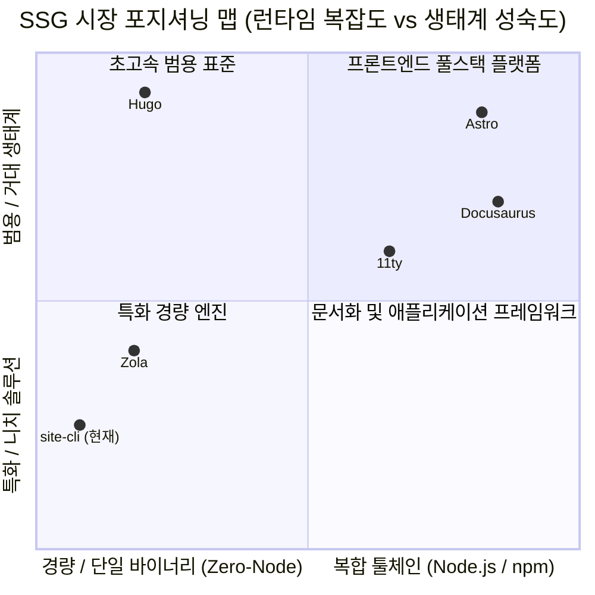
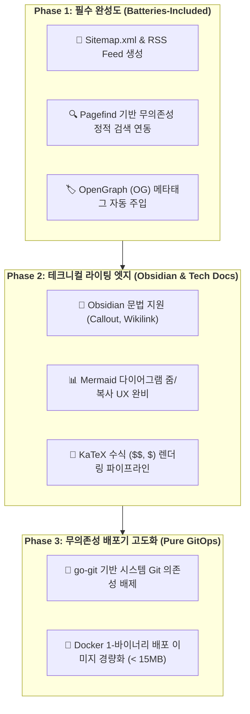

# `site-cli` 시장 비교 분석 및 전략적 포지셔닝 (Competitive Analysis & Strategic Positioning)

본 문서는 `site-cli` 정적 사이트 생성기(SSG)의 시장 내 위치를 객관적으로 진단하고, 기존 성숙 툴(Hugo, Astro, Zola 등)과의 기술적 차별성, 대외 홍보 타당성, 그리고 향후 집중해야 할 니치(Niche) 기능 개선 로드맵을 정의합니다.

---

## 1. 개요 및 분석 목적

`site-cli`는 Go 언어로 구현된 순수 정적 사이트 생성기이자 GitHub Pages 원클릭 배포 도구입니다. 본 분석은 다음 3가지 핵심 질문에 답하기 위해 작성되었습니다:

1. **외부 홍보 타당성**: 이미 성숙한 SSG가 다수 존재하는 시장에서, 본 프로젝트를 오픈소스로 외부에 적극 홍보할 실익이 있는가?
2. **시장 도구 비교**: 기존 주요 도구(Hugo, Astro, Zola, 11ty, Docusaurus 등) 대비 `site-cli`의 강점과 한계는 무엇인가?
3. **독자적 영역(Niche) 확보 여지**: 리소스를 과도하게 쓰지 않으면서도 `site-cli`만의 차별화된 가치를 창출할 수 있는 기능 개선 방향은 무엇인가?

---

## 2. 시장 주요 SSG 종합 비교 분석

### 상세 기능 및 아키텍처 비교표

| 도구명 | 기반 언어 | 런타임 종속성 | 빌드 속도 | 템플릿/컴포넌트 모델 | 주요 타깃 및 강점 | 주요 한계 및 단점 |
| :--- | :--- | :--- | :--- | :--- | :--- | :--- |
| **Hugo** | Go | **없음** (단일 바이너리) | **압도적** (밀리초 단위) | Go `html/template` | • 10년 이상 검증된 초고속 엔진 • 수천 개 테마 생태계 • 이미지 파이프라인/파이프 내장 | • Go 템플릿의 난해한 러닝커브 • 과도하게 복잡한 설정 구조 • 템플릿 수정 및 커스텀의 고통 |
| **Astro** | JS/TS | **Node.js / npm** | 빠름 | Astro 컴포넌트, React, Vue, Svelte | • 최고의 개발자 경험(DX) • 아일랜드 아키텍처 (Zero-JS 기본) • 타입 안전한 Content Collections | • 무거운 `node_modules` 관리 • Node.js 런타임 업데이트 피로도 • CI/CD 빌드 시간 상대적 증가 |
| **Zola** | Rust | **없음** (단일 바이너리) | 매우 빠름 | Tera (Jinja2 / Django 계열) | • 단일 바이너리, 설정 단순성 • Sass 컴파일/문법 강조 기본 내장 • 직관적인 템플릿 문법 | • 테마 생태계 빈약 • 플러그인 확장 체계 부재 • Rust 기반 수정 난이도 |
| **11ty** | JS | **Node.js** | 보통~빠름 | Liquid, Nunjucks, MD 등 다양 | • 극단적인 유연성과 순수 정적 지향 • 불필요한 클라이언트 번들 배제 • 점진적 커스텀 용이 | • 정형화된 표준 틀 부재 • 프로젝트마다 보일러플레이트 세팅 필요 |
| **Docusaurus** | React | **Node.js / npm** | 보통 (Webpack/Vite) | React (MDX) | • 기술 문서화(Doc)의 표준 • 문서 버전 관리 및 Algolia 검색 완비 • 풍부한 React 컴포넌트 생태계 | • 순수 블로그용으로는 과도하게 무거움 • 큰 번들 사이즈 및 런타임 JS 비용 |
| **`site-cli`** | Go | **없음** (단일 바이너리) | 매우 빠름 (밀리초) | Go `html/template` + `messages.yaml` | • **Node.js 없는 완벽한 Zero-Ops** • **3계층 엄격 격리 (Template un-embed)** • **UI 메시지 외재화 및 i18n 기본 내장** • **GitOps Pages 배포기 단일 바이너리 통합** • **AI 코딩 에이전트 친화적 아키텍처** | • 플러그인/테마 생태계 부재 • SEO 도구(RSS, Sitemap) 미구현 • 정적 인덱스 클라이언트 검색 부재 • 에셋 파이프라인(CSS/이미지 압축) 미비 |

---

## 3. `site-cli` 현실적 진단: 강점 vs 약점

### 3.1 확고한 경쟁력 (Core Advantages)

1. **완전한 의존성 제로 (Zero-Dependency & Zero-Ops)**:
   - `package.json`, `node_modules`, npm 보안 취약점 경고로부터 100% 자유롭습니다.
   - 단 하나의 Go 바이너리로 마크다운 파싱 ➔ HTML 컴파일 ➔ 로컬 개발 서버(SSE 기반 핫 리로드) ➔ GitHub Pages 격리 배포(`gh-pages` 오펀 푸시)까지 원스톱으로 처리합니다.
2. **3계층 엄격 격리 및 템플릿 독립성**:
   - 템플릿이나 에셋을 Go 바이너리에 내장(`//go:embed`)하지 않고 로컬 디렉터리(`templates/`)에서 읽어 컴파일합니다. 사용자가 디자인을 바꿀 때 Go 코드를 재컴파일할 필요가 없습니다.
3. **UI 메시지 완전 외재화 (Message Externalization & i18n)**:
   - UI 텍스트 하드코딩이 0%이며, `messages.yaml`과 `messages_en.yaml`을 통해 다국어 지원과 카피라이팅 변경을 코어 코드 변경 없이 수행합니다.
4. **결정론적 AI 에이전트 친화성 (Agent-Friendly by Design)**:
   - 엄격한 Frontmatter 유효성 검증(Fail-Fast), 명확한 모듈화, [OKF 스펙 마스터 인덱스](../okf/site-cli.md)를 갖추고 있어 Antigravity, Cursor, Claude Code 등의 AI 에이전트가 글을 작성하거나 코드를 수정할 때 사이트를 파손할 위험이 극히 낮습니다.

### 3.2 상용 툴 대비 한계 및 약점 (Critical Gaps)

1. **SEO 및 배포 기반 메타데이터 파이프라인 미비**:
   - `sitemap.xml`, `feed.xml` (RSS/Atom), `robots.txt`, OpenGraph(OG) 메타태그 자동 생성이 아직 빌더에 내장되지 않았습니다.
2. **클라이언트 사이드 정적 검색(Search) 부재**:
   - 포스트 수가 50~100편 이상 누적될 때 필수적인 오프라인 전문 검색(Full-text Search, 예: Pagefind 연동)이 없습니다.
3. **에셋 파이프라인 부재**:
   - Tailwind CSS 번들링이나 SCSS 컴파일, 이미지 WebP 자동 변환, `srcset` 생성 기능이 없어 순수 정적 파일 카피에 의존합니다.

---

## 4. 전략적 판단: 대외 홍보 및 시간 투자 방향

### 4.1 "범용 SSG"로서의 전면 홍보: [비추천 (Low ROI)]
* Hugo, Astro가 이미 선점한 범용 정적 사이트 빌더 시장에서 단순한 "또 하나의 마크다운 블로그 툴"로 경쟁하는 것은 승산이 희박합니다.
* 수많은 테마를 지원하기 위한 템플릿 추상화 엔진이나 복잡한 플러그인 시스템을 구축하는 데 많은 시간을 쏟는 것은 유지보수 비용 대비 실익이 없습니다.

### 4.2 "특화 아키텍처 쇼케이스 & 기술 포트폴리오": [강력 추천 (High Value)]
* **홍보 및 공개 방식의 전환**: 도구 자체가 아니라 **"소프트웨어 공학 원칙(3계층 격리, Fail-Fast, 하네스 엔지니어링)을 실증한 순수 Go 정적 사이트 엔진"**이라는 기술적 스토리를 강조합니다.
* **타깃 오디언스**:
  * Node.js 의존성과 거대한 `node_modules`에 피로감을 느끼는 미니멀리스트 Gopher / C-Level 엔지니어.
  * Obsidian 등 로컬 마크다운 지식 도구에서 작성한 글을 0초 만에 깨짐 없이 GitHub Pages로 동기화하고 싶은 테크 라이터.
  * AI 코딩 에이전트와 페어 프로그래밍으로 기술 블로그를 운영하려는 개발자.

---

## 5. 실용적 니치(Niche) 기능 개선 로드맵

Hugo/Astro와의 소모적인 기능 경쟁을 피하고, 최소한의 공수로 독자적 영역을 구축하기 위한 우선순위별 기능 로드맵입니다.

### 1단계: 필수 블로그 인프라 완성 (투자 대비 효용 극대)
* **`sitemap.xml` 및 `feed.xml` 자동 생성**: 포스트 메타데이터 기반으로 빌드 시점에 즉시 생성하여 SEO 완성.
* **[Pagefind](https://pagefind.app/) 기반 정적 검색 지원**: 빌드 산출물(`dist/`)에 대해 Pagefind 인덱스를 생성하고, UI에 10KB 미만의 초경량 오프라인 검색 모달 연동.
* **OpenGraph 메타태그 자동화**: 소셜 미디어 및 슬랙 링크 공유 시 썸네일과 디스크립션 자동 렌더링.

### 2단계: 테크 라이터 특화 기능 (Obsidian & 기술 문서)
* **Obsidian 호환 파서 확장**: `![[image.png]]`, `[[post-slug]]`, `> [!NOTE]` 콜아웃을 표준 GFM으로 안전하게 트랜스파일.
* **코드 블록 및 다이어그램 UX**: Mermaid 클릭 확대 모달, 원클릭 코드 복사 버튼 표준 컴포넌트화.

### 3단계: 피해야 할 오버엔지니어링 영역 (Out of Scope)
* ❌ 복잡한 플러그인 아키텍처 개발 (WASM 런타임, 동적 공유 라이브러리 등)
* ❌ 자체 CSS 전처리기(Sass/PostCSS) 및 JS 번들러 구현 (CDN 또는 단순 CSS 사용 유지)
* ❌ 수백 개의 상용 테마를 지원하기 위한 과도한 설정 파일(Config) 비대화

---

## 6. 결론 요약

`site-cli`는 **"범용 대중 툴"로 확장하기보다는 "엔지니어링 원칙과 실용성을 극대화한 독자적 테크니컬 퍼블리싱 엔진"**으로 남겨두고 완성도를 다듬는 것이 가장 현명한 전략입니다.

1. **시간 투자 최소화**: 대규모 기능 추가를 지양하고, **Sitemap/RSS**, **정적 검색(Pagefind)** 등 본인의 블로그 운영 생산성을 높여주는 핵심 기능만 선별 구현합니다.
2. **포트폴리오 브랜딩**: "AI 에이전트와 소프트웨어 공학 기율을 결합한 Headless SSG"라는 기술 아티클 및 오픈소스 저장소로 공개하여 아키텍처 설계 역량을 증명하는 자산으로 활용합니다.
