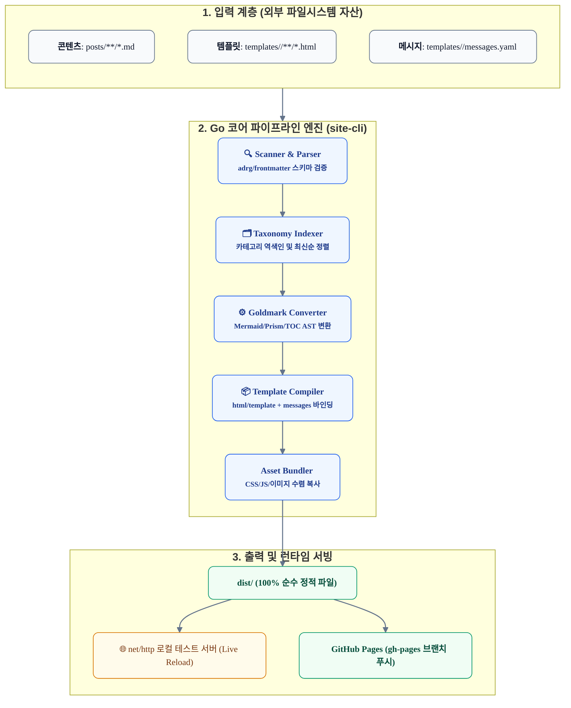
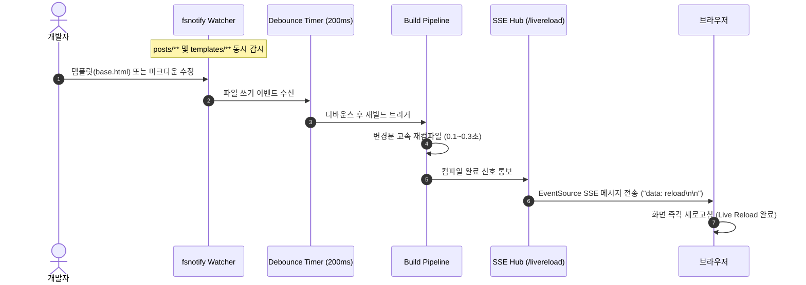

# GitHub Pages 정적 배포 애플리케이션 상세 설계서 (Go-Native DDS)

본 문서는 [`technical-requirements.md`](./technical-requirements.md)의 기능 및 비기능 요구사항을 구현하기 위해 **Go(Golang) 언어의 생태계 및 표준 관용구(Idiomatic Go)**를 기반으로 작성된 상세 설계 명세서입니다.

---

## 1. 아키텍처 개요 및 설계 원칙

본 애플리케이션은 **"콘텐츠(Markdown) ➔ 코어 엔진(Go CLI/SSG) ➔ 템플릿(UI/UX/메시지)"**의 3계층 책임을 엄격히 격리하는 **파이프라인 아키텍처(Pipes and Filters Architecture)**를 채택합니다.



### 핵심 설계 원칙

1. **외부 파일시스템 기반 템플릿 참조 (No Binary Embedding)**:
   * **사용자 커스터마이징 보장**: 템플릿(HTML, CSS, `messages.yaml`)을 Go 바이너리 내부에 고정(Embed)하지 않고, **로컬 파일시스템 디렉터리(`templates/<theme-name>/`)에서 100% 직접 읽어 파싱**합니다. 사용자는 소스 코드 재컴파일 없이 언제든 템플릿과 메시지를 자유롭게 수정할 수 있습니다.
   * **다중 테마 지원 (`--theme`)**: `templates/default`, `templates/minimal` 등 복수 테마 디렉터리를 두고 CLI 옵션을 통해 전환할 수 있습니다.
2. **단일 정적 바이너리 & Zero 런타임 의존성**:
   * Node.js나 무거운 런타임 종속성(`node_modules`) 없이, Go 컴파일러가 생성한 단일 실행 바이너리(`site-cli`)만으로 구동됩니다.
3. **듀얼 파일 감시(Watch) 기반 Live Reload**:
   * 로컬 서빙(`serve`) 모드 구동 시 `posts/**`뿐만 아니라 **`templates/**` 하위의 모든 파일 변경도 실시간 감시**하여, 마크다운 수정이나 UI 템플릿 수정 시 브라우저가 즉시 새로고침됩니다.

---

## 2. Go 기술 스택 및 오픈소스 라이브러리 선정

Hugo와 유사한 경량성과 압도적인 컴파일 속도를 달성하기 위해 Go 표준 라이브러리 및 검증된 오픈소스를 채택합니다.

| 역할 | 채택 라이브러리 | 선정 사유 및 기술적 이점 |
| :--- | :--- | :--- |
| **CLI 프레임워크** | `github.com/spf13/cobra` | Go CLI의 사실상 표준. 서브커맨드(`serve`, `build`, `deploy`), 플래그 관리 우수 |
| **Frontmatter 파서** | `github.com/adrg/frontmatter` | YAML 헤더를 Go 구조체로 즉시 언마샬링하고 본문 마크다운 바이트를 고속 분리 |
| **Markdown 파서** | `github.com/yuin/goldmark` | Hugo 공식 채택 파서. CommonMark 표준 준수, AST 확장 훅 및 커스텀 렌더러 지원 |
| **YAML 파서** | `gopkg.in/yaml.v3` | `messages.yaml` 및 사이트 설정 파일 파싱 |
| **HTML 템플릿** | Go 표준 `html/template` | 외부 의존성 없는 표준 패키지. 컨텍스트 기반 XSS 이스케이프 및 블록 템플릿 지원 |
| **파일 변경 감지** | `github.com/fsnotify/fsnotify` | OS 네이티브(Inotify/Kqueue) 이벤트 감지 기반 고성능 디바운스 워처 |
| **로컬 웹 서버** | Go 표준 `net/http` | 초경량 멀티스레드 정적 파일 서빙 및 SSE(Server-Sent Events) 브로드캐스트 |

---

## 3. Go 도메인 데이터 모델 (`internal/model`)

### 3.1 포스트 및 메타데이터 구조체

```go
package model

// Frontmatter 포스트 헤더 메타데이터
type Frontmatter struct {
	Title         string   `yaml:"title"`                   // 포스트 제목 (필수)
	Category      string   `yaml:"category"`                // 대분류 카테고리 (필수)
	Tags          []string `yaml:"tags,omitempty"`          // 소분류 태그 목록
	CreatedDate   string   `yaml:"created_date"`            // 작성일 YYYY-MM-DD (필수, 정렬 키)
	PublishedDate string   `yaml:"published_date,omitempty"`// 발행일 YYYY-MM-DD
	Summary       string   `yaml:"summary,omitempty"`       // 카드 미리보기 요약문
	Thumbnail     string   `yaml:"thumbnail,omitempty"`     // 대표 썸네일 이미지 경로
	Status        string   `yaml:"status,omitempty"`        // "published" | "draft"
}

// TOCItem 마크다운 본문 목차 앵커 항목
type TOCItem struct {
	ID    string // H2/H3 슬러그 앵커 ID
	Text  string // 헤딩 텍스트
	Level int    // 2 (H2) or 3 (H3)
}

// Post 단일 포스트 완전 모델
type Post struct {
	ID                 string      // 고유 식별자 (slug 기반)
	Slug               string      // URL 경로 슬러그 (예: redefining-ai-autonomy)
	FilePath           string      // 원천 마크다운 파일 경로
	Frontmatter        Frontmatter // 파싱된 메타데이터
	RawContent         []byte      // 순수 마크다운 본문
	HTMLContent        string      // 렌더링된 HTML 본문 (template.HTML 안전 처리)
	TOC                []TOCItem   // 추출된 목차 트리
	ReadingTimeMinutes int         // 예상 읽기 시간
}
```

### 3.2 카테고리 및 색인 모델

```go
package model

// Category 카테고리 그룹핑 모델
type Category struct {
	Name      string  // 원본 카테고리명 (예: "Agentic AI")
	Slug      string  // URL 정제 슬러그 (예: "agentic-ai")
	PostCount int     // 소속 포스트 수
	Posts     []*Post // 최신순 정렬된 포스트 포인터 슬라이스
}

// TaxonomyIndex 전체 카테고리 역색인 맵
type TaxonomyIndex struct {
	AllPosts    []*Post              // 전체 포스트 목록 (CreatedDate DESC)
	Categories  []*Category          // 전체 카테고리 슬라이스 (메뉴 렌더링용)
	CategoryMap map[string]*Category // 슬러그 기반 O(1) 검색 맵
}
```

### 3.3 메시지 리소스 번들 모델 (`messages.yaml` 매핑)

```go
package model

// MessageBundle UI 정적 텍스트 리소스 맵
type MessageBundle struct {
	Common map[string]string `yaml:"common"`
	Nav    map[string]string `yaml:"nav"`
	Card   map[string]string `yaml:"card"`
	Detail map[string]string `yaml:"detail"`
	Empty  map[string]string `yaml:"empty"`
	Footer map[string]string `yaml:"footer"`
}
```

### 3.4 템플릿 컴파일 컨텍스트 모델

```go
package model

import "html/template"

// TemplateContext html/template 렌더링 시 주입되는 컨텍스트
type TemplateContext struct {
	SiteTitle      string
	SiteSubtitle   string
	BaseURL        string
	CurrentPath    string
	Messages       MessageBundle // messages.yaml 데이터
	Categories     []*Category   // 전체 카테고리 목록 (네비게이션용)
	ActiveCategory *Category     // 현재 선택된 활성 카테고리 (목록 페이지)
	Posts          []*Post       // 포스트 카드 그리드용 목록
	Post           *Post         // 단일 포스트 상세 데이터 (상세 페이지)
	TOC            []TOCItem     // 목차 트리 (상세 페이지)
	ExtraHead      template.HTML // Live Reload 스크립트 등
}
```

---

## 4. 핵심 모듈별 Go 구현 상세 설계

### 4.1 Scanner & Parser 모듈 (`internal/parser`)

* **경로**: `internal/parser/frontmatter.go`, `internal/parser/slug.go`
* **세부 로직**:
  1. `filepath.WalkDir`를 사용하여 `posts/` 하위의 모든 `.md` 파일 재귀 탐색.
  2. `adrg/frontmatter.Parse(r, &fm)`를 호출하여 메타데이터와 본문 바이트 분리.
  3. **유효성 검증 규칙**:
     * `fm.Title == ""` 또는 `fm.Category == ""`인 경우 빌드 중단(`error` 반환).
     * `fm.CreatedDate`가 `^\d{4}-\d{2}-\d{2}$` 형식이 아닐 경우 에러 반환.
  4. **슬러그 생성 알고리즘**:
     * 파일명 `2026-09-26-my-post.md`에서 날짜 접두어를 분리하고 영문 소문자/하이픈 정규식(`[^a-z0-9\-]+`)으로 치환.
  5. **드래프트 필터링**:
     * `opts.IncludeDrafts == false`이고 `fm.Status == "draft"`인 경우 수집 대상에서 제외.

---

### 4.2 Taxonomy Indexer 모듈 (`internal/taxonomy`)

* **경로**: `internal/taxonomy/indexer.go`
* **세부 로직**:
  1. 전체 포스트를 `CreatedDate` 기준 내림차순(최신순) 정렬:
     ```go
     sort.Slice(posts, func(i, j int) bool {
         return posts[i].Frontmatter.CreatedDate > posts[j].Frontmatter.CreatedDate
     })
     ```
  2. `frontmatter.Category`를 키로 `CategoryMap`에 포스트 포인터 추가 및 `PostCount++`.
  3. '전체 보기(All Posts)' 메뉴 생성을 위한 가상 카테고리 구성 (`Slug: "all"`, `PostCount: len(posts)`).

---

### 4.3 Markdown Converter 모듈 (`internal/markdown`)

* **경로**: `internal/markdown/converter.go`
* **Goldmark AST 확장 및 커스텀 렌더러**:
  1. **Mermaid 코드 블록 감지**:
     * CodeBlock 노드 탐색 시 `Language == "mermaid"`인 경우:
       ```html
       <div class="mermaid-container my-8 p-6 rounded-lg border border-[var(--color-border-subtle)] bg-white shadow-md flex flex-col items-center justify-center overflow-x-auto">
         <div class="mermaid-raw" style="display: none;">{raw_mermaid_code}</div>
       </div>
       ```
     * 브라우저 런타임(`app.js`)에서 CDN Mermaid 라이브러리가 해당 노드를 찾아 SVG로 렌더링하고 클릭 시 `zoom-modal` 연결.
  2. **PrismJS 구문 강조 클래스 매핑**:
     * 일반 코드 블록에 `class="language-{lang}"` 속성 부여.
  3. **헤딩 앵커 및 TOC 추출**:
     * `ast.Heading` 노드 순회 시 H2, H3 텍스트를 슬러그화하여 `id="{slug}"` 주입 및 `[]model.TOCItem` 생성.
  4. **이미지 상대 경로 자동 보정**:
     * `posts/assets/image.png` 경로를 최종 배포 경로인 `/assets/images/image.png`로 치환.

---

### 4.4 Template Compiler 모듈 (`internal/template`)

* **경로**: `internal/template/engine.go`
* **외부 파일시스템 기반 템플릿 로드**:
  ```go
  type Engine struct {
      themeDir string // 예: "templates/default"
      messages model.MessageBundle
  }

  func NewEngine(themeDir string) (*Engine, error) {
      // 1. 디렉터리 존재 여부 검증 (바이너리 임베딩 배제)
      if _, err := os.Stat(themeDir); os.IsNotExist(err) {
          return nil, fmt.Errorf("theme directory not found: %s", themeDir)
      }
      // 2. messages.yaml 로드
      msgBytes, err := os.ReadFile(filepath.Join(themeDir, "messages.yaml"))
      if err != nil {
          return nil, err
      }
      var messages model.MessageBundle
      if err := yaml.Unmarshal(msgBytes, &messages); err != nil {
          return nil, err
      }
      return &Engine{themeDir: themeDir, messages: messages}, nil
  }
  ```
* **컴파일 대상 및 출력 매핑**:
  1. **메인 페이지**: `dist/index.html` ➔ 전체 포스트 카드 목록 렌더링.
  2. **카테고리별 페이지**: `dist/category/{slug}/index.html` ➔ 해당 카테고리 포스트 카드만 렌더링.
  3. **포스트 상세 페이지**: `dist/posts/{slug}/index.html` ➔ 마크다운 본문, 목차(TOC), Mermaid 줌 모달 스크립트 포함.
  4. **에셋 동기화**: `templates/<theme>/assets/` 및 `posts/assets/`를 `dist/assets/`로 고속 파일 복사(`io.Copy`).

---

### 4.5 Local Dev Server & Live Reload 모듈 (`internal/server`)

* **경로**: `internal/server/server.go`, `internal/server/watcher.go`
* **듀얼 감시(FS Watcher) 및 SSE 브로드캐스트**:



* **Live Reload 클라이언트 주입**:
  * `site-cli serve` 모드에서는 `TemplateContext.ExtraHead`에 인라인 스크립트를 주입:
    ```html
    <script>
      new EventSource('/livereload').onmessage = function(e) {
        if (e.data === 'reload') window.location.reload();
      };
    </script>
    ```

---

### 4.6 Deployer 모듈 (`internal/deployer`)

* **경로**: `internal/deployer/git.go`
* **무중단 Orphan Git 브랜치 배포 알고리즘**:
  1. `dist/` 빌드 완료 및 무결성 확인.
  2. `dist/CNAME` 파일 생성 (내용: `www.joinc.co.kr`).
  3. Go `os/exec`를 통해 배포 작업 수행:
     ```bash
     # 임시 git 인덱스를 사용하여 배포 브랜치만 깔끔히 업데이트
     git --work-tree=dist checkout --orphan gh-pages-temp
     git --work-tree=dist add -A
     git --work-tree=dist commit -m "deploy: publish static site via site-cli"
     git push origin gh-pages-temp:gh-pages --force
     ```
  4. 로컬 작업 브랜치에는 어떠한 불필요한 커밋도 남기지 않고 원격 `gh-pages`만 100% 갱신.

---

## 5. Go 표준 프로젝트 레이아웃 명세

```text
app/github-pages/
├── cmd/
│   └── site-cli/
│       └── main.go                     # Cobra 루트 커맨드 진입점
├── internal/
│   ├── cli/                            # CLI 서브커맨드 구현부
│   │   ├── root.go                     # 글로벌 플래그 (--theme, --clean)
│   │   ├── serve.go                    # 'serve' 로컬 서버 및 Live Reload
│   │   ├── build.go                    # 'build' 프로덕션 컴파일
│   │   ├── deploy.go                   # 'deploy' GitHub Pages 푸시
│   │   └── categories.go               # 'list-categories' 통계 출력
│   ├── model/                          # 공통 데이터 구조체
│   │   └── types.go                    # Post, Category, MessageBundle 등
│   ├── parser/                         # 마크다운 & Frontmatter 파서
│   │   ├── frontmatter.go
│   │   └── slug.go
│   ├── taxonomy/                       # 카테고리 색인 엔진
│   │   └── indexer.go
│   ├── markdown/                       # Goldmark AST 렌더러
│   │   ├── converter.go
│   │   ├── mermaid.go
│   │   └── toc.go
│   ├── template/                       # html/template 엔진
│   │   ├── engine.go                   # 파일시스템 템플릿 컴파일러
│   │   └── messages.go                 # messages.yaml 로더
│   ├── server/                         # 로컬 개발 서버
│   │   ├── http.go                     # net/http 정적 파일 서빙
│   │   ├── sse.go                      # Live Reload SSE 브로드캐스터
│   │   └── watcher.go                  # fsnotify 듀얼 파일 감시자
│   └── deployer/                       # 배포 엔진
│       └── git.go                      # Git gh-pages 푸시 로직
├── templates/                          # 외부 템플릿 디렉터리 (사용자 편집 가능)
│   └── default/
│       ├── messages.yaml               # UI 정적 메시지 리소스 번들
│       ├── base.html                   # HTML 기본 스켈레톤 레이아웃
│       ├── components/
│       │   ├── nav.html                # 카테고리 메뉴
│       │   ├── card.html               # 포스트 카드 그리드 아이템
│       │   ├── detail.html             # 본문 뷰어
│       │   └── toc.html                # 플로팅 목차
│       └── assets/
│           ├── style.css               # Tailwind CSS 번들
│           └── app.js                  # Mermaid 런타임 & 줌 모달 스크립트
├── docs/                               # 설계 및 사양 문서
│   ├── planning.md
│   ├── technical-requirements.md
│   └── detailed-design.md              # 본 상세 설계서
├── go.mod
├── go.sum
├── Makefile                            # 빌드 타깃 스크립트
└── README.md
```

---

## 6. 에러 핸들링 및 예외 처리 가이드라인

1. **템플릿 누락 예외**:
   * 지정된 테마 디렉터리(`templates/<theme>/`)나 필수 템플릿 파일(`base.html`, `messages.yaml`)이 디스크에 없으면 `Exit Code 1`과 함께 사용자에게 누락 경로를 명확히 출력.
2. **Frontmatter 검증 실패**:
   * `title`, `category`, `created_date` 누락 시 즉시 파일 경로와 필드명을 붉은색 콘솔 에러로 안내.
3. **포트 충돌 자동 회피**:
   * `serve` 실행 시 `8080` 포트가 점유되어 있으면 에러로 죽지 않고 `8081`, `8082`로 자동 증가하여 바인딩.
4. **Mermaid 문법 에러 격리**:
   * 다이어그램 문법 오류 시 컴파일러 크래시를 방지하고, 브라우저에 원본 텍스트와 붉은색 문법 에러 박스를 렌더링하여 사용자에게 피드백 제공.
