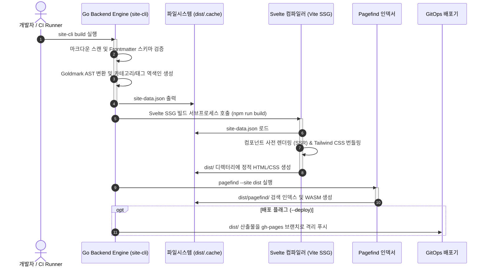
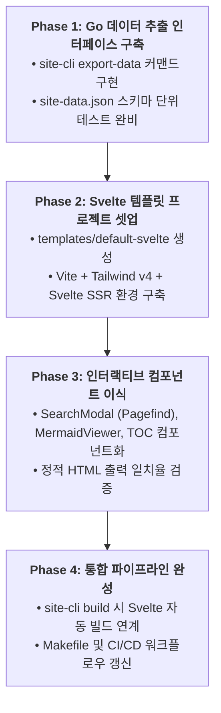

# Go Backend & Svelte 기반 하이브리드 SSG 아키텍처 설계서

본 문서는 `site-cli`를 기존의 일체형(Monolithic) Go 템플릿 방식에서, **Go 기반의 고성능 데이터 컴파일러(Backend)**와 **Svelte 기반의 모던 컴포넌트 프리렌더러(Frontend)**로 분리·결합하는 차세대 하이브리드 정적 사이트 생성기(SSG) 아키텍처 사양을 정의합니다.

---

## 1. 아키텍처 개요 및 설계 철학

```mermaid
flowchart LR
    classDef default font-family:Pretendard,sans-serif,font-size:13px;
    classDef content fill:#f8fafc,stroke:#64748b,color:#0f172a,rx:8px;
    classDef go fill:#eff6ff,stroke:#2563eb,color:#1e3a8a,font-weight:bold,rx:8px;
    classDef json fill:#faf5ff,stroke:#9333ea,color:#581c87,stroke-dasharray: 4 4,font-weight:bold,rx:8px;
    classDef svelte fill:#fff7ed,stroke:#ea580c,color:#9a3412,font-weight:bold,rx:8px;
    classDef out fill:#f0fdf4,stroke:#059669,color:#064e3b,font-weight:bold,rx:8px;

    C["📄 <b>마크다운 콘텐츠</b><br/><small>posts/**/*.md</small>"]:::content
    G["⚙️ <b>Go Backend Engine</b><br/><small>site-cli (파싱 & 데이터 검증)</small>"]:::go
    J[("📦 <b>정규화된 계약 데이터</b><br/><small>site-data.json (SSOT)</small>")]:::json
    S["🎨 <b>Svelte Presentation Engine</b><br/><small>Vite + Svelte SSR 컴포넌트</small>"]:::svelte
    O["🌐 <b>100% 순수 정적 산출물</b><br/><small>dist/ (HTML, CSS, Assets)</small>"]:::out

    C --> G
    G -->|"데이터 파이프라인"| J
    J -->|"SSG 빌드 인풋"| S
    S --> O
```



### 1.1 핵심 설계 목표
1. **역할과 책임의 완벽한 분리 (Headless Architecture)**:
   - **Go (Backend)**: 고속 파일 I/O, 마크다운 AST 파싱, Frontmatter 엄격 검증(Fail-Fast), 카테고리/태그 역색인, GitOps 브랜치 배포를 전담합니다.
   - **Svelte (Frontend)**: UI 컴포넌트 캡슐화, 반응형 인터랙션(검색, 모달, 다크모드), CSS 최적화(Tailwind 번들링), SEO 친화적 정적 HTML 사전 렌더링(SSR)을 전담합니다.
2. **런타임 무운영 유지 (Zero Runtime Ops & 100% Pure Static)**:
   - 빌드 과정에서 Node.js/Vite를 활용하지만, **최종 산출물은 런타임 서버나 무거운 프레임워크 런타임이 없는 100% 순수 정적 HTML/CSS/JS**로 컴파일되어 GitHub Pages로 배포됩니다.
3. **Vanilla JS 스파게티 부채 청산**:
   - `base.html`에 산재하던 절차적 DOM 조작 코드(Mermaid 줌, KaTeX, 언어 추천 배너 등)를 완전히 독립된 Svelte 컴포넌트로 격리합니다.

---

## 2. 시스템 파이프라인 및 데이터 인터페이스 (Data Contract)

Go 백엔드 엔진과 Svelte 프론트엔드는 파일시스템 기반의 엄격한 JSON 계약(Contract)인 `site-data.json`을 매개로 통신합니다.

### 2.1 E2E 빌드 파이프라인 단계



### 2.2 `site-data.json` 데이터 계약 스키마
```json
{
  "version": "1.0.0",
  "generated_at": "2026-10-09T19:40:00Z",
  "site": {
    "title": "Joinc AI Tech Blog",
    "base_url": "/",
    "current_lang": "ko",
    "languages": ["ko", "en"]
  },
  "messages": {
    "common": { "site_title": "Joinc", "back_to_list": "목록으로 돌아가기" },
    "nav": { "all_posts": "전체 포스트", "categories_title": "카테고리" }
  },
  "categories": [
    {
      "name": "Harness Engineering",
      "slug": "harness-engineering",
      "post_count": 4
    }
  ],
  "posts": [
    {
      "id": 13,
      "slug": "2026-08-06-sdlc-harness-engineering-part1-discovery",
      "title": "[SDLC 하네스 엔지니어링] 1부: AI 코딩 전 What & Why 정의하기",
      "description": "생성형 AI 시대에 무분별한 코드 작성으로 인한 기술 부채를 방지하기 위해...",
      "category": "Harness Engineering",
      "date": "2026-08-06",
      "created_date": "2026-08-06",
      "tags": ["Generative AI", "Harness Engineering"],
      "lang": "ko",
      "alternate_url": "/en/posts/2026-08-06-sdlc-harness-engineering-part1-discovery/",
      "reading_time_min": 8,
      "toc": [
        { "id": "harness-engineering-intro", "text": "들어가며", "level": 2 }
      ],
      "html_content": "<p>본 연재는 실제 기술 플랫폼...</p>"
    }
  ]
}
```

---

## 3. Go 백엔드 엔진 리팩토링 스펙

### 3.1 신규 서브커맨드 및 플래그 추가
* `site-cli export-data --output <path>`:
  - 템플릿 컴파일 없이 마크다운 파싱 및 역색인 결과만 `site-data.json`으로 고속 출력.
* `site-cli build`:
  - 1단계: `site-data.json` 생성.
  - 2단계: 프론트엔드 빌드 툴(`npm run build` or `bun run build`) 자동 연동 트리거.
  - 3단계: `pagefind` 검색 인덱스 생성.
* `site-cli serve`:
  - `fsnotify`로 마크다운 변경 감지 시 `site-data.json` 갱신.
  - Svelte Vite Dev Server와 프록시 연동하여 실시간 HMR(Hot Module Replacement) 지원.

---

## 4. Svelte 프레임워크 템플릿 아키텍처

### 4.1 디렉터리 구조 (`templates/default-svelte/`)
```text
templates/default-svelte/
├── package.json               # Svelte 5, Vite, Tailwind CSS 의존성
├── svelte.config.js
├── vite.config.ts             # Static Pre-rendering (SSG) 설정
├── src/
│   ├── app.css                # Tailwind CSS v4 진입점
│   ├── components/            # 완전 캡슐화된 독립 UI 컴포넌트
│   │   ├── Header.svelte      # 네비게이션 및 다국어 토글
│   │   ├── Footer.svelte      # 저작권 및 푸터 링크
│   │   ├── PostCard.svelte    # 블로그 목록 포스트 카드
│   │   ├── CategoryNav.svelte # 사이드바 카테고리 메뉴
│   │   ├── SearchModal.svelte # Pagefind 바인딩 모달 UI
│   │   ├── MermaidViewer.svelte # 다이어그램 렌더링 및 클릭 줌 모달
│   │   ├── KaTeX.svelte       # 수식 렌더러
│   │   └── TOC.svelte         # 목차 및 스크롤스파이(Scrollspy)
│   ├── layouts/
│   │   └── BaseLayout.svelte  # 공통 헤더/푸터 및 메타데이터 레이아웃
│   ├── pages/
│   │   ├── Index.svelte       # 전체 포스트 목록 메인
│   │   ├── Detail.svelte      # 포스트 상세 읽기 뷰
│   │   ├── Category.svelte    # 카테고리별 아카이브 뷰
│   │   └── Page.svelte        # About 등 일반 정적 페이지
│   └── entry-ssg.ts           # 빌드 타임 정적 HTML 추출 엔트리포인트
```

### 4.2 컴포넌트 캡슐화 사례: `MermaidViewer.svelte`
더 이상 `base.html`에 전역 자바스크립트 리스너를 둘 필요 없이, 컴포넌트 내부에서 상태를 완벽히 통제합니다:

```svelte
<script lang="ts">
  import { onMount } from 'svelte';
  export let code: string;

  let container: HTMLDivElement;
  let isZoomed = false;
  let svgHtml = '';

  onMount(async () => {
    // 런타임에 mermaid 라이브러리 동적 로드 및 렌더링
    const mermaid = (await import('mermaid')).default;
    mermaid.initialize({ startOnLoad: false, theme: 'neutral' });
    const { svg } = await mermaid.render(`mermaid-${Math.random().toString(36).substr(2, 9)}`, code);
    svgHtml = svg;
  });
</script>

<div class="mermaid-wrapper my-6 cursor-pointer" on:click={() => isZoomed = true}>
  {@html svgHtml}
  <span class="text-xs text-slate-400">클릭하여 확대</span>
</div>

{#if isZoomed}
  <div class="fixed inset-0 z-50 bg-black/70 flex items-center justify-center p-4" on:click={() => isZoomed = false}>
    <div class="bg-white rounded-xl p-6 max-w-5xl max-h-[90vh] overflow-auto" on:click|stopPropagation>
      {@html svgHtml}
      <button class="mt-4 px-4 py-2 bg-slate-100 rounded-lg text-sm" on:click={() => isZoomed = false}>닫기</button>
    </div>
  </div>
{/if}
```

---

## 5. 검색 및 SEO 인프라 통합 (Pagefind)

1. **본문 검색 범위 지정**:
   - `Detail.svelte` 본문 컨테이너에 `data-pagefind-body` 속성을 선언적으로 부여합니다.
2. **`SearchModal.svelte` 구현**:
   - Pagefind WASM API를 호출하여 입력 키워드에 대한 BM25 연산 결과를 Svelte의 `$state`에 실시간 바인딩합니다.
   - 프레임워크 밖의 외부 DOM 조작 없이, 검색 결과 목록과 스니펫 하이라이팅을 Svelte 컴포넌트로 렌더링합니다.

---

## 6. 단계별 점진적 전환 로드맵 (Migration Plan)

기존 사이트 운영을 중단하지 않고 안전하게 전환하기 위한 4단계 마이그레이션 전략입니다.



* **안전장치 (Fallback)**:
  - `templates/default-light` (기존 Go 템플릿)와 `templates/default-svelte`를 공존시켜, 설정 파일(`config.yaml`)의 `theme` 지정에 따라 언제든 기존 빌드 모드로 즉시 롤백할 수 있도록 격리합니다.
