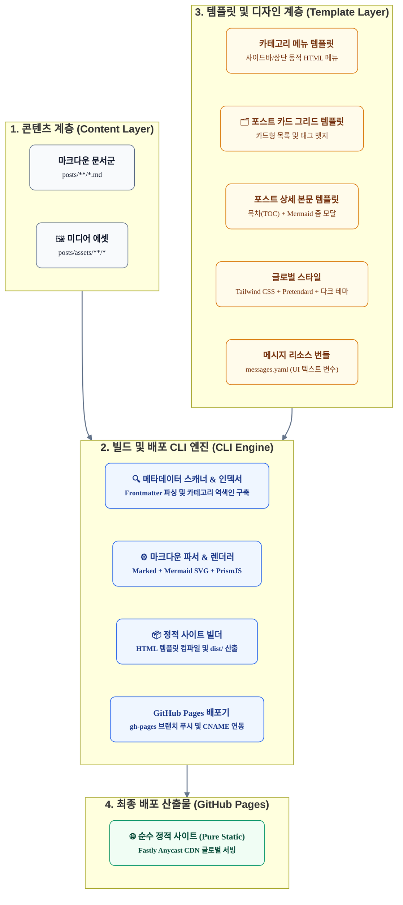
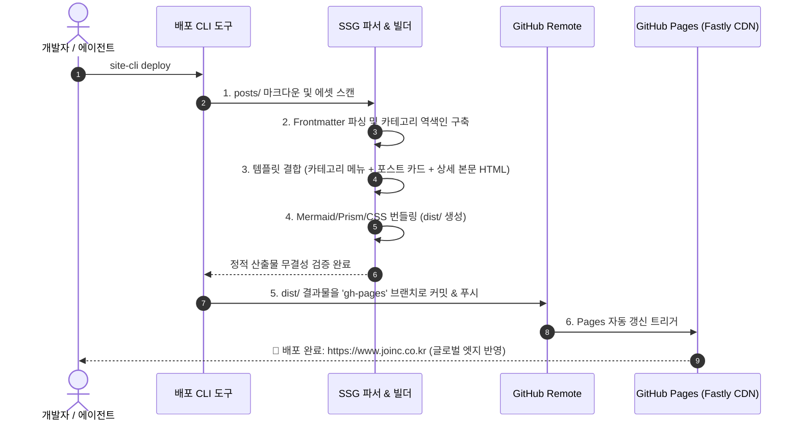

# GitHub Pages 정적 배포 애플리케이션 기획서 (Specification)

본 문서는 `joincdream/ai-info`의 기술 포스트를 마크다운 원본으로부터 순수 정적 페이지(Pure Static HTML/CSS/JS)로 변환하여 GitHub Pages로 배포하는 **CLI 기반 정적 사이트 생성기(SSG) 및 배포 도구**의 기획 및 아키텍처 사양서입니다.

---

## 핵심 기획 방향 및 설계 원칙

1. **CLI 도구 기반의 원클릭 배포 (CLI-Driven GitOps)**:
   * 복잡한 수동 작업 없이, 터미널 명령(`cli deploy` 또는 `npm run deploy`) 하나로 마크다운 파싱 ➔ 정적 HTML 빌드 ➔ GitHub Pages 배포 브랜치(`gh-pages`) 푸시까지 완결합니다.
2. **콘텐츠와 템플릿의 완벽한 분리 (Headless Architecture)**:
   * **콘텐츠(Post)**: 순수 마크다운(`.md`) 및 이미지 에셋으로만 관리되며 특정 UI 프레임워크나 템플릿 문법에 오염되지 않습니다.
   * **디자인(Template)**: HTML, CSS, JavaScript로 구성된 독립된 템플릿/테마 시스템으로, 콘텐츠 수정 없이 테마를 교체하거나 디자인을 자유롭게 고도화할 수 있습니다.
3. **100% 순수 정적 웹 서빙 (Pure Static Pages)**:
   * 백엔드 API 서버나 런타임 데이터베이스가 일체 개입하지 않는 순수 정적 파일(HTML, CSS, Vanilla JS/WASM) 구조를 지향합니다.
4. **메타데이터 기반의 자동 카테고리 분류 및 포스트 카드 렌더링**:
   * 각 포스트의 헤더(Frontmatter) 메타데이터를 스캔하여 **카테고리별 HTML 네비게이션 메뉴**를 자동으로 구성합니다.
   * 카테고리 선택 시 해당 카테고리에 속한 포스트들이 시각적인 **포스트 카드(Post Card)** 그리드로 일목요연하게 출력됩니다.
5. **템플릿 UI 메시지의 완전한 변수 분리 (Message Externalization)**:
   * 템플릿 HTML 내에 '전체 보기', '목차', '검색', '댓글' 등 고정 문자열을 일체 하드코딩하지 않습니다.
   * 모든 UI 텍스트와 안내 문구를 독립된 메시지 리소스 파일(`messages.yaml`)로 분리하여 빌드 타임에 주입함으로써, 템플릿 코드 수정 없는 텍스트 변경 및 다국어 확장을 지원합니다.

---

## 시스템 3계층 아키텍처 (Layered Architecture)



---

## 데이터 명세 및 카테고리 분류 체계

### 1. 포스트 메타데이터 표준 규격 (Frontmatter)

각 마크다운 포스트 최상단에 선언되는 표준 헤더 규격입니다.

```yaml
---
title: "코딩 에이전트의 자율성을 다시 묻다: $0.95^{10}$의 오류 누적과 통제 인프라의 재설계"
category: "Agentic AI"            # 대분류 카테고리 (필수: 카테고리 메뉴 생성 기준)
tags:                            # 소분류 세부 태그 (선택: 필터링 및 뱃지)
  - Generative AI
  - Software Engineering
  - Harness Engineering
created_date: 2026-09-26         # 작성일 (정렬 기준)
published_date: 2026-09-26       # 발행일
summary: "에이전트 자율성을 둘러싼 마케팅적 수사와 소프트웨어 공학 현실 사이의 간극을 데이터 기반으로 분석하고..."
thumbnail: "posts/assets/cover.jpg" # 포스트 카드 대표 이미지 (선택)
status: published                # 상태 (published / draft)
---
```

### 2. 카테고리 인덱싱 및 HTML 메뉴 생성 규칙

* **자동 카테고리 추출 (Taxonomy Extractor)**:
  * 빌드 엔진이 `posts/**`의 모든 마크다운을 스캔하여 `category` 필드값을 고유(Unique) 집합으로 수집합니다.
  * 각 카테고리별 등록된 포스트 수를 집계하여 카테고리 목록을 도출합니다.
* **카테고리 HTML 네비게이션 메뉴 구조**:
  * **전체 보기 (All Posts)**: 전체 포스트 수 표기
  * **카테고리 1 (예: Agentic AI)**: 등록 포스트 수 뱃지
  * **카테고리 2 (예: Architecture)**: 등록 포스트 수 뱃지
  * **카테고리 3 (예: DevOps & Infra)**: 등록 포스트 수 뱃지
* **접근 URL 라우팅 체계**:
  * 메인 인덱스: `/index.html` (전체 포스트 카드 노출)
  * 카테고리별 인덱스: `/category/<category-slug>/index.html` (해당 카테고리 포스트 카드만 필터링 노출)

---

## 템플릿 컴포넌트 명세 (UI/UX 분리)

템플릿은 `app/github-pages/templates/` 디렉터리에 독립되어 존재하며, 디자인 스타일은 기존의 모던 다크 네이비 테마와 Pretendard 타이포그래피를 완벽하게 계승합니다.

### 1. 카테고리 네비게이션 컴포넌트 (`CategoryNav`)
* **역할**: 수집된 카테고리 목록을 좌측 사이드바 또는 상단 네비게이션 바로 렌더링.
* **인터랙션**:
  * 현재 선택된 활성(Active) 카테고리 강조 스타일(Primary Blue 하이라이트).
  * 카테고리 항목마다 포스트 수 카운트 뱃지 표시.

### 2. 포스트 카드 컴포넌트 (`PostCard`)
* **역할**: 카테고리에 속한 글 목록을 시각적인 카드 그리드로 표현.
* **카드 UI 구성 요소**:
  * **커버 썸네일**: 지정된 대표 이미지 (미지정 시 모던 그래디언트 기본 플레이스홀더 제공)
  * **카테고리 뱃지**: 상단에 카테고리 명칭 강조
  * **포스트 제목**: 볼드체 및 마우스 호버 시 컬러 전환
  * **발행 일자**: `YYYY-MM-DD` 포맷
  * **본문 요약문**: 2~3줄 말줄임(`line-clamp-2`) 미리보기
  * **태그 목록**: 하단에 회색 미니 태그 뱃지 나열

```
┌────────────────────────────────────────────────────────┐
│ [ Thumbnail Image / Cover Gradient ]                   │
├────────────────────────────────────────────────────────┤
│ [Agentic AI]                                2026-09-26 │
│                                                        │
│ 코딩 에이전트의 자율성을 다시 묻다: $0.95^10 오류 누적    │
│                                                        │
│ 에이전트 자율성을 둘러싼 마케팅적 수사와 소프트웨어 공학   │
│ 현실 사이의 간극을 데이터 기반으로 분석하고...          │
│                                                        │
│ #Generative AI  #Harness  #SoftwareEngineering         │
└────────────────────────────────────────────────────────┘
```

### 3. 포스트 본문 뷰어 컴포넌트 (`PostDetailView`)
* **역할**: 마크다운 본문을 리치 웹 문서로 렌더링.
* **기술 사양**:
  * **Mermaid 다이어그램**: SVG 렌더링 및 클릭 시 전체 화면 확대 줌 모달 제공.
  * **코드 하이라이팅**: PrismJS Tomorrow Dark 테마 적용.
  * **플로팅 목차 (TOC)**: H2, H3 헤딩 기반 자동 네비게이션 생성.

---

## 템플릿 메시지 및 텍스트 리소스 명세 (Message Externalization)

UI/UX 템플릿의 재사용성과 다국어(i18n) 확장성을 위해, HTML 템플릿 내에 정적 텍스트를 직접 하드코딩하는 것을 전면 배제합니다. 모든 라벨, 버튼명, 안내 문구는 독립된 메시지 리소스 파일(`templates/default/messages.yaml`)에 변수로 선언하고, 빌드 시점에 템플릿으로 주입합니다.

### 1. 메시지 리소스 스키마 (`templates/default/messages.yaml`)

```yaml
# UI 정적 텍스트 및 라벨 리소스 번들
common:
  site_title: "AI Info"
  site_subtitle: "Enterprise AI & Software Engineering Tech Blog"
  search_placeholder: "기술 포스트 검색..."
  read_time_suffix: "분 소요"
  table_of_contents: "목차 (TOC)"
  back_to_list: "전체 포스트 목록으로"
  copy_link: "링크 복사"
  copy_success: "링크가 복사되었습니다!"
  share: "공유하기"

nav:
  home: "홈"
  all_posts: "전체 포스트"
  categories_title: "카테고리"
  tags_title: "주요 태그"
  post_count_unit: "편"

card:
  read_more: "자세히 읽기"
  published_prefix: "발행일:"

detail:
  author_label: "작성자:"
  comments_title: "댓글 및 의견"
  mermaid_zoom_tip: "클릭하면 다이어그램을 확대하여 볼 수 있습니다."

empty:
  no_posts_found: "등록된 기술 포스트가 없습니다."
  no_category_posts: "해당 카테고리에 속한 포스트가 없습니다."

footer:
  copyright: "© 2026 joinc.co.kr. All rights reserved."
  powered_by: "Built with Static GitOps Engine & Hosted on GitHub Pages"
```

### 2. 템플릿 엔진 주입 및 바인딩 규칙

* **빌드 타임 변수 주입 (Compile-time Injection)**:
  * SSG 빌드 엔진이 `messages.yaml`을 파싱하여 글로벌 템플릿 컨텍스트 객체(`messages`)로 주입합니다.
* **HTML 템플릿 바인딩 예시**:
  * 카테고리 헤더: `<h3 class="category-title">{{ messages.nav.categories_title }}</h3>`
  * 전체 보기 링크: `<span>{{ messages.nav.all_posts }}</span>`
  * 검색창 플레이스홀더: `<input placeholder="{{ messages.common.search_placeholder }}" />`
  * 푸터 카피라이트: `<p>{{ messages.footer.copyright }}</p>`
* **엔지니어링 기대 효과**:
  * **디자인과 카피라이팅의 완전한 분리**: 마케팅 문구나 안내 문구를 수정할 때 HTML 템플릿 소스 코드를 건드릴 필요 없이 YAML 파일만 편집.
  * **다국어(i18n) 확장 즉시 대응**: 향후 영문판 사이트가 필요할 경우 `messages.en.yaml` 파일만 추가하면 레이아웃 재작성 없이 영문 사이트 빌드 가능.

---

## CLI 도구 기능 사양 (CLI Engine)

CLI 도구는 개발자의 로컬 환경 및 CI/CD(GitHub Actions) 환경 양쪽에서 구동 가능하도록 설계합니다.

### 1. 명령어 인터페이스 (CLI Command Interface)

| 명령어 | 실행 동작 | 상세 옵션 및 설명 |
| :--- | :--- | :--- |
| **`site-cli serve`** | **로컬 테스트 서버 (Hugo server 유사)** | • 로컬 웹서버 실행 (`http://localhost:8080`)<br/>• `-p, --port <port>`: 포트 지정<br/>• `-D, --drafts`: `status: draft` 포스트 포함 렌더링<br/>• 파일 감지 및 핫 리로드(Live Reload) 지원 |
| **`site-cli build`** | 배포용 정적 사이트 컴파일 | • 마크다운과 템플릿을 결합하여 `dist/`에 정적 HTML/CSS/JS 생성<br/>• `--clean`: 이전 빌드 캐시 및 산출물 정리 |
| **`site-cli deploy`** | GitHub Pages 원클릭 배포 | • 빌드 검증 후 `dist/` 산출물을 `gh-pages` 브랜치로 자동 푸시<br/>• `--cname <domain>`: CNAME 파일 자동 주입 (기본: `www.joinc.co.kr`) |
| **`site-cli list-categories`** | 카테고리 통계 점검 | • 마크다운 파일들의 카테고리 분류 상태 및 포스트 수 터미널 출력 |

### 2. 로컬 테스트 엔진 상세 사양 (`site-cli serve`)

실제 배포 전에 결과물을 로컬에서 완벽하게 검증할 수 있도록 **Hugo의 `server`와 동등한 수준의 로컬 개발/테스트 환경**을 제공합니다.

* **배포 환경과의 100% 동일성 보장**:
  * 빌드 파이프라인과 정확히 동일한 정적 렌더러를 거쳐 생성된 HTML/CSS/JS를 로컬 HTTP 서버로 서빙하므로, **"로컬에서 본 화면 그대로 GitHub Pages에 배포"**됩니다.
* **실시간 변경 감지 및 자동 재컴파일 (Watch Mode & Live Reload)**:
  * `posts/**` (마크다운 및 이미지) 또는 `templates/**` (HTML/CSS) 파일이 저장되는 즉시 변경 사항을 감지하여 수백 밀리초 이내에 페이지를 부분/전체 재빌드합니다.
  * 브라우저에 웹소켓 또는 SSE(Server-Sent Events) 신호를 보내 브라우저 새로고침을 자동 수행합니다.
* **초안(Draft) 사전 렌더링 지원 (`-D, --drafts`)**:
  * Hugo의 `-D` 옵션과 동일하게, Frontmatter에 `status: draft`로 설정된 미공개 포스트도 로컬 서버에서는 카테고리 및 목록에 포함시켜 사전에 렌더링 품질(Mermaid, 수식, 레이아웃)을 검토할 수 있습니다. (배포용 `build` 실행 시에는 draft 포스트 자동 제외).

### 3. 엔드투엔드 배포 시퀀스 (Deployment Flow)



---

## 프로젝트 디렉터리 구조 설계안 (`app/github-pages/`)

```text
app/github-pages/
├── docs/                               # 프로젝트 기획 및 설계 문서
│   └── planning.md                     # 본 기획서
├── src/                                # CLI 및 정적 빌더 코어
│   ├── parser/                         # 마크다운 & Frontmatter 파서
│   ├── indexer/                        # 카테고리/태그 분류 및 정렬 엔진
│   ├── renderer/                       # HTML 템플릿 컴파일러
│   └── deployer/                       # Git / GitHub Pages 푸시 엔진
├── templates/                          # 독립된 UI/UX 디자인 템플릿
│   ├── default/
│   │   ├── messages.yaml               # UI 정적 메시지 리소스 번들
│   │   ├── layouts/                    # 기본 레이아웃 (Base, Header, Footer)
│   │   ├── components/                 # CategoryNav, PostCard, TOC, MermaidModal
│   │   └── styles/                     # Tailwind CSS, Theme variables, Fonts
├── posts -> ../../posts                # 원천 마크다운 디렉터리 심볼릭 링크/참조
├── package.json (또는 go.mod)           # 도구 의존성 선언
└── README.md                           # 빠른 시작 가이드
```

---

## 단계별 구현 로드맵

1. **Phase 1: 템플릿 및 레이아웃 분리 (UI/UX 모듈화)**
   * 기존 프론트엔드의 디자인 자산(다크 테마, Pretendard, 레이아웃)을 순수 템플릿 파일로 추출·독립화.
2. **Phase 2: 카테고리 스캐너 및 카드 그리드 컴파일러 구현**
   * 마크다운의 `category`를 읽어 HTML 메뉴를 자동 생성하고, 카테고리별 포스트 카드 그리드 페이지를 빌드하는 로직 구축.
3. **Phase 3: 마크다운 렌더링 파이프라인 통합**
   * Mermaid SVG 렌더링(클릭 줌 모달), PrismJS 코드 하이라이팅, TOC 앵커 연동.
4. **Phase 4: 배포 CLI 패키징 및 GitHub Actions 연동**
   * `site-cli deploy` 명령어 완성 및 `www.joinc.co.kr` CNAME 기반 배포 테스트.
