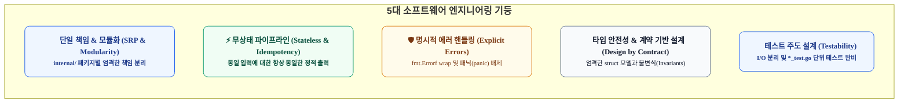

# GitHub Pages SSG 아키텍처 및 소프트웨어 엔지니어링 원칙 (Principles)

본 문서는 `site-cli` 정적 사이트 생성기(SSG) 및 배포 도구의 설계, 구현, 코드 리뷰, 유지보수 전 과정에서 준수해야 할 **도메인 특화 개발 원칙**과 **소프트웨어 공학(Software Engineering) 규율**을 정의합니다.

---

## 1. 도메인 특화 핵심 개발 원칙 (Core Product Principles)

```mermaid
flowchart LR
    classDef default font-family:Pretendard,sans-serif,font-size:13px;
    classDef slate fill:#f8fafc,stroke:#64748b,color:#0f172a,rx:8px;
    classDef blue fill:#eff6ff,stroke:#2563eb,color:#1e3a8a,font-weight:bold,rx:8px;
    classDef amber fill:#fffbeb,stroke:#d97706,color:#78350f,rx:8px;
    classDef emerald fill:#f0fdf4,stroke:#059669,color:#064e3b,font-weight:bold,rx:8px;

    subgraph DECOUPLE ["<b>3계층 엄격 격리</b>"]
        C["📄 <b>콘텐츠 (Markdown)</b>"]:::slate
        E["⚙️ <b>엔진 (site-cli)</b>"]:::blue
        T["🎨 <b>템플릿 (HTML/YAML)</b>"]:::amber
    end

    subgraph VALUES ["<b>엔지니어링 핵심 가치</b>"]
        V1["🌐 <b>100% Pure Static</b><br/><small>Zero Runtime Ops</small>"]:::emerald
        V2["💬 <b>Message Externalized</b><br/><small>UI 하드코딩 제로</small>"]:::amber
        V3["👁️ <b>WYSIWYG Parity</b><br/><small>로컬=배포 100% 일치</small>"]:::blue
        V4["🛡️ <b>Fail-Fast Validation</b><br/><small>데이터 정합성 보장</small>"]:::emerald
        V5["🧪 <b>High Testability</b><br/><small>모든 기능 단위/통합 테스트</small>"]:::blue
    end

    DECOUPLE --> VALUES

    linkStyle default stroke:#64748b,stroke-width:1.5px;
```



### [P-01] Pure Static & Zero-Ops (순수 정적성 및 무운영 원칙)
* **런타임 상주 제로**: 운영 단계에서 백엔드 프로세스(Go HTTP 서버 상시 상주, Node.js 서버 등)나 관계형 데이터베이스(PostgreSQL 등)에 일체 의존하지 않습니다.
* **CDN 표준 컴파일**: 결과물은 100% 순수 정적 파일(HTML, CSS, Vanilla JS, 이미지)로만 컴파일되어 GitHub Pages 및 Fastly Anycast CDN 상에서 즉시 전 세계로 초고속 캐싱·서빙되어야 합니다.

### [P-02] Strict Decoupling of Three Layers (3계층 엄격 격리 원칙)
* **`Content` ⟂ `Engine` ⟂ `Template` 독립성**:
  * **콘텐츠 (`posts/**`)**: 순수 마크다운 본문 및 YAML Frontmatter 메타데이터만 포함합니다.
  * **엔진 (`site-cli`)**: 파싱, 역색인, AST 변환, 템플릿 컴파일 파이프라인만 수행하며 특정 디자인에 종속되지 않습니다.
  * **템플릿 (`templates/**`)**: UI/UX 디자인, CSS 스타일, `messages.yaml` 리소스만 관리합니다.
* **바이너리 내장(Embed) 금지**: 템플릿과 정적 자산을 Go 바이너리에 내장(`//go:embed`)하지 않고, **로컬 파일시스템 디렉터리(`templates/<theme>/`)에서 100% 직접 읽어 컴파일**합니다. 사용자가 디자인과 문구를 수정할 때 Go 코드를 재컴파일할 필요가 전혀 없어야 합니다.

### [P-03] Message Externalization (메시지 외부화 원칙)
* **UI 텍스트 하드코딩 전면 배제**: '전체 포스트', '목차', '발행일', '검색', '댓글' 등 모든 UI 라벨과 안내 문구는 `templates/<theme>/messages.yaml` 변수로 관리합니다.
* **다국어(i18n) 및 카피라이팅 독립성**: UI 카피 변경이나 다국어 지원 시 템플릿 HTML 코드를 건드리지 않고 YAML 파일만 교체하여 사이트를 빌드할 수 있어야 합니다.

### [P-04] WYSIWYG & Local-Production Parity (로컬-배포 동일성 원칙)
* **단일 렌더러 파이프라인 공유**: `serve`(로컬 개발 서버)와 `build`(배포 빌드)는 동일한 정적 컴파일러 코어를 호출합니다. 로컬에서 눈으로 확인한 화면이 배포 환경과 100% 동일함을 보장합니다.
* **초고속 핫 리로드(Live Reload)**: `fsnotify` 듀얼 감시(콘텐츠 + 템플릿)를 통해 마크다운 수정뿐만 아니라 CSS/HTML/메시지 수정 시에도 0.5초 이내에 브라우저가 자동 갱신되어야 합니다.

### [P-05] Fail-Fast & Data Integrity (조기 실패 및 데이터 무결성 원칙)
* **Frontmatter 스키마 유효성 검증**: 필수 필드(`title`, `category`, `created_date`)가 누락되거나 날짜 포맷이 깨진 경우, 조용히 넘어가지 않고 **빌드를 즉시 중단(Fail-Fast)**하며 문제 파일과 원인을 명확히 출력합니다.
* **침묵하는 오류(Silent Failure) 방지**: 깨진 링크, 잘못된 템플릿 변수 참조, Mermaid 문법 오류 등 잠재적 배포 결함을 컴파일 단계에서 차단합니다.

### [P-06] Clean GitOps & Safe Deployment (안전한 GitOps 원칙)
* **로컬 작업 트리 무간섭**: `site-cli deploy` 실행 시 로컬의 현재 작업 브랜치(`main` 등)에는 임시 파일이나 불필요한 커밋을 남기지 않습니다.
* **Orphan Branch 격리 푸시**: 배포 산출물(`dist/`)은 오직 배포 전용 브랜치(`gh-pages`)에만 격리하여 강제 푸시하며, `CNAME` 파일을 무결하게 자동 생성합니다.

### [P-07] End-to-End Testability (철저한 기능 검증 및 테스트 가능성)
* **모든 기능의 테스트 가능성 보장**: 마크다운 파싱, Frontmatter 유효성 검증, 슬러그 생성, 카테고리 역색인, 템플릿 렌더링, Live Reload 신호 등 **엔진을 구성하는 모든 기능 단위는 고립된 환경에서 개별적으로 테스트 가능**해야 합니다.
* **배포 전 무결성 검증**: 실제 GitHub Pages 배포나 로컬 서버 구동 전, 픽스처(Fixture) 데이터를 통한 컴파일 테스트 및 스모크 테스트(Smoke Test)가 원클릭으로 통과되어야 합니다.

---

## 2. 소프트웨어 엔지니어링 원칙 (Software Engineering Principles)

Go 언어 기반의 CLI 도구 구현 시 코드 품질, 유지보수성, 테스트 용이성을 극대화하기 위한 소프트웨어 공학 표준 규율입니다.



### [SE-01] 단일 책임 원칙과 모듈화 (Single Responsibility & Modularity)
* **패키지 경계의 명확화**: Go의 `internal/` 하위 모듈은 각자 단 하나의 명확한 비즈니스 책임만 가집니다.
  * `internal/parser`: 마크다운 및 Frontmatter 메타데이터 파싱과 유효성 검증만 담당.
  * `internal/taxonomy`: 카테고리/태그 역색인 생성 및 날짜순 정렬만 담당.
  * `internal/markdown`: Goldmark AST 커스텀 확장(Mermaid, Prism, TOC)만 담당.
  * `internal/template`: `html/template` 컴파일 및 `messages.yaml` 데이터 주입만 담당.
  * `internal/server`: `net/http` 서빙 및 `fsnotify` 감시, SSE Live Reload 이벤트 전송만 담당.
  * `internal/deployer`: Git Orphan 브랜치 푸시 자동화만 담당.
* **순환 참조(Circular Dependency) 금지**: 모든 패키지는 상위 제어 흐름(`cli` 또는 `builder`)에서 단방향(DAG)으로만 의존하며, 데이터 교환은 `internal/model` 구조체로만 수행합니다.

### [SE-02] 무상태 및 멱등성 (Stateless & Idempotent Pipeline)
* **순수 함수적 파이프라인 (Pure Function-like Build)**: 빌드 엔진은 런타임 글로벌 가변 상태를 가지지 않습니다. `입력(posts, templates, messages) ➔ 변환(Pipeline) ➔ 출력(dist)` 흐름은 항상 입력이 같으면 동일한 바이트 출력을 보장(멱등성, Idempotency)합니다.
* **디렉터리 원자성**: 빌드 시작 시 `--clean` 플래그를 통해 대상 디렉터리를 초기화하고 완전한 빌드를 수행하여 빌드 아티팩트 잔존으로 인한 유령 버그를 원천 차단합니다.

### [SE-03] 단순성과 실용주의 (KISS & YAGNI)
* **불필요한 추상화 금지**: 과도한 인터페이스 다형성이나 플러그인 시스템 등 현재 필요하지 않은 추상 레이어를 만들지 않습니다 (Keep It Simple, Stupid & You Aren't Gonna Need It).
* **표준 라이브러리 우선**: `net/http`, `html/template`, `path/filepath`, `sort` 등 Go 표준 라이브러리의 강력한 내장 기능을 최대한 활용하고 외부 의존성은 실증된 필수 라이브러리(`cobra`, `goldmark`, `fsnotify`, `yaml.v3`, `frontmatter`)로 제한합니다.

### [SE-04] 명시적 에러 처리 및 컨텍스트 보존 (Explicit Error Handling)
* **패닉(`panic`) 배제**: 초기 설정이나 복구 불가능한 OS 치명적 오류를 제외하고는 라이브러리/코어 로직에서 `panic`을 사용하지 않고 반드시 명시적인 `error` 인터페이스를 반환합니다.
* **에러 래핑 (`%w`)**: 에러 발생 시 파일명, 단계, 원인을 누적 추적할 수 있도록 Go 1.13+ 에러 래핑을 강제합니다:
  ```go
  if err != nil {
      return fmt.Errorf("failed to parse frontmatter in %s: %w", filePath, err)
  }
  ```
* **사용자 친화적 CLI 메시지**: 기술적 스택 트레이스뿐만 아니라, 사용자가 무엇을 수정해야 하는지(예: "Frontmatter에 필수 필드 'category'가 누락되었습니다: posts/deep-dive/sample.md") 명확한 조치 가이드를 함께 제공합니다.

### [SE-05] 계약 기반 설계 및 타입 안전성 (Design by Contract)
* **원시 타입 강박 배제 (Primitive Obsession 회피)**: `Post`, `Frontmatter`, `Category`, `TOCItem`, `MessageBundle` 등 도메인 개념을 엄격한 Go 구조체(`struct`)로 정의하여 컴파일 타임에 타입 불일치와 오타를 방어합니다.
* **불변식(Invariant) 검증**: 모델 객체 생성(`NewPost`, `NewTaxonomyIndex`) 시점에 필수 속성과 데이터 규칙을 검증하여, 유효하지 않은 모델이 파이프라인 후속 단계로 전파되지 않도록 차단합니다.

### [SE-06] 관측 가능성과 디버깅 용이성 (Observability & CLI UX)
* **정량화된 빌드 요약 리포트**: 빌드 완료 시 처리된 포스트 수, 생성된 카테고리 수, 총 컴파일 소요 시간을 밀리초 단위로 사용자에게 명확히 보고합니다:
  ```text
  [SUCCESS] Static site compiled in 184ms
  ├── Total Posts: 24 (Drafts: 2 excluded)
  ├── Categories:  6 (Agentic AI, LLMOps, Cloud, ...)
  └── Output Dir:  dist/ (100% pure static)
  ```
* **디버그 로깅 (`-v, --verbose`)**: 상세 옵션 활성화 시 각 파일의 AST 파싱 시간, 템플릿 컴파일 시간, 에셋 복사 내역을 단계별로 추적할 수 있어야 합니다.

### [SE-07] 테스트 주도 설계 및 높은 테스트 용이성 (Design for Testability & Unit Testing)
* **I/O와 비즈니스 로직의 엄격한 분리**: 파서, 역색인기, AST 변환기, 템플릿 컴파일러 등 코어 로직은 실제 디스크 I/O나 OS 파일시스템에 직접 결합되지 않고 `io.Reader`, `io.Writer` 또는 추상화된 인터페이스를 인자로 받도록 설계합니다. 이를 통해 실제 디스크 생성 없이 인메모리 바이트 버퍼(`bytes.Buffer`, `strings.Reader`)만으로 수 밀리초 내에 단위 테스트(`testing.T`)를 고속 수행할 수 있어야 합니다.
* **핵심 기능별 단위 테스트 완비 (`*_test.go`)**:
  * `parser_test.go`: Frontmatter 필수 필드(`title`, `category`, `created_date`) 유효성 검증, 날짜 포맷 에러, 슬러그 생성 엣지 케이스(한글/특수문자 치환) 테스트.
  * `taxonomy_test.go`: 날짜 역순 정렬 보장, 카테고리별 포스트 역색인 매핑 및 포스트 카운트 집계 정합성 검증.
  * `markdown_test.go`: Mermaid 코드 블록 래핑(`<div class="mermaid-raw">`), PrismJS 언어 태그 부여, H2/H3 앵커 ID 및 TOC 트리 추출 검증.
  * `template_test.go`: `messages.yaml` 변수 주입 바인딩(`{{ .Messages.* }}`), 누락 변수 방어, HTML 이스케이프 안전성 검증.
* **테스트 픽스처(Fixtures) 기반 통합 회귀 테스트**:
  * `testdata/` 디렉터리에 표준 마크다운(정상 케이스, 드래프트 케이스, 에러 케이스)을 배치하여, 빌드 파이프라인 전체가 의도대로 동작하는지 검증하는 통합 테스트 스위트를 구축합니다.

