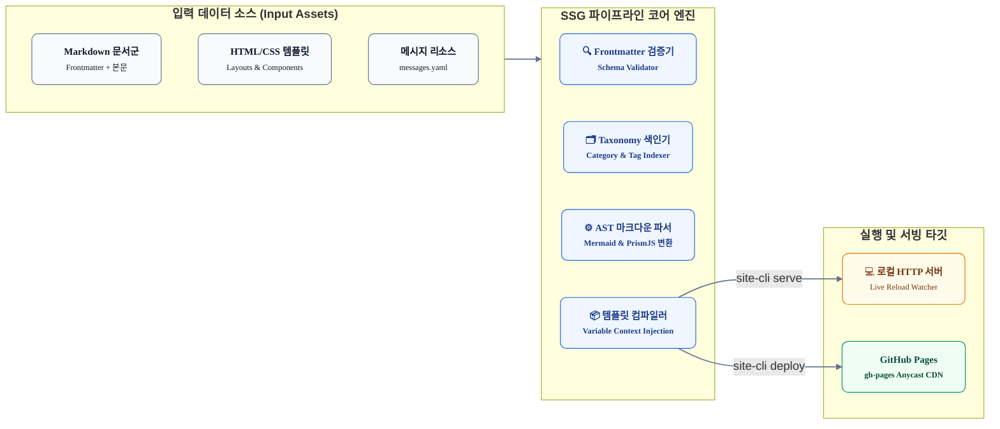

# GitHub Pages 정적 배포 애플리케이션 기술 요구사항 명세서 (TRD)

본 문서는 [`planning.md`](./planning.md) 기획 사양을 바탕으로, 순수 정적 사이트 생성기(SSG) 및 배포 CLI 도구를 구현하기 위한 **상세 기술 요구사항(Technical Requirements), 데이터 계약(Data Contracts), 아키텍처 제약 조건 및 검증 기준**을 정의합니다.

---

## 시스템 개요 및 아키텍처 경계

본 시스템은 마크다운 콘텐츠(`posts/**`), 디자인 템플릿(`templates/**`), 다국어/UI 메시지(`messages.yaml`)를 입력받아 **100% 순수 정적 파일(HTML/CSS/JS/Assets)**을 생성하고 GitHub Pages(`gh-pages` 브랜치)로 배포하는 단일 실행 도구입니다.



---

## 기능적 기술 요구사항 (Functional Requirements)

### [FR-01] CLI 명령 인터페이스 (CLI Command Engine)

시스템은 POSIX 표준 플래그 규격을 준수하는 CLI 명령어를 제공해야 합니다.

* **FR-01-1 (`serve`)**: 로컬 개발 및 실시간 검증용 HTTP 서버 구동
  * 포트 바인딩: 기본 `8080` 포트 바인딩 (`-p, --port` 플래그로 변경 가능).
  * 변경 감지: `posts/**`, `templates/**` 파일 변경 감지(FS Watcher) 시 500ms 이내 증분/전체 재빌드.
  * Live Reload: SSE(Server-Sent Events) 또는 WebSocket을 통해 브라우저 자동 새로고침 트리거.
  * 드래프트 모드: `-D, --drafts` 플래그 활성화 시 `status: draft` 포스트도 카테고리 및 목록에 강제 포함.
* **FR-01-2 (`build`)**: 프로덕션용 정적 사이트 컴파일
  * 출력 디렉터리: 완전 정적 파일군을 `dist/`에 생성.
  * 드래프트 배제: `status: draft` 상태인 포스트는 컴파일 대상에서 완전 제외.
  * 클린 빌드: `--clean` 플래그 적용 시 이전 `dist/` 및 캐시 디렉터리를 초기화 후 빌드.
* **FR-01-3 (`deploy`)**: GitHub Pages 원클릭 배포 자동화
  * 빌드 선행: `build` 파이프라인을 먼저 무결하게 통과해야 배포 단계로 진입.
  * CNAME 파일 생성: 도메인 설정(`--cname` 또는 기본 `www.joinc.co.kr`)을 읽어 `dist/CNAME` 자동 생성.
  * Git 푸시: `.git` 워크트리 또는 배포 전용 브랜치(`gh-pages`)로 `dist/` 내용을 강제 푸시(Orphan Branch 또는 단일 배포 커밋).
* **FR-01-4 (`list-categories`)**: 카테고리 통계 진단
  * 현재 마크다운 파일들의 카테고리명, 포스트 수, 미분류(Uncategorized) 포스트 수를 터미널 테이블로 출력.

---

### [FR-02] 마크다운 및 메타데이터 파서 (Parser & Validator)

* **FR-02-1 (Frontmatter 스키마 검증)**:
  * 각 마크다운 파일의 YAML 헤더를 파싱하고 다음 필수/선택 필드를 검증합니다.
    ```json
    {
      "type": "object",
      "required": ["title", "category", "created_date"],
      "properties": {
        "title": { "type": "string", "minLength": 1 },
        "category": { "type": "string", "minLength": 1 },
        "tags": { "type": "array", "items": { "type": "string" } },
        "created_date": { "type": "string", "pattern": "^\\d{4}-\\d{2}-\\d{2}$" },
        "published_date": { "type": "string", "pattern": "^\\d{4}-\\d{2}-\\d{2}$" },
        "summary": { "type": "string" },
        "thumbnail": { "type": "string" },
        "status": { "type": "string", "enum": ["published", "draft"], "default": "published" }
      }
    }
    ```
  * 필수 필드(`title`, `category`, `created_date`) 누락 시 빌드를 중단하고 해당 파일 경로와 오류 원인을 출력해야 합니다.
* **FR-02-2 (슬러그 및 URL 생성)**:
  * 파일명(예: `2026-09-26-redefining-ai-coding-agent-autonomy.md`)에서 날짜 접두어를 분리하거나 전체 파일명을 기반으로 URL-Safe한 슬러그(`redefining-ai-coding-agent-autonomy`)를 생성합니다.
  * 최종 산출물 경로: `dist/posts/<slug>/index.html`.

---

### [FR-03] 카테고리 분류 및 역색인 엔진 (Taxonomy Engine)

* **FR-03-1 (동적 카테고리 수집)**:
  * 마크다운의 `category` 값을 읽어 고유 카테고리 맵(`Map<CategoryName, PostMetadata[]>`)을 메모리에 구축합니다.
* **FR-03-2 (카테고리 메뉴 컴파일)**:
  * **전체 보기**: 전체 포스트 수 집계 뱃지 및 링크 (`/index.html`).
  * **개별 카테고리**: 각 카테고리별 등록된 포스트 수 집계 및 카테고리 슬러그 링크 (`/category/<slug>/index.html`).
  * 현재 활성화된 카테고리에 `active` 클래스를 부여하여 UI 하이라이팅을 제공합니다.
* **FR-03-3 (포스트 정렬)**:
  * 모든 목록(전체 목록 및 카테고리별 목록)은 `created_date` 기준 최신순(내림차순)으로 정렬되어야 합니다.

---

### [FR-04] 템플릿 엔진 및 메시지 외부화 (Template & Messages)

* **FR-04-1 (템플릿 계층 격리)**:
  * UI 구조는 `templates/default/` 하위에 위치하며, 마크다운 콘텐츠 내부의 HTML/스크립트 오염을 방지합니다.
  * 레이아웃 템플릿: `base.html` (메타 태그, CSS, 전역 헤더/푸터)
  * 컴포넌트 템플릿:
    * `category_nav.html`: 카테고리 메뉴 목록
    * `post_card.html`: 카드 그리드 단위 아이템
    * `post_detail.html`: 본문 뷰어, 플로팅 TOC, 줌 모달
* **FR-04-2 (메시지 리소스 번들 주입 - `messages.yaml`)**:
  * 템플릿 내의 모든 정적 텍스트는 `messages.yaml`에서 로드되어 주입됩니다.
  * 변수 스키마 규격:
    ```yaml
    common:
      site_title: string
      site_subtitle: string
      search_placeholder: string
      read_time_suffix: string
      table_of_contents: string
      back_to_list: string
      copy_link: string
      copy_success: string
    nav:
      home: string
      all_posts: string
      categories_title: string
      post_count_unit: string
    card:
      read_more: string
      published_prefix: string
    detail:
      author_label: string
      comments_title: string
      mermaid_zoom_tip: string
    footer:
      copyright: string
      powered_by: string
    ```
  * 템플릿 바인딩: `{{ messages.nav.categories_title }}`, `{{ messages.card.read_more }}` 형태로 렌더링.

---

### [FR-05] 리치 콘텐츠 렌더링 (Markdown & Diagrams)

* **FR-05-1 (Mermaid 다이어그램 렌더링)**:
  * 코드 블록 언어가 `mermaid`인 경우, 클라이언트 렌더링용 플레이스홀더(`class="mermaid-raw" style="display:none;"`)로 변환합니다.
  * 런타임에 Mermaid 라이브러리가 SVG로 치환하며, 다이어그램 클릭 시 화면 중앙 확대 줌 모달(`zoom-modal`)을 제공합니다.
* **FR-05-2 (코드 신택스 하이라이팅 - PrismJS)**:
  * 코드 블록(` ```go `, ` ```python ` 등)에 대해 `prism-tomorrow.css` 테마 기반의 토큰 클래스를 부여합니다.
* **FR-05-3 (헤딩 앵커 및 목차 자동 생성)**:
  * 본문 내 `H2`, `H3` 태그에 URL 인코딩된 ID(예: `<h2 id="heading-id">`)를 자동 부여합니다.
  * 우측 사이드바에 해당 ID를 링크하는 플로팅 목차(TOC) 트리를 생성합니다.
* **FR-05-4 (이미지 에셋 경로 정제)**:
  * 마크다운 내 상대 경로(`posts/assets/...`) 이미지를 감지하여 정적 출력물 경로(`assets/...`)로 재작성하고, 해당 바이너리 파일을 `dist/assets/`로 자동 복사합니다.

---

## 비기능적 기술 요구사항 (Non-Functional Requirements)

* **NFR-01 (빌드 성능)**:
  * 포스트 100건 기준 전체 빌드 시간은 5초 이내여야 합니다.
  * `serve` 모드에서 단일 마크다운 파일 수정 시 증분 반영 시간은 500ms 이하여야 합니다.
* **NFR-02 (배포 및 인프라 종속성)**:
  * 빌드 산출물(`dist/`)은 일체의 서버 런타임 없이 Nginx, Apache, GitHub Pages 등 임의의 정적 웹 서버에서 100% 정상 작동해야 합니다.
  * 상대 경로 및 절대 경로 링크가 커스텀 도메인(`www.joinc.co.kr`) 환경에서 깨지지 않아야 합니다.
* **NFR-03 (SEO 및 웹 접근성)**:
  * 모든 포스트 페이지는 `<title>`, `<meta name="description">`, `<meta property="og:title">`, `<meta property="og:image">`를 사전 렌더링(Pre-rendered)된 HTML 상태로 포함해야 합니다.
* **NFR-04 (브라우저 호환성 및 반응형 UI)**:
  * 모바일(375px), 태블릿(768px), 데스크톱(1280px+) 전 해상도에서 깨짐 없는 반응형 그리드를 지원해야 합니다.
  * 모바일 화면에서는 좌측 카테고리 메뉴가 슬라이드 오버 드로어(Drawer) 또는 상단 스크롤 탭으로 전환되어야 합니다.

---

## 디렉터리 및 산출물 구조 명세

```text
app/github-pages/
├── docs/                               # 기획 및 기술 요구사항 문서
│   ├── planning.md                     # 기획 사양서
│   └── technical-requirements.md       # 본 기술 요구사항 명세서
├── src/                                # CLI 및 SSG 코어 구현체
│   ├── cli/                            # CLI 서브커맨드 (serve, build, deploy 등)
│   ├── parser/                         # Frontmatter 검증 및 마크다운 AST 파서
│   ├── taxonomy/                       # 카테고리/태그 색인 엔진
│   ├── generator/                      # 정적 HTML 페이지 빌더
│   └── server/                         # 로컬 개발용 HTTP 서버 & Live Reload
├── templates/
│   └── default/                        # 기본 테마 템플릿
│       ├── messages.yaml               # UI 정적 메시지 리소스 번들
│       ├── base.html                   # HTML 기본 스켈레톤
│       ├── components/                 # CategoryNav, PostCard, PostDetail, TOC
│       └── assets/                     # 테마 CSS, JS, Pretendard 웹폰트
├── dist/                               # 최종 정적 산출물 (gitignore 대상)
│   ├── index.html                      # 메인 페이지 (전체 포스트 카드)
│   ├── category/                       # 카테고리별 포스트 카드 페이지
│   │   └── <category-slug>/index.html
│   ├── posts/                          # 개별 포스트 상세 페이지
│   │   └── <post-slug>/index.html
│   ├── assets/                         # 테마 CSS, JS, 이미지 에셋
│   └── CNAME                           # GitHub Pages 커스텀 도메인 선언
├── package.json (또는 go.mod)           # 프로젝트 의존성
└── README.md
```

---

## 검증 및 수용 기준 (Acceptance Criteria)

| 테스트 ID | 검증 항목 | 합격 기준 (Pass Criteria) |
| :--- | :--- | :--- |
| **TC-01** | `site-cli serve` 로컬 구동 | `localhost:8080`에 접속하여 브라우저에서 메인 및 포스트 상세 화면이 정상 노출됨 |
| **TC-02** | Live Reload 동작 | 마크다운 본문 수정 후 저장 시 브라우저가 자동 새로고침되며 변경 내용이 1초 내 반영됨 |
| **TC-03** | 카테고리 메뉴 및 카드 필터링 | Frontmatter의 `category`가 사이드바 메뉴로 생성되고, 클릭 시 해당 카테고리 카드만 노출됨 |
| **TC-04** | 메시지 리소스 외부화 | `messages.yaml`의 문구를 수정하고 재빌드했을 때 HTML 템플릿 수정 없이 텍스트가 변경됨 |
| **TC-05** | 리치 마크다운 렌더링 | Mermaid 다이어그램 SVG 렌더링, 클릭 시 확대 줌 모달, Prism 코드 하이라이트 정상 작동 |
| **TC-06** | `site-cli build` 무결성 | `dist/` 내에 순수 HTML/CSS/JS 파일이 생성되며 브라우저 직접 열람 시 에러가 없음 |
| **TC-07** | `site-cli deploy` 배포 | `gh-pages` 브랜치로 자동 푸시되고 `dist/CNAME`이 정상 포함되어 배포 완료됨 |
