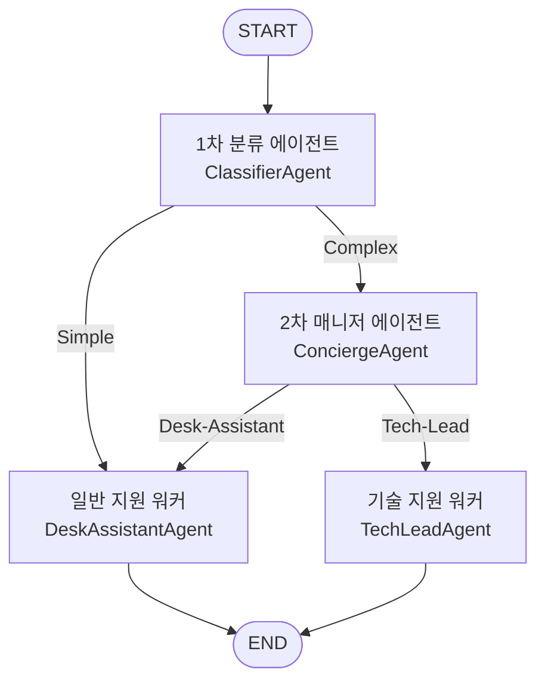

# 하이브리드 LLM 라우팅 아키텍처: 로컬 2B 모델과 클라우드 SOTA 모델의 하이브리드 협업 구조 실증

생성형 AI 애플리케이션을 프로덕션(Production) 환경에 배포하고 실서비스를 운영하는 과정에서 아키텍트와 비즈니스 팀은 언제나 지능 수준(Quality), 처리 지연 시간(Latency), 그리고 운영 원가(COGS)라는 삼중 상충 관계(Trilemma)를 해결해야 합니다. 모든 사용자 요청을 대규모 상용 클라우드 프런티어 모델로 전달하면 높은 응답 품질을 기대할 수 있으나 토큰 원가 부담이 가중되고 응답 지연이 심화됩니다. 반면, 초경량 모델만 배치하면 인프라 비용은 통제되나 복잡한 지능형 태스크에서 품질 오류율이 상승하여 서비스 가치가 훼손됩니다.

여기에 더해, 기업 환경에서는 민감한 내부 문서나 개인정보(PII)의 외부 노출을 통제해야 하는 보안 거버넌스 장벽과, IT 인프라 장애 디버깅이나 소스코드 리뷰 등 각 비즈니스 영역별로 요구되는 고유한 전문 지식의 정밀한 처리가 필수적으로 요구됩니다.

이러한 다차원적인 제약 조건들을 해결하기 위한 대안으로 '하이브리드 LLM 라우팅(Hybrid LLM Routing)' 아키텍처가 제안됩니다. 하이브리드 라우팅은 사용자가 인입하는 질문의 성격과 난이도를 실시간으로 평가하여, 최소한의 원가와 정밀한 보안 통제 속에서 각 쿼리를 전담 모델로 동적 분기(Dynamic Dispatching)시키는 관제탑 역할을 수행합니다.

본 포스트에서는 이러한 하이브리드 라우팅의 필요성을 실증하기 위해 설계한 구체적인 엔터프라이즈 업무 포털 가상 시나리오와 이를 구현하기 위해 정의한 멀티 에이전트 워크플로우 아키텍처, 그리고 다단계 라우터 도입 시 발생하는 판단 지연을 완화하기 위한 프론트엔드 UX 최적화 과정의 실전 교훈을 단계적으로 공유합니다.

## 2. 실증 시나리오: 사내 행정 및 기술 지원 포털

하이브리드 라우팅 설계의 타당성과 실효성을 실증하기 위해서는 이론적 수치를 넘어 실제 업무 환경에 부합하는 시나리오가 필요합니다. 본 PoC에서는 임직원이 사용하는 '사내 행정/기술 지원 포털' 가상 시나리오를 설정하고, 인입되는 질문의 난이도와 데이터 보안 수준에 따라 처리 트랙을 이원화했습니다.

### 2.1. 이원화된 업무 처리 트랙
* **로컬 행정 지원 트랙 (Simple)**: 단순 정보 안내, 일반 연차 규정 질의, 비즈니스 이메일 초안 작성 및 번역 등 비교적 낮은 추론 지능을 요구하는 행정 영역입니다. 이 영역은 외부 상용 클라우드 API를 호출하지 않고, 온프레미스 사내 인프라에 서빙된 경량 오픈소스 모델인 `gemma4:e2b` (Ollama)가 독립적으로 전담합니다. 이를 통해 사내 규정이나 일반 이메일 내용의 외부 유출 가능성을 원천적으로 격리(Data Sovereignty 방어)하며 API 호출 비용을 없앱니다.
* **클라우드 기술 지원 트랙 (Complex)**: 소스코드 디버깅, SQL 인덱스 최적화, 긴 문서 요약 및 다차원 계산 추론 등 고성능 지능이 요구되는 기술 지원 영역입니다. 이 영역은 2차 클라우드 관제탑(Concierge)의 판단을 거쳐 전문 도메인 에이전트(`Tech-Lead` / `Gemini 3.5 Flash`)로 전달되어 처리됩니다.

### 2.2. 실증용 테스트 시나리오 정의
이러한 이원화 설계를 정량 검증하기 위해 다음과 같은 5가지 대표적인 현업 질의 시나리오를 정의하고 테스트를 진행했습니다.

| 시나리오 ID | 질문 카테고리 | 예시 질문 (User Query) | 예상 분류 | 라우팅 및 처리 판단 근거 |
| :--- | :--- | :--- | :--- | :--- |
| **SC-01** | 단순 FAQ | "환불 가능한 기간이 구매 후 며칠까지인가요?" | **Simple** | 복잡한 추론 없이 고정된 사내 규정 정보에 기반해 즉시 답변 가능한 일반 안내 질의입니다. |
| **SC-02** | 일상 대화 | "안녕? 오늘 하루 기분은 어때?" | **Simple** | 지식 탐색이나 연산이 불필요한 친근감 형성용(Chitchat) 일상 질문입니다. |
| **SC-03** | 기술 디버깅 | "Python에서 REST API 호출 시 401 Unauthorized 에러가 나는데 헤더 설정 코드 예시 좀 보여줘." | **Complex** | 언어별 라이브러리 구조 이해 및 구체적인 소스코드 구문 작성이 수반되는 전문 기술 영역입니다. |
| **SC-04** | 논리 추론 | "A 요금제(기본 $10 + 건당 $0.1)와 B 요금제(기본 $50, 무제한) 중 월 300건 사용 시 어떤 것이 이득인가?" | **Complex** | 수식을 정식화하고 조건에 맞춰 비교 연산을 처리해야 하는 논리/수학적 추론이 필요합니다. |
| **SC-05** | 정보 요약 | "[회의록 텍스트] 위 회의록 요약본에서 주요 의사결정 사항 3가지만 요약해줘." | **Complex** | 비정형화된 긴 컨텍스트의 맥락을 종합 분석하고 다차원 요약이 필요하여 Frontier급 성능이 요구됩니다. |

이 가상 시나리오 구조를 기반으로 시스템은 실시간으로 인입되는 질문을 분기시키고, 각 트랙에 최적화된 에이전트를 적시에 호출합니다.

## 3. 구현 실증: 하이브리드 기술 스택 및 GEMINI ADK 2.0 기반 워크플로우 설계

정의된 로컬 및 클라우드 협업 시나리오를 시스템으로 실증하기 위해, 이 포털은 다음과 같은 기술 스택(Tech Stack)의 조합으로 구축되었습니다.

### 3.1. 하이브리드 에이전트 기술 스택
* **로컬 추론 서버 (Ollama)**: 로컬 인프라 환경에서 소형 오픈소스 언어 모델을 초저지연 API 엔드포인트 형태로 서빙하기 위해 `Ollama` 엔진을 가동했습니다.
* **로컬 오픈소스 모델 (Gemma 2B)**: 로컬 추론 및 1차 의도 분류를 전담할 핵심 모델로 구글의 `gemma4:e2b` (Gemma 2 2B)를 채택했습니다.
* **클라우드 API 및 SDK**: 구글의 `Gemini 3.5 Flash`를 메인 추론 모델로 활용하며, 공식 파이썬 라이브러리인 `google-genai` SDK를 통해 연동을 처리했습니다.
* **에이전트 프레임워크**: 구글의 오픈소스 개발 프레임워크인 `google-adk` (Agent Development Kit 2.0)를 도입하여, 각 에이전트의 역할 선언 및 자율적 오케스트레이션의 뼈대를 구성했습니다.
* **UI 및 시각화**: `Streamlit`을 사용하여 사용자 대화 인터페이스와 실시간 라우팅 의사결정 상태 모니터링 보드를 렌더링했습니다.
* **인프라 격리**: 전체 서비스를 `Docker` 및 `Docker Compose` 기반의 멀티 컨테이너 환경으로 패키징하여 배포의 일관성을 확보했습니다.

위 기술셋 중 로컬 에이전트 트랙의 핵심인 `gemma4:e2b`(Gemma 2B) 모델은 20억 파라미터 수준의 극소형 경량 언어 모델(SLM)입니다. 이 모델은 일반 CPU나 엔트리급 GPU 환경에서도 30~50 TPS 이상의 대단히 빠른 속도로 토큰 스트리밍 출력을 지원합니다. 특히 구글의 지식 증류(Knowledge Distillation) 기법이 적용되어 20억 파라미터급 체급임에도 이전 세대의 8B(80억)급 대형 소형 모델의 지능을 필적하거나 능가하는 벤치마크 성능을 발휘합니다. 덕분에 파라미터 크기 대비 쿼리의 의도(Intent) 분석과 JSON 형식의 구조화된 데이터 파싱 성능이 대단히 뛰어납니다. 이에 따라 사내 중요 거버넌스를 준수하면서 고정 요금 없이 로컬 망 내에서 1차 분류기 및 단순 행정 질의를 무상으로 완결 짓는 중추 역할을 성공적으로 수행합니다.

오케스트레이션 프레임워크로 도입한 **Google ADK(Agent Development Kit 2.0)**는 각 AI 주체(분류기, 매니저, 개별 워커)의 역할 정의, 지시 프롬프트, 모델 사양을 하나의 독립적인 `Agent` 인스턴스로 구조화하여 코드의 격리 수준을 보장하기 위해 도입되었습니다. 또한, 에이전트 간의 호출 전환 관계를 `Workflow(edges=[...])` 로 규정함으로써 전체 시스템의 의사결정 결합 관계를 직관적인 설계 도면 형태로 시각화하는 장점을 제공합니다.

특히 Google ADK는 파이썬 생태계에 지나치게 편중된 타 프레임워크와 달리 **Go(GoLang) 백엔드 환경을 공식 지원**한다는 독보적인 실무적 강점을 지닙니다. 이는 고성능·저지연 백엔드가 생명인 프로덕션 인프라에서 별도의 파이썬 서빙 오버헤드 없이 고루틴(Goroutine) 기반의 초고속 동시성 에이전트 구동을 보장하며, 파이썬 기반으로 구축한 PoC 설계도를 Go 백엔드 코드로 일관되게 포팅할 수 있는 실질적인 이식 경로를 열어줍니다.

### 3.2. 에이전트 워크플로우 그래프 설계 (DAG)
본 PoC가 지향하는 오케스트레이션은 순환 루프(Cycle)가 완벽히 배제된 전형적인 **DAG (Directed Acyclic Graph, 방향성 비순환 그래프)** 구조를 취합니다. 각 에이전트는 독립된 기능을 수행하는 **노드(Node)**가 되며, 에이전트 간의 전이는 단방향으로만 흐르는 **에지(Edge)**로 연결됩니다.



이 아키텍처가 순환이 없는 DAG 구조를 충족함으로써 얻는 프로덕션 레벨의 신뢰성은 대단히 명확합니다. 임의의 질문이 인입되었을 때 거쳐 가야 하는 노드의 최대 깊이(Max Depth = 3)와 최악의 상황에서의 지연 시간(Worst-case Latency) 상한선이 결정론적(Deterministic)으로 제어됩니다. 비결정적인 생성형 AI 모델들이 서로 꼬리를 물며 예기치 못한 무한 루프(Infinite Loop)에 빠져 비용 폭탄을 유발하거나 상태를 오염시키는 위험이 근본적으로 차단되므로, 비즈니스 요건인 예측 가능한 가용성(SLA)을 안정적으로 방어할 수 있습니다.

### 3.3. ADK를 활용한 선언적 DAG 코드 구현
ADK 2.0 스펙을 기반으로 위 DAG 토폴로지를 코드로 구현한 명세입니다. 각 에이전트 역할(Node)을 클래스 인스턴스로 분리 정의하고, `Workflow` 클래스 내부에 노드 간의 딕셔너리 조건부 매핑 구조를 통해 방향성 에지(Edge)를 선언했습니다.

```python
from google.adk import Agent, Workflow

# 1. 에이전트 인스턴스 선언 (Nodes)
classifier_agent = Agent(name="ClassifierAgent", instruction="...")
concierge_agent = Agent(name="Concierge", model="gemini-3.5-flash", instruction="...")

# 2. 오케스트레이션 워크플로우 구축 (DAG Edges)
hybrid_router_workflow = Workflow(
    name="hybrid_router_workflow",
    edges=[
        ("START", classifier_agent),
        (classifier_agent, {
            "Simple": run_desk_assistant_agent,
            "Complex": concierge_agent
        }),
        (concierge_agent, {
            "Tech-Lead": run_tech_lead_agent,
            "Desk-Assistant": run_desk_assistant_agent
        })
    ]
)
```

이 선언적 그래프 구조는 복잡하게 얽히기 쉬운 에이전트 간 호출 관계를 단일 클래스 선언부로 가시화하여, 전체 시스템의 데이터 흐름 설계도(Executable Specification)를 제공하는 핵심적인 이점을 줍니다. 독자는 이 선언형 코드를 다이어그램 이미지와 다이렉트로 매핑하여 시스템 아키텍처를 직관적으로 이해할 수 있게 됩니다.

### 3.4. 시맨틱 레이어(프롬프트)와 구문 레이어(코드)의 결합 메커니즘
이 선언적 DAG 워크플로우가 실제로 동작하는 핵심 원리는 **의미론적(Semantic) 의사결정 결과**를 **구문적(Syntactic) 매핑 키(Key)**로 변환하여 유기적으로 엮는 데 있습니다.
* **시맨틱 판단 (프롬프트 룰)**: 분류 노드(`ClassifierAgent`)는 하드코딩된 조건문이 아니라 프롬프트 지시문(`instruction`)에 정의된 의미론적 분류 규칙에 의존합니다. 로컬 Gemma 모델은 사용자의 질문이 단순 행정 FAQ인지 혹은 고난도 기술 질문인지를 프롬프트 가이드에 의거해 추론한 뒤, 최종 결과로 `"Simple"` 또는 `"Complex"`라는 문자열 값을 도출합니다.
* **구문적 분기 (딕셔너리 매핑)**: AI가 도출한 문자열 판단 결과는 ADK의 `Workflow`에 선언된 조건부 분기 딕셔너리의 Key값으로 매핑됩니다. 결과가 `"Simple"`이면 매핑 테이블에 지정된 `run_desk_assistant_agent` 함수를 호출하고, `"Complex"`이면 `concierge_agent` 노드로 흐름을 전환합니다.

즉, 시맨틱 레이어가 판단한 개념적 텍스트를 구문 레이어가 실제 컴포넌트의 실행 주소(주입된 노드 함수)로 변환해 줌으로써, AI의 자유도 높은 비결정성 추론을 결정론적인 소프트웨어 실행 흐름 안으로 안전하게 가두어 통제하게 됩니다.

### 3.5. 추상화의 득과 실: 시스템 토폴로지 선언과 런타임 컴포넌트 우회
소프트웨어 공학 관점에서 지나치게 넓은 범위의 추상화는 내부 작동 원리를 감추는 블랙박스(Black-box)로 작용하여 프로덕션 레벨의 큰 제약이 되곤 합니다. 특히 로우 레벨 API 호출, 예외 처리, 메모리 버퍼 등 상이한 수준의 컴포넌트들을 거대 객체 내부에 강제 은닉하여 높은 결합도를 유발한 기존 LangChain 식의 '기능 집합형 추상화'는 단위 테스트를 어렵게 하고 디버깅 오버헤드를 가중시키는 대표적인 안티패턴으로 지적되어 왔습니다.

이러한 한계는 대표적인 멀티 에이전트 도구인 LangGraph와 대조할 때 득실이 뚜렷해집니다.
* **LangGraph의 추상화 (루프와 영속성의 강점, 높은 결합도의 단점)**: LangGraph는 에이전트 간의 루프(Cycles) 제어와 스레드 단위의 상태 영속화(Time-Travel, Human-in-the-loop)에서 뛰어난 선언적 추상화를 보여줍니다. 하지만 모든 노드가 단일한 전역 상태(State Schema)를 공유하여 중간 노드의 상태 오염이 전체 흐름을 깨뜨리는 위험이 존재하고, LCEL 등 무거운 전용 문법 의존성이 강해 로우 레벨 튜닝이나 독립 단위 테스트 작성을 극도로 어렵게 만듭니다.
* **Google ADK의 추상화 (구조 가시성의 강점, 런타임 통제력 상실의 단점)**: Google ADK 2.0은 에이전트 연결 관계를 `edges` 리스트로 구조화(토폴로지 추상화)하여 흐름의 직관성과 단순성을 방어하는 구조적 장점을 보장합니다. 그러나 실행 런타임(Runner) 내부에 데이터 스키마 변환과 세션을 강제로 은닉한 설계는 실제 프로덕션에서 에러 역추적(Backtracking)을 가로막고 실시간 토큰 스트리밍(SSE) 출력을 차단하는 심각한 기술적 제약(단점)으로 작용합니다.

본 PoC에서는 이 문제를 해결하기 위해 **"설계 명세(ADK 토폴로지)와 실행 런타임(SDK 직접 호출)의 물리적 분리 및 위임(Delegation)"** 아키텍처를 구현했습니다. 전체 그래프 관계는 ADK의 선언을 활용해 설계도로서 남겨두고, 실제 동작 메서드 내부는 디버깅이 완벽히 통제되는 Gemini SDK와 Ollama API를 직접 호출하도록 하여 런타임 안정성과 실시간 스트리밍 제어권을 동시에 확보했습니다. 이는 복잡한 블랙박스에 모든 동작을 은닉하기보다, 검증된 세부 컴포넌트에 역할을 투명하게 위임하여 조립하는 프로덕션의 선호 구조에 부합하는 엔지니어링 타협점입니다.

## 4. UI/UX 최적화: 체감 대기 지연(Perceived Latency)을 극복하는 화면 설계


하이브리드 LLM 라우팅 아키텍처는 로컬 분류와 2차 매니저 연산을 수행하기 때문에, 최종 답변을 내리기 전 최소 100ms에서 최대 300ms 수준의 판단 오버헤드 지연이 필연적으로 가산됩니다. 백엔드가 최적의 모델을 찾는 동안 프론트엔드가 아무런 피드백 없이 빈 스크린으로 대기하게(Spinner가 무작정 도는 형태) 설계되면 사용자는 시스템이 중단되었다고 느끼거나 지루함을 겪게 됩니다.

본 PoC 프로젝트에서는 이러한 인지적 한계를 극복하기 위해 **'분석 근거 선출력 및 순차 스트리밍'** 기법을 적용하여 프론트엔드 UX 최적화를 단행했습니다.

### 4.1. 호출 에이전트 정보 및 분석 근거 선출력 (Explainable AI)
사용자가 쿼리를 입력하면, 시스템은 1~2차 라우팅 판단이 끝나는 즉시(최종 답변 스트리밍이 시작되기도 전에) 상단 상태창(`st.status`)에 판단 결과를 먼저 렌더링합니다.
* **커스텀 뱃지(Badge) 렌더링**: 로컬 gemma 모델이 처리할 때는 청색 배지(`🖥️ Local Agent (Desk-Assistant)`)를, 클라우드 Gemini 모델이 처리할 때는 보라색 배지(`☁️ Cloud Agent (Tech-Lead)`)를 HTML로 즉시 그려주어 인지적 명확성을 극대화합니다.
* **분석 근거 노출**: 어떤 판단 흐름을 통해 해당 서브 에이전트가 호출되었는지에 대한 한글 라우팅 근거를 답변 영역 위에 먼저 시각화합니다.

이러한 선출력 UI는 단순히 지연 시간을 은닉하는 UX 트릭을 넘어, 현대 에이전트 아키텍처의 필수 요소인 **'설명가능한 AI(XAI: Explainable AI)'** 설계 사상을 충족합니다. 불투명하게 동작하는 LLM의 블랙박스적 한계를 극복하기 위해, 어떤 논리적 인과관계를 통해 특정 컴포넌트(에이전트)가 호출되었는지를 투명하게 노출(Process Transparency)하여 사용자의 시스템 신뢰도(Trust)를 획득합니다. 또한, 라우터가 유저의 인텐트를 오분류했을 경우 사용자가 답변 수신 전에 이를 즉각 파악하여 피드백 및 라우팅 가드레일 재조정(Re-calibration)의 단서를 제공하는 실무적인 가치를 제공합니다.

### 4.2. 답변 실시간 스트리밍 결합
라우팅 상태 판정이 완료되어 상단에 고정되는 즉시, 그 하단에 서브 에이전트가 생성하는 실시간 토큰 스트림(`st.write_stream`)을 부드럽게 렌더링합니다. 모든 출력이 완료되면 총 소요 시간(라우팅 판단 시간과 실행 시간의 합산) 및 예상 비용 지표를 가벼운 캡션으로 덧붙여 인터랙션을 종료합니다.

사용자는 이 구조를 통해 "질문이 입력된 직후 시스템이 어떤 판단 하에 어떤 모델을 불렀는지"를 즉각 이해할 수 있으므로, 최종 답변이 스트리밍되기까지의 체감 대기 시간(Perceived Latency)이 대폭 완화되는 효과를 얻었습니다.

---

## 5. 소스코드 보안 및 배포 전 체크리스트

프로덕션 수준에 맞춰 작성된 코드를 GitHub에 안전하게 배포하고 공유하기 위해 최종 보안 강화를 적용했습니다.
* **환경 변수 분리**: `docker-compose.yml` 파일 내에 평문으로 하드코딩되어 있던 Gemini API Key 값을 완벽하게 제거하고, `.env` 로컬 설정 파일로부터 키를 동적으로 주입받도록 `GEMINI_API_KEY=${GEMINI_API_KEY}` 구조로 변경했습니다.
* **자산 보호**: 깃 저장소 루트에 `.gitignore` 파일을 작성하여 `.env` 보안 설정 파일과 개발 중 생성된 임시 검증 스크립트(`test_adk_run.py`)가 외부에 절대 커밋/유출되지 않도록 제어했습니다.

---

## 6. 결론: 하이브리드 LLM 설계가 남긴 실전 교훈

로컬 2B 소형 모델과 클라우드 SOTA 모델을 결합한 하이브리드 LLM 라우팅 PoC 프로젝트는 단순한 API 비용(COGS) 절감 이상의 중요한 교훈을 남겼습니다.

첫째, 하이브리드 아키텍처는 단가 최적화뿐만 아니라 사내 행정 데이터와 외부 기술 지원 영역을 인프라 레벨에서 격리하는 **'데이터 보안 거버넌스(Data Sovereignty)' 방어와 '도메인 특화 처리'를 하나의 파이프라인으로 융합하는 강력한 확장 수단**이 될 수 있습니다.

둘째, 백엔드 최적화(MLOps)가 원가를 제어한다면, **최종적인 고객 만족도는 프론트엔드의 상태 피드백 설계(UX 최적화)가 결정**짓는다는 사실입니다. 라우팅 단계의 추가로 인한 오프라인 판단 오버헤드를 상태창의 '의사결정 및 분석 근거 선출력' 디자인으로 완화함으로써, 백엔드의 한계를 프론트엔드가 정교하게 보완하는 진정한 프로덕션급 AI 아키텍처를 실증해 낼 수 있었습니다.

### 다음 시리즈 예고: 의미론적 가드레일 (Semantic Guardrails)
하이브리드 LLM 라우팅이 개념의 효율적 분기를 다룬다면, 다음 포스트에서는 입력의 무결성을 방어하는 **보안 가드레일**을 다룹니다.
사용자의 질문이 사내 비즈니스 범위를 벗어났는지(Out-of-Scope), 혹은 악의적인 프롬프트 인젝션(Jailbreak) 시도인지 로컬 소형 모델(Gemma 2B)의 시맨틱 분석을 통해 실시간으로 필터링하고 시스템을 방어하는 '의미론적 가드레일(Semantic Guardrails)' 아키텍처 실증 사례로 찾아뵙겠습니다.

---

### PoC 소스코드 저장소
본 포스트에서 실증한 하이브리드 LLM 라우팅의 전체 구현 코드는 아래 GitHub 저장소에서 확인하실 수 있습니다.
* **GitHub Repository**: [joincdream/Hybrid-llm-routing](https://github.com/joincdream/Hybrid-llm-routing)
