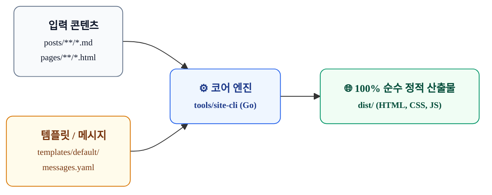

# `site-cli` OKF 스펙 및 하네스 마스터 인덱스

본 문서는 **Google OKF (Open Knowledge Format v0.2)** 표준을 준수하여 작성된 `tools/site-cli`의 시스템 마스터 인덱스입니다. AI 에이전트와 엔지니어 간의 결정론적 협업을 보장하고 컨텍스트 낭비 및 광역 코드 오염을 원천 차단하기 위한 하네스 가드레일 역할을 합니다.

---

## 1. 아키텍처 개요 및 3계층 격리

`site-cli`는 콘텐츠와 디자인이 완벽히 분리된 **헤드리스(Headless) 정적 사이트 생성기**입니다.

### 상위 설계 문서 링크 (Living Specs)
- 📋 [기획 사양서 (Planning)](../architecture/planning.md)
- 📐 [기술 요구사항 명세서 (TRD)](../architecture/technical-requirements.md)
- 🏗️ [상세 설계서 (Detailed Design)](../architecture/detailed-design.md)
- 🧭 [핵심 개발 원칙 (Principles)](../architecture/principles.md)
- 📊 [시장 비교 분석 및 전략적 포지셔닝 (Competitive Analysis & Strategy)](../architecture/competitive-analysis-and-strategy.md)
- ⚡ [Go Backend & Svelte 하이브리드 SSG 아키텍처 (Go & Svelte Architecture)](../architecture/go-backend-svelte-architecture.md)

---

## 2. AI 에이전트 작업 가드레일 (Agent Protocols)

AI 에이전트가 `site-cli` 관련 작업(기능 추가, 리팩토링, 버그 수정)을 수행할 때는 아래 프로토콜을 반드시 준수해야 합니다:

1. **타깃 파일 격리 원칙 (Zero Wide Search)**:
   - 전체 코드베이스를 대상으로 광역 검색(`find`, `grep`)을 무차별적으로 수행하지 않습니다.
   - 요청된 과업의 서브시스템 ID(예: `parser_scanner`, `template_engine`)를 상단 Frontmatter에서 식별하고, 지정된 **`target_codebase` 파일만 열람/수정**합니다.
2. **사전 설명 원칙 (Pre-execution Self-reflection)**:
   - 코드를 수정하기 전 반드시 다음 3가지를 명시적으로 서술합니다:
     - 대상 파일 (Target File)
     - 수정 목적 (Objective)
     - 핵심 로직 및 사이드 이펙트 방지 전략 (Implementation Details)
3. **결정론적 로컬 검증 (Deterministic Self-Validation)**:
   - 코드 수정 직후 반드시 `cd tools/site-cli && go test -v ./...`를 실행하여 기존 테스트의 무결성을 검증합니다.
   - 빌드 영향을 주는 변경일 경우 `make build`를 실행하여 `dist/` 산출물 생성 여부를 확인합니다.
4. **UI 하드코딩 엄격 금지**:
   - 새롭게 노출되는 UI 텍스트는 Go 코드나 HTML 템플릿에 하드코딩하지 않고, 반드시 `templates/<theme>/messages.yaml`에 키를 추가한 뒤 바인딩합니다.

---

## 3. 서브시스템별 책임 및 타깃 매핑 요약

| 서브시스템 ID | 책임 영역 | 핵심 타깃 소스 | 주 검증 테스트 |
| :--- | :--- | :--- | :--- |
| `cli_commands` | Cobra CLI 플래그 및 커맨드 생명주기 | `internal/cli/`, `cmd/site-cli/main.go` | `internal/cli/...` |
| `parser_scanner` | YAML Frontmatter 파싱, DTO 정규화 | `internal/parser/`, `internal/model/` | `scanner_test.go`, `frontmatter_test.go` |
| `markdown_converter` | Goldmark GFM 파싱, 코드블록 변환 | `internal/markdown/converter.go` | `converter_test.go` |
| `template_engine` | HTML 템플릿 컴파일, messages.yaml 주입 | `internal/template/engine.go` | `engine_test.go` |
| `site_builder` | 정적 사이트 일괄 렌더링, 리다이렉트 생성 | `internal/builder/` | `builder_test.go` |
| `server_watcher` | fsnotify 로컬 감시 및 라이브 서빙 | `internal/server/` | 로컬 `make serve` 검증 |
| `deployer` | gh-pages 브랜치 격리 GitOps 배포 | `internal/deployer/git.go` | GitOps dry-run 검증 |

---

## 4. 완료 기준 (Definition of Done)

모든 작업은 아래 기준을 만족해야 최종 완료로 간주됩니다:
- [ ] 관련 단위 테스트 통과 (`cd tools/site-cli && go test ./...`)
- [ ] 정적 사이트 빌드 성공 (`make build`)
- [ ] `git status` 상에 지정된 컴포넌트 외의 엉뚱한 파일 변경이 없을 것
