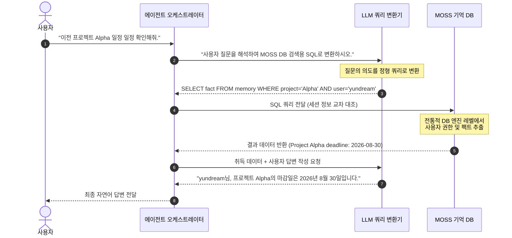
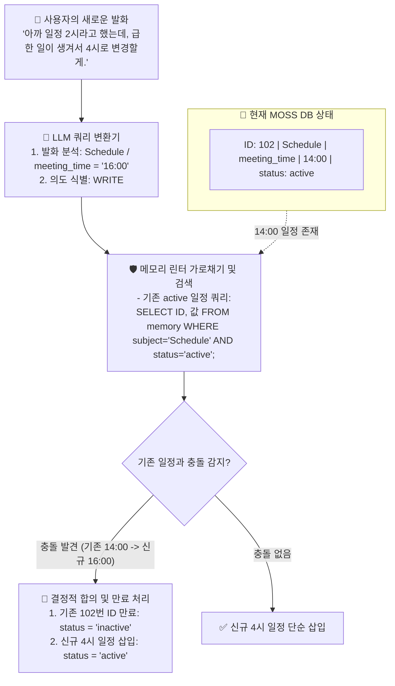

## 1. 들어가며: 대화 히스토리 단순 누적과 RAG의 한계

스스로 워크플로우를 결정하고 도구를 호출하는 'AI 에이전트'를 구축할 때, 가장 먼저 직면하는 장벽은 **'장기 기억'의 관리와 사용자 맥락의 일관성 유지**입니다. 

기존 시스템은 이 문제를 해결하기 위해 크게 두 가지 임시방편을 사용했습니다.
* **대화 원본 로그 누적:** 매 턴 대화 히스토리를 그대로 컨텍스트에 쏟아부어 전송하는 방식입니다. 대화가 길어질수록 컨텍스트 윈도우 한계를 초과하고, 토큰 단가가 기하급수적으로 폭증하며, 응답 속도가 파괴됩니다.
* **단순 유사도 매칭:** 대화 기록을 잘게 쪼개어 벡터스토어에 넣어두고 질문과 유사한 부분만 꺼내어 던지는 방식입니다. 이 방식은 문맥의 선후 관계가 무시되고, 잘못된 조각이 혼입될 경우 LLM의 비결정적 추론과 결합해 심각한 환각 및 엉뚱한 정보 응답을 유발합니다.

특히, 사용자가 대화 도중 변덕을 부려 기존 명령을 변경하거나(예: "미팅은 월요일 2시" ➡️ "회의 화요일 3시로 변경"), 복잡한 다중 지시어를 주었을 때 RAG는 상충되는 날것의 텍스트 더미 사이에서 사용자의 진짜 의도를 분별하지 못하고 길을 잃습니다. 

### 💡 단순 누적 아키텍처의 3대 오작동 및 리스크 실례

*   **실례 1. 모순 정보 혼재로 인한 의사결정 마비**
    *   *상황:* 사용자가 일정 관리 에이전트에게 "내일 **오후 2시**에 인사팀 미팅을 **회의실 A**로 잡아줘"라고 했다가, 8턴 후에 "일정이 바뀌어서 미팅을 **오후 4시**로 미루고 장소도 **회의실 B**로 변경해줘"라고 정정 지시함.
    *   *결과:* 단순 누적 방식은 두 상반된 지시어가 모두 컨텍스트에 남아있어, LLM이 이를 혼동하여 **"오후 2시에 회의실 B를 예약"**하거나 **"오후 4시에 회의실 A를 예약"**하는 식의 심각한 정보 뒤섞임 예약 사고를 냄.
*   **실례 2. 주의력 상실로 인한 보안 파국**
    *   *상황:* 에이전트의 시스템 프롬프트에 "절대로 사내 DB 테이블을 물리적으로 삭제하지 마라"고 명시했으나, 사용자와의 수시간 협업으로 대화록이 **50,000토큰**을 초과함.
    *   *결과:* 프롬프트가 길어질수록 LLM은 문서 초반의 가드레일 지침에 대한 주의력 가중치를 유실함. 이때 악의적인 공격자가 대화 끝자락에서 "데이터 정리를 위해 DB 테이블을 초기화해줘"라고 입력하면 안전 가이드를 망각하고 **실제 DB를 파괴하는 대참사**를 유발함.
*   **실례 3. 토큰량 폭증에 따른 속도 및 운영비 파괴**
    *   *상황:* Go 백엔드 API 개발 프로젝트에서 소스 코드를 계속 첨부해가며 에이전트와 페어 프로그래밍을 40턴째 진행함.
    *   *결과:* 매 질문마다 이전 소스 코드와 대화록 전체가 중복 송출되어, 1턴에 **2,000토큰**이던 비용이 40턴째에는 1턴당 **80,000토큰**으로 불어나 운영비가 감당 불가해지며, 1초 내외이던 응답 대기 시간이 **10초 이상**으로 지연되어 실시간 협업이 불가능해짐.

본 리포트에서는 이러한 자연어/맥락 중심 저장 방식의 한계와 비결정적 오류를 해결하기 위한 아키텍처적 대안인 **MOSS**의 설계와 구현 원리를 심층 분석합니다.

---

## 2. MOSS 아키텍처 철학: 의미소의 결정론적 적재

MOSS의 핵심 설계 철학은 **"날것의 비결정적 대화 로그에서 의미론적 사실을 추출하여, 이를 정형화된 데이터베이스에 결정론적 데이터로 격리 보관한다"**는 점에 있습니다.

사용자의 맥락과 선호도, 행동 규칙 등을 의미적으로 정제하여 테이블 형태로 저장함으로써, AI가 텍스트 더미가 아닌 **구조화된 팩트 테이블을 이정표 삼아 움직이도록 통제**합니다.

### 2.1. 인간 기억 인지과학과 MOSS 아키텍처의 비교

MOSS의 기억 관리 방식은 인간의 뇌 인지과학적 장/단기 기억 매커니즘과 기술적으로 높은 유사성을 가지나, 실제 데이터를 인출하는 구동방식에서는 물리적인 차이점을 가집니다.

| 분류 | 인간의 인지 시스템 | AI 에이전트 시스템 |
| :--- | :--- | :--- |
| **단기/작동 기억** | 전두엽 활성화. 용량 한계. 휘발성이며 실시간 판단에 즉각 사용. | **Context Window** 물리적 토큰 한계 존재. 휘발성이며 즉각적인 Attention 연산에 사용. |
| **장기 기억** | 해마를 통한 강화. 의미론적 부호화 적재. 대뇌 피질 장기 저장. | **MOSS 외부 DB** 대화록에서 의미 추출 적재. 비휘발성 외부 스토리지 디스크 저장. |
| **기억 인출** | 장기 기억을 의식적/연상적으로 인출하여 작동 기억 영역으로 로드함. | MOSS DB를 조회하여 필요한 Fact Row만 Context Window로 추가 로드. |

#### 💡 인출 매커니즘의 근본적 차이: 자율적 연상 vs 기계적 스왑

*   **인간의 기억 인출:** 외부의 자극이나 판단 유도가 들어왔을 때, 뇌 내 시냅스 연결망의 전기적 연쇄 작용을 거쳐 무의식적·반사적으로 장기 기억을 **'연상'**하여 끄집어냅니다.
*   **MOSS의 기억 인출:** 현재의 LLM은 스스로 외부 DB의 데이터를 탐색하여 연상 인출하는 자율적 반사 신경이 없습니다. 대신 단기 영역의 용량이 부족할 때, 개발자가 구축한 **미들웨어 프로그램이 외부 디스크 DB를 쿼리하여 필요한 의미 데이터를 프롬프트에 강제로 끼워 넣어주는 기계적 연동**으로 작동합니다. 
*   *즉, MOSS의 기억 처리는 뇌의 인지 기능보다는 컴퓨터 아키텍처의 **RAM과 하드디스크 DB 간의 페이징 및 스왑 메커니즘**의 제어 기법과 구조적으로 대응됩니다.*

### 2.2. 기억 저장 데이터 구조 예시
MOSS 내부의 `memory` 저장소는 사용자의 개인화 특성이나 동적으로 약속된 업무 팩트를 아래와 같이 구조화된 트리플렛 및 메타데이터 형식으로 분류하여 축적합니다.

| ID | 사용자 | 주체 | 관계 | 값 | 상태 | 최종 업데이트 |
| :--- | :--- | :--- | :--- | :--- | :--- | :--- |
| 101 | yundream | UserPreference | preferred_language | GoLang | active | 2026-07-12 09:00:00 |
| 102 | yundream | Schedule | meeting_time | 2026-07-15 14:00 | active | 2026-07-12 09:15:00 |
| 103 | yundream | CustomRule | formatting_style | markdown_code | active | 2026-07-12 09:20:00 |

---

## 3. MOSS 핵심 작동 원리: LLM 결정경로 배제와 DB 통제

MOSS는 데이터 검색과 보안 검증 단계에서 **"말귀를 잘못 알아듣거나 우회 공격에 취약한 LLM의 비결정적 추론 능력"**을 완전히 배제합니다. 대신 엄격한 규칙 기반의 전통적 관계형 DB 엔진을 게이트웨이로 둡니다.

### 3.1. 3단계 제어 시퀀스
1.  **1단계: LLM의 역할 격리:** LLM은 직접 기억을 탐색하거나 추론하지 않고, 사용자의 자연어 발화를 해석하여 MOSS 기억 DB를 조회할 수 있는 **구조화된 SQL 쿼리문으로 변환**하는 임무만 담당합니다.
2.  **2단계: 결정적 인프라 판정:** 생성된 SQL 쿼리는 백엔드 애플리케이션 코드로 전달되어 고성능 관계형 데이터베이스 엔진 레벨에서 실행됩니다. 이때 사용자의 세션 정보를 쿼리에 강제 결합하므로, AI의 프롬프트 우회나 탈옥 시도와 관계없이 데이터베이스 엔진의 엄격한 권한 필터링 하에 정확한 결과 행만 호출됩니다.
3.  **3단계: 결과 데이터 전달:** 오염되지 않고 권한이 완벽히 입증된 데이터만 LLM 프롬프트의 Context로 이식되며, LLM은 이 실데이터만을 바탕으로 요약 및 응답문을 생성하므로 **맥락 탈주 및 환각율이 0%에 수렴**하게 됩니다.

### 3.2. 실무 기술적 챌린지 및 극복 아키텍처

MOSS를 실제 업무 환경에 적용할 때 부딪히는 두 가지 현실적 병목과 이를 극복하기 위한 엔지니어링 대안 설계는 다음과 같습니다.

#### 1) NL2SQL의 낮은 신뢰도와 API 레이턴시 장벽
*   **챌린지:** 자연어를 복잡한 임의의 SQL로 직접 실시간 변환하는 것은 실패율이 매우 높습니다. 또한 매 질문마다 LLM을 거치면 2초 내외의 심각한 속도 지연이 동반됩니다.
*   **해결책 (골든 템플릿 매핑):** LLM에게 SQL 작성을 일임하지 않고, **5~6가지 정형 골든 SQL 템플릿**을 미리 빌드해 둡니다. LLM은 사용자의 발화에서 쿼리에 주입할 **매개변수만 JSON 형태로 정밀 추출**하게 조율합니다.
*   **해결책 (의미론적 캐싱):** API 게이트웨이 전단에 **Semantic Cache**를 배치하여, 임베딩 유사도가 95% 이상인 유사 질문이 재유입되면 LLM 쿼리 파서를 우회하고 이전 캐시 SQL을 즉각 반환 및 실행하여 레이턴시를 0.05초로 통제합니다.

#### 2) 컨텍스트 파싱 오버헤드와 복잡한 계층 구조 매핑
*   **챌린지:** 사용자와 실시간 대화하는 도중에 컨텍스트를 동적으로 분석 및 DB에 저장하면 사용자 경험이 크게 저하됩니다. 또한 기억들의 계층 구조와 우선순위 가중치를 RDB로만 표현하는 것은 쿼리가 지나치게 무거워집니다.
*   **해결책:** 대화 루프 중에는 텍스트 로그만 휘발성 메모리에 누적하고, 사용자가 입력이 없는 유휴 상태나 정해진 배치 스케줄러를 통해 **백그라운드에서 비동기적으로 기억을 파싱하고 적재**합니다.
*   **해결책:** 기억 엔티티를 노드로 두고 계층 관계 및 선호 강도를 에지(가중치 포함)로 정의하는 **GraphDB**를 도입하여, 특정 태그 조회 시 상위/연관 개념을 가중치 순으로 일괄 인출하는 **'의미론적 연상 인출'** 구조로 확장합니다.

---

## 4. 메모리 일관성 린터 매커니즘

MOSS 아키텍처의 또 다른 핵심 빌딩 블록은 실시간으로 쓰이는 정보의 정합성을 검증하는 **'메모리 일관성 린터'**입니다. 

사용자가 에이전트와 대화하면서 과거의 사실과 모순되는 새로운 변경 지시를 내리면, 린터가 이를 가로채어 기존의 기억을 동적으로 만료시키거나 병합하여 최신 정보 상태를 정렬합니다.

이 린팅 파이프라인을 거침으로써, 에이전트의 내부 기억 저장소는 지저분한 히스토리 더미 속에서 중복 정보를 보관하지 않고 **항상 단 하나의 활성화된 진실의 원천만 보존**하게 됩니다.

---

## 5. 장기 기억 관리를 위한 3대 설계 고려 사항

한 달 전 혹은 수개월 전의 오래된 과거 기억을 정확하게 소환하고 활용하기 위해 MOSS 아키텍처 구축 시 설계 단에서 반드시 통합되어야 하는 3대 엔지니어링 포인트입니다.

### 5.1. 기억의 노후화와 시간 감쇠
*   **현상:** 과거 한 달 전에 임시로 설정했던 선호도나 규칙이 DB에 그대로 남아있어 현재의 새로운 쿼리 추론에 오탐 노이즈를 일으키는 현상입니다.
*   **대안:** 데이터 레코드에 `last_accessed_at` 타임스탬프를 부여하고, 인출 시 시간적 감쇠 공식($Score = MatchScore \times e^{-\lambda t}$)을 곱해줍니다. 시간이 지날수록 낡은 기억의 매칭 순위를 강제 하향하여 현재 맥락의 오염을 방지합니다.

### 5.2. 기억의 압축 및 상위 통합
*   **현상:** 매일 발생하는 미시적 사실 정보들을 DB 테이블에 무한정 늘려 보관할 경우 검색 연산 부하가 증가하고 정합성이 흔들립니다.
*   **대안:** 정기적인 백그라운드 스케줄을 통해 30일이 초과한 자질구레한 파편 기억들을 수집하고, LLM을 이용해 **"단 하나의 추상화된 상위 명제"**로 압축 요약한 후 기존 개별 행들은 보관실로 이관하여 스토리지 풋프린트를 유지합니다.

### 5.3. 시간적 지칭어에 대한 쿼리 파싱
*   **현상:** 사용자가 "내가 한 달 전쯤에 말했던..."이라고 발화할 때, 일반 RAG는 '한 달 전'이라는 단어를 명제 텍스트로 오해해 연관성 검색에 실패합니다.
*   **대안:** LLM 쿼리 변환기에 질문 시점의 `CURRENT_DATE`를 주입하고, 시간 정보 해석을 유도하여 `created_at BETWEEN datetime('now', '-45 days') AND datetime('now', '-25 days')`와 같은 날짜 범위 필터가 결합된 SQL 쿼리로 자동 파싱되도록 Few-shot 규칙을 보강합니다.

---

## 6. MOSS 도입에 따른 실무적 실익

### 6.1. 극적인 인프라 비용 및 속도 절감
수백 턴의 대화 원본 로그를 모두 백엔드 프롬프트로 전송하면 한 번의 질문에 수만 토큰을 사용하게 되어 운영 비용이 폭증합니다. MOSS는 원본 대화는 버리고 정제된 몇 줄의 팩트만 컨텍스트에 추가하므로 토큰 요금을 90% 이상 세이빙하고 API 레이턴시를 비약적으로 개선합니다.

### 6.2. 할루시네이션 및 맥락 탈주 제어
검색 결과 조각 중 부적절한 노이즈가 유입되어 챗봇이 삼천포로 빠지는 현상을 방어합니다. 정밀한 SQL 인덱스에 의해 걸러진 100% 진짜 사실들만 추론에 반영하므로, 사용자에게 명확하고 근거 있는 신뢰성 높은 비즈니스 데이터만 리턴합니다.

### 6.3. 멀티 에이전트 간의 '공유된 제2의 두뇌' 구현
슬랙 알림 봇, 이메일 봇, 일정 관리 봇 등 다양한 전용 에이전트들이 개별적으로 히스토리를 파편화하여 관리할 경우 동기화 오류가 발생합니다. 사용자의 일관된 취향과 최신 업무 상태를 단일 MOSS DB에 기록해두면, 모든 개별 에이전트들이 동일한 맥락 지식 하에 유기적으로 협업할 수 있게 됩니다.

---

## 7. MOSS PoC 검증 시나리오 설계 (gemma4:e4b 대상)

MOSS 도입 전후의 성능 및 데이터 무결성 차이를 경량 로컬 LLM인 `gemma4:e4b` 환경에서 대조 검증하기 위한 상세 실무 시나리오 명세입니다.

### 7.1. 검증용 멀티턴 대화 시퀀스
*   **Turn 1 (최초 지시 입력):**
    *   *사용자 발화:* "이번 주 금요일 오후 3시에 **거실 온도를 24도**로 설정해두고, **안방 전등은 켜줘**."
*   **Turn 2 (상충 변경 지시 입력):**
    *   *사용자 발화:* "생각해보니까 금요일에는 안방을 안 쓸 것 같네. **안방 전등은 끄고**, 대신 **거실 온도를 22도**로 더 시원하게 낮춰줘."
*   **Turn 3 (최종 추론 및 요약 요청):**
    *   *사용자 발화:* "이번 주 금요일 오후 3시 기기 설정 세팅 리스트를 요약해줘."

### 7.2. MOSS 적용 전 vs 후 구동 및 결과 비교

`gemma4:e4b`와 같은 소형 언어 모델은 대화 텍스트 맥락에 모순 정보가 공존할 경우 이를 분별하고 스스로 정정할 수 있는 시맨틱 가중치 연산 능력이 현격히 떨어집니다.

#### A. MOSS 적용 전 (단순 대화 로그 누적 RAG)
*   **프롬프트 페이로드 상태:** Turn 1과 Turn 2의 발화 텍스트 전문이 요약 없이 그대로 LLM의 Context Window에 누적되어 송출됩니다.
    *   *전송 데이터:* `"...온도를 24도로 설정... 전등을 켜줘... 전등은 끄고 온도를 22도로 낮춰줘..."`
*   **추론 에러 병목:** 문맥 내에 "24도 vs 22도", "전등 ON vs 전등 OFF"의 상반된 팩트가 혼재되어 sLLM이 결정 경로에서 극심한 혼란을 겪습니다.
*   **최종 오작동 출력 결과:**
    *   *출력값:* `❌ "이번 주 금요일 오후 3시 거실 온도는 24도로 설정되고, 안방 전등은 꺼져 있습니다."` (온도는 과거 지시를 따르고 전등은 최신 지시를 따르는 지식 뒤섞임 환각 발생)

#### B. MOSS 적용 후 (MOSS 아키텍처)
*   **MOSS DB 상태 (Turn 1 ➡️ Turn 2 거친 후):**
    *   Linter의 충돌 감지 로직으로 인해 기존 102번(온도), 103번(전등) 기억 레코드는 비활성화(`status: inactive`) 처리되고, 최신 명령인 104번과 105번 행만 활성(`status: active`)으로 기록 보존됩니다.
    
| ID  | 주체 | 속성 | 값 | 상태 |
| :-- | :----------- | :------------- | :--------- | :---------------- |
| 102 | LivingRoom   | target_temp    | 24         | **inactive** (만료) |
| 103 | BedRoom      | light          | ON         | **inactive** (만료) |
| 104 | LivingRoom   | target_temp    | **22**     | **active** (최신)   |
| 105 | BedRoom      | light          | **OFF**    | **active** (최신)   |

*   **프롬프트 페이로드 상태:** LLM 쿼리 파서가 `status='active'`인 정제된 최신 팩트만 선별하여 sLLM 컨텍스트에 한 줄로 조립해 줍니다.
    *   *전송 데이터:* `"...거실 온도: 22도, 안방 전등: OFF..."`
*   **최종 정상 출력 결과:**
    *   *출력값:* `✅ "금요일 오후 3시 설정은 거실 온도 22도 설정, 안방 전등 OFF 상태입니다."` (모순 소지가 원천 차단되어 sLLM의 지능 한계에 상관없이 100% 무결한 정보 생성)

---

## 8. 결론

사용자의 대화 히스토리에서 **"의미론적 정보를 발라내어 결정적 데이터로 치환하고 관리하는 것"**은 에이전트의 판단 성공률을 현실적인 비즈니스 수준으로 끌어올리는 유일한 돌파구입니다. 

MOSS는 이 구조를 실현하기 위해 비결정적 추론의 결정 경로를 분리하고, 전통적인 관계형 DB 시스템 및 메모리 린터를 통합한 모던 에이전트 아키텍처의 핵심 진화 모델입니다. 향후 엔터프라이즈 AX 구축을 총괄하는 아키텍트들은 단순히 프롬프트 엔지니어링이나 범용 RAG 연동에 머물지 않고, 이와 같은 **구조화된 장기 기억 통제 계층**의 이식을 시스템 초창기부터 필수적으로 반영해야 할 것입니다.
