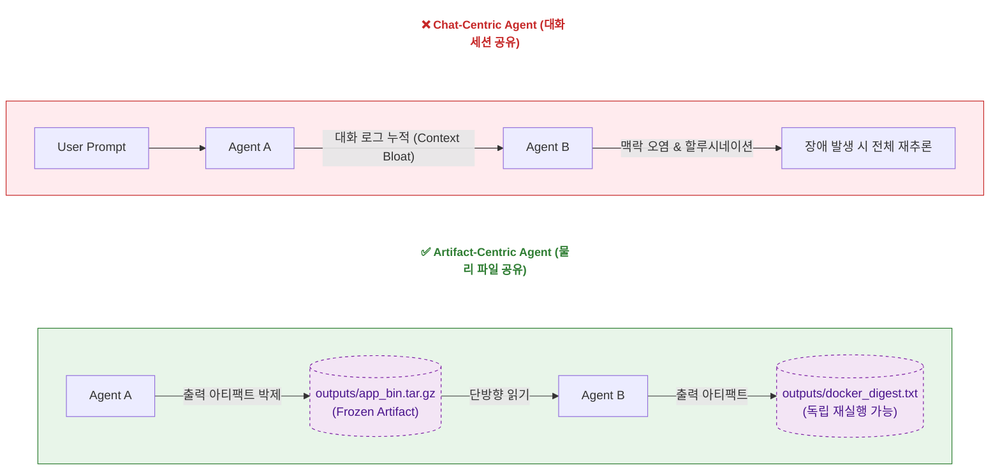
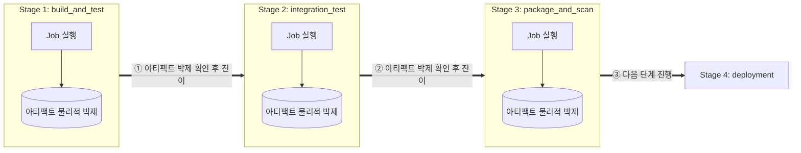
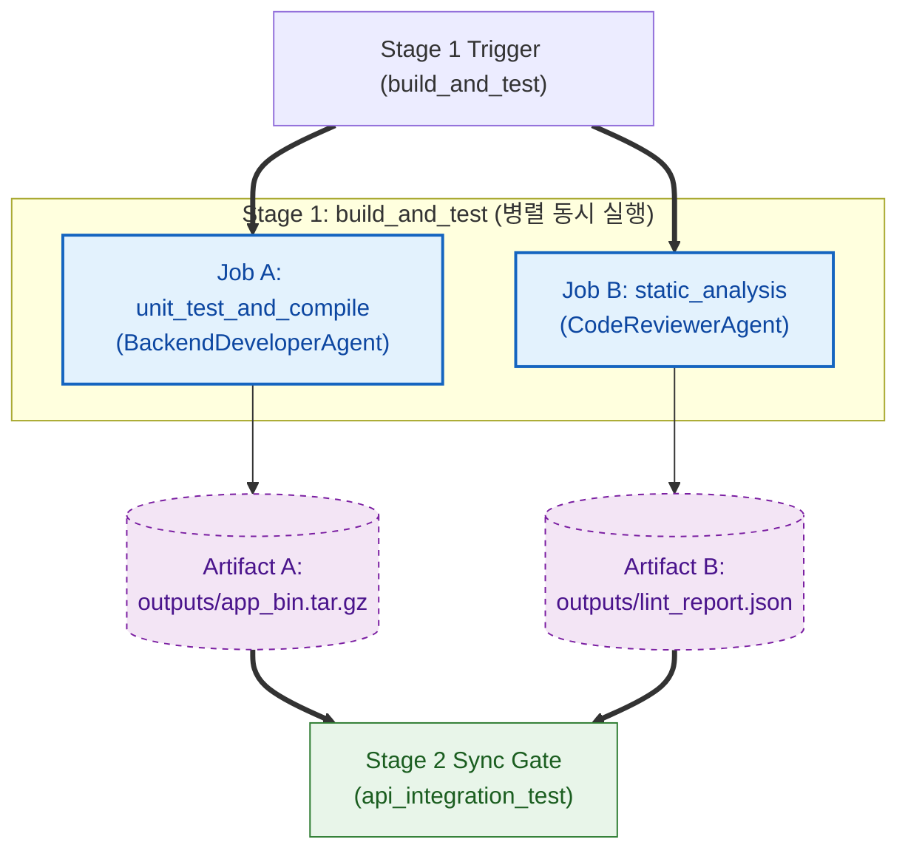
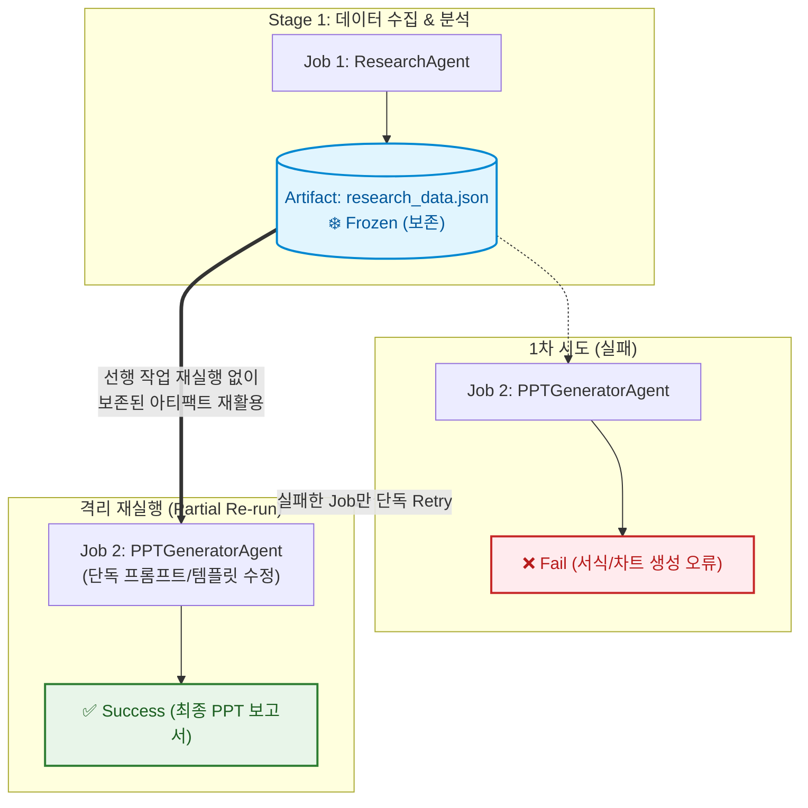
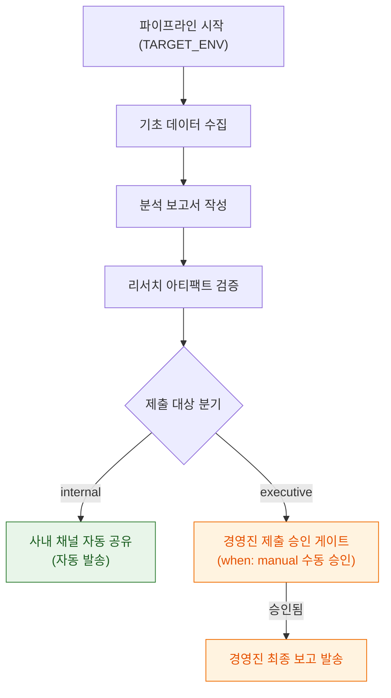
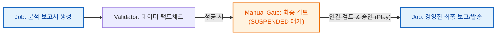

## 1. 들어가며: AI 에이전트를 CI/CD 배포 파이프라인처럼 제어하기

기존의 대화형 에이전트(Chat-Centric Agent)는 비결정론적 성격 때문에 프로덕션 환경에서 장애 예측과 디버깅이 어렵습니다. 에이전트 간의 자유로운 대화 로그가 누적되면 맥락 유실(Context Bloat)과 할루시네이션이 연쇄적으로 발생합니다.

이 문제를 해결하기 위해 소프트웨어 공학에서 검증된 **GitLab CI/CD 파이프라인 아키텍처**를 에이전트 워크플로우에 결합하는 방안이 가장 강력한 해법으로 제시되고 있습니다. 

에이전트를 자유롭게 풀어두는 생물학적 객체로 취급하는 대신, **선언적(Declarative) 명세에 의해 통제되고 독립된 Job으로 격리되어 Artifact를 남기는 파이프라인의 일원**으로 제어하는 설계 구조를 분석합니다.

---

## 1.1 Chat-Centric vs Artifact-Centric: 패러다임의 전환

AI 에이전트 시스템을 구축할 때 상태(State)를 어디에 보관하고 에이전트 간에 어떻게 전달하느냐에 따라 시스템의 안정성과 운영 비용 구조가 완전히 달라집니다.



### ① Chat-Centric 패러다임의 한계 (대화 메모리 의존)
대화형 에이전트는 이전 작업의 모든 진행 상황과 에러 로그를 하나의 연속된 대화 텍스트(Context Window)에 누적합니다.
* **Context Bloat (맥락 과부하)**: 단계가 거듭될수록 대화 텍스트가 거대해져 추론 비용이 지수함수적으로 증가하고 처리 속도가 느려집니다.
* **맥락 오염 (Context Contamination)**: 이전 단계에서 발생했던 실패한 시도나 디버깅 에러 로그가 대화 세션 전체에 남아 이후 에이전트의 판단까지 할루시네이션으로 오염시킵니다.
* **부분 수정 불가능**: 중간 단계만 수정하고 싶어도 대화 세션 전체를 다시 읽고 처음부터 추론해야 합니다.

### ② Artifact-Centric 패러다임의 원리 (상태의 외부화)
Artifact-Centric 아키텍처는 에이전트 간 대화 로그를 일절 공유하지 않습니다. 에이전트는 오직 **검증된 물리적 아티팩트(JSON, Tar, XML 등)**로만 의사소통합니다.

| 비교 항목 | Chat-Centric Agent | Artifact-Centric Agent |
| :--- | :--- | :--- |
| **상태(State) 저장소** | LLM Context Window (대화 텍스트) | 외부 물리 파일 시스템 (Blackboard Architecture) |
| **에이전트 입력** | 누적된 전체 대화 히스토리 | 이전 Stage의 지정된 Artifact 파일만 단방향 읽기 |
| **에러 격리 범위** | 실패한 에러 로그가 대화 전체를 오염 | 실패한 Job의 아티팩트만 파기 후 해당 Job만 단독 재실행 |
| **결정론 및 재현성** | 비결정론적 (대화 세션 맥락에 따라 응답 변동) | 결정론적 (동일 Artifact 입력 시 언제나 재현 가능) |

---

## 2. GitLab CI/CD와 Agentic AI의 1:1 아키텍처 매핑

GitLab CI/CD의 핵심 개념들은 AI 에이전트 시스템에 아래와 같이 1:1로 대응하여 이식될 수 있습니다.

| GitLab CI/CD 개념 | Agentic AI 매핑 사상 | 설명 |
| :--- | :--- | :--- |
| **Pipeline** | **Agentic Workflow** | 개발 소스코드 빌드부터 테스트, 이미지 스캔, 배포까지 완수하는 에이전트 실행 흐름 |
| **YAML Spec** | **Declarative Agent Spec** | 워크플로우를 코드가 아닌 `.gitlab-ci.yml` 스타일의 선언형 명세로 구조 정의 (`needs` 제어) |
| **Job** | **Agent Task Node** | 단일 에이전트가 단일 목적(Prompt, Tool, Model)을 위해 독립 격리 실행되는 단위 |
| **Artifacts** | **Task State Storage** | Job 실행 중 생성된 모든 입력, 프롬프트, 바이너리, 검증 리포트를 패키징한 저장소 |
| **Manual Action** | **Human-in-the-Loop (HITL)** | `when: manual`과 같이 인간의 수동 승인/검증이 완료되기 전까지 운영 배포 실행을 차단하는 게이트 |
| **Rules / Conditions** | **Guardrails / Validators** | 이전 Job의 결과물이 테스트/보안 린터를 통과해야만 다음 Job을 트리거하는 실행 제약 조건 |

---

## 3. 선언적 YAML 기반 Agentic Pipeline 정의 (App CI/CD 사례)

파이프라인의 구조를 하드코딩하지 않고, 선언적(Declarative)인 `.gitlab-ci.yml` 키워드 표준으로 정의하여 에이전트 간의 선후 관계와 직/병렬 실행을 제어합니다. 아래는 **애플리케이션 소스코드 빌드, 테스트, 도커 패키징, 보안 스캔 파이프라인** 예시입니다.

```yaml
# .gitlab-agent-ci.yml
stages:
  - build_and_test
  - integration_test
  - package_and_scan
  - deployment

# 1단계-A: 단위 테스트 및 실행 바이너리 빌드
unit_test_and_compile:
  stage: build_and_test
  agent:
    name: BackendDeveloperAgent
    model: gemini-3.5-pro
    tools: [ GoCompiler, GoUnitTestRunner ]
  script:
    - prompt: "소스를 컴파일하고 단위 테스트 실행"
  artifacts:
    paths:
      - outputs/app_bin.tar.gz

# 1단계-B: 정적 코드 분석 (Linter)
static_analysis:
  stage: build_and_test
  agent:
    name: CodeReviewerAgent
    tools: [ SonarQubeLinter ]
  artifacts:
    paths:
      - outputs/lint_report.json

# 2단계: API 통합 테스트 (1단계 아티팩트 필요)
api_integration_test:
  stage: integration_test
  needs:
    - unit_test_and_compile
    - static_analysis
  agent:
    name: QAEngineerAgent
    tools: [ PostmanRunner ]
  artifacts:
    paths:
      - outputs/integration_report.json

# 3단계-A: 도커 이미지 빌드
docker_build:
  stage: package_and_scan
  needs:
    - api_integration_test
  agent:
    name: DevOpsAgent
    tools: [ DockerEngine ]
  artifacts:
    paths:
      - outputs/docker_digest.txt

# 3단계-B: 도커 이미지 보안 취약점 스캔
security_vulnerability_scan:
  stage: package_and_scan
  needs:
    - docker_build
  agent:
    name: SecurityAgent
    tools: [ TrivyScanner ]
  artifacts:
    paths:
      - outputs/vuln_report.json

# 4단계: 운영 배포 수동 승인 게이트
prod_deploy_gate:
  stage: deployment
  needs:
    - docker_build
    - security_vulnerability_scan
  rules:
    - if: '$TARGET_ENV == "prod"'
      when: manual             # 운영 환경 배포 시 수동 승인 게이트
    - if: '$TARGET_ENV == "dev"'
      when: always
```

이 구조에서는 `needs` 명세를 통해 `api_integration_test` Job이 실행되기 전에 `app_bin.tar.gz`와 `lint_report.json`이라는 **독립된 Artifact**가 안전하게 디스크에 생성 및 확정되어 있을 것임을 보장합니다.

---

## 3.1 파이프라인 시각화 (GitLab CI/CD Pipeline Diagram)

위 선언적 YAML 구조를 기반으로 1단계부터 4단계까지 Stage별 병렬 Job 실행과 Artifact의 의존성 흐름을 시각화하면 다음과 같습니다.

```mermaid
flowchart LR
    subgraph Stage1["1단계: build_and_test"]
        direction TB
        J1_1["unit_test_and_compile<br/>(BackendDeveloperAgent)"]
        J1_2["static_analysis<br/>(CodeReviewerAgent)"]
    end

    subgraph Stage2["2단계: integration_test"]
        direction TB
        J2_1["api_integration_test<br/>(QAEngineerAgent)"]
    end

    subgraph Stage3["3단계: package_and_scan"]
        direction TB
        J3_1["docker_build<br/>(DevOpsAgent)"]
        J3_2["security_vulnerability_scan<br/>(SecurityAgent)"]
    end

    subgraph Stage4["4단계: deployment"]
        direction TB
        J4_1["prod_deploy_gate<br/>(when: manual)"]
    end

    %% Pipeline Control Flow
    Stage1 ==> Stage2 ==> Stage3 ==> Stage4

    %% Artifact & Data Flow Dependencies
    A1[("Artifact:<br/>outputs/app_bin.tar.gz")]
    A2[("Artifact:<br/>outputs/lint_report.json")]
    A3[("Artifact:<br/>outputs/integration_report.json")]
    A4_1[("Artifact:<br/>outputs/docker_digest.txt")]
    A4_2[("Artifact:<br/>outputs/vuln_report.json")]

    J1_1 -.-> A1
    J1_2 -.-> A2
    A1 & A2 -.-> J2_1
    J2_1 -.-> A3
    A3 -.-> J3_1
    J3_1 -.-> A4_1
    A4_1 -.-> J3_2 -.-> A4_2

    A4_1 & A4_2 -.-> J4_1

    classDef stageStyle fill:#f8f9fa,stroke:#6c757d,stroke-width:1px,color:#212529;
    classDef jobStyle fill:#e3f2fd,stroke:#1565c0,stroke-width:2px,color:#0d47a1;
    classDef manualStyle fill:#fff3e0,stroke:#ef6c00,stroke-width:2px,color:#e65100;
    classDef artifactStyle fill:#f3e5f5,stroke:#7b1fa2,stroke-width:1px,stroke-dasharray: 4 4,color:#4a148c;

    class Stage1,Stage2,Stage3,Stage4 stageStyle;
    class J1_1,J1_2,J2_1,J3_1,J3_2 jobStyle;
    class J4_1 manualStyle;
    class A1,A2,A3,A4_1,A4_2 artifactStyle;
```



---

## 3.2 Artifact-Centric 워크플로우 5대 제어 메커니즘 명세

GitLab CI/CD 파이프라인 제어 사상을 이식하여 AI 에이전트를 완벽히 통제 가능한 결정론적 오케스트레이션 엔진으로 정립하는 5가지 핵심 제어 구조입니다.

### ① 순차적 단계 진행 (Sequential Stage Execution)
파이프라인 최상위 `stages` 명시에 따라 `build_and_test` ➔ `integration_test` ➔ `package_and_scan` 순으로 동기화(Sync)되어 진행되며, 이전 단계의 아티팩트가 물리적으로 박제된 후에만 다음 단계로 상태가 전이됩니다.

**적합한 시나리오:**
* **단계별 업무 의존성**: 기초 데이터 수집 ➔ 분석 보고서 작성 ➔ 경영진 발표자료(PPT) 생성처럼 앞 단계 아티팩트가 확정되어야 다음 작성이 가능한 시나리오
* **단계별 가드레일 검증**: 시장 조사 데이터 팩트체크가 통과되어야만 비용이 발생하는 외부 컨설팅/세부 분석 단계로 넘어가야 하는 시나리오
* **맥락 오염 방지**: 원본 리서치 내용과 요약 보고서 생성을 분리하여 대화 히스토리 누적으로 인한 할루시네이션 오염을 차단하는 시나리오



### ② Job의 병렬 실행 (Parallel Job Execution)
동일한 `stage` 내의 `unit_test_and_compile`과 `static_analysis`처럼 의존성이 없는 Job들은 파이프라인 러너에 의해 동시에 병렬(Concurrent) 실행되어 LLM 대기 시간과 Latency를 최소화합니다.

**적합한 시나리오:**
* **이종 전문 에이전트 동시 검토**: 하나의 기획안/계약서 원문 기반으로 `법무 검토`, `재무 영향 분석`, `다국어 번역`을 병렬 수행하는 시나리오
* **다각도 데이터 수집**: 동일 주제에 대해 뉴스, 학술 논문, 시장 동향 데이터를 각각 다른 수집 에이전트가 동시에 가져오는 시나리오
* **업무 처리 시간 최적화**: 독립적인 분석/작성 작업들을 동시 처리하여 전체 업무 완료 시간을 단축하는 시나리오



### ③ DAG 기반 선후 관계 제어 (Directed Acyclic Graph & `needs`)
`needs` 키워드를 사용해 Stage 순서와 별개로 특정 Job이 필요로 하는 입력 아티팩트를 기준으로 정밀한 유하향 비순환 그래프(DAG) 선후 관계를 정의합니다.

### ④ 격리 재실행 및 부분 재실행 (Partial Re-run & Retry)
3단계 보안 스캔(`security_vulnerability_scan`)에서 이미지 취약점이 감지되어 실패할 경우, 1, 2단계 성공 아티팩트(`app_bin.tar.gz`, `integration_report.json`)는 읽기 전용(Frozen)으로 보존한 채 **실패한 3단계(도커 빌드 및 스캔)만 단독 수정 및 재실행**합니다.

**적합한 시나리오:**
* **서식/표현 단계 선택적 재작업**: 1~2단계(데이터 수집·분석)는 완벽하나 3단계(시각화 차트/PPT 양식 생성)에서 오류 발생 시, 1·2단계 조사를 재실행하지 않고 3단계 서식 에이전트만 재실행하는 시나리오
* **일시적 LLM/외부 API 장애 대응**: 번역이나 특정 포맷 변환 Job만 일시적 장애 발생 시 이미 확보된 분석 아티팩트를 보존한 채 해당 Job만 재시도하는 시나리오
* **고비용 수집 데이터 보존**: 장시간 소요된 대용량 리서치 결과 아티팩트를 그대로 재활용하여 API 토큰 비용과 시간을 절감하는 시나리오



### ⑤ 환경 및 조건별 워크플로우 동적 분기 (Conditional & Dynamic Workflow)
실행 환경(`TARGET_ENV: dev | prod`)이나 아티팩트 검증 조건(`rules`)에 따라 파이프라인 경로가 동적으로 분기됩니다.

**적합한 시나리오:**
* **내부 공유 vs 외부 제출용 보고서 분기**: 팀 내부 참고용은 자동 작성 후 즉시 공유되지만, 경영진/외부 제출용 보고서는 수동 승인 게이트(`when: manual`)를 거쳐 최종 승인 후 발송되는 시나리오
* **리스크 및 금액 기준 조건 분기**: 소액 표준 기획안은 자동 승인 처리되지만, 일정 금액 이상의 기획안은 법무·재무 검토 단계가 동적으로 추가되어 진행되는 시나리오

```yaml
# dev 환경: 자동 배포 / prod 환경: 보안 검증 및 HITL 수동 승인 게이트 포함
prod_deploy_gate:
  stage: deployment
  rules:
    - if: '$TARGET_ENV == "prod"'   # Production 환경일 때만 수동 승인 게이트 활성화
      when: manual
    - if: '$TARGET_ENV == "dev"'    # Dev 환경은 승인 없이 자동 통과
      when: always
```



---

## 4. Job 격리 실행과 '부분 재실행(Partial Re-run)'의 실리

이 아키텍처의 가장 큰 실리적인 이점은 바로 **Job 단위의 격리 실행과 실패 시 부분 재실행**이 가능하다는 점입니다.

```text
[Step 1: 빌드 및 단위 테스트] ➔ Success! (Artifact: app_bin.tar.gz)
         ↓
[Step 2: API 통합 테스트] ➔ Success! (Artifact: integration_report.json)
         ↓
[Step 3: 보안 취약점 스캔] ➔ Fail! ❌ (Trivy 보안 스캔 위반 감지)
```

### ① 전체 재실행 배제
대화형 에이전트에서는 3단계에서 보안 위반 에러가 발생해 수정 지시를 내리면, 1단계에서 빌드했던 소스코드까지 다시 LLM 컨텍스트 세션에 로드하여 처음부터 추론해야 하므로 불필요한 API 요금 폭증과 속도 지연이 수반됩니다.

### ② 격리된 재실행 (Retry)
GitLab CI/CD 방식에서는 3단계 Job이 실패했을 때, 1, 2단계의 성공 결과물인 `app_bin.tar.gz` 및 `integration_report.json`이 디스크(Blackboard)에 Artifact로 박제되어 보존됩니다. 엔지니어는 1, 2단계를 건드리지 않고, 3단계의 프롬프트 템플릿만 수정하여 **"3단계 Job만 단독 재실행(Re-run)"**할 수 있습니다. 
* 3단계 Job은 이전에 보존된 아티팩트들을 단방향 읽기 전용으로만 가져와 즉각 다시 실행됩니다.

---

## 5. 구조적 Artifact와 관측 가능성(Observability)

각 Job이 실행될 때마다 파이프라인 러너(Runner)는 단순 출력 파일뿐만 아니라, 해당 실행의 모든 맥락을 담은 **통합 JSON Artifact**를 빌드하여 저장합니다.

### 실행 이력 JSON Artifact 스키마 예시
```json
{
  "pipeline_id": "biz_pipeline_20260725_01",
  "job_name": "market_analysis_and_report",
  "status": "success",
  "started_at": "2026-07-25T08:20:05Z",
  "finished_at": "2026-07-25T08:20:18Z",
  "inputs": {
    "inputs/raw_market_data.csv": {
      "sha256": "8f4e2c91a0b3...",
      "size_bytes": 452000
    }
  },
  "runtime_config": {
    "model": "gemini-3.5-pro",
    "temperature": 0.2
  },
  "execution_context": {
    "resolved_prompt": "수집된 시장 조사 원본 데이터를 기반으로 주요 키워드 추출 및 경영진 요약 리포트 작성",
    "tool_calls": [
      {
        "tool_name": "MarketDataAnalyzer",
        "arguments": { "input_file": "inputs/raw_market_data.csv", "top_k": 5 },
        "result": { "analyzed_rows": 1250, "status": "completed" }
      }
    ]
  },
  "outputs": {
    "outputs/weekly_executive_report.pdf": {
      "sha256": "9a3b7c1d4e2f...",
      "size_bytes": 1280000
    }
  }
}
```

### 아키텍처 관점의 가치
* **가시성(Visibility)**: 에이전트의 내부 행동을 유추할 필요가 없습니다. 어떤 프롬프트를 주어 어떤 도구를 호출했고, 최종 아웃풋의 해시값이 무엇인지 정확히 기록됩니다.
* **관측 가능성(Observability)**: 파이프라인 모니터링 대시보드에서 각 에이전트 Job의 실행 시간, 소모 토큰, 도구 성공률을 수치화하여 트래킹할 수 있습니다.
* **관리 가능성(Manageability)**: 특정 버전의 인풋 Artifact와 프롬프트를 보존하여 언제든지 동일한 LLM 응답을 재현(Replay)하고 수정 사항을 테스트할 수 있는 결정론적 제어권을 쥐게 됩니다.

---

## 6. 수동 조치(Manual Action)와 가드레일 결합

GitLab CI/CD 파이프라인에서 프로덕션 배포 전 승인 단계(`when: manual`)를 두는 것처럼, 에이전트 노드 사이에 명시적이고 결정론적인 게이트웨이를 설정합니다.



1. **자동 검증 & 시각화**: `docker_digest.txt` 아티팩트가 완성되면, 파이프라인 러너는 보안 취약점 검증(`vuln_report.json`)을 자동 실행합니다.
2. **보류 및 알림 (Manual Gate)**: 검증 통과 후, 파이프라인 상태는 `SUSPENDED`로 변경되며 실제 운영 서버 배포 실행이 중단됩니다.
3. **인간 개입 (HITL)**: 승인자는 챗봇 대화 대신 대시보드에 노출된 **[1. 빌드/통합 테스트 결과 + 2. 보안 취약점 스캔 리포트 + 3. 도커 이미지 Digest]**를 확인하고 **'승인(Play)'** 버튼을 클릭합니다.
4. **결정성 보장**: 승인되어 최종 확정(Frozen)된 수정본 Artifact만 배포 작업으로 흘러 들어갑니다. LLM에게 수정 의견을 주어 다시 그리게 하는 과정의 비결정적 위험 요소를 인간이 직접 제어할 수 있습니다.

---

## 7. 결론: 왜 Artifact-Centric인가? (인간 업무 방식의 본질적 이식)

AI 에이전트의 궁극적 목적은 인간의 실무를 해결하는 것이며, 실제 인간의 업무는 대화가 아닌 **단계별 산출물(Jira, Confluence, 보고서, 코드)을 중심으로 진행**됩니다. 이러한 선언적 워크플로우(Workflow) 자체가 업무 가이드이자 강력한 가드레일이 됩니다.

Artifact-Centric 아키텍처는 LLM의 암묵적이고 비결정적인 추론 과정을 **결정론적인 물리 데이터(Artifact)로 정형화**하는 가장 확실한 해법입니다. 검증된 파이프라인 뼈대 위에서 아티팩트를 보존하는 설계는 AI 에이전트를 프로덕션 환경에 안정적으로 이식하는 엔지니어링 초석이 될 것입니다.
