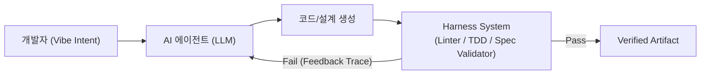

## 1. 들어가며: 왜 바이브 코딩에는 하네스 엔지니어링이 필수인가?

'바이브 코딩(Vibe Coding)'은 개발자가 상세 코드를 직접 타이핑하는 대신, 자연어로 하이레벨 의도를 전달하고 AI 에이전트가 이를 구현하도록 맡기는 현대적 개발 방식입니다. 하지만 아무런 통제 장치 없이 감(Vibe)에만 의존해 코딩을 진행할 경우, 비결정론적(Non-deterministic)인 LLM의 특성으로 인해 맥락 유실, 할루시네이션, 아키텍처 오염, 테스트 미비 등 심각한 프로덕션 위험에 직면하게 됩니다.

이 문제를 해결하는 핵심 개념이 바로 **하네스 엔지니어링(Harness Engineering)**입니다. 하네스(Harness)는 마차의 말에 씌우는 고삐나 안전벨트처럼, 에이전트가 이탈하지 않고 목표 지점까지 전속력으로 달릴 수 있도록 에워싸는 **자동화된 통제 환경 및 피드백 구조**를 의미합니다.

### 1.1 흔한 오해: 단일 솔루션이 아닌 '엔지니어링 프랙티스(Discipline)'

하네스 엔지니어링을 "가져다 쓰면 짠 하고 해결되는 마법의 단일 솔루션이나 매뉴얼"로 오해하기 쉽습니다. 하지만 개발자 커뮤니티 및 전문가(Martin Fowler, ThoughtWorks 등)가 정의하는 하네스는 **`Agent = Model + Harness`** 공식에 기반한 **엔지니어링 프랙티스이자 아키텍처 패턴**입니다.

하네스 엔지니어링의 실체는 특정 라이브러리가 아니라, 대상 프로젝트의 도메인, 테스트 체계, CI/CD, 샌드박스 환경에 맞추어 **자동 검증 센서, 샌드박스, 피드백 루프를 직접 조립(Scaffolding)해 나가는 시스템 구축 과정**입니다.

애자일 원칙(Agile Manifesto)을 안다고해서 자동으로 애자일한 조직이 되지 않는 것처럼, 하네스 엔지니어링 역시 사상만 안다고 해결되지 않습니다. 개인과 팀, 혹은 기업의 기술 환경과 성숙도(Maturity Level)에 맞는 구체적인 행동 지침과 구현 방안을 단계적으로 구축해야 합니다.

### 1.2 왜 지금 '하네스'가 트렌드인가? (버즈워드 vs 실질적 본질)

하네스라는 단어가 최근 트렌드로 부상한 배경에는 ① 에이전틱 AI(Agentic AI)의 탈선 방지 필요성, ② B2B 솔루션 및 컨설팅의 버즈워드(Buzzword) 마케팅, ③ 프로덕션 장애에 대한 기업의 리스크 거버넌스 요구가 결합되어 있습니다.

그러나 Martin Fowler와 Kent Beck 등 업계 거장들이 강조하는 본질은 복잡한 MCP나 거대한 프롬프트 가드레일을 만드느라 리소스를 쏟는 오버엔지니어링(Architecture Astronauts)이 아닙니다. 이들이 정의하는 하네스의 핵심은 **"TDD(테스트 주도 개발)와 린터, CI/CD 스크립트 등 이미 존재하는 결정론적 검증 도구(Deterministic Sensors)야말로 AI를 통제하는 가장 강력하고 실용적인 하네스"**라는 점입니다.

본 쿡북은 소프트웨어 개발 라이프사이클(**기획 ➔ 설계 ➔ 개발 ➔ 배포**) 단계별로 각자의 환경에 맞춰 하네스 체계를 구축할 수 있는 실천적 행동 및 구현 방안을 제시합니다.

---

## 2. 하네스 엔지니어링 아키텍처 Overview

하네스 엔지니어링은 기존 **소프트웨어 개발 라이프사이클(SDLC)의 피드백 루프를 AI 에이전트와 결합하여 초고속으로 회전(가속화)**시키는 아키텍처 구조입니다.

에이전트의 생성 결과물(Output)을 시스템 런타임(Linter, Compiler, Test Suite, Guardrails)이 즉시 검증하고, 그 에러 트레이스를 다시 에이전트에 주입하여 자가 교정(Self-Correction)하도록 통제 고리로 에워쌉니다.



### 2.1 전제 조건: 소프트웨어 공학(Software Engineering) 지식의 재발견

AI가 코딩 타이핑을 대신해 준다고 해서 엔지니어링 지식이 불필요해지는 것은 아닙니다. 마틴 파울러(Martin Fowler), 켄트 백(Kent Beck), 체리티 메이저스(Charity Majors) 등 업계 거장들이 공통으로 지적하듯, AI 에이전트 시대야말로 소프트웨어 공학 및 SDLC 성숙도가 가장 강력하게 요구되는 시기입니다.

1. **비결정성(Non-determinism)의 통제**: LLM은 확률론적(Non-deterministic)으로 동작하므로, 이를 제대로 다루려면 입력과 출력을 정밀하게 통제할 결정론적인 소프트웨어 공학 센서(TDD, 스키마 설계, 정적 분석) 구축 역량이 필수적입니다.
2. **증폭기 효과 (Amplifier Effect)**: AI 에이전트는 공학적 관행이 부재한 조직에서는 결함과 기술 부채를 초고속으로 쏟아내는 증폭기가 되지만, 소프트웨어 공학 성숙도가 높은 조직에서는 생산성을 폭발시키는 최고의 무기가 됩니다.
3. **블랙박스의 위험 방지**: 요구사항 명세와 아키텍처 구조를 설계하는 엔지니어링 기본기가 없다면, 에이전트가 만든 코드는 장애 발생 시 단 한 줄도 디버깅할 수 없는 대재앙(Vibe Slop)이 됩니다.

### 2.2 주 타겟층: 조직 성숙도(Engineering Maturity)와 역할

* **시니어 개발자 및 성숙한 조직**: 이미 검증된 TDD, CI/CD, 정적 분석 체계를 갖추고 있으므로, 하네스를 통해 에이전트 생산성을 폭발적으로 가속화(Hyper-acceleration)시킬 수 있는 **주 핵심 대상**입니다.
* **주니어 및 성장하는 조직**: 하네스 엔지니어링을 학습하고 체계를 직접 구축해 나가는 실천 자체가 **소프트웨어 공학의 베스트 프랙티스를 체득하는 이정표** 역할을 합니다.

### 2.3 하네스 시스템화의 4대 핵심 아키텍처 (Systematization)

하네스를 특정 개별 도구의 단편적 실행에 그치지 않고 개발 라이프사이클 전체에 걸쳐 **시스템화(Systematize)** 구축하기 위해서는 아래 4가지 핵심 아키텍처 컴포넌트가 통합되어야 합니다.

1. **선언적 워크플로우 엔진 (Declarative Workflow Engine)**: 기획 ➔ 설계 ➔ 개발 ➔ 테스트 ➔ 배포 파이프라인의 실행 순서, 의존성(DAG), 분기 조건(If/Else), 자가 교정 루프(Loop)를 총괄 제어하는 오케스트레이션 지도 역할을 수행합니다.
2. **상태 머신 엔진 (State Machine Engine)**: 정의된 워크플로우 상에서 현재 프로젝트의 라이프사이클 위치와 런타임 체크포인트를 저장하고 추적합니다.
3. **게이트키퍼 인터셉터 (Gatekeeper Interceptor)**: 각 단계 전이 길목에서 하네스 센서 검증 신호가 `Pass`가 아닐 경우, 에이전트의 다음 단계 진입을 시스템 차원에서 강제 차단(Block)합니다.
### 2.4 본질: 전체 과정을 가두는 통합 SDLC 하네스 체계 (Holistic SDLC Harnessing)

하네스 엔지니어링은 단순히 `Makefile`이나 특정 빌드/테스트 도구를 만드는 개발 초기 환경 구축 작업에 그치지 않습니다. **기획부터 배포까지의 전 과정(SDLC)**에 걸쳐 에이전트가 이탈 없이 사용자와 완주할 수 있도록 통제 틀과 검증 고리를 씌우는 통합 체계입니다.

1. **기획 과정의 하네스화**: 개발자의 모호한 자연어 아이디어를 에이전트의 의도 파악과 역질문 인터뷰를 거쳐 **기계 검증 가능한 명세(Spec) 및 수락 조건 틀**에 가둡니다.
2. **설계 과정의 하네스화**: 확정된 기획 명세를 프로젝트의 **불변 아키텍처 규칙(`AGENTS.md`) 및 데이터/API 스키마 계약(Contract) 틀**에 가두어 위반을 사전에 방지합니다.
3. **개발/테스트 과정의 하네스화**: 코드 작성을 **자동화된 정적 검증 센서와 TDD 자가 교정 피드백 루프 틀**에 가두어 결함을 다스립니다.
4. **배포 과정의 하네스화**: 최종 생성물을 **프로덕션 무결성 검증 파이프라인 틀**에 가두어 안전한 릴리즈를 통제합니다.

### 2.5 실전 하네스 툴셋: 문서/스펙 기반 SDLC 자동 압착(Compression) 파이프라인

가장 이상적인 하네스 툴셋은 개발자가 일일이 복잡한 가드레일을 작성하는 것이 아니라, **명령 한 줄로 디렉토리 구조를 생성하고 원시 자료부터 테스트 코드까지 AI가 연쇄 참조(Chaining)하여 개발 주기를 압착**하는 구조입니다.

```text
.
├── 01_planning/                        # [Phase 1: 기획 & 요구사항 명세]
│   ├── 00_raw_inputs/                  #   - 원시 요구사항 (PDF, 이메일, 회의록 음성/텍스트)
│   ├── 01_user_requirements.md         #   - 원시 자료 기반 추출 요구사항 명세
│   ├── 02_persona_and_market.md        #   - 고객 페르소나 및 시장 분석 리포트
│   └── 03_functional_requirements.md   #   - 기능 요구사항 리스트 & 수락 조건
│
├── 02_architecture_and_design/         # [Phase 2: 아키텍처 & 인터페이스 설계]
│   ├── 01_detailed_feature_spec.md     #   - 상세 기능 정의 및 도메인 엔티티 설계 (SOLID/DDD)
│   ├── 02_standard_interface_dto.md    #   - 표준 요청/응답 DTO 및 공통 에러 스키마 정의
│   ├── 03_openapi_spec.yaml            #   - OpenAPI 3.0 명세서 (API Contract First)
│   ├── 04_sequence_diagrams/           #   - 핵심 비즈니스 흐름 시퀀스 다이어그램 (Mermaid)
│   └── 05_tech_stack_and_skills.md     #   - 기술 스택 규칙 및 에이전트 스킬셋 정의 (`AGENTS.md`)
│
├── 03_environment_and_harness_setup/   # [Phase 3: 개발 환경 & 결정론적 검증 센서]
│   ├── 01_boilerplate/                 #   - 관심사 분리(SoC)가 적용된 기본 프로젝트 뼈대
│   ├── 02_tests/                       #   - 파이프라인 무결성 검증용 첫 번째 TDD Unit Test
│   │   └── 01_first_api_unit.test.ts
│   ├── 03_docker/                      #   - Container 기반 독립 개발·테스트 환경 설정
│   │   ├── Dockerfile
│   │   └── docker-compose.yml
│   └── 04_Makefile                     #   - 단일 진입점 자동 검증 스크립트 (make test, make lint)
│
├── 04_development_cycle/               # [Phase 4: 백엔드 & 프론트엔드 자가 교정 개발]
│   ├── 01_cycle_guidelines.md          #   - Red-Green-Refactor 자가 교정 개발 가이드라인
│   ├── 02_backend/                     #   - 백엔드 도메인/서비스/콘트롤러 구현체 및 단위 테스트
│   └── 03_frontend/                    #   - 프론트엔드 UI 컴포넌트, 상태 관리 및 API 연동
│
└── 05_qa_and_verification/             # [Phase 5: 스펙 추적 기반 QA 및 배포 검증]
    ├── 01_qa_matrix_from_spec.md       #   - 요구사항 리스트 & OpenAPI 기반 추적 QA Matrix
    ├── 02_e2e_scenario_tests/          #   - 시나리오 기반 통합/E2E 자동화 테스트
    └── 03_release_checklist.md         #   - 최종 배포 사전 점검 항목 (TSC, Lint, Build)
```

1. **원시 자료 수집 ➔ 요구사항 압착**: 회의록, 메일, PDF 등 원시 요구사항을 `01. 기획` 디렉토리에 투입하면 AI가 이를 바탕으로 페르소나 및 기능 요구사항 리스트를 연쇄 생성합니다.
2. **스펙 연쇄(Chaining) ➔ OpenAPI 파이프라인**: 기능 요구사항 리스트가 `02. 설계` 단계의 참조 소스가 되어 상세 기능 정의와 표준 인터페이스, OpenAPI 문서로 자동 변환됩니다.
3. **파일 시스템 자체가 가드레일**: 이처럼 단계별 산출물이 디렉토리에 누적되는 구조 자체가 AI 에이전트의 오염을 방지하는 **명확한 스펙이자 샌드박스 가드레일**로 작동합니다.

---

## 3. [쿡북 1] 기획(Planning) 하네스

기획 단계 하네스의 목적은 모호한 자연어 아이디어를 에이전트가 오해 없이 이행할 수 있는 **기계 검증 가능한 요구사항 명세(Spec)**로 확정하는 것입니다.

### 3.1 요구사항 자동 슬롯 채우기(Slot-Filling) 하네스

에이전트에게 기획안 작성을 요청할 때 필수 항목이 누락되지 않도록 템플릿 제약을 가합니다.

```markdown
# [Planning Harness Template]
## 1. Goal & User Value
- [ ] 핵심 목표 1줄 요약
- [ ] 대상 사용자 및 유즈케이스

## 2. Technical Boundaries & Non-goals
- [ ] 사용 가능한 기술 스택 (예: React, TypeScript, Fastify)
- [ ] 이번 작업에서 절대 하지 않을 항목 (Non-goals)

## 3. Explicit Acceptance Criteria
- [ ] 기능 완료 조건 (Given-When-Then 형식)
```

### 3.2 기획 검증 실행 쿡북
1. 에이전트에게 사용자의 구체적 요구사항을 입력을 받은 뒤, 위 하네스 템플릿의 미채워진 항목([ ])을 찾아 역질문하도록 제어합니다.
2. Acceptance Criteria가 미충족된 상태에서는 코딩 단계로 진입하지 못하도록 단계 전환 가드레일을 설정합니다.

---

## 4. [쿡북 2] 설계(Design) 하네스

설계 단계 하네스의 목적은 시스템의 아키텍처 기율(Architecture Rules)과 API 인터페이스의 계약(Contract)을 명확히 정의하여 코드 오염을 방지하는 것입니다.

### 4.1 에이전트 규칙 파일(`AGENTS.md` / Custom Rules) 하네스

에이전트가 참조해야 할 불변의 아키텍처 규칙을 프로젝트 최상위에 배치합니다.

```markdown
<!-- .agents/AGENTS.md 예시 -->
# Architectural Guardrails

## Rule 1: Strictly Typed Interface
- 모든 API 응답과 요청 객체는 TypeScript `zod` 스키마를 통해 런타임 검증을 거쳐야 한다.

## Rule 2: CSR Static Shell Constraint
- SSR/Dynamic Routing을 사용하지 않으며, 모든 동적 데이터 조회의 상태는 Client-side Fetch로 처리한다.
```

### 4.2 API Contract First (Schema Definition) 쿡북
1. 코드를 작성하기 전에 데이터 모델과 API 엔드포인트 타입(Zod / OpenAPI / Protocol Buffers)을 먼저 생성합니다.
2. 스키마 컴파일러/타입 체커를 하네스로 실행하여 에이전트가 설계한 DTO/인터페이스 간의 충돌 여부를 사전 검증합니다.

---

## 5. [쿡북 3] 개발(Development) 하네스

개발 단계 하네스는 바이브 코딩의 핵심입니다. 에이전트가 코드를 작성하고 실시간으로 성공 여부를 스스로 확인하는 **TDD(Test-Driven Development) 피드백 루프**를 구축합니다.

### 5.1 Red-Green-Refactor 자가 교정 쿡북

```typescript
// 1. Red: 하네스가 사전에 실패하는 테스트 케이스를 생성
import { describe, it, expect } from 'vitest';
import { calculateDiscount } from './discount';

describe('calculateDiscount Harness Test', () => {
  it('VIP 회원에게 20% 할인을 적용해야 한다', () => {
    expect(calculateDiscount({ userTier: 'VIP', amount: 10000 })).toBe(8000);
  });
});
```

1. **테스트 하네스 실행**: 에이전트에게 기능을 구현하기 전 위 테스트를 통과시키는 것을 목표로 부여합니다.
2. **자동 피드백 수집**: 코드가 작성되면 `npx vitest run` 명령을 자동으로 실행하고, 에러 스택 트레이스(Error Traceback)를 하네스가 에이전트의 차기 입력으로 주입합니다.
3. **자가 수정(Self-Fix)**: 에이전트는 사람이 개입하지 않아도 테스트가 Green이 될 때까지 스스로 코드를 보완합니다.

### 5.2 Tool 및 MCP (Model Context Protocol) 샌드박스 쿡북
- 에이전트에 코드 편집/조회 권한을 부여하되, 안전하지 않은 파일 수정이나 인가되지 않은 외부 요청은 MCP Guardrail을 통해 차단합니다.

---

## 6. [쿡북 4] 배포 및 검증(Deployment & Verification) 하네스

배포 단계 하네스의 목적은 최종 생성물에 대한 정적 분석, 빌드 검증, E2E 테스트를 자동 수행하여 완성도를 보장하는 것입니다.

### 6.1 배포 파이프라인 검증 쿡북

```bash
# Deployment Verification Script (harness-check.sh)
#!/usr/bin/env bash
set -e

echo "[1/3] Running Type Check..."
npx tsc --noEmit

echo "[2/3] Running Linter..."
npx eslint . --ext .ts,.tsx

echo "[3/3] Running Production Build..."
npm run build
```

1. 에이전트가 작업 완료를 선언하기 전, 위의 검증 스크립트를 필수적으로 수행하도록 가이드합니다.
2. 하나라도 에러(Non-zero exit code)가 발생하면 성공으로 보고하지 않고, 에러 로그를 분석하여 수정 작업을 재개합니다.

---

## 7. 결론: 직관(Vibe)과 통제(Harness)의 조화

바이브 코딩은 개발자의 직관과 창의성을 극대화하지만, 엔지니어링적 통제 장치 없는 바이브 코딩은 기술 부채와 프로덕션 장애로 귀결됩니다. 

하네스 엔지니어링의 핵심은 화려한 AI 툴이나 거대한 사전 룰셋, 철저한 프롬프트 작성과 같은 수단에 시간을 보내는 것이 아닙니다. **소프트웨어 엔지니어링의 본질(TDD, 스키마 설계, 정적 검증, 요구사항 명세)에 집중하여 정밀한 피드백 루프를 구축하는 것**이야말로 결실을 맺는 유일한 길입니다.

본 쿡북을 따라 실전 프로젝트에 하네스를 구축해 나가는 과정은 **시니어 및 성숙한 조직에게는 하네스 엔지니어링에 대한 구체적인 구현 방안을 수립하는 계기**가 되며, **주니어 및 성장하는 팀에게는 소프트웨어 공학의 베스트 프랙티스를 실전으로 체득하는 이정표**가 됩니다.

기획, 설계, 개발, 배포 전 단계에 걸쳐 구축된 **하네스 엔지니어링**이야말로 AI 에이전트를 진정한 동료 개발자로 끌어올리는 소프트웨어 공학의 필수 실천법입니다.
