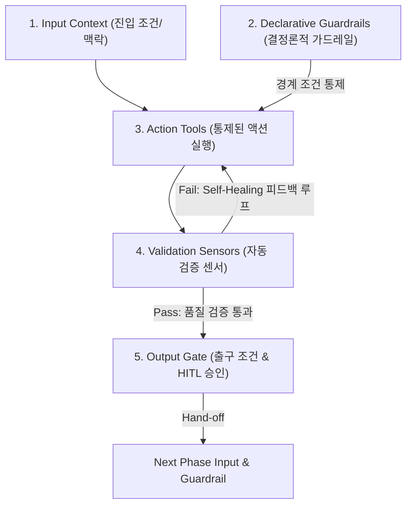
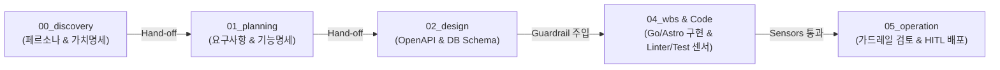

### [시리즈 기획 개요]

실제 프로젝트인 `app/docs`의 단계별 설계 아티팩트(`00_discovery`, `01_planning`, `02_design`, `04_wbs`, `05_operation`)를 **SDLC 워크플로우 표준 궤도**로 삼고, 내부 명세서들(`00_persona_and_painpoint.md`, `01_requirements.md`, `openapi.yaml`, `db_schema.md`, `vibecoding_guardrails_review.md` 등)을 **AI 에이전트의 SKILL 및 결정론적 가드레일**로 매핑하여 구축하는 **하네스 엔지니어링 5부작 실전 연재 기획서**입니다.

---

### 💡 하네스 엔지니어링 아키텍처 작동 원리

#### 📐 하네스 아키텍처 핵심 방정식
$$\text{Harness} = \text{Brain (맥락 \& 가드레일)} + \text{Action (도구 \& 실행)} + \text{Feedback Loop (감각 \& 센서)}$$

1. **Workflow & Job 위계**: 각 부(1~5부)는 SDLC 상의 **Workflow(Phase)**이며, 각 부 하위의 장(1.1, 1.2 등)은 단일 목적을 수행하는 **Job(Task)**입니다.
2. **Job의 구성 요소 (`Job = Guardrail + Action`)**: 모든 Job은 AI 에이전트를 통제하는 **가드레일(Guardrail/제약)**과 선언적 규격 하에서 실행되는 **액션(Action/변환)**의 쌍으로 구성됩니다.
3. **Input / Output 파이프라인 연쇄**:
   $$\text{Input} \longrightarrow \mathbf{\text{[ Phase N (Job) ]}} \longrightarrow \text{Output} \xrightarrow{\quad\text{Input \& Guardrail}\quad} \mathbf{\text{[ Phase N+1 ]}}$$
   각 부는 이전 단계의 생성물을 입력(Input)으로 받고, 다음 단계의 가드레일이 될 아티팩트를 출력(Output)으로 산출하는 파이프라인 구간입니다. 이전 단계에서 산출된 Output 아티팩트는 다음 단계의 **Input**으로 주입되는 동시에, AI 에이전트의 맥락 탈선을 차단하는 **Guardrail**로 동작합니다.

#### 🧱 각 Phase(부)의 5대 필수 구성 요소
1. **진입 조건 & 입력 맥락 (Input Context)**: 이전 Phase의 불변 아티팩트를 수용하여 탐색 범위 구획
2. **결정론적 가드레일 (Declarative Guardrails)**: AI 탈선을 억제하는 상위 헌법 명세 (`openapi.yaml`, `db_schema.md` 등)
3. **통제된 액션 도구 (Action Tools)**: 가드레일 내에서 코딩/변환 작업을 수행하는 실행 수단
4. **자동 검증 센서 (Validation Sensors)**: Linter, TypeChecker 등 오류 감지 및 Self-Healing 피드백 루프
5. **출구 조건 & 출력 인터페이스 (Output Gate)**: HITL 검증 통과 및 다음 Phase로의 단방향 Hand-off 아티팩트

---

### 🎬 `app` 실체 프로젝트 기반 연재 시나리오 흐름

본 시리즈는 `app/docs` 아티팩트 및 `app/backend`(Go Gin/GORM), `app/frontend`(Astro/React CSR) 소스 코드를 실전 타겟으로 지정하여 진행합니다.

---

## 📚 `app/docs` 기반 하네스 엔지니어링 5부작 시리즈 목차

### [1부] 00_discovery: AI 코딩 전 What & Why 정의하기 (페르소나와 비즈니스 가치 가드레일)
* **1.1 고객 페르소나 및 페인포인트 명세화 (`00_persona_and_painpoint.md`)**
  * 타겟 사용자 정의 및 해결하려는 비즈니스 페인포인트를 AI의 최상위 판단 기준으로 주입
* **1.2 비즈니스 가치 확정 및 솔루션 가이딩 (`00_value_proposition.md`)**
  * 프로덕트 가치 제안과 핵심 해결책을 명세화하여 AI의 맥락 탈선 및 불필요한 기능 확장 차단

### [2부] 01_planning: 불완전한 프롬프팅에서 선언적 명세로 (01_requirements 기반 AI 궤도 형성)
* **2.1 불완전한 프롬프팅에서 선언적 명세로의 전환**
  * 자연어 요구사항을 AI가 탈선하지 않는 아티팩트로 전환하는 메커니즘
* **2.2 `01_requirements.md` & `02_functional_spec.md` 기반 가드레일 구축**
  * 비즈니스 유스케이스, 기능 요구사항, 정합성 규칙을 아티팩트로 고정
* **2.3 웹앱 vs 정적 페이지 평가 (`web_app_vs_static_page_evaluation.md`)**
  * 불필요한 인프라 오버엔지니어링을 배제하는 KISS / YAGNI 평가 체계

### [3부] 02_design: 선언적 계약 하네스 (OpenAPI와 DB Schema로 AI 오염 차단하기)
* **3.1 OpenAPI 스펙(`openapi.yaml`) 기반의 인터페이스 계약**
  * 백엔드/프론트엔드 API 입출력 타입과 에러 코드를 결정론적 계약으로 박아두기
* **3.2 데이터 모델링 계약 (`db_schema.md` & `post_tag_design.md`)**
  * ERD 및 테이블 스키마 규격을 통해 AI가 임의로 DB 구조를 오염시키는 현상 차단
* **3.3 아키텍처 보일러플레이트 명세 (`backend_boilerplate_design.md`)**
  * Go Gin/GORM 백엔드 및 Astro/React 프론트엔드의 디렉토리/모듈 바운더리 구획

### [4부] 04_wbs: WBS 작업 격리와 품질 내장 (Go/React 자율 디버깅 피드백 루프)
* **4.1 세부 태스크 정의서 (`task_definition.md`)를 통한 작업 격리**
  * 대형 과업을 AI가 한 번에 완성하려다 실패하지 않도록 독립 단위 분할
* **4.2 로컬 Docker 샌드박스와 자동 검증 센서 (Lint, TypeCheck, Test)**
  * Go (`golangci-lint`, `go test`) 및 React (`ESLint`, `tsc`) 센서 기반 실시간 검증
* **4.3 Self-Healing 자율 디버깅 피드백 루프**
  * 검증 센서의 에러 리포트를 AI 프롬프트 맥락으로 피딩하여 스스로 코드 정정 유도

### [5부] 05_operation: 바이브 코딩 가드레일과 운영 (HITL과 프로덕션 GitOps 완성)
* **5.1 바이브 코딩 가드레일 검토서 (`vibecoding_guardrails_review.md`)**
  * AI 코딩 시 발생할 수 있는 보안 취약점, 리팩토링 병목, 기술 부채 필터링
* **5.2 개발 가이드라인 수립 (`backend_refactoring_guide.md`, `frontend_vibecoding_guide.md`)**
  * 백엔드/프론트엔드 지속 가능성을 위한 모범 사례(Best Practices) 주입
* **5.3 HITL (Human-in-the-Loop) 승인과 프로덕션 GitOps 완성**
  * final commit 전 인간 승인 관문과 CI/CD 파이프라인을 결합한 완벽한 딜리버리

---

## 🔗 `app/docs` 실체 파일 매핑표

| SDLC 단계 | `app/docs` 디렉토리 | 활용 아티팩트 파일 | 하네스 가드레일 역할 |
| :--- | :--- | :--- | :--- |
| **0단계: 비즈니스 탐색** | `00_discovery` | `00_persona_and_painpoint.md` `00_value_proposition.md` | 고객 페인포인트 및 비즈니스 가치 헌법 정의 |
| **1단계: 기획** | `01_planning` | `01_requirements.md` `02_functional_spec.md` | AI 작업 범위 및 유스케이스 한계선 구획 |
| **2단계: 설계** | `02_design` | `openapi.yaml` `db_schema.md` | API 계약 및 DB 스키마 오염 방지 정적 규격 |
| **3단계: WBS & 구현**| `04_wbs` | `task_definition.md` | 독립 단위 작업 분할 및 Docker/Linter 품질 검증 |
| **4단계: 운영** | `05_operation` | `vibecoding_guardrails_review.md` `guidelines/*.md` | 보안 취약점 검증, 리팩토링 기율, HITL 최종 승인 |
