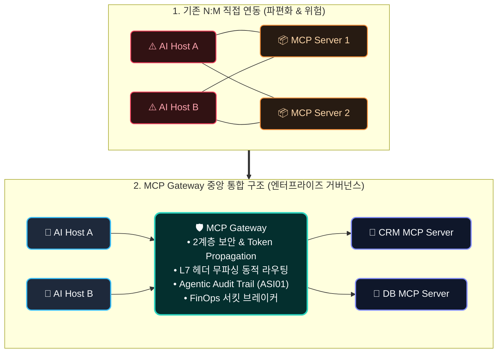
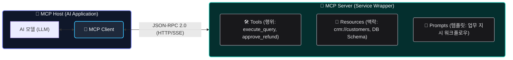
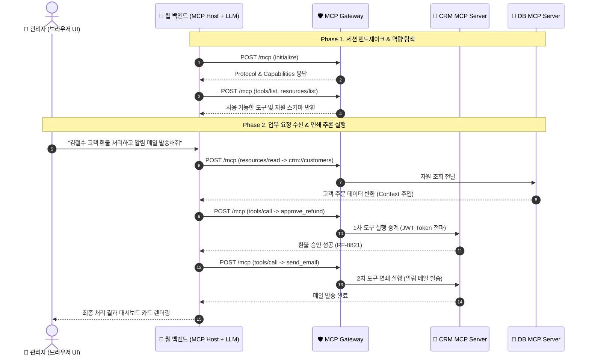
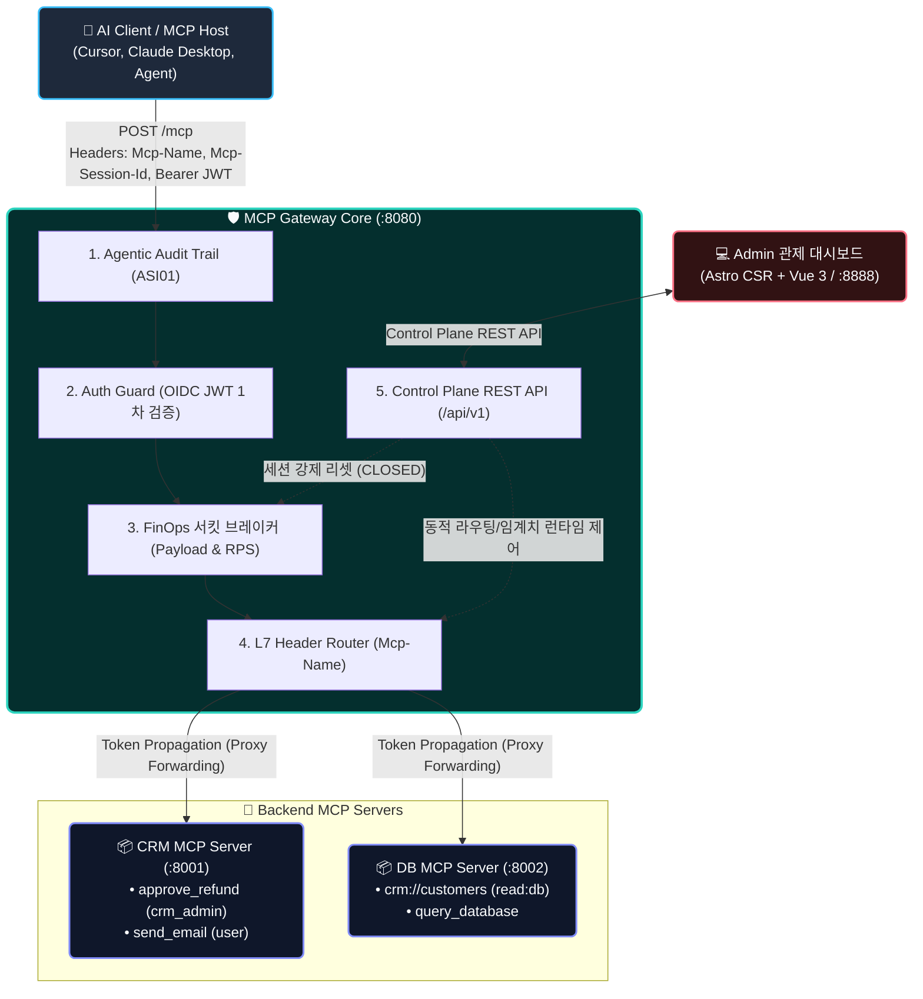
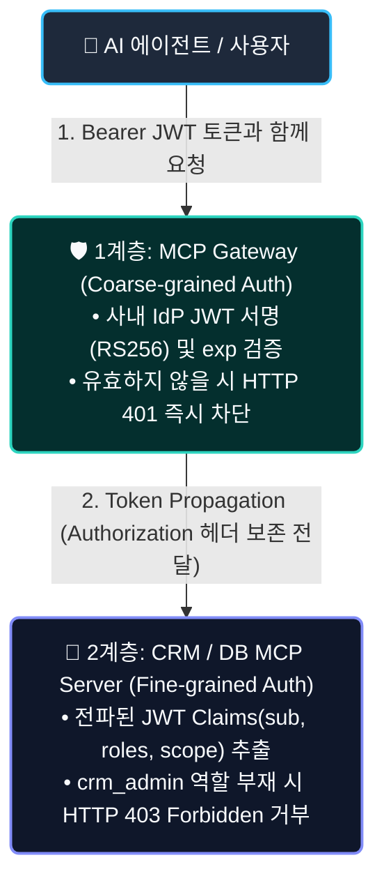

# MCP Gateway 딥다이브: 엔터프라이즈 AI 에이전트 도구 통합과 가드레일 아키텍처

> 📦 **GitHub**: [`joincdream/mcp-gateway`](https://github.com/joincdream/mcp-gateway) &nbsp;|&nbsp; ⚡ **Core**: `Go 1.26` &nbsp;|&nbsp; 💻 **Control Plane**: `Astro CSR` + `Vue 3`  
> 🚀 **실증 오픈소스 프로젝트**: 본 아티클에서 다루는 2계층 보안, L7 무파싱 라우팅, FinOps 서킷 브레이커는 [joincdream/mcp-gateway](https://github.com/joincdream/mcp-gateway)의 실전 Go 코드 및 독립 E2E 테스트 스위트로 검증되었습니다.

AI 에이전트 생태계가 단순 대화형 챗봇에서 업무 시스템 전반을 자율적으로 조율하는 **Autonomous Agent**로 진화함에 따라, 외부 도구(Tools) 및 데이터 소스(Resources)와의 표준화된 연동 프로토콜인 **MCP(Model Context Protocol)**의 중요성이 가파르게 증가하고 있습니다. 

본 문서에서는 MCP의 핵심 설계 사상과 RESTful API와의 근본적 차이점, 아키텍처 구성 요소를 체계적으로 정립하고, 엔터프라이즈 환경에서 보안 파편화와 비용 통제 불능을 해결하는 핵심 미들웨어인 **MCP Gateway의 4대 가드레일 아키텍처 및 실전 PoC 실증 결과**를 심층 분석합니다.

---

## 들어가며: 엔터프라이즈 AI 에이전트의 도구 파편화와 통제 위기

### 자율 에이전트의 진화와 도구 호출의 폭증
초기 LLM 애플리케이션은 사용자의 프롬프트에 텍스트로 응답하는 정적 파이프라인에 머물렀습니다. 그러나 2026년 현재의 에이전틱 AI(Agentic AI)는 데이터베이스를 직접 조회하고, CRM 주문을 변경하며, 이메일을 발송하는 등 능동적인 **도구 실행자(Active Tool Executor)**로 발전했습니다.

문제는 에이전트가 호출해야 할 엔터프라이즈 마이크로서비스와 SaaS 도구가 수십~수백 개로 팽창하면서 발생합니다.

### N:M 직접 연동의 한계: 보안 파편화와 비용 통제 불능
에이전트 호스트(Host)와 백엔드 서비스(Server)를 N:M 방식으로 직접 연결하면 다음과 같은 심각한 프로덕션 위기에 직면합니다.



1. **보안 및 인증의 파편화**: 개별 서비스마다 서로 다른 인증 체계를 구성하여 SSO(Single Sign-On) 및 접근 권한 통제가 불가능해집니다.
2. **Context Window 폭발 및 FinOps 비용 폭증**: 에이전트가 대용량 DB 덤프를 전처리 없이 통째로 읽어 들여 토큰 소비 비용이 기하급수적으로 폭증합니다.
3. **무한 루프 오작동(Agentic Loop)**: 잘못된 도구 실행 결과로 인해 동일한 도구를 초당 수십 회 이상 반복 호출하는 무한 루프 장애가 발생합니다.
4. **감사 추적 불가(Lack of Observability)**: 어떤 에이전트가 어떤 인자(Arguments)를 넣어 사내 시스템에 파괴적인 변경을 가했는지 추적할 수 없습니다 (OWASP for Agentic Applications ASI01 - Tool Misuse 위험).

이러한 문제를 단일 접점에서 해결하기 위해 등장한 인프라가 바로 **MCP Gateway**입니다.

### MCP (Model Context Protocol) vs RESTful API 핵심 차이점

MCP는 단순한 전송 규격이 아닌, **"AI 모델(LLM)이 사전 지식 없이도 도구와 데이터의 의미를 즉시 이해하고 조작할 수 있도록 설계된 인터페이스"**입니다.

| 비교 항목 | RESTful API | MCP (Model Context Protocol) |
| :--- | :--- | :--- |
| **주요 소비 주체** | **사람(개발자)** 또는 정적 비즈니스 로직 코드 | **AI 모델 / 자율 에이전트**의 동적 런타임 추론 |
| **통신 프로토콜** | HTTP Method (`GET`, `POST` 등) + URI | **JSON-RPC 2.0** (Transport: HTTP/SSE, STDIO) |
| **제공 파라미터** | 엔드포인트별 고정 Request/Response Body | **Tools**(행위), **Resources**(맥락), **Prompts**(템플릿) |
| **자가 서술성 (Self-Describing)**| OpenAPI/Swagger (개발자 판독용 명세서) | **JSON-Schema + 자연어 설명(Description)** (LLM 직접 해석) |
| **상호작용 규격** | 사전에 정의된 결정론적 파이프라인 | 런타임 자가 발견(Self-Discovery) 및 비결정론적 연쇄 추론 |

---

## MCP 핵심 원리와 엔터프라이즈 아키텍처 매핑

### MCP 3대 아키텍처 역할 및 원시 타입 (Primitives)

MCP 생태계는 명확한 3대 주체와 3대 원시 타입으로 구성됩니다.



* **MCP Host (호스트)**: AI 모델을 내장하고 전체 에이전트 라이프사이클을 주도하는 최상위 애플리케이션입니다 (예: Claude Desktop, Cursor IDE, AI 백엔드).
* **MCP Client (클라이언트)**: Host 내부에서 MCP Server와의 연결 세션 수립, 도구 탐색, JSON-RPC 메시지 교환을 전담하는 통신 모듈입니다.
* **MCP Server (서버)**: 기존 DB, 사내 API, 파일시스템을 MCP 표준 3대 원시 타입(**Tools, Resources, Prompts**)으로 래핑하여 노출하는 마이크로서비스입니다.

### 엔터프라이즈 AI Native 웹 애플리케이션의 6단계 처리 시나리오

IDE나 독립 챗봇이 아닌, **엔터프라이즈 업무 자동화 웹 애플리케이션**에서 MCP가 작동하는 실무 엔드투엔드 처리 시나리오입니다.



1. **초기화 및 핸드셰이크 (`initialize`)**: 웹 백엔드가 기동될 때 Gateway를 통해 타겟 MCP Server와 프로토콜 버전을 협상합니다.
2. **도구 및 자원 탐색 (`tools/list`, `resources/list`)**: 백엔드 서버들이 제공하는 `crm://customers` 자원과 `approve_refund`, `send_email` 도구의 JSON 스키마를 수집합니다.
3. **맥락 확보 자원 읽기 (`resources/read`)**: 관리자의 자연어 요청을 해석한 LLM의 판단에 따라 해당 고객의 원본 주문 데이터를 읽어 컨텍스트 윈도우에 주입합니다.
4. **1차 도구 실행 - 환불 승인 (`tools/call`)**: LLM이 주문 데이터를 바탕으로 `approve_refund(order_id: "ORD-99", reason: "결제오류")` 도구를 호출합니다.
5. **2차 도구 연쇄 실행 - 메일 발송 (`tools/call`)**: 1차 도구 실행 결과를 확인한 LLM이 연쇄 추론(Multi-step Tool Chain)으로 고객에게 알림 메일을 발송합니다.
6. **결과 렌더링**: 모든 처리 상태를 종합하여 관리자 화면에 최종 결과를 렌더링합니다.

---

## 실전 PoC 구현 및 4대 엔터프라이즈 가드레일 실증 (Case Study)

본 장에서는 엔터프라이즈 환경을 위해 실제 구현된 **Go 1.26 기반 경량 MCP Gateway 및 Astro CSR/Vue 3 Control Plane 실증 프로젝트([`poc/mcp-gateway`](https://github.com/joincdream/mcp-gateway))**의 아키텍처와 4대 핵심 가드레일 검증 결과를 분석합니다.



---

### 2계층 보안(Two-Tier Security) & 토큰 전파(Token Propagation)

#### 설계 사상
게이트웨이가 개별 도구의 비즈니스 인가 로직을 모두 떠안으면 게이트웨이가 비대해져 단일 실패 지점(Single Point of Failure)이자 거대한 모놀리스가 됩니다. 따라서 게이트웨이는 **사내 IdP(Azure AD, Keycloak) OIDC JWT의 서명과 만료만 검증(1계층: Coarse-grained)**하고, 토큰을 백엔드로 원본 그대로 전달(**Token Propagation**)하여 백엔드 MCP Server가 Claims 기반 세부 권한을 검증(**2계층: Fine-grained**)하도록 설계합니다.



#### 실전 Go 구현 코드 스니펫

```go
// 1. Gateway Level-1 Auth Guard Middleware
func AuthGuardMiddleware(next http.Handler) http.Handler {
    return http.HandlerFunc(func(w http.ResponseWriter, r *http.Request) {
        authHeader := r.Header.Get("Authorization")
        if authHeader == "" || !strings.HasPrefix(authHeader, "Bearer ") {
            http.Error(w, `{"error": "Unauthorized", "message": "Missing Bearer token"}`, http.StatusUnauthorized)
            return
        }

        tokenStr := strings.TrimPrefix(authHeader, "Bearer ")
        claims, err := auth.VerifyToken(tokenStr) // RSA RS256 JWKS 검증
        if err != nil {
            http.Error(w, `{"error": "Unauthorized", "message": "Invalid token"}`, http.StatusUnauthorized)
            return
        }

        // 1차 검증 성공: Authorization 헤더를 백엔드로 투명 전달 (Token Propagation)
        next.ServeHTTP(w, r)
    })
}
```

```go
// 2. Backend MCP Server Level-2 Fine-grained Auth Logic
func processRPC(req RPCRequest, authHeader string) RPCResponse {
    if req.Method == "tools/call" {
        // 전파된 JWT Claims 파싱 후 crm_admin 역할 보유 여부 검증
        if toolName == "approve_refund" && !checkRoleInJWT(authHeader, "crm_admin") {
            log.Printf("[CRM MCP] 403 Forbidden: Insufficient role for approve_refund")
            return RPCResponse{
                JSONRPC: "2.0",
                ID:      req.ID,
                Error: map[string]interface{}{
                    "code":    -32003,
                    "message": "Forbidden: Requires crm_admin role for refund approval",
                },
            }
        }
    }
    // ... 정상 실행 로직
}
```

---

### 무파싱 L7 헤더 동적 라우팅 (Zero-Parsing L7 Routing)

#### 설계 사상
MCP 프로토콜은 단일 엔드포인트(`POST /mcp`)를 사용하므로, 게이트웨이가 라우팅 대상을 판별하기 위해 무거운 JSON-RPC Body 전체를 역직렬화(Unmarshal)하면 엄청난 CPU 오버헤드와 지연시간(Latency)이 발생합니다. 

MCP Gateway는 `Mcp-Name`, `Mcp-Method` HTTP 헤더를 추출하여 **Body 파싱 없이 L7 레벨에서 백엔드 마이크로서비스로 즉시 분기 포워딩**하여 **추가 지연시간 5ms 이하의 초저지연 프록시 성능**을 달성합니다.

```go
// L7 Router: JSON-RPC 본문 파싱 없이 HTTP 헤더로 타겟 백엔드 스위칭
func (h *L7ProxyHandler) ServeHTTP(w http.ResponseWriter, r *http.Request) {
    mcpName := r.Header.Get("Mcp-Name")
    if mcpName == "" {
        http.Error(w, `{"error": "Missing Mcp-Name header"}`, http.StatusBadRequest)
        return
    }

    targetURL, exists := h.cfg.GetRoute(mcpName)
    if !exists {
        http.Error(w, `{"error": "Route not found for Mcp-Name"}`, http.StatusBadGateway)
        return
    }

    // Go 표준 역방향 프록시를 통해 본문 파싱 없이 스트리밍 포워딩
    proxy := httputil.NewSingleHostReverseProxy(targetURL)
    proxy.Director = func(req *http.Request) {
        req.Host = targetURL.Host
    }
    proxy.ServeHTTP(w, r)
}
```

---

### Agentic Audit Trail (OWASP ASI01 감사 로깅)

#### 설계 사상
에이전트 시스템에서는 단순히 "누가 어떤 URL을 호출했는가"를 넘어 **"에이전트가 어떤 의도로 어떤 인자값(Arguments)을 넣어 도구를 호출했는가"**를 세션 단위로 추적할 수 있어야 합니다. 

MCP Gateway는 `Mcp-Session-Id`를 기준으로 에이전트의 멀티스텝 추론 체인 전체를 구조화된 JSON 스트림으로 수집하여 **OWASP for Agentic Applications 2026 (ASI01 - Tool Misuse)** 위협에 대비합니다.

```json
{
  "id": "20260815214005.120",
  "timestamp": "2026-08-15T12:40:05Z",
  "sessionId": "agent-session-88412",
  "userId": "admin_dev_01",
  "mcpName": "crm-service",
  "mcpMethod": "tools/call",
  "toolName": "approve_refund",
  "arguments": {
    "order_id": "ORD-99",
    "reason": "결제오류 이중과금 환불 승인"
  },
  "responseStatus": 200,
  "executionTimeMs": 14
}
```

---

### FinOps 서킷 브레이커 (Context Guard & Loop Guard)

#### 설계 사상 및 실증 데이터
에이전트가 예상치 못한 비결정적 판단으로 수 메가바이트의 DB 덤프를 읽거나(Context Explosion), 도구 호출 실패로 무한 루프에 빠질 경우(Agentic Loop), 게이트웨이 레벨에서 즉시 회로를 `OPEN`하여 사내 시스템과 LLM 토큰 비용을 방어해야 합니다.

* **Payload Threshold Guard (Context Guard)**: `resources/read` 응답 페이로드가 설정된 임계치(기본: 50KB)를 초과하면 즉시 세션을 트립시키고 후속 요청에 **`HTTP 413 Payload Too Large`** 반환.
* **Rate Limit Guard (Agentic Loop Guard)**: 동일 세션(`Mcp-Session-Id`)에서 초당 도구 호출 수가 임계치(기본: 10 RPS)를 초과하면 5초간 서킷을 `OPEN`하고 **`HTTP 429 Too Many Requests`** 반환.
* **런타임 수동 복구(Manual Reset)**: 관리자가 Admin UI 대시보드에서 트립된 세션을 확인하고 원클릭으로 `CLOSED` 정상 상태로 즉시 강제 복구 가능.

```text
==================================================================
🚀 FinOps Circuit Breaker Independent E2E Test Suite Execution
🎯 Test Execution Mode: [all]
==================================================================

🧪 --- [TEST SCENARIO 1: Rate Limit Guard (Agentic Loop Guard)] ---
1) Normal Request Test (Session: rate-session-175525)...
   Status: 200 | Response: {"jsonrpc":"2.0","result":{...}} -> ✅ 200 OK
2) Burst Request Test: Firing 15 concurrent requests (Limit: 10 RPS)...
   📊 Burst Results -> 200 OK: 10 | 429 Too Many Requests (Tripped): 5
   🎉 SUCCESS: Rate Limit Guard successfully TRIPPED session to OPEN (429 Received!)
3) OPEN State Verification: Sending follow-up request...
   Status: 429 | Response: {"error":"CircuitBreakerTripped","reason":"Rate limit exceeded"}
   ✅ VERIFIED: Gateway immediately BLOCKED request with 429.
4) Admin Reset: Resetting session 'rate-session-175525'...
   ✅ Session reset to CLOSED successfully.
5) Post-Recovery Request: Status 200 OK -> 🎉 FULLY RECOVERED!

------------------------------------------------------------------
🧪 --- [TEST SCENARIO 2: Payload Threshold Guard (Context Guard)] ---
1) Large Payload Request (Session: payload-session-175525, URI: crm://customers/large)...
   Initial Read: 60KB Payload returned -> Gateway marked session as TRIP/OPEN
2) OPEN State Verification: Sending follow-up request...
   Status: 413 | Response: {"error":"CircuitBreakerTripped","reason":"Payload threshold exceeded"}
   🎉 SUCCESS: Gateway immediately BLOCKED follow-up request with 413 Payload Too Large!
3) Admin Reset & Post-Recovery: Status 200 OK -> 🎉 FULLY RECOVERED!
==================================================================
```

---

## 결론 및 엔지니어링 실무 권고사항 (Key Takeaways)

AI 에이전트의 도구 통합은 단순한 프롬프트 엔지니어링이나 개별 라이브러리 연동의 문제가 아닙니다. 프로덕션 환경에서 에이전트의 비결정성을 통제하고 시스템 안정성을 확보하기 위한 핵심 성공 방정식은 다음과 같습니다.

$$\mathbf{Enterprise\ Agent\ System = Model + Harness + Gateway}$$

1. **소프트웨어 공학적 분리 (SoC)**: 인증 검증(Gateway 1차)과 비즈니스 인가(백엔드 2차)를 엄격히 분리하여 거대 모놀리스 게이트웨이의 함정을 피하십시오.
2. **무파싱 초저지연 라우팅**: JSON-RPC 본문 파싱을 지양하고 HTTP 표준 커스텀 헤더(`Mcp-Name`, `Mcp-Session-Id`)를 활용하여 L7 스위칭 라우팅을 구현하십시오.
3. **보안 및 FinOps 가드레일 내재화**: OWASP ASI01 감사 로깅과 대용량 페이로드/RPS 서킷 브레이커를 게이트웨이에 기본 내재화하여 예기치 않은 토큰 비용 폭발과 무한 루프 장애를 방어하십시오.

---

## Appendix: MCP JSON-RPC 표준 프로토콜 메시지 규격

### 세션 초기화 핸드셰이크 (`initialize`)

* **Client ➔ Gateway ➔ Server (요청)**:
```json
{
  "jsonrpc": "2.0",
  "id": 1,
  "method": "initialize",
  "params": {
    "protocolVersion": "2024-11-05",
    "capabilities": { "roots": { "listChanged": true }, "sampling": {} },
    "clientInfo": { "name": "Enterprise-Agent-Host", "version": "1.0.0" }
  }
}
```

* **Server ➔ Gateway ➔ Client (응답)**:
```json
{
  "jsonrpc": "2.0",
  "id": 1,
  "result": {
    "protocolVersion": "2024-11-05",
    "capabilities": {
      "tools": { "listChanged": true },
      "resources": { "subscribe": true }
    },
    "serverInfo": { "name": "CRM-MCP-Server", "version": "1.0.0" }
  }
}
```

---

### 사용 가능한 도구 목록 탐색 (`tools/list`)

* **Client ➔ Server (요청)**:
```json
{
  "jsonrpc": "2.0",
  "id": 2,
  "method": "tools/list",
  "params": {}
}
```

* **Server ➔ Client (응답)**:
```json
{
  "jsonrpc": "2.0",
  "id": 2,
  "result": {
    "tools": [
      {
        "name": "approve_refund",
        "description": "고객 결제 건에 대한 환불 승인을 처리합니다 (crm_admin 권한 필요).",
        "inputSchema": {
          "type": "object",
          "properties": {
            "order_id": { "type": "string", "description": "주문 번호" },
            "reason": { "type": "string", "description": "환불 사유" }
          },
          "required": ["order_id"]
        }
      }
    ]
  }
}
```

---

### 도구 실행 요청 (`tools/call`)

* **Client ➔ Server (요청 - Header: `Mcp-Name: crm-service`, `Authorization: Bearer <JWT>`)**:
```json
{
  "jsonrpc": "2.0",
  "id": 3,
  "method": "tools/call",
  "params": {
    "name": "approve_refund",
    "arguments": {
      "order_id": "ORD-99",
      "reason": "결제오류 이중과금 환불 승인"
    }
  }
}
```

* **Server ➔ Client (응답)**:
```json
{
  "jsonrpc": "2.0",
  "id": 3,
  "result": {
    "content": [
      {
        "type": "text",
        "text": "Successfully executed tool 'approve_refund' with args map[order_id:ORD-99 reason:결제오류 이중과금 환불 승인]"
      }
    ],
    "isError": false
  }
}
```

---

### 자원 데이터 읽기 (`resources/read`)

* **Client ➔ Server (요청 - Header: `Mcp-Name: db-service`)**:
```json
{
  "jsonrpc": "2.0",
  "id": 4,
  "method": "resources/read",
  "params": {
    "uri": "crm://customers"
  }
}
```

* **Server ➔ Client (응답)**:
```json
{
  "jsonrpc": "2.0",
  "id": 4,
  "result": {
    "contents": [
      {
        "uri": "crm://customers",
        "mimeType": "application/json",
        "text": "[{\"id\": 101, \"name\": \"김철수\", \"email\": \"chulsoo@cloit.com\", \"status\": \"active\", \"recent_order\": \"ORD-99\"}]"
      }
    ]
  }
}
```
