# AI 산업의 불편한 진실: 11가지 차트 심층 분석 및 엔터프라이즈 딥다이브 가이드

## 개요 (Overview)

본 문서는 알베르토 로메로(Alberto Romero)의 분석 아티클 **"11 Charts the AI Industry Doesn't Want You to See"**에서 제시된 11개의 실증 차트를 1:1로 분해하여 심층 분석하기 위한 워킹 드래프트(Working Draft)입니다.

각 차트별로 **① 핵심 논제**, **② 실증 데이터 및 수치**, **③ 기저 원인 및 메커니즘**, **④ 엔지니어링 및 비즈니스 시사점**, **⑤ 딥다이브 연구 메모(Open Questions)**로 구조화되어 있어, 세부 주제별 심층 검증과 데이터 확장이 가능하도록 설계되었습니다.

---

## 1. 경제 및 시장 구조 (Macro & Financial Ecosystem)

### Chart 1: 10개 기업이 전체 경제를 견인 (Ten Companies Carrying the Economy)

#### 1) 핵심 논제 (Core Thesis)
미국 증시와 글로벌 IT 경제 성장의 대부분이 AI 밸류체인 최상위에 위치한 10개 소수 빅테크 기업에 기형적으로 집중되어 있습니다. 비관론자들과 시장 분석가들은 이 소수 기업들이 약속한 비즈니스 가치와 실질적인 투자 수익률(ROI)을 입증하지 못할 경우, 경제 시스템 전체로 리스크가 전이될 수 있다고 경고합니다.

#### 2) 실증 데이터 및 시장 전문가 평가 (Empirical Data & Expert Analyses)
* **S&P 500 이익 성장 기여도**: 상위 10개 테크 기업(Nvidia, Microsoft, Apple, Alphabet, Amazon, Meta 등)이 지수 전체 이익 성장의 절대다수를 차지하며, 나머지 490개 비(非)AI 기업의 실질 이익 성장률은 물가상승률을 밑돌며 횡보 또는 역성장.
* **골드만삭스 (Goldman Sachs - Jim Covello)**: 
  * *"Gen AI: Too Much Spend, Too Little Benefit?"* 보고서를 통해 현재 AI가 수천억 달러의 CapEx를 정당화할 만큼 복잡한 문제를 해결하지 못하는 **'수익성 결여(The Profit Problem)'** 상태라고 지적.
  * 과거 인터넷/PC 혁신(고비용을 저비용으로 대체)과 달리, AI는 '극도로 비싼 인프라로 저렴한 인건비를 대체'하려는 구조적 결함을 안고 있음.
* **세쿼이아 캐피탈 (Sequoia Capital - David Cahn)**:
  * *"AI's $600B Question"* 분석에서 인프라 투자 회수를 위해 요구되는 **연간 $600B의 AI 매출** 대비 실제 엔드유저 지출은 수백억 달러에 불과하여 **약 $5,000억 이상의 거대한 매출 공백(Revenue Gap)** 발생.
* **가트너 (Gartner)**:
  * 생성형 AI가 **'환멸의 골짜기(Trough of Disillusionment)'**에 진입했다고 선언.
  * 2025~2026년까지 엔터프라이즈 생성형 AI 프로젝트의 **30% 이상이 데이터 품질 미달, 비용 급증, 불명확한 비즈니스 가치(ROI)로 인해 PoC 단계에서 중단/폐기**될 것으로 전망.
* **MIT 경제학부 (Daron Acemoglu 교수)**:
  * *"The Simple Macroeconomics of AI"* 논문에서 AI가 향후 10년간 미국 총요소생산성(TFP)에 기여하는 실질 성장률은 **0.53%~0.71%(연간 약 0.07%)에 불과**할 것이라며 거시경제적 과대평가를 실증 모델로 반박.

#### 3) 기저 원인 및 메커니즘 (Underlying Mechanism)
* **비용-가치 역전 현상**: 막대한 GPU 클라우드 비용과 환각 검증 오버헤드로 인해 실질 절감액보다 시스템 운영비가 더 커지는 현상.
* **방어적 과잉 투자(FOMO CapEx)**: 빅테크 경영진의 "과대투자보다 과소투자가 더 위험하다"는 방어적 선점 심리로 인해 실수요와 무관하게 인프라 증설 지속.
* **하드웨어 및 클라우드 플랫폼의 독점적 초과 이익 흡수**: 반도체(Nvidia) 및 클라우드 과점 기업만 수익을 독점하고, 실제 응용 소프트웨어 계층과 일반 기업은 적자 누적.

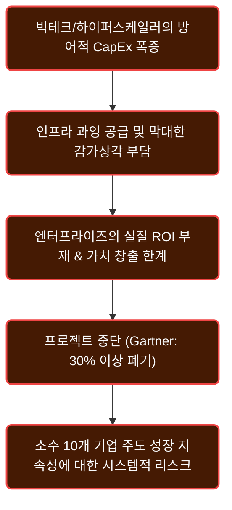

#### 4) 시장의 반론 및 정상화 경로: 단기 조정에서 실용적 성숙기(Deployment Era)로의 진입

시장의 회의론과 과잉 투자 경고에 맞서, 기술 역사학자들과 실용주의적 시장 분석가들은 현재의 국면을 **'기술 패러다임 전환기(Installation Period)의 전형적인 진통'**으로 해석하며 장기적 성숙 단계로의 진입 가능성을 제시합니다.

##### ① 역사적 기술 혁명 주기와의 실증 비교 (Carlota Perez Framework)
* **광통신망 버블(1999~2001)의 교훈**: 닷컴 버블 당시 통신 기업들의 천문학적 광케이블(Dark Fiber) 과잉 투자는 통신사들의 대규모 파산을 불렀으나, 이때 헐값에 공급된 초고속 인프라가 2000년대 중반 **웹 2.0, 유튜브, 넷플릭스, 클라우드 컴퓨팅 혁명의 결정적 모태**가 되었습니다.
* **철도 광풍(Railway Mania, 1840년대)**: 과열된 철도 투기 거품이 붕괴된 후 남겨진 철도망이 국가 물류 인프라를 완성하여 제조업의 전성기를 견인했던 역사와 동일한 궤적입니다.

##### ② 추론 비용(Inference Cost)의 급격한 하락과 실질 TCO의 현실
* **토큰 액면가 급락 (1/10~1/20 수준)**: 호스팅 API 기준 오픈소스 모델(DeepSeek, Llama 3.x)의 1M 토큰당 단가는 프론티어 독점 모델 대비 90% 이상 저렴합니다.
* **사내 직접 구축 시의 'TCO 착시' 경계**:
  * 모델 가중치(Weights) 자체는 무료이지만, 사내 전용 서버 구축 시 **GPU 장비 감가상각, 전력·상면비, 24시간 무중단 MLOps 엔지니어 인건비, 야간 유휴(Idle) 손실**이 발생합니다.
  * 따라서 월 수억 토큰 이상의 24/7 풀로드 트래픽이 보장되지 않는다면 사내 직접 구축의 '실질 토큰 단가'는 상용 API보다 오히려 비쌀 수 있습니다.
* **성공률 가중 '태스크 완수당 실질 비용(Effective Cost)'**:
  * 저렴한 모델이 성능 부족으로 3~4회 실패하여 82%의 토큰을 낭비하고 개발자가 디버깅에 30분을 소모한다면, 1-Shot에 통과하는 상용 프론티어 모델보다 전체 TCO는 수십 배 높아집니다.
* **일반 기업의 파인튜닝 장벽과 현업의 실질적 대안**:
  * 8B 파인튜닝은 데이터셋 정제(Instruction-Q&A 수만 건)와 치명적 망각(Catastrophic Forgetting) 리스크로 인해 일반 기업에게 진입 장벽이 매우 높습니다.
  * 따라서 현업에서는 직접 학습 대신 **"기본 베이스 sLLM + 도메인 RAG(검색 증강) + Few-shot 프롬프트 하네스"**로 90%의 엔터프라이즈 요구사항을 충족하는 실용적 방식을 채택합니다.

```mermaid
graph TD
    subgraph CaseA["비싼 상용 프론티어 API (Claude 3.5 / GPT-4o)"]
        A1["토큰 단가: 높음"] --> A2["1-Shot 즉시 성공 (유효 토큰 100%)"]
        A2 --> A3["개발자 개입 0분"]
        A3 --> A4["최종 태스크 비용: 수십 원"]
    end

    subgraph CaseB["저렴한 오픈소스 모델 단독 사용 (8B/70B)"]
        B1["토큰 단가: 1/10 수준"] --> B2["환각 및 포맷 결함 (재시도 4회)"]
        B2 --> B3["82% 토큰 낭비 + 개발자 30분 디버깅"]
        B3 --> B4["최종 태스크 비용: 토큰 5원 + 인건비 25,000원"]
    end

    classDef pass fill:#064e3b,stroke:#10b981,stroke-width:2px,color:#f8fafc,rx:6px;
    classDef fail fill:#451a03,stroke:#ef4444,stroke-width:2px,color:#f8fafc,rx:6px;
    class CaseA,A1,A2,A3,A4 pass;
    class CaseB,B1,B2,B3,B4 fail;
```

##### ③ 글로벌 기관 및 산업계의 실용적 반론 데이터
* **골드만삭스 (Kash Rangan & Eric Sheridan 파트너)**:
  * *"인프라 선투자는 모든 기술 슈퍼사이클의 필수적인 1단계"*이며, 인프라가 먼저 깔려야 킬러 애플리케이션과 플랫폼 소프트웨어 계층의 수익화가 뒤따른다고 반박.
* **맥킨지 (McKinsey Global Institute)**:
  * 생성형 AI가 초기 환상기를 지나 성숙 단계에 안착할 경우, 소프트웨어 엔지니어링, 고객 응대, 공급망 및 바이오 연구 등에서 **글로벌 경제에 연간 2.6조~4.4조 달러 규모의 실질적 부가가치**를 더할 것으로 추정.
* **엔비디아 (Jensen Huang)**:
  * 현재의 CapEx는 단순 버블이 아니라, 전 세계 **1조 달러 규모의 기존 범용 CPU 데이터센터가 전력 효율적인 가속 컴퓨팅(GPU) 아키텍처로 교체되는 10년 주기 인프라 대전환**의 과정이라고 설명.

##### ④ 3단계 시장 성숙기 로드맵 (The Maturity Transition)

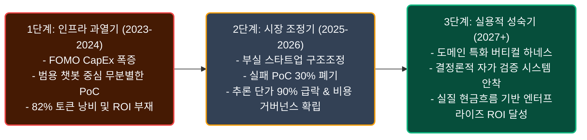

---

#### 5) 엔지니어링 & 비즈니스 시사점: 2계층 하이브리드 아키텍처 (Implications & Architecture)
* **하이브리드 모델 라우팅 (2-Tier Model Routing)**:
  * **Tier 1 (상용 프론티어 API)**: 복합 아키텍처 설계, 다단계 에이전트 코딩, 까다로운 예외 추론 등 실패 비용이 치명적인 핵심 업무에 배정.
  * **Tier 2 (사내 sLLM + RAG)**: 쿼리 분류, 정형 JSON 추출, 사내 보안 민감 문서 처리, 대량 배치 요약 등 반복 워크로드에 배정하여 인프라 비용 통제.

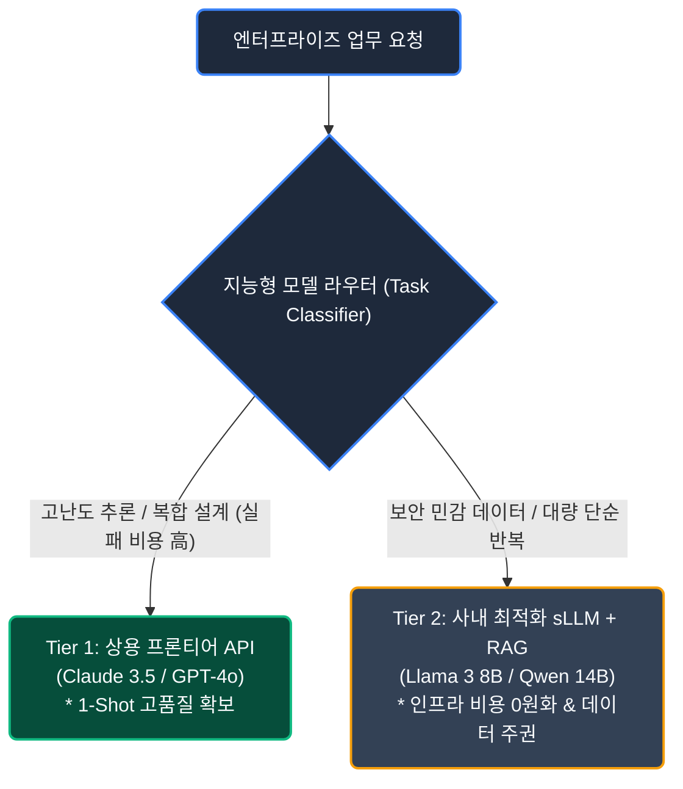

#### 6) 딥다이브 연구 메모 (Deep Dive Notes & Open Questions)
* [ ] 사내 도입 AI 서비스의 TCO(총소유비용) 대비 실질 절감 비용(ROI) 산출 공식 수립.
* [ ] 추론 비용 급락(90% 하락) 시점에 맞춰 클라우드 API에서 자체 호스팅 SLM으로 전환하는 손익분기점(BEP) 계산.
* [ ] PoC 단계에서 실패율(30% 폐기율)을 줄이기 위한 사전 데이터 품질 검증 기준 마련.

---

### Chart 5: 순환 거래로 유지되는 AI 산업 (The AI Industry Runs on Circular Deals)

#### 1) 핵심 논제 (Core Thesis)
AI 업계의 폭발적인 매출 성장은 외부 엔드유저의 순수 소비가 아니라, 빅테크가 스타트업에 투자한 돈이 다시 빅테크의 클라우드 및 칩셋 결제로 되돌아오는 **'자금 순환(Circular Deals)'**과 **'금융 재귀성(Financial Reflexivity)'**에 의해 부풀려져 있다는 비판이 제기됩니다. 비관론자들은 이를 닷컴 시절 붕괴의 도화선이었던 '벤더 파이낸싱'의 재판으로 보며, 옹호론자들은 초기 생태계 조성을 위한 필수적인 '전략적 현물 제휴'로 해석합니다.

#### 2) 실증 데이터 및 대표 사례 (Empirical Data & Key Cases)
* **대표적 순환 거래 구조**:
  * **Microsoft ↔ OpenAI**: 약 130억 달러 규모의 지분 투자 집행 → 대부분의 자금이 Azure 클라우드 인프라 사용 크레딧으로 즉시 환류.
  * **Amazon / Google ↔ Anthropic**: 수십억 달러 지분 투자 → AWS Trainium/Inferentia 및 Google Cloud 대규모 사용 계약 체결.
  * **Nvidia ↔ CoreWeave / Mistral / AI 스타트업**: 엔비디아 벤처 투자 → 투자받은 스타트업의 H100/B200 GPU 대규모 구매.
* **스타트업 자본 지출 비중**: 주요 파운데이션 모델 스타트업들이 유치한 투자금의 70~80% 이상이 투자 주체(클라우드 제공자)의 컴퓨팅 비용으로 즉시 재유입.

#### 3) 메커니즘 시각화 (Circular Cash Flow)

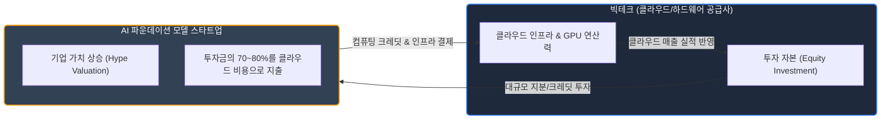

#### 4) 시장의 시각 대립: 붕괴론 vs 정당론 (Bear Case vs. Bull Case)

##### ① 붕괴론자들의 시각: "닷컴 시절 벤더 파이낸싱의 재판과 가공 매출"
* **가공 매출(Manufactured Revenue) 착시**: 외부 엔드유저의 유기적 현금 유입(Organic Demand) 없이, 자기 자본을 돌려 회계상 클라우드 매출로 둔갑시키는 재귀적 버블 루프라고 비판합니다.
* **역사적 선례 (루슨트·노텔 사태)**: 1999년 통신 장비업체 루슨트와 노텔이 장비를 팔기 위해 통신 스타트업에 자금을 빌려주었다가, 닷컴 붕괴와 함께 스타트업 파산 및 장비사 본체 연쇄 몰락으로 이어졌던 '벤더 파이낸싱(Vendor Financing)'의 비극과 동일한 구조라는 지적입니다.
* **더블 로스(Double Loss) 리스크**: 스타트업이 자생적 비즈니스 모델 구축에 실패할 경우, 빅테크는 **① 투자 지분 가치 상각(0원 수렴)**과 **② 클라우드 매출 급감**이라는 이중 타격을 받게 됩니다.

##### ② 반론 및 옹호론자들의 시각: "초기 생태계 마중물과 압도적인 대차대조표"
* **실제 최종 엔드유저 매출(ARR)의 폭발적 성장**: 순환 거래가 전부는 아닙니다. 실제로 **OpenAI는 연간 환산 매출(ARR)이 10억 달러에서 40억~50억 달러 이상으로 급성장**하며 수백만 유료 구독자(B2C)와 수만 개 기업 고객(B2B)의 실제 외부 현금을 창출하고 있습니다.
* **빅테크의 압도적인 현금창출력(FCF)**: 부채로 연명하던 닷컴 시절 통신사와 달리, MS·아마존·알파벳·메타는 검색 광고, 오피스, 이커머스 등에서 **매년 수백억~수천억 달러의 막대한 잉여현금흐름(FCF)**을 벌어들이는 초우량 기업이므로 스타트업 실패 충격을 충분히 흡수할 수 있습니다.
* **희소 자원의 전략적 교환**: 스타트업은 '돈 주고도 못 구하는 최신 GPU 연산력'을 확보하고, 빅테크는 '프론티어 AI 모델의 독점적 배포권 및 핵심 IP'를 선점하는 합리적 전략적 물물교환(In-Kind Strategic Partnership)이라는 해석입니다.

#### 5) 시장 전문가 종합 판정 (Consensus)

| 구분 | 위험 요인 (Bear Case) | 방어 요인 (Bull Case) |
| :--- | :--- | :--- |
| **자금 성격** | 가공 매출 및 재귀적 밸류에이션 부양 | 희소한 연산 인프라 현물 출자 및 핵심 IP 확보 |
| **스타트업 생존** | 2~3위권 스타트업 자생력 부재 시 연쇄 도산 | 1위권(OpenAI, Anthropic)의 실질적 B2B 유료 매출 실존 |
| **시스템 리스크** | 순환 거래 축소 시 AI 성장률 급랭 | 빅테크의 막대한 현금 여력(FCF)으로 충격 완충 가능 |

> **전문가 결론**: 자전 거래 자체가 빅테크 본체를 무너뜨리지는 않겠으나, **독자적 유료 고객(Organic Revenue)을 확보하지 못하고 투자 크레딧만 태우는 2·3위권 AI 스타트업들의 대규모 도태와 옥석 가리기(Shakeout)**는 불가피합니다.

#### 6) 엔지니어링 & 비즈니스 시사점 (Implications & Risks)
* **API 제공사 지속가능성 실사**: 서드파티 AI 스타트업의 API를 사내 핵심 서비스에 도입할 때, 해당 스타트업의 외부 매출 비중과 런웨이(Runway)를 반드시 실사해야 합니다.
* **멀티 벤더 페일오버(Multi-Vendor Failover)**: 특정 스타트업의 자금난이나 클라우드 계약 변경으로 API가 중단될 경우에 대비하여, 모델 추상화 계층(Model Gateway)을 통한 즉시 전환 체계를 갖추어야 합니다.

#### 7) 딥다이브 연구 메모 (Deep Dive Notes & Open Questions)
* [ ] 현재 사내에서 연동 중인 AI API 스타트업(Perplexity, Mistral 등)의 독립적 현금흐름 건전성 점검.
* [ ] FTC 및 영국 CMA의 빅테크-AI 스타트업 순환 투자 반독점 조사 결과 및 규제 영향 모니터링.
---

### [심층 인사이트] 버티컬 산업의 'Data-First' 해자와 FDE(Forward Deployed Engineer)의 부상

순환 거래와 인프라 과열 논쟁이 던지는 가장 중요한 결론은 **"모델 중심(Model-First)"에서 "데이터 및 현장 워크플로우 중심(Data-First)"으로의 헤게모니 이동**입니다.

#### 1) 파운데이션 모델의 상품화와 유일한 경제적 해자(Moat)
* **지능의 전기화(Commoditization of Intelligence)**: OpenAI, Anthropic, 오픈소스 모델의 지능은 누구나 돈만 내면 수도꼭지처럼 틀어 쓸 수 있는 '범용 원자재'가 되었습니다. 따라서 단순 챗봇 래퍼(Thin Wrapper)는 차별성을 잃고 도태됩니다.
* **복제 불가능한 고유 데이터(Proprietary Data)**: 반도체 공정 센서 로그, 병원 임상 데이터, 금융사 여신 트랜잭션, 사내 ERP 등 **공개 웹 크롤링으로는 절대 얻을 수 없는 '폐쇄망 데이터'를 쥔 기업만이 독점적 가치**를 창출합니다.

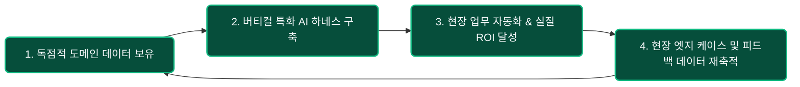

#### 2) 데이터와 AI를 현장에 안착시키는 핵심 직군: FDE(Forward Deployed Engineer)
기업의 핵심 데이터는 깔끔한 API로 정돈되어 있지 않고 파편화된 레거시 DB와 엑셀에 갇혀 있습니다. 이를 해결하기 위해 팔란티어(Palantir)가 창안하고 글로벌 테크 업계로 확산 중인 **FDE(Forward Deployed Engineer, 전방 배치 엔지니어)**가 엔터프라이즈 AI의 핵심 축으로 부상하고 있습니다.

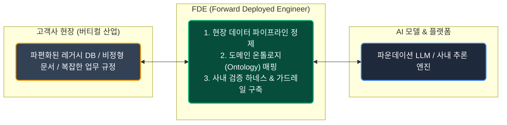

* **팔란티어 AIP 부트캠프의 성공 비결**: 팔란티어가 시장에서 독보적인 엔터프라이즈 수주를 기록하는 이유는, FDE들이 고객사 현장에 파견되어 며칠 만에 사내 레거시 데이터를 연결하고 작동하는 AI 워크플로우를 구현해내기 때문입니다.
* **엔지니어 직군의 진화**: 단순 코딩을 수행하는 주니어 엔지니어의 자리는 축소되지만, **"고객 도메인 데이터를 꿰뚫어 보고 현장에 AI를 안전하게 착륙시키는 FDE"**는 가장 높은 가치를 인정받는 핵심 엔지니어로 자리 잡고 있습니다.

---

### Chart 11: AI 붐의 지속 불가능한 수학 (The Impossible Math of the AI Boom)

#### 1) 핵심 논제 (Core Thesis)
하이퍼스케일러들이 쏟아붓고 있는 천문학적인 인프라 설비 투자(CapEx)를 회수하기 위해 요구되는 AI 소프트웨어 매출 규모와 실제 최종 소비 시장 간의 격차가 역사상 유례없는 수준으로 벌어져 있습니다. 파이낸셜 타임스(FT) 분석에 따르면, 아마존을 제외한 주요 빅테크들의 AI 인프라 순투자수익률(Implied ROI)은 심각한 마이너스를 기록하며 '치킨 게임'의 늪에 빠져 있습니다.

#### 2) 실증 데이터 및 기업별 AI CapEx ROI (Empirical Data - FT Analysis)
파이낸셜 타임스(Financial Times)가 집계한 주요 하이퍼스케일러의 **AI 설비투자 대비 추정 순투자수익률(Implied ROI on AI CapEx)**:

| 기업 | 추정 ROI | 핵심 수익/손실 원인 | 비즈니스 구조적 특징 |
| :--- | :--- | :--- | :--- |
| **Amazon** | **+7.2%** | AWS 순증 매출 + 전사 물류 원가 직접 절감 | 방어할 검색 광고 없음, 앤트로픽 협력(Trainium2) |
| **Microsoft** | **-9.2%** | Copilot 매출 대비 인프라 감가상각비 폭증 | OpenAI 지분법 손익 및 막대한 Azure 데이터센터 증설비 |
| **Alphabet (Google)** | **-15.7%** | AI Overviews 연산비 폭증 + 기존 검색 광고 잠식 | 10년 TPU 노하우에도 불구하고 '이노베이터 딜레마' 봉착 |
| **Meta** | **-28.8%** | Llama 오픈소스 무료 공개 및 인프라 비용 급증 | 직접적 AI 라이선스 매출 부재, 소셜 광고 효율 대비 CapEx 과다 |
| **Oracle** | **-35.6%** | OCI 데이터센터/GPU 공격적 투자 대비 낮은 마진 | 후발주자 점유율 확보용 무리한 인프라 증설로 최대 적자 폭 기록 |

* **세쿼이아 캐피탈 ($600B Question)**: 
  * 하이퍼스케일러들의 연간 데이터센터/GPU 투자액 회수를 위해 전 세계 AI 생태계가 달성해야 하는 예상 매출: **연간 약 6,000억 달러 ($600B)**.
  * 실제 최종 사용자(End-user) AI 소프트웨어 시장 매출: 수백억 달러 수준에 불과하여 **$5,000억 이상의 거대한 매출 갭** 발생.

#### 3) 아마존의 흑자 요인 vs 구글의 딜레마 심층 분석

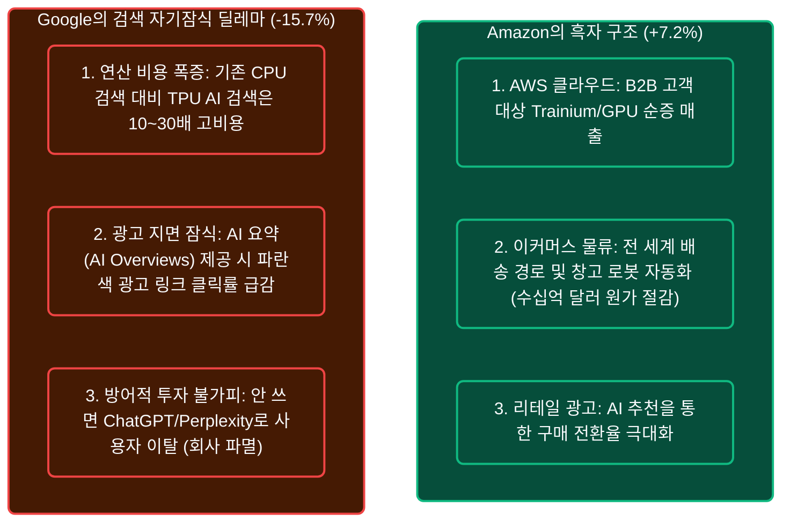

##### ① 아마존이 유일하게 +7.2% ROI를 창출한 비결
* **직접적인 원가 절감(Direct Bottom-line Impact)**: 아마존은 AI를 허상에 투자하지 않고 전 세계 물류센터(Robotics), 재고 배치, 라스트마일 배송 경로 최적화에 즉각 투입하여 **매년 수십억 달러의 물류비를 직접 절감**하여 영업이익으로 전환했습니다.
* **AWS B2B 매출 증분**: 앤트로픽에 투자하면서 자체 개발 칩인 **Trainium2 대량 공급 계약**을 체결하고, 엔터프라이즈 고객에게 가성비 인프라로 판매하여 순수한 클라우드 증분 매출을 거두었습니다.

##### ② Anthropic(Claude)과 AWS의 공생 시너지: '바이브 코딩'과 B2B 현금흐름
* **코딩 및 에이전트의 사실상 표준(De Facto Standard)**: Claude 3.5 Sonnet은 커서(Cursor), 클로드 코드(Claude Code), 깃허브 코파일럿 등 현업 개발자들의 **'바이브 코딩' 및 소프트웨어 엔지니어링 자동화 시장을 독점**하고 있습니다.
* **AWS 인프라 기반의 현금흐름 창출**: 
  * 시장에서 ROI가 가장 확실히 입증된 '코딩 자동화' 트래픽이 **AWS Bedrock 및 Trainium2 인프라 위에서 대량 소비**됩니다.
  * 앤트로픽은 희소한 연산 인프라를 안정적으로 확보하고, 아마존은 Claude를 무기로 막대한 B2B 클라우드 순증 매출을 거두어들이는 **가장 성공적인 실물 공생 모델(Symbiotic Engine)**을 완성했습니다.

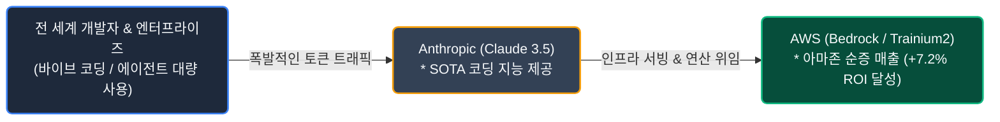

##### ③ 구글이 최정상급 자체 TPU를 갖고도 -15.7% 적자를 내는 이유
* **이노베이터의 딜레마(Innovator's Dilemma)**: 기존 구글 키워드 검색은 값싼 CPU로 처리되어 영업이익률 40~50%를 내는 황금알이었습니다. 반면 생성형 AI 검색은 TPU를 쓰더라도 **기존 대비 10~30배 비싼 연산 비용이 들며, 사용자가 AI 요약만 읽고 광고 링크를 클릭하지 않아 스스로의 캐시카우를 파괴(Cannibalization)**합니다.
* **방어적 투자의 덫**: 그럼에도 불구하고 구글이 비싼 TPU 검색을 강행하는 이유는, **AI 검색을 도입하지 않으면 수억 명의 사용자가 ChatGPT나 Perplexity로 넘어가 검색 독점권(1,700억 달러 시장) 전체를 잃기 때문**입니다. 즉, 구글의 AI 투자는 성장이 아닌 '생존을 위한 방어 비용'입니다.

#### 4) 검색 서비스 UI/UX의 구조적 붕괴와 미래 (Search Disruption)
* **어정쩡한 하이브리드 UI의 한계**: 현재 구글의 "키워드 검색창 + 상단 AI 요약 + 하단 10개 광고 링크"는 기존 광고 수익 모델을 지키기 위해 억지로 유지하는 과도기적 누더기 UI/UX입니다.
* **가트너의 경고 (전통 검색 25% 급감)**: 가트너는 2026년까지 **전통적인 검색 엔진 트래픽이 25% 이상 감소**할 것으로 전망했습니다.
* **검색(Search)에서 에이전트(Action)로의 전환**: 개념 탐색 및 정보 검색은 이미 AI Chat으로 흡수되었으며, 미래의 검색은 단순 키워드 조회가 아니라 **검색과 결제/예약이 한 번에 완료되는 'AI 에이전트 인터페이스'로 완전히 대체**될 것입니다.

#### 5) 엔지니어링 & 비즈니스 시사점 (Implications & Risks)
* **빅테크 CapEx 감가상각 폭탄 대비**: 하이퍼스케일러들의 마이너스 ROI가 지속될 경우, 2026~2027년 클라우드 API 가격 인상 및 무료 크레딧 축소 압박이 현실화될 것입니다.
* **단순 AI 기능 추가(Feature) 지양**: 구글처럼 기존 마진을 깎아 먹는 기능성 AI 도입을 피하고, 아마존처럼 **"직접적인 내부 운영비 절감"**이나 **"명확한 신규 B2B 지불 모델"**이 검증된 영역에만 AI를 투자해야 합니다.

#### 6) 딥다이브 연구 메모 (Deep Dive Notes & Open Questions)
* [ ] 사내 도입 AI 서비스의 TCO(총소유비용) 대비 실질 절감 비용(ROI) 산출 공식 수립.
* [ ] 전통 키워드 검색 기반 사내 인트라넷을 대화형 에이전틱(Agentic) RAG로 전환할 때의 사용자 생산성 변화 측정.
* [ ] 하이퍼스케일러의 CapEx 조정 및 API 단가 인상에 대비한 멀티 클라우드 비용 거버넌스 수립.

---

## 2. 물리적 인프라 및 사회적 수용성 (Physical Infrastructure)

### Chart 7: 데이터센터 건설에 대한 거주민 반대 (Americans Don't Want Datacenters Nearby)

#### 1) 핵심 논제 (Core Thesis)
AI 성장의 물리적 기반인 데이터센터가 전력망 과부하, 막대한 냉각 용수 소비, 소음 공해를 유발함에 따라 지역 사회의 강력한 반대(NIMBY)와 규제 장벽에 직면하고 있습니다.

#### 2) 실증 데이터 및 지표 (Empirical Data)
* **미국 성인 여론조사**: **71%가 거주 지역 인근의 AI 데이터센터 신설에 반대** (48%는 강력 반대, 찬성은 20%대 초반에 불과).
* **자원 소모량**: 대규모 AI 클러스터 1개소당 중소도시 전체에 맞먹는 전력 및 수자원 소비.

#### 3) 기저 원인 및 메커니즘 (Underlying Mechanism)
* LLM 학습 및 서빙을 위한 고밀도 전력 요구량 폭증.
* 지방 자치단체의 환경 규제 강화 및 전력망 인입 허가 지연.

#### 4) 엔지니어링 & 비즈니스 시사점 (Implications & Risks)
* 데이터센터 물리적 확장의 물리적 한계로 인한 컴퓨팅 비용 하락 속도 둔화.
* 탄소 배출 규제 및 친환경 AI 연산(Green AI / Energy-efficient Inference) 거버넌스 준수 요구 증대.

#### 5) 딥다이브 연구 메모 (Deep Dive Notes & Open Questions)
* [ ] 모델 서빙 인프라의 전력 효율성(Flops/Watt) 최적화 방안 (양자화, Pruning).
* [ ] 리전별 인프라 가용성 및 전력 단가 변동에 대응하는 지능형 워크로드 라우팅.

---

## 3. 모델 품질 및 신뢰성 격차 (Model Quality & Reliability Gap)

### Chart 2: 과장된 AI 역량과 실무의 간극 (The Capabilities of AI Have Been Exaggerated)

#### 1) 핵심 논제 (Core Thesis)
정제된 벤치마크 테스트에서 측정되는 AI의 이론적 역량(Blue)과 복잡하고 예외 상황이 빈번한 실제 실무 환경에서 달성되는 실제 작업 성공률(Red) 사이에 극심한 격차(Capability Gap)가 존재합니다.

#### 2) 실증 데이터 및 지표 (Empirical Data)
* **벤치마크 vs 실무 태스크 성공률**: SWE-bench, HumanEval 등 표준 벤치마크에서는 높은 점수를 기록하나, 실제 엔터프라이즈 레거시 코드베이스 적용 시 태스크 완수율은 급격히 하락.

#### 3) 기저 원인 및 메커니즘 (Underlying Mechanism)
* 벤치마크 데이터셋 오염(Data Contamination) 및 오버피팅.
* 문맥 이해의 한계, 장기 상태 추적(Long-horizon State Tracking) 실패.

#### 4) 엔지니어링 & 비즈니스 시사점 (Implications & Risks)
* 벤치마크 점수만을 근거로 한 프로덕션 도입 시 치명적인 결함 및 운영 장애 유발.
* 모델 평가 시 기업 자체 도메인 데이터 기반의 독자적 평가셋 구축 필수.

#### 5) 딥다이브 연구 메모 (Deep Dive Notes & Open Questions)
* [ ] 사내 도메인 특화 E2E 태스크 벤치마크 구축 방안.
* [ ] LLM 출력을 단독 신뢰하지 않는 Fallback 로직 설계.

---

### Chart 3: 생성 토큰의 82%가 낭비됨 (Most Tokens Generated by AI Are Wasted)

#### 1) 핵심 논제 (Core Thesis)
코딩 및 작업 보조에서 생성되는 AI 토큰의 절대다수가 유효한 결과물 생성이 아닌, AI 스스로 발생시킨 오류를 수정하고 디버깅하는 반복 마찰에 허비되고 있습니다.

#### 2) 실증 데이터 및 지표 (Empirical Data)
* **토큰 소모 비율**: **전체 생성 토큰의 약 82%가 AI가 만든 버그 수정 및 오류 해결에 소비**.
* **실질 생산 효율**: 투입된 1달러의 토큰 비용 중 최종 프로덕션 코드/문서에 도달하는 유효 가치는 약 18센트에 불과.

#### 3) 메커니즘 시각화 (Token Waste Cycle)

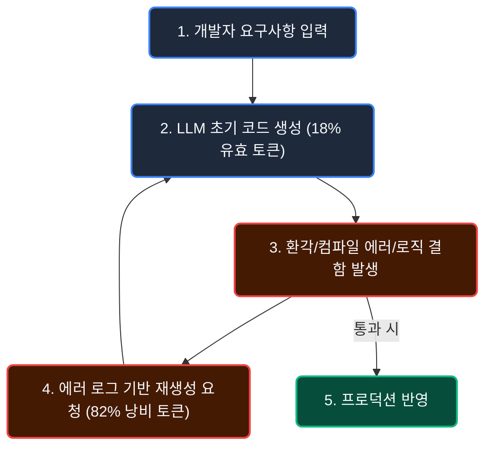

#### 4) 엔지니어링 & 비즈니스 시사점 (Implications & Risks)
* 채팅창 중심(Chat-Centric)의 무한 재생성 패턴으로 인한 비용 급증 및 엔지니어 피로도 누적.
* 아티팩트 중심(Artifact-Centric) 및 로컬 단위 테스트 결합 워크플로우의 필요성 대두.

#### 5) 딥다이브 연구 메모 (Deep Dive Notes & Open Questions)
* [ ] 토큰 낭비를 줄이기 위한 로컬 Linter/Static Analyzer 자동 연동 하네스 구축.
* [ ] 대화형 인터페이스 탈피 및 스펙(Spec) 기반 1-Shot 생성 최적화.

---

### Chart 4: 정체된 AI 신뢰성과 일관성 (AI Reliability Is Barely Improving)

#### 1) 핵심 논제 (Core Thesis)
파운데이션 모델의 벤치마크 역량(Capability)은 지수적으로 상승하고 있으나, 동일한 입력과 환경에서 일관되고 신뢰성 있는 결과를 재현해내는 신뢰성(Reliability)은 거의 개선되지 않고 정체 상태에 머물러 있습니다.

#### 2) 실증 데이터 및 지표 (Empirical Data)
* **프린스턴 대학교 연구 (Kapoor, Rabanser, Narayanan)**: 18개월 동안 14개 프론티어 LLM을 추적 분석한 결과, 역량 점수는 대폭 상승했으나 신뢰성/일관성 지표는 미미한 변화에 그침.

#### 3) 역량 vs 신뢰성 비교 매트릭스

| 분석 차원 | 벤치마크 역량 (Raw Capability) | 실무 신뢰성 (Operational Reliability) |
| :--- | :--- | :--- |
| **정의** | 모델이 풀 수 있는 최고 난이도 문제의 수준 | 동일 조건에서 오답 및 환각 없이 재현되는 일관성 |
| **발전 추세** | 급격한 지수적 상승 (Marketing Highlight) | 거의 수평에 가까운 정체 (Silent Stagnation) |
| **현장 영향** | 화려한 데모 구현 가능 | 프로덕션 에지 케이스에서 시스템 취약점 유발 |

#### 4) 엔지니어링 & 비즈니스 시사점 (Implications & Risks)
* 신뢰성을 모델 자체의 진화에만 기대할 수 없으며, 시스템 아키텍처 수준의 가드레일이 강제되어야 함.
* 다수결 투표(Self-Consistency), 에이전트 자가 검증(Verification Loop) 등 보상 아키텍처 필수.

#### 5) 딥다이브 연구 메모 (Deep Dive Notes & Open Questions)
* [ ] 결정론적 규칙 엔진(Deterministic Rule Engine)과 비결정론적 LLM의 하이브리드 결합.
* [ ] 신뢰성 점수를 정량화하여 CI/CD 파이프라인에 통합하는 방법론.

---

## 4. 인간-AI 상호작용 및 조직 영향 (Human-AI Interaction & Workforce)

### Chart 6: AI 잠재력 활용의 양극화 (People Are Not Using AI to Its Full Potential)

#### 1) 핵심 논제 (Core Thesis)
대다수의 사용자는 텍스트 재작성이나 단순 검색 보조 등 피상적인 수준에 머물러 있으며, 모델의 심층 사고(Thinking Features)나 고차원적 문제 해결 기능을 유의미하게 활용하는 사용자는 극소수에 불과합니다.

#### 2) 실증 데이터 및 지표 (Empirical Data)
* **사용자 행동 통계**: OpenAI 및 주요 플랫폼의 유료 사용자 중에서도 'Thinking/Reasoning' 모드나 구조적 프롬프팅을 정기적으로 활용하는 비율은 하위권에 머무름.

#### 3) 기저 원인 및 메커니즘 (Underlying Mechanism)
* 일반 사용자의 프롬프트 엔지니어링 및 워크플로우 설계 역량 부족.
* 복잡한 에이전틱 도구 사용 시 발생하는 높은 인지적 부하(Cognitive Load).

#### 4) 엔지니어링 & 비즈니스 시사점 (Implications & Risks)
* 사내 AI 라이선스 도입 후 실제 업무 생산성 전환율 저조 (Software Shelfware 화).
* 사용자가 직접 복잡한 프롬프트를 작성하지 않도록 워크플로우가 캡슐화된 전문 도구(Vertical Tooling) 개발 필요.

#### 5) 딥다이브 연구 메모 (Deep Dive Notes & Open Questions)
* [ ] 사내 비개발 직군을 위한 워크플로우 캡슐화 AI 에이전트 인터페이스 설계.
* [ ] 고급 추론 기능 활용률과 업무 성과 간의 상관관계 추적.

---

### Chart 8: 오답에도 맹목적으로 복종하는 인지적 굴복 (AI Users Believe AI Even When It's Wrong)

#### 1) 핵심 논제 (Core Thesis)
사용자가 AI 도구에 의존하기 시작하면 비판적 사고를 중단하고, AI가 명백한 오류나 환각을 제시하더라도 이를 무비판적으로 수용하는 **'인지적 굴복(Cognitive Surrender)'** 현상이 광범위하게 발생합니다.

#### 2) 실증 데이터 및 지표 (Empirical Data)
* **와튼 스쿨(Wharton School) 연구**: 
  * AI가 틀린 답변을 제시했을 때, **참가자의 약 80%가 오답을 그대로 채택**.
  * AI 없이 작업한 그룹보다 오히려 정답률이 떨어졌음에도, 작업자의 주관적 자신감(Confidence)은 더 높게 보고됨.

#### 3) 기저 원인 및 메커니즘 (Underlying Mechanism)
* 자동화 편향(Automation Bias) 및 그럴듯하게 포장된 유창한 문장 구조(Fluency Fallacy).
* 인간의 인지적 피로에 따른 검증 회피 심리.

#### 4) 엔지니어링 & 비즈니스 시사점 (Implications & Risks)
* 검증 없는 생성물 반영으로 인한 프로덕션 장애, 보안 취약점, 법적 리스크 발생.
* 인간의 수동 검토에 의존하지 않는 기계적/자동화된 품질 게이트(Quality Gate) 필수화.

#### 5) 딥다이브 연구 메모 (Deep Dive Notes & Open Questions)
* [ ] 사용자가 AI 출력을 승인하기 전 필수 단위 테스트 통과를 강제하는 UI/UX 설계.
* [ ] 인지적 굴복을 방지하기 위한 반론 제시(Devil's Advocate) 에이전트 도입.

---

### Chart 9: 시간 절약을 체감하지 못하는 실무자 (Workers Don't Think AI Is Saving Them Time)

#### 1) 핵심 논제 (Core Thesis)
경영진은 AI 도입으로 엄청난 생산성 향상이 이루어졌다고 믿는 반면, 현장의 실무자들은 AI 결과물의 검증과 디버깅에 시간이 더 소모되어 실질적인 시간 절약 효과가 없다고 느낍니다.

#### 2) 실증 데이터 및 지표 (Empirical Data)
* **경영진 vs 실무자 인식 조사**:
  * **비관리직 실무자의 40%**: "AI가 업무 시간을 전혀 단축시키지 못한다"고 응답.
  * **경영진의 2%만이** 동일하게 응답 (98%의 경영진은 시간 절약 효과가 있다고 믿음).

#### 3) 기저 원인 및 메커니즘 (Underlying Mechanism)
* **숨겨진 검증 비용(Hidden Verification Overhead)**: 생성된 초안의 팩트체크, 문맥 수정, 버그 수정 작업이 온전히 실무자에게 전가됨.
* 업무 속도 향상이 더 많은 업무 할당으로 이어지는 생산성 역설(Jevons Paradox).

#### 4) 엔지니어링 & 비즈니스 시사점 (Implications & Risks)
* 조직 내 AI 도구 도입에 대한 실무진의 피로도 및 거부감 증가.
* 생성 도구 도입보다 **검증 자동화 도구(Verification Tooling)** 지원이 우선되어야 함.

#### 5) 딥다이브 연구 메모 (Deep Dive Notes & Open Questions)
* [ ] 사내 개발자의 실제 코딩/리뷰 시간 중 AI 검증에 소요되는 시간 측정.
* [ ] 실무자의 검증 부하를 줄여주는 도구 체인(Harness) 기획.

---

### Chart 10: 주니어 개발자 채용 시장 붕괴 (AI Is Killing the Jobs of Junior Developers)

#### 1) 핵심 논제 (Core Thesis)
기업들이 기초적인 코딩 및 반복 업무를 AI로 대체하면서 엔트리 레벨(주니어) 채용을 대폭 축소하고 있으며, 이는 장기적으로 시니어 엔지니어로 성장할 인재 파이프라인의 붕괴를 초래하고 있습니다.

#### 2) 실증 데이터 및 지표 (Empirical Data)
* **주니어 일자리 감소 추정**: ChatGPT 출시 이후 이전 채용 추세선 대비 **약 50만 개의 주니어 개발자 일자리가 소멸**된 것으로 분석.
* **신입 공채 축소**: 글로벌 빅테크 및 스타트업의 신입 개발자 채용 비중 급감.

#### 3) 성장 사다리 붕괴 메커니즘 (Broken Career Ladder)

```mermaid
graph TD
    subgraph Traditional["전통적 성장 경로 (AS-IS)"]
        JuniorWork["주니어: 반복/기초 업무 수행"] --> Mentorship["시니어 멘토링 & 코드 리뷰"]
        Mentorship --> SeniorGrow["시니어 엔지니어로 성장"]
    end

    subgraph CurrentAI["AI 도입 후 구조 (TO-BE)"]
        AIWork["AI 도구: 기초/반복 업무 전담"] -.-> DropJunior["주니어 채용 축소 (50만 개 일자리 감소)"]
        DropJunior -.-> MissingLadder["중간 성장 사다리 단절"]
        MissingLadder -.-> SeniorShortage["미래 시니어 엔지니어 고갈 위기"]
    end

    classDef normal fill:#1e293b,stroke:#3b82f6,stroke-width:2px,color:#f8fafc,rx:6px;
    classDef warning fill:#451a03,stroke:#ef4444,stroke-width:2px,color:#f8fafc,rx:6px;
    class Traditional,JuniorWork,Mentorship,SeniorGrow normal;
    class CurrentAI,AIWork,DropJunior,MissingLadder,SeniorShortage warning;
```

#### 4) 엔지니어링 & 비즈니스 시사점 (Implications & Risks)
* 5~10년 후 복잡한 아키텍처 설계와 장애 대응을 책임질 시니어 인력 부족 심화.
* 주니어가 AI가 짠 코드의 숨은 결함을 꿰뚫어 보지 못하는 기술 부채 축적.

#### 5) 딥다이브 연구 메모 (Deep Dive Notes & Open Questions)
* [ ] 주니어 엔지니어가 AI 도구를 사용하면서도 내부 동작 원리를 학습할 수 있는 사내 교육 체계 설계.
* [ ] AI 하네스 환경에서 주니어의 '설계 및 검증 역량'을 평가하는 새로운 온보딩 기준 수립.

---

## 5. 결론 및 종합 딥다이브 체크리스트 (Summary & Action Plan)

| 영역 | 핵심 리스크 | 엔터프라이즈 대응 액션 플랜 |
| :--- | :--- | :--- |
| **시장/비용** | 순환 거래 및 CapEx 불균형에 따른 벤더 리스크 | 멀티 벤더 Fallback 확보, 단위 업무 완료당 ROI 산출 체계 수립 |
| **인프라** | 데이터센터 확장 저항 및 비용 상승 | 모델 경량화(SLM), 양자화, 전력 효율 중심 워크로드 최적화 |
| **신뢰성** | 역량 대비 정체된 신뢰성, 82% 토큰 낭비 | 스펙 우선 생성, 로컬 단위 테스트 결합 자가 검증 하네스 구축 |
| **인간/조직** | 인지적 굴복(80%), 주니어 육성 사다리 단절 | 자동화 품질 게이트 강제, AI 페어 프로그래밍 기반 멘토링 프로그램 재설계 |

---

## Appendix: 원문 및 참고 문헌

* Alberto Romero, *"11 Charts the AI Industry Doesn't Want You to See"*, The Algorithmic Bridge / Medium (2026).
* Sayash Kapoor, Rishi Bommasani, Arvind Narayanan, *"The Capability-Reliability Tradeoff in Frontier AI Models"*, Princeton University.
* Wharton School, *"Thinking—Fast, Slow, and Artificial: How AI is Reshaping Human Reasoning and the Rise of Cognitive Surrender"*.
* Sequoia Capital (David Cahn), *"AI's $600B Question"*.
