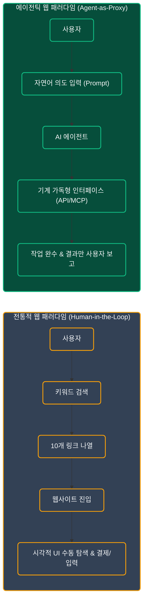
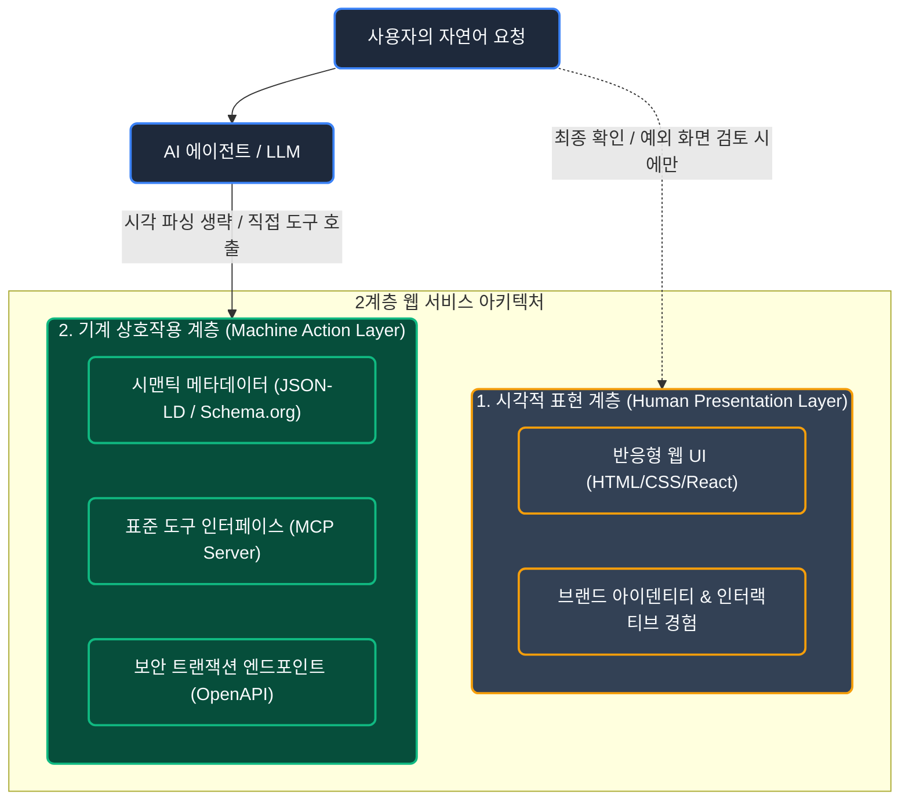
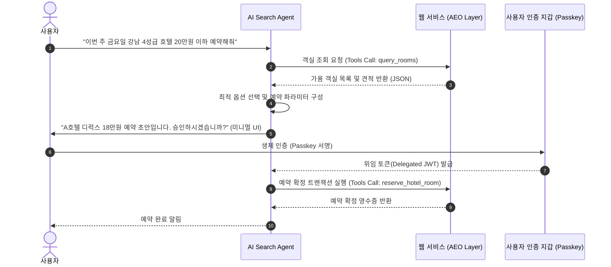

# AI 검색과 에이전틱 웹의 도래: 웹 UI/UX 및 프론트엔드 아키텍처의 대전환

## 1. 들어가며: 인간의 브라우징에서 에이전트의 작업 완수로

수십 년간 웹의 기본 상호작용 모델은 **'인간 중심의 시각적 탐색(Human-Centric Visual Browsing)'**이었습니다. 사용자는 검색창에 키워드를 입력하고, 검색 엔진이 나열한 10개의 파란색 링크 중 하나를 클릭하여 웹사이트로 이동한 뒤, 복잡한 네비게이션 메뉴와 배너, 버튼을 마우스로 조작하며 원하는 정보나 결제 과정을 수동으로 완료해 왔습니다.



그러나 생성형 AI와 자율 에이전트(Autonomous Agents)가 결합된 검색 환경은 이 인터랙션 구조를 근본적으로 뒤흔들고 있습니다. 사용자는 더 이상 정보를 얻기 위해 웹사이트의 복잡한 시각 요소를 일일이 눈으로 스캔하지 않으며, 최종 목표(예: 항공권 예약, 상품 비교 구매, 서류 발급 등)를 AI 에이전트에 위임합니다.

이에 따라 웹사이트는 **'인간 방문자를 위한 시각적 렌더링 화면'**을 넘어, **'AI 에이전트가 오차 없이 즉시 데이터를 읽고 트랜잭션을 실행할 수 있는 기계 가독형 플랫폼'**으로 전면 재편되어야 하는 중대한 아키텍처 전환점에 직면했습니다.

---

## 2. 핵심 아키텍처 및 원리 심층 분석

### 2.1 2계층 웹 아키텍처 (Two-Tier Web Architecture)

에이전틱 웹 시대의 프론트엔드는 시각 계층(Visual Presentation Layer)과 기계 상호작용 계층(Machine Interface Layer)으로 명확히 이원화됩니다.



1. **시각적 표현 계층 (Human Presentation Layer)**:
   - 사용자가 직접 최종 결정을 내리거나, 고도의 감성적 브랜딩이 필요한 순간에 소비되는 반응형 UI입니다.
   - 불필요한 배너와 복잡한 네비게이션이 축소되고, 에이전트가 요약한 결과를 승인하는 형태의 **'컨펌/체크아웃 중심 UI'**로 간소화됩니다.
2. **기계 상호작용 계층 (Machine Action Layer)**:
   - 에이전트가 DOM 트리를 스크래핑하지 않고도 사이트의 상태(State)와 실행 가능한 액션(Actions)을 즉시 파악할 수 있도록 표준화된 프로토콜 규격입니다.
   - [Model Context Protocol(MCP)](file:///mnt/data/myjob/cloit/ai-info/.agents/rules/tech_post_styleguide.md) 및 선언적 도구 명세(Tool Definition)가 핵심 역할을 수행합니다.

---

### 2.2 패러다임 비교: 전통적 웹(SEO) vs 에이전틱 웹(AEO)

| 비교 항목 | 전통적 웹 (SEO & Human UX) | 과도기 (Computer Use Agent) | 에이전틱 웹 (AEO & Agentic UX) |
| :--- | :--- | :--- | :--- |
| **주요 사용자** | 인간 브라우징 사용자 | 인간을 모방한 스크린 리딩 AI | 자율형 AI 에이전트 (직접 연동) |
| **탐색 방식** | 시각적 레이아웃 스캔 & 클릭 | Vision 기반 마우스/DOM 조작 | 표준화된 도구(MCP/API) 직접 호출 |
| **최적화 목표** | 검색 순위 노출 (SEO, 키워드) | 화면 요소 식별자(Accessibility ID) | **작업 완수 성공률(Task Fulfillment, AEO)** |
| **UI 복잡도** | 다단 메뉴, 배너, 시각적 유도선 | 복잡한 UI로 인해 AI 환각 빈발 | **미니멀 컨펌 뷰 + Headless 액션** |
| **인증 방식** | 아이디/비밀번호, CAPTCHA, SMS OTP | 자동화 봇 차단(CAPTCHA)과 충돌 | **위임된 서명(Passkey, OAuth for Agent)** |

---

## 3. 실전 구현 및 실증 시나리오 (Implementation & Guardrails)

### 3.1 AEO를 위한 표준 도구 명세 (Model Context Protocol 기반)

웹사이트가 에이전트에게 예약이나 결제 기능을 제공하려면, 에이전트가 오인 없이 실행할 수 있는 기계 가독형 도구 스키마(Tool Manifest)를 노출해야 합니다.

```json
{
  "name": "reserve_hotel_room",
  "description": "지정된 날짜와 객실 유형에 맞춰 호텔 예약을 확정합니다. 가격은 KRW 기준입니다.",
  "parameters": {
    "type": "object",
    "properties": {
      "hotel_id": {
        "type": "string",
        "description": "호텔의 고유 식별자"
      },
      "check_in": {
        "type": "string",
        "format": "date",
        "description": "체크인 날짜 (YYYY-MM-DD)"
      },
      "check_out": {
        "type": "string",
        "format": "date",
        "description": "체크아웃 날짜 (YYYY-MM-DD)"
      },
      "room_type": {
        "type": "string",
        "enum": ["standard", "deluxe", "suite"]
      },
      "user_delegated_token": {
        "type": "string",
        "description": "사용자가 서명한 일회성 위임 인증 토큰"
      }
    },
    "required": ["hotel_id", "check_in", "check_out", "room_type", "user_delegated_token"]
  }
}
```

---

### 3.2 에이전트 상호작용 시퀀스 및 보안 가드레일

에이전트가 작업을 대행할 때 가장 치명적인 문제는 **'비인가 과금'**이나 **'환각으로 인한 오주문'**입니다. 이를 방어하기 위해 **2단계 트랜잭션 커밋(Two-Phase Transaction Guardrail)**이 강제되어야 합니다.



---

### 3.3 UI/UX 디자인 원칙의 변화

1. **디클러터링(Decluttering)과 미니멀리즘의 극대화**:
   - 광고 클릭률(CTR)을 높이기 위해 배치하던 어지러운 배너, 팝업, 낚시성 네비게이션은 에이전트 환경에서 완전히 무의미해집니다.
   - 오직 사용자가 최종 의사결정을 내리는 데 필요한 핵심 정보(가격, 옵션, 취소 정책)만 명료하게 보여주는 **'선언적 뷰(Declarative View)'**로 수렴합니다.
2. **봇 차단(CAPTCHA)에서 봇 권한 위임(Delegated Auth)으로**:
   - 기존의 인간 검증용 캡차는 유용한 사용자 에이전트의 접근까지 차단하는 병목이 됩니다.
   - 사용자 브라우저 지갑 기반의 **Passkey / WebAuthn 기반 일회성 작업 서명**을 통해 보안을 유지하면서도 에이전트의 백엔드 다이렉트 트랜잭션을 허용해야 합니다.

---

## 4. 결론 및 실무 권고사항 (Key Takeaways)

1. **웹 트래픽의 본질 변화**: 앞으로의 웹 트래픽은 '페이지 뷰(PV)'가 아니라 **'에이전트 태스크 완수 횟수(Task Conversions)'**로 평가받게 됩니다.
2. **AEO(Agent Engine Optimization) 준비**: 검색 노출을 위해 텍스트 키워드만 채워넣는 방식에서 벗어나, OpenAPI 스키마, JSON-LD, [MCP 표준](file:///mnt/data/myjob/cloit/ai-info/.agents/rules/tech_post_styleguide.md)을 제공하여 에이전트가 오류 없이 호출할 수 있는 백엔드 인터페이스를 구축해야 합니다.
3. **프론트엔드 엔지니어의 역할 확장**: 단순히 화면의 픽셀을 맞추는 작업을 넘어, 인간을 위한 초경량 승인 UI와 AI 에이전트를 위한 기계 인터페이스 사이의 **'하이브리드 인터랙션 아키텍처'**를 설계하는 역량이 필수가 될 것입니다.

---

## Appendix: 참고 자료 및 관련 표준

- [Model Context Protocol (MCP) Specification](https://modelcontextprotocol.io)
- [Schema.org Actions Specification](https://schema.org/Action)
- [W3C WebAuthn / Passkey Documentation](https://w3c.github.io/webauthn/)
