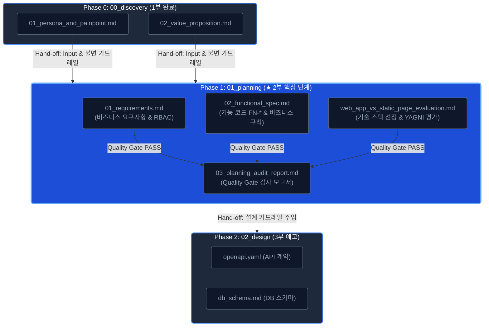
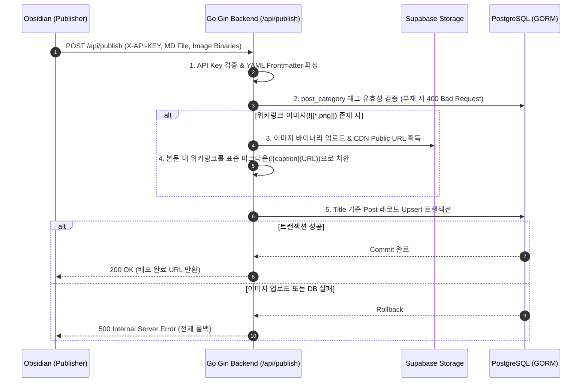
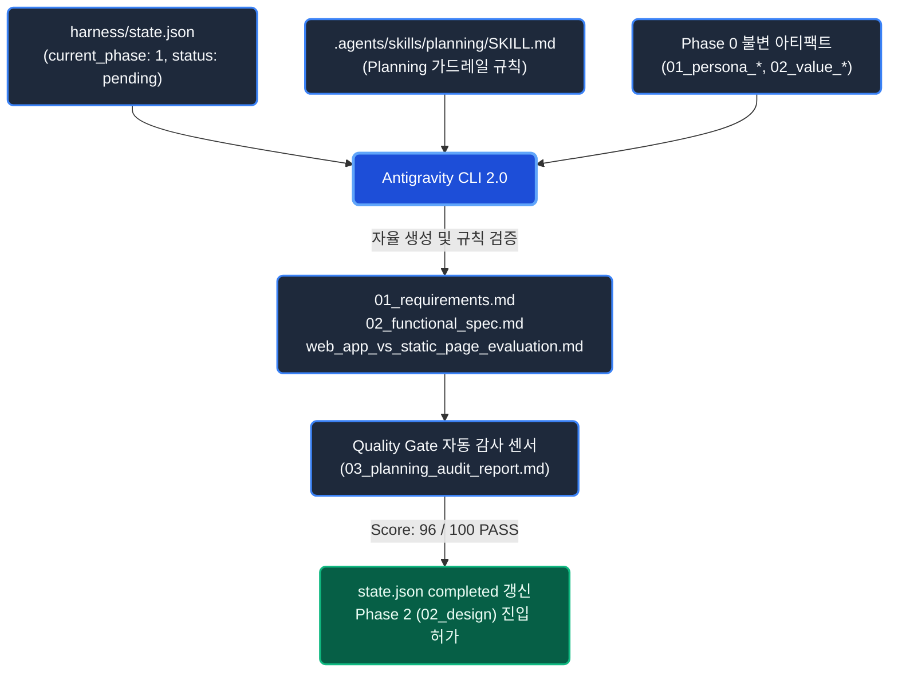

> [!NOTE]
> **관련 문서 및 실습 환경**
> - 선행 포스트 (1부): [2026-08-06-sdlc-harness-engineering-part1-discovery.md](file:///mnt/data/myjob/cloit/ai-info/posts/drafts/2026-08-06-sdlc-harness-engineering-part1-discovery.md)
> - 하네스 실습 환경: [poc/harness-test](file:///mnt/data/myjob/cloit/ai-info/poc/harness-test)
> - 프로덕션 애플리케이션: [app](file:///mnt/data/myjob/cloit/ai-info/app)
> - Planning 단계 핵심 산출물: [app/docs/01_planning](file:///mnt/data/myjob/cloit/ai-info/app/docs/01_planning)
>   - 요구사항 명세서: [01_requirements.md](file:///mnt/data/myjob/cloit/ai-info/app/docs/01_planning/01_requirements.md)
>   - 기능 정의서: [02_functional_spec.md](file:///mnt/data/myjob/cloit/ai-info/app/docs/01_planning/02_functional_spec.md)
>   - 아키텍처 평가서: [web_app_vs_static_page_evaluation.md](file:///mnt/data/myjob/cloit/ai-info/app/docs/01_planning/web_app_vs_static_page_evaluation.md)

### 들어가며: 프롬프트 엔지니어링의 한계와 선언적 명세의 필요성

생성형 AI를 활용해 실제 동작하는 프로덕션 애플리케이션(`app`)을 구축할 때, 가장 흔하게 빠지는 함정은 **"대화형 프롬프팅(Chat-Centric Prompting)"에만 의존하는 방식**입니다.

"Obsidian 마크다운을 업로드하면 웹에 바로 배포되고, 독자들이 Q&A를 나눌 수 있는 CMS를 Go와 React로 만들어줘"라는 식의 자연어 프롬프트는 그럴듯해 보이지만, 실제 코드베이스가 커질수록 다음과 같은 치명적인 결함을 드러냅니다.

1. **맥락 소실 및 환각(Context Drift & Hallucination)**: 대화가 길어질수록 AI는 초기 기획 의도를 잊고, 존재하지 않는 라이브러리나 엔드포인트를 임의로 창작합니다.
2. **불필요한 과잉 엔지니어링(Over-engineering)**: 요구사항의 경계(Out of Scope)가 고정되어 있지 않으면, AI는 요청하지도 않은 복잡한 마이크로서비스(MSA), 분산 캐시, 무거운 결제 시스템 등을 자의적으로 덧붙여 코드베이스를 즉시 오염시킵니다.
3. **재현 불가능한 비결정론(Non-deterministic Chaos)**: 동일한 프롬프트를 주어도 매번 다른 아키텍처와 API 스키마를 출력하므로, 백엔드와 프론트엔드의 정합성이 완전히 붕괴됩니다.

이 문제를 근본적으로 해결하기 위해서는 불완전한 자연어 프롬프팅에서 벗어나, **AI의 작업 범위와 컨텍스트를 명확히 정의하는 불변의 아티팩트, 즉 선언적 명세(Declarative Specification)** 체계로 전환해야 합니다.

본 2부에서는 실제 기술 플랫폼 [joinc.co.kr](https://www.joinc.co.kr)의 CMS 프로젝트인 `app`(Go Gin 백엔드 + Astro/React 프론트엔드)을 구축하는 여정 중, 1부(`00_discovery`)에서 확정된 비즈니스 가치를 이어받아 **`01_planning` 단계의 선언적 요구사항 명세(`01_requirements.md`), 상세 기능 정의서(`02_functional_spec.md`), 아키텍처 평가서(`web_app_vs_static_page_evaluation.md`)**를 하네스 파이프라인으로 정밀하게 산출하고 AI의 작업 가드레일을 구축하는 과정을 다룹니다.

---

## 1. 하네스 파이프라인에서의 Planning(기획) 위상

하네스 엔지니어링에서 각 SDLC 단계는 이전 단계의 산출물을 입력(Input)이자 가드레일(Guardrail)로 수용하고, 다음 단계가 준수해야 할 불변의 아티팩트를 산출하는 **단방향 릴레이 파이프라인(One-way Relay Pipeline)**으로 동작합니다.



### Phase 0 $\rightarrow$ Phase 1 단방향 Hand-off 메커니즘

1부 `00_discovery` 단계에서 인간 엔지니어와 AI 하네스가 확정한 산출물은 다음과 같습니다.
* **`01_persona_and_painpoint.md`**: 콘텐츠 공급자(Publisher - Obsidian 작성자) 및 독자(C-Level 의사결정권자, 실무 풀스택 엔지니어)의 구체적 페인포인트.
* **`02_value_proposition.md`**: 핵심 가치 제안 3종(Obsidian 1초 자동 배포, 검증된 딥다이브 리포트 서빙, B2B Tech Q&A 포럼) 및 제품 경계선(Out of Scope: 실시간 1:1 채팅 제외, 커스텀 결제 배제 등).

이 두 아티팩트는 `01_planning` 단계에 진입하는 순간 **수정 불가능한 불변 제약 조건(Read-only Invariants)**으로 주입됩니다. AI 에이전트는 이 제약 조건을 엄격히 준수해야 하며, 모든 기능 요구사항은 반드시 정의된 페인포인트를 해결하는 목적으로만 구체화되어야 합니다.

### 1단계 기획 아티팩트가 AI 개발에 제공하는 5대 핵심 엔지니어링 가치

`00_discovery`에서 정제된 기획 아티팩트가 `01_planning`의 하네스로 주입될 때, 개발 팀과 AI 에이전트는 다음과 같은 결정론적 이점을 확보합니다.

1. **개발 바운더리 고정 및 오버엔지니어링·할루시네이션 원천 차단 (Bounded Solution Space)**
   * `Out of Scope`(비목표) 제약이 AI의 추론 탐색 공간(Search Space)을 명시적으로 제한합니다.
   * AI가 자의적으로 복잡한 아키텍처(MSA 분리, 불필요한 캐시 계층, 과도한 결제 모듈 등)를 창작하는 것을 원천 봉쇄하고 **KISS(Keep It Simple, Stupid) 및 YAGNI 원칙**을 강제합니다.
2. **요구사항 및 기능 스펙의 결정론적 구체화 (Deterministic Functional Specification)**
   * 확정된 바운더리 안에서 추론하므로, 모호한 자연어를 고유 기능 코드(`FN-*`)와 엣지 케이스 규칙(RBAC, 롤백 트랜잭션, 멱등성)으로 정밀하게 쪼갤 수 있습니다.
   * 이는 3부(`02_design`)의 `openapi.yaml`과 `db_schema.md`로 **누락 없이 1:1 직접 매핑**되는 결정론적 발판이 됩니다.
3. **컨텍스트 격리와 토큰 예산 최적화 (Context Isolation & Token Budget Control)**
   * 대화 세션에 누적되는 불필요한 잡음을 제거하고, 정제된 기획 아티팩트만 주입(Context Injection)합니다.
   * LLM의 어텐션 분산(Attention Dilution)을 방지하여 **환각 감소, 추론 레이턴시(Latency) 단축, 토큰 비용 절감**을 동시에 달성합니다.
4. **인간 & AI 단일 진실 원천 기반 협업 체계 구축 (SSOT for Human-AI Teaming)**
   * 기획 아티팩트가 Git 레포지토리(`app/docs/`)에 영구 자산화되므로, AI뿐만 아니라 동료 엔지니어와 PM에게도 **단일 진실 원천(Single Source of Truth)**이 됩니다.
   * "AI가 왜 이렇게 코드를 짰는가?"에 대한 아키텍처적 근거가 투명해져 **인간 엔지니어(HITL)의 코드 리뷰 인지 부하를 대폭 경감**합니다.
5. **변경 추적성 및 감사 기준점 확보 (Traceability & Audit Baseline)**
   * 하위 단계(WBS 및 코드 구현)에서 버그나 불일치가 발생했을 때, "구현 오류인지 기획 누락인지"를 즉시 역추적할 수 있는 엄격한 감사 기준점(Audit Baseline)을 제공합니다.

---

## 2. 프롬프팅 vs 선언적 명세 하네스 비교

소프트웨어 개발에서 왜 일회성 프롬프트 대신 정형화된 마크다운 아티팩트를 하네스로 삼아야 하는지 비교하면 다음과 같습니다.

| 비교 항목 | 대화형 프롬프팅 (Chat-Centric) | 선언적 명세 하네스 (Artifact-Centric) |
| :--- | :--- | :--- |
| **맥락 유지 방식** | 대화 세션 컨텍스트 윈도우 의존 (휘발성) | 레포지토리 내 마크다운 아티팩트로 영구 자산화 (`app/docs/`) |
| **작업 범위 제어** | "간단하게 만들어줘" 식의 모호한 자연어 통제 | `Out of Scope` 및 기능 코드(`FN-*`) 단위의 명시적 경계 통제 |
| **결정론 및 재현성** | 실행할 때마다 구조와 네이밍이 달라짐 (Non-deterministic) | 명세서에 정의된 규칙과 스키마에 따라 100% 일관된 결과 산출 |
| **설계 정합성 보장** | 프론트엔드와 백엔드가 서로 다른 가정을 기반으로 코딩 | 요구사항(`01_`) $\rightarrow$ 기능정의(`02_`) $\rightarrow$ API(`openapi.yaml`)로 기계적 매핑 |
| **품질 검증 체계** | 엔지니어의 수동 코드/문서 검토에 의존 | Quality Gate 센서를 통한 자동 Audit 점수화 (80점 미만 시 반려) |
| **팀 협업 및 확장** | 프롬프트를 잘 쓰는 소수 엔지니어의 개인 역량 의존 | 레포지토리 표준 `SKILL.md`를 통해 주니어/PM도 동일한 품질 산출 |

---

## 3. 실전 구축: `app` 프로젝트의 3대 Planning 아티팩트

실제 `app` 프로젝트의 [app/docs/01_planning](file:///home/yundream/myjob/cloit/ai-info/app/docs/01_planning) 디렉토리에는 AI 에이전트의 개발 범위를 제어하기 위한 3대 핵심 산출물이 정의되어 있습니다.

```text
app/docs/01_planning/
├── 01_requirements.md                   # 비즈니스/기능/비기능 핵심 요구사항 정의서
├── 02_functional_spec.md                # 기능 코드(FN-*) 및 상세 비즈니스 규칙 정의서
└── web_app_vs_static_page_evaluation.md # 기술 스택 평가 및 YAGNI 원칙 검증서
```

### 1) `01_requirements.md`: 비즈니스 유스케이스와 RBAC 정책 고정

[01_requirements.md](file:///home/yundream/myjob/cloit/ai-info/app/docs/01_planning/01_requirements.md)는 페르소나의 문제를 해결하기 위한 시스템의 최상위 요구사항을 정의합니다.

```markdown
# 01_requirements.md 핵심 발췌

## 4. 권한 및 접근 제어 정책 (RBAC)
| 사용자 역할 | 인증 방식 | 주요 권한 |
| :--- | :--- | :--- |
| **어드민 (Admin)** | API Key (`X-API-KEY`) | * Obsidian 연동 Tech 콘텐츠 실시간 등록/수정/삭제 독점<br>* 전체 댓글 및 Q&A 포럼 모니터링/삭제 권한 |
| **일반 회원 (Member)** | 소셜 로그인 (OAuth) | * 전체 Tech 리포트 열람, 북마크, 댓글 작성<br>* Tech Q&A 포럼 스레드 개설 및 답변 작성/채택 |
| **방문자 (Visitor)** | 없음 (Public) | * 전체 공개 Tech 리포트 및 포럼 스레드 조회 전용 (Read-Only) |

## 5. 핵심 기능적 요구사항
- **Obsidian 실시간 Tech 콘텐츠 배포**: Frontmatter 카테고리 자동 라우팅, 위키링크 이미지(`![[image.png]]`) 클라우드 스토리지 치환, Upsert 실시간 동기화.
- **독자 인게이지먼트**: 스레드형 댓글, 북마크 토글, 전문 Tech Q&A 토론 포럼.
- **인터랙티브 뷰어**: 우측 목차(TOC) 네비게이션, 코드 하이라이팅, 접이식 토글.
```

> **💡 하네스 가드레일 효과**  
> 이 명세를 통해 AI는 불필요한 '자체 회원가입/비밀번호 찾기'나 '복잡한 다중 테넌트 권한'을 만들지 않고, **어드민용 `X-API-KEY`와 일반 독자용 OAuth 소셜 로그인**이라는 2계층 인증 체계로 범위를 정확히 한정합니다.

---

### 2) `02_functional_spec.md`: 기능 코드(`FN-*`) 및 상세 비즈니스 규칙 선언

[02_functional_spec.md](file:///home/yundream/myjob/cloit/ai-info/app/docs/01_planning/02_functional_spec.md)는 요구사항을 기계적으로 백엔드 API와 DB 설계로 직결시킬 수 있도록 기능 코드(`FN-POST`, `FN-TAG`, `FN-FORUM`, `FN-ENG`, `FN-AUTH`, `FN-ADM`)를 부여하고 비즈니스 엣지 케이스를 선언합니다.



#### 주요 비즈니스 규칙 가드레일 예시:
1. **Obsidian 배포 원자성(Atomicity)**:
   * 이미지 업로드 중 1개라도 실패할 경우, 전체 포스트 등록 트랜잭션을 롤백(Rollback)하여 고아 데이터 발생을 원천 차단합니다.
2. **Flat Tag 분류 무결성(Taxonomy Integrity)**:
   * `Post`에는 반드시 `Type = 'post_category'` 태그가 1개 이상 바인딩되어야 하며, `Forum` 전용 태그(`forum_category`)는 바인딩될 수 없습니다.
3. **Q&A 답변 단일 채택 및 상태 전이(Single Resolution)**:
   * 오직 질문 작성자 본인만 답변을 채택할 수 있으며, 채택 시 `Forums.AcceptedAnswerID` 바인딩과 함께 `Forums.IsResolved = true`로 상태가 원자적으로 전환됩니다.

---

### 3) `web_app_vs_static_page_evaluation.md`: YAGNI 원칙 기반 기술 스택 확정

기획 단계에서 기술 스택을 결정할 때, AI에게 "알아서 골라줘"라고 하면 불필요하게 무거운 MSA나 복잡한 분산 스택을 제안하기 쉽습니다. 

[web_app_vs_static_page_evaluation.md](file:///home/yundream/myjob/cloit/ai-info/app/docs/01_planning/web_app_vs_static_page_evaluation.md)는 **정적 페이지(Static Site) vs 정식 웹 앱(Dynamic Web App)**의 장단점을 명확한 비즈니스 기준(Obsidian 연동 속도, 커뮤니티 확장성, TCO)으로 대조하여, 불필요한 오버엔지니어링을 배제하는 의사결정을 내립니다.

```markdown
# web_app_vs_static_page_evaluation.md 핵심 비교표

| 평가 항목 | 정적 페이지 (GitHub Pages, Quartz 등) | 정식 웹 앱 (Go Gin + Astro/React CSR) | 최종 채택 이유 |
| :--- | :--- | :--- | :--- |
| **발행 리드타임** | Git Push 후 CI/CD 빌드 대기 (1~2분) | API 수신 즉시 DB 적재 (수 밀리초 내 실시간) | **Obsidian 원스톱 실시간 배포 달성** |
| **커뮤니티 확장** | 정적 댓글 위젯(Giscus)에 한정 | 회원가입, Q&A 포럼, 답변 채택, 북마크 | **B2B 양방향 지식 생태계 필수 요건** |
| **인프라 복잡도** | 호스팅 무료, 관리 제로 | 백엔드 API 서버 + PostgreSQL DB 운용 | **단일 컨테이너 기반 경량 Go 스택으로 TCO 최소화** |
```

> **💡 최종 아키텍처 결정**:  
> 빌드 타임이 소요되는 정적 생성기(SSG)의 한계를 넘어, **초경량 Go Gin REST 백엔드 + 100% 클라이언트 렌더링(CSR) 기반의 Astro/React 프론트엔드**를 결합함으로써 "실시간 배포"와 "커뮤니티 상호작용"을 동시에 만족하는 최적의 KISS(Keep It Simple, Stupid) 구조를 확정했습니다.

---

## 4. [Hands-on] Antigravity CLI 2.0 기반 Planning 자율 워크플로우 실행 및 검증

이러한 선언적 기획 체계는 실제 AI 에이전트 환경에서 어떻게 자율 실행될까요?  
GitHub 레포지토리에 배포된 `.agents/skills/planning/SKILL.md`와 `harness/state.json`을 통해 Antigravity CLI 2.0이 Phase 1(`01_planning`)을 자율 수행하는 과정을 살펴봅니다.



#### 워크플로우 구성요소 설명
* **`harness/state.json` (상태 제어기)**: 현재 SDLC 단계(`current_phase: 1`) 및 진행 상태(`pending`)를 추적하고, 다음 단계로의 전이를 통제하는 단일 상태 파일입니다.
* **`Antigravity CLI 2.0` (AI 실행 런타임)**: 하네스 스킬 규칙과 상위 단계 산출물을 컨텍스트로 주입받아 자율적으로 기획 및 검증 작업을 수행하는 AI 에이전트 엔진입니다.
* **`.agents/skills/planning/SKILL.md` (하네스 가드레일)**: Planning 단계에서 AI가 준수해야 할 입력 제약 조건(Out of Scope 준수), 필수 산출물 규격, 품질 검증 규칙을 선언한 스킬 명세입니다.
* **`Phase 0 불변 아티팩트` (선행 입력)**: 1부 `00_discovery`에서 확정된 페르소나 및 가치 제안 문서로, Planning 단계의 수정 불가능한 불변 제약 조건(Read-only Invariants)으로 주입됩니다.
* **`3대 기획 산출물` (생성 아티팩트)**: AI가 가드레일에 맞춰 작성한 요구사항 명세서(`01_`), 상세 기능 정의서(`02_`), 기술 스택 평가서(`web_app_vs_*`)입니다.
* **`Quality Gate 센서 (03_planning_audit_report.md)`**: 생성된 아티팩트들이 Phase 0의 가치 제안과 1:1로 매핑되는지 자동 검증하고 정량 감사 리포트를 산출합니다.
* **`Phase 2 진입 승인` (단계 전이)**: 감사 점수가 기준치(80점)를 넘어서면 `state.json`을 `completed`로 갱신하고 Phase 2(`02_design`) 핸드오프를 승인합니다.

### 1) Planning 전용 범용 하네스 스킬 (`.agents/skills/planning/SKILL.md`)

```markdown
---
name: planning-harness
description: Phase 0(00_discovery)의 페르소나 및 가치 제안 아티팩트를 입력받아 요구사항 정의서, 기능 명세서, 기술 평가서를 산출하는 하네스 스킬
---

# Engineering Planning (01_planning) 범용 하네스 스킬

## 1. 입력 컨텍스트 가드레일
- 반드시 app/docs/00_discovery/ 하위의 01_persona_and_painpoint.md와 02_value_proposition.md를 Read-Only로 로드하라.
- 00_discovery에 정의된 Out of Scope 항목을 절대 침범하지 마라.

## 2. 산출 아티팩트 및 필수 명세 규격
1. 01_requirements.md: 타겟 페르소나 매핑, 3대 핵심 솔루션, RBAC 권한 매트릭스, 기능/비기능 요구사항.
2. 02_functional_spec.md: 기능 코드(FN-*), 엔드포인트 1:1 매핑 표, 트랜잭션 롤백 및 Flat Tag 정합성 예외 처리.
3. web_app_vs_static_page_evaluation.md: 정적 사이트 vs 동적 웹앱 아키텍처 다각도 비교 및 최종 채택 근거.

## 3. Quality Gate (품질 검증 센서)
- 모든 기능 코드(FN-*)가 00_discovery의 가치 제안(V-*)과 1:1로 추적 가능한지 검증.
- 평가 결과를 03_planning_audit_report.md로 작성하고, 80점 이상 시 state.json을 completed로 갱신.
```

---

### 2) 최소 프롬프트 기반 자율 실행 및 감사 리포트 (CLI 실행 로그 검증)

엔지니어는 복잡한 프롬프트를 작성할 필요 없이, 단지 "작업 진행해줘"라는 한 마디만 전달합니다.

```text
> 01_planning 작업 진행해줘

● Read(/app/harness/state.json)
  - current_phase: 1 (01_planning), status: "pending" 감지
● Read(/app/.agents/skills/planning/SKILL.md)
● Read(/app/docs/00_discovery/01_persona_and_painpoint.md)
● Read(/app/docs/00_discovery/02_value_proposition.md)
● Create(/app/docs/01_planning/01_requirements.md)
● Create(/app/docs/01_planning/02_functional_spec.md)
● Create(/app/docs/01_planning/web_app_vs_static_page_evaluation.md)
● Create(/app/docs/01_planning/03_planning_audit_report.md)
● Update(/app/harness/state.json)

Phase 1 (01_planning) 작업 및 Quality Gate 감사를 성공적으로 완료하였습니다.
──────
### 📋 생성된 아티팩트 및 품질 감사 요약
1. 핵심 요구사항 정의서 (01_requirements.md)
   • 페르소나별 3대 솔루션 매핑 및 3계층(Admin/Member/Visitor) RBAC 권한 정의 완료
2. 상세 기능 정의서 (02_functional_spec.md)
   • 18개 세부 기능 코드(FN-POST, FN-TAG, FN-FORUM 등) 정의 및 트랜잭션 롤백 가드레일 명세화
3. 기술 스택 평가서 (web_app_vs_static_page_evaluation.md)
   • 정적 페이지 대비 Go Gin + Astro CSR 웹앱 채택 타당성 검증 (실시간 배포 + 포럼 커뮤니티)
4. Quality Gate 평가 (03_planning_audit_report.md)
   • 점수: 96 / 100 (PASS)
   • 상태: state.json 내 01_planning 상태를 completed로 갱신, Phase 2(02_design) 진입 준비 완료
```

---

## 5. 결론 및 실무 권고사항 (Key Takeaways)

`app` 구축 여정에서 `01_planning` 단계를 선언적 명세 하네스로 구축함으로써 얻은 핵심 엔지니어링 가치는 다음과 같습니다.

1. **AI의 컨텍스트 이탈(Context Drift) 방지**:
   * 자연어 대화에 의존하지 않고 `01_requirements.md`와 `02_functional_spec.md`라는 구체적인 명세 문서를 기준으로 삼아, AI가 임의로 기능을 추가하거나 생략하는 환각을 방지합니다.
2. **기능 코드(`FN-*`)를 통한 설계-구현 추적성(Traceability) 확보**:
   * 모든 기능에 고유 ID를 부여함으로써, 3부(`02_design`)의 OpenAPI 엔드포인트 및 4부(`04_wbs`)의 세부 태스크와 1:1로 결합되는 완벽한 추적 체계를 마련했습니다.
3. **YAGNI/KISS 원칙을 통한 인프라 오버엔지니어링 배제**:
   * `web_app_vs_static_page_evaluation.md`를 통해 프로젝트에 꼭 필요한 최소한의 아키텍처(Go Gin + Astro CSR)를 선언하여 불필요한 클라우드 비용과 유지보수 부담을 제거했습니다.
4. **결정론적 Quality Gate 기반의 단방향 승인 파이프라인 완성**:
   * 각 단계가 끝날 때마다 자동화된 감사 센서가 가드레일 준수 여부를 검증하고 상태(`state.json`)를 전이하므로, 인간 엔지니어(HITL)는 안심하고 고수준의 설계 검토에만 집중할 수 있습니다.

---

### 다음 회차 예고: [3부] 02_design

2부 `01_planning` 단계에서 확정된 기능 명세서와 비즈니스 규칙은 **다음 단계인 [3부] `02_design`의 절대적인 입력 계약(Contract)**으로 전달됩니다.

다음 **[3부] `02_design`**에서는 이 기능 명세들을 바탕으로 **OpenAPI 3.0 스펙(`openapi.yaml`)과 PostgreSQL 데이터베이스 스키마(`db_schema.md`)**를 선언적 계약으로 고정하여, AI가 코딩 중 API와 DB 구조를 오염시키는 현상을 완벽히 차단하는 기법을 다룹니다.
