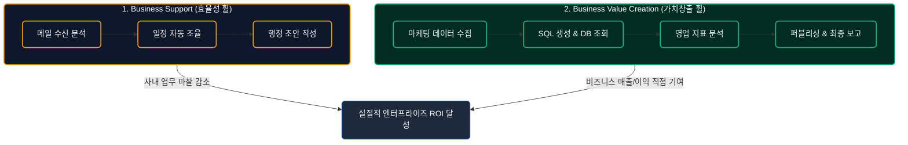
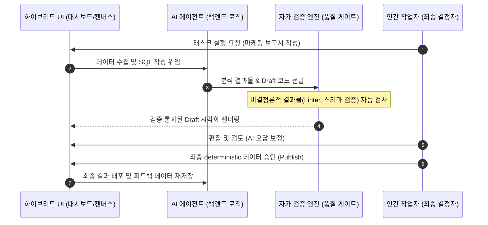

# 엔터프라이즈 생성형 AI 시장의 실질 ROI 영역과 전통 SI 기업의 고도화 전략

## 1. 들어가며: 생성형 AI의 '환멸의 골짜기'와 엔터프라이즈의 ROI 딜레마

현재 글로벌 생성형 AI(Generative AI) 시장은 대규모 자본 지출(CapEx) 대비 비즈니스 매출 창출 간의 극심한 불균형으로 인해 일어나는 **'수익성 결여(The Profit Problem)'** 현상에 직면해 있습니다. 세쿼이아 캐피탈(Sequoia Capital)의 분석에 따르면, 하이퍼스케일러들의 막대한 AI 인프라 투자 회수를 위해 매년 요구되는 매출액은 약 **6,000억 달러($600B)**에 이르나, 실제 최종 사용자 소프트웨어 시장의 연간 총 매출은 수백억 달러 수준에 그쳐 약 **5,000억 달러 이상의 매출 공백(Revenue Gap)**이 발생하고 있습니다.

이로 인해 가트너(Gartner)는 생성형 AI가 본격적인 **'환멸의 골짜기(Trough of Disillusionment)'**에 진입했다고 선언하였으며, 엔터프라이즈 생성형 AI 프로젝트의 **30% 이상이 데이터 품질 미달, 비용 급증, 불명확한 비즈니스 가치(ROI)로 인해 PoC(Proof of Concept) 단계에서 폐기**될 것으로 전망했습니다.

기존의 기업형 AI 프로젝트가 겪은 가장 큰 한계(AS-IS)와 앞으로 지향해야 할 방향성(TO-BE)은 다음과 같습니다.

*   **기존 접근법의 한계 (AS-IS)**: 범용 API 래퍼(Thin Wrapper) 형태의 단순 대화형 챗봇(Chatbot) 구축에 집중했습니다. 이는 텍스트 재작성이나 요약 등 피상적 업무 보조에 그쳤으며, 실제 비비정형 데이터의 검증과 디버깅에 실무자의 시간이 더 소모(실무자 40%가 "시간 단축 체감 없음" 보고)되어 명확한 재무적 ROI를 입증하지 못했습니다.
*   **새로운 아키텍처 지향점 (TO-BE)**: 단일 챗 인터페이스에서 탈피하여, 사내 데이터와 밀접하게 연동되는 백엔드 AI 에이전트(AI Agents)에 업무 로직을 위임하고, 사용자는 대시보드나 캔버스와 같은 하이브리드 UI를 통해 이를 통제·조율하는 **'워크플로우 중심의 커스터마이징 AI 플랫폼'**으로 진화해야 합니다.

---

## 2. 핵심 아키텍처 및 원리 심층 분석

### 2.1 생성형 AI 비즈니스의 '두 바퀴' 모델

기업 내에서 실질적인 재무적 가치를 이끌어내기 위해 생성형 AI 플랫폼은 두 가지 비즈니스 휠(Wheel)로 정의되나, 일반 AI 솔루션 기업 및 SI 기업 관점에서 두 영역의 비즈니스 현실과 가치는 극명하게 나뉩니다.

1.  **비즈니스 지원 (Business Support - 효율성 휠) [시장 불투명 영역]**:
    *   **정의**: 이메일 수신 데이터 맥락 분석, 미팅 일정 자동 조율, 단순 양식 초안 작성 등 내부 행정 마찰을 해소하는 영역입니다.
    *   **비즈니스 제약**: Microsoft 365 Copilot, Google Workspace Gemini 등 하이퍼스케일러들이 자신들의 오피스 생태계에 기본 기능(네이티브 번들)으로 탑재하여 무료에 가깝게 공급하고 있습니다. 따라서 서드파티 솔루션 공급자가 독자적인 단가(Pricing)나 지불 용의성(Willingness to Pay)을 확보하기가 거의 불가능한 **레드오션/불투명 영역**입니다.
2.  **비즈니스 가치 창출 (Business Value Creation - 가치창출 휠) [핵심 ROI 기회 영역]**:
    *   **정의**: 마케팅 데이터 수집부터 타겟팅 SQL 자동 생성, 데이터 웨어하우스(DW) 조회 및 비즈니스 데이터 시각화, 인간 검증용 분석 드래프트 작성 및 최종 보고서 발행까지 이어지는 코어 비즈니스 워크플로우를 자동화하는 영역입니다.
    *   **비즈니스 가치**: 기업 고유의 폐쇄망 데이터(Proprietary Data)와 복잡한 현장 업무 로직(Ontology)이 결합해야만 동작하므로 빅테크가 범용 SaaS 형태로 침투할 수 없습니다. 고객사의 매출 및 원가 절감(Bottom-line)에 직접 기여하므로 예산 확보 및 높은 마진의 커스터마이징 SI 수주가 가능한 **실질적인 핵심 ROI 영역**입니다.

### 2.2 '비결정론적 AI 생성 -> 결정론적 인간 확정' 아키텍처

와튼 스쿨(Wharton School)의 실증 연구에 따르면, AI가 제안한 오답에 사용자가 무비판적으로 복종하는 **'인지적 굴복(Cognitive Surrender)'** 비율이 약 **80%**에 달하는 것으로 나타났습니다.
따라서 엔터프라이즈 환경에서 비결정론적(Probabilistic) 모델이 내놓은 결과를 검증 없는 자동 프로덕션에 즉시 투입하는 것은 치명적인 리스크를 가집니다. AI 플랫폼은 반드시 다음과 같이 사용자가 원시 생성을 확정하고 직접 편집할 수 있는 **Human-in-the-Loop(HITL)** 가드레일을 기본 아키텍처로 삼아야 합니다.

### 2.3 제네릭 SaaS vs SI형 Vertical AI 플랫폼 비교

| 비교 항목 | 제네릭 SaaS (Generic SaaS) | SI형 Vertical AI 플랫폼 (Vertical AI Platform) |
| :--- | :--- | :--- |
| **데이터 접근 범위** | 범용 크롤링 데이터 및 표준 API 제공 정보 | 고객사 사내 폐쇄망 데이터 (ERP, 레거시 DB, 온프레미스 로그) |
| **아키텍처 유연성** | 획일화된 Chat-centric UI 위주의 단일 인터페이스 | 대시보드, 캔버스, 슬라이더 등 업무 결합형 Hybrid UI/UX |
| **비즈니스 모델** | 사용자 인원당 월 구독제 (Per-Seat Pricing) | Private Offer 연계 라이선스 + 도메인 매핑/컨설팅 프로페셔널 서비스 |
| **인프라 비용 구조** | SaaS 제공업체가 API 및 추론 인프라 비용 부담 | 고객사 기존 클라우드 계약 예산(EDP/MACC) 차감 방식으로 오프셋 |
| **독점적 해자(Moat)** | 모델 성능 향상에 종속되어 기술 복제가 쉬움 | 도메인 온톨로지(Ontology) 매핑과 커스텀 데이터 파이프라인 선점 |

---

## 3. 실제 ROI가 검증된 3대 침투 시장 영역과 SI 실증 아키텍처

전통적인 시스템 통합(SI) 기업은 범용 버티컬 데이터 접근이라는 추상적인 구호에서 벗어나, 현재 엔터프라이즈 환경에서 지출이 보장되고 단기 재무 효과가 실증된 **3대 구체적 시장 영역**에 정밀 타격하여 솔루션을 공급해야 합니다.

### 3.1 [Target 1] SCM/ERP 통합 SQL-to-Dashboard (의사결정 비용 절감)
*   **비즈니스 페인포인트**: 기존 SAP, Oracle ERP, 자체 WMS(창고관리시스템)의 수천 개 관계형 DB 테이블 스키마는 일반 현업 담당자가 직접 조회하기 불가능합니다. 사내 데이터 분석가(DA)에게 요청하여 SQL을 받고 시각화 리포트를 받기까지 평균 3~5일이 소요되며, 이는 적시 발주 실패 및 오배송/재고 적체 비용으로 직결됩니다.
*   **SI 솔루션 아키텍처**: 
    1. FDE(전방 배치 엔지니어)가 현장에 투입되어 레거시 ERP의 ERD를 분석하고, 테이블 간 조인 관계를 **비즈니스 온톨로지(Dictionary)**로 매핑합니다.
    2. 현업 사용자가 하이브리드 UI에 자연어로 질의합니다. (예: "지난달 인천 창고 A급 자재 중 회전율이 20% 이하인 품목과 재고액을 보여줘.")
    3. sLLM + 도메인 RAG(스키마 사전) 기반 엔진이 검증된 SQL을 자동 생성하여 DW(BigQuery/Snowflake)에 쿼리를 전송하고, 차트로 즉시 렌더링합니다.
*   **실질 재무 ROI**: 리드타임 단축(5일 -> 3분)을 통해 불용 재고 감가상각 비용을 연간 15~20% 직접 감축합니다.

### 3.2 [Target 2] AI-SDLC 성숙도 컨설팅 및 하네스 아티팩트 결합형 CI/CD 검증 플랫폼 (DevOps 성공 공식의 이식)
*   **비즈니스 페인포인트**: 기업들이 AI 코딩 비서(Cursor 등)를 개별 도입했으나, ① 실질적인 생산성 향상률을 측정할 KPI가 없고, ② 사내 보안 규정 위반 리스크가 존재하며, ③ 무엇보다 기존 깃랩/깃허브의 AI 기능은 범용 보안 점검만 수행할 뿐, **사내 고유의 설계 가이드라인, 아키텍처 표준, API 명세 준수 여부를 검증하지 못해 결국 시니어 엔지니어가 수작업으로 이를 일일이 다 뜯어고치는 리뷰 병목**이 그대로 유지됩니다.
*   **SI 솔루션 아키텍처 (2단계 수주 전략)**:
    1.  **Phase 1 (컨설팅)**: 고객사의 개발 프로세스 전반을 진단하여 AI 개발 성숙도 모델(AI-SDLC Maturity Model)을 평가하고, DORA 지표 기반의 AI 기여도 측정 프레임워크와 사내 AI 보안/코드 리뷰 거버넌스 가이드를 수립합니다.
    2.  **Phase 2 (하네스 아티팩트 기반 AI CI/CD 통합 구축)**:
        *   **하네스 엔지니어링 아티팩트(Harness Artifact) 중앙화**: 사내 표준 API 규격(OpenAPI Spec), 프레임워크 가이드, 아키텍처 규칙 등을 정형화된 아티팩트로 관리합니다.
        *   **AI 하네스 평가기(Harness Evaluator) CI/CD 연동**: 개발자가 PR(Pull Request)/MR(Merge Request)을 등록하는 시점에 작동하는 AI 검증 파이프라인을 구축합니다. 이 AI는 기존 Jenkins/GitLab CI/GitHub Actions에 트리거되어, 변경된 소스코드를 읽고 중앙의 하네스 아티팩트(규칙/명세)와 실시간 비교합니다.
        *   **정밀 퀄리티 게이트(Quality Gate)**: "새로 작성된 API 코드가 사내 표준 OpenAPI 정의 양식을 어겼거나 공통 인증/인가 모듈 표준을 미적용했음"을 AI가 구체적인 피드백과 함께 빌드를 반려하거나 개선 사항을 코멘트로 제안하여 **인간 시니어 엔지니어의 리뷰 부하를 80% 이상 혁신**합니다.
        *   **보안 프록시 게이트웨이**: 소스코드 외부 반출 시 실시간 난독화 및 토큰 거버넌스를 제어합니다.
*   **실질 재무 ROI**: 시니어 개발자의 코드 리뷰 리소스를 80% 이상 직접 절감하여 개발 프로세스 병목을 완전히 제거하고, 전사 생산성을 평균 35% 향상시킵니다. 컨설팅 단계부터 대규모 하네스 연동 플랫폼 구축으로 이어지는 대형 SI 딜(Deal)을 수주합니다.

### 3.3 [Target 3] 백엔드 API 연동형 Agentic CS (상담사 탐색 비용 0원화)
*   **비즈니스 페인포인트**: 단순 Q&A형 RAG 챗봇은 복잡한 고객 불만을 전혀 해결하지 못해 콜센터 인건비를 낮추지 못하고 고객 불만만 가중시킵니다.
*   **SI 솔루션 아키텍처**:
    1. 단순 텍스트 답변이 아닌, 사내 백엔드 시스템(API) 및 외부 택배사 연동을 통해 **행동(Action)을 트리거할 수 있는 에이전트**를 설계합니다.
    2. 고객의 불만 접수 시 에이전트가 데이터베이스에서 주문/배송 상태를 추적하고, 환불 규정 엔진(Policy Engine)을 통해 환불 적합 여부를 자율 판단합니다.
    3. 최종 단계에서 인간 상담원이 판단 결과와 환불 처리 버튼이 매핑된 UI를 확인하고 '승인' 버튼만 누르면(Human-in-the-Loop) 시스템이 자동 환불 API를 실행합니다.
*   **실질 재무 ROI**: 상담사 1인당 일평균 처리 건수를 30% 이상 향상시키고, 평균 처리 시간(AHT)을 45% 단축하여 콜센터 위탁 및 직영 인건비를 직접 절감합니다.

### 3.4 판매 및 재무 전략: Cloud Marketplace ISV (Private Offer) 연계
*   **비즈니스 딜레마**: AI 구축은 높은 GPU 인프라 투자비가 소요되므로 고객사 IT 부서의 신규 예산 승인이 어렵습니다.
*   **해결 방안 (SI 우회 전략)**:
    *   전통 SI 기업은 솔루션을 마켓플레이스 ISV(Independent Software Vendor)로 등록합니다.
    *   고객사가 이미 보유 중인 클라우드 약정 예산(AWS EDP, Azure MACC)을 차감하는 **Private Offer** 계약을 체결하여, 신규 예산 승인 없이 고객사의 기존 클라우드 크레딧으로 SI 구축 비용과 엔진 라이선스를 오프셋(Offset)시킵니다.

### 3.5 SI 기업의 고객 발굴(Go-To-Market) 및 가치 제안(Value Proposition) 프레임워크
*   **고객사 발굴 및 딜(Deal) 창출 경로 (GTM)**:
    1.  **AI 개발 보안 및 비용 낭비 무상 진단 (1-Week Consulting)**:
        *   고객사의 IT 기획부서 및 CISO를 타겟으로 접근하여 "귀사의 개발자들이 개인적으로 사용 중인 AI 툴로 인한 코드 유출 위험도와 불필요한 토큰 소비 현황을 일주일간 무상 진단해 드리겠습니다"라고 제안합니다.
        *   진단 결과를 토대로 보안 취약점 보고서 및 비용 낭비 리포트를 제공하며, 자연스럽게 전사 표준 가드레일 및 플랫폼 구축의 필요성을 환기시켜 SI 딜을 유도합니다.
    2.  **Palantir식 AIP 부트캠프 실행 (3-Day 실증)**:
        *   수개월이 걸리는 PoC 대신 고객사 개발진 3~5명을 대상으로 "단 3일간 우리 보안 프록시와 사내 RAG를 얹은 코딩 환경을 적용하고 생산성이 30% 향상되는 것을 눈앞에서 입증"하는 실시간 빌드 부트캠프를 가동하여 수주 의사결정 속도를 단축합니다.
*   **의사결정권자(C-Level) 대상 비즈니스 가치 제안 (What to Sell)**:
    *   **CISO/CIO (보안 및 컴플라이언스)**:
        *   "임직원이 세계 최고 성능의 SOTA 모델(Claude 3.5, GPT-4o 등)을 활용해 개발할 수 있도록 허용하면서도, 사내 핵심 지적재산권(IP), API Key, 개인정보가 밖으로 새 나가지 않는 **완벽한 컴플라이언스 가드레일**을 제공합니다."
    *   **CTO (개발 생산성 및 TCO 통제)**:
        *   "사내 RAG와 기존 CI/CD 파이프라인에 AI 자동리뷰(Quality Gate)를 결합하여 개발 생산성을 **정량적으로 35% 이상 향상**시키며, 무분별한 에러 반복 호출(82%의 낭비 토큰)을 제어하여 **AI 인프라 사용 비용(TCO)을 40% 이상 통제**합니다."
    *   **CFO (용역 원가 절감 및 자본 효율성)**:
        *   "무상 진단 시 수립된 DORA 지표를 바탕으로 정량적 비용 절감을 매월 증명하며, 대규모 GPU 구매(CapEx) 없이 기존 클라우드 마켓플레이스 약정 예산(EDP/MACC)을 활용해 비용을 차감(Offset)하므로 **회사의 자본 효율성을 극대화**합니다."

## 4. 결론 및 실무 권고사항 (Key Takeaways)

전통적인 SI 기업에게 엔터프라이즈 생성형 AI 시장은 단순한 기술 유행을 넘어, **데이터 주권 및 비즈니스 프로세스 커스터마이징을 통해 지속적인 가치를 창출할 수 있는 제2의 부흥기**가 될 수 있습니다. 엔터프라이즈 AI는 구조적으로 범용 SaaS 모델이 안착하기 힘든 'Vertical SI/Construction' 성격을 가지기 때문입니다.

이를 실현하기 위한 실무 권고사항은 다음과 같습니다.

1.  **마켓플레이스 ISV 파이프라인 신속 확보**: 주요 퍼블릭 클라우드 마켓플레이스에 자사 플랫폼을 즉시 등록하여, 고객사의 EDP/MACC 예산 범위 내로 세일즈 프로세스를 밀어 넣는 인프라를 구축하십시오.
2.  **FDE(전방 배치 엔지니어) 조직 전략 기동**: 기존 솔루션 아키텍트 직군을 FDE로 재배치하여, 단순 모델 호출을 넘어 고객사의 내부 레거시 시스템 온톨로지를 직접 설계하고 파이프라인을 구축해주는 능력을 핵심 경쟁력화해야 합니다.
3.  **Human-in-the-Loop 중심의 UI/UX 설계 기본화**: 실무자가 오답에 무비판적으로 복종하는 리스크를 방지하기 위해, 백엔드 AI 에이전트의 수행 상태와 초안 데이터를 투명하게 캔버스에 렌더링하고, 사용자의 편집·승인 없이는 최종 처리가 불가능한 결정론적 게이트를 플랫폼 아키텍처에 내재화하십시오.
