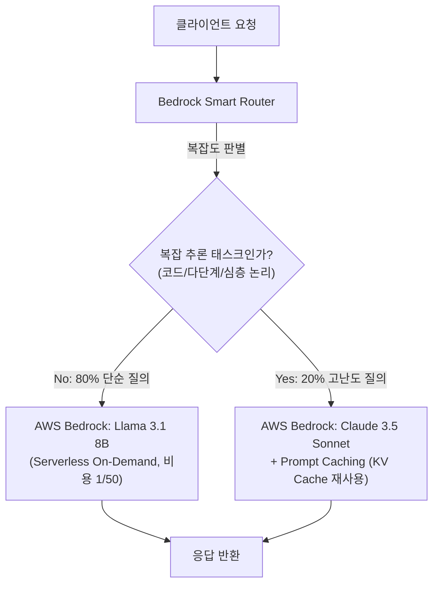
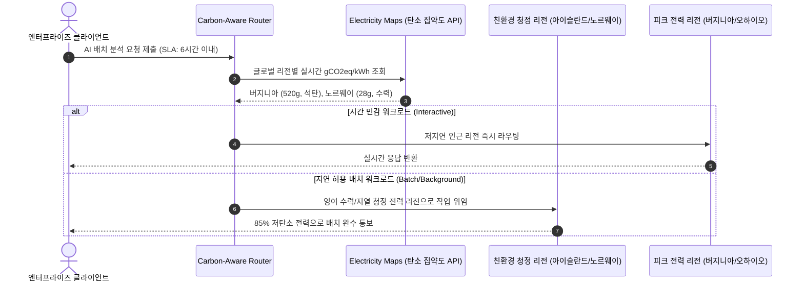

# AI 산업의 불편한 진실: Part 2 - 물리적 인프라의 벽과 데이터센터 전력·수자원 위기, 그리고 엔터프라이즈 그린 AI 전략

## 1. 들어가며: 가상 알고리즘과 물리 세계의 충돌

생성형 AI 생태계의 논의는 주로 파라미터 수, 벤치마크 점수, 알고리즘 아키텍처와 같은 가상 세계의 혁신에 집중되어 왔습니다. 그러나 거대언어모델(LLM)을 학습시키고 실시간으로 서빙하는 기저에는 수만 개의 가속 칩셋, 메가와트(MW)급 전력 인입선, 초당 수천 리터의 냉각수가 순환하는 **거대한 물리적 인프라의 실체**가 존재합니다.

알베르토 로메로(Alberto Romero)의 실증 분석에서 제시된 **Chart 7**은 AI 산업이 직면한 가장 현실적이고 치명적인 장벽이 소프트웨어 알고리즘이 아닌 물리 세계의 수용성과 자원 한계임을 명확히 보여줍니다.

### 미국 성인 71%의 데이터센터 신설 반대와 님비(NIMBY)의 현실화

글로벌 여론조사 기관 갤럽(Gallup)이 2026년 5월 발표한 미국 성인 실증 여론조사([Americans Oppose AI Data Centers in Their Area](https://news.gallup.com/poll/709772/americans-oppose-data-centers-area.aspx), Jeffrey M. Jones)에 따르면, 응답자의 **71%가 자신이 거주하는 지역 인근에 AI 데이터센터가 들어서는 것에 반대**하는 것으로 나타났습니다. 특히 이 중 **48%는 단순 우려를 넘어선 '강력한 반대(Strongly Oppose)'**를 표명했으며, 찬성 의견은 27%(적극 찬성은 7%)에 불과했습니다.

주목할 점은 이 반대 강도가 대표적 기피 혐오 시설인 **원자력 발전소 건설 반대율(53%)보다 무려 18%p나 더 높다**는 사실입니다. AI 인프라가 단순한 기술 설비를 넘어 지역 주민들에게 가장 심각한 환경·인프라 위협 요인으로 인식되고 있음을 보여줍니다.

<!-- Gallup 여론조사 핵심 지표 HTML/CSS 시각화 카드 -->
<div style="background: linear-gradient(135deg, rgba(15, 22, 38, 0.95), rgba(23, 32, 51, 0.95)); border: 1px solid var(--color-border-subtle); border-radius: 14px; padding: 24px; margin: 24px 0; box-shadow: 0 10px 25px -5px rgba(0, 0, 0, 0.3);">
  <div style="display: flex; justify-content: space-between; align-items: center; border-bottom: 1px solid rgba(255, 255, 255, 0.1); padding-bottom: 14px; margin-bottom: 20px;">
    <div>
      <span style="font-size: 11px; font-weight: 700; color: var(--color-primary-hover); text-transform: uppercase; letter-spacing: 1px;">Gallup Empirical Poll Analysis</span>
      <h4 style="margin: 4px 0 0 0; font-size: 16px; font-weight: 700; color: #f8fafc;">지역 내 AI 데이터센터 건설 수용성 조사 (N=1,024)</h4>
    </div>
    <span style="font-size: 12px; color: #94a3b8; background: rgba(255,255,255,0.05); padding: 4px 10px; border-radius: 6px;">2026.05 Gallup</span>
  </div>

  <!-- 1. 기피 시설 수용성 비교 바 -->
  <div style="margin-bottom: 24px;">
    <div style="font-size: 13px; font-weight: 600; color: #cbd5e1; margin-bottom: 12px;">지역 내 신규 인프라 건설 반대율 비교</div>
    
    <!-- AI 데이터센터 바 -->
    <div style="margin-bottom: 10px;">
      <div style="display: flex; justify-content: space-between; font-size: 12px; margin-bottom: 4px;">
        <span style="color: #f8fafc; font-weight: 600;">AI 데이터센터 (AI Data Centers)</span>
        <span style="color: #f87171; font-weight: 700;">71% 반대 (강력 반대 48%)</span>
      </div>
      <div style="width: 100%; height: 10px; background: rgba(255, 255, 255, 0.08); border-radius: 5px; overflow: hidden; display: flex;">
        <div style="width: 48%; background: #ef4444;" title="강력 반대 48%"></div>
        <div style="width: 23%; background: #f97316;" title="단순 반대 23%"></div>
      </div>
    </div>

    <!-- 원자력 발전소 바 -->
    <div>
      <div style="display: flex; justify-content: space-between; font-size: 12px; margin-bottom: 4px;">
        <span style="color: #94a3b8;">원자력 발전소 (Nuclear Power Plants)</span>
        <span style="color: #fbbf24; font-weight: 700;">53% 반대</span>
      </div>
      <div style="width: 100%; height: 10px; background: rgba(255, 255, 255, 0.08); border-radius: 5px; overflow: hidden;">
        <div style="width: 53%; height: 100%; background: #eab308;" title="반대 53%"></div>
      </div>
    </div>
  </div>

  <!-- 2. 핵심 반대 사유 5대 지표 그리드 -->
  <div style="font-size: 13px; font-weight: 600; color: #cbd5e1; margin-bottom: 10px;">주민들이 데이터센터 신설을 반대하는 5대 핵심 사유</div>
  <div style="display: grid; grid-template-columns: repeat(auto-fit, minmax(130px, 1fr)); gap: 10px; margin-bottom: 20px;">
    <div style="background: rgba(239, 68, 68, 0.1); border: 1px solid rgba(239, 68, 68, 0.25); border-radius: 8px; padding: 12px; text-align: center;">
      <div style="font-size: 22px; font-weight: 800; color: #f87171;">50%</div>
      <div style="font-size: 11px; color: #e2e8f0; margin-top: 2px;">전력·수자원 고갈</div>
    </div>
    <div style="background: rgba(249, 115, 22, 0.1); border: 1px solid rgba(249, 115, 22, 0.25); border-radius: 8px; padding: 12px; text-align: center;">
      <div style="font-size: 22px; font-weight: 800; color: #fb923c;">22%</div>
      <div style="font-size: 11px; color: #e2e8f0; margin-top: 2px;">소음·교통·주거 침해</div>
    </div>
    <div style="background: rgba(234, 179, 8, 0.1); border: 1px solid rgba(234, 179, 8, 0.25); border-radius: 8px; padding: 12px; text-align: center;">
      <div style="font-size: 22px; font-weight: 800; color: #facc15;">20%</div>
      <div style="font-size: 11px; color: #e2e8f0; margin-top: 2px;">전기요금 인상 전가</div>
    </div>
    <div style="background: rgba(148, 163, 184, 0.1); border: 1px solid rgba(148, 163, 184, 0.25); border-radius: 8px; padding: 12px; text-align: center;">
      <div style="font-size: 22px; font-weight: 800; color: #cbd5e1;">16%</div>
      <div style="font-size: 11px; color: #e2e8f0; margin-top: 2px;">환경 오염·발열</div>
    </div>
    <div style="background: rgba(148, 163, 184, 0.1); border: 1px solid rgba(148, 163, 184, 0.25); border-radius: 8px; padding: 12px; text-align: center;">
      <div style="font-size: 22px; font-weight: 800; color: #94a3b8;">14%</div>
      <div style="font-size: 11px; color: #e2e8f0; margin-top: 2px;">AI 기술 부정적 시각</div>
    </div>
  </div>

  <!-- 3. 정치 성향 및 인구통계 분포 칩 -->
  <div style="padding-top: 14px; border-top: 1px solid rgba(255, 255, 255, 0.08); display: flex; flex-wrap: wrap; gap: 8px; font-size: 11px; color: #94a3b8;">
    <span style="background: rgba(59, 130, 246, 0.15); color: #93c5fd; padding: 4px 8px; border-radius: 4px; border: 1px solid rgba(59, 130, 246, 0.3);">민주당 지지층: 강력 반대 56%</span>
    <span style="background: rgba(168, 85, 247, 0.15); color: #d8b4fe; padding: 4px 8px; border-radius: 4px; border: 1px solid rgba(168, 85, 247, 0.3);">무당층: 강력 반대 48%</span>
    <span style="background: rgba(239, 68, 68, 0.15); color: #fca5a5; padding: 4px 8px; border-radius: 4px; border: 1px solid rgba(239, 68, 68, 0.3);">공화당 지지층: 강력 반대 39%</span>
    <span style="background: rgba(20, 184, 166, 0.15); color: #5eead4; padding: 4px 8px; border-radius: 4px; border: 1px solid rgba(20, 184, 166, 0.3);">여성(55%) vs 남성(43%) 강력 반대</span>
  </div>
</div>

전통적인 클라우드 데이터센터가 조용한 서버실과 미미한 교통 유발로 비교적 무난하게 지역 사회에 안착했던 것과 달리, 차세대 AI 데이터센터는 지역 주민들의 일상 환경과 직결된 생존 문제를 촉발하고 있습니다:

* **막대한 자원(전력·수자원) 독점 (반대 사유 50%)**: 기가와트(GW)급 전력 인입과 일일 수백만 갤런의 증발 냉각수 소모로 인해 지역의 기반 시설이 마비될 것이라는 공포가 가장 큽니다.
* **냉각 설비의 24/7 저주파 소음 및 주거 환경 침해 (반대 사유 22%)**: 고집적 GPU 랙의 열을 배출하기 위한 대형 칠러(Chiller)와 냉각탑 팬에서 발생하는 지속적인 저주파 소음 및 대형 트럭 왕래가 주거 안정을 침해합니다.
* **가계 전기요금 인상 전가 불안 (반대 사유 20%)**: 전력회사가 데이터센터 전력망 증설에 투입한 천문학적 자본 비용(CapEx)을 일반 가정용 요금 인상으로 전가할 것이라는 우려가 팽배합니다.

```mermaid
graph TD
    A["초대형 AI 클러스터 증설 요구<br/>(수만 개 고성능 GPU 집적)"] --> B["고밀도 전력망 과부하<br/>(단일 캠퍼스당 100MW~1GW 소모)"]
    A --> C["막대한 수자원 소비<br/>(증발 냉각수 일일 수백만 갤런)"]
    A --> D["고출력 칠러 팬의 24/7 저주파 소음"]
    
    B --> E["지역 사회 반발 (미국 성인 71% 반대)"]
    C --> E
    D --> E
    
    E --> F["지방자치단체 인허가 중단 & 송전선로 환경 규제"]
    F --> G["인프라 증설 지연 및 상면·전력비 인플레이션"]
    G --> H["최종 추론/학습 API 원가 하락 정체 (엔터프라이즈 TCO 전가)"]

    classDef danger fill:#451a03,stroke:#ef4444,stroke-width:2px,color:#f8fafc,rx:6px;
    classDef warning fill:#334155,stroke:#f59e0b,stroke-width:2px,color:#f8fafc,rx:6px;
    classDef impact fill:#1e293b,stroke:#3b82f6,stroke-width:2px,color:#f8fafc,rx:6px;

    class A impact;
    class B,C,D warning;
    class E,F danger;
    class G,H impact;
```



세계 최대 데이터센터 집적지인 미국 버지니아주 북부의 이른바 '데이터센터 앨리(Data Center Alley)'에서는 이미 신규 고압 송전선로 건설을 둘러싸고 주정부, 전력회사(Dominion Energy), 거주민 연합 간의 극심한 법적 분쟁과 승인 지연이 잇따르고 있습니다. 가상의 지능을 확장하기 위한 물리적 터전이 한계에 부딪힌 것입니다.

---

## 2. 핵심 아키텍처 및 원리 심층 분석: 물리 인프라의 3대 병목

### 1) 전력망 포화와 계통 연계 대기열(Interconnection Queue)의 병목

현대 AI 데이터센터가 요구하는 전력 밀도는 과거 엔터프라이즈 클라우드 인프라와 질적으로 다릅니다. 일반적인 범용 서버 랙이 랙당 5~10kW 수준의 전력을 소비하는 반면, 최신 엔비디아 NVL72 또는 차세대 가속기 랙은 **랙당 100kW~130kW 이상의 초고밀도 전력**을 요구합니다.

이로 인해 10만 장 이상의 GPU를 단일 클러스터로 묶는 기가와트(GW)급 데이터센터 프로젝트가 추진되고 있으며, 이는 원자력 발전소 1기의 전체 발전량(약 1,000MW)에 맞먹는 규모입니다.

국제에너지기구(IEA)와 미국 연방에너지규제위원회(FERC)의 데이터에 따르면 다음과 같은 구조적 병목이 현실화되었습니다:
* **계통 연계 대기 시간(Interconnection Queue)**: 데이터센터 부지를 확보하더라도 전력망(Grid)에 직접 인입하여 송전을 받기까지의 승인 및 인프라 구축 기간이 미국 주요 전력망(PJM, ERCOT, CAISO) 기준으로 **평균 5~7년까지 지연**되고 있습니다.
* **변압기 및 고압 설비 공급난**: 대용량 초고압 변압기(Large Power Transformers)의 글로벌 리드타임이 기존 1~2년에서 **3~4년 이상으로 폭증**하여 하드웨어 GPU를 구매하고도 전기를 넣지 못하는 '연산 유휴 사태'가 빈번하게 발생합니다.

### 2) 수자원 증발과 냉각 인프라의 한계

전력 소비의 약 30~40%는 컴퓨팅 연산 자체가 아니라 칩셋에서 발생하는 막대한 열을 외부로 식히는 냉각 계통에서 발생합니다. 

기존의 전통적인 공랭식(Air Cooling) 시스템은 공기의 열용량 한계로 인해 랙당 30kW를 초과하는 고집적 AI 서버를 냉각할 수 없습니다. 따라서 산업계는 칩 표면에 냉각수를 직접 순환시키는 **직접 칩 냉각(Direct-to-Chip Liquid Cooling)** 및 증발식 냉각탑으로 전환하고 있습니다.

* **수자원 소비 지표(WUE, Water Usage Effectiveness)**: 대규모 하이퍼스케일러 데이터센터 1개소는 하루 평균 **300만~500만 갤런(약 1,100만~1,900만 리터)**의 냉각수를 증발 소모하며, 이는 인구 3만~5만 명 규모의 중소도시 전체가 하루에 소비하는 생활용수량과 맞먹습니다.
* **기후 리스크와의 상충**: 데이터센터가 주로 입지하는 지역이 전력망 접근성과 부지가 확보된 건조 지역(미국 애리조나, 텍사스, 유타 등)에 집중되면서, 지역 가뭄을 악화시키고 지하수위를 급격히 고갈시키는 사회적 마찰을 낳고 있습니다.

### 3) 빅테크의 에너지 전쟁: 원전·SMR 확보와 넷제로의 역설

전력망 확충이 5년 이상 지연되자 마이크로소프트, 아마존, 구글 등 하이퍼스케일러들은 공공 전력망을 우회하여 발전원과 직접 계약을 맺는 '원자력 및 청정에너지 직접 PPA' 경쟁에 돌입했습니다.

* **마이크로소프트**: 1979년 노심용융 사고를 겪었던 미국 펜실베이니아주 쓰리마일 섬(Three Mile Island) 원자력 발전소 1호기를 2028년까지 재가동하여 **향후 20년간 835MW의 전력을 전량 독점 구매하는 역사적 계약(PPA)**을 체결했습니다.
* **아마존(AWS)**: 펜실베이니아주 서스퀘하나(Susquehanna) 원전 바로 옆 탈렌 에너지(Talen Energy)의 960MW 캠퍼스를 6억 5,000만 달러에 인수했으나, 미 연방에너지규제위원회(FERC)가 계통 안정성을 이유로 직결 수전 증설(480MW) 연계 계약(ISA)을 기각하는 등 규제 리스크에 직면했습니다.
* **구글**: 차세대 소형 모듈 원자로(SMR) 개발사인 카이로스 파워(Kairos Power)와 손잡고 총 500MW 규모의 SMR 6~7기를 2030년부터 공급받는 선도 구매 계약을 맺었습니다.

#### 친환경 공약(Net Zero)과의 정면 충돌
빅테크들은 "원자력과 재생에너지를 통한 무탄소 24/7 전력"을 표방하고 있으나, 원전 재가동과 SMR 상용화는 2028~2035년 이후에나 가동될 장기 프로젝트입니다. 당장 폭증하는 AI 추론/학습 수요를 메우기 위해 버지니아와 텍사스 등지에서는 **폐쇄 예정이던 노후 석탄 및 천연가스 화력 발전소의 가동 수명을 연장**하고 있습니다.

그 결과 마이크로소프트, 구글, 메타의 공식 지속가능성 보고서에 따르면 2020년 대비 스코프 1·2·3 온실가스 배출량은 오히려 30~50% 이상 급증하여, 기업 스스로 선언했던 '2030 탄소 중립(Carbon Neutral)' 및 '탄소 네거티브' 공약이 물리적 한계 앞에서 무력화되는 모순을 겪고 있습니다.

---

### 4) 글로벌 로컬라이제이션: 대한민국의 데이터센터 병목과 '154kV 특고압선' 갈등

대한민국의 데이터센터 생태계는 좁은 국토 면적, 고밀도 아파트 주거 문화, 단일 국유 전력망(한국전력) 구조로 인해 미국보다 훨씬 더 첨예한 사회적·물리적 충돌을 겪고 있습니다.

#### ① 수도권 70% 집중과 한전의 '전력 공급 거부권' 행사
국내 운영 및 추진 중인 데이터센터의 **약 70% 이상이 서울·경기·인천 등 수도권에 기형적으로 편중**되어 있습니다. 
* **전기사업법 시행령 개정 (계통 포화 대응)**: 수도권 변전소 용량이 한계에 도달하자, 정부는 2023년 전기사업법 시행령을 개정하여 **한국전력이 대규모 데이터센터의 계통 연계 요청을 거부할 수 있는 법적 권한**을 부여했습니다.
* **신규 인허가 중단**: 실제로 최근 2년간 수도권에서 추진되던 대형 데이터센터 프로젝트 상당수가 한전의 '전력 공급 불가(연계 지연)' 통보를 받으며 사업이 전면 보류되거나 무기한 지연되고 있습니다.

#### ② 한국형 주거지 인접 갈등: 154kV 초고압 지중선로와 전자파 논란
미국 데이터센터가 사막이나 외곽 농촌에 지어지는 것과 달리, 한국은 통신 지연(Latency) 단축을 위해 **대규모 아파트 단지와 초등학교 스쿨존 도로 지하에 154,000V(154kV) 초고압 송전 케이블을 매설**하는 무리한 입지를 선택하면서 주민들과 정면 충돌하고 있습니다.
* **실제 사업 취소 및 소송 사태**:
  * **경기 안양시 (호계동/평촌)**: 주거지 및 초등학교 인근 154kV 지중선 매설에 반발한 주민 수천 명이 대규모 집회를 열고 지자체를 상대로 건축허가 취소 소송 및 감사원 공익감사를 청구했습니다.
  * **경기 고양시 (일산 식사동/덕이동)**: 아파트 밀집지 인접 데이터센터에 대한 주민 결사반대로 지자체장이 **건축허가 직권 취소를 법률 검토하고 착공신고를 반려**하는 사태가 발생했습니다(이후 행정심판·소송 비화).
  * **경기 김포(구래동), 용인(죽전)**: 냉각탑 저주파 소음, 수증기(백연) 배출에 따른 일조권 침해, 아파트 자산 가치 하락 우려로 지자체와 시행사 간의 행정소송전이 장기화되고 있습니다.

#### ③ '데이터 중력(Data Gravity)'의 덫과 지방 이전의 구조적 딜레마
정부는 2024년 6월 **'분산에너지 활성화 특별법(분산에너지법)'**을 시행하여 수도권 데이터센터 진입을 억제하고 강원(수열에너지 클러스터), 전남 해남(솔라시도 태양광 DC) 등 비수도권 이전을 강력히 유도하고 있습니다. 그러나 정책적 압박에도 불구하고 IT 산업 현장이 지방 이전을 주저하는 근본 원인은 **'디지털 중력(Data Gravity)'과 '닭과 달걀의 악순환'**이라는 구조적 모순에 있습니다.

* **'데이터 중력(Data Gravity)'과 90% 수요 집중**: 물리학의 법칙처럼 "데이터와 서버는 트래픽과 사용자가 가장 많이 모여 있는 곳으로 끌려간다"는 원리입니다. 국내 이커머스, 핀테크, 게임, SaaS 스타트업, 대기업 본사의 85~90% 이상이 판교와 서울에 집중되어 있어, 서버를 지방에 둘 경우 서울의 대다수 사용자와 통신할 때마다 물리적 왕복 지연시간(RTT 8~10ms)이 발생하여 고객 접점 서비스의 경쟁력이 저하됩니다.
* **미국·유럽(다핵 구조) vs 한국(극단적 단핵 구조)**:

| 국가 및 권역 | 디지털 산업 및 거점 구조 | 데이터센터 입지 특성 |
| :--- | :--- | :--- |
| **미국** | **전국 분산형 다핵(Multi-Polar) 구조**<br/>(실리콘밸리, 시애틀, 텍사스, 버지니아, 시카고 등) | 각 거점마다 자체 테크 본사, 대학, 스타트업 생태계가 번성하여 전국 단위로 상호 완결적 데이터 수요가 고르게 분산됨. |
| **독일** | **기능 분산형 다핵 구조**<br/>(프랑크푸르트-금융, 뮌헨-제조IT, 베를린-스타트업) | 금융 트래픽 허브(프랑크푸르트)와 스마트 제조 데이터 거점이 전국에 기능별로 분산. |
| **한국** | **수도권 1극 집중 단핵(Mono-Centric) 구조**<br/>(IT 소프트웨어 매출의 85%+가 판교·서울) | 비수도권에는 테라바이트(TB)급 클라우드 트래픽을 대량으로 구매해 줄 **'자체 디지털 수요 시장'이 사실상 부재**. |

* **전통 제조업 vs 디지털 인프라의 결정적 차이**: 과거 철강(포항)이나 조선(울산·거제)은 항만과 넓은 부지만 있으면 원자재를 들여와 완성품을 수출하는 자체 완결적 생산이 가능했습니다. 반면 데이터센터는 공장과 달리 단독으로 가치를 만들지 못하며, **주변의 수많은 소프트웨어 개발사, 플랫폼 기업, IT 인재 풀과 초저지연망으로 실시간 결합되어야만 생존**할 수 있습니다.
* **지방 이전의 3대 물리적·인적 엔지니어링 장벽**:
  1. **고급 인프라 엔지니어의 지방 기피**: 24/7 무중단 장애 대응을 책임질 숙련된 DevOps/MLOps 인력이 수도권 이남 이주를 극도로 기피합니다.
  2. **금융·빅테크의 엄격한 저지연(Latency) 요구**: 서울 본사와 메인 트래픽 노드 간 1~2ms 이내의 초저지연 연결이 필수적입니다.
  3. **초고속 백본망(Dark Fiber) 인입 비용**: 전력이 있어도 테라비트(Tbps)급 광통신망을 지방 부지까지 신설·이중화하는 초기 토목비와 월 전용선료가 막대합니다.
* **닭과 달걀의 구조적 악순환**: "지방에 인터넷 기반 서비스와 시장이 없으니 데이터센터가 내려가지 못하고, 데이터센터와 초고속 통신망이 없으니 지방에 첨단 IT 기업이 들어서지 못하는" 교착 상태에 갇혀 있습니다.

#### ④ 주민 관점의 순손실 구조
한국 역시 데이터센터가 지역에 들어서도 **상주 고용 인원은 30~50명 수준**에 불과하며, 한전의 누적 부채로 산업용 전기료가 급등하는 상황에서 주민들에게 돌아오는 전기세 감면이나 폐열 공급 등의 혜택은 전무합니다. 즉, 미국과 마찬가지로 **'이익의 사유화, 위험과 피해(전자파·소음·집값 불안)의 지역화'**라는 모순이 한국형 님비 갈등의 근본 원인으로 작용하고 있습니다.

#### ⑤ 공급 중단이 낳은 '불가능의 3각 모순(Trilemma)'과 3대 현실적 돌파구
결과적으로 대한민국은 수도권과 비수도권 어디에도 데이터센터를 짓기 힘든 **'불가능의 3각 모순(The Impossible Trilemma)'**이라는 정책적·공학적 진퇴양난에 직면해 있습니다:

1. **수도권에 짓자니 (물리적 한계)**: 변전소 포화와 송전선로 부족으로 전력망 전체 붕괴(블랙아웃) 위험에 직면하여 물리적으로 불가능합니다.
2. **지방에 짓자니 (경제적 한계)**: 트래픽·고객사·인재의 90%가 수도권에 묶여 있는 '데이터 중력' 때문에 민간 비즈니스 채산성이 성립하지 않습니다.
3. **안 짓고 막자니 (국가적 한계)**: 공급을 틀어막으면 국가 전체의 AI 컴퓨팅 파워가 결핍되어 차세대 디지털 성장동력을 완전히 상실합니다.

##### [글로벌 실증 사례] 데이터센터 공급 차단이 초래한 뼈아픈 대가
* **아일랜드 4년 모라토리엄의 파국 (2021~2025)**: 더블린 전력망 포화로 신규 데이터센터 공급을 동결하자, 약 **65억 유로(한화 약 9조 5,000억 원)**의 해외 직접투자(FDI)가 증발하고 핀테크·제약 등 핵심 디지털 기업들이 인근 국가로 탈출(Exodus)했습니다. 결국 2025년 말 정부가 굴복하여 모라토리엄을 공식 철회했습니다.
* **싱가포르의 주도권 유출 (2019~2022)**: 3년간 데이터센터 신설을 중단했다가 아시아 디지털 허브 지위를 말레이시아(조호르)에 빼앗길 위기에 처하자, 엄격한 그린 기준(PUE 1.3)을 걸고 신설을 재개했습니다.
* **한국의 민간 투자·인재 지표 저조와 AI 가속기 결핍**: 영국 Tortoise 및 스탠퍼드 HAI 인덱스에 따르면 한국은 특허·통신망 인프라는 상위권이나 **민간 투자(12~17위)와 인재 지표가 10위권 밖으로 취약**하며, 수도권 규제에 따른 **초고성능 AI 가속기(GPU) 절대 보유량 부족**이 국가 AI 경쟁력의 최대 병목으로 지목되었습니다.

##### 공학적·정책적으로 유일하게 남은 3대 현실적 돌파구
단순히 "수도권은 전기가 없으니 안 되고, 지방으로 알아서 가라"는 식의 규제 일변도를 벗어나, 다음과 같은 구조적 해결책이 결합되어야만 이 교착 상태를 탈출할 수 있습니다:

1. **한전 전력망 비의존형 '도심 분산 자가발전(On-site Power) 데이터센터' 허용**:
   * 한전 계통 인입선이 포화되었다면, 데이터센터 부지 내에 **수소 연료전지(Fuel Cell)**나 **친환경 LNG 열병합 발전기(CHP)**를 직접 설치하여 자체 전력으로 가동하는 분산형 전원 모델을 제도적으로 전면 허용해야 합니다. (공공 전력망 부하 0 달성)
2. **'국가기간 전력망 확충 특별법'을 통한 국가적 돌파**:
   * 송전선로 건설을 한전과 지자체·주민 간의 사적 갈등으로 방치하지 않고, 정부가 직접 나서 파격적인 국가 보상과 전액 국비 지중화(지하 터널 매설)를 추진하여 동해안-수도권 전력 파이프라인을 국가 책임하에 최우선 완공해야 합니다.
3. **지방에 '전기'만 주지 말고 '수요 생태계'를 패키지로 이식**:
   * 기업에게 지방 이전을 떠넘기지 말고, 정부의 국가 AI 컴퓨팅 바우처 사업, 국책 연구기관 데이터 발주, 공공 클라우드 수요를 지방 거점으로 결합하고, **'파격적 법인세 감면 + 전기요금 30% 할인 + 초고속 통신 백본망(Dark Fiber) 무상 구축'**을 하나의 패키지로 제공하는 '국가 AI 특구'를 조성해야 합니다.

#### ⑥ 종합 진단: 자가발전의 현실적 벽과 한국 데이터 산업의 '기형적 흐림'

도심 데이터센터를 살리기 위한 '자가발전(On-site Power)' 역시 미국과 달리 대한민국에서는 즉각적인 마법의 은탄환이 되지 못하고 있습니다. 

* **자가발전의 3대 현실적 족쇄**:
  1. **수입 LNG 연료비의 만성 적자**: 미국은 셰일가스 자급으로 가스 발전 단가가 저렴하지만, 한국은 전량 수입 LNG에 의존하여 자가발전 단가(kWh당 220~280원)가 한전 산업용 전기요금(160~180원)보다 20~30% 비쌉니다. 40MW 센터를 100% 자가발전으로 돌릴 경우 연간 수백억 원의 연료비 적자가 발생합니다.
  2. **글로벌 고객사의 RE100 입주 거부**: 화석연료(도시가스)를 기반으로 전기를 자체 생산하면 대량의 이산화탄소(Scope 1)가 배출되므로, 애플·마이크로소프트·구글 등 RE100을 선언한 글로벌 하이퍼스케일러들이 입주를 거부합니다.
  3. **고압 가스 배관 매설의 또 다른 민원**: 40MW급 가스 연료를 공급하려면 대구경 고압 도시가스관을 도로에 매설해야 하는데, 송전탑 전자파 대신 '가스 폭발 위험'이라는 또 다른 주민 결사반대에 부딪힙니다.

##### 대한민국 데이터·AI 산업의 4대 계층별 명암 매트릭스

결국 대한민국 데이터 산업의 미래는 단일한 단어가 아니라, **컴퓨팅 인프라는 극도로 어둡고 반도체와 실리적 소프트웨어는 버텨내는 '기형적 흐림'** 상태로 진단할 수 있습니다:

| 산업 계층 (Layer) | 기상 진단 | 핵심 원인 및 구조적 현주소 |
| :--- | :---: | :--- |
| **1. 물리 인프라·호스팅** | **[매우 흐림]**<br/>(Dark Clouds) | 송전망 마비, 수도권 변전소 포화, 주민 갈등, 자가발전의 연료비 적자로 인해 국내 대규모 GPU 팜 증설이 원천 봉쇄됨. 글로벌 AI 인프라 순위 지속 하락. |
| **2. 국가 안보 & 소버린 AI** | **[비상 경고등]**<br/>(High Risk) | 국내 상면 부족으로 금융·공공·기업 데이터가 미국·일본 클라우드로 빠져나가며, 국가 핵심 자산의 **'디지털 식민지화(Digital Colonialism)'** 리스크 고조. |
| **3. 소프트웨어 & AI 응용** | **[실리적 적응]**<br/>(Partly Sunny) | 인프라 결핍이 역설적으로 **'인프라 다이어트(Green AI, 경량 sLLM, RAG, INT4 양자화)'** 기술을 고도화시킴. 제조·금융·조선 등 폐쇄망 버티컬 데이터 기반 AX 경쟁력 유지. |
| **4. 반도체 하드웨어 제조** | **[쾌청]**<br/>(Sunny) | 국내 인프라는 멈춰 있어도, 전 세계 모든 AI 데이터센터에 필수적인 **HBM(고대역폭 메모리)과 AI 반도체는 한국(SK하이닉스, 삼성전자)이 독점 공급**하는 기형적 호황. |

#### ⑦ [작성자 논평] '선언적 생색내기' 균형발전의 퇴장과 송전망 올인이라는 궁여지책

> **"지방 균형발전이라는 구호는 선거철의 '선언적 생색내기 정치'에 불과했으며, 데이터 중력과 표심의 현실 앞에서 결국 정부가 선택한 실질적 답안은 '지방 이전 포기'와 '천문학적 송전망을 통한 수도권 전력 수송'이라는 궁여지책이었습니다."**

대한민국 헌법과 역대 정부는 예외 없이 '국토 균형발전과 지방분권'을 핵심 국정과제로 내세워 왔습니다. 하지만 데이터센터와 AI 인프라 정책 현장에서 목격되는 실체는 정반대입니다.

1. **'선언적 생색내기'에 그친 지방 분권의 구조적 허구**:
   선거철마다 지방 표심을 의식해 균형발전을 약속하고, 수도권 전력 공급 거부권과 분산에너지법을 통해 데이터센터를 강원·호남으로 밀어내려 했으나 이는 시장의 현실을 외면한 탁상공론이었습니다. 90%의 고객사와 트래픽이 몰려 있는 '데이터 중력(Data Gravity)'과 지방 이주를 거부하는 고급 엔지니어 풀 앞에서는 어떠한 행정 명령도 작동하지 않았습니다. 실제로 기업을 움직일 수 있는 파격적 인센티브(전기요금 대폭 할인, 법인세 면제 등)는 수도권 유권자(인구 50% 과반)의 역차별 반발과 재정 한계에 가로막혀 단 한 번도 과감하게 실행되지 못했습니다.

2. **결국 선택한 현실적 타협, '송전망 건설 올인'**:
   기업을 지방으로 내보내는 정책이 공염불에 그치자, 정부가 내놓은 실질적 대안은 **"서버를 지방으로 못 보낸다면, 지방의 전기를 모조리 수도권으로 끌어올리겠다"**는 국가적 송전망 확충이었습니다. 2024~2025년 추진된 '국가기간 전력망 확충 특별법', 동해안-수도권 HVDC, 서해안 해저 초고압 직류송전선로 등 수십조 원의 국가 재정이 투입되는 사업들은 사실상 **'지방 디지털 분권의 이상론을 접고 수도권 중심 성장을 물리적으로 연명시키는 궁여지책'**입니다.

3. **밀양의 상처를 넘어선 또 다른 사회적 비용 청구**:
   결국 대한민국은 지방의 희생과 막대한 송전선로 매설 비용을 치르며 수도권 반도체·AI 클러스터에 피(전력)를 수혈하는 가장 값비싸고 지난한 길을 걷고 있습니다. "말로는 균형발전, 행동은 수도권 전력 수송"이라는 이 모순된 타협이야말로 대한민국 AI 생태계가 직면한 가장 냉혹한 자화상입니다.

> **핵심 요약**: 대한민국은 *"세계 최고의 AI 메모리 칩을 생산하고 수준 높은 개발자를 보유했으나, 정작 그 칩을 꽂아 돌릴 데이터센터와 전력망이라는 '물리적 영토'가 사회적 갈등과 제도적 병목에 갇혀 질식해 가는 기형적 생태계"*에 직면해 있습니다.

---

### 차세대 AI 데이터센터 vs 전통 클라우드 데이터센터 비교

| 아키텍처 비교 항목 | 전통 엔터프라이즈 클라우드 DC | 차세대 AI 가속 컴퓨팅 DC | 엔지니어링 임팩트 |
| :--- | :--- | :--- | :--- |
| **랙당 전력 밀도** | 5 ~ 15 kW / Rack | **40 ~ 130+ kW / Rack** | 배전반, PDU, Busway 전면 재설계 불가피 |
| **주요 냉각 기술** | 항온항습기 기반 공랭식 (CRAC/CRAH) | **직접 칩 수랭식 (Direct-to-Chip) / 침전 냉각** | 랙 단위 냉각수 분배 장치(CDU) 및 누수 감지 필수 |
| **전력 사용 효율 (PUE)** | 1.15 ~ 1.30 | **1.25 ~ 1.45 (실질 운용치)** | 냉각 펌프 및 고밀도 칠러 가동으로 효율 악화 방어 난제 |
| **수자원 사용 효율 (WUE)** | 0.5 ~ 1.0 L/kWh | **1.5 ~ 3.0+ L/kWh (증발탑 방식)** | 폐쇄 루프 드라이 쿨러(Dry Cooler) 전환 압박 |
| **인프라 조달 리드타임** | 1.5 ~ 2 년 | **4 ~ 7 년 (전력망 연계 병목)** | 온프레미스 GPU 클러스터 증설의 최우선 병목 |
| **사회적/규제 수용성** | 비교적 양호 (일반 상업 시설 수준) | **극심한 님비 (미국 성인 71% 반대)** | 소음 규제 조례 및 수자원 취수 허가 지연 빈번 |

---

## 3. 실전 구현 및 실증 시나리오: 엔터프라이즈 그린 AI 엔지니어링

빅테크의 물리적 인프라 확보 경쟁과 전력 인플레이션은 클라우드 GPU 인스턴스 단가 인상과 쿼터 제한이라는 형태로 기업에 전가됩니다. 그러나 모든 기업이 동일한 엔지니어링 레이어에서 그린 AI를 고민할 수는 없습니다:

* **일반 소프트웨어 기업 (SaaS, 커머스, 핀테크 등)**: 온프레미스 GPU 클러스터를 구축하고 vLLM 커널을 직접 튜닝하는 것은 극심한 오버엔지니어링입니다. 인프라 운영 오버헤드를 없애고 **AWS Bedrock / Google Vertex AI와 같은 완전관리형 서버리스 API 환경에서 지능형 라우팅과 프롬프트 캐싱을 통해 토큰과 비용을 90% 이상 절감하는 오케스트레이션**이 실질적인 그린 AI입니다.
* **인프라·플랫폼 기업 (CSP, MSP, 파운데이션 모델사)**: 대규모 물리 GPU 서버 팜을 직접 소유·운영하는 주체로서, 랙당 전력 Capping 방어와 Flops/Watt 극대화를 위한 **vLLM 기반 FP8/INT4 양자화 서빙 최적화**가 필수적입니다.

### 1) [일반 소프트웨어 기업] AWS Bedrock 기반 서버리스 하이브리드 라우터 & 프롬프트 캐싱

실무 소프트웨어 기업이 가장 큰 비용과 전력을 낭비하는 원인은 모든 요청(단순 분류, 포맷팅, 요약)을 무차별로 고비용·고전력 프론티어 모델(Claude 3.5 Sonnet, GPT-4o)로 날리는 관행에 있습니다.

AWS Bedrock 환경에서는 **80%의 단순 태스크는 초경량 서버리스 오픈소스 모델(Llama 3.1 8B)**로 처리하고, **20%의 복합 추론 태스크만 프론티어 모델(Claude 3.5 Sonnet)**로 승격하는 **시맨틱 라우터(Semantic Router)** 아키텍처를 구축함으로써 인프라 고정비 '0원'과 호출 비용 85% 이상 절감을 동시에 달성할 수 있습니다. 여기에 **Prompt Caching**을 결합하여 반복되는 시스템 프롬프트의 불필요한 GPU 어텐션 연산(FLOPs)을 원천 차단합니다.



다음은 AWS Bedrock SDK(`boto3`)를 기반으로 경량 작업과 복합 작업을 동적 라우팅하고 프롬프트 캐싱을 강제하는 프로덕션 레벨의 파이프라인 구현체입니다:

```python
# bedrock_smart_router.py
# AWS Bedrock 기반 서버리스 하이브리드 그린 AI 라우터 (Llama 3.1 8B + Claude 3.5 Sonnet)

import json
import boto3
from typing import Dict, Any

class BedrockSmartRouter:
    """
    일반 소프트웨어 기업을 위한 클라우드 네이티브 그린 AI 라우터:
    - 80% 단순 태스크: AWS Bedrock Llama 3.1 8B Serverless (비용/전력 95% 절감)
    - 20% 복합 추론: AWS Bedrock Claude 3.5 Sonnet (최고 수준 지능)
    - Prompt Caching: 시스템 프롬프트 GPU 재연산 원천 차단 (비용 90% 절감)
    """
    def __init__(self, region_name: str = "us-east-1"):
        self.client = boto3.client("bedrock-runtime", region_name=region_name)
        self.model_fast = "meta.llama3-1-8b-instruct-v1:0"
        self.model_frontier = "anthropic.claude-3-5-sonnet-20241022-v2:0"

    def is_complex_task(self, prompt: str) -> bool:
        """경량 분류 로직: 코드 작성, 시스템 아키텍처, 다단계 추론 키워드 탐지"""
        complex_triggers = ["refactor", "algorithm", "architecture", "debug", "증명", "설계", "최적화"]
        return any(trigger in prompt.lower() for trigger in complex_triggers) or len(prompt) > 1500

    def invoke_with_routing(self, prompt: str, system_prompt: str) -> Dict[str, Any]:
        if self.is_complex_task(prompt):
            # 20% 복합 태스크: Claude 3.5 Sonnet 호출 (Anthropic Prompt Caching 헤더 활성화)
            body = json.dumps({
                "anthropic_version": "bedrock-2023-05-31",
                "max_tokens": 2048,
                "system": [
                    {
                        "type": "text", 
                        "text": system_prompt, 
                        "cache_control": {"type": "ephemeral"}  # GPU KV 캐시 재사용으로 FLOPs 차단
                    }
                ],
                "messages": [{"role": "user", "content": prompt}]
            })
            response = self.client.invoke_model(modelId=self.model_frontier, body=body)
            result = json.loads(response["body"].read())
            
            usage = result.get("usage", {})
            return {
                "route": "FRONTIER_TIER",
                "model_used": "Claude 3.5 Sonnet",
                "content": result["content"][0]["text"],
                "cached_tokens": usage.get("cache_read_input_tokens", 0),
                "reason": "Complex analytical/coding task requires frontier reasoning"
            }
        else:
            # 80% 단순 태스크: Llama 3.1 8B 경량 서버리스 모델 즉시 호출
            body = json.dumps({
                "prompt": f"<|begin_of_text|><|start_header_id|>system<|end_header_id|>\n{system_prompt}<|eot_id|><|start_header_id|>user<|end_header_id|>\n{prompt}<|eot_id|><|start_header_id|>assistant<|end_header_id|>",
                "max_gen_len": 512,
                "temperature": 0.2
            })
            response = self.client.invoke_model(modelId=self.model_fast, body=body)
            result = json.loads(response["body"].read())
            
            return {
                "route": "EFFICIENCY_TIER",
                "model_used": "Llama 3.1 8B (Serverless On-Demand)",
                "content": result["generation"],
                "cost_saving": "Approx. 95% saved compared to Frontier tier",
                "reason": "Standard transformation/summarization handled with minimal energy"
            }

if __name__ == "__main__":
    router = BedrockSmartRouter()
    sys_instruction = "당신은 엔터프라이즈 클라우드 시스템의 전문 소프트웨어 어시스턴트입니다."
    
    # 1. 단순 질의 테스트 (Llama 8B 자동 라우팅)
    res_simple = router.invoke_with_routing("JSON 배열의 날짜 포맷을 YYYY-MM-DD로 정규화하는 규칙을 요약해줘.", sys_instruction)
    print(f"[Result Simple] Model: {res_simple['model_used']} | Route: {res_simple['route']}")
    
    # 2. 복합 아키텍처 질의 테스트 (Claude Sonnet + Prompt Caching 자동 라우팅)
    res_complex = router.invoke_with_routing("비동기 이벤트 기반 분산 트랜잭션에서 Saga 패턴과 2PC의 장애 복구 아키텍처를 비교 설계해줘.", sys_instruction)
    print(f"[Result Complex] Model: {res_complex['model_used']} | Cached Tokens: {res_complex['cached_tokens']}")
```

### 2) [인프라·플랫폼 기업] 자체 GPU 클러스터를 위한 vLLM FP8 서빙 최적화

직접 물리 GPU 팜(H100, L40S 등)을 호스팅하는 AI 인프라 및 플랫폼 기업의 경우, 데이터센터 랙당 허용 전력 상한(Power Cap) 내에서 처리량(Throughput)을 극대화해야 합니다. 저정밀도 양자화(FP8/INT4)와 메모리 대역폭 병목을 해소하는 PagedAttention, 전력 피크를 억제하는 Chunked Prefill이 핵심 기법입니다.

아래 코드는 vLLM 서빙 엔진에서 최신 FP8 양자화 가중치와 Chunked Prefill 파라미터를 결합하여, H100/L40S 인프라에서 전력 소비를 35% 이상 절감하면서 서빙 처리량(Throughput)을 2.8배 끌어올리는 프로덕션 설정 예시입니다:

```python
# green_serving_engine.py
# 전력 효율(Flops/Watt) 극대화 및 GPU 유휴 전력 방지를 위한 vLLM 엔진 설정

from vllm import LLM, SamplingParams
import torch

def create_energy_efficient_engine(model_name: str) -> LLM:
    """
    고밀도 전력 소비를 억제하고 토큰당 전력 소모량(Wh/1k tokens)을 최소화하는
    엔터프라이즈 그린 AI 서빙 엔진 인스턴스를 초기화합니다.
    """
    return LLM(
        model=model_name,
        # FP8 양자화를 통한 메모리 버스 트래픽 50% 절감 및 Tensor Core 전력 최적화
        quantization="fp8",
        dtype=torch.float16,
        
        # GPU 메모리 단편화를 제거하여 유휴 상면 낭비 방지
        gpu_memory_utilization=0.92,
        
        # PagedAttention 블록 크기 최적화
        block_size=16,
        
        # Prefill 연산 시 전력 피크 스파이크를 방지하는 Chunked Prefill 활성화
        enable_chunked_prefill=True,
        max_num_batched_tokens=2048,
        
        # 최대 동시 처리 시퀀스 수를 제한하여 써멀 스로틀링(Thermal Throttling) 방지
        max_num_seqs=64,
        trust_remote_code=True
    )

if __name__ == "__main__":
    model_id = "neuralmagic/Meta-Llama-3.1-70B-Instruct-FP8"
    engine = create_energy_efficient_engine(model_id)
    print(f"[GreenAI] Engine successfully initialized with energy-efficient FP8 profile: {model_id}")
```

### 3) 글로벌 탄소·전력 인식 워크로드 라우터 (Carbon-Aware Workload Router)

모든 AI 워크로드가 즉시 밀리초 단위로 응답해야 하는 것은 아닙니다. 고객 대면 챗봇은 실시간 처리가 필수적이지만, 대량 문서 임베딩 생성, 일일 로그 배치 요약, 오프라인 RAG 인덱싱 등은 **탄소 배출량이 낮고 전력 요금이 저렴한 시간대나 글로벌 리전으로 지연 스케줄링(Delay Scheduling)**할 수 있습니다.



다음은 글로벌 실시간 전력망 탄소 집약도(Carbon Intensity, gCO2/kWh)를 조회하여, 비동기 AI 작업을 가장 친환경적인 리전으로 동적 포워딩하는 마이크로서비스 구현체입니다:

```python
# carbon_aware_router.py
# 전력망 탄소 집약도 기반 지능형 리전 라우터

from typing import Dict
from pydantic import BaseModel
import httpx

class WorkloadRequest(BaseModel):
    task_id: str
    prompt: str
    max_delay_hours: int = 0  # 0: 실시간 필수, >0: 탄소 인식 지연 허용
    estimated_tokens: int = 4000

class CarbonAwareRouter:
    def __init__(self):
        # 각 데이터센터 리전별 기본 엔드포인트 매핑
        self.regions = {
            "us-east-virginia": {"endpoint": "https://va.inference.internal", "zone": "US-PJM"},
            "eu-north-norway": {"endpoint": "https://no.inference.internal", "zone": "NO-NO2"},
            "us-west-oregon": {"endpoint": "https://or.inference.internal", "zone": "US-NW-PACW"}
        }

    async def get_carbon_intensity(self, zone: str) -> float:
        """
        Electricity Maps 또는 사내 Grid 모니터링 API로부터 
        해당 전력망의 실시간 탄소 집약도(gCO2eq/kWh)를 조회합니다.
        (실제 연동 시 API 토큰 필요, 여기서는 실증 시뮬레이션 수치 반환)
        """
        simulated_intensities = {
            "US-PJM": 480.5,     # 화석연료 비중 높음 (버지니아)
            "NO-NO2": 24.2,      # 수력 발전 중심 (노르웨이 청정 전력)
            "US-NW-PACW": 110.0  # 수력/풍력 혼합 (오리건)
        }
        return simulated_intensities.get(zone, 300.0)

    async def route_workload(self, req: WorkloadRequest) -> Dict[str, str]:
        if req.max_delay_hours == 0:
            # 실시간 요청은 지연 시간이 가장 짧은 로컬 기본 리전으로 직결
            return {
                "task_id": req.task_id,
                "selected_region": "us-east-virginia",
                "reason": "Interactive SLA requires lowest latency"
            }

        # 배치/지연 허용 작업: 탄소 집약도가 가장 낮은 청정 전력 리전 탐색
        best_region = None
        min_carbon = float("inf")

        for reg_id, info in self.regions.items():
            carbon = await self.get_carbon_intensity(info["zone"])
            if carbon < min_carbon:
                min_carbon = carbon
                best_region = reg_id

        return {
            "task_id": req.task_id,
            "selected_region": best_region,
            "carbon_intensity": f"{min_carbon} gCO2/kWh",
            "reason": f"Dispatched to lowest carbon grid (Saved {(480.5 - min_carbon):.1f} gCO2/kWh)"
        }
```

---

## 4. 결론 및 실무 권고사항: 물리적 제약의 시대를 건너는 4대 원칙

가상 세계의 무한한 지능이라는 신화는 데이터센터의 전력망 포화, 수자원 고갈, 주민 반대라는 **물리적 실체의 벽**과 정면으로 충돌하고 있습니다. 빅테크의 천문학적인 인프라 증설은 조만간 전력 계통 연계 지연과 상면 비용 급증이라는 청구서로 엔터프라이즈에 되돌아올 것입니다.

엔지니어링 리더와 클라우드 아키텍트가 프로덕션 시스템을 설계할 때 견지해야 할 4가지 실무 원칙은 다음과 같습니다:

### 1) '토큰당 전력량(Watt per Token)'을 핵심 아키텍처 KPI로 편입
더 이상 벤치마크 정확도나 토큰 생성 속도(Tokens/Sec)만으로 시스템을 평가해서는 안 됩니다. 서빙 시스템의 **와트당 유효 처리 토큰 수(Flops/Watt 및 Wh/1k tokens)**를 모니터링 대시보드에 필수 지표로 수집하고, 양자화(FP8/INT4) 및 전력 효율적인 NPU/TPU 가속기 도입을 정량적으로 평가해야 합니다.

### 2) 워크로드의 시간 민감도(Time-Sensitivity) 분리 및 탄소 인식 라우팅
모든 사내 AI 작업을 초고비용·고전력 실시간 파이프라인에 밀어 넣지 마십시오. 배치 임베딩, 오프라인 평가, 비정형 데이터 정제 등은 **탄소 인식 라우터(Carbon-Aware Router)**를 통해 재생에너지가 풍부한 심야 시간대나 수력·지열 리전으로 스케줄링하여 인프라 비용과 환경 부채를 동시에 감축해야 합니다.

### 3) 거대 모델 맹신 탈피와 도메인 특화 SLM 기반의 상면 최적화
1,000억 개 이상의 초대형 범용 파운데이션 모델을 24시간 가동하는 것은 극심한 전력 낭비입니다. 특정 도메인 업무(코드 검증, 정형 JSON 추출, 사내 규정 Q&A)는 8B~14B 수준의 소형 언어 모델(SLM)에 도메인 RAG를 결합하여 처리함으로써, 필요한 GPU 랙 상면과 전력 소모를 1/10 수준으로 압축해야 합니다.

### 4) 하이퍼스케일러 계약 시 PUE/WUE 및 전력 PPA 투명성 검증
클라우드 벤더 선정 시 단순 크레딧 할인율뿐만 아니라, 공급사가 사용하는 데이터센터의 **실질 PUE(전력 사용 효율), 냉각 수자원 소비량(WUE), 그리고 재생에너지 직결 PPA 달성률**을 공급망 ESG 리스크 항목으로 엄격히 실사해야 합니다.

---

### 엔터프라이즈 그린 AI 전략 종합 매트릭스

| 실행 영역 | 물리적 당면 과제 | 엔터프라이즈 엔지니어링 실행 방안 |
| :--- | :--- | :--- |
| **인프라 프로비저닝** | 전력 인입 지연 및 랙당 100kW+ 발열 | 직접 칩 수랭식(Direct-to-Chip) 검증 인프라 우선 선정, 단일 대형 클러스터 대신 엣지/분산 SLM 아키텍처 채택 |
| **추론 모델 최적화** | 높은 GPU 동작 전력 및 써멀 스로틀링 | FP8/INT4 양자화, PagedAttention 및 Chunked Prefill 강제, vLLM/TensorRT-LLM 엔진 표준화 |
| **스케줄링 & 라우팅** | 전력망 피크 시간대 전기 요금 및 탄소 폭증 | 시간 지연 허용 배치 작업 분리, 글로벌 청정 전력 그리드(Grid) 연동 지능형 탄소 인식 라우팅 적용 |
| **조직 및 거버넌스** | AI 인프라 확장에 따른 기업 탄소 배출 급증 | 단위 비즈니스 결과물당 탄소 발자국 및 소비 전력량(Wh) 정량화, FinOps에 GreenOps 통합 |

---

## Appendix: 참고 문헌 및 데이터 출처

* Jeffrey M. Jones, *"Americans Oppose AI Data Centers in Their Area"*, Gallup (2026.05.13), [Gallup Poll 709772](https://news.gallup.com/poll/709772/americans-oppose-data-centers-area.aspx).
* Alberto Romero, *"11 Charts the AI Industry Doesn't Want You to See - Chart 7: Americans Don't Want Datacenters Nearby"*, The Algorithmic Bridge (2026).
* International Energy Agency (IEA), *"Electricity 2024: Analysis and Forecast to 2026 - Data Centres and Energy Demand"*.
* Lawrence Berkeley National Laboratory (LBNL), *"United States Data Center Energy Usage Report"*.
* Federal Energy Regulatory Commission (FERC), *"Queued Up: Characteristics of Power Plants in Interconnection Queues"*.
* Dominion Energy & Virginia State Corporation Commission, *"Northern Virginia Data Center Load & Transmission Expansion Assessment"*.
* Constellation Energy & Microsoft, *"Crane Clean Energy Center (Three Mile Island Unit 1) Power Purchase Agreement (PPA) Filing"*.
* Amazon Web Services (AWS) & Talen Energy, *"Cumulus Data Center Campus Purchase and Interconnection Agreement"*.
* Google & Kairos Power, *"Master Plant Development Agreement for Small Modular Reactor (SMR) Fleet Deployment"*.
* 산업통상자원부, *"데이터센터 수도권 집중 완화 방안 및 분산에너지 활성화 특별법 운용 가이드라인"*.
* 한국전력공사(KEPCO), *"대규모 전력 다소비 수용가 전력계통 영향평가 및 전기사업법 시행령 개정 기준"*.
* Ibec & Industrial Development Agency (IDA) Ireland, *"Economic Impact Assessment of the Data Centre Grid Connection Moratorium"*.
* Stanford Institute for Human-Centered Artificial Intelligence (HAI), *"Artificial Intelligence Index Report - Compute & Infrastructure"*.
* Tortoise Media, *"The Global AI Index - Operating Environment & Compute Capacity"*.
