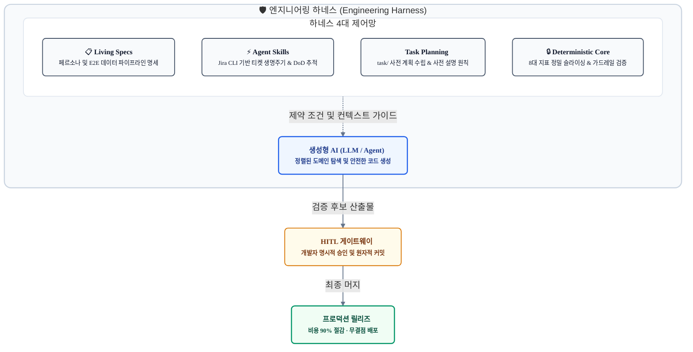
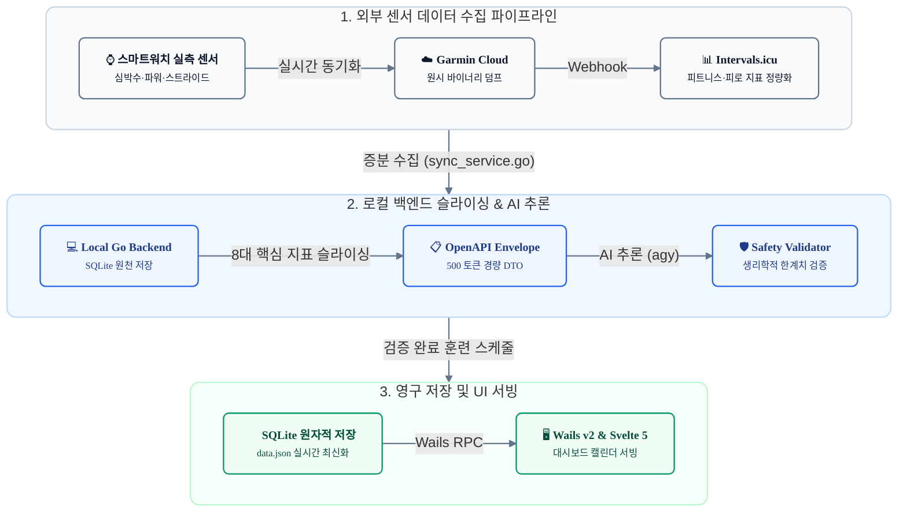
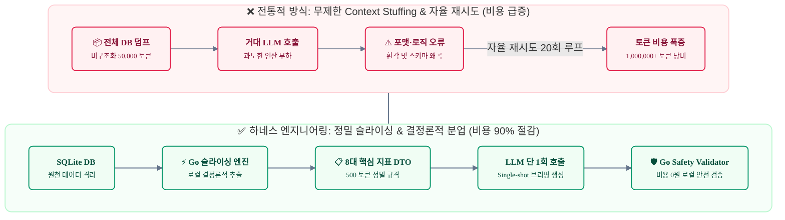
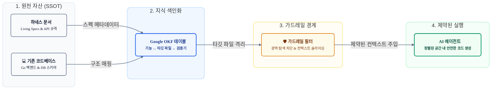
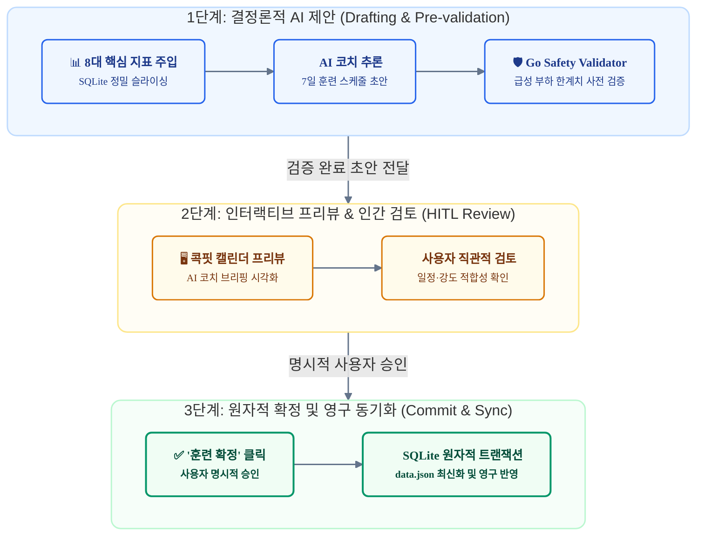

# AI를 진짜 동료로 만드는 법: 스펙 드리븐 하네스 엔지니어링과 Google OKF

> **"AI에게 무한한 자유를 주면 환각과 토큰 낭비를 유발하지만, Google OKF 마스터 인덱스와 정교한 하네스를 구축하면 높은 생산성과 안정적인 프로덕션 소프트웨어를 완성한다."**

본 포스트에서는 최근 Google이 발표한 차세대 코드베이스 지식 체계인 **Google OKF**를 하네스의 핵심 구성요소이자 **'마스터 인덱스'**로 통합하여, AI 에이전트의 컨텍스트 낭비와 환각을 차단한 엔지니어링 아키텍처 및 실전 실증 데이터를 다룹니다.

---

### 📺 실전 워크플로우 데모 영상

본 포스트에서 설명하는 **하네스 엔지니어링과 Google OKF 마스터 인덱스**의 실제 동작 과정을 담은 시연 샘플 영상입니다:
- **RunPulse AI**: 스마트워치 헬스/러닝 데이터 분석 대시보드 구동
- **agy & Jira Tool**: 터미널 환경에서 CLI 도구를 통한 Jira 티켓 생명주기 관리
- **Obsidian & OKF**: Google OKF 기반의 Living Spec 및 하네스 아티팩트 마스터 인덱스 체계화

<div align="center">
  <iframe width="100%" height="450" src="https://www.youtube.com/embed/28xzXMUCPdE" title="RunPulse AI & agy 에이전트 워크플로우 데모" frameborder="0" allow="accelerometer; autoplay; clipboard-write; encrypted-media; gyroscope; picture-in-picture; web-share" allowfullscreen></iframe>
</div>

> 🔗 **YouTube 영상 링크**: [https://youtu.be/28xzXMUCPdE](https://youtu.be/28xzXMUCPdE)

---

## 1. 프롤로그: AI 코딩 열풍의 이면과 엔지니어링 회의론

최근 수많은 엔지니어와 기업이 GitHub Copilot, ChatGPT, Claude 등 LLM을 개발 도구로 도입했습니다. 코드 초안을 작성하고 보일러플레이트 코드를 생성하는 속도는 매우 빠릅니다.

그러나 복잡한 비즈니스 로직과 데이터 파이프라인이 얽힌 프로덕션 환경에서 AI를 도입해 본 엔지니어링 조직은 명확한 한계를 겪고 있습니다.

글로벌 투자 기관들이 제기하는 **생성형 AI 회의론의 4대 핵심 지적**은 현장의 기술적 병목과 일치합니다:

| 핵심 비판 | 시장 평가 | 엔터프라이즈 현장의 실제 병목 |
| :--- | :--- | :--- |
| **① "능력 과장"** | **타당함 (높음)** | 그럴듯한 결과 뒤에 숨은 환각과 논리 오류가 상용화의 주요 병목 |
| **② "인간 대체 불가"** | **유효함 (중간)** | 직무 전체 대체는 불가능하며, 코드 리뷰에 더 많은 공수가 투입되는 역효과 발생 |
| **③ "과도한 토큰 비용"** | **타당함 (중간)** | Context Stuffing과 무분별한 에이전트 자율 루프로 인해 API 비용 급증 |
| **④ "불투명한 ROI"** | **매우 타당함 (높음)** | 인프라 및 API 비용 대비 실질적 생산성 향상과 비즈니스 기여도 불투명 |

실제 개발 현장에서 발생하는 문제도 유사합니다:
- **추측과 환각에 따른 작업 확대**: 지시하지 않은 파일을 임의로 수정하여 기존 시스템 동작을 훼손합니다.
- **끝없는 디버깅 핑퐁**: 오류 수정을 다시 AI에게 지시하면 또 다른 버그를 양산하며, 반복적인 재시도 속에 토큰과 개발 리소스가 낭비됩니다.
- **Time-to-Market 지연**: 결국 사람이 처음부터 코드를 재분석하고 디버깅하느라, 전체 개발 일정이 오히려 지연됩니다.

이러한 문제의 원인은 **LLM의 성능 부족이 아니라, AI를 제어할 엔지니어링 가드레일 없이 과도한 자율성을 부여했기 때문**입니다.

---

## 2. 완전 자동화의 수학적·공학적 한계

2026년 9월, OpenAI가 최신 플래그십 모델 **GPT-6**를 출시하며 AGI 논의가 다시 활발해졌습니다. 자연어 프롬프트만으로 풀스택 애플리케이션을 단시간에 생성했다는 사례들도 다수 공유되고 있습니다.

### ① OpenAI GPT-6 마케팅과 엔지니어링 실전 평가 비교

OpenAI는 GPT-6를 발표하며 **"AGI Level 3(자율 에이전틱 소프트웨어 엔지니어링)"**을 제시했습니다:
- **공식 마케팅 주장**: 요구사항 명세만 입력하면 백엔드, 프론트엔드, DB 스키마, 테스트, 배포 스크립트까지 자율적으로 생성(End-to-End Synthesis)하고, 실행 로그를 분석해 오류를 자율 수정(Self-correction)하므로 기존 방식의 코딩이 불필요해졌다고 주장합니다.

그러나 엔터프라이즈 아키텍트와 연구진이 데이터로 검증한 현실은 마케팅 주장과 상당한 차이를 보입니다:

| 분석 축 | 공식 마케팅 주장 | 엔지니어링 실전 평가 |
| :--- | :--- | :--- |
| **코딩 역량** | **"복잡한 앱을 단시간에 구축"**<br>- SWE-bench Verified 상위권 달성<br>- 자율 디버깅 루프로 빌드 성공 | **"우발적 복잡성 해결, 아키텍처 부채 증가"**<br>- 표준적인 웹/앱 템플릿에는 효과적이나, 복잡한 비즈니스 로직에서는 유지보수가 어려운 모놀리식 스파게티 코드 생성 경향 |
| **비용 및 FinOps** | - 개발자 인건비를 최소한의 토큰 비용으로 대체 | **"FinOps 비용 장벽"**<br>- Test-time compute와 반복적인 도구 호출로 단일 앱 빌드에 수십~수백 달러 소진, 지속 운영 비용 증가 |
| **품질 및 안정성** | - 린터/컴파일러 피드백 기반 무결점 코드 생성 | **"Silent Semantic Bugs 증가"**<br>- 구문 오류는 줄었으나, 분산 락, 동시성 격리, 비즈니스 규칙 등 도메인 엣지 케이스 결함 식별이 더 어려워짐 |
| **자율 에이전트 완성도** | - 완전 자율 에이전트 도달, 개발자 대체 가능 | **"추론 모델 수준, 자율 에이전트는 미완"**<br>- 독자적인 레거시 시스템 연동이나 장기 운영 태스크에서 실패율 증가, 엄격한 제어 필수 |

새로운 모델이 출시될 때마다 완전 자동화에 대한 낙관론이 확산되지만, 이를 실제 프로덕션 환경에 적용하면 이론적·구조적 한계에 부딪히게 됩니다. 이는 모델 크기의 문제가 아니라 컴퓨터 과학과 수학이 증명한 본질적 한계 때문입니다.

### ② 괴델의 불완전성 정리와 닫힌 계의 한계
수학자 쿠르트 괴델은 불완전성 정리를 통해 *"임의의 모순 없는 형식 체계 안에는, 그 체계 내부의 공리만으로는 참인지 거짓인지 증명할 수 없는 명제가 반드시 존재한다"*는 것을 증명했습니다.

이 원리는 LLM 기반 소프트웨어 공학에도 그대로 적용됩니다:
- **LLM의 본질**: 대형 언어 모델의 가중치와 컨텍스트 윈도우는 과거 데이터로 학습된 일종의 **닫힌 형식 체계(Closed Formal System)**입니다.
- **도메인의 실체**: 소프트웨어가 해결해야 할 현실 세계의 요구사항(스마트워치 센서 노이즈, 인체 피로도, 사용자의 주관적 목표, 비즈니스 정책 등)은 **LLM 외부 환경에 존재**합니다.
- 닫힌 통계 체계 안에서, 외부에 존재하는 맥락과 가치 판단을 단어 확률 예측만으로 모순 없이 증명하거나 해결하는 것은 불가능합니다. 반드시 외부 체계(엔지니어, 센서, 도메인 규칙)로부터의 지속적인 Grounding과 피드백이 필요합니다.

### ③ 명세의 역설
"모호한 프롬프트 몇 줄로 완벽한 프로그램을 생성한다"는 주장은 소프트웨어 공학의 기본 논리와 모순됩니다:
- **자연어의 본질**: 일상 언어는 고도로 압축되어 있으며, 맥락이 생략되는 모호한 도구입니다.
- **소프트웨어의 본질**: 프로그램 코드는 단 1비트의 모호성도 허용하지 않는 결정론적 상태 머신입니다.

모호한 자연어로 정확히 동작하는 프로그램을 만들려면, **프롬프트 자체가 코드처럼 모든 엣지 케이스, 동시성 락, 데이터 정합성 규칙을 완벽히 규정**해야 합니다. 그렇게 엄밀하게 작성된 프롬프트는 그 자체로 프로그래밍 언어와 다름없습니다. 즉, 비즈니스 요구사항을 엄밀하게 정의하고 개념화하는 엔지니어링 작업은 본질적으로 생략될 수 없습니다.

### ④ 프레드 브룩스의 No Silver Bullet
프레드 브룩스는 소프트웨어 개발의 복잡성을 두 가지로 정의했습니다:
1. **우발적 복잡성**: 문법 타이핑, 컴파일 오류 수정, 반복적인 보일러플레이트 작성 등 도구적 노동.
2. **본질적 복잡성**: 비즈니스 문제를 논리적 데이터 구조, 알고리즘, 트레이드오프로 모델링하는 아키텍처 작업.

생성형 AI는 **우발적 복잡성**을 크게 줄였습니다. 그러나 **본질적 복잡성**("특정 페르소나의 부하 한계를 어떻게 설계하고, DB 트랜잭션을 어떻게 원자적으로 보장할 것인가?")은 모델이 스스로 해결할 수 없습니다. 코드 생성 속도가 빨라졌다고 해서 아키텍처 설계와 같은 본질적 난제가 저절로 풀리는 것은 아닙니다.

### ⑤ Day 1 생성과 Day 2 운영의 간극
Vibe Coding 방식은 **Day 1 프로토타이핑** 단계에서 빠른 결과물을 보여줍니다:
- **Day 1**: 로그인 화면, 목업 데이터 차트 등 표준적인 템플릿 조합은 단시간에 생성 가능합니다.
- **Day 2 운영**: 실제 운영 단계에서는 다음과 같은 복잡한 도메인 요구사항이 발생합니다:
  - "외부 헬스케어 API가 증분 동기화될 때 기존 데이터 충돌 병합 처리"
  - "사용자가 설정값을 변경했을 때 부하 한계를 벗어나는지 실시간 검증"
  - "데스크탑 프레임워크 RPC 바인딩과 프론트엔드 상태 스토어 간의 타입 정합성 유지"

템플릿에 없는 도메인 엣지 케이스가 유입되면, 제어 장치 없는 자율 에이전트는 환각과 재시도 루프에 빠져 코드 품질을 유지하지 못하고 실패합니다.

---

## 3. 하네스 엔지니어링이란 무엇인가?

'하네스'는 본래 동물의 추진력을 제어하기 위해 착용시키는 마구나 안전벨트를 의미합니다. 전자 공학에서는 복잡한 배선을 묶어 신호 간섭을 차단하는 케이블 어셈블리를 뜻하기도 합니다.

소프트웨어 엔지니어링에서 **하네스 엔지니어링**이란, 확률적으로 동작하는 LLM의 출력을 엔지니어링 스펙과 제약 조건 내로 통제하여, 예측 가능하고 비용 효율적이며 검증 가능한 소프트웨어를 구축하는 종합 제어 아키텍처를 의미합니다.



AI의 실행 범위를 통제할 수 있도록 **구조적 안전망과 협업 프로토콜**을 설계하는 것이 하네스 엔지니어링의 본질입니다.

### 💡 불완전성 통제와 시니어 엔지니어의 협업 패러다임

앞서 살펴본 괴델의 불완전성 정리와 마찬가지로, 닫힌 통계 체계인 AI는 현실의 비즈니스 맥락과 도메인 규칙을 스스로 규정할 수 없습니다. 따라서 하네스 엔지니어링은 **해결하려는 문제 공간에서 불확실성과 환각을 구조적으로 덜어내어 원하는 경로의 결과물을 도출하도록 통제하는 작업**입니다.

이는 시니어 개발자의 역할이 직접 코드를 타이핑하는 '구현자'에서 벗어나, **AI가 올바른 방향으로 질주할 수 있도록 명세(Living Spec), 타깃 색인(OKF), 결정론적 검증기(Validator)를 설계하고 최종 승인(HITL)을 내리는 '시스템 아키텍트'로 진화하는 협업 모델**을 의미합니다.

### 하네스 아티팩트 디렉토리 구조

하네스 엔지니어링은 프로젝트 루트부터 관심사별로 계층화된 디렉토리 구조에서 출발합니다. 각 파일은 독립된 고유 책임을 가지며 AI의 작업 범위를 제어합니다:

```
runpulse-ai/
├── AGENTS.md                 # [1. 시스템 규칙] 에이전트 제약 규칙 (페르소나, Git 자의적 실행 금지, 타깃 격리, OKF 우선)
├── docs/                     # [2. Living Specs 및 마스터 인덱스]
│   ├── okf.yaml              # 하네스 마스터 인덱스 (Feature ↔ Spec ↔ Target Code 1:1 매핑)
│   ├── openapi.yaml          # OpenAPI 3.0.3 DTO 엔벨로프 및 REST 규격
│   ├── requirements/         # 페르소나 및 기능 요구사항 명세서
│   ├── architecture/         # E2E 데이터 파이프라인 및 시스템 설계도
│   └── agents/               # 도메인별 AI 에이전트 프롬프트 및 입출력 제약 스펙
├── .agents/skills/           # [3. 에이전트 Skill]
│   └── jira/                 # Jira CLI 연동 및 DoD 통제
├── task/                     # [4. 실행 계획서]
│   ├── 01_running_coach_agent_implementation_plan.md
│   ├── 07_weekly_plan_generation_uiux_and_pipeline_plan.md
│   └── ...                   # 사전 승인 없는 코드 수정 방지를 위한 작업 전 계획서
└── tool/runpulse-app/        # [5. 격리된 프로덕션 코드베이스]
    ├── app.go                # Wails v2 Go RPC 바인딩 컨트롤러
    ├── internal/agent/       # Go 8대 지표 정밀 슬라이싱 및 Safety Validator (0원 연산)
    ├── internal/db/          # SQLite 트랜잭션 및 원자적 영구 저장소
    └── frontend/src/         # Svelte 5 컴포넌트 및 반응형 상태 스토어
```

| 계층 | 대상 경로 | 역할 및 통제 기능 |
| :--- | :--- | :--- |
| **시스템 규칙** | `AGENTS.md` | 에이전트 행동 반경 제어 (페르소나 고정, Git 자의적 실행 금지, 작업 전 사전 설명 강제) |
| **마스터 인덱스** | `docs/okf.yaml` | 작업 시 관련 파일 1~2개만 즉시 특정하여 광역 검색과 컨텍스트 낭비 차단 |
| **스펙 아티팩트** | `docs/` | 데이터 파이프라인 및 API 규격 등 명세 제공 (환각 차단) |
| **협업 도구** | `.agents/skills/` | Jira 티켓 생성, 상태 전이, DoD 검증 프로토콜 정의 |
| **실행 계획** | `task/` | 개발 착수 전 세부 계획 수립 및 변경 목적 사전 선언 (자가 점검 유도) |
| **프로덕션 격리** | `tool/runpulse-app/` | 지정된 소스 파일만 수정하도록 물리적 작업 범위 격리 |

---

## 4. Living Spec: 문서 기반 실행형 가드레일

하네스 엔지니어링의 첫 번째 실천 축은 **기획, 페르소나, 데이터 파이프라인의 명세화**입니다. 이 문서들은 정적 텍스트가 아니라, AI 에이전트의 의사결정을 실시간으로 제어하는 **실행형 가드레일**로 작동합니다.

### ① 고객 페르소나 명세
"러닝 코칭 앱을 만들어줘"와 같은 모호한 프롬프트는 일반적인 인터넷 예시를 참조하여 부정확한 결과를 초래합니다.

RunPulse 프로젝트는 시스템 규칙(`AGENTS.md`)에 구체적인 페르소나를 정의했습니다:
> *"사용자는 1974년생(만 52세), 남성, 177cm, 76kg(목표 73kg), 젖산역치심박(LTHR) 158bpm의 마스터스 러너입니다. 모든 제언은 부상 방지와 점진적 과부하 원칙에 기반해야 합니다."*

이러한 제약조건을 명시하면 AI의 탐색 공간이 크게 축소됩니다. 기준 심박수를 초과하는 고강도 세션 생성이 차단되며, 회복을 위한 휴식과 Zone 2 중심의 마일리지 배분 로직을 일관되게 적용합니다.

### ② E2E 데이터 수집 및 서빙 파이프라인 명세
AI가 백엔드 코드를 작성할 때 흔히 발생하는 문제는 데이터 출처와 스키마를 임의로 추론하는 것입니다.

이를 방지하기 위해 데이터 파이프라인을 사전에 규격화하여 문서화했습니다:



스마트워치 센서 데이터의 수집 경로, 로컬 SQLite 테이블 저장, 핵심 지표 슬라이싱 및 에이전트 주입 규격을 명세서(`docs/openapi.yaml`, `docs/agents/02_schedule_planner.md`)로 정의하여, 데이터 스키마의 왜곡이나 임의 필드 생성을 방지했습니다.

---

## 5. Jira CLI 기반 에이전트 Skill 연동

에이전트 기반 작업에서 자주 발생하는 문제는 **컨텍스트 상실**입니다. 전체 과업 중 현재 진행 단계와 완료 여부를 추적하지 못하는 현상입니다.

이를 해결하기 위해 **Jira CLI 도구를 에이전트 Skill로 패키징**하여 연동했습니다. 해당 도구는 터미널 환경에서 Jira 이슈 조회, 생성, 상태 전이 및 코멘트 기록을 자동화할 수 있도록 경량 설계된 도구입니다.

```
.agents/skills/jira/
├── SKILL.md          # Jira CLI 명령 체계 및 에이전트 상태 전이 규칙
└── (jira 바이너리)
```

> 🔗 **GitHub 저장소**: [joincdream/jira-cli](https://github.com/joincdream/jira-cli) (에이전트 및 CLI 환경을 위한 Jira 자동화 도구)

에이전트는 정해진 프로토콜에 따라 작업을 수행합니다:
1. **에픽 및 작업 분할**: 상위 에픽(`KAN-29`) 아래에 백엔드 AI 에이전트 개발(`KAN-37`)과 프론트엔드 UI/UX 개발(`KAN-36`)을 체계적으로 연결합니다.
2. **티켓 상태 전이 강제**: 작업 시작 시 티켓을 `In Progress`로 변경하고, 구현 및 빌드 검증 후 `In Review`로 전환하며 실행 로그를 코멘트로 기록합니다.
3. **DoD 검증**: 티켓의 완료 기준(DoD)에 명시된 단위 테스트(`go test ./...`) 및 빌드(`make build`)를 통과해야 완료 처리됩니다.


*▲ Jira 티켓 생명주기 및 DoD 관리 화면*

이 체계를 통해 AI는 단순한 코드 완성을 넘어 협업 프로토콜을 준수하는 엔지니어링 파트너로 동작합니다.

---

## 6. Task 기반 작업 계획 및 사전 검증

하네스 엔지니어링의 주요 기법은 **작업 전 사전 설명 원칙(Pre-execution Disclosure)**과 **`task/` 디렉토리 기반 실행 계획 수립**입니다.

### ① 개발 착수 전 `task/` 세부 계획서 수립
새로운 기능 개발이나 리팩토링에 들어가기 전, AI는 반드시 `task/` 디렉토리에 마크다운 형식의 세부 작업 계획서를 먼저 작성해야 합니다.
- UI/UX 인터랙션 설계
- Go 백엔드와 프론트엔드 간 DTO 규격
- 검증을 위한 단위 테스트 케이스

이 계획서가 엔지니어에게 검토·승인되기 전에는 프로덕션 코드를 수정할 수 없습니다.

### ② 작업 전 사전 설명 원칙 (Pre-execution Disclosure)
코드 수정이나 터미널 명령을 실행하기 직전, AI는 수행할 작업 내용을 사전에 선언해야 합니다:

> **[작업 사전 설명 예시]**
> - **대상 파일**: `internal/db/action_plan.go`
> - **작업 목적**: 7일 계획을 SQLite에 일괄 저장하는 `SaveWeeklySchedulePlans` 함수 추가
> - **주요 구현 내용**: `CalendarDaySchedule` DTO를 DB 컬럼에 매핑하고, 트랜잭션(`tx.Begin`) 및 `ON CONFLICT` 구문을 통해 안전한 원자적 갱신 보장

AI가 수행할 작업을 텍스트로 먼저 서술하면 Self-reflection이 유도됩니다. 대상 파일이 작업 계획의 범위에 부합하는지, 예기치 않은 부수 효과(Side-effect)를 발생시키지 않는지 사전에 점검하여 불필요한 변경 확장을 방지합니다.

### ③ 관심사 분리와 타깃 파일 격리
코드 전체를 대상으로 포괄적인 수정을 요청하면 광역 검색으로 인해 토큰 소비가 급증하고 여러 파일이 동시에 변경되어 빌드 오류가 발생하기 쉽습니다. 이를 방지하기 위해 다음과 같은 작업 원칙을 적용했습니다:
- 기능 책임을 갖는 대상 파일(1~2개)로만 접근 제한
- 광역 키워드 검색을 지양하고, 필요한 파일만 라인 범위로 슬라이싱 열람
- 작업 범위 외 파일 임의 열람 차단

그 결과 컨텍스트 오염이 방지되어 추론 정확도가 향상되었습니다.

---

## 7. FinOps: 토큰 비용 90% 절감을 위한 3단계 아키텍처

AI 에이전트 도입 시 주요 병목 중 하나는 Unit Economics(단위 경제성)의 한계입니다. 이는 모델 자체의 비용보다 비효율적인 컨텍스트 오케스트레이션에서 기인하는 경우가 많습니다.

RunPulse의 하네스 엔지니어링은 다음 3단계 구조를 통해 토큰 소비량을 90% 이상 절감했습니다.



### 1단계: Context Stuffing 제거
데이터베이스 전체나 비구조화된 덤프를 프롬프트에 주입하면 토큰 비용과 환각 위험이 증가합니다. RunPulse는 백엔드(`internal/agent/schedule_planner.go`)의 입력 슬라이싱 로직을 통해 SQLite에서 필수 지표(급성 부하, 웰니스 점수, 심박존 비율, 주간 마일리지 등)만 선별하여 500 토큰 내외의 경량 DTO로 주입했습니다. 이를 통해 입력 토큰 비용을 대폭 절감했습니다.

### 2단계: 불필요한 자율 재시도 루프 차단
에이전트가 오류를 자율적으로 수정하도록 무한 루프를 허용하면 API 호출이 급증하여 비용이 크게 증가합니다. 사소한 파싱 오류를 잡기 위해 고비용 모델을 반복 호출하는 대신, 명확한 스펙과 사전 설명 원칙을 통해 단일 호출(Single-shot)의 정확도를 높이고, 로컬 파서와 밸리데이터를 통해 재시도 비용을 최소화했습니다.

### 3단계: 결정론적 코드와의 역할 분담
수학적 계산, 한계치 비교, 날짜 유효성 검증, DB 트랜잭션 처리는 LLM보다 결정론적 코드가 정확하고 효율적입니다.
- **날짜 계산, 부하 한계치 검증, JSON 파싱**: 로컬 Go 백엔드의 `Safety Validator`가 별도 API 비용 없이 즉각 검증합니다.
- **LLM의 역할**: 통계 수치를 바탕으로 사용자 친화적인 코칭 브리핑을 생성하는 작업에 집중시킵니다.

이는 Compound AI Systems의 전형적인 접근 방식으로, 고비용 모델 의존도를 낮추고 시스템의 결정론적 신뢰성을 확보하는 FinOps 전략입니다.

---

## 8. 하네스 마스터 인덱스로서의 Google OKF

### ① Google OKF(Open Knowledge Fabric)의 실체와 문제의식

대규모 코드베이스에서 AI 에이전트를 운용할 때 마주하는 가장 큰 장벽은 **코드 의존성과 컨텍스트의 유실**입니다. 전체 코드를 프롬프트에 밀어 넣는 방식(Context Stuffing)은 비용 폭증과 'Lost in the Middle' 환각을 유발하고, 단순 텍스트 유사도 기반의 RAG는 함수 호출 관계나 복잡한 타입 의존성을 파악하지 못해 엉뚱한 코드를 생성합니다.

Google이 제안한 **OKF(Open Knowledge Fabric)**는 이러한 한계를 극복하기 위한 **코드베이스 전용 구조화 지식 패브릭(색인망)**입니다:
- **핵심 실체**: 소스 코드의 심볼(함수·구조체), 호출 그래프(Call Graph), API 엔드포인트 및 문서 간의 관계를 구조화된 그래프/테이블 매트릭스로 엮어낸 메타 색인 체계입니다.
- **동작 방식**: 에이전트가 코드를 탐색할 때 수만 줄의 소스를 직접 헤매는 대신, OKF 색인을 거쳐 작업 대상 파일과 필수 의존성만 최소한으로 슬라이싱하여 컨텍스트로 주입받습니다.

### ② 하네스 마스터 인덱스로서의 본질 (Top-Down 재해석)

Google의 본래 접근법은 기존 소스 코드를 사후 파싱(AST/LSP 정적 분석)하여 지식 그래프를 구축하는 **상향식(Bottom-Up) 코드 역공학**에 무게가 실려 있습니다. 그러나 이는 분석 파이프라인 구축 비용이 크고, 코드 이면의 비즈니스 기획 의도를 온전히 보존하기 어렵습니다.

스펙 드리븐 환경에서 OKF는 무거운 정적 분석 도구로 추출하는 것이 아니라, 기획과 설계 과정에서 도출되는 산출물이자 다른 아티팩트들을 연결하는 **마스터 인덱스**로 기능합니다.

기획, 페르소나, 요구사항, API 규격이 사전에 정의되면 **기능 요구사항 ↔ API 엔드포인트 ↔ 대상 소스 파일 ↔ 검증 규칙**의 매핑이 자연스럽게 완성됩니다:



### ③ 상향식 AST 역공학 vs 하향식 하네스 색인 비교

| 비교 항목 | 상향식 코드 역공학 (Bottom-Up) | 하향식 하네스 색인 (Top-Down, Spec-First) |
| :--- | :--- | :--- |
| **추출 원천** | 대규모 소스 코드 | **기획 문서, OpenAPI 규격, Jira 티켓, 도메인 규칙** |
| **인프라 비용** | AST 파서, LSP 서버 구축 필요 | **Markdown / YAML 메타데이터 활용으로 연산 비용 최소화** |
| **의도 보존** | 함수 간 호출 구조 중심 | **비즈니스 목적 및 도메인 의도 1:1 보존** |
| **작업 격리성** | 코드 그래프 기반 서브그래프 연산 | **수정할 대상 파일(1~2개)과 검증기가 색인에서 즉시 특정** |

### ④ OKF 마스터 인덱스의 3대 강점

1. **정밀한 맥락 타깃팅**:
   * 에이전트는 작업을 시작하기 전 OKF 마스터 인덱스를 먼저 참조합니다.
   * 작업 시 수정해야 할 파일이 명확히 정의되어 있으므로, Lost in the Middle 문제나 의도치 않은 파일 수정을 방지합니다.
2. **FinOps 비용 최적화**:
   * 전체 코드베이스를 검색하는 대신, 색인이 가리키는 대상 파일과 스펙 DTO(1,000 토큰 내외)만 주입하므로 API 호출 비용을 90% 이상 절감합니다.
3. **Living Documentation 유지**:
   * 문서와 코드가 분리되는 문제를 해결합니다. 하네스 워크플로우를 통해 OKF 스펙이 동기화되어, 문서가 코드를 색인하고 코드가 명세를 반영하는 구조를 유지합니다.

### ⑤ RunPulse 프로젝트의 OKF 4단계 실증

실제 프로덕션 환경에서의 동작성을 검증하기 위해 RunPulse 프로젝트에서 수행한 4단계 PoC 결과는 다음과 같습니다:


#### Step 1. 하네스 기반 아티팩트 디렉토리 체계화 (`docs/`)
단일 폴더에 흩어져 있던 문서를 SDLC 원칙에 따라 계층별로 물리적 격리:
- `docs/planning/`: 기획, 비전, 페르소나
- `docs/requirements/`: 요구사항 명세(SRS), UI/UX 디스플레이 정책
- `docs/architecture/`: 동기화, DB 스키마, 데스크탑 아키텍처 설계서(SDD)
- `docs/api/`: OpenAPI 3.0.3 표준 규격, API 상세 명세
- `docs/agents/`: 도메인 에이전트 페르소나 및 DTO 규격
- `docs/references/`, `docs/prototypes/`: 도메인 지식 및 와이어프레임

#### Step 2. 하네스 아티팩트를 묶는 `docs/okf.yaml` 마스터 인덱스 생성

OKF 색인은 거창한 벡터 DB나 임베딩 검색 엔진이 아닙니다. YAML이든 Markdown이든 LLM이 직관적으로 파싱할 수 있는 **단순한 선언형 텍스트 파일**이면 충분합니다.

RunPulse 프로젝트의 실제 `docs/okf.yaml` 예제는 다음과 같습니다:

```yaml
# docs/okf.yaml (하네스 마스터 인덱스 실체)
version: "1.0.0"
features:
  - id: "FEAT-SCHEDULE-PLANNER"
    name: "7일 주기화 러닝 훈련 스케줄 자동 생성"
    harness_artifacts:
      specs: ["docs/requirements/01_schedule_planner.md"]
      api: ["docs/api/openapi.yaml#/paths/~1api~1v1~1schedule~1plan"]
      agent_persona: ["docs/agents/02_schedule_planner.md"]
    target_codebase:
      backend:
        - "internal/agent/schedule_planner.go" # 프롬프트 조립 및 DTO 매핑
        - "internal/db/action_plan.go"         # SQLite 원자적 트랜잭션
      frontend:
        - "frontend/src/lib/views/CockpitCalendar.svelte"
    guardrails:
      validator: "internal/agent/safety_validator.go" # 급성 부하 한계치 검증기
      test_command: "go test ./internal/agent/... -run TestSafetyValidator"
```

에이전트는 전체 코드베이스를 grep하는 대신, 이 선언 파일에서 `target_codebase`의 파일 2개와 `guardrails` 검증 명령만 읽어 즉시 작업 컨텍스트를 좁힙니다.

> 💡 **OKF 마스터 인덱스(`okf.yaml`) 생성을 위한 실전 프롬프트 템플릿**  
> 개발자가 이 YAML을 일일이 수작업으로 작성하거나 무거운 전용 분석 도구를 구축할 필요가 없습니다. SDLC에 따라 `docs/` 디렉토리가 정돈되어 있다면, 시스템 아키텍트 프롬프트를 통해 즉시 고품질의 마스터 인덱스를 자동 생성할 수 있습니다:
> ```markdown
> 당신은 시스템 아키텍트이자 하네스 엔지니어링(Harness Engineering) 전문가입니다.
> 우리 프로젝트의 `docs/` 디렉토리에 있는 설계 문서들(기획, 요구사항, 아키텍처, API 규격)과 실제 소스 코드베이스를 분석하여, 향후 AI 에이전트가 광역 검색(find/grep) 없이 필요한 파일만 핀셋으로 격리하여 작업할 수 있도록 돕는 마스터 인덱스 파일 `docs/okf.yaml`을 생성해주세요.
>
> ### [작성 규칙 및 필수 포함 요소]
> 1. **기본 메타데이터 및 도메인 전역 가드레일 (persona)**
>    - `version`, `project_name`, `description`
>    - 프로젝트의 핵심 고객 페르소나 및 핵심 제약조건(예: 연령, LTHR 심박, 주간 부하 한계, 마일리지 점증률 상한 등)
>
> 2. **기능 카탈로그 (features) 매핑**
>    프로젝트의 주요 기능 단위별로 아래 항목들을 1:1로 명확히 매핑하십시오:
>    - `id`, `name`, `description`: 기능 식별자 및 핵심 설명
>    - `jira`: 상위 에픽(Epic) 및 관련 작업 티켓(Tickets)
>    - `harness_artifacts`: 해당 기능의 책임을 정의하는 스펙 문서 경로
>      (planning, requirements, architecture, agent_spec, api_spec, prototype, task_plan 등)
>    - `target_codebase`: 해당 기능 구현을 직접 담당하는 소스 파일 1~2개로 엄격히 한정
>      (backend, service, data_access, rpc_binding, frontend_view, frontend_component 등)
>    - `guardrails`:
>      - 결정론적 검증기(deterministic_validator) 및 단위 테스트 파일(unit_tests)
>      - AI가 코드를 작성할 때 타협할 수 없는 핵심 비즈니스 규칙(business_rules)
>
> 3. **작성 원칙**
>    - 불필요한 전체 파일 나열을 피하고, 기능별 책임 범위에 맞는 핵심 타깃 소스 파일만 최소 단위로 지정할 것.
>    - 출력 형식은 기계 판독이 가능한 순수 YAML 규격으로 작성할 것.
> ```
>
> **프롬프트의 핵심 포인트**:
> - **Top-down 매핑**: 코드를 사후 역공학하는 대신, 기획 문서(`docs/`) ➔ 요구사항 ➔ 타깃 소스 파일(1~2개) ➔ 검증 가드레일의 연결 고리를 강제합니다.
> - **타깃 파일 격리**: AI가 전체 코드를 보지 않고 기능별로 정확히 책임이 있는 소스 파일만 식별할 수 있도록 스키마를 규격화합니다.

#### Step 3. `AGENTS.md`에 OKF 우선 조회 가드레일 규칙 강제
에이전트 시스템 규칙에 다음과 같은 가드레일을 등록했습니다:
> *"기능 개발, 버그 수정 등의 지시를 받았을 때 임의로 광역 파일 검색을 수행하지 않고, **반드시 `docs/okf.yaml`을 최우선으로 조회**하여 지정된 타깃 파일과 가드레일로 작업 범위를 격리한다."*

#### Step 4. 실전 시나리오 테스트 및 검증 데이터
* **테스트 요청**: *"환경설정 화면(`SettingsView.svelte`)의 시스템 정보 카드에 OKF 마스터 인덱스 버전(v1.0.0)과 페르소나 요약 정보를 표시하도록 Go RPC 메서드와 화면을 연결해줘."*
* **에이전트 실제 동작 결과**:
  1. **광역 검색 횟수**: **0회** (grep/find 미발생).
  2. **OKF 색인 조회**: `docs/okf.yaml`의 설정 섹션만 100토큰으로 즉시 조회.
  3. **작업 대상 파일 격리 결과**:
     - `tool/runpulse-app/app.go` (Wails Go RPC 컨트롤러)
     - `tool/runpulse-app/frontend/src/lib/views/SettingsView.svelte` (설정 뷰)
     - `tool/runpulse-app/internal/model/settings.go` (DTO 모델)
  4. **비관련 도메인 격리**: 타 기능 소스 코드의 95% 이상을 작업 대상에서 배제하여 격리 달성.

결과적으로 **Google OKF는 사후 코드 역공학에 국한되지 않고, 하네스 아티팩트들을 정밀하게 연결하는 마스터 인덱스**로 기능하며, 에이전트가 필요한 파일만 선별하여 작업하도록 제어하는 핵심 메커니즘입니다.

---

## 9. 디버깅 핑퐁 제거와 Time-to-Market 단축

"AI가 코드는 빠르게 생성하지만, 검토와 버그 수정에 더 많은 시간이 소요된다"는 현업의 주요 페인포인트입니다.

하네스 엔지니어링은 이러한 **디버깅 핑퐁을 제거하여 개발 리드타임과 Time-to-Market을 크게 단축**합니다.

### ① Side-effect 최소화
모호한 지시는 의도치 않은 파일 수정이나 기존 기능 훼손으로 이어집니다. 이를 방지하기 위해 **타깃 파일 격리 원칙**을 적용했습니다:
- Step 1: `internal/db/action_plan.go` (DB 저장 함수 구현)
- Step 2: `app.go` (Wails RPC 바인딩 추가)
- Step 3: `WeeklyPlanModal.svelte` (모달 컴포넌트 생성)
- Step 4: `CockpitView.svelte` (캘린더 연동 및 확정 바)

각 단계별 변경 범위를 대상 파일로 한정하고 즉시 단위 검증을 수행하여 Side-effect로 인한 롤백을 방지했습니다.

### ② 풀스택 기능 구축 실증
주간 훈련 계획 수립 기능(`KAN-36`, `KAN-37`)에 투입된 구현 범위는 다음과 같습니다:
- 8대 생체 데이터 슬라이싱 백엔드 엔진
- OpenAPI 3.0.3 표준 엔벨로프 규격 설계
- 스포츠 과학 결정론적 안전 가드레일 엔진
- SQLite 트랜잭션 Upsert 파이프라인
- Wails v2 데스크탑 Go RPC 바인딩
- Svelte 5 Runes 반응형 상태 스토어
- 단일 엠프티 스테이트 캘린더 UX, 점선 프리뷰 카드, 확정/취소 액션 바

기획부터 와이어프레임 설계, 백엔드/프론트엔드 구현, 단위 테스트(`go test`) 통과, 최종 빌드(`make build`)까지 단 1~2일 만에 완료되었습니다.
하네스를 통해 작업 범위를 엄격히 제어함으로써, **작업 지시 ➔ 사전 설명 ➔ 정확한 코드 생성 ➔ 빌드 성공**으로 이어지는 효율적인 사이클을 구축할 수 있었습니다.

---

## 10. HITL: 안전하고 확장 가능한 프로덕션 검증

완전 자율 에이전트보다 중요한 것은 신뢰성 있는 소프트웨어 동작입니다. 특히 건강, 금융, 핵심 비즈니스 로직과 직결된 프로덕션 도메인에서는 검증되지 않은 자율성보다 안전성이 우선되어야 합니다.

하네스 엔지니어링의 최종 단계는 **HITL(Human-in-the-Loop)** 검증 루프입니다.



이 HITL 아키텍처는 프로덕션 소프트웨어의 4대 핵심 요구조건을 충족합니다:

| 핵심 가치 | 구현 방식 |
| :--- | :--- |
| **1. 안전성** | AI 출력을 시스템에 즉시 반영하지 않고, 로컬 검증기 필터링 후 명시적 승인을 거쳐 DB에 커밋 |
| **2. 테스트 용이성** | OpenAPI 규격 기반의 DTO를 통해 비즈니스 로직을 격리된 단위 테스트(`go test`)로 검증 |
| **3. 확장성** | 신규 에이전트 추가 시 기존 코드 수정 없이 독립된 DTO와 프롬프트만 플러그인 형태로 확장 |
| **4. 비용 효율성** | Context Stuffing을 배제하고 핵심 지표만 슬라이싱 주입하여 토큰 비용 절감 및 불필요한 재시도 차단 |

---

## 11. 에필로그: 시스템 아키텍트로서의 엔지니어

소프트웨어 엔지니어링의 역사는 **추상화 수준**을 높이는 과정이었습니다. 저수준 언어에서 고수준 프레임워크로 진화해 온 것처럼, 생성형 AI의 도입은 개발 추상화의 다음 단계입니다.

엔지니어의 핵심 역할은 단순 보일러플레이트 작성에서 벗어나, AI가 안전하고 효율적으로 동작할 수 있도록 스펙을 정의하고 하네스를 설계하는 시스템 아키텍처 역량으로 전환되고 있습니다.

- **모델의 이론적 한계 인지**: 닫힌 형식 체계인 LLM에 완전 자율을 기대하기보다 외부 Grounding 체계를 갖춥니다.
- **명세와 페르소나 정의**: 명문화된 Living Spec으로 AI의 탐색 공간을 제약합니다.
- **Google OKF 마스터 인덱스 활용**: 하네스 아티팩트와 소스 코드를 1:1 매핑하여 작업 컨텍스트를 정밀 격리합니다.
- **협업 도구의 Skill화**: Jira CLI 등을 연동하여 작업 생명주기와 완료 기준(DoD)을 통제합니다.
- **Task 계획 및 사전 설명**: 코드 수정 전 변경 목적과 대상을 선언하여 Self-reflection을 유도합니다.
- **결정론적 코드와의 분업**: 계산과 검증을 로컬 코드로 처리하여 FinOps를 달성합니다.
- **HITL 검증 루프**: 최종 배포 전 인간의 검토와 승인 단계를 거쳐 안전성을 확보합니다.

이것이 바로 AI 회의론을 넘어 실제 동작하는 프로덕션 소프트웨어를 안정적으로 구축하는 **스펙 드리븐 하네스 엔지니어링**의 핵심입니다.
