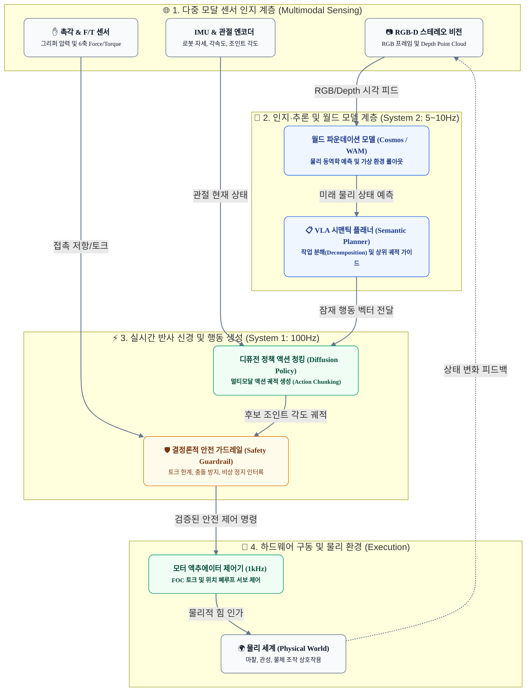

# 피지컬 AI(Physical AI) 딥다이브: 비트(Bit)에서 아톰(Atom)으로, VLA와 월드 액션 모델(WAM) 기반 임바디드 인텔리전스 아키텍처

## 1. 들어가며: 비트(Bit)에서 아톰(Atom)으로의 패러다임 전환

### 사이버 AI의 포화와 물리 세계(Physical World)의 호출
지난 수년간 생성형 AI의 발전은 주로 디지털 텍스트, 코드, 이미지, 비디오와 같은 '비트(Bits)'의 세계에 집중되어 왔습니다. 거대언어모델(LLM)과 추론 특화 모델(Reasoning Models)은 소프트웨어 엔지니어링, 문서 요약, 검색 등 순수 정보 공간에서는 인간 전문가 수준의 지적 능력을 입증했습니다. 

그러나 디지털 공간의 지능이 극대화될수록 역설적으로 **"물리 세계와 직접 상호작용하며 실체적 가치를 창출하는 AI"**에 대한 갈증이 폭발하고 있습니다. 화면 안의 텍스트 토큰을 생성하는 것을 넘어, 물리적 하드웨어(로봇, 자율주행체, 스마트 팩토리, 휴머노이드)를 통해 현실 세계의 물리 법칙(중력, 마찰력, 관성, 비선형 접촉력)을 직접 조작하는 **피지컬 AI(Physical AI, 체화된 인공지능 / Embodied AI)**가 2026년 AI 산업의 차세대 격전지로 급부상했습니다.

```
+-------------------------------------------------------------------------------+
|                       모라벡의 역설 (Moravec's Paradox)                        |
|                                                                               |
|  [고난도 추론] 체스 챔피언 제압, 복잡한 코드 작성, 수식 증명  --> AI에게 매우 쉬움  |
|  [신체적 지능] 울퉁불퉁한 길 걷기, 유리컵 집기, 계단 오르내리기 --> AI에게 극도로 어려움 |
+-------------------------------------------------------------------------------+
```

물리 세계는 디지털 세계와 근본적으로 다른 엄격한 제약 조건을 갖습니다:
1. **가역성(Reversibility)의 부재**: 디지털 코드의 에러는 롤백(Rollback)하거나 재실행하면 되지만, 물리 세계의 오작동은 하드웨어 파손, 인명 피해, 설비 정지 등 치명적인 비가역적 손실(Irreversible Damage)을 야기합니다.
2. **실시간 하드 제약(Hard Real-Time Constraint)**: 텍스트 생성은 수백 밀리초(ms) 지연되어도 치명적이지 않지만, 로봇의 균형 유지와 액추에이터 제어는 10ms(100Hz) 이상의 초저지연 폐루프 제어가 보장되어야 합니다.
3. **무한한 롱테일(Long-Tail) 물리 환경**: 인터넷 텍스트 데이터와 달리, 마찰 계수의 변화, 조명 반사, 센서 노이즈 등 실제 물리적 접촉 데이터는 사전 수집이 극히 어렵습니다.

이러한 난제를 극복하기 위해 기존의 파편화된 규칙 기반 로보틱스에서 벗어나, **VLA(Vision-Language-Action)** 모델과 물리 법칙을 내재화한 **월드 모델(World Models)**, 그리고 실시간 반사 신경을 결합한 하이브리드 아키텍처가 실무 표준으로 자리 잡고 있습니다.

---

## 2. 핵심 아키텍처 및 원리 심층 분석: VLA에서 월드 액션 모델(WAM)로

### 1) 3세대 로보틱스 패러다임 진화

피지컬 AI의 두뇌는 규칙 기반 제어에서 파운데이션 모델 기반의 통합 체계로 빠르게 진화해 왔습니다.

| 비교 항목 | 1세대: 고전적 로보틱스 (Classical Robotics) | 2세대: 종단간 VLA (End-to-End VLA) | 3세대: 월드 액션 모델 (World Action Models) |
| :--- | :--- | :--- | :--- |
| **주요 접근법** | 인지(SLAM) -> 계획(Motion Planner) -> 제어(PID/MPC) 분리 | 비전+언어를 입력받아 모터 토큰 직접 출력 (RT-2, OpenVLA) | 환경 동역학 시뮬레이션(World Model) + 반사 제어(Diffusion Policy) |
| **행동 결정 메커니즘** | 기하학적 궤적 계산 및 수치 최적화 | 자가회귀(Autoregressive) 다음 행동 토큰 예측 | 미래 3~5초 물리 상태 상상(Rollout) 후 최적 액션 선택 |
| **일반화 능력** | 사전 정의된 정형 환경에 국한 (공장 라인) | 새로운 물체/환경에 대한 기초 일반화 달성 | 물리 법칙(충돌, 변형, 미끄러짐) 기반 미경험 환경 적응 |
| **제어 주기(Loop)** | 제어기(1kHz), 비전 인지(10~30Hz) 분리 | 단일 모델 추론 한계로 5~10Hz 병목 | System 2(5~10Hz 추론) + System 1(100Hz~1kHz 제어) |
| **대표 기술/엔진** | ROS MoveIt, OMPL, OpenCV | RT-2, GR00T N1.5, Octo | NVIDIA Cosmos 3, GR00T N1.7, Isaac Lab |

---

### 2) 피지컬 AI 엔드투엔드 파이프라인 아키텍처

피지컬 AI 시스템은 고수준의 의미론적 판단(System 2)과 저수준의 실시간 반사 신경(System 1), 그리고 이를 지탱하는 시뮬레이션-실세계 전이(Sim2Real) 데이터 플라이휠의 3단계로 구성됩니다.



---

### 3) 단순 VLA에서 월드 액션 모델(WAM)로의 패러다임 도약

초기 2세대 VLA 모델(RT-1, RT-2, OpenVLA 등)은 이미지를 토큰화하고 자가회귀(Autoregressive) 방식으로 모터의 6자유도(DoF) 위치/자세 토큰을 생성하는 데 집중했습니다. 그러나 이 방식은 **"눈앞의 장면에 대해 즉각적으로 반응"**할 뿐, **"자신의 행동이 물리 환경에 미칠 인과적 연쇄 반응(Causal Consequence)"**을 예측하지 못합니다.

2026년 표준으로 부상한 **월드 액션 모델(World Action Models, WAM)**은 생성형 비디오 파운데이션 모델(NVIDIA Cosmos 3 등)의 기술을 로보틱스에 통합한 것입니다:
* **상상 롤아웃(Imagined Rollout)**: 로봇이 실제 손을 뻗기 전, 내부 시뮬레이터(월드 모델)를 통해 "만약 내가 이 속도로 상자를 밀면 상자가 넘어질 것인가, 밀려날 것인가?"를 가상으로 5~10단계 예측합니다.
* **물리적 일관성 검증(Physics-Grounded Consistency)**: 환각(Hallucination)이 발생하기 쉬운 LLM과 달리, 3차원 공간 부피, 중력 가속도, 강체 및 유체 동역학의 불변 법칙을 사전 학습 가중치로 강제합니다.

---

### 4) Sim2Real 데이터 플라이휠과 합성 데이터 혁명

피지컬 AI의 최대 병목은 **"실세계 데이터 수집의 물리적 한계"**입니다. 인터넷의 수십억 개 텍스트를 크롤링할 수 있는 LLM과 달리, 로봇 데이터는 실제 하드웨어를 원격 조작(Teleoperation)하며 1초 단위로 기록해야 하므로 수집 비용이 천문학적입니다.

이를 돌파하기 위해 **Isaac Sim / Isaac Lab 기반의 Sim2Real 파이프라인**이 핵심 인프라로 안착했습니다:
1. **GPU 가속 물리 엔진 (PhysX + Newton)**: 수천 대의 가상 로봇 환경을 수만 개의 GPU 코어에서 동시 병렬 시뮬레이션합니다.
2. **도메인 무작위화(Domain Randomization)**: 가상 환경의 텍스처, 마찰 계수, 질량, 조명, 카메라 왜곡 파라미터를 무작위로 교란하여 실제 물리 세계의 노이즈를 학습합니다.
3. **3D 가우시안 스플래팅(3D Gaussian Splatting) 기반 디지털 트윈**: 실제 공장이나 물류 창고를 촬영하여 수 분 내에 고정밀 시뮬레이션 공간으로 복제하고, 텍스트 프롬프트로 장애물 및 돌발 시나리오를 합성 생성합니다.

---

## 3. 실전 구현 및 실증 시나리오: WAM + Diffusion Policy와 2계층 안전 가드레일

### 1) 액션 청킹(Action Chunking)과 Diffusion Policy 제어 인터페이스

피지컬 AI에서 모터 제어 명령은 단일 스텝 예측 시 지터(Jitter) 현상과 오차가 누적되기 때문에, 향후 16~64개 스텝의 모터 궤적을 묶음(Chunk) 단위로 생성하는 **ACT(Action Chunking with Transformers) 및 Diffusion Policy**가 표준으로 사용됩니다.

다음은 비전 인코딩 특징 벡터와 언어 지시문을 입력받아 연속 관절 궤적을 샘플링하는 Diffusion Policy 인터페이스의 핵심 구현 구조입니다.

```python
import torch
import torch.nn as nn
from typing import Dict, Tuple

class PhysicalAIDiffusionPolicy(nn.Module):
    """
    비전-언어-월드모델 잠재 벡터를 기반으로
    16-스텝 6-DoF 델타 관절 궤적(Chunk)을 디노이징 샘플링하는 모듈
    """
    def __init__(self, obs_dim: int, action_dim: int = 7, chunk_size: int = 16):
        super().__init__()
        self.action_dim = action_dim
        self.chunk_size = chunk_size
        
        # Condition Encoder (Vision + Language + Robot State)
        self.cond_encoder = nn.Sequential(
            nn.Linear(obs_dim, 512),
            nn.SiLU(),
            nn.Linear(512, 512)
        )
        
        # Denoising Backbone (Temporal U-Net or Transformer)
        self.denoise_net = nn.Sequential(
            nn.Linear(chunk_size * action_dim + 512, 1024),
            nn.Mish(),
            nn.Linear(1024, 1024),
            nn.Mish(),
            nn.Linear(1024, chunk_size * action_dim)
        )

    def forward(
        self, 
        noisy_actions: torch.Tensor, 
        timestep: torch.Tensor, 
        observation_cond: torch.Tensor
    ) -> torch.Tensor:
        """
        noisy_actions: [Batch, chunk_size * action_dim]
        timestep: [Batch, 1]
        observation_cond: [Batch, obs_dim]
        """
        cond_emb = self.cond_encoder(observation_cond)
        x = torch.cat([noisy_actions, cond_emb], dim=-1)
        predicted_noise = self.denoise_net(x)
        return predicted_noise

    @torch.no_grad()
    def sample_trajectory(self, obs_cond: torch.Tensor, steps: int = 20) -> torch.Tensor:
        """가우시안 노이즈로부터 16단계 연속 제어 궤적을 점진적 역확산(DDIM) 샘플링"""
        batch_size = obs_cond.shape[0]
        curr_action = torch.randn((batch_size, self.chunk_size * self.action_dim), device=obs_cond.device)
        
        for t in reversed(range(steps)):
            t_batch = torch.full((batch_size, 1), t, device=obs_cond.device, dtype=torch.float32)
            noise_pred = self.forward(curr_action, t_batch, obs_cond)
            # 간이 DDIM 스텝 업데이트
            curr_action = curr_action - (1.0 / steps) * noise_pred
            
        return curr_action.view(batch_size, self.chunk_size, self.action_dim)
```

---

### 2) 2계층 안전 가드레일 (Two-Tier Safety Guardrail Architecture)

AI 모델의 출력은 확률적이므로 결코 100% 신뢰할 수 없습니다. 따라서 피지컬 AI 시스템은 신경망의 출력이 모터 드라이버로 직접 전송되는 것을 차단하고, 그 사이에 **결정론적 안전 검증 계층(Deterministic Safety Layer)**을 필수 배치합니다.

```
+-------------------------------------------------------------------------------+
|                      2계층 안전 가드레일 (Two-Tier Safety)                     |
|                                                                               |
|  [Tier 1: 비결정론적 AI 계층]                                                  |
|   VLA / Diffusion Policy ---> 후보 궤적 생성 (Candidate Trajectory)          |
|                                         |                                     |
|                                         v                                     |
|  [Tier 2: 결정론적 하드웨어 가드레일]                                          |
|   1. 각속도/가속도 리미터 (Velocity & Acceleration Clamping)                    |
|   2. 토크 상한선 감시 (Torque Limit Interlock: F/T Sensor 교차 검증)           |
|   3. 자기 충돌(Self-Collision) 및 작업 영역 경계 박스(Work Envelope Check)      |
|                                         |                                     |
|          [통과]                         | [위반 시]                           |
|            v                            v                                     |
|     1kHz 모터 구동              즉각 궤적 제동 및 안전 감속 모드(E-Stop)       |
+-------------------------------------------------------------------------------+
```

다음은 엣지 제어기(Jetson Thor 등)에서 모터로 명령이 인가되기 직전 실행되는 C++ / Python 안전 인터록 명세 예시입니다.

```python
class DeterministicSafetyGuardrail:
    """결정론적 2차 안전 가드레일 (실행 주기: 1ms 단위 실시간 인터록)"""
    def __init__(self, max_torque_nm: float = 40.0, max_velocity_rad_s: float = 2.5):
        self.max_torque = max_torque_nm
        self.max_velocity = max_velocity_rad_s
        self.workspace_limits = {
            'x': (-0.8, 0.8),
            'y': (-0.8, 0.8),
            'z': (0.02, 1.2)  # 바닥면 2cm 이하 충돌 방지
        }

    def validate_and_clamp(
        self, 
        current_joint_pos: list, 
        target_joint_pos: list, 
        dt: float = 0.01
    ) -> Tuple[bool, list, str]:
        clamped_action = []
        
        for cur, tgt in zip(current_joint_pos, target_joint_pos):
            velocity = (tgt - cur) / dt
            
            # 1. 속도 한계 초과 감시 및 클램핑
            if abs(velocity) > self.max_velocity:
                direction = 1.0 if velocity > 0 else -1.0
                safe_tgt = cur + direction * self.max_velocity * dt
                clamped_action.append(safe_tgt)
            else:
                clamped_action.append(tgt)

        # 2. 작업 영역(Workspace Envelope) 경계 침범 여부 검사
        # (순기구학 Forward Kinematics 계산 결과 기준)
        return True, clamped_action, "PASSED_AND_REGULATED"
```

---

### 3) 엣지 실시간 제어 메시지 페이로드 스키마

피지컬 AI의 상위 월드 모델/VLA 노드와 하위 실시간 모터 노드 간 교환되는 ROS2 / gRPC 메시지 페이로드 규격입니다.

```json
{
  "header": {
    "timestamp_ns": 1789456200125400,
    "frame_id": "robot_base_link",
    "sequence_id": 84201
  },
  "world_model_prediction": {
    "target_object": "fragile_glass_beaker",
    "predicted_contact_point": [0.421, -0.152, 0.354],
    "estimated_mass_kg": 0.25,
    "max_admissible_grasp_force_n": 8.5
  },
  "action_chunk": [
    {
      "step": 0,
      "joint_positions_rad": [0.12, -0.45, 1.28, -0.85, 0.04, 0.32],
      "gripper_aperture_m": 0.08,
      "expected_duration_ms": 10
    },
    {
      "step": 1,
      "joint_positions_rad": [0.13, -0.44, 1.26, -0.84, 0.04, 0.31],
      "gripper_aperture_m": 0.075,
      "expected_duration_ms": 10
    }
  ],
  "safety_envelope": {
    "collision_proximity_margin_m": 0.05,
    "emergency_deceleration_limit_rad_s2": 15.0
  }
}
```

---

## 4. 결론 및 실무 권고사항 (Key Takeaways)

피지컬 AI는 단순한 LLM의 외연 확장이 아니며, 고전 제어 공학(Control Theory), 실시간 임베디드 아키텍처, 물리 시뮬레이션, 거대 생성 파운데이션 모델이 융합된 **종합 시스템 엔지니어링의 정점**입니다.

### 엔터프라이즈 도입을 위한 4대 핵심 제언

1. **단일 VLA 환상 탈피: 계층적 분리(System 1 & System 2) 아키텍처 채택**
   - 10B 이상의 거대 모델 하나로 모터 서보 제어까지 직접 수행하려는 시도는 레이턴시(Latency)와 안전성 문제로 현장에서 실패합니다.
   - 상위 의미론적 추론 및 환경 예측(System 2: 월드 모델)과 하위 고속 모션 생성(System 1: Diffusion Policy / MPC)을 철저히 분리하십시오.

2. **Sim2Real 파이프라인 없이는 피지컬 AI도 없다**
   - 현실 로봇 데이터만으로 파운데이션 모델을 학습시키는 것은 비용과 속도 면에서 불가능합니다.
   - NVIDIA Isaac Sim / Isaac Lab 및 3D Gaussian Splatting을 활용해 가상 환경에서 수백만 시간의 물리 상호작용 합성 데이터를 생성하고 도메인 무작위화로 전이 갭(Transfer Gap)을 좁혀야 합니다.

3. **결정론적 가드레일(Tier 2)의 절대적 우위 보장**
   - AI의 추론 결과는 언제나 확률적 결함을 내포할 수 있습니다. 
   - 모터 토크 리미터, 작업 영역 한계 검사, 긴급 정지(E-Stop)와 같은 하드웨어 인터록은 AI 소프트웨어의 제어를 받지 않는 독립된 하드웨어/펌웨어 루프에서 구동되어야 합니다.

4. **엣지 SoC 컴퓨팅 파워와 전력 밀도의 공동 설계(Co-Design)**
   - 로봇의 페이로드(가반하중)와 배터리 수명은 엣지 컴퓨팅 하드웨어의 전력 소모(TDP)에 직접 종속됩니다.
   - FP4/FP8 양자화 기반 초경량 가속 칩셋(Jetson Thor 등)을 기준으로 모델의 크기와 제어 주기를 초기 단계부터 함께 사이징(Sizing)해야 합니다.

비트의 시대를 넘어 아톰의 세계를 제어하는 피지컬 AI 아키텍처를 선점하는 기업이 차세대 산업 자동화와 지능형 로보틱스 시장의 최종 승자가 될 것입니다.
