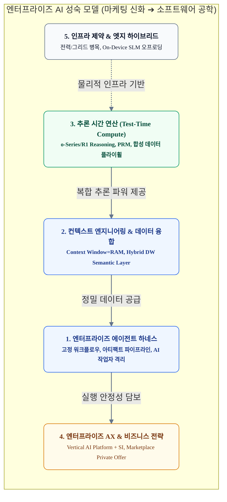

# 2026년 하반기 생성형 AI 심층 기술 탐구(Deep-Dive) 후보 주제 제안서

생성형 AI 생태계는 단순 텍스트 생성과 챗봇(Chatbot) 래퍼 중심의 초기 탐색기를 지나, **실질적인 엔터프라이즈 워크플로우 완결(Selling Work)**과 **소프트웨어 공학적 신뢰성(Harness & Context Engineering)**을 요구하는 실용주의 성숙기에 도달했습니다.

본 문서는 최근 글로벌 시장 동향(Sequoia, Gartner, a16z, IEA 등)과 빅테크/업계 전문가(Andrej Karpathy, Dario Amodei 등)의 핵심 담론, 그리고 엔터프라이즈 현장의 실질적 요구사항을 분석하여 **2026년 하반기에 기술적 깊이와 비즈니스 파급력을 동시에 확보할 수 있는 5대 카테고리 12개 딥다이브 후보 주제 및 선정 근거**를 정리한 종합 제안서입니다.

---

## 🧭 2026년 하반기 생성형 AI 기술 지형도

---

## 1. 엔터프라이즈 에이전트 하네스 & 현실적 워크플로우 (Agent Harness & Enterprise Reality)

> **카테고리 개요**: 'Autonomous Agent'라는 벤더의 마케팅 포장지를 걷어내고, 기업 IT 환경에서 실제로 동작하는 **고정 워크플로우(Fixed Workflow), 결정론적 아티팩트(Deterministic Artifact), 인간 개입(HITL)** 기반의 소프트웨어 공학적 하네스 아키텍처를 규명합니다.

### [주제 1-1] 'Autonomous Agent'의 마케팅 신화와 엔터프라이즈 현실: 고정 워크플로우·결정론적 아티팩트 기반의 AI 작업자(Worker) 하네스
* **배경 및 문제 정의 (불편한 진실)**:
  * **마케팅 서사와 프로덕션 현실의 괴리**: AI 벤더와 VC들은 기업 가치(밸류에이션)를 50~100배로 띄우기 위해 "모든 것을 자율적으로 알아서 처리하는 디지털 직원(Autonomous Agent)" 환상을 세일즈하지만, 실제 기업 현장(보안/법무/IT)에서는 법적 책임 소재(Liability), 복리 에러(Compounding Errors), 예산 통제 불능으로 인해 PoC 단계에서 전면 폐기되는 'PoC 지옥'이 반복되고 있습니다.
  * **'Durable Execution'의 실체**: AI가 수일 동안 혼자 깊게 고민하는 것이 아니라, **중간중간 사람(팀장, 보안팀)의 슬랙/이메일 결재 승인 대기 시간(Approval Latency)** 동안 프로세스를 재워두기 위한 n8n/전자결재 스타일의 대기(Wait) 상태 머신에 불과합니다.
* **핵심 분석 및 아키텍처 포인트**:
  * **AI의 역할 격리 (Planner가 아닌 Worker)**:
    * 워크플로우(DAG)와 단계별 Job의 선후 관계, 비즈니스 규칙은 엔지니어가 **엄격히 고정(Fixed Pipeline)**합니다.
    * AI에게 워크플로우 기획 전권을 위임하지 않고, 정해진 Job 내부에서 비정형 인풋을 가공해 초안을 채워 넣는 **'격리된 작업자(Worker)'**로만 제한합니다.
  * **결정론적 아티팩트(Artifact) 인터페이스**:
    * 채팅창 중심의 비정형 줄글 대화를 전면 배제하고, 각 Job의 입출력을 스키마가 고정된 **불변 아티팩트(JSON, Markdown, SQL, Code)**로 바인딩합니다.
  * **단계별 평가 게이트웨이(Eval)와 2원화 분기 루프**:
    * **정상 통과(Pass)**: 자동 린터/스키마 검증 통과 시 다음 Job으로 자동 전이.
    * **이슈 발생(Fail)**: 문법/형식 오류는 **AI 자가 수정(Self-Correction) 루프**로 자동 해결하고, 비즈니스/재무/법적 판단은 캔버스(Canvas) 기반 **인간 개입(Human Override)**으로 직접 수정 후 최종 확정.
  * **자연스러운 상태 영속화 (Zero Token Waste)**:
    * 거창한 분산 엔진 없이, 각 Job의 입출력 아티팩트 파일 저장(S3, DB, Git) 자체가 완벽한 체크포인트가 되어 실패 시 이전 산출물부터 토큰 낭비 없이 즉시 복구합니다.
* **선정 근거 및 시장 데이터 (Rationale & Evidence)**:
  * **[Sequoia Capital: AI's $600B Question](https://www.sequoiacap.com/article/ais-600b-question/) & [Generative AI's Act o1](https://www.sequoiacap.com/article/generative-ais-act-o1/)**: 세쿼이아는 'Selling Work'의 실질적 달성을 위해 모델 자체의 지능보다 시스템의 신뢰성을 담보하는 'Agent Harness'가 핵심 해자임을 지적.
  * **[Anthropic: Claude Artifacts 공식 발표](https://www.anthropic.com/news/artifacts)** & **[OpenAI: Introducing Canvas](https://openai.com/index/introducing-canvas/)**: 빅테크조차 순수 챗봇(Chatbot)을 버리고, 대화창과 분리된 독립 캔버스에서 산출물을 직접 편집·확정하는 '아티팩트 중심 인터페이스'로 전면 선회.
  * **[Bessemer Venture Partners: State of the Cloud](https://www.bvp.com/atlas/state-of-the-cloud-2024)**: 제네릭 AI SaaS의 급격한 리텐션 붕괴와 고객사 업무 프로세스에 단단하게 결합되는 버티컬 워크플로우 하네스의 필연성 분석.
* **실무적 기대 효과**:
  * 자율 에이전트의 비가역적 사고(잘못된 결제, 대고객 오발송 등) 원천 차단.
  * 순수 채팅 대비 B2B 업무 완결 속도 3배 향상 및 중간 장애 시 토큰 재소비율 0% 달성.

---

### [주제 1-2] 비결정론적 AI의 프로덕션 평가(Eval)와 CI/CD 회귀 테스트 자동화 파이프라인
* **배경 및 문제 정의**:
  * 워크플로우 툴(n8n 등)로 파이프라인은 연결할 수 있지만, 프롬프트 문구나 모델 버전(`gpt-4o` ➔ `gpt-5`)을 변경했을 때 **"기존 1,000개 업무 시나리오에서 시스템이 깨지지 않았는가?"**를 기계적으로 검증하지 못해 배포가 중단되는 현상이 발생합니다.
* **핵심 분석 포인트**:
  * LLM-as-a-Judge의 편향(Position Bias, Self-Preference) 제거 기법.
  * 결정론적 정적 분석기(AST, Linter), 단위 테스트, 스키마 검증기를 결합한 하이브리드 Eval 아키텍처.
  * 깃옵스(GitOps) 기반 CI/CD 파이프라인에서 배포 전 회귀(Regression) 감지 시 자동 롤백 체계.
* **선정 근거 및 시장 데이터 (Rationale & Evidence)**:
  * **[Anthropic: Demystifying Evals for AI Agents](https://www.anthropic.com/research)**: 에이전트의 도구 호출 및 복합 태스크 완결성을 평가하기 위해 단순 벤치마크 점수가 아닌 프로덕션 특화 회귀 테스트 스위트의 필수성 강조.
  * **[DeepEval / Confident AI 생태계 보고서](https://github.com/confident-ai/deepeval)**: 기업의 AI 도입 실패 원인 1위가 '배포 후 모델 성능 저하 모니터링 불가'로 조사되며, 단위 테스트 수준의 자동 Eval 프레임워크가 필수 LLMOps로 자리잡음.
* **실무적 기대 효과**:
  * 모델/프롬프트 업데이트 시 엔터프라이즈 워크플로우 안정성 99.9% 보장.

---

### [주제 1-3] '의미론적 생각 검열'의 모순과 0/1 액션 게이트웨이: MCP 환경의 엔터프라이즈 심층방어(Defense-in-Depth) 아키텍처
* **배경 및 문제 정의 (업계의 착각과 인지적 모순)**:
  * **0과 1 판정을 위해 GPU를 돌리는 모순**: 보안 판정은 본질적으로 "통과(1)시킬 것인가, 차단(0)할 것인가"의 이진 문제(Binary Decision)입니다. 여기에 비결정론적이고 비싼 LLM 추론(가드레일, LLM WAF)을 돌려 자연어의 의미를 검열하려는 시도는 **1~2초의 극심한 레이턴시와 GPU 비용 폭증**을 초래하며, 여전히 오탐과 미탐을 낳는 치명적 안티패턴입니다.
  * **인간 인지 모델의 교훈 (생각 vs 행동)**: 사람도 머릿속에 떠오르는 모든 상상과 잡생각의 무결성을 매 순간 검열하지 않습니다(극심한 인지 과부하 초래). 생각은 자유롭게 흐르도록 방목하고, 오직 **물리적 행동(Action: 발화, 결재, 송금)을 취하는 순간**에만 사회적 규범과 법적 제약으로 통제합니다.
  * **MCP 생태계의 안티패턴**: 초기 오픈소스 MCP 서버들이 DB에 직접 연결(Direct Connection)되면서 기존의 API Gateway, WAF, RLS를 우회하고, "MCP 자체에 새로운 보안 엔진을 얹어야 한다"는 옥상옥 혼란을 야기했습니다.
* **핵심 분석 및 아키텍처 포인트**:
  * **추론(생각)은 방목하고, 액션(Action Gate)만 0과 1로 통제**:
    * LLM이 무슨 생각을 하든, 어떤 악성 프롬프트나 환각에 오염되었든 **추론 단계는 비결정론에 맡겨 완전 방목(GPU 비용 0원, 레이턴시 0ms)**합니다.
    * 외부 세상에 영향을 미치는 **도구 호출(Action) 경계선**에서만 순수 0ms의 결정론적 0/1 규칙 검사를 적용합니다.
  * **MCP의 제자리 찾기: 얇은 어댑터(Thin Adapter)와 신원 전파(Identity Propagation)**:
    * MCP 자체에 복잡한 보안을 구축하지 않고, 사내 기존 API를 LLM 도구로 번역해 주는 '얇은 어댑터'로 제한합니다.
    * MCP의 유일한 보안 책무는 전지전능한 봇 계정이 아닌 **'실제 로그인한 사용자(End-User)의 사번/JWT 토큰'을 백엔드로 투명하게 전달(Pass-through)**하여 Confused Deputy 문제를 차단하는 것입니다.
  * **전통적 심층방어(Defense-in-Depth) 5계층 아키텍처**:
    1. **1계층 (프롬프트/컨텍스트)**: 데이터-지시문 분리(NX 원칙: No-Execute Data Block), 제어 문자 정제.
    2. **2계층 (MCP Adapter)**: 신원 전파(End-User JWT 바인딩), 최소 권한 도구 노출.
    3. **3계층 (Enterprise API Gateway)**: RBAC/ABAC 인가 검사, 파라미터 JSON Schema/정규식 검증, 비가역적(쓰기/삭제) 작업 시 인간 승인(Step-Up Auth) 강제.
    4. **4계층 (DB 프록시 & 서비스)**: Prepared Statement 강제(SQL Injection 원천 무력화), Row-Level Security(RLS).
    5. **5계층 (네트워크 & OS 커널)**: eBPF 기반 아웃바운드 인터넷(Egress) 물리적 차단(데이터 유출 원천 차단).
  * **결정론적 메타데이터와 신뢰 경계(Trust Boundary)**:
    * 외부 도구의 자체 선언(Self-Attestation)을 불신하고, 사내 중앙 레지스트리가 엔드포인트 기준으로 권한과 스키마를 중앙에서 강제(Server-side Enforcement).
* **선정 근거 및 시장 데이터 (Rationale & Evidence)**:
  * **[NIST SP 800-207 (Zero Trust Architecture)](https://csrc.nist.gov/publications/detail/sp/800-207/final)**: "Never Trust, Always Verify" 원칙에 따라 내부망/내부 데이터라 할지라도 모든 액션 경계에서 암호학적 및 스키마 검증을 강제해야 함을 규정.
  * **[OWASP Top 10 for Large Language Model Applications](https://owasp.org/www-project-top-10-for-large-language-model-applications/)**: LLM01(프롬프트 인젝션), LLM02(민감 정보 유출), LLM07(불안전한 플러그인 설계) 위협을 해결하는 유일한 현실적 방안은 모델 내부 탐지가 아닌 도구 실행 경계의 엄격한 인가와 최소 권한 격리임을 분석.
  * **[Anthropic: Model Context Protocol (MCP) 공식 사양](https://modelcontextprotocol.io/)**: 분산 도구 호출의 개방형 표준을 제시했으나, 엔터프라이즈 환경에서는 신원 전파와 API 게이트웨이 연계가 필수 보안 요건으로 부각됨.
* **실무적 기대 효과**:
  * 의미론적 LLM 가드레일 제거로 API 응답 레이턴시 1~2초 단축 및 추가 GPU 비용 0원 달성.
  * 확률적 보안(90% 탐지)이 아닌 100% 결정론적(0 또는 1) 엔터프라이즈 컴플라이언스 및 보안 감사 통과.

---

## 2. 컨텍스트 엔지니어링 & 엔터프라이즈 데이터 융합 (Context Engineering & Data Layer)

> **카테고리 개요**: 단순 프롬프트 문구 조정을 넘어, 런타임에 모델이 바라보는 정보 환경 전체를 능동적으로 선별·압축·격리하는 엔지니어링 체계와 엔터프라이즈 데이터 웨어하우스(DW) 연계.

### [주제 2-1] '프롬프트 엔지니어링'에서 '컨텍스트 엔지니어링(Context Engineering)'으로의 패러다임 전환
* **배경 및 문제 정의**:
  * 1M~10M 토큰 윈도우 시대에도 불구하고 'Lost-in-the-Middle', 'Context Rot(문맥 오염)', 토큰 비용 폭증 문제는 여전히 심각합니다.
* **핵심 분석 포인트**:
  * 컨텍스트 엔지니어링의 4대 축: **Write**(지침 정밀화), **Select**(동적 검색), **Compress**(시맨틱 압축), **Isolate**(태스크별 문맥 분리).
  * 정적 프롬프트 캐싱(Context Caching) 아키텍처와 KV 캐시 재사용 최적화를 통한 비용 절감 실무.
* **선정 근거 및 시장 데이터 (Rationale & Evidence)**:
  * **Andrej Karpathy의 제창**: "LLM is CPU, Context Window is RAM. Context engineering is the delicate art and science of filling the context window with just the right information for the next step." (프롬프트 작성에서 런타임 메모리 관리로의 패러다임 전환 천명).
  * **[LangChain: Context Engineering 가이드](https://blog.langchain.dev/context-engineering/)**: 단순 RAG 파이프라인에서 벗어나 동적 컨텍스트 큐레이션 및 토큰 예산 관리 기법을 프로덕션 구축 프레임워크로 정립.
* **실무적 기대 효과**:
  * 에이전트 다단계 루프의 누적 토큰 비용 60% 절감 및 할루시네이션 발생률 억제.

---

### [주제 2-2] Hybrid Context Layer: 데이터 웨어하우스(DW)와 비즈니스 프론트엔드의 결합
* **배경 및 문제 정의**:
  * BigQuery, Snowflake, Redshift의 내장 AI 기능은 데이터 엔지니어 및 분석가 중심의 백엔드 도구에 치우쳐 있어, 마케팅/영업 등 현업 비즈니스 실무자의 엔드투엔드 워크플로우와 단절되어 있습니다.
* **핵심 분석 포인트**:
  * DW의 정형 데이터(SQL, 메트릭)와 사내 비정형 문서(보고서, 지침)를 통합하는 중간 시맨틱 레이어 설계.
  * 비즈니스 실무자용 하이브리드 UI(대시보드 + AI 어시스턴트)를 통한 '데이터 조회 ➔ SQL 생성 ➔ 초안 작성 ➔ 보고서 승인' 자동화.
* **선정 근거 및 시장 데이터 (Rationale & Evidence)**:
  * **[Snowflake Cortex AI 아키텍처](https://www.snowflake.com/en/data-cloud/cortex/)**: 클라우드 DW 진영이 LLM 추론을 SQL 함수로 내장하고 있으나, 현업 프론트엔드 비즈니스 로직과의 연결 브릿지가 여전히 공백 상태임.
  * **[a16z: Emerging Architectures for LLM Applications](https://a16z.com/emerging-architectures-for-llm-applications/)**: 모던 데이터 스택(Modern Data Stack)과 결합된 시맨틱 레이어가 엔터프라이즈 AI 애플리케이션의 핵심 병목이자 최대 부가가치 영역임을 분석.
* **실무적 기대 효과**:
  * 데이터 엔지니어 의존 없는 비즈니스 현업 주도 맞춤형 AI 업무 파이프라인 완성.

---

### [주제 2-3] GraphRAG vs Agentic RAG: 기업 도메인 지식 구축의 경제성 및 정확도 실증
* **배경 및 문제 정의**:
  * 단편적인 청크 기반 코사인 유사도 검색(Vector RAG)의 한계를 극복하기 위해 Knowledge Graph 기반 RAG와 다단계 검색 에이전트가 경쟁 중이나, 높은 구축 비용과 복잡도가 장벽입니다.
* **핵심 분석 포인트**:
  * GraphRAG(Neo4j, 지식 그래프) 구축 및 유지보수 TCO 분석.
  * 멀티홉(Multi-hop) 질문에서의 Vector RAG, GraphRAG, Agentic Search 간 정확도/비용/레이턴시 비교 실증.
* **선정 근거 및 시장 데이터 (Rationale & Evidence)**:
  * **[Microsoft Research: GraphRAG Unlocking LLM Discovery](https://www.microsoft.com/en-us/research/blog/graphrag-unlocking-llm-discovery-on-narrative-private-data/)**: 마이크로소프트 리서치는 방대한 비정형 문서 집합에서 복합 엔티티 관계를 질의할 때 기존 벡터 RAG 대비 압도적인 포괄성과 답변 완성도를 입증함.
  * **기업 현장의 TCO 논쟁**: 그래프 추출을 위한 사전 LLM 인덱싱 토큰 비용이 벡터 임베딩 대비 수십 배에 달하므로, 실제 엔터프라이즈 도메인에서의 가성비와 ROI에 대한 객관적 비교 데이터가 필수적임.
* **실무적 기대 효과**:
  * 사내 RAG 프로젝트 기획 시 기술 스택 선정 기준 및 인프라 비용 예측 모델 확립.

---

## 3. 추론 시간 연산(Test-Time Compute) & 추론 모델 (Reasoning Models)

> **카테고리 개요**: 사전 학습 중심의 스케일링 법칙 한계를 돌파하기 위한 추론 시점 연산(Inference-Time Scaling) 스케일링과 사고 과정(Chain of Thought) 검증 공학.

### [주제 3-1] Test-Time Compute 스케일링과 프로세스 보상 모델(PRM)의 실체
* **배경 및 문제 정의**:
  * 기존 ORM(Outcome Reward Model, 최종 결과만 채점)은 수학/코딩/논리적 추론 중간 단계의 오류를 교정하기 어렵습니다.
* **핵심 분석 포인트**:
  * 단계별 사고 과정(Chain of Thought)을 검증하는 PRM 메커니즘과 Monte Carlo Tree Search(MCTS) 원리.
  * 비즈니스 환경에서 추론 모델(고비용·고지연)과 일반 모델(저비용·저지연) 간의 동적 하이브리드 라우팅 전략.
* **선정 근거 및 시장 데이터 (Rationale & Evidence)**:
  * **[OpenAI: Learning to Reason with LLMs (o1 발표)](https://openai.com/index/learning-to-reason-with-llms/)**: 추론 시점에 더 많은 컴퓨팅 자원을 할당할수록 문제 해결 능력이 지수적으로 상승함을 증명하며 추론 패러다임을 근본적으로 전환.
  * **[OpenAI 연구 논문: Let's Verify Step by Step (Lightman et al.)](https://arxiv.org/abs/2305.20050)**: 단계별 검증 데이터셋(PRM800K)을 통해 최종 결과 기반 채점(ORM)보다 과정 기반 보상 모델(PRM)이 복잡 추론의 신뢰도를 극적으로 높임을 수식으로 실증.
* **실무적 기대 효과**:
  * 금융, 법률, 복합 엔지니어링 등 고신뢰도가 필수적인 비즈니스 로직 검증의 오류율 0% 수렴.

---

### [주제 3-2] 실세계 피드백 기반 강화학습(RLxF)과 합성 데이터(Synthetic Data) 플라이휠
* **배경 및 문제 정의**:
  * 인간 피드백 기반 강화학습(RLHF)은 인간의 주관적 편향과 고비용 병목으로 인해 지속적 성능 개선에 한계가 있습니다.
* **핵심 분석 포인트**:
  * 코드 컴파일러, 정적 린터, 유닛 테스트, 보안 스캐너를 환경 피드백 센서로 활용하는 RLxF 파이프라인.
  * 자체 검증(Self-Verification) 루프를 통한 고품질 도메인 합성 데이터 자동 정제 플라이휠.
* **선정 근거 및 시장 데이터 (Rationale & Evidence)**:
  * **[DeepSeek-R1 Technical Report](https://github.com/deepseek-ai/DeepSeek-R1)**: 인간 주석(Annotation) 없이 컴파일러와 수학적 규칙 검증기(Rule-based Verifier) 기반의 순수 강화학습(RL)만으로 SOTA 추론 성능을 달성할 수 있음을 입증.
  * **[Anthropic: Constitutional AI / RLAIF](https://www.anthropic.com/research/constitutional-ai-harmlessness-from-ai-feedback)**: 모델이 스스로 생성한 피드백과 합성 데이터를 통해 모델을 정렬(Alignment)하는 플라이휠 체계의 유효성 검증.
* **실무적 기대 효과**:
  * 외부 데이터 구매 의존 없이 사내 규칙과 정적 피드백만으로 도메인 특화 모델 성능 지속 개선.

---

## 4. 엔터프라이즈 AX 비즈니스 모델 & ROI (Enterprise Strategy & ROI)

> **카테고리 개요**: 제네릭 챗봇 SaaS의 실패 원인을 규명하고, 기업 고유 데이터와 워크플로우를 결합한 '버티컬 AI 플랫폼 + SI' 모델 및 클라우드 조달(Procurement) 전략 수립.

### [주제 4-1] 제네릭 AI SaaS의 몰락과 '버티컬 AI 플랫폼 + SI' 모델의 필연성
* **배경 및 문제 정의**:
  * 범용 챗봇이나 일반 SaaS는 엔터프라이즈의 복잡한 ERP/CRM 연동 및 고유 업무 규정을 수용하지 못해 PoC 이후 폐기되는 비율이 높습니다.
* **핵심 분석 포인트**:
  * 표준 플랫폼 코어(워크플로우 엔진, 하네스, 거버넌스) 기반의 신속 커스터마이징 아키텍처.
  * 데이터 컨설팅 및 업무 프로세스 매핑을 결합한 엔터프라이즈 비즈니스 수익 모델(SI 결합형 플랫폼).
* **선정 근거 및 시장 데이터 (Rationale & Evidence)**:
  * **[Bessemer Venture Partners: State of the Cloud](https://www.bvp.com/atlas/state-of-the-cloud-2024)**: 단순 소프트웨어 라이선스 판매를 넘어 산업별 고유 업무를 대행하는 'Service-as-a-Software'와 버티컬 솔루션이 SaaS 시장의 차세대 주역임을 분석.
  * **[Sequoia Capital: Generative AI's Act Two](https://www.sequoiacap.com/article/generative-ai-act-two/)**: 가벼운 소비자용 챗봇 도구의 리텐션 급락을 경고하고, 깊은 워크플로우 통합과 고객 맞춤형 데이터 파이프라인을 갖춘 버티컬 플랫폼의 가치를 역설.
* **실무적 기대 효과**:
  * PoC에서 상용 운영 단계로의 전환율(Conversion Rate) 극대화 및 고부가가치 SI 매출 확보.

---

### [주제 4-2] 클라우드 마켓플레이스(ISV Private Offer)를 통한 GPU 인프라 예산 상쇄 전략
* **배경 및 문제 정의**:
  * 엔터프라이즈 AI 도입의 최대 장벽은 고객사의 신규 소프트웨어 구매 예산 부족과 과도한 GPU 인프라 비용 부담입니다.
* **핵심 분석 포인트**:
  * AWS EDP(Enterprise Discount Program), Google MACC, Azure 약정 예산을 소진(Burn-down)시키는 마켓플레이스 Private Offer 구조.
  * 복잡한 법무·보안 구매 감사(Procurement) 사이클 70% 단축 전략.
* **선정 근거 및 시장 데이터 (Rationale & Evidence)**:
  * **[AWS Marketplace: Private Offers 가이드](https://aws.amazon.com/marketplace/features/private-offers/)** & **[Google Cloud Marketplace Partners](https://cloud.google.com/marketplace/docs/partners)**: 대기업 고객이 이미 클라우드 벤더에 약정한 막대한 미소진 약정 잔액(Commitment)을 3rd-party ISV 솔루션 도입에 100% 충당할 수 있도록 지원하는 핵심 조달 채널.
  * **B2B 조달 사이클 단축 데이터**: 통상 6~9개월이 소요되는 엔터프라이즈 신규 벤더 등록 절차를 클라우드 기존 빌링 계약으로 대체하여 2~4주 내로 계약 체결 가속화.
* **실무적 기대 효과**:
  * 고객사의 유휴 IT 약정 예산을 활용한 고단가 솔루션 세일즈 리드 타임 획기적 단축.

---

## 5. 인프라 병목 & 엣지 하이브리드 컴퓨팅 (Infrastructure & Edge AI)

> **카테고리 개요**: AI 데이터센터 급증에 따른 전력망(Power Grid) 병목 현실과 이를 타개하기 위한 중앙 클라우드 및 온디바이스(NPU/SLM) 하이브리드 분산 추론.

### [주제 5-1] AI 인프라의 물리적 한계: 전력망 병목, SMR(소형 모듈 원자로)과 친환경 데이터센터
* **배경 및 문제 정의**:
  * 기가와트(GW)급 AI 데이터센터 신설에 있어 GPU 수급보다 전력 인입 및 냉각 설비가 최종 병목으로 대두되었습니다.
* **핵심 분석 포인트**:
  * 빅테크(MS, 구글, 아마존)의 원자력(SMR) 및 재생에너지 PPA(전력구매계약) 동향.
  * 하드웨어 레벨의 전력 대 성능비(Perf per Watt), 양자화 및 Speculative Decoding이 인프라 TCO에 미치는 영향.
* **선정 근거 및 시장 데이터 (Rationale & Evidence)**:
  * **[Google - Kairos Power 차세대 소형 모듈 원자로(SMR) 전력 구매 계약](https://kairospower.com/updates/)**: 구글이 AI 데이터센터의 무탄소 24/7 전력 공급을 위해 복수의 SMR 도입 계약을 세계 최초로 체결.
  * **[Constellation Energy & Microsoft Three Mile Island 재가동 계약](https://www.constellationenergy.com/newsroom/2024/constellation-to-launch-crane-clean-energy-center-restoring-jobs-and-carbon-free-power-to-the-grid.html)**: 마이크로소프트의 대규모 AI 데이터센터 전력 공급을 위해 중단되었던 원전을 20년 독점 재가동하는 메가 딜 성사.
  * **[IEA: Electricity 2024 Analysis and Forecast](https://www.iea.org/reports/electricity-2024)**: 국제에너지기구(IEA)는 2026년까지 전 세계 데이터센터 전력 소비량이 두 배 이상 급증하여 AI 인프라의 최대 지정학적 병목이 될 것으로 공식 경고.
* **실무적 기대 효과**:
  * 거시적 전력·인프라 비용 상승 추세를 선제적으로 파악하고 고효율 추론 최적화 아키텍처 수립.

---

### [주제 5-2] 온디바이스 SLM과 클라우드 SOTA 모델의 하이브리드 오프로딩 아키텍처
* **배경 및 문제 정의**:
  * 모든 사소한 요청까지 클라우드 거대 모델로 전송하는 것은 과도한 레이턴시, 네트워크 비용, 개인정보 유출 리스크를 초래합니다.
* **핵심 분석 포인트**:
  * NPU/WebGPU 기반 로컬 디바이스(PC/모바일) 1B~3B SLM 서빙 최적화.
  * 단순 분류/입력 검증/로컬 DLP 필터링은 온디바이스에서, 고난도 추론 및 대규모 지식 검색은 클라우드로 분기하는 지능형 오프로딩 아키텍처.
* **선정 근거 및 시장 데이터 (Rationale & Evidence)**:
  * **[Apple Intelligence Foundation Language Models 기술 보고서](https://machinelearning.apple.com/research/apple-intelligence-foundation-language-models)**: 온디바이스 3B 모델과 클라우드 프라이빗 클라우드 컴퓨트(PCC) 간의 동적 오프로딩 아키텍처를 상용화하며 하이브리드 AI의 표준 청사진 제시.
  * **[Microsoft Phi-4 발표](https://azure.microsoft.com/en-us/blog/)**: 3.8B 소형 파라미터로 복합 수학 및 추론 벤치마크에서 이전 세대 대형 모델을 능가하며 온디바이스/엣지 서빙의 실용성을 공식 입증.
* **실무적 기대 효과**:
  * 클라우드 API 호출 비용 50% 절감, 응답 속도 향상, 민감 정보 유출 방지 동시 달성.

---

## 📊 종합 비교 및 추천 우선순위 매트릭스

| 번호 | 후보 주제명 | 핵심 기술/비즈니스 축 | 기술적 깊이 | 시의성/파급력 | 주요 근거 출처 | 추천도 |
| :--- | :--- | :--- | :---: | :---: | :--- | :---: |
| **1-1** | **'Autonomous Agent'의 마케팅 신화와 고정 워크플로우·아티팩트 하네스** | 하네스 공학 / HITL 아키텍처 | ★★★★★ | ★★★★★ | Sequoia, Anthropic, Bessemer | **압도적 1순위** |
| **2-1** | **프롬프트에서 '컨텍스트 엔지니어링'으로의 진화** | 정보 아키텍처 / 토큰 최적화 | ★★★★☆ | ★★★★★ | Karpathy, LangChain | **최우선 (2순위)** |
| **1-2** | **비결정론적 AI의 프로덕션 평가(Eval) 및 CI/CD 회귀 테스트 자동화** | LLMOps / 품질 보증 파이프라인 | ★★★★★ | ★★★★★ | Anthropic, DeepEval | **최우선 (3순위)** |
| **2-2** | **Hybrid Context Layer: DW와 비즈니스 프론트엔드** | 데이터 아키텍처 / 워크로드 | ★★★★☆ | ★★★★☆ | a16z, Snowflake | **우선 (4순위)** |
| **4-1** | **제네릭 SaaS 몰락과 버티컬 AI 플랫폼+SI 모델** | 비즈니스 전략 / 엔터프라이즈 AX | ★★★★☆ | ★★★★★ | Bessemer, Sequoia | **우선 (5순위)** |
| **3-1** | **Test-Time Compute 스케일링과 PRM 메커니즘** | 추론 모델 / 보상 모델 공학 | ★★★★★ | ★★★★☆ | OpenAI (o1, PRM800K) | 관심 추천 |
| **1-3** | **'생각 검열'의 모순과 0/1 액션 게이트: MCP 심층방어** | 보안 아키텍처 / 제로트러스트 | ★★★★★ | ★★★★★ | NIST SP 800-207, OWASP, MCP | **최우선 (2순위)** |
| **4-2** | **클라우드 마켓플레이스 Private Offer 전략** | B2B 조달 / GPU TCO 상쇄 | ★★★☆☆ | ★★★★☆ | AWS, Google Cloud | 관심 추천 |
| **5-2** | **온디바이스 SLM과 클라우드 하이브리드 오프로딩** | 엣지 인프라 / NPU 최적화 | ★★★★☆ | ★★★☆☆ | Apple Research, Microsoft | 중장기 추천 |
| **5-1** | **AI 전력 인프라 병목과 SMR 데이터센터** | 거시 인프라 / 에너지 그리드 | ★★★☆☆ | ★★★★☆ | Google/Kairos, IEA | 교양/전망용 |

---

## 💡 결론 및 저작 실행 방안

엔터프라이즈 현업의 페인포인트를 정확히 찌르는 **[1-1] 'Autonomous Agent'의 마케팅 신화와 고정 워크플로우·결정론적 아티팩트 하네스** 주제를 최우선 포스트로 집필할 것을 강력히 권고합니다.

**[author-tech-post]** 스킬의 4단계 표준 구조(들어가며 -> 핵심 아키텍처/원리 -> 실전 구현/실증 -> 결론)에 따라, 마케팅 거품을 걷어낸 실전 시스템 설계 중심의 딥다이브 포스트 작성을 즉시 착수할 수 있습니다.
