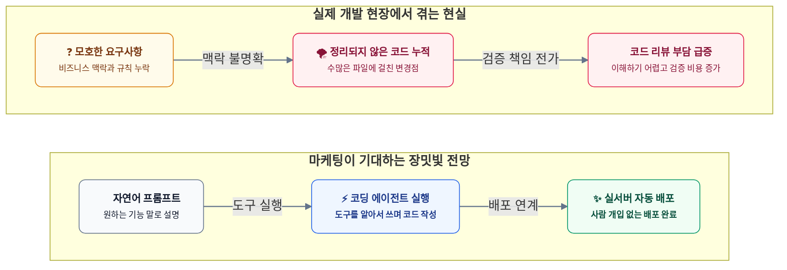
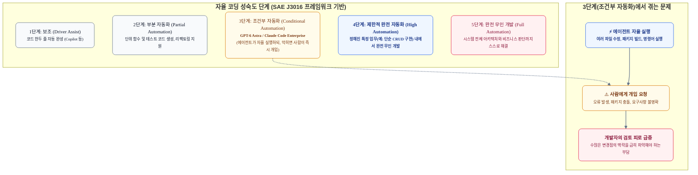
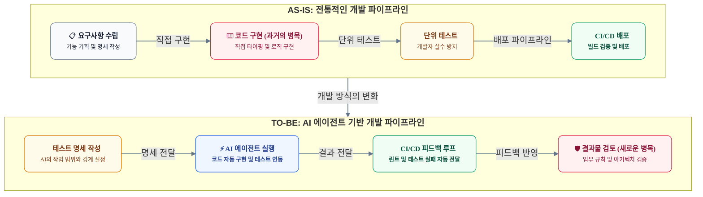
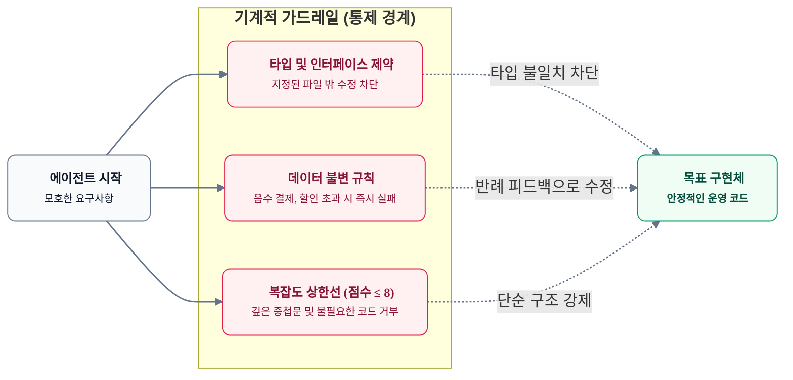
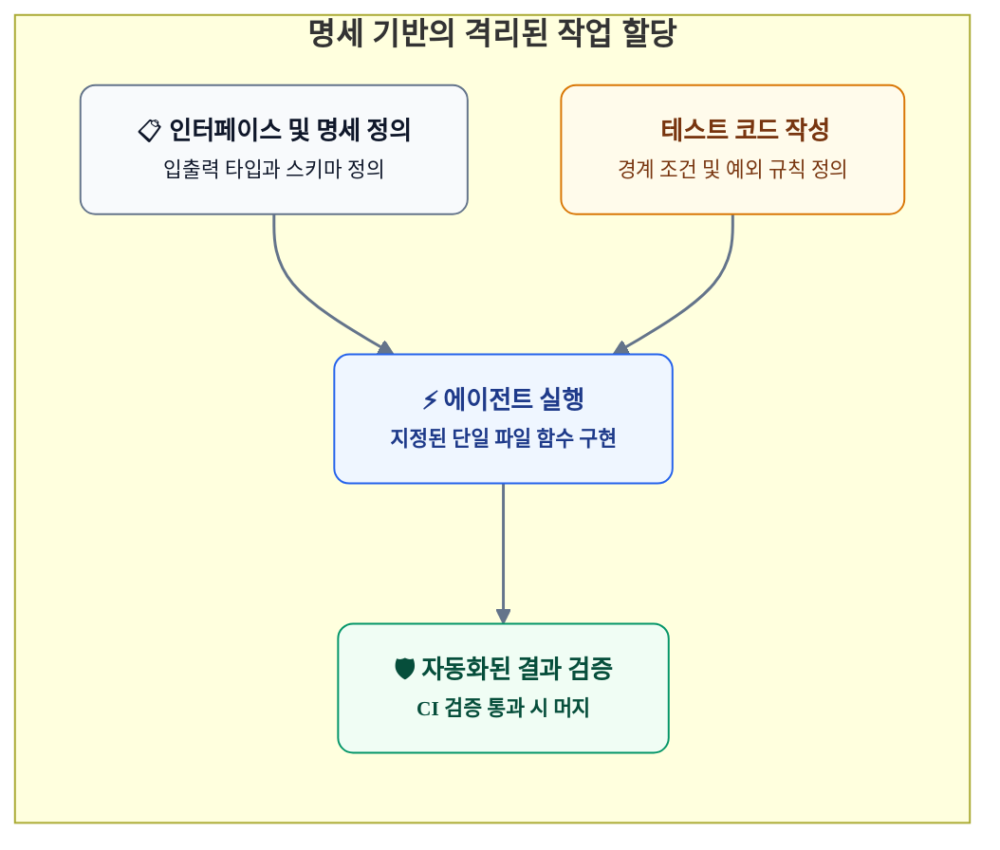
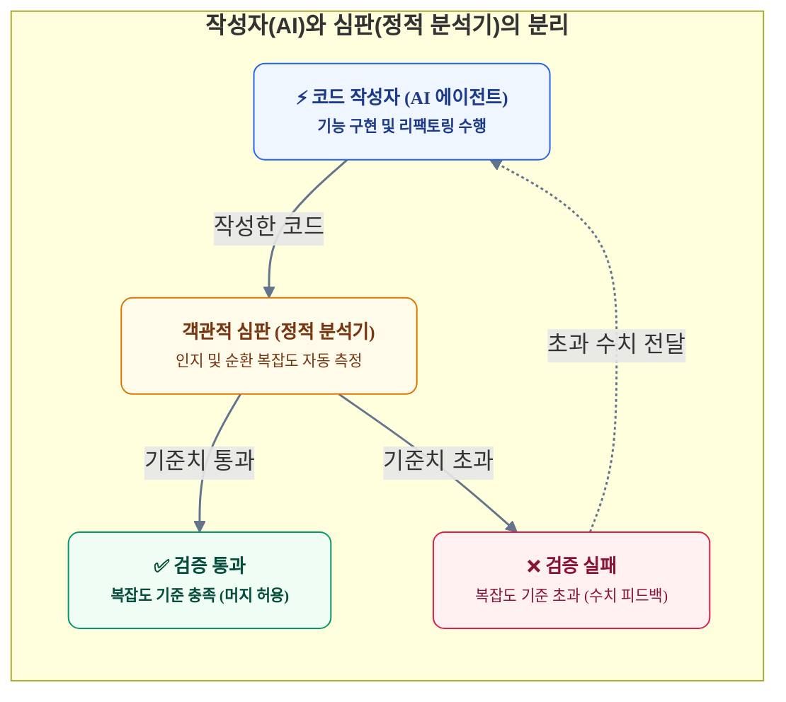

# 왜 새로운 AI 모델이 나올 때마다 개발자는 더 피곤해지는가?
> **GPT-6 Astra 시대, 코딩 에이전트의 '자율'과 통제 인프라의 재설계**

---

## 1. 서론: 반복되는 완전 자율 개발 선언과 실무의 피로감

새로운 파운데이션 모델이 나올 때마다 "자연어 한 줄이면 인프라 배포까지 끝난다"거나 "소프트웨어 엔지니어링의 무인화 시대가 열렸다"는 주장이 끊임없이 나옵니다. 2024년 초창기 LLM 코딩 도구(GPT-4, Claude 3.5 Sonnet) 때부터 시작된 이러한 장밋빛 전망은, 현재의 고도 추론 모델인 **GPT-6 Astra, Claude 4.5 Sonnet, Gemini 3 Developer** 세대까지 그대로 이어지고 있습니다.



그러나 실제 개발 현장에서 체감하는 신뢰도는 여전히 기대에 미치지 못합니다.

코드를 작성하는 속도는 빨라졌지만 검증에 드는 비용이 오히려 늘어나는 생산성의 역설, 그리고 벤치마크 점수와 실제 운영 환경 사이의 격차는 2024년 '바이브 코딩'이란 말이 처음 등장했을 때부터 계속해서 지적되어 온 핵심 병목이었습니다.

새 모델이 출시될 때마다 긴 문맥을 기억하고 스스로 생각하는 추론 능력이 비약적으로 발전해 이전의 한계를 모두 해결했다고 홍보하지만, 현업 개발자들의 의문은 여전히 남아 있습니다. 도구 호출 횟수와 벤치마크 점수는 올랐지만, **"이 코드를 믿고 실서비스에 그대로 배포할 수 있는가?"**라는 질문에는 누구도 자신 있게 답하지 못합니다. 오히려 모델이 더 많은 양의 코드를 단숨에 쏟아내면서, 개발자가 코드를 검토하고 검증하는 데 드는 피로와 부담은 이전보다 훨씬 커졌습니다.

모델의 크기와 계산량이 엄청나게 늘어났음에도 왜 같은 문제가 계속 반복되는 걸까요?

이 글에서는 코딩 에이전트의 자율성을 둘러싼 마케팅적 수사와 소프트웨어 공학의 실체 사이의 간극을 살펴봅니다. 그리고 이것이 단순히 모델 성능의 한계가 아니라 '통제 인프라의 부재'에서 오는 문제임을 짚어보고, 개발자의 검증 피로를 덜면서 에이전트를 실질적인 자산으로 활용하기 위한 아키텍처 관점의 해법을 제시합니다.

---

## 2. 합의되지 않은 '자율'의 정의: 마케팅 vs 소프트웨어 엔지니어링

자율 코딩을 둘러싼 피로의 근본적인 원인은 **'자율'이라는 단어를 바라보는 시각 차이**에서 출발합니다.

### 2.1 마케팅이 말하는 자율 vs 개발자가 요구하는 자율

| 비교 항목 | 마케팅 관점 (단순 작업 자동화) | 소프트웨어 엔지니어링 관점 (시스템 안정성) |
| :--- | :--- | :--- |
| **핵심 초점** | **도구를 스스로 실행하는 과정** | **항상 신뢰할 수 있는 결과물 보장** |
| **주요 지표** | 도구 호출 횟수, 파일 탐색 자율성, 벤치마크 점수 | 런타임 안정성, 데이터 정합성, 부작용 없는 코드, 보안 규정 준수 |
| **실패의 정의** | API 호출 에러, 무한 루프 진입 | 비즈니스 규칙 위반, 데이터 오염, 보안 취약점 배포 |
| **사람의 개입** | "사람 손이 전혀 필요 없는 완전 무인화" | "결과물이 시스템에 미치는 영향에 대한 최종 책임 주체" |

마케팅에서는 에이전트가 터미널을 열고, 패키지를 설치하고, 테스트를 스스로 돌리는 **'도구를 대신 실행해 주는 과정'**을 자율이라 부릅니다. 반면 개발자에게는 비즈니스 규칙을 깨뜨리지 않고, 기존 트랜잭션을 망가뜨리지 않으며 문제가 생겼을 때 안전하게 되돌릴 수 있는 코드를 만드는 **'결과물의 신뢰성과 책임성'**만이 자율의 기준이 됩니다.

### 2.2 SAE 자율주행 기준으로 본 코딩 에이전트의 현재 위치

자동차 자율주행 기준(SAE J3016)의 0~5단계를 소프트웨어 개발에 대입해 보면, 현재 코딩 에이전트가 어느 위치에 와 있는지 명확히 이해할 수 있습니다.



* **1단계 (보조)**: 코드 한두 줄 자동 완성 (초기 인라인 코드 어시스턴트)
* **2단계 (부분 자동화)**: 프롬프트 지시에 따라 독립된 함수나 단위 테스트 코드 생성
* **3단계 (조건부 자동화 - 현재 위치)**: 최신 에이전트가 스스로 계획을 세우고 터미널과 파일을 오가며 코드를 고치지만, **문제가 생기거나 한계에 부딪히면 곧바로 사람이 넘겨받아 해결해야 하는 단계**
* **4단계 (제한적 완전 자동화)**: 엄격하게 규격이 정해진 특정 영역(예: 사전 정의된 인터페이스의 기본 CRUD 구현) 내에서 사람 개입 없이 무인 실행
* **5단계 (완전 무인 개발)**: 비즈니스 전략, 운영 비용, 보안 위험까지 종합적으로 판단하여 사람 없이 개발 완료

현재 프론티어 모델들은 **3단계(조건부 자동화)**에 머물러 있습니다. 자율주행차가 잘 달리다가 돌발 상황에서 갑자기 사람에게 핸들을 넘길 때 운전자의 긴장과 피로가 극에 달하는 것처럼, 코딩 에이전트가 여러 파일에 걸쳐 수백 줄의 코드를 고쳐놓고 "확인해 달라"고 요청할 때 개발자가 느끼는 피로감 역시 매우 큽니다.

### 2.3 소프트웨어 공학의 본질적 난제: 프레더릭 브룩스의 통찰

소프트웨어 공학의 고전 《맨머스 미솔로지》와 기념비적인 논문 〈은총알은 없다〉에서 **프레더릭 브룩스(Fred Brooks)**는 소프트웨어 개발의 복잡성을 두 가지로 명확히 구분했습니다.

> *"소프트웨어의 복잡성은 본질적 복잡성과 부수적 복잡성으로 분리해야 한다. 문법 타이핑, 컴파일 오류 해결, 단순 API 연동은 부수적 복잡성에 불과하다. 진정한 난제는 복잡한 비즈니스 개념을 추상화하고, 데이터 불변식과 시스템 간 상호작용을 설계하는 본질적 복잡성에 있다."*  
> — **Fred Brooks**

최신 코딩 에이전트는 문법을 맞춰 코드를 타이핑하고, 기본 코드를 만들어내며, 외부 라이브러리를 연동하는 것과 같은 **부수적인 수고를 크게 줄여주었습니다.** 하지만 "새로운 할인 정책이 기존 분산 결제 시스템의 환불 트랜잭션과 어떻게 충돌하는가?"와 같은 **본질적인 문제는 모델 크기를 키우거나 생각하는 시간을 늘린다고 해서 저절로 해결되지 않습니다.** 부수적인 잡무가 사라진 자리에, 복잡한 비즈니스 규칙과 시스템 안정성을 검증해야 하는 본질적인 고민만 오롯이 남았기 때문에 개발자의 피로가 줄어들지 않는 것입니다.

---

## 3. AI 코딩 도구의 현주소: 성과와 실제적인 한계 (GPT-6 Astra 사례를 중심으로)

초기 자동 완성 도구부터 최신 에이전트에 이르기까지 코딩 도구의 성능은 크게 발전했습니다. 하지만 이러한 발전에도 불구하고 소프트웨어 개발의 본질적인 어려움은 여전히 남아 있습니다.

### 3.1 코딩 에이전트의 3세대 진화 과정

| 세대 구분 | 대표 모델 및 시기 | 주요 특징 | 실무에서 겪는 한계와 병목 |
| :--- | :--- | :--- | :--- |
| **1세대: 단순 보조 도구** | GPT-4, Claude 3.5 Sonnet (2024) | 코드 자동 완성, 함수 기본 틀 생성, 질의응답 | 프로젝트 전체 맥락 미파악, 파일 간 타입 불일치, 복사·붙여넣기 의존 |
| **2세대: 도구 연동 에이전트** | Claude 3.7/4.0 Sonnet, o1/o3 (2025) | 터미널 명령 실행, 파일 읽기/쓰기, 테스트 자동 실행 | 대화가 길어질수록 엉뚱한 답변, 긴 작업 시 환각 증가, 무한 루프 |
| **3세대: 고도 추론 에이전트** | **GPT-6 Astra, Claude 4.5 Sonnet, Gemini 3 Developer** (2026) | 프로젝트 전체 맥락 파악, 여러 파일에 걸친 코드 수정, 자가 치유 | 기존 업무 규칙과의 충돌, $0.95^{10}$ 오차 누적, 설계상 기회비용 판단 불가 |

### 3.2 3세대 에이전트(GPT-6 Astra)가 보여준 발전

1. **프로젝트 전반의 맥락 파악**:
   * 구체적으로 프롬프트를 일일이 적어주지 않아도, 프로젝트 내 린터 설정, 기존 네이밍 규칙, 패키지 버전을 스스로 파악해 프로젝트 스타일에 맞춰 코드를 작성합니다.
2. **여러 파일에 걸친 일관성 유지**:
   * 한 파일만 보는 것을 넘어 인터페이스 정의, 비즈니스 로직, 데이터 모델, API 핸들러 간의 타입 일관성을 안정적으로 맞춥니다.

### 3.3 여전히 해결해야 할 과제

#### 1) 벤치마크 점수와 실제 운영 환경의 괴리

새로운 프론티어 모델이 나올 때마다 높은 벤치마크 점수가 화제가 됩니다. 언뜻 보면 이제 AI가 사람 없이도 혼자서 개발을 끝낼 수 있을 것 같지만, 실제 서비스 운영 환경과는 여전히 큰 차이가 있습니다.

최신 3세대 모델의 주요 개발 벤치마크 결과는 다음과 같습니다.

| 평가 벤치마크 | GPT-6 Astra | Claude 4.5 Sonnet | Gemini 3 Developer | 평가 내용 및 실무적 의미 |
| :--- | :---: | :---: | :---: | :--- |
| **SWE-bench Verified** | **94.5%** | **93.2%** | **91.8%** | **측정 한계 도달**<br/>단순하고 독립된 환경에서 한 가지 버그를 수정하는 성공률 |
| **SWE-bench Pro**<br/>*(실제 환경 반영)* | **52.4%** | **49.8%** | **46.5%** | **복합 수정 및 리팩토링**<br/>여러 파일에 걸친 구조적 변경 시 성공률이 50%대로 하락 |
| **LiveCodeBench (v4)** | **78.4%** | **75.2%** | **71.6%** | 학습 데이터에 없는 최신 알고리즘 문제 해결력 |
| **Terminal-Bench** | **82.0%** | **80.5%** | **77.8%** | 터미널 명령어 실행, 빌드 및 환경 설정 자율 처리율 |

주목할 점은 **SWE-bench Verified의 90%대 점수**와 **SWE-bench Pro의 50%대 점수** 사이의 차이입니다. 파일 한두 개를 고치는 단순 버그 수정은 90% 이상 성공하지만, 여러 파일에 걸친 인터페이스 변경이나 시스템 전반의 리팩토링 같은 작업에서는 성공률이 절반 수준으로 떨어집니다.

이는 두 벤치마크의 시험 환경이 근본적으로 다르기 때문입니다.

| 비교 항목 | 기존 SWE-bench Verified (단순 버그 수정 환경) | SWE-bench Pro (실제 개발과 유사한 환경) |
| :--- | :--- | :--- |
| **작업 범위** | **1~3개 파일, 수십 줄 수정**<br/>(단순 조건문 추가, 함수 하나 수정) | **10개 이상 파일, 수백~수천 줄 수정**<br/>(인터페이스 개편, 모듈 전면 리팩토링) |
| **작업 단계 수** | **5~10회의 짧은 실행** | **50~100회 이상의 긴 실행 과정**<br/>(작업 목표를 잃지 않고 맥락을 유지해야 함) |
| **작업 성격** | **작은 버그 수정** | **새로운 대형 기능 구현 및 기존 기능 호환성 유지** |
| **품질 검증 기준** | **단위 테스트 통과 여부만 확인** | **메모리·실행 시간 제한, 동시성 이슈, 기존 기능 정상 동작 검증** |
| **테스트 노출 여부** | **테스트 코드를 모델이 미리 볼 수 있음** | **비공개 테스트 세트 사용**<br/>(테스트 통과만을 위한 꼼수 코드 방지) |

시험 방식이 실제 개발 환경과 가까워질수록 단순 버그 수정 지표만으로는 한계가 뚜렷하며, 대규모 프로젝트에 AI를 도입하려면 엄격한 통제 장치가 반드시 필요하다는 점을 알 수 있습니다.

실제 운영 환경과 시험용 벤치마크 사이에는 다음과 같은 구조적 차이가 있습니다.

| 비교 기준 | 벤치마크 환경 (SWE-bench Verified) | 실제 서비스 운영 환경 |
| :--- | :--- | :--- |
| **시스템 환경** | **단순하고 독립된 시험 환경**<br/>단일 도커 컨테이너, 정형화된 이슈 티켓 | **기존 코드가 얽혀 있는 실제 운영 환경**<br/>축적된 기술 부채, 복잡한 업무 규칙, 분산 환경 |
| **합격 기준** | **단위 테스트 통과**<br/>지정된 단위 테스트만 통과하면 성공 판정 | **시스템 전체의 안정성**<br/>데이터 정합성 유지, 메모리 누수 방지, 보안 취약점 예방 |
| **참고 패턴** | **공개 오픈소스 패턴 재현**<br/>GitHub 등에서 흔히 볼 수 있는 전형적인 코드 패턴 | **회사 고유의 업무 규칙**<br/>외부에 공개되지 않은 독자적인 업무 규칙과 아키텍처 |
| **작업 흐름** | **단발성 작업**<br/>1회성 코드 수정 및 제출 | **배포까지 이어지는 다단계 파이프라인**<br/>작업 단계가 늘어날수록 오차 누적 ($0.95^{10}$) |

* **테스트 통과만을 위한 꼼수 코드**: 벤치마크는 특정 단위 테스트만 통과하면 성공으로 판정하므로, 하드코딩이나 임시방편식 코드가 들어가기 쉽습니다. 하지만 실제 운영 환경에 이런 코드가 배포되면 다른 서비스와 연동될 때 데이터 정합성이 깨지면서 심각한 장애로 이어집니다.
* **오픈소스 패턴 암기**: 벤치마크에 사용되는 코드베이스는 이미 AI의 사전 학습 데이터에 포함되어 있을 가능성이 높습니다. 따라서 회사 고유의 업무 규칙이나 독자적인 시스템 구조를 다룰 때는 벤치마크만큼의 성능이 나오지 않습니다.

결국 높은 벤치마크 점수가 실제 운영 환경의 안정성을 보장해 주지는 않습니다. 제한된 시험 환경에서 테스트를 통과하는 것과, 예기치 않은 부작용(사이드 이펙트) 없이 데이터 정합성을 지키며 운영하는 것은 전혀 다른 문제이기 때문입니다.

#### 2) 작업 단계가 늘어날수록 급격히 쌓이는 오차 ($0.95^{10}$의 법칙)

코딩 에이전트는 여러 단계를 연속해서 실행합니다. 한 단계의 정확도가 95%($p=0.95$)에 달하는 뛰어난 모델이라도, 10단계를 연속해서 거치면 최종 작업 성공 확률은 약 60%까지 떨어집니다.

$$P(\text{Success}) = \prod_{i=1}^{n} p_i = (0.95)^{10} \approx 0.598 \quad (59.8\%)$$


여기서 말하는 **"5%의 오차"는 컴파일 에러가 나거나 서버가 다운되는 명시적인 중대 오류를 뜻하지 않습니다.** 실제 애플리케이션 개발에서 즉시 크래시가 발생하는 버그는 컴파일러나 테스트 도구가 즉각 잡아내므로 오히려 문제가 되지 않습니다.

진짜 치명적인 문제는 **"지금 당장은 에러 없이 완벽히 동작하고 테스트도 통과하지만, 비즈니스 로직의 방향이 미세하게 잘못 설정된 침묵하는 오류(Silent Logic Drift)"**입니다.

이러한 미세한 왜곡이 단계가 늘어날수록 눈덩이처럼 커지는 이유는 다음과 같습니다.

* **정상 동작이라는 착각 (테스트 통과)**: 겉보기에는 문법도 맞고 테스트도 통과하므로, 개발자나 CI는 아무런 의심 없이 다음 작업으로 넘어갑니다.
* **오염된 전제의 고착화**: 첫 단계에서 모호한 요구사항을 만난 AI는 스스로 그럴듯한 가정을 세워 코드를 작성합니다. 문제는 다음 단계(Step 2, Step 3...)에서 AI가 **이 왜곡된 초기 코드를 '원래 시스템의 절대 규칙'으로 믿고 그 위에 후속 로직을 계속 쌓아 올린다**는 점입니다.
* **불필요한 땜질 코드와 기술 부채 폭발**: 뒤로 갈수록 초기 가정의 모순이 드러나지만, AI는 근본 설계를 고치지 않고 이를 끼워 맞추기 위해 불필요한 우회 로직과 조건문을 덧붙입니다. 결국 10단계에 이르면 누구도 손댈 수 없는 스파게티 코드가 됩니다.

> 💡 **실무 사례: 결제·정산 시스템에서의 미세한 로직 왜곡 확산 과정**
>
> * **1단계 (결제 로직 구현)**:
>   * "회원 등급 할인과 쿠폰 할인을 적용하라"는 지시에, AI는 **쿠폰 할인을 먼저 적용한 뒤 남은 금액에 등급 할인을 적용**하도록 코드를 작성함.
>   * 컴파일 에러도 없고 결제 계산도 돌아가므로 테스트를 통과함. 하지만 실제 사내 규칙은 **등급 할인을 먼저 적용**하는 정책이었음.
> * **3단계 (부분 환불 및 취소 모듈 구현)**:
>   * AI는 1단계 코드를 절대적인 기준으로 믿고 환불 산식 코드를 구현함.
>   * 원래 의도와 다른 할인 순서 때문에 부분 취소 시 복원되어야 할 쿠폰 금액과 등급 할인 복원 비율이 어긋나기 시작함.
> * **7단계 (회계 정산 및 세금 계산 연동)**:
>   * 앞선 로직을 기반으로 정산 테이블을 작성하던 중, 부가세 단수 차이(10원 단위 불일치)와 공급가액 불일치가 발생함.
>   * AI는 1단계의 결제 순서를 바로잡는 대신, **"차액이 발생하면 기타 잡손실로 보정 처리하는 임시 if문"**을 추가하여 억지로 테스트를 통과시킴.
> * **10단계 (최종 배포 직전)**:
>   * 모든 단위 테스트는 통과하지만, 비즈니스 규칙과 회계 정산 흐름이 완전히 뒤틀린 채 불필요한 예외 처리로 가득 찬 복잡한 코드가 완성됨.

#### 3) 아키텍처 설계상의 기회비용(트레이드오프) 판단 한계

AI는 주어진 요구사항대로 동작하는 코드를 잘 짜지만, 시스템 설계 차원의 결정까지 내리지는 못합니다.

* 데이터 일관성을 조금 양보하더라도 응답 속도를 높일 것인가?
* 기술 부채를 감수하고 빠른 배포를 선택할 것인가, 아니면 구조를 먼저 다듬을 것인가?
* 이러한 결정은 코드만 보고 내릴 수 있는 것이 아니며, **회사의 비즈니스 방향, 팀의 운영 역량, 인프라 비용** 등을 종합적으로 저울질해야 하는 사람의 몫이기 때문입니다.

---

## 4. 개발 패러다임의 이동: 도구는 같지만 역할이 바뀌었다

AI 코딩 에이전트가 도입되면서 개발 파이프라인 각 단계의 역할도 크게 바뀌고 있습니다.



### 4.1 TDD의 변화: 개발자 실수 방지에서 'AI 제어 명세서'로
익스트림 프로그래밍(XP)과 TDD의 창시자 **켄트 벡(Kent Beck)**은 AI 시대의 엔지니어링 역할 변화에 대해 명료한 통찰을 남겼습니다.

> *"AI가 코드의 90%를 대신 작성해 주는 시대라면, 엔지니어의 일은 남은 10%의 코드를 타이핑하는 데 머물지 않는다. 100%의 코드가 비즈니스 의도대로 무결하게 동작하도록 제약 조건을 설계하고, 테스트를 통해 AI의 행동 반경에 엄격한 경계(Fencing)를 설정하는 것이 진정한 엔지니어의 일이다."*  
> — **Kent Beck**

과거 테스트 주도 개발(TDD)은 개발자 자신의 논리적 실수를 방지하기 위한 안전장치였습니다. 반면 AI 코딩 환경에서의 테스트 코드는 **"어디로 튈지 모르는 AI가 정해진 규칙 안에서만 움직이도록 강제하는 안전선"** 역할을 합니다. 테스트 코드를 먼저 짜두지 않고 에이전트에게 구현을 맡기는 것은 브레이크 없는 자동차를 운전하는 것과 같습니다.

### 4.2 CI/CD의 진화: 단순 배포 파이프라인에서 '스스로 고치는 피드백 루프'로
CI/CD 역시 단순히 배포 직전에 코드를 검증하는 관문에 머물지 않습니다. 에이전트가 코드를 올리면, CI 환경에서 컴파일 에러, 린트 경고, 테스트 실패 로그를 수집해 에이전트에게 다시 전달하고, 에이전트가 이를 보고 코드를 스스로 수정하는 **실시간 피드백 루프**로 동작합니다.

### 4.3 개발 병목의 이동: 코드 작성에서 결과 검토로
소프트웨어 공학의 대가 **마틴 파울러(Martin Fowler)**는 소프트웨어 개발 비용의 본질에 대해 다음과 같이 강조했습니다.

> *"프로그래밍에서 코드를 작성하는 시간보다, 기존 코드를 읽고 이해하는 데 최소 10배 이상의 시간이 소요된다. 읽기 쉬운 코드가 아니라면 아무리 빨리 작성되어도 즉시 막대한 부채가 된다."*  
> — **Martin Fowler**

에이전트가 대량의 코드를 빠르게 생성할수록, 맥락을 파악하기 어려운 코드가 순식간에 쌓일 수 있습니다. 이에 따라 개발 병목 지점도 완전히 바뀌었습니다.
* **과거**: 요구사항을 코드로 변환해 직접 타이핑하는 속도
* **현재**: 쏟아져 나오는 코드 속에서 **구조적 문제, 아키텍처 위반, 보안 취약점, 데이터 정합성 오류를 찾아내고 검증하는 속도**

---

## 5. 개발 피로를 줄이는 실무 가이드: AI 통제의 두 축 (의도 명확화와 복잡도 정량화)

에이전트 도입으로 인한 검토 피로를 줄이고 실제 생산성을 높이려면, AI 코딩을 통제하는 **두 가지 핵심 축인 '업무 의도를 명확하게 정의하는 것'과 '코드 복잡도를 숫자로 통제하는 것'**을 이해해야 합니다.

* **제1축: 업무 의도를 명확하게 정의하기 (기능적 정상 동작)**: 모호한 말로 설명하는 대신 **인터페이스 명세(OpenAPI), 데이터베이스 스키마(DDL), 속성 기반 테스트(PBT)**처럼 컴퓨터가 자동으로 검증할 수 있는 규격으로 만듭니다. 이를 통해 AI가 엉뚱한 코드를 짜거나 업무 규칙을 어기는 문제를 막습니다.
* **제2축: 코드 복잡도를 숫자로 통제하기 (유지보수하기 쉬운 구조)**: 사람이 눈으로 보며 주관적으로 리뷰하는 데 그치지 않고, **정적 분석 도구를 통해 인지 복잡도와 순환 복잡도 상한선**을 정해둡니다. 이를 통해 코드가 쓸데없이 길어지거나 복잡해지는 문제를 원천 차단합니다.

가드레일, 프롬프트 패턴, 테스트 도구, CI/CD 환경은 모두 **이 두 축을 AI 에이전트에게 자동으로 강제하기 위한 통제 환경(하니스)**에 해당합니다.


*그림: AI 코딩 에이전트의 결과물을 검증해 안정적인 운영 코드로 바꾸는 두 가지 핵심 통제 축 (명세 기반의 의도 정의 vs 정적 분석 기반의 복잡도 통제)*

### 5.1 원칙 1: 작업 범위를 제한하는 가드레일: 말로 하는 권고가 아닌 기계적 제약

사람의 말은 본질적으로 모호합니다. 온갖 예외 상황과 업무 규칙을 말로 빠짐없이 설명하기는 매우 어렵습니다.

요구사항이 모호한 상태에서 아무 제약 없이 에이전트에게 작업을 맡기면, AI는 제멋대로 가정을 세우고 엉뚱한 코드를 만들어내기 십상입니다.

가드레일의 핵심은 프롬프트로 친절하게 부탁하는 것이 아닙니다. **인터페이스 타입 제약, 데이터 제약 조건, 정적 분석 도구와 같은 기계적인 벽을 세워 AI가 엉뚱한 길로 빠지지 못하게 막는 것**입니다.


*그림: 명세 계약, 정적 분석, 린트 규칙이라는 기계적 제약이 잘못된 경로를 차단하여 AI를 안정적인 결과물로 유도하는 구조*



따라서 엔지니어는 단순히 코드를 타이핑하는 사람을 넘어, **AI가 정해진 경계를 벗어나지 않도록 인터페이스, 제약 조건, 정적 분석기를 설계하는 통제 설계자(Harness Architect)**가 되어야 합니다.

### 5.2 원칙 2: 작업 범위 격리와 명세 기반 위임

프로젝트 전체 파일의 수정 권한을 AI에게 한 번에 넘겨서는 안 됩니다. 엔지니어가 인터페이스 명세와 테스트 코드를 미리 작성해 두고, AI에게는 특정 파일 하나와 실패하는 테스트만 넘겨 작업 범위를 좁혀주어야 합니다.



### 5.3 실무 예시: 명세 기반의 에이전트 제어 프롬프트 패턴

AI 코딩 환경에서는 인터페이스 문법을 일일이 타이핑하기보다, **OpenAPI나 데이터베이스 스키마와 같은 명세를 프롬프트와 결합하여 AI의 작업 범위를 어떻게 좁혀주는가**가 핵심입니다.

명세 중심 프롬프트는 구현 방식을 길게 설명하는 대신, **어떤 규칙을 절대 어겨서는 안 되는지(제약 조건과 불변 규칙)를 명확히 선언**하여 AI가 엉뚱한 길로 새지 않도록 만듭니다.

> #### 📋 [에이전트 제어 프롬프트 템플릿 예시]
>
> **1. 명세 및 기준 규칙 정의**
> * API 명세: `docs/api/settlement-v1.yaml` (OpenAPI 3.1)
> * 데이터 스키마: `schema/migrations/001_settlement.sql` (PostgreSQL DDL)
> * *모든 구현은 위 두 문서에 정의된 입출력 타입, 유효성 검증 규칙, 데이터베이스 제약 조건을 절대적인 기준으로 삼는다.*
>
> **2. 작업 범위 제한**
> * 작업 대상: `internal/settlement/calculator.go` 파일 내 정산 로직 구현
> * *작업 범위를 벗어난 디렉터리 접근, 임의의 파일 생성, 새로운 외부 패키지 추가를 금지한다.*
>
> **3. 필수 규칙 및 부작용 방지**
> * **순수 함수로 작성**: 외부 네트워크 호출이나 데이터베이스 직접 쓰기 작업을 하지 않는다.
> * **업무 규칙 준수**: 할인 총액은 원금을 넘을 수 없으며, 최종 결제액은 반드시 `(원금 - 할인액)`과 같아야 한다.
> * **입력 오류 처리**: 잘못된 값(음수 금액, 정의되지 않은 회원 등급 등)이 들어오면 임의로 넘기지 말고 정의된 에러 코드를 반환한다.
>
> **4. 자체 검증 및 수정**
> * `calculator_test.go`에 정상 케이스뿐만 아니라 경계 조건(원금 0원, 최대 할인 초과, 유효하지 않은 쿠폰)을 검증하는 테스트 코드를 작성하라.
> * 컴파일 에러나 테스트 실패가 발생하면 실패 원인을 분석하여 스스로 코드를 수정한 뒤 작업을 끝마쳐라.

이처럼 API 명세와 데이터베이스 스키마를 기준선으로 제공하고 작업 범위와 핵심 규칙을 못 박아두면, AI가 엉뚱한 필드를 추가하거나 업무 규칙을 피해 가는 문제를 효과적으로 막을 수 있습니다.

### 5.4 실무 관점의 검토: "결국 사람이 검증해야 한다면, 직접 작성하는 것과 무엇이 다른가?"

배포된 시스템의 최종 책임을 엔지니어가 져야 한다면 다음과 같은 의문이 생길 수 있습니다.  
*"어차피 코드를 한 줄씩 확인해야 한다면, 차라리 처음부터 직접 작성하는 것이 낫지 않은가? 타인이 작성한 코드를 역추적하고 디버깅하는 것이 더 번거롭지 않은가?"*

이러한 지적은 타당하며, 실제로 검증 전략 없이 AI를 도입했을 때 발생하는 대표적인 비효율입니다.

#### 1) 한 줄씩 눈으로 검토할 때 겪는 한계
에이전트가 만들어낸 수백 줄의 코드를 에디터에서 한 줄씩 눈으로 읽으며 버그를 찾으려 하면, 직접 짤 때보다 오히려 머리가 더 아프고 피로해집니다. 남이 작성한 낯선 코드 흐름과 변수명을 거꾸로 추적하는 일은 매우 많은 에너지를 소모하기 때문입니다.

#### 2) 만드는 것보다 검증하는 것이 훨씬 쉽다: 속성 기반 테스트
경험 많은 팀은 **코드를 직접 만드는 것보다 만들어진 코드가 올바른지 검증하는 것이 훨씬 빠르고 쉽다는 점(검증의 비대칭성)**을 활용해 이 문제를 해결합니다.

* **문제를 푸는 것과 답을 맞추는 것의 차이**: 복잡한 수학 문제의 정답을 직접 찾아내는 데는 오랜 시간이 걸리지만, 이미 나온 답이 맞는지는 대입 한 번으로 금방 확인할 수 있습니다.
* **소프트웨어 개발에 적용하기**:
  * **직접 짤 때 겪는 부담**: "원금이 100만 원이고 VIP 회원이면 10%를 할인하되, 최종 결제액은 절대 음수가 될 수 없다"는 규칙을 구현하려면 개발자는 오버플로우, 100% 초과 할인, 빈 값 처리 등 온갖 예외 상황을 머릿속으로 떠올리며 조건문을 직접 쳐야 합니다.
  * **컴퓨터에게 검증 맡기기**: 반면 검증 중심 접근에서는 핵심 규칙 하나만 정의합니다.
    $$\forall \text{req}, \quad 0 \le \text{FinalPayAmount} \le \text{OriginalTotal}$$
    그런 다음 **속성 기반 테스트(Property-Based Testing)** 도구를 사용해 수만 개의 무작위 값과 극단적인 경계값을 코드에 한꺼번에 쏟아부어 규칙을 어기는 경우가 있는지 컴퓨터가 눈 깜짝할 사이에 확인하도록 만듭니다.
  * **실패한 사례를 주고 스스로 고치게 하기**: 만약 테스트 도중 규칙을 위반하는 반례(예: 결제액이 0원일 때 0 나누기 에러 발생)가 나오면, 사람이 직접 코드를 디버깅할 필요 없이 해당 반례를 AI에게 던져주고 "이 상황에서 에러가 나니 고쳐라"고 시킵니다.

#### 3) 코드 한 줄 한 줄 대신 시스템 경계와 규칙 검토하기
엔지니어는 코드의 모든 줄을 일일이 읽기보다, **컴퓨터가 자동으로 검증할 수 있는 테스트와 경계를 만드는 일**에 집중해야 합니다.

| 구분 | 눈으로 일일이 읽는 방식 | 검증 도구를 활용하는 방식 |
| :--- | :--- | :--- |
| **주요 작업** | 수백 줄의 코드를 직접 눈으로 독해 | 명확한 테스트 코드와 입출력 명세 설계 |
| **내부 구현 검증** | 변수명, 오타, 분기문 일일이 확인 | 테스트 코드와 정적 분석 도구로 자동 검증 |
| **엔지니어 집중 영역** | 세부 구현 방식 (어떻게 짰는가) | **외부 연동 정합성, 시스템 부작용, 보안 위험 (규칙을 지켰는가)** |
| **소요 시간** | 코드 분석과 디버깅으로 피로 증가 | 명세 작성과 경계 검토 중심으로 효율성 확보 |

핵심은 **세부 코드 타이핑은 AI에게 맡기되, 엔지니어는 시스템의 경계와 업무 규칙이 올바른지 검토하는 역할**로 중심축을 옮기는 것입니다.

### 5.5 "동작은 하지만 너무 복잡하다": 너무 복잡도가 높은 코드와 기술 부채 통제

에이전트 도입 시 마주하는 또 다른 골칫거리는 **"기능은 정상 동작하고 테스트도 다 통과하지만, 너무 복잡도가 높아 나중에 손대기 힘든 코드"**가 만들어지는 문제입니다.

간단한 if문 하나면 충분한 곳에 디자인 패턴을 남발하거나, 불필요한 클래스와 래퍼 객체를 겹겹이 감싸는 오버엔지니어링이 대표적인 예입니다.

#### 1) 일일이 잔소리하기와 무조건 승인하기의 한계
전통적인 코드 리뷰 방식은 에이전트 협업 환경에서 한계를 보입니다.

* **코드 한 줄마다 일일이 수정을 요구하는 방식**: AI가 만든 코드를 보며 사람이 한 줄씩 트집을 잡고 다시 짜라고 반복해서 지시하면, 결국 직접 짜는 것보다 개발자의 피로만 더 쌓입니다.
* **테스트만 통과하면 무조건 승인하는 방식**: 당장 기능은 돌아가니 배포는 빠르지만, 얼마 지나지 않아 아무도 손댈 수 없는 스파게티 코드가 되어 시스템 유지보수를 가로막습니다.

#### 2) 코드 복잡도를 숫자로 측정하기: 작성자와 심판의 분리

코드가 얼마나 복잡한지는 사람의 주관적인 느낌이 아니라, **정적 분석 도구를 통해 객관적인 숫자**로 측정할 수 있습니다.

* **순환 복잡도(Cyclomatic Complexity)**: 코드 내에서 갈라지는 분기 경로의 수를 계산합니다. `if`, `for`, `switch` 같은 조건문이나 반복문이 늘어날 때마다 숫자가 커집니다.
* **인지 복잡도(Cognitive Complexity)**: 사람이 코드를 읽을 때 얼마나 이해하기 어려운지를 측정합니다. 단순히 조건문 개수만 세는 것이 아니라, 조건문이 여러 겹 중첩(Nesting)될수록 훨씬 높은 점수를 매깁니다.
* **할스테드 복잡도(Halstead Metrics)**: 사용된 연산자와 변수들의 종류 및 사용 빈도를 바탕으로 코드의 길이와 난이도를 측정합니다.



복잡도 평가는 AI 모델의 주관적인 판단에 맡겨서는 안 되며, **정적 분석 도구**가 담당해야 합니다. AI는 코드를 만드는 역할이고, 그 코드가 기준에 맞는지 판정하는 것은 객관적인 도구의 몫입니다.

> **💡 [정적 분석 도구와 AI 코딩 제어의 두 축]**  
> 정적 분석 도구는 코드의 구조적인 복잡도(제2축)를 잘 잡아내지만, 코드가 실제 비즈니스 요구사항을 제대로 만족하는지(제1축)까지는 알지 못합니다.  
> 따라서 **API 명세, 데이터베이스 스키마, 속성 기반 테스트로 업무 규칙의 정확성(제1축)**을 검증하고, **정적 분석 도구로 코드 복잡도(제2축)**를 통제해야 합니다. 두 축이 함께 맞물려 돌아가야 업무 규칙을 완벽히 지키면서도 읽기 쉬운 깔끔한 코드를 얻을 수 있습니다.

#### 3) Makefile로 검증 환경 묶어주기

우리가 기존에 사용하던 도구들(컴파일러, 린터, 테스트 러너, CI/CD)은 AI 시대에도 여전히 강력합니다. AI는 이러한 도구를 대체하는 존재가 아니라, 이 도구들을 실행하고 결과를 확인하는 주체에 가깝습니다.

이때 여러 명령어와 복잡한 옵션을 하나로 묶어 AI에게 명확한 실행 창구를 만들어주는 것이 바로 **`Makefile`**입니다.

* **단순한 실행 명령어 제공**:
  복잡한 린터 옵션을 일일이 칠 필요 없이 `make test`, `make lint`, `make complexity` 등으로 도구 실행 명령을 단순화합니다.
* **로컬 환경과 CI 환경의 일치**:
  로컬에서 실행하는 검증 명령과 CI 파이프라인에서 실행하는 명령을 동일하게 맞춰 환경 차이로 인한 오류를 없앱니다.
* **단계별 순차 검증 체계**:
  컴파일(문법) ➔ 린트(스타일) ➔ 복잡도(구조) ➔ 테스트(기능) 순서로 연결해 문제가 발생했을 때 즉시 원인을 알려줍니다.

##### A. Python 환경: CLI 기반 복잡도 제어
* **`complexipy`**: 인지 복잡도를 함수 단위로 측정하여 기준치를 넘으면 에러(종료 코드 1)를 내는 경량 CLI 도구
* **`radon`**: 순환 복잡도(`radon cc`), 할스테드 지표(`radon hal`), 유지보수성 지수(`radon mi`)를 점수화하는 종합 분석 도구

```makefile
# Makefile (Python): 정량적 복잡도 가드레일 예시
COMPLEXITY_THRESHOLD := 8
MIN_MAINTAINABILITY_INDEX := 75

.PHONY: complexity-guard-py
complexity-guard-py:
	@echo "🔍 [1/3] 인지 복잡도 검증 중..."
	@poetry run complexipy src/ --max-complexity $(COMPLEXITY_THRESHOLD)
	@echo "🔍 [2/3] 순환 복잡도 검증 중..."
	@poetry run radon cc src/ -a -nc --total-average -s --max A
	@echo "🔍 [3/3] 유지보수성 지수 검증 중..."
	@poetry run radon mi src/ -min $(MIN_MAINTAINABILITY_INDEX) -s
	@echo "✅ Python 복잡도 기준 통과 완료."
```

##### B. Go 환경: AST 파싱 기반 통합 분석
Go는 언어 자체가 단순하고 명확하여 정적 분석 도구를 붙이기에 매우 좋습니다.

* **통합 린터 (`golangci-lint`)**: 여러 정적 분석 도구를 묶어 빠르게 병렬로 실행합니다.
* **`gocognit` & `nestif`**: 인지 복잡도 상한(예: 8)과 조건문 중첩 깊이를 제한하여, 조기 반환(`early return`)을 적극적으로 쓰도록 유도합니다.
* **`ireturn`**: 불필요하게 인터페이스를 남발하지 않고 구체 타입(Concrete Type)을 반환하도록 유도합니다.
* **컴파일 시 인터페이스 구현 확인**: `var _ SettlementContract = (*SettlementServiceImpl)(nil)` 구문을 통해 인터페이스를 제대로 구현했는지 컴파일 단계에서 확인합니다.
* **공식 포매터 사용 (`gofmt`)**: 코드 포맷을 통일하여 서식 관련 리뷰 소요를 없앱니다.

```makefile
# Makefile (Go): golangci-lint 기반 복잡도 검증 예시
.PHONY: complexity
complexity:
	@echo "🔍 Go 복잡도 및 아키텍처 제약 검증 중..."
	@golangci-lint run \
		--enable=gocognit \
		--enable=nestif \
		--enable=gocyclo \
		--max-issues-per-linter=0 \
		--out-format=colored-line-number,html:complexity_report.html \
		./...
	@echo "----------------------------------------------------------"
	@echo "📊 [인지 복잡도] Top 5 함수 및 평균:"
	@gocognit -top 5 -avg .
	@echo "----------------------------------------------------------"
	@echo "📊 [순환 복잡도] Top 5 함수 및 평균:"
	@gocyclo -top 5 -avg .
	@echo "----------------------------------------------------------"
```

다음은 실제 백엔드 환경에서 `make complexity`를 실행하여 복잡도 지표를 산출한 결과입니다.

```bash
❯ make complexity
==> [3/5] 인지/순환 복잡도 검증 및 정량 지표 산출 중...
    - 복잡도 가드레일 통과 (리포트: complexity_report.html)
----------------------------------------------------------
📊 [인지 복잡도] Top 5 함수 및 평균:
22 config LoadConfig internal/config/config.go:31:1
19 middleware BotOGMiddleware internal/middleware/bot_og.go:73:1
15 middleware AuthMiddleware internal/middleware/auth.go:14:1
14 main main cmd/server/main.go:26:1
9 usecase (*userUsecase).SignUp internal/usecase/user_usecase.go:54:1
Average: 2.59
----------------------------------------------------------
📊 [순환 복잡도] Top 5 함수 및 평균:
12 config LoadConfig internal/config/config.go:31:1
11 middleware BotOGMiddleware internal/middleware/bot_og.go:73:1
10 usecase (*userUsecase).SignUp internal/usecase/user_usecase.go:54:1
9 main main cmd/server/main.go:26:1
8 usecase (*userUsecase).Login internal/usecase/user_usecase.go:112:1
Average: 2.96
----------------------------------------------------------
```

에이전트에 백엔드 복잡도 분석을 요청하면, 명령 실행 결과를 바탕으로 다음과 같은 구조화된 요약 리포트를 얻을 수 있습니다.

> 💬 **프롬프트 예시:**  
> *"backend의 complexity를 확인하고 평가해주세요."*

> 📋 **정량 분석 및 평가 결과 요약**
> 
> **1. 정량 지표 요약**
> 
> | 구분 | 전체 평균 | 최고 점수 함수 | 상태 |
> | :--- | :---: | :--- | :---: |
> | **인지 복잡도** | **2.59** | `LoadConfig` (22) | **통과 (0건 위반)** |
> | **순환 복잡도** | **2.96** | `LoadConfig` (12) | **통과 (0건 위반)** |
> | **중첩 깊이 (`nestif`)** | - | 3단계 초과 없음 | **통과 (0건 위반)** |
> 
> **2. 주요 함수별 복잡도 분석**
> * **`LoadConfig` (인지 22 / 순환 12)**:
>   * **원인**: 여러 환경 변수의 유효성 검증 및 기본값(fallback) 분기문 누적
>   * **분석**: 설정 초기화 함수의 전형적인 패턴으로, 임계치(30) 이내이므로 정상 범위
> * **`BotOGMiddleware` (인지 19 / 순환 11)**:
>   * **원인**: 크롤러/SNS 봇 User-Agent 감지 및 OG 메타 태그 분기 처리
>   * **분석**: 미들웨어 성격상 조건 분기가 집중되었으나 기준치 내에서 통제됨
> * **`AuthMiddleware` (인지 15)**:
>   * **원인**: Bearer 토큰 추출, 서명 검증, 클레임 파싱 등 다단계 가드 조건 누적
> * **`main` (인지 14 / 순환 9)**:
>   * **원인**: DB 연결, 서버 기동, Graceful Shutdown 처리 등 부트스트랩 에러 핸들링
> * **`SignUp` (인지 9 / 순환 10)**:
>   * **원인**: 비즈니스 로직 진입점의 입력값 검증 및 유효성 체크
>   * **분석**: 핵심 비즈니스 로직 계층의 복잡도가 10 이하로 매우 낮게 유지됨
> 
> **3. 종합 평가: `우수`**
> 1. **코드베이스 품질 우수**:
>    * 산업 표준 권장치(함수 평균 5~10 미만) 대비 **전체 평균 인지 복잡도 2.59, 순환 복잡도 2.96**으로 간결한 수준을 유지
> 2. **책임 분리와 아키텍처 준수**:
>    * 핵심 비즈니스 로직(Usecase)의 복잡도가 10 미만으로 단일 책임 원칙(SRP)을 적절히 준수
>    * 복잡도 10 이상인 함수들은 설정 로드, 미들웨어 분기, 서버 진입점(`main`) 등 인프라/진입 계층에 국한
> 3. **개선 고려 사항**:
>    * 추후 리팩토링 시 `LoadConfig`의 환경 변수 로딩을 파싱 헬퍼 함수로 세분화하거나 전용 라이브러리를 도입하면 최고 인지 복잡도를 10 이하로 추가 경감 가능

##### 에이전트가 스스로 코드를 고치는 흐름
1. 에이전트가 코드를 작성한 후 `make complexity` 명령을 실행합니다.
2. 조건문이 3중 이상 중첩되어 린터 기준(인지 복잡도 > 8)을 넘어서면 명령이 실패합니다.
3. 에이전트는 에러 로그(`gocognit: cognitive complexity 13 of func ... is high (> 8)`)를 확인하고, **조기 반환(`early return`)을 적용하거나 작은 함수로 분리하여 복잡도를 낮춘 뒤 작업을 마칩니다.**

##### C. 실전 사례: Makefile 기반의 테스트 관리 — 사람을 위한 HTML과 AI를 위한 Markdown의 결합

소프트웨어 엔지니어링에서 단위 테스트와 시나리오 검증은 단순한 합격/불합격 판정을 넘어, **사람과 AI가 같은 데이터를 바탕으로 소통하고 검토하는 핵심 협업 매개체**입니다.

이때 핵심은 `make test`라는 약속된 단일 명령을 통해, **사람이 검토하기 편한 결과물**과 **AI가 분석하기 편한 결과물**을 동시에 만들어내는 것입니다.

* **사람을 위한 시각화 (`test_report.html`)**:
  * 개발자는 끝없는 터미널 로그를 스크롤하는 대신, 웹 브라우저에서 패키지별 시나리오 계층 구조, 실행 시간, 성공/실패 여부를 직관적인 UI로 한눈에 파악합니다.
* **AI를 위한 구조화된 명세 (`test_report.md`)**:
  * AI에게 방대한 HTML 파일이나 비정형 콘솔 출력을 그대로 넘기면 토큰 낭비와 환각이 발생합니다. 패키지별 요약 테이블과 실패 원인(Expected vs Actual Diff, 에러 발생 파일 및 라인 번호)이 정형화된 마크다운 포맷으로 주어질 때 AI는 가장 빠르고 정확하게 디버깅에 착수할 수 있습니다.

```makefile
# Makefile (Go): HTML과 Markdown을 동시 생성하는 다층 테스트 하니스 예시
.PHONY: test
test:
	@echo "==> 테스트 실행 및 다층 리포트(HTML & Markdown) 생성 중..."
	@go test -v -coverprofile=coverage.out -json ./... > test_result.json; \
	TEST_EXIT=$$?; \
	cat test_result.json | go-test-report -o test_report.html; \
	go run ./cmd/testreport test_result.json; \
	rm -f test_result.json; \
	exit $$TEST_EXIT
```

실제 백엔드 프로젝트에서 `make test`를 실행하면, 웹 브라우저용 `test_report.html` 생성과 동시에 콘솔 및 파일로 다음과 같은 AI 맞춤형 마크다운 리포트가 즉시 도출됩니다.


*그림: `make test` 실행 시 자동 생성되는 인터랙티브 HTML 테스트 리포트 화면 (패키지별 시나리오 계층 구조, 실행 시간, 개별 성공/실패 상태 시각화)*

```markdown
# 🧪 Unit Test & Scenario Report
> **종합 결과:** ❌ FAIL (총 38개 중 통과 33개, 실패 4개)  
> **총 소요 시간:** 0.86s  

## 📊 1. 패키지별 테스트 및 커버리지 요약
| 패키지 | 상태 | 테스트 수 | 통과 | 실패 | 커버리지 | 소요 시간 |
| :--- | :---: | :---: | :---: | :---: | :---: | :---: |
| `internal/usecase` | ✅ PASS | 6 | 6 | 0 | **21.1%** | 0.00s |
| `internal/middleware` | ✅ PASS | 6 | 6 | 0 | **38.1%** | 0.00s |
| `pkg/utils` | ❌ FAIL | 25 | 21 | 4 | **81.2%** | 0.01s |

## ❌ 2. 실패한 테스트 상세 로그 (AI 디버깅용)
### 🚨 `TestExtractSummary/마크다운_기본_서식_및_링크_정제` (`pkg/utils`)
```text
Error: Not equal: 
       expected: "1. 들어가며: 공식 문서 본 포스트는 생성형 AI와 LLM Ops의 핵심을 다룹니다."
       actual  : "들어가며: 공식 문서 본 포스트는 생성형 AI와 LLM Ops의 핵심을 다룹니다."
Diff:
--- Expected
+++ Actual
-1. 들어가며: 공식 문서 본 포스트는 생성형 AI와 LLM Ops의 핵심을 다룹니다.
+들어가며: 공식 문서 본 포스트는 생성형 AI와 LLM Ops의 핵심을 다룹니다.
```

에이전트에 테스트 결과 분석을 요청하면, 화면에 출력된 마크다운과 `test_report.md`를 바탕으로 다음과 같이 실패 원인을 정밀 분석하고 구체적인 코드 수정안을 즉시 제안합니다.

> 💬 **프롬프트 예시:**  
> *"backend를 make test하고 결과를 분석해주세요."*

> 📋 **AI 에이전트의 테스트 결과 분석 및 조치 제안 리포트**
> 
> **1. 테스트 결과 요약**
> * **종합 판정**: ❌ FAIL (총 38개 중 통과 33개, 실패 4개)
> * **핵심 로직 무결성**: 회원가입/인증(`usecase`, 6/6), 봇 감지/캐싱(`middleware`, 6/6) 100% 정상 통과
> * **오류 집중 영역**: 텍스트 요약 유틸리티([`pkg/utils/markdown.go`](file:///home/yundream/myjob/cloit/ai-info/app/backend/pkg/utils/markdown.go))
> 
> **2. 실패 원인 정밀 분석**
> * **① 마크다운 번호 매기기 정제 오류**:
>   * `1. 들어가며:...`를 기대했으나 `들어가며:...`로 숫자가 누락됨.
>   * **원인**: 불릿 제거 정규식(`quoteBulletRegex`)이 번호 매기기 숫자(`1.`)까지 불릿 기호로 오인하여 삭제함.
> * **② 인라인 코드 본문 삭제 오류**:
>   * 본문 내 `main()` 함수 이름이 공백으로 치환되어 사라짐.
>   * **원인**: `inlineCodeRegex`가 백틱(`` ` ``) 기호뿐만 아니라 내부 텍스트까지 통째로 공백 치환함.
> * **③ 한글 Truncate 및 말줄임표 불일치**:
>   * 20자 자르기 시 2글자가 더 길게 잘림.
>   * **원인**: 단어 경계(Word boundary)를 고려하지 않고 글자 수를 단순 슬라이싱하여 단어 중간이 잘림.
> 
> **3. 구체적인 조치 제안**
> * `quoteBulletRegex`에서 `\d\.`를 제외하여 순서 있는 번호 목록 보존
> * `inlineCodeRegex`를 그룹 캡처(`$1`)로 수정하여 백틱 기호만 벗겨내고 단어 본문 유지
> * `ExtractSummary` 내에서 `maxLen` 이내의 마지막 공백 위치를 찾아 단어 중간 절단 방지 적용

이러한 협업 환경이 갖춰지면 사람과 AI의 협업 루프가 명확해집니다.

1. **개발자의 빠른 조망**: 브라우저에서 `test_report.html`을 열어 핵심 비즈니스 로직은 정상이고, 텍스트 가공 유틸리티에서만 국소적 오류가 났음을 5초 만에 확인합니다.
2. **AI의 정밀 분석 및 제안**: `test_report.md`를 읽은 AI가 실패 로그의 Diff와 라인 번호를 바탕으로 원인을 정확히 짚어내고 위와 같이 구체적인 코드 수정안을 제시합니다.
3. **개발자의 승인 및 수정**: 개발자는 제안된 수정 방향을 검토하고 승인하여, AI가 땜질식이 아닌 근본적인 로직을 수정하도록 위임합니다.
4. **일관된 재검증**: 다시 `make test`를 실행하여 사람(HTML)과 AI(Markdown) 모두가 신뢰할 수 있는 100% 완전 통과 상태를 만들어냅니다.

#### 4) 코드 중요도에 따른 리뷰 전략 분리

모든 코드에 동일한 수준의 검토 에너지를 쏟을 필요는 없습니다. 코드의 성격에 따라 검토 기준을 유연하게 적용합니다.

| 코드 영역 | 통과 기준 | 검토 및 승인 방식 |
| :--- | :--- | :--- |
| **단순 보조 코드**<br/>(DTO 변환, 일회성 스크립트, DB 마이그레이션) | **"기능이 정상 동작하면 승인"** | 일일이 읽지 않고, 타입 검사와 단위 테스트 통과 시 자동 머지 |
| **핵심 비즈니스 로직**<br/>(결제, 정산 트랜잭션, 주요 업무 규칙) | **"구조가 단순해야 승인"** | 복잡도 기준 통과 후 아키텍처 및 규칙 충돌 여부를 개발자가 직접 확인 |

### 5.6 AI 시대에 엔지니어에게 요구되는 핵심 역량

코드를 직접 타이핑하는 수고가 줄어들수록 엔지니어에게 진짜 필요한 역량은 다음 세 가지로 모입니다.

1. **요구사항을 명확한 테스트로 표현하는 능력**: 업무 규칙을 컴퓨터가 자동으로 검증할 수 있는 명세와 테스트 코드로 만들어내는 역량
2. **보안 및 의존성 검토 역량**: AI가 추가한 외부 패키지나 인터페이스 변경에서 잠재적인 보안 취약점을 짚어내는 역량
3. **시스템 아키텍처 설계와 조율**: 서비스 간의 데이터 흐름, 분산 환경에서의 데이터 정합성, 장애 격리 등 큰 그림에서 기회비용을 저울질하는 역량

---

## 6. 결론: 기술적 본질에 집중한 통제 인프라 구축

리눅스 커널의 창시자 **리누스 토발즈(Linus Torvalds)**는 AI 코딩을 둘러싼 담론에 대해 다음과 같이 언급했습니다.

> *"AI는 유용한 도구이지만, 복잡한 시스템의 미묘한 사이드 이펙트와 코드의 최종적인 무결성에 대해 책임을 지지 않는다. 결국 배포된 시스템의 안정성과 보안을 책임지는 주체는 인간 엔지니어의 통제력이다."*  
> — **Linus Torvalds**

또한 **존 카맥(John Carmack)** 역시 *"코딩은 문제 해결을 위한 수단이며, 본질은 시스템의 제약 조건과 일관성을 올바르게 다루는 엔지니어링 사고에 있다"*고 강조했습니다.

새로운 모델이 나올 때마다 들려오는 과장된 광고 문구에 흔들릴 필요는 없습니다. 소프트웨어 개발의 본질은 코드를 얼마나 빨리 타이핑하느냐가 아니라, **"시스템의 불확실성을 다스리고 서비스의 신뢰성을 지키는 데"** 있기 때문입니다.

```
┌─────────────────────────────────────────────────────────────────────────┐
│                    AI 코딩을 제어하는 두 가지 핵심 축                   │
├─────────────────────────────────────────────────────────────────────────┤
│ 1. 업무 의도를 명확하게 정의하기: 명세와 테스트 코드로 기능 검증 자동화 │
│ 2. 코드 복잡도를 숫자로 통제하기: 정적 분석 도구로 복잡도 상한 강제     │
├─────────────────────────────────────────────────────────────────────────┤
│   AI가 만들어내는 코드를 믿고 배포할 수 있는 진짜 자산으로 만드는 힘은 │
│   이 두 축을 결합한 객관적인 통제 환경(하니스)에 있습니다.              │
└─────────────────────────────────────────────────────────────────────────┘
```

AI 코딩 에이전트는 만능 해결책이 아닙니다. 아무 통제 없이 방치된 AI는 순식간에 감당하기 힘든 기술 부채를 쌓아 올리지만, **명확한 테스트 명세, 격리된 작업 환경, 자동화된 검증 파이프라인**이라는 안전장치가 갖춰지면 믿음직한 개발 동료가 됩니다.

새로운 기술의 등장에 막연한 불안이나 피로를 느끼기보다, AI의 결과물을 안전하게 검증하고 다듬는 통제 환경을 구축하는 것이 중요합니다. 엔지니어의 역할은 사라지는 것이 아니라, 더 큰 그림을 보고 시스템을 설계하는 높은 차원으로 진화하고 있습니다.
