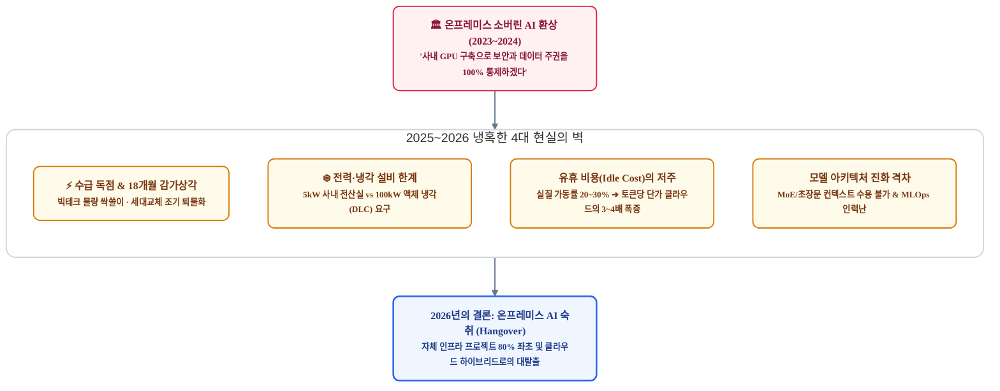
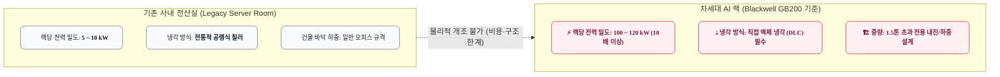
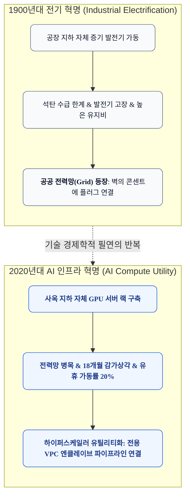
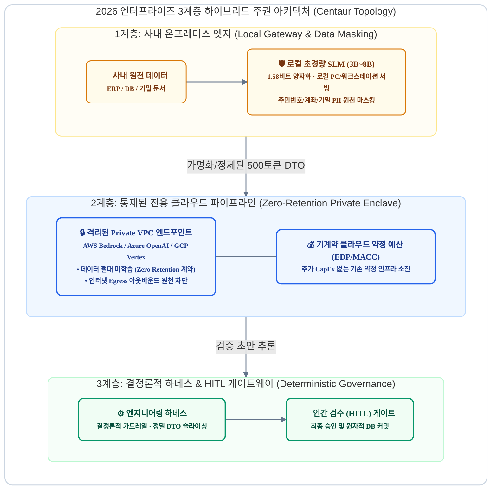

# 소버린 AI의 신기루와 온프레미스의 종말: 엔터프라이즈는 어떻게 진짜 데이터 주권을 확보하는가

> **"사내 지하 전산실에 수십억 원짜리 GPU 랙을 사서 들여놓는다고 해서 데이터 주권이 생기지 않습니다. 18개월 만에 퇴물이 되는 하드웨어, 랙당 100kW 액체 냉각의 벽, 평일 일과 시간에만 20%로 돌아가는 유휴 비용의 저주는 온프레미스 AI를 재앙으로 만들었습니다. 진짜 주권은 '발전소를 짓는 것'에 있는 것이 아니라, 공공 전력망을 사내 워크플로우에 안전하게 연결하는 '배관과 밸브(하네스)'를 장악하는 데 있습니다."**

---

## 1. 서론: 소버린 AI 열풍과 온프레미스 회귀의 딜레마

2023년부터 2024년 말까지 글로벌 기업과 공공기관의 최고경영진(CEO)과 정보보호최고책임자(CISO)들 사이에는 하나의 거대한 신념이 형성되었습니다:

> *"우리의 핵심 기밀과 고객 데이터를 퍼블릭 클라우드 LLM(OpenAI, Anthropic 등)에 맡길 수는 없다. 오픈소스 모델(Llama, Mistral 등)의 성능이 빠르게 올라오고 있으니, 사내(On-Premises)에 고성능 GPU 서버를 직접 구축하여 완벽한 자체 '소버린 AI(Sovereign AI)' 플랫폼을 확보하자."*

각국 정부의 규제 강화와 지정학적 데이터 주권(Data Sovereignty) 담론은 이 열풍에 기름을 부었습니다. 기업들은 수십억 원에서 수백억 원의 설비 투자(CapEx)를 승인하며 자체 GPU 팜 구축에 나섰습니다.

그러나 2025년을 거쳐 2026년에 도달한 지금, 업계는 이를 **'온프레미스 AI 숙취(On-Premises AI Hangover)'**의 시대로 부릅니다. Gartner, IDC 등 글로벌 시장 조사 기관에 따르면, 야심 차게 자체 온프레미스 AI 인프라를 구축했던 비IT 기업의 프로젝트 중 **약 80%가 심각한 예산 초과, 설비 인허가 반려, 가동률 저하로 인해 실패하거나 클라우드 하이브리드로 회귀**했습니다.

왜 데이터 주권이라는 지극히 타당해 보이는 목표가 온프레미스 환경에서는 거대한 재앙으로 귀결되었을까요?

---

## 2. 온프레미스 AI 4대 물리적·경제적 장벽의 해체 (TCO의 붕괴)

온프레미스 AI 구축이 실패하는 이유는 엔지니어의 능력이 부족해서가 아닙니다. **반도체 공급망, 열역학, 회계학적 TCO의 법칙이 사내 구축을 허용하지 않기 때문**입니다.

### ① 하드웨어 수급 독점 (Allocation Monopoly)
* **빅테크의 싹쓸이**: TSMC의 첨단 패키징(CoWoS) 및 엔비디아 최신 가속기(H200, B200, GB200) 물량의 **75~80%는 마이크로소프트, 메타, 구글, AWS, 오라클 등 소수 하이퍼스케일러가 사전 독점 계약**으로 흡수합니다.
* **일반 기업의 이중 페널티**:
  * 일반 대기업이나 중견기업이 서버 벤더를 통해 수십 장 단위의 GPU를 발주할 경우, 인도받기까지 최소 **6~9개월의 리드타임**이 소요됩니다.
  * 수만 장 단위로 구매하는 빅테크가 받는 대량 구매 할인(Volume Discount)을 받지 못해, **동일한 하드웨어 도입 단가 자체가 20~30% 이상 비쌉니다.**

### ② 초고속 감가상각과 18개월 퇴물화 (Obsolescence Cycle)
* **회계 기준과 기술 주기의 괴리**: 전통적인 엔터프라이즈 x86 서버의 감가상각 주기는 통상 **4~5년**입니다.
* **AI 칩셋의 연간 세대교체**: 엔비디아의 연간 로드맵(Hopper ➔ Blackwell ➔ Rubin)에 따라, AI 하드웨어는 **18~24개월 만에 와트당 연산 성능(FLOPs/Watt)과 HBM 메모리 대역폭이 2~3배씩 격차**를 벌립니다.
* **조기 퇴물화의 비극**: 2년 전 30억 원을 들여 구축한 H100 클러스터는, 최신 MoE(Mixture of Experts) 아키텍처나 수십만 토큰의 롱 컨텍스트(Long-context)를 서빙하려 해도 HBM 대역폭과 메모리 용량 부족으로 OOM(Out of Memory)과 극심한 지연을 유발합니다. 감가상각이 채 절반도 끝나기 전에 '전기만 많이 먹는 애물단지'로 전락합니다.

### ③ 전력 밀도와 냉각 설비의 물리적 벽 (Facility Wall)
* **사내 전산실의 물리적 한계**: 일반 기업 사옥이나 기존 상면 데이터센터의 랙(Rack)당 전력 밀도는 **5~10kW 수준이며, 100% 공랭식(Air Cooling)** 설계입니다.
* **차세대 AI 랙의 전력 소모**: 엔비디아 Blackwell(GB200 NVL72) 랙 하나가 요구하는 전력은 **100~120kW**에 달하며, 고열을 식히기 위해 **직접 액체 냉각(Direct Liquid Cooling, DLC) 배관**이 필수적입니다.
* **건축적 리모델링 불가**: 건물 바닥 하중 보강, 수랭 배관 공사, 고압 수전 인허가 비용은 GPU 자체 가격을 훌쩍 뛰어넘습니다. 대다수 기업은 설비 공사 견적을 받아보는 순간 사내 도입을 포기할 수밖에 없습니다.

### ④ "유휴 비용(Idle Cost)"의 저주와 가동률의 패러독스
* **온프레미스 경제학의 치명적 맹점**: 온프레미스가 클라우드보다 저렴하다는 계산은 **"1년 365일 24시간 내내 80~90% 이상의 풀가동률로 쉬지 않고 모델을 돌릴 때"**에만 성립하는 이론적 숫자에 불과합니다.
* **실제 업무 패턴의 불일치**:
  * 기업의 사내 업무 트래픽은 평일 근무 시간(09:00~18:00)에만 집중되며, 야간, 주말, 공휴일에는 가동률이 0%로 떨어집니다.
  * Gartner와 IDC 조사에 따르면, **자체 온프레미스 AI 팜을 구축한 일반 기업의 실질 평균 가동률은 20~35% 수준에 불과**합니다.
* **토큰당 단가 역전**:
  * GPU는 유휴 상태(Idle)로 놀고 있어도 감가상각비, 전산실 임대료, 상시 전력 대기 비용, 엔지니어 인건비가 24시간 고정 지출됩니다.
  * 실질 가동률을 반영하여 '유효 토큰당 처리 비용'을 역산하면, **온프레미스 모델 서빙 단가는 클라우드의 종량제 API를 호출하는 것보다 오히려 3~4배 이상 비싸집니다.**

| 비교 항목 | **온프레미스 자체 구축 (On-Premises)** | **클라우드 프라이빗 엔클레이브 (Cloud VPC)** |
| :--- | :--- | :--- |
| **초기 투자비 (CapEx)** | **수십억~수백억 원** (GPU 서버, 고압 수전, 액체 냉각 설비) | **$0** (사내 기계약 클라우드 약정 예산 소진 가능) |
| **조달 및 셋업 기간** | **6 ~ 9개월** (하드웨어 리드타임 및 설비 인허가) | **수 분 ~ 수 일** (클라우드 콘솔 즉각 프로비저닝) |
| **인프라 교체 주기** | 18~24개월마다 신형 하드웨어 추가 구매 부담 | 클라우드 제공사(CSP)가 지속적 최신 인프라 업그레이드 |
| **평균 유효 가동률** | **20 ~ 35%** (야간/주말 유휴 비용 24시간 지출) | **가변 종량제 또는 필요 시 탄력적 오토스케일링** |
| **전력 및 냉각 부담** | 랙당 100kW 수전 및 액체 냉각 시설 자체 유지 | 하이퍼스케일러 데이터센터가 전력·냉각 전담 |
| **상위 5% 추론 품질** | 405B급 서빙 시 막대한 GPU 낭비 및 지연 발생 | 최상위 플래그십(GPT-6, Claude Opus) 즉시 라우팅 |

---

## 3. '소버린 AI'라는 정치적 레토릭과 플랫폼 제국주의의 실체

"데이터 주권"은 분명 국가와 기업 입장에서 포기할 수 없는 중대한 가치입니다. 그러나 현재 시장에서 소비되는 '소버린 AI' 담론은 본질적으로 **정치적 수사(Political Rhetoric)와 빅테크의 마케팅이 결합된 신기루**에 가깝습니다.

### ① 국가주의적 AI 구호와 이해관계의 야합
* **정치권의 욕망**: 각국 정치인들은 "우리 기술, 우리 데이터센터로 국가 주권을 지키겠다"는 선명한 민족주의적 구호를 통해 거액의 국책 예산을 편성하고 지지율을 확보합니다.
* **레거시 공급사의 이해관계**: 전통적인 하드웨어 벤더, 장비 유통사, 시스템 통합(SI) 업체들은 "온프레미스 AI 전용 센터 구축"이라는 거대한 CapEx 사업을 수주하기 위해 '보안 공포 마케팅'을 펼칩니다.
* **결과**: 수천억 원의 국비와 기업 자본이 투입되었으나, 정작 완성된 결과물은 글로벌 오픈소스 모델(Llama)의 껍데기를 씌운 채 낮은 가동률로 방치되는 사례가 부지기수입니다.

### ② 하이퍼스케일러의 '소버린 워싱(Sovereign Washing)'과 역설적 승리
* 아이러니하게도 각국이 "소버린 AI"를 외칠수록, 가장 큰 반사이익을 얻는 곳은 **글로벌 클라우드 빅테크(AWS, Azure, Google, Oracle)**입니다.
* 빅테크 CSP들은 각국의 규제와 불안감을 기가 막히게 간파하여 **'소버린 클라우드(Sovereign Cloud)', '에어갭(Air-gapped) 전용 리전', '기밀 컴퓨팅(Confidential Computing)'** 상품을 내놓았습니다.
* 결국 "국가 주권을 지키기 위해 추진한 소버린 AI 프로젝트"의 90%가 **미국 하이퍼스케일러의 전용 리전 하드웨어를 장기 임대하여 그들의 플랫폼 API 위에서 구동되는 형태로 귀결**되고 있습니다. 모델 가중치는 오픈소스로 무료화되었지만, 인프라의 독점은 오히려 클라우드 3사로 완벽히 집중되었습니다.

### ③ '자가 발전소'의 종말과 '공공 전력망'의 승리 (The Big Switch)
* 기술 역사가 니콜라스 카(Nicholas Carr)는 명저 *'빅 스위치(The Big Switch)'*에서 20세기 초 산업혁명 당시의 거대한 전력 전환을 설명했습니다.
* 초창기 모든 제조 공장은 공장 지하에 자체 증기기관과 자체 발전기를 설치하고 석탄을 때며 전기를 만들었습니다. 하지만 대규모 고압 송전망과 중앙 집중식 공공 발전소가 깔리자, **자가 발전소를 고집하던 공장들은 천문학적인 유지보수 비용을 감당하지 못하고 파산**했습니다. 결국 모든 공장은 벽의 콘센트에 플러그를 꽂는 방식으로 전환되었습니다.
* **2026년의 AI 인프라는 정확히 '전력 발전소'의 단계에 도달했습니다.** AI 연산은 이제 개별 기업이 사내에 구축할 수 있는 소프트웨어가 아니라, 기가와트(GW)급 전력망과 액체 냉각 수로가 결합된 거대한 **'중공업 공공 유틸리티'**입니다. 

자가 발전소를 유지하는 곳은 국가 비상 방위 시설이나 특수 연구소뿐입니다. 99%의 기업은 공공 전력망(클라우드 인프라)의 전기를 배관으로 끌어다 쓰는 것이 경제학적 필연입니다.

---

## 4. 2026년 엔터프라이즈의 실현 가능한 '진짜 주권' 아키텍처

그렇다면 엔터프라이즈는 데이터 주권과 보안을 완전히 포기해야 할까요? 전혀 그렇지 않습니다. **주권의 정의를 '하드웨어의 소유'에서 '비즈니스 워크플로우와 데이터 흐름의 통제권(Control)'으로 재정의**하면, 훨씬 더 안전하고 경제적인 현실적 아키텍처가 열립니다.

### 패러다임 전환: "서버가 사옥에 있는가" ➔ "데이터 흐름을 통제하는가"
* 지하 전산실에 서버를 두더라도, 내부 직원이 외부로 데이터를 유출하거나 패치가 안 된 오픈소스 라이브러리의 취약점을 공격당하면 보안은 무너집니다.
* 진짜 데이터 주권은 하드웨어 소유권이 아니라 **"데이터가 언제, 어디로, 어떤 가공 과정을 거쳐 모델에 전달되고 폐기되는지를 소프트웨어 공학적으로 통제할 수 있는가"**에 달려 있습니다.

### 3계층 하이브리드 소버린 아키텍처의 구체적 동작 원리

#### 1계층: 사내 온프레미스 엣지 (Local Gateway & Data Masking)
* **역할**: 거대한 파운데이션 모델을 사내에서 돌리는 환상을 버리고, **사내 워크스테이션이나 소형 서버에서 3B~8B 크기의 초경량 SLM(Small Language Model)을 1.58비트 3진법 또는 4비트 양자화로 서빙**합니다.
* **기능**: 사내 원천 DB에서 데이터를 읽어와 외부로 유출되어서는 안 되는 주민등록번호, 계좌번호, 고객 식별자, 핵심 계약 조건을 로컬에서 1차 마스킹(비식별화)하고 정량 지표만 슬라이싱합니다.
* **비용**: 수십억 원짜리 H100 랙이 필요 없으며, 기존 사내 일반 PC나 수백만 원대 워크스테이션으로 100% 충당 가능합니다.

#### 2계층: 통제된 전용 클라우드 파이프라인 (Zero-Retention Private Enclave)
* **역할**: 고난도 추론, 다단계 로직 설계, 복잡한 코드 생성이 필요한 작업은 하이퍼스케일러의 **프라이빗 전용 엔드포인트(AWS Bedrock, Azure OpenAI Private Link, GCP Vertex AI)**로 전송합니다.
* **철저한 주권 보장**:
  * **Zero Data Retention 계약**: 고객 프롬프트와 완료 데이터는 모델 학습에 절대 사용되지 않고 메모리 휘발 처리됩니다.
  * **인터넷 Egress 차단**: 모델이 외부 인터넷으로 데이터를 전송하지 못하도록 사내 VPC 내 프라이빗 링크(Private Link)로 격리됩니다.
* **재무적 FinOps 최적화 (MACC/EDP 활용)**:
  * 기업이 이미 클라우드 벤더와 수년 단위로 맺어둔 **대규모 클라우드 약정 할인 예산(AWS EDP, Azure MACC)**을 통해 AI 인프라 비용을 소진합니다.
  * 신규 하드웨어 구매를 위한 추가 CapEx 승인을 받을 필요 없이, 기존 IT 운영 예산 범주 내에서 유연하게 비용을 통제할 수 있습니다.

#### 3계층: 결정론적 하네스 & HITL 거버넌스 (Deterministic Governance)
* **역할**: 모델이 출력한 결과물은 절대 데이터베이스나 프로덕션 시스템에 직접 쓰이지 않습니다.
* **기능**:
  * 로컬 결정론적 검증기(Validator)가 비즈니스 규칙과 파이프라인 정합성을 비용 0원으로 즉시 검증합니다.
  * 사내 시니어 엔지니어나 업무 담당자가 UI 대시보드에서 명시적으로 승인(Human-in-the-Loop)할 때만 영구 저장소에 반영됩니다.

---

## 5. 결론: 발전소를 지으려 하지 말고, 배관과 밸브를 장악하라

2026년의 엔터프라이즈 AI 시장은 '인프라를 소유하는 시대'에서 **'인프라를 통제하고 워크플로우를 소유하는 시대'**로 완전히 재편되었습니다.

* **온프레미스 AI 전면 구축의 환상에서 깨어나야 합니다.**
  * GPU 하드웨어 수급의 불평등, 18개월 주기의 잔인한 감가상각, 랙당 100kW 액체 냉각 설비의 벽, 20%대 유휴 가동률의 저주는 자가 발전소를 짓겠다는 기업들을 파산과 예산 낭비의 구렁텅이로 몰아넣었습니다.
* **진짜 소버린 AI(데이터 주권)는 지하 전산실의 시끄러운 서버 랙에 있지 않습니다.**
  * 주권이란 인프라 제조사나 클라우드 벤더의 규격에 종속되지 않고, **"우리 회사의 고유한 도메인 지식, 비즈니스 가드레일, 업무 파이프라인의 통제권을 회사가 쥐고 있는가"**에 있습니다.
* **공공 전력망을 연결하고, 배관과 스위치를 설계하십시오.**
  * 하이퍼스케일러가 막대한 자본과 전력을 태워 유지하는 최신 AI 유틸리티(전력망)를 안전한 배관(Zero-Retention Private VPC)으로 끌어오십시오.
  * 그리고 사내 엣지 SLM으로 데이터를 비식별화하고, 결정론적 하네스와 HITL 검증기로 안전을 담보하는 **'3계층 하이브리드 아키텍처'**를 구축하십시오.

역설적이게도 하드웨어 소유라는 헛된 집착을 내려놓는 순간, 기업은 가장 안전하고 저렴하며 지속 가능한 **'진짜 데이터 주권'**을 손에 쥐게 될 것입니다.
