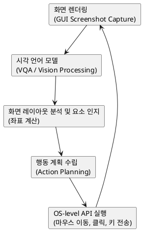
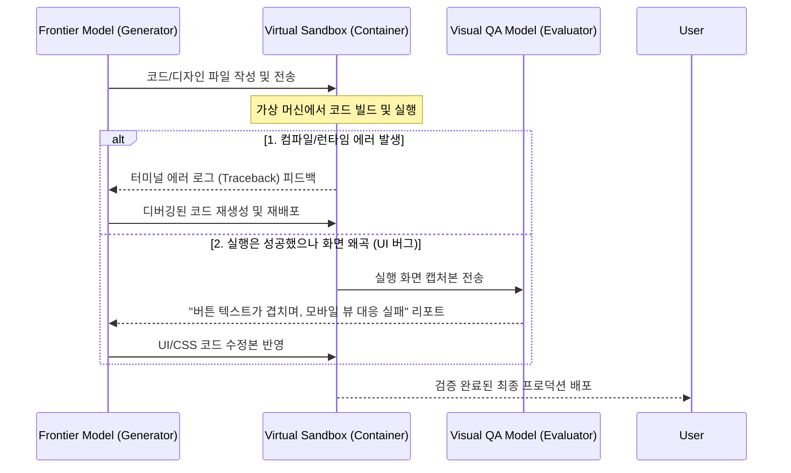
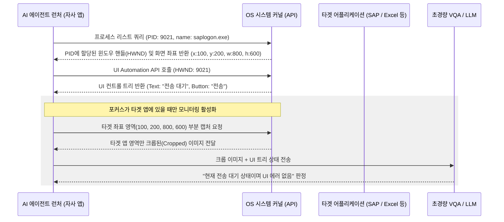
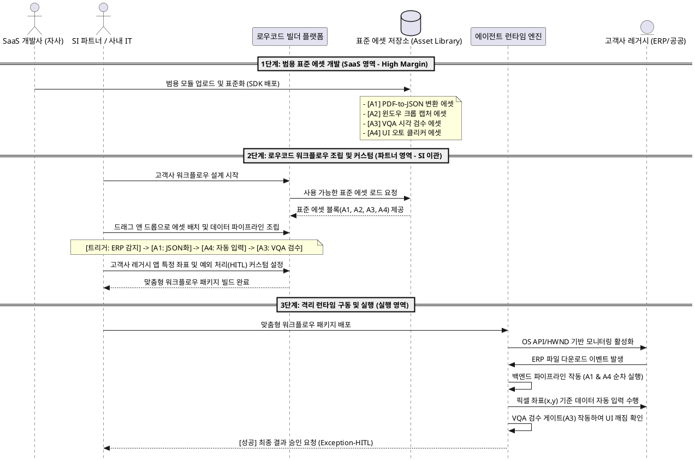

# [Deep Dive] Computer-Use & Error Self-Verification (에러 자가 검증)

*   **최초 작성일**: 2026.05.31 (최종 업데이트: 2026.05.31)
*   **관련 트렌드 리포트**: `@[Market_Trends/2026-05-31_Weekly_AI_Trend.md]`
*   **목적**: GPT-5.5 및 Claude Opus 4.8 론칭에 따른 'Computer-Use 에뮬레이션'과 '가상 컨테이너/VQA 기반 자가 검증 루프'의 기술 구조를 정리하고, 애플리케이션 아키텍처 유형별(웹 vs 데스크탑 vs 서버 B2B) 실무 비즈니스 영향도와 기획 전략을 단일 문서로 통합 수립합니다.

---

## 1. Computer-Use (컴퓨터 사용 에이전트)

### 1.1. 개념 및 기술 정의
**Computer-Use**는 AI 에이전트가 인간이 컴퓨터를 사용하는 방식과 동일하게 **운영체제(OS) 환경 및 GUI(Graphic User Interface)를 직접 인지하고 제어하는 기술**입니다. 

기존의 LLM이 정형화된 시스템 API(Application Programming Interface) 호출에 의존했다면, Computer-Use를 탑재한 에이전트는 사람이 화면을 보고 마우스를 클릭하고 키보드를 타이핑하는 과정을 그대로 에뮬레이션합니다.



### 1.2. 핵심 작동 메커니즘
1. **스크린 관찰 (Visual Perception)**: 가상 또는 실제 디스플레이 화면을 실시간 캡처하여 고성능 비전 모델(VQA)로 전달합니다.
2. **요소 분석 및 좌표 추출 (Semantic Grounding)**: 화면 안의 버튼, 텍스트 입력창, 메뉴 바 등의 위치를 픽셀 좌표 단위로 식별합니다.
3. **가상 입력 제어 (Execution)**: OS 내장 가상 입력 드라이버를 조작하여 `Mouse Click(x, y)`, `Keypress(text)`, `Scroll` 등의 물리적 동작을 대리 수행합니다.

### 1.3. 비즈니스 기획자 관점의 가치 (RPA와의 차이점)
* **비정형 업무 대처 능력**: 전통적인 RPA(Robotic Process Automation)는 화면 요소의 DOM 구조나 픽셀 위치가 미세하게 변경되면 오작동합니다. 반면, Computer-Use AI는 UI가 변경되더라도 사람이 눈으로 찾듯 동적으로 판단하여 유연하게 대응합니다.
* **통합 오케스트레이션**: API가 존재하지 않는 폐쇄형 레거시 엔터프라이즈 소프트웨어(SAP, 사내 구축 ERP 등)와 최신 웹 서비스를 자유롭게 넘나들며 하이브리드 워크플로우를 완벽하게 자동화합니다.

---

## 2. 에러 자가 검증 (Error Self-Verification)

### 2.1. 개념 및 기술 정의
**에러 자가 검증(Error Self-Verification / Self-Correction)**은 AI가 생성한 결과물(코드, 텍스트, 비즈니스 문서 등)을 **사용자에게 최종 인도하기 전에 자체적으로 테스트 및 실행하고, 발생한 에러를 분석하여 스스로 수정하는 복합 루프 피드백 체계**입니다.

과거에는 LLM이 그럴듯하지만 오동작하는 코드를 작성했을 때 인간 개발자가 에러를 파악하고 디버깅 프롬프트를 다시 작성해야 했습니다. 이제는 이 디버깅 과정이 에이전트 내부 시스템에서 완전 자동화되어 일어납니다.



### 2.2. 핵심 작동 메커니즘
1. **샌드박스 컴파일 및 실행**: 도커(Docker) 등 완전히 격리된 가상 컨테이너 환경에서 AI가 짠 프로그램을 구동합니다.
2. **컴파일/구문 오류 환류 (Self-Correction)**: 실행 에러 발생 시 컴파일러나 인터프리터의 Traceback 로그를 LLM의 System Message로 다시 주입하여 오류를 1차 디버깅합니다.
3. **시각적 검증(VQA) 연계**: (2026년 핵심 돌파구) 실행 완료된 웹페이지나 앱 화면을 시각 모델(VQA)로 교차 검증하여 글자 겹침, 레이아웃 붕괴, 기능 미작동 등 논리적/UI적 오류까지 검출해냅니다.

---

## 3. 애플리케이션 아키텍처 유형별 실제 임팩트 및 실무 기획 전략

모든 서비스 형태에 이 기술들이 획일적으로 적용되는 것은 불가능합니다. 앱의 형태별로 극명하게 나누어지는 기술적 팩트와 기획적 방향성을 정립해야 합니다.

### 3.1. 아키텍처 분석 매트릭스

| 분류 | 웹 기반 애플리케이션 (Web Apps) | 데스크탑 애플리케이션 (Desktop Apps) | 서버사이드 B2B 워크플로우 |
| :--- | :--- | :--- | :--- |
| **작동 환경 특징** | 브라우저 샌드박스 (로컬 자원 및 타 앱 조작 차단) | OS 직접 제어 권한 획득 가능 (Accessibility API 등) | API 중심의 확정적(Deterministic) 서버 파이프라인 |
| **Computer-Use 임팩트** | **[제한적 / 우회형]**<br>로컬 브라우저 보안에 의해 막히나, 서버 측 헤드리스 브라우저를 통한 대리 조작 자동화(Web Automation)로 우회 발전 | **[극대화 / 메인 전장]**<br>Figma, Excel, Slack 등 이종 앱 간의 경계를 넘나들며 마우스/키보드 가상 입력을 에뮬레이션하여 자동화 | **[극히 부분적 / API 사각지대 전용]**<br>API 호출이 무조건 유리하나, API가 전혀 존재하지 않는 폐쇄형 ERP/인트라넷 연동 시에만 침투 |
| **Self-Verification 적용성** | **[매우 높음]**<br>웹 렌더링 화면의 CSS 깨짐, 반응형 웹 버그 등을 시각 모델(VQA)로 자가 디버깅하여 프론트엔드 품질 극대화 | **[높음]**<br>데스크탑 실행 단계에서 팝업 에러창, 비정상 화면 왜곡을 픽셀 스캔 및 VQA로 실시간 디버깅 수행 | **[매우 높음]**<br>서버사이드 격리 컨테이너 내 백엔드 컴파일/런타임 에러 자동 디버깅 루프 가동 |
| **실무 기획 방향** | 클라우드 가상 브라우저 에이전트(Web Automation Agent) 솔루션 기획 | 보안 격리된 가상 데스크톱(VDI/VM) 기반의 업무 자동화 비서 기획 | API가 없는 전통 레거시 연동 전용 'AI 지능형 RPA 에이전트' 기획 |

---

### 3.2. 아키텍처 유형별 세부 전략

#### 3.2.1. 웹 기반 애플리케이션 (Web Apps)
*   **기술적 팩트**: 웹 브라우저는 보안(Sandbox)상의 이유로 로컬 사용자의 화면을 점검하거나 마우스와 키보드를 원격 조작하는 고도 권한을 내주지 않습니다.
*   **우회형 비즈니스 모델 기획**: 
    - 사용자의 로컬 화면을 훔쳐보는 것이 아니라, **서버에 별도의 가상 브라우저(Headless Browser - Playwright 등)를 띄워 AI가 대신 서핑하게 조작하는 구조**로 기획해야 합니다.
    - 사용자가 "내 메일 확인해서 항공권 결제해줘"라고 명령하면, 서버 안의 AI 에이전트가 가상 브라우저를 켜고 로그인 및 탐색, 결제 대기 단계까지 완료한 뒤 그 결과화면만 사용자 웹페이지에 넘겨주는 식입니다.

#### 3.2.2. 데스크탑 애플리케이션 (Desktop Apps)
*   **기술적 팩트**: OS 접근 권한(Accessibility API)을 취득하면 화면 픽셀 인지 및 키/마우스 주입이 가능하므로 기술적 시너지가 가장 극대화되는 전장입니다.
*   **보안 제약 사항 및 기획 모델**:
    - AI가 키보드와 마우스를 직접 조작해 로컬 PC를 건드리는 구조는 랜섬웨어 감염, 오결제, 금융 정보 탈취 등 보안 리스크가 최악 수준입니다.
    - **전략**: B2B 고객 대상 설계 시 로컬 PC에 직접 조작 권한을 주기보다, **보안 격리된 독립 가상머신(Secure Sandbox VM) 환경**을 사용자별로 제공하고, 에이전트가 그 VM 안에서 이종 데스크탑 앱들을 설치 및 조작하여 가공한 결과(예: 병합 완료된 엑셀 파일)만 다운로드할 수 있게 **격리형 데스크톱 에이전트**로 설계해야 시장 진입 장벽을 넘을 수 있습니다.

#### 3.2.3. 서버사이드 B2B 워크플로우
*   **기술적 팩트**: 소프트웨어 공학적으로 API 연동(JSON 데이터 전송)이 GUI 조작(픽셀 단위 인지 및 클릭 에뮬레이션)보다 처리 속도와 정확도(Deterministic) 면에서 수천 배 저렴하고 안정적입니다. B2B 영역에서 GUI 제어는 비효율의 극치입니다.
*   **'API 사각지대' 틈새 비즈니스 기획**:
    - 대기업이나 전통 중견기업이 보유한 **폐쇄형 ERP, 자체 구축 인트라넷, API가 없는 구형 그룹웨어(Legacy Systems)** 등은 외부 소프트웨어와 연동이 원천 차단되어 인간 직원이 반복적인 데이터 복사-붙여넣기 노동을 수행합니다.
    - **전략**: API 연동을 포기하고, 사람이 그룹웨어를 마우스로 누르고 텍스트를 입력하는 것을 AI가 GUI 화면을 보며 똑같이 대행하는 **'지능형 API-less 연동 에이전트(차세대 AI-RPA)'** 영역으로 대상을 초점화하여 세일즈해야 시장을 독점할 수 있습니다.

---

## 4. Computer-Use와 에러 자가 검증의 결합이 만드는 BM의 변화

두 기술의 융합은 단순한 기술적 발전을 넘어 **AI 비즈니스 모델(BM)과 원가 구조의 혁신**을 불러오고 있습니다.

### 4.1. [하이프와 실상] '코딩 완전 자동화'의 한계와 실무적 정위(定位)

사용자의 자연어 단 한 문장만으로 백엔드, 프런티어, 인프라가 통합된 수준 높은 소프트웨어 "완제품"을 자동으로 생성 및 퍼블리싱한다는 진술은 시장의 마케팅적 과장(Hype)에 불과하며, 실무 엔지니어링 관점에서는 **완벽히 불가능**합니다. 이는 프런티어 SOTA 모델 개발사, 코딩 에이전트 기업, 개발자 및 의사결정권자 모두가 인지하고 있는 기술적 현실입니다.

#### 4.1.1. 완전 자율 코딩이 불가능한 3대 기술적 장벽
1. **의도 누출(Intent Leakage)과 명세(Specification)의 부재**: 복잡한 엔터프라이즈 비즈니스 로직은 "한 문장"에 결코 담길 수 없습니다. 데이터베이스 스키마, 트랜잭션 예외 처리 정책, 보안 모듈 규격, UI 아이덴티티 등 소프트웨어 명세서 작성을 위해 필요한 정보의 99%가 생략되어 있기 때문에, AI는 이를 임의로 유추(Hallucination)하여 무의미한 코드를 양산하게 됩니다.
2. **에러 전파와 자가 검증 루프의 무력화**: 소프트웨어 아키텍처가 모듈화될수록 런타임 및 종속성 오류가 그물망처럼 복잡해집니다. AI 에이전트가 샌드박스에서 자가 디버깅(Self-Correction)을 시도하더라도, 컨텍스트 윈도우 한계와 장기 추론 기억 상실로 인해 대개 3~5회 루프 내에 문제를 해결하지 못하고 코드를 더 망가뜨리거나 무한 루프(Billing Shock)에 빠지게 됩니다.
3. **SOTA 모델의 객관적 성능 한계 (SWE-bench)**:
   현재 전 세계에서 가장 성능이 뛰어난 코딩 에이전트들조차 실제 GitHub의 정제된 오픈소스 버그 해결 능력을 측정하는 **SWE-bench Verified에서 약 30%~45% 내외의 성공률**을 기록하고 있습니다. 이조차도 '이미 설계된 코드베이스 안에서 특정 버그 1개를 수정하는 일'에 국한된 지표이며, 아무것도 없는 상태에서 완제품을 자율 생성하는 성공률은 0%에 수렴합니다.

#### 4.1.2. 현실적인 코딩 에이전트의 비즈니스 가치 포지셔닝
따라서 자사 어플리케이션 기획 시 "코딩 완전 자동화"라는 허구의 워딩 대신, 실제 도달할 수 있는 아래의 **두 가지 구체적 가치**에 포커스를 맞춰 제품을 설계해야 합니다.

* **초고속 시각 프로토타이핑 (Rapid Visual Prototyping)**: 30초 내에 작동 가능한 정적 Mockup 웹페이지나 간단한 데이터 시각화 보드를 생성하여, 기획자나 세일즈 파트너가 고객을 미팅할 때 **"시각적 아이디어 확인용 목업"**으로 활용할 수 있게 신속성을 보조하는 가치.
* **기능 모듈 단위 생성 및 PR 보조 (Feature-level Generation Assistant)**: "특정 규격의 CSV 데이터를 파싱하여 DB에 업서트(Upsert)하는 백엔드 함수 하나"처럼, **범위가 극도로 제한되고 명세가 확정적인 모듈 단위 코드**를 AI가 작성하고 자가 검증한 후, 인간 개발자의 검토를 위해 **Pull Request(PR)**를 자동으로 던져주는 보조적 가치.

---

## 5. 비즈니스 설계 상 핵심 고려 요소 및 제약 사항 (Constraints)

### 5.1. 무한 루프로 인한 빌링 쇼크 (Billing Shock)
> [!WARNING]
> 에러 자가 검증 루프가 오동작하여 버그를 무한히 고치려 들 경우, 고가의 프런티어 API(Claude Opus 4.8 등) 요금이 기하급수적으로 부과될 수 있습니다. 
> * **대응책**: 에이전트 아키텍처 기획 시 `Max Loop Limit` (최대 재시도 5회 등) 및 `Token Budget Threshold` (태스크당 과금 상한선 차단) 시스템의 물리적 통합이 필수적입니다. [5절 리스크 진단](file:///home/yundream/myjob/writting/20_Work_Business/Biz_Strategy/Market_Trends/2026-05-31_Weekly_AI_Trend.md#L78-L86) 참조.

### 5.2. 하이브리드 LLM 라우팅 최적화
> [!TIP]
> 모든 자가 검증 루프를 무겁고 비싼 프런티어 모델(Claude Opus 4.8, GPT-5.5)로 돌리는 것은 극도로 비효율적입니다.
> * **대응책**: 오류를 감지하고 가벼운 구문 교정을 진행할 때는 1M 토큰당 $0.15 수준의 초경량 모델(GPT-5.5 Instant, Gemini 3.5 Flash)을 게이트웨이 및 라우터로 쓰고, 고난도의 아키텍처 설계와 심각한 예외 처리 디버깅 시에만 프런티어 SOTA 모델을 호출하는 **하이브리드 LLM 라우팅** 기획이 서비스 마진을 결정짓는 핵심 키입니다.

### 5.3. 정량적 ROI 진단 및 하이브리드 아키텍처 전략 (핵심 의사결정)
데이터 통신 및 어플리케이션 간 연동 효율성 측면에서 **표준 API/IPC 인터페이스 방식**이 **VQA/Computer-Use 방식**에 비해 지연 시간(Latency)은 100배 이상 빠르고 비용(Cost)은 10,000배 이상 저렴합니다. 따라서 전체 시스템을 VQA 기반으로 오케스트레이션하는 것은 극도로 비효율적이며 과도기적 솔루션에 가깝습니다.

그럼에도 불구하고 현장에서 VQA와 Computer-Use가 강력한 가치를 가지는 이유는 B2B 엔터프라이즈의 **3대 구조적 제약** 때문입니다.

1. **레거시 시스템의 수정 불가능성 (Legacy Immutability)**: 대기업 및 금융권 구형 시스템(SAP, 메인프레임, 자체 구축 ERP 등)은 소스 코드가 유실되었거나 안정성 문제로 **"API 포트를 개방하거나 내부 구조(DOM)를 고치는 행위 자체가 원천 불가능"**합니다. 이 경우 유일한 인터페이스는 인간을 위해 준비된 화면과 키보드/마우스뿐입니다.
2. **독점 플랫폼 홀더의 보안 장벽 (Platform Sandboxing)**: 주요 SaaS 벤더(Microsoft, Salesforce, Adobe 등)는 보안과 상용 라이선스 보호를 위해 내부 구조 및 통신망을 외부로부터 격리시킵니다. 이 장벽을 깨고 이기종 앱 간 통합을 신속하게 완수하기 위해 화면 픽셀 인지(VQA)를 활용합니다.
3. **데이터 해석의 시맨틱 갭 (Semantic Gap) 완화**: 이기종 데이터 변환 단계의 정합성 오류 리스크를 극복하고, 인간 직원이 오랜 기간 검증해 온 **"화면 기준의 최종 결과물 적합성"**을 비전 기반으로 한 번에 판정(Evaluator)하여 시스템 연동 신뢰도를 빠르게 확보할 수 있습니다.

#### 실무 기획 적용을 위한 3대 하이브리드 전략
비용 효율성을 보존하고 실제 실행 가능한 솔루션을 구축하기 위해 아래의 **계층형 설계 규격**을 준수합니다.

* **[규칙 1] API-First 최우선 탐색**: 연동 대상 시스템이 API나 DOM 접근을 지원할 경우, AI에게 텍스트/JSON 기반 파싱 및 IPC 매핑을 전담케 하여 나노달러($0.000001) 수준의 고속 연동 비용 구조를 실현합니다.
* **[규칙 2] VQA의 최종 검수기(Evaluator) 국한**: 데이터 연동 및 로직 구현은 내부 백엔드단에서 텍스트로 처리하되, **최종 UI 결과물이 사용자에게 표시되기 직전의 마지막 1회 검수 단계에서만 VQA를 트리거**하여 비전 토큰 과금을 통제합니다.
* **[규칙 3] 사각지대 특화 세일즈 (Targeted Niche)**: API 연동이 용이한 현대식 SaaS 웹 시장을 피하고, 보안 망분리 장벽이나 구형 ERP 등 **"영원히 API 연동이 불가능하여 오직 인간의 마우스 클릭 노가다만 존재하던 틈새 시장"**을 정밀 타겟팅하여 높은 서비스 단가를 제안합니다.

---

## 6. 인간-AI 협업을 위한 Human-in-the-Loop (HITL) 설계 프레임워크

VQA 및 비전 기반 추론 모델은 근본적으로 확률적(Probabilistic) 모델이므로 오진(False Positive/Negative) 리스크가 항상 존재합니다. 따라서 실제 프로덕션 환경의 비즈니스 안정성을 100% 확보하기 위해 **업무 리스크 등급별 HITL 설계 프레임워크**를 아키텍처적으로 내재화합니다.

### 6.1. 리스크 등급별 에이전트 제어 정책
1. **저위험 작업 (Low-Risk) -> 완전 자율화 (Zero-HITL)**
   * *대상*: 사내 정보 취합, 경쟁사 동향 모니터링 화면 캡처, 디자인 초안 생성 등 오류가 발생해도 금전적/법적 타격이 거의 없는 업무.
   * *정책*: VQA 판정의 미세 오류를 감수하고 인간의 사후 검수 없이 백엔드에서 100% 자율 실행.
2. **중위험 작업 (Mid-Risk) -> 예외 발생 시 인계 (Exception-HITL)**
   * *대상*: 웹/데스크탑 앱의 소스 코드 디버깅 및 자가 검증.
   * *정책*: VQA 모델의 판정 신뢰도 스코어(Confidence Score)가 임계치(예: 80%) 이하로 떨어지거나 자가 검증 루프 제한(예: 3회)을 초과할 경우 즉시 동작을 멈추고 Slack/이메일로 에러 로그와 화면을 인간 관리자에게 전달(Escalation)하여 개입 요청.
3. **고위험 작업 (High-Risk) -> 최종 승인 게이트웨이 (Gateway-HITL)**
   * *대상*: 은행 송금, 상용 발주서 발행, 대외 프로덕션 웹사이트 배포(Deploy) 등.
   * *정책*: AI가 사전 수집, 컴파일, 자가 검증 디버깅을 95% 완료하여 최종 실행 결과 화면까지 준비해 둔 후, 마지막 실제 결제/배포 버튼을 누르기 직전 단계에 **"최종 승인 대기열(Approval Queue)"**에 작업을 대기시킴. 인간 결재권자는 최종 화면만 훑어본 뒤 "승인(Approve)"을 1회 클릭하여 완결.

---

## 7. 실무 개발 가이드: 타겟 애플리케이션 식별 및 모니터링 아키텍처

자사 애플리케이션에 VQA 및 추론 능력을 지닌 SOTA 모델을 내장하여 B2B 고객 요구사항에 대응할 때, AI가 화면 전체를 무작위로 탐색하는 비효율을 방지하고 특정 타겟 앱을 정확하게 식별/추적하기 위해 **OS 시스템 API 및 접근성 API를 결합한 하이브리드 모니터링 모델**을 구축합니다.

### 7.1. 모니터링 시스템 아키텍처



### 7.2. 3단계 하이브리드 식별 매커니즘
1. **[1단계] 프로세스 및 활성 윈도우 핸들 (HWND) 추적**
   * *메커니즘*: OS API(예: Windows `Win32 API`, Linux `xdotool` 등)를 주기적으로 쿼리하여 타겟 프로세스명(예: `saplogon.exe`)의 **PID** 및 연계된 **활성 윈도우 핸들(HWND)**을 확보합니다.
   * *이점*: 앱의 화면 내 실시간 위치 좌표(X, Y, W, H)를 알아내어, 전체 화면 캡처 대신 **타겟 앱 윈도우 영역만 정확히 크롭(Crop)하여 캡처**함으로써 캡처 전송 오버헤드와 AI 토큰 비용을 70% 이상 절감합니다.
2. **[2단계] OS 접근성 API (Accessibility API) 연동**
   * *메커니즘*: Windows `UI Automation (UIA)` 또는 macOS `Accessibility API`를 호출하여 윈도우 내부의 컨트롤 트리 구조를 XML/JSON 형태로 획득합니다.
   * *이점*: 시각 모델이 스캔하기 전에 `"현재 에러 알림 다이얼로그 창이 활성화되어 있음"`, `"Excel의 A1 셀이 활성화됨"` 등의 구조화된 메타데이터와 상태 이벤트를 확정적으로 수집하여 오작동을 방지합니다.
3. **[3단계] 포그라운드 액티브 포커스 감지 및 이벤트 트리거링**
   * *메커니즘*: OS의 `GetForegroundWindow` API 등을 활용해 마우스/키보드 포커스가 타겟 앱을 벗어나는 순간 에이전트를 대기(Idle) 모드로 전환하고, 포커스가 돌아오면 즉시 모니터링 및 입력 대행 루프를 재개합니다.

### 7.3. 추천 개발 기술 스택 (에이전트 앱 임베딩용)
* **Python 기반 고속 프로토타이핑**:
  * `pygetwindow` / `pywinctl`: 활성 윈도우 명칭, 크기, 화면 좌표 획득.
  * `pywinauto` / `uiautomation`: Windows UI Automation API 래핑을 통한 컨트롤 구조 추출.
* **C# / .NET Core 기반 상용 등급 런처**:
  * Windows 지배적인 B2B 특성에 맞춰 .NET의 `System.Windows.Automation` 네임스페이스를 직접 활용하여 시스템 상주형 초경량 에이전트 프로그램으로 빌드하는 것을 권장. (메모리 사용량 최소화 및 뛰어난 OS API 친화성)

---

## 8. B2B 에이전트 비즈니스의 2대 딜레마 및 실무 돌파 전략

기술의 화려한 겉모습과 달리, 실제 B2B 엔터프라이즈 환경에서 "독립형 VQA/Computer-Use 에이전트" 비즈니스는 두 가지 치명적인 상업적 한계에 봉착합니다. 이 죽음의 계곡(Death Valley)을 극복하고 지속 가능한 소프트웨어 비즈니스를 영위하기 위한 기획적 대안을 정립합니다.

### 8.1. [딜레마 1] C-Level 의사결정자가 느끼는 불투명한 ROI
* **원인**: 전체 업무 여정(로그인 -> 메뉴 탐색 -> 입력 -> 결제)에 VQA 및 가상 제어를 무리하게 도입하면 지연 시간(Latency)과 API 비용이 폭증하고 오작동 리스크가 상존합니다. 따라서 가장 효율적인 설계는 **"90%의 시스템 엔지니어링 + 10%의 AI 병목 해결 + 인간의 최종 확인(HITL)"**이 되는데, 이 경우 도입 결정자는 "어차피 사람이 직접 검수하고 대부분 전통 코딩인데 왜 비싼 AI를 도입해야 하는가?"라는 의구심을 갖게 됩니다.
* **돌파구: '인지적 부하(Cognitive Load)의 제거'와 'FTE 리소스 재배치' 입증**
  * *RPA/인간 수작업 (기존)*: ERP 원장을 매번 수작업 다운로드하고, 수십 장의 세무 증빙 문서를 직접 눈으로 보며 비교·대조하여 홈택스에 한 땀 한 땀 타이핑. **1건당 20~30분 소요 (극심한 피로도, 휴먼 에러 상존)**
  * *AI 하이브리드 에이전트 (도입 후)*: 백그라운드 엔지니어링과 AI Agent가 문서를 0.5초 만에 구조화(JSON)하여, 홈택스 입력 폼 바로 옆에 **"완벽한 대조 뷰어 UI"**로 자동 배치. 인간 검수자는 오직 최종 대조 화면에서 "승인(Approve)" 버튼만 1회 클릭. **1건당 10~30초 소요**
  * *설득 논리*: C-Level에게 "완전 무인화 자동화"라는 기술적 환상을 파는 대신, **"FTE(전임 근무자)의 리소스 재배치"** 관점을 제시합니다. *"직원 5명이 하루 종일 눈이 충혈되어 매달리던 단순 대조/입력 업무를, 이제는 직원 1명이 최종 '승인' 버튼만 누르는 고부가가치 관리자로 격상시킵니다. 남은 4명의 리소스를 핵심 기획 및 영업에 재배치하여 기업 생산성을 높이십시오."*

### 8.2. [딜레마 2] 기업마다 다른 워크플로우로 인한 'SI(System Integration)화'의 늪
* **원인**: B2B 고객사들은 저마다 사용하는 ERP 솔루션, 협업 메신저, 사내 그룹웨어, 그리고 실무 프로세스(Workflow)가 극명하게 다릅니다. 이 커스텀 요구사항에 맞추기 위해 에이전트를 매번 새로 코딩해 주는 순간, 고마진의 SaaS 제품 비즈니스는 사라지고 인건비 중심의 하도급 SI 용역 기업으로 전락하게 됩니다.
* **돌파구: '레고 블록형 플랫폼화 (Product-Led Integration)' 모델 구축**

#### 에셋(모듈) 기반의 최소 공정 통합 워크플로우 흐름 (PlantUML)



  * *제품화와 서비스화의 분리*: 완성품 워크플로우를 직접 만들어 파는 방식을 버립니다. 자사는 범용적으로 사용되는 핵심 기술 블록(예: "PDF-to-JSON 추출 블록", "스크린 크롭 캡처 블록", "VQA UI 오류 검출기")과 이를 시각적으로 조립할 수 있는 **"노코드/로우코드 에이전트 빌더 플랫폼"**을 고마진(80% 이상)의 라이선스로 제공합니다.
  * *생태계 구축*: 실제 각 고객사 환경에 맞춘 커스터마이징, 시스템 연동 및 유지보수 작업은 **고객사의 사내 IT 부서나 로컬 SI 파트너사에게 이관(Outsourcing)**시킵니다. 이를 통해 개발사는 SI 늪에 빠지지 않고 대규모 확장성을 가진 진정한 SaaS 기업으로 성장할 수 있습니다. (Salesforce Agentforce, UIPath의 실제 상업화 모델)

---

## 9. 에이전틱 코딩의 종착지: AIDevOps (AI-Assisted SDLC) 컨설팅 BM

과거 DevOps(개발-운영 라이프사이클 압착) 패러다임이 도구 판매가 아닌 **'소프트웨어 공정의 문화와 프로세스 혁신'**을 통해 거대한 컨설팅 및 솔루션 시장을 창출했던 것처럼, AI 코딩의 진정한 상업적 목적지는 단순 코딩 도구(Tool) 판매가 아닙니다. 

**"기획/설계 -> 엔지니어링 공정 수립 + AI 협업 -> 개발 -> 배포/검수"**에 이르는 소프트웨어 개발 수명 주기(SDLC) 전반을 리엔지니어링하는 **'AIDevOps 방법론 컨설팅 및 통합 플랫폼 공급 비즈니스'**가 가장 높은 마진과 시장성을 보장합니다.

```
[ 전통적 SDLC : 기획(1주) -> 설계(2주) -> 구현(4주) -> QA(2주) -> 배포(1주) : 총 10주 ]
                                      ||  (공정 압착)
                                      \/
[ AIDevOps SDLC : 기획/초안(2일) -> 설계/명세(2일) -> AI 모듈 구현/디버깅(3일) -> VQA 검수(1일) : 총 8일 ]
```

### 9.1. AIDevOps 방법론의 4대 표준 공정 체계 (SOP)
기업 개발 조직의 생산성을 극대화하기 위해, 전체 SDLC 파이프라인의 각 단계마다 인간과 AI의 역할을 명확히 분담하는 표준 공정을 컨설팅합니다.

1. **[기획/설계] 초고속 명세화 (Rapid Specification)**
   * *인간*: 비즈니스 요구사항을 자연어 기술 및 핵심 유저 스토리로 정의.
   * *AI*: 요구사항을 바탕으로 Swagger API 규격서, 데이터베이스 DB 스키마, 시각적 Mockup 프론트엔드를 1차 자동 빌드 및 문서화.
   * *협업*: 인간 아키텍트가 최종 스펙을 검토 및 승인(Gate)하여 설계 확정.
2. **[구현] 격리된 모듈 단위 생성 (Isolated Feature Building)**
   * *AI*: 확정된 명세서와 API 규격을 바탕으로, 격리된 가상 샌드박스에서 모듈 단위 코드와 유닛 테스트(Unit Test) 코드를 동시 생성.
   * *시스템*: CI/CD 파이프라인 내에서 AI가 1차 컴파일 및 테스트 빌드를 자동 수행하여 에러 피드백 루프 작동.
3. **[검수] 하이브리드 검증 파이프라인 (Hybrid Verification)**
   * *AI (VQA)*: 빌드가 완료된 최종 화면을 크롭하여 글자 겹침, UI 붕괴, 기능 미작동을 시각적으로 교차 검수.
   * *인간*: 검수가 완료된 코드를 최종 Pull Request(PR) 상에서 코드 리뷰 후 프로덕션 머지(Merge).
4. **[배포/운영] 자가 수정 릴리즈 (Self-Healing Deploy)**
   * *시스템*: 빌링 쇼크 방지를 위한 Max Loop가 통제된 가상 환경에서 운영 테스트 완료 후 최종 릴리즈 자동화.

### 9.2. AIDevOps 컨설팅 비즈니스 모델 (BM)의 3대 수익화 전략
단순 소프트웨어 용역(SI)에 머무르지 않고 고부가가치의 프리미엄 서비스로 포지셔닝합니다.

* **[전략 ①] SDLC 병목 진단 및 공정 설계 (FTE Optimization Consulting)**
  * 고객사 개발팀의 소스 코드 관리 방식, 기획서 작성 프로세스, 테스트 코드 커버리지, QA 소요 시간 등을 정밀 진단(Audit)합니다.
  * AI 협업을 이식했을 때 개발 주기가 몇 % 압축될 수 있는지 정량적 ROI 시뮬레이션을 C-Level에 제시하고, 맞춤형 표준 공정(SOP) 설계 컨설팅 요금을 청구합니다.
* **[전략 ②] AIDevOps 통합 파이프라인 플랫폼 (SaaS Platform License)**
  * VQA 검수 모듈, 격리용 가상 샌드박스 컴파일러, 요구사항-API 매핑기 등이 유기적으로 통합된 **노코드/로우코드 파이프라인 도구(자사 제품)**를 엔터프라이즈 라이선스(FTE당 구독 과금) 형태로 판매하여 높은 지속적 매출(ARR)을 확보합니다.
* **[전략 ③] R&D 조직 체질 개선 및 엔지니어 재교육 (AI-Native Developer Enablement)**
  * 개발자들이 코드를 직접 치는 방식에서 탈출하여, AI에게 정확한 '사양 명세'와 '테스트 조건'을 내리는 아키텍트급 인력으로 성장하도록 교육 프로그램을 함께 묶어 고단가의 엔터프라이즈 딜(Deal)을 완성합니다.

### 9.3. 결론: DevOps 평행이론의 재현
과거에 인프라 가상화(Docker)와 자동화 툴(Jenkins)의 난립 속에서 이를 프로세스로 묶어낸 **DevOps 컨설팅사(Accenture, 전문 MSP 등)**가 가장 큰 부를 거머쥐었습니다. AI 시대의 코딩 역시 개별 에이전트 툴 성능 경쟁에서 벗어나, **개발 공정의 압착(SDLC Compression) 방법론을 제시하고 플랫폼을 커스텀 이식해 주는 컨설팅 파트너**가 최종 승자가 될 것입니다.

---

## 10. 실무 개념 검증(PoC) 추천 시나리오

본 보고서에서 수립한 기술 아키텍처와 하이브리드 제어 전략을 기반으로, 실제 B2B 비즈니스 현장에서 기술적 실현 가능성(Feasibility)과 정량적 ROI를 가장 빠르고 안전하게 검증할 수 있는 **3대 실무 PoC 시나리오**를 제안합니다.

### 10.1. [시나리오 1] 격리된 Sandbox 내 모듈 단위 자가 디버깅 및 PR 발행
* **PoC 제목**: **"Docker 컨테이너 격리 환경 기반 백엔드 API 모듈 자가 디버깅 및 GitHub PR 자동 발행 PoC"**
* **PoC 목적**:
  1. 기획 단계에서 정의된 표준 Swagger API 명세서(JSON)와 유저 스토리를 입력으로 받음.
  2. 에이전트가 격리된 도커(Docker) 컨테이너 내에서 "특정 파일 파싱 및 DB Upsert" 목적의 단일 백엔드 함수와 유닛 테스트 코드를 자동으로 생성하는지 검증.
  3. 테스트 실행 시 발생하는 컴파일/런타임 에러 로그(Traceback)를 에이전트 내부 LLM에 피드백하여, **최대 3회 루프 내에 스스로 버그를 고쳐내는지(Self-Correction)** 성공률 측정.
  4. 디버깅이 완료된 완성본 코드를 사내 깃허브 저장소에 Pull Request(PR) 형태로 자동 업로드하는 일련의 파이프라인 정합성 검증.
* **우선순위 및 중요도**: **[최우선순위 (P0 - High)]**
* **선정 근거**:
  * **극강의 ROI**: 개발자들이 매일 겪는 "초기 코드 작성 및 단순 신택스 디버깅" 공정을 AI가 90% 보조할 수 있음을 정량적 시간 감축률(FTE)로 증명함으로써 C-Level 의사결정자를 설득할 **가장 강력한 ROI 검증 도구**입니다.
  * **도입 장벽 최소화**: 외부 서비스망이나 OS UI 제어 권한 없이, 사내 온프레미스 격리 도커 컨테이너 내부에서 코드 텍스트만으로 테스트를 완료하므로 보안 및 인프라 허들이 가장 낮습니다.

### 10.2. [시나리오 2] 초경량 VQA 기반의 웹/앱 UI 붕괴 교차 검수 (Evaluator-HITL)
* **PoC 제목**: **"초경량 VQA(비전 언어 모델)를 활용한 반응형 웹 UI 레이아웃 에러 자동 검출 및 리포팅 PoC"**
* **PoC 목적**:
  1. 백엔드 코드 빌드는 성공했으나 눈으로 봐야만 알 수 있는 프론트엔드 버그(CSS 깨짐, 글자 겹침, 미디어 쿼리 붕괴 등) 탐지.
  2. 퍼블리싱 빌드 완료 직후 헤드리스 브라우저(Playwright 등)를 통해 기기별(PC/모바일/태블릿) 스크린샷 캡처본을 생성.
  3. 초경량 비전 모델(Gemini 3.5 Flash 등)을 **단 1회 트리거**하여 시각적 결함 여부를 검수.
  4. 결함 발견 시 구체적 오류 리포트("오른쪽 상단 결제 버튼이 로고 뒤에 15px 겹침")를 슬랙으로 알림 및 최종 인간 검수자(HITL)에게 검수 인계.
* **우선순위 및 중요도**: **[중간순위 (P1 - Medium)]**
* **선정 근거**:
  * **비용 통제력 검증**: 모든 렌더링 과정에 실시간으로 비전을 관여시키는 비효율을 배제하고, **"배포 직전 최종 1회 호출"**하는 하이브리드 설계의 비용적 현실성을 입증합니다.
  * **기술적 정합성**: UI 깨짐 현상은 룰 베이스(Assert) 코딩으로 탐지하기 매우 어렵지만 비전 모델은 단번에 판별하므로, 기존 수동 QA 검수 시간을 80% 이상 압착하는 확실한 품질 관리 혁신을 눈으로 보여줄 수 있습니다.

### 10.3. [시나리오 3] OS 윈도우 크롭 기반의 Legacy ERP 데이터 이관 에이전트
* **PoC 제목**: **"윈도우 핸들(HWND) 좌표 획득 및 부분 크롭을 활용한 Legacy ERP 단말 데이터 자동 추출 및 이관 PoC"**
* **PoC 목적**:
  1. OS API를 통해 사내 구축형 레거시 ERP 프로그램의 프로세스 ID 및 활성 윈도우 핸들(HWND)을 탐색 및 식별.
  2. 사용자가 ERP 화면을 포그라운드로 띄웠을 때만 활성화되는 이벤트 트리거 런처 작동 검증.
  3. 전체 디스플레이가 아닌 ERP 윈도우 좌표에 해당하는 픽셀 영역만 부분 크롭하여 AI 에이전트에 스냅샷 전송.
  4. 스크린샷 내의 정산 데이터를 VQA로 판독(Read)하여, 인간의 무개입 하에 백그라운드 엑셀 시트에 데이터가 오차 없이 동기화되는지 정확성 테스트.
* **우선순위 및 중요도**: **[보통순위 (P2 - Low/Medium)]**
* **선정 근거**:
  * **비즈니스적 차별성**: 대기업 및 전통 제조/공공 등 API를 영원히 뚫을 수 없어 사람이 손으로 복사-붙여넣기 하던 시장성이 가장 큰 블루오션 영역입니다.
  * **P2 하향 조정 사유**: OS 레벨 접근성 API 권한 획득, 가상 드라이버 입력 오류 대처, 샌드박스 가상 VDI 환경 구축 등 PoC 개발을 위한 사전 엔지니어링 공수가 가장 큽니다. 따라서 P0, P1을 성공시켜 AI 파이프라인의 기초 신뢰도를 다진 후 단계적으로 진행하는 것이 리스크 관리상 타당합니다.
