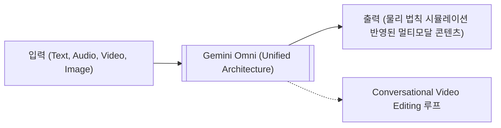

# [Deep Dive] Google I/O 2026 핵심 발표 및 비즈니스 임팩트 분석

*   **최초 작성일**: 2026.05.31
*   **관련 트렌드 리포트**: `@[Market_Trends/2026-05-31_Weekly_AI_Trend.md]`
*   **목적**: 2026년 5월 19일 개최된 Google I/O 2026의 주요 AI 발표(Gemini Omni, Gemini 3.5 Flash, Gemini Spark)를 조사하고, 이에 따른 B2B/B2C 비즈니스 전략적 시사점을 도출합니다.

---

## 1. Google I/O 2026 핵심 발표 요약

2026년 5월 19일 구글은 연례 개발자 컨퍼런스(I/O 2026)를 통해 3세대 라인업인 **Gemini 3.5 세대**와 실시간 물리 세계 시뮬레이션 및 다중 모드 통합 입출력이 가능한 새로운 범주인 **Gemini Omni** 제품군을 전격 공개했습니다. 이번 발표의 핵심 패러다임은 **‘실시간 인지(Omni-Realtime)’**와 **‘물리 시뮬레이션 월드 모델(World Model)’**의 결합입니다.

---

## 2. 핵심 발표 1: Gemini Omni (멀티모달 월드 모델)

### 2.1. 개념 및 아키텍처 특징
**Gemini Omni**는 단순한 멀티모달 결합(텍스트+이미지 파이프라인 우회 설계)을 넘어, **하나의 일원화된 신경망 아키텍처(Unified Architecture)로 텍스트, 오디오, 이미지, 비디오를 동시에 인지, 추론 및 생성하는 '월드 모델(World Model)'**입니다. 

*   **물리 법칙의 인지**: 중력, 역학 에너지(Kinetic Energy), 연속성 등 물리적 현실 세계의 물리적 특징과 인과관계를 내재적으로 이해하고 시뮬레이션할 수 있습니다.
*   **대화형 비디오 편집 (Conversational Video Editing)**: 사용자가 자연어로 직접 지시하여 비디오를 실시간으로 수정할 수 있습니다. 예를 들어 "배경의 흐린 날씨를 맑은 석양으로 변경해줘", "카메라 앵글을 시네마틱 줌인해줘"와 같은 명령을 수행하면서도 비디오 내 주인공의 캐릭터 일관성(Consistency)을 완벽하게 유지합니다.

### 2.2. 세부 라인업 및 서비스 통합
*   **Gemini Omni Flash**: I/O 발표 즉시 개방된 첫 번째 핵심 모델입니다. Google AI Plus, Pro, Ultra 구독자에게 즉각 지원되었으며, **YouTube Shorts 및 YouTube Create 앱**에 전면 임베딩되어 크리에이터 경제(Creator Economy)의 즉각적인 생산성 도구로 자리 잡았습니다.
*   **API 개방성**: 개발자 API 생태계로도 신속히 배포되었습니다. 기존 Gemini API 인터페이스와 호환되는 **Drop-in Replacement** 형태로 제공되어, 개발자들이 최소한의 코드 수정만으로 Omni 모델을 자사 시스템에 이식할 수 있도록 지원합니다.

---

## 3. 핵심 발표 2: Gemini 3.5 Flash 모델 론칭

구글은 비용 효율성과 지연 시간(Latency)을 혁신적으로 개선한 **Gemini 3.5 Flash**를 주력 릴리즈로 선보였습니다.

### 3.1. 기술 스펙 및 장점
*   **토큰 윈도우(Token Window)**: 프런티어급 모델 중 독보적인 **2M(200만) 토큰**의 초대형 컨텍스트 창을 유지하면서 처리 속도와 추론 비용을 획기적으로 감축했습니다.
*   **원가 경쟁력**: 1M Input 토큰당 **$0.075** 수준으로 공급가격을 낮추어, 프런티어 에이전트 인프라의 라우터 모델로 채택되기에 최고의 비용 효율성을 확보했습니다.
*   **멀티모달 통합 성능**: 대용량 비디오 파일(수 시간 분량)을 통째로 컨텍스트 창에 올려두고, 실시간 동영상 분석 및 특정 프레임 교정 작업을 무지연에 가깝게 수행합니다.

---

## 4. 핵심 발표 3: Gemini Spark (24/7 퍼스널 AI 에이전트)

### 4.1. 개념 및 특징
**Gemini Spark**는 사용자를 보좌하며 백그라운드에서 상시 구동하는 **24시간 퍼스널 AI 에이전트(Personal AI Agent)** 시스템입니다.

*   **상시 구동형 백그라운드 태스크**: 사용자가 오프라인 상태이거나 수면 중일 때도 이메일 모니터링, 데이터 통합 분석, 스케줄링 조율, 루틴 작업 자동화 등을 자율적으로 처리합니다.
*   **인텐트 분류 및 의사결정**: 간단한 수준의 확인은 스스로 처리하며, 중요한 승인이 필요한 변동 사항 발생 시에만 사용자에게 우선순위 알림을 보냅니다.
*   **비즈니스 파급력**: SaaS 툴 연동 시장 및 A2A(Agent-to-Agent) 협업 시장의 성장을 촉진시키는 기폭제 역할을 수행합니다.

---

## 5. 생성형 AI 비즈니스 기획자 관점의 시사점 (Action Insight)

Google I/O 2026 발표 내용에 따라, 우리의 AI 비즈니스 모델(BM)에 반영해야 할 구체적인 전략 과제는 다음과 같습니다.

### 5.1. 하이브리드 LLM 라우팅 아키텍처 도입 (COGS 절감)
*   **현실**: API 단가가 $0.075/1M 수준으로 떨어진 **Gemini 3.5 Flash**를 대량 호출 영역(데이터 1차 파싱, 문서 필터링, 에이전트 의사결정 라우팅 게이트웨이)에 적용하고, 복잡한 코드 생성 및 정밀 추론, 정교한 시각 검증이 필요할 때만 Claude Opus 4.8 혹은 GPT-5.5를 호출하는 구조로 아키텍처를 전면 리팩토링해야 합니다. 
*   **효과**: 단일 고성능 API 호출 방식 대비 **최대 60~70%의 API 원가(COGS) 절감**을 즉각 실현할 수 있습니다.

### 5.2. 대화형 비디오/멀티모달 크리에이티브 서비스 기획
*   **기회**: Gemini Omni의 뛰어난 비디오 편집 API 및 캐릭터 일관성 유지 기능을 활용하면, 기존의 단순 생성 툴을 넘어 **'사용자와 대화하며 피드백을 통해 씬(Scene)을 빌드해 나가는 고성능 비디오 제작 대리 에이전트 서비스'**를 B2B 시장에 선제적으로 론칭할 수 있습니다. 
*   **타겟 시장**: 마케팅 콘텐츠 자동 제작 솔루션, 게임 에셋 다이내믹 렌더링, 버추얼 인플루언서 숏폼 콘텐츠 양산 솔루션 등.

### 5.3. 상시 구동형 24/7 에이전트(A2A) 서비스 선점
*   **방향**: Google Spark와의 연동 규격(API 플러그인 등)을 선점하여, 우리의 독자 서비스가 상시 구동형 에이전트 생태계의 주요 허브로 기능하도록 연동형 에이전트 커넥터를 설계해야 합니다.
