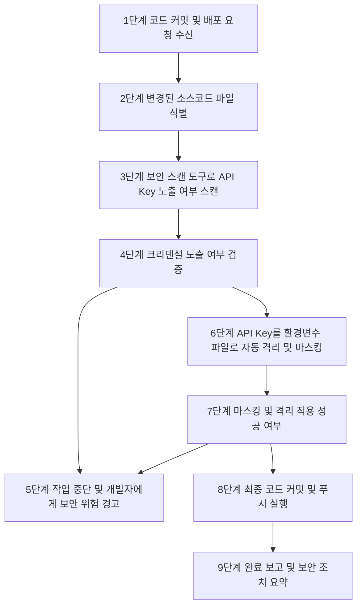
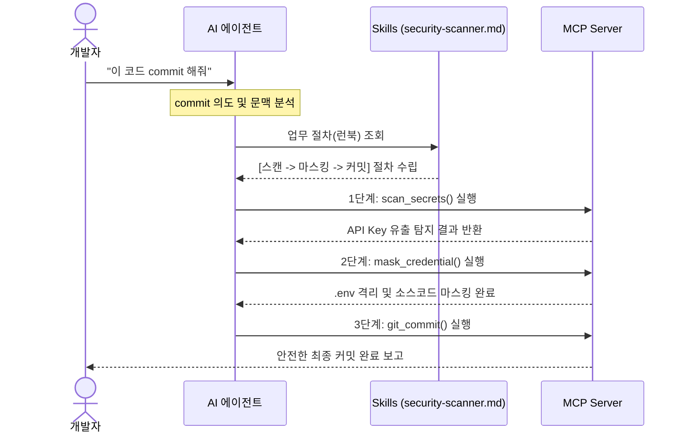

# 에이전트의 혼돈을 통제하기: Skills와 MCP를 활용한 비결정성 제어

우리는 바야흐로 AI 에이전트(Agentic AI)가 개발자의 단순 보조 도구를 넘어, 소스코드를 수정하고 컴파일을 돌리며 서버에 배포까지 대행하는 자율 프로그래밍 시대를 살아가고 있습니다. 그러나 이 강력한 기술을 실무에 도입하려는 모든 엔지니어는 머지않아 거대한 장벽에 직면하게 됩니다. 바로 대규모 언어 모델(LLM)이 본질적으로 내포하고 있는 **비결정성(Non-determinism)**입니다. 

자유롭게 사고하고 행동하는 에이전트는 매력적이지만, 미션 크리티컬한 배포 파이프라인에서 에이전트가 자의적으로 절차를 건너뛰거나, 잘못된 터미널 명령어를 입력하여 시스템을 망가뜨리는 순간 개발자 경험(DX)은 재앙으로 변합니다. 어떻게 하면 AI의 자율성과 유연함을 유지하면서도 소프트웨어의 안정성을 해치지 않도록 통제할 수 있을까요? 

이 글에서는 에이전트의 비결정적 행동을 억제하기 위한 현실적인 해법으로, 실행 가이드라인인 **Skills**와 격리된 외부 연동 프로토콜인 **MCP(Model Context Protocol)**의 하이브리드 연동 아키텍처를 다룹니다. 본 가이드는 **Google Antigravity CLI 환경을 기준으로 실전 셋업을 설명**하지만, '지능적 지침(Skills)과 시스템 격리(MCP)의 결합'이라는 설계 사상은 Claude Desktop이나 Cline 등 다른 에이전트 플랫폼에도 프롬프트 튜닝 형식으로 동일하게 이식될 수 있는 범용적인 아키텍처입니다.

---

## 1. 비결정성의 양날의 검: 유연한 혜택과 프롬프트 통제의 한계

그렇다면 근본적인 의문이 생깁니다. 통제하기 어렵고 위험하기까지 한 비결정성을 왜 굳이 소프트웨어에 도입하려는 걸까요? 아예 비결정성을 배제하면 그것을 제어하기 위한 무수한 노력을 기울이지 않아도 될 텐데 말입니다.

그럼에도 불구하고 에이전트에 비결정성을 허용하는 이유는, 그것이 전통적인 소프트웨어가 가진 고질적인 한계를 극복하는 **'유연한 지능과 문제 해결력'**을 제공하기 때문입니다.

첫째, 예외적 상황에 대한 복원력(Resilience)입니다. 하드코딩된 규칙은 사전에 정의되지 않은 변칙적인 입력이나 환경 변화를 마주하면 즉시 멈추거나 에러를 뱉습니다. 반면, 확률적 판단을 내리는 비결정적 에이전트는 맥락을 통해 오타를 보정하거나, 바뀐 UI나 데이터 구조에 맞춰 스스로 우회 실행 경로를 탐색해 문제를 끝마칩니다.

둘째, 스스로 문제를 고치는 자기 치유(Self-Healing) 능력입니다. 에이전트는 컴파일 에러나 API 실패 에러를 맞닥뜨렸을 때 단순히 중단되는 대신, 실패 로그를 다시 컨텍스트로 삼아 코드를 리팩토링하고 재빌드를 시도하는 자율적 예외 복구를 수행할 수 있습니다.

셋째, 목표 지향적(Goal-Oriented) 수행입니다. 상세한 절차적 로직(How)을 개발자가 한 줄 한 줄 코딩하지 않아도, 달성해야 할 최종 목표(What)만 주어지면 상황에 따라 방법을 동적으로 찾아 수행합니다.

결국 비결정성을 도입하는 것은 통제를 위한 비용보다 **'자율적인 복원력과 예외 해결력'**으로 얻는 혜택이 압도적으로 크기 때문입니다. 하지만 바로 이 지점에서 우리는 거대한 딜레마에 부딪힙니다. 이 유연한 비결정성을 어떻게 하면 시스템이 허용하는 안전 가이드라인 안으로 끌어들일 수 있을까요?

대부분의 에이전트 프레임워크는 시스템 프롬프트(System Instructions)에 의존하여 에이전트의 행동을 규정합니다. "너는 안전하게 포스트를 배포하는 도구야. 배포하기 전에 반드시 검증을 거쳐야 해"와 같은 지침이 대표적입니다. 

하지만 프롬프트는 어디까지나 권장 사항일 뿐 강제력이 없습니다. 컨텍스트가 길어지거나 예외 상황이 발생하면 에이전트는 지침을 쉽게 잊어버리고 곧바로 최종 배포 명령을 실행해 버리는 '탈선(Ad-hoc execution)' 현상을 보입니다. 또한 에이전트에게 원격 쉘 권한(`run_command`)을 통째로 넘겨줄 경우, 인자의 미세한 타이포(Typo)나 실수로 엉뚱한 명령어를 실행해 인프라를 오염시킬 위험성도 여전히 존재합니다. 

즉, 비결정성의 압도적인 혜택을 온전히 누리면서도 그것을 '결정론적'으로 작동하게 하려면, 단순한 프롬프트 설정 수준을 넘어 에이전트의 행동 반경을 가로막는 엄격한 가이드라인(Skills)과 통제된 실행 환경(MCP)을 물리적으로 결합해야만 합니다.

---

## 2. 해결의 열쇠: Skills와 MCP의 기초 개념

비결정성을 안전하게 수용하고 통제하기 위해, 현대 Agentic AI 아키텍처는 **Skills**와 **MCP**라는 두 가지 핵심 기둥을 중심으로 재편되고 있습니다. 이 두 기둥은 AI 기반의 워크플로우 패러다임이 과거의 **'완전 자율(Autonomous Workflow)'**에서 오늘날 **'제어 가능한 워크플로우(Controlled Workflow)'**로 진화하고 있음을 단적으로 보여주는 도구입니다.

### Autonomous에서 Controlled로: 패러다임의 변화
에이전트 기술 초기에는 사람이 아무런 개입을 하지 않아도 AI가 목표를 향해 스스로 판단하고 동작하는 '완전 자율(Autonomous) 워크플로우'가 이상향으로 꼽혔습니다. 그러나 실제 프로덕션 환경에 에이전트를 배치한 결과, 고삐 풀린 자율성은 무한 루프, 인프라 파괴, 비결정적 탈선 등의 심각한 리스크를 초래했습니다. 

이에 따라 업계는 AI에게 무제한의 자유를 주는 대신, 인간이 규정한 범위 안에서만 자율성을 발휘하도록 제어하는 **'통제 가능한(Controlled/Guided) 워크플로우'**로 빠르게 선회하고 있습니다. 그리고 이 제어 환경을 구성하기 위한 기술적 수단이 바로 Skills와 MCP입니다.

### 1) Skills: AI와 인간이 합의한 선언적 런북 (Declarative Runbook)
Skills의 정의는 에이전트가 비즈니스 목적을 달성하기 위해 밟아야 할 단계별 실행 매뉴얼이자 런북(Runbook)입니다. 에이전트 환경에 익숙하지 않은 사용자에게 Skills는 단순한 도움말로 보일 수 있지만, 실질적으로는 에이전트의 '인지 부하(Cognitive Load)'를 줄이고 행동의 예측 가능성을 높여주는 프레임워크입니다. 주로 프로젝트 내 `.agents/skills/` 디렉토리에 마크다운(`.md`) 파일로 작성되며, 에이전트에게 '각 단계에서 준수해야 할 필수 조건'과 '오류 발생 시 우회(Fallback) 시퀀스'를 선언적으로 구조화하여 학습시킵니다. 이를 통해 확률적으로 요동치는 에이전트의 생각을 정해진 궤도 안으로 정렬합니다.

### 2) MCP (Model Context Protocol): 시스템 레벨의 도구 격리 표준
MCP의 정의는 에이전트가 데이터베이스, 파일 시스템, 외부 API 등 호스트 환경과 안전하게 통신할 수 있도록 규정하는 표준 개방형 프로토콜입니다. 에이전트에게 무제한 쉘 접근 권한(`run_command`)을 주는 대신, JSON-RPC 통신을 통해 사전에 허가된 API(예: `list_tags()`, `deploy_post()`)만을 격리하여 노출합니다. 에이전트가 도구를 호출할 때 전달하는 인자 스펙(`inputSchema`)을 컴파일 타임에 검증함으로써 비결정적인 매개변수 변조나 명령어 오작동을 원천적으로 제한하는 강력한 방화벽 역할을 수행합니다.

---

## 3. Skills와 MCP가 만드는 조화로운 가드레일

Skills와 MCP는 에이전트의 실행 무결성을 확보하기 위한 이중 제어 장치로 동작합니다. **Skills**가 에이전트가 준수해야 할 논리적 절차와 단계별 지침을 강제한다면, **MCP**는 호스트 환경과의 연동 과정에서 발생할 수 있는 시스템 오작동과 인프라 오염을 차단하기 위한 격리 인터페이스 역할을 수행합니다.



위 다이어그램처럼 배포 요청이 들어왔을 때, 에이전트가 무작정 코드 커밋이나 푸시부터 처리하지 못하도록 차단하는 원리는 다음과 같습니다.

### 실행 가이드로서의 Skills (결정론적 시퀀스 수립)
에이전트가 로드하는 `SKILL.md`는 단순 설명서가 아닙니다. 에이전트가 지켜야 할 파이프라인의 각 단계와 조건 분기를 명시한 **실행 계약서**입니다.
배포 프로세스는 변경된 소스코드 식별부터 API Key 노출 여부 스캔(`scan_secrets` 호출), 크리덴셜 검증 및 환경변수 마스킹 조치(`mask_credential` 호출)를 거쳐 최종 안전한 상태에서 커밋(`git_commit` 호출)을 실행하는 시퀀스로 구성됩니다.

에이전트는 이 런북을 컨텍스트에 담고 작업을 시작하기 때문에, 자신이 다음 단계로 넘어가기 전 무엇을 먼저 확인해야 하는지 명확히 인지하게 됩니다.

### 격리 펜스로서의 MCP (도구의 캡슐화)
에이전트에게 날것의 리눅스 터미널 환경을 쥐어주는 대신, 표준 I/O(JSON-RPC) 기반의 MCP 서버를 연동합니다. MCP 서버는 에이전트에게 오직 보안 검사 및 깃 커밋에만 허가된 세 가지 안전한 도구(`scan_secrets`, `mask_credential`, `git_commit`)만을 노출합니다. 
에이전트가 어떤 쉘 명령어를 실행할지 고민할 필요 없이 정해진 인자 구조를 담아 Tool Call을 보내면, 뒷단에서 실제 바이너리가 격리되어 작동합니다. 이는 에이전트의 비결정적 코딩 실수를 구조적으로 원천 봉쇄합니다.

### Hands-On: 실제 설정 파일로 이해하는 연동

본격적으로 실습을 따라 해보기 전, 에이전트와 Skills 및 MCP가 맞물려 동작할 수 있도록 필수적인 전제 환경을 먼저 갖추어야 합니다.

#### 1) 필수 준비물 (Prerequisites)
Skills를 적재하고 MCP 도구를 해석하여 실행해 줄 수 있는 AI 에이전트 CLI 환경이 반드시 설치되어 있어야 합니다.
* **에이전트 플랫폼**: Google Antigravity CLI (`agy`), Antigravity 2.0 Desktop App, 혹은 MCP 프로토콜 v1.0.0 및 로컬 설정 파일 검색을 지원하는 에이전트 런타임(Claude Desktop, Cline 등) 중 하나를 완비합니다.
* **실습용 프로젝트 루트**: 로컬 환경에 실습을 테스트할 새 폴더를 생성하고 터미널에서 진입합니다. (`mkdir agent-security-lab && cd agent-security-lab`)

필수 환경이 준비되었다면, 이제 실습해볼 구체적인 연동 시나리오의 흐름을 정의해 보겠습니다.

**실습 시나리오 배경**
개발자가 소스코드를 로컬 Git 저장소에 커밋하려 할 때, 실수로 중요한 API Key나 비밀번호를 코드에 하드코딩한 채 푸시하는 대형 보안 사고를 예방하는 것이 목적입니다. 

에이전트는 사용자가 커밋을 지시하면 즉시 커밋하지 않고, 먼저 소스코드를 검사하여 노출된 크리덴셜을 탐지합니다. 탐지 시 작업을 일시 중단하고 개발자에게 경고하며, 승인을 얻어 해당 키를 별도의 `.env` 파일로 이주시킨 뒤 소스코드 상에는 환경변수 참조 형태(`process.env.MAPS_CLIENT_SECRET`)로 자동 치환 및 마스킹 조치한 후 최종 커밋을 안전하게 수행합니다.

이 워크플로우를 완수하기 위해 에이전트, Skills, MCP 서버가 상호작용하는 시퀀스는 다음과 같습니다.



이 워크플로우를 완수하기 위해 프로젝트 내 설정 파일들은 다음과 같이 배치됩니다.

먼저, 에이전트가 의사결정 과정에서 준수해야 할 실행 규약인 `.agents/skills/security_scanner.md` 지침 파일의 핵심 구조입니다.

```markdown
# 크리덴셜 스캔 및 자동 마스킹 스킬
에이전트는 코드 커밋 요청을 수행할 때 반드시 다음 순서를 준수해야 합니다.
1단계 `scan_secrets` 도구를 호출하여 변경된 소스코드 내 API 키 노출 여부를 스캔한다.
2단계 API 키 노출이 감지되면 즉시 작업을 중단하고 개발자에게 경고한다.
3단계 개발자 승인 시 `mask_credential` 도구를 호출해 API 키를 `.env` 파일로 이주시키고 소스코드에는 변수명으로 마스킹한다.
4단계 모든 검증과 조치가 통과된 경우에만 `git_commit`을 트리거하여 안전하게 커밋을 실행한다.
```

다음으로 에이전트에게 위 지침에서 필요한 도구들을 안전하게 제공하기 위해 정의된 `.agents/mcp_config.json` 설정 파일입니다.

```json
{
  "mcpServers": {
    "security-mcp-server": {
      "command": "/absolute/path/to/tools/security/mcp-security-server",
      "args": []
    }
  }
}
```

이와 같이 에이전트는 기동될 때 `mcp_config.json`을 통해 연동된 `mcp-security-server`로부터 `scan_secrets`, `mask_credential`, `git_commit` 도구의 사양을 인지하게 됩니다. 그리고 사용자가 배포를 명령하면, `security_scanner.md` 스킬의 정의대로 순차적 툴 호출 계획을 스스로 수립하여 안전하게 실행을 이행합니다.

---

## 4. 실전: 시맨틱 체크와 예외 처리

실제로 이 하이브리드 아키텍처가 빛을 발하는 순간은 예외가 발생했을 때입니다. 예를 들어 개발자가 작성한 소스코드 내에 외부 지도 API의 시크릿 키(`Client Secret`)가 하드코딩 형태로 포함된 시나리오를 가정해 봅시다.

1. 에이전트는 Skills의 지침에 따라 커밋을 실행하기 전 가장 먼저 MCP 도구인 `scan_secrets()`를 호출합니다.
2. 소스코드 내부에서 노출된 시크릿 키를 감지하고 작업을 즉시 멈춘 뒤 개발자에게 경고합니다.
3. 승인 하에 `mask_credential()`을 동작시켜 시크릿 키를 `.env` 파일로 자동으로 옮겨 적고, 소스코드 내의 하드코딩된 값은 `process.env.MAPS_CLIENT_SECRET` 변수명으로 자동 치환합니다.
4. 만약 이 격리 작업 중 오류가 발생하여 안전성이 완전히 보장되지 않으면, 프로세스를 즉시 **중단(Abort)**하고 개발자에게 조치를 고지합니다.

이 모든 과정에서 보안이 확보되지 않은 날것의 코드가 깃허브나 외부 서버로 유출되는 사고를 사전에 차단하게 됩니다. 시맨틱 레이어를 통한 선제적인 팩트 체크 덕분에 잠재적인 보안 위험을 안전하게 막아낸 것입니다.

---

## 5. 마치며: 로컬 가드레일에서 엔터프라이즈로

개인 개발 환경이나 단일 프로젝트 레벨에서는 마크다운 기반의 `SKILL.md`를 프로젝트 폴더 내 `.agents/`에 배치하고 로컬 MCP 바이너리를 연동하는 것만으로도 비결정성을 통제하는 안전한 DX를 충분히 누릴 수 있습니다. 에이전트가 똑똑하게 가이드를 지키며, 쉘 오작동 없이 정해진 도구만을 사용해 배포를 안정적으로 성공시키기 때문입니다.

하지만 비즈니스의 규모가 커지고 에이전트가 다루어야 할 레거시 API가 수백 개로 늘어나며, 다수의 사용자가 동시에 에이전트를 사용하는 **엔터프라이즈 환경**이 되면 이야기는 달라집니다. 에이전트가 사용하는 스킬 파일의 위변조를 막아야 하고, 도구 호출 권한을 중앙에서 제어해야 하며, 비결정성을 물리적으로 차단하기 위한 격리 게이트웨이가 추가로 필요해집니다.

로컬에서 검증한 Skills와 MCP의 정합성이 엔터프라이즈급 아키텍처에서 어떤 모양의 '시맨틱 미들웨어'로 변모해야 하는지, 다음 글에서 그 심층적인 여정을 이어가 보겠습니다.
