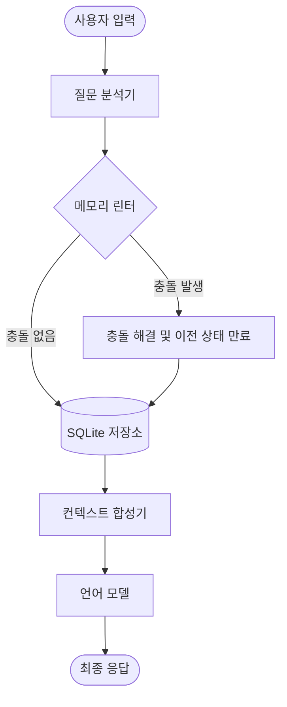
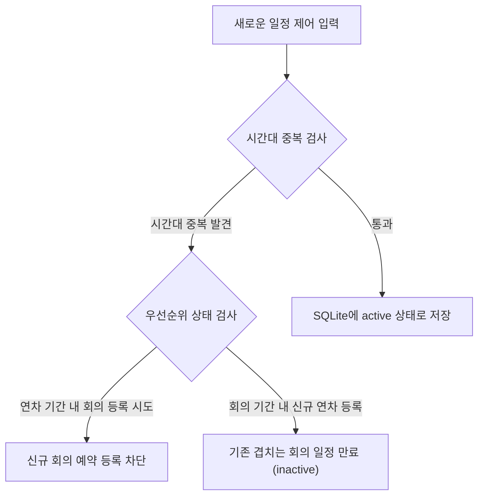
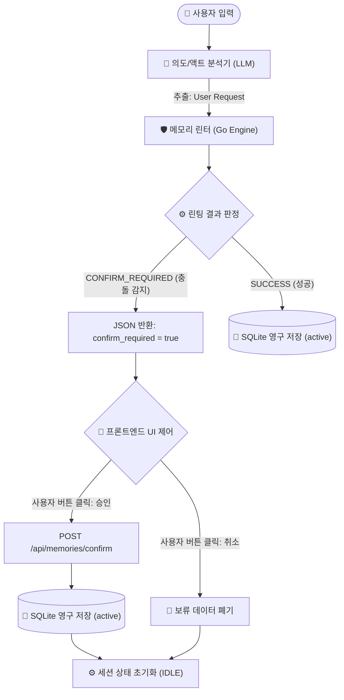
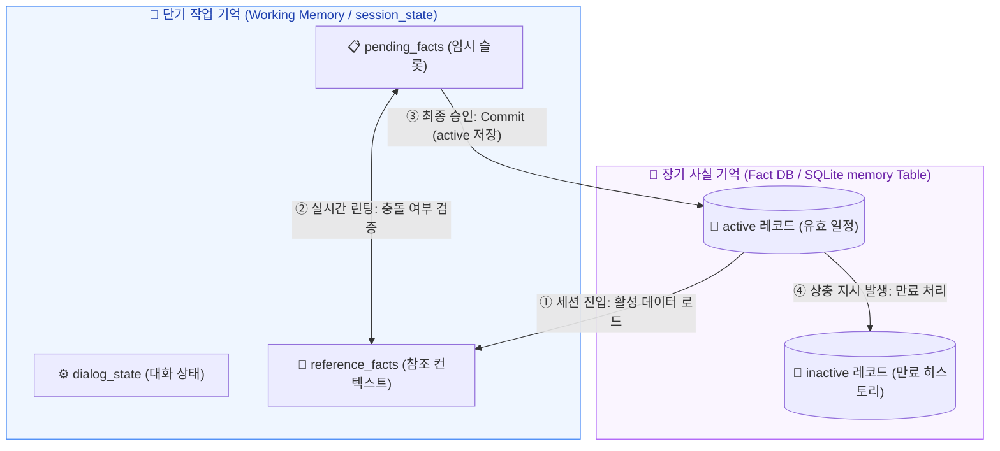
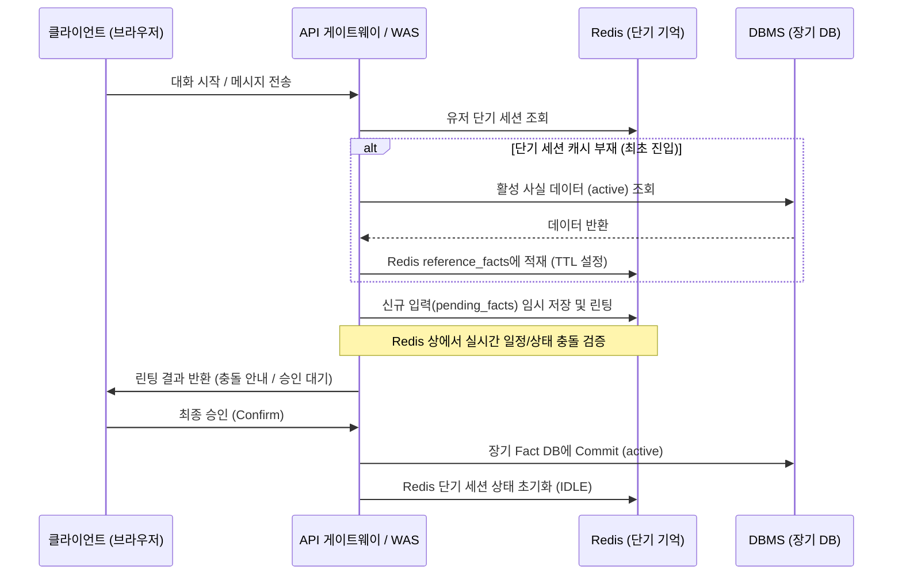

# MOSS 개념 검증 설계 문서

이 문서는 인공지능 에이전트의 장기 기억 관리를 통제하고 환각을 차단하기 위한 MOSS 아키텍처의 개념 검증용 설계 문서입니다.

---

## 1. 검증 목적
* 대화 원본 로그를 모두 프롬프트에 누적하는 방식 대비 메모리 보존 비용 절감 효과를 입증합니다.
* 사용자가 모순되거나 충돌하는 지시를 내릴 때 메모리 린터가 이를 가로채서 상태를 일관되게 정렬하는지 검증합니다. (예: 연차 기간 내 회의 예약 차단)
* 데이터 검색 단계에서 비결정적인 추론을 배제하고 결정적인 데이터베이스 쿼리를 통해 보안과 정확성을 보장함을 증명합니다.

---

## 1.5. 사용자 관점의 애플리케이션 동작 흐름

이 개념 검증 애플리케이션은 웹 화면 상에서 실행되는 대화형 프로그램의 형태를 가집니다. 사용자는 다음과 같은 흐름으로 시스템을 사용하고 결과를 검증할 수 있습니다.

### 1단계: 최초 연차 등록 (우선순위 지시 입력)
* **사용자 입력**: `"나 내일 금요일(7/17) 하루 종일 연차 휴가야. 캘린더에 등록해줘."` (기준일: 2026-07-16 목요일)
* **애플리케이션 출력**: 
  * 입력한 자연어에서 추출된 매개변수 정보 및 신규 저장 로그 메시지가 출력됩니다.
  * 현재 데이터베이스에 등록된 활성 상태의 기억 목록이 화면에 표 형태로 갱신되어 나타납니다.
    * *기억 목록 출력 예시*: `Calendar-vacation: Vacation (활성)`

### 2단계: 연차 기간 중 회의 예약 시도 (충돌 발생 상황)
* **사용자 입력**: `"금요일 오전 10시에 개발팀 미팅 일정 예약해줘."`
* **애플리케이션 출력**:
  * 시스템 내부의 메모리 린터가 기존 연차(Vacation) 일정과의 시간대 중복 및 근무 상태 모순을 감지했다는 안내 경고가 표시됩니다.
  * 기존 연차 기억의 활성 상태를 유지하는 대신, **신규 회의 일정 예약 등록이 차단(Skip)**되었음을 확인 가능합니다.
  * 최종적으로 데이터베이스 테이블에 회의 레코드가 활성화되지 않고, 기존 연차 레코드만 활성 상태로 남아있음을 확인할 수 있습니다.

### 3단계: 최종 일정 요약 및 비교 검증
* **사용자 입력**: `"금요일 오전 10시에 내 일정 요약해줘."`
* **최종 확인 가능 결과**:
  애플리케이션은 두 가지 처리 방식을 화면에 동시에 출력하여 사용자가 실시간으로 대조할 수 있도록 지원합니다.

  1. **단순 대화 이력 기반 처리 결과 (대조군)**
     * **전송된 컨텍스트**: 1단계와 2단계의 모순된 대화 내용이 날것의 텍스트 형태로 모두 전달됩니다.
     * **출력된 답변**: `금요일에는 연차 휴가이시며, 오전 10시에 개발팀 미팅이 잡혀 있습니다.` 와 같이 실제로는 동시에 존재할 수 없는 모순된 일정을 함께 출력합니다.
  2. **MOSS 기억 레이어 기반 처리 결과 (실험군)**
     * **전송된 컨텍스트**: 메모리 린터에 의해 정합성이 보장된 최신의 진실 데이터만 필터링되어 전달됩니다.
     * **출력된 답변**: `해당 시간은 연차 휴가 기간이므로 예정된 회의가 없습니다.` 와 같이 정확하고 일관성 있는 답변을 출력합니다.

* **최종 확인 지표**: 화면 하단에 두 방식의 **총 사용 토큰 수**와 **응답 대기 시간**이 나란히 출력되어 효율성 차이를 정량적으로 확인할 수 있습니다.

---

## 1.6. 애플리케이션 화면 구조

개념 검증 도구의 원활한 시각화와 대조 검증을 위해 화면을 다음과 같은 레이아웃으로 구성합니다.

```text
+----------------------------------------------------------------------------+
|                        MOSS 개념 검증 통합 대시보드                        |
+----------------------------------------------------------------------------+
| [ 사이드바 제어 패널 ]       | [ 메인 작업 영역 ]                          |
|                              |                                             |
| 1. 데이터베이스 모니터       | * 대화 및 지시 입력창                       |
|    - 활성 기억 테이블 조회   |   [ 문장을 입력하세요...           ] [전송] |
|    - 만료 기억 테이블 조회   |                                             |
|                              | * 3단계 최종 결과 대조 화면                 |
| 2. 표준 규격 정보            |   +------------------+------------------+   |
|    - 텍사노미 규칙 목록      |   | 단순 대화 누적   | MOSS 기억 제어   |   |
|      (Calendar - vacation)   |   | (대조군)         | (실험군)         |   |
|                              |   +------------------+------------------+   |
| 3. 기억 초기화               |   | 금요일 연차 휴가 | 금요일 10시에는  |   |
|    [ 데이터베이스 리셋 ]     |   | 오전 10시 미팅   | 연차 휴가 기간   |   |
|                              |   | (과거 정보 혼선) | 이므로 예정된    |   |
|                              |   |                  | 회의가 없습니다  |   |
|                              |   +------------------+------------------+   |
|                              |   | 소요 토큰: 25K   | 소요 토큰: 1.2K  |   |
|                              |   | 소요 시간: 3.5초 | 소요 시간: 0.6초 |   |
|                              |   +------------------+------------------+   |
|                              |                                             |
|                              | * 디버그용 프롬프트 전송 로그 확인창        |
+----------------------------------------------------------------------------+
```

---

## 2. 아키텍처 구조

MOSS 시스템은 다음과 같은 흐름으로 구동됩니다.



---

## 2.5. 기술 스택 및 연동 사양

개념 검증 시스템의 타입 안전성과 오리지널 그래프 런타임 검증을 위해 백엔드를 Go 언어로 구성하고 프론트엔드를 분리합니다.

* **백엔드 프레임워크**: Go (v1.26+) 및 Gin Web Framework (v1.9+)
* **클라우드 언어 모델**: Google AI Studio `gemini-3.5-flash` 모델 연동
* **에이전트 프레임워크 및 오케스트레이터**: Google Go ADK (`github.com/google/adk`)의 Graph Workflow 런타임 엔진 활용
* **기억 데이터 저장소**: `modernc.org/sqlite` (순수 Go 기반 파일 저장소 제어)
* **프론트엔드**: Svelte 5 + Vite CSR 연동 (독립 서버 서빙 및 API 비동기 Fetch 통신)

---

## 2.6. 디렉토리 구조 설계

Go 모듈 구조 표준에 맞춰 MOSS 백엔드 디렉토리를 다음과 같이 구성합니다.

```text
poc/moss/
├── README.md             # 개념 검증 설계 문서
├── go.mod                # Go 모듈 메타데이터 파일
├── go.sum
├── main.go               # Gin API 구동 및 Go ADK 런타임 진입점
├── Dockerfile            # Go 멀티스테이지 컨테이너 빌드 파일
├── docker-compose.yml    # Go 백엔드 기동용 도커 오케스트레이션
├── database/
│   ├── sqlite.go         # SQLite 연결 및 테이블 구조체 스키마 초기화
│   └── repository.go     # SQLite 기억 쿼리 및 트랜잭션 상태 만료 처리
└── engine/
    ├── gemini.go         # Google AI Studio API 호출 공통 라이브러리 (신규)
    ├── analyser.go       # Go ADK 기반 질문 분석 및 출력 스키마 정의
    ├── linter.go         # Go 기반 충돌 검사 및 의사결정 제어 노드
    ├── synthesizer.go    # SQLite 유효 데이터 로드 및 팩트 프롬프트 조립 노드
    └── workflow.go       # Go ADK Graph Workflow 및 조건부 분기 정의
```

---

## 2.7. 다차원 맥락 검토 메커니즘

단순한 1대1 키 일치 검사를 넘어, 연차와 다른 일정 간의 논리적 충돌을 방지하기 위해 메모리 린터는 다음 맥락 검토 규칙을 강제합니다.



---

## 2.8. 멀티 에이전트 협업 아키텍처

개념 검증 시나리오를 바탕으로 각 구성 요소의 역할, 지시어, 사용 도구를 상세히 정의합니다.

### 1. 질문 분석 에이전트 (인공지능)
* **하는 일**: 사용자의 입력 문장을 파싱하여 대분류 범주, 표준 주체, 표준 속성, 시간 범위를 추출하고 JSON 데이터로 구조화합니다.
  * *시나리오 적용*: 사용자가 `"나 내일 금요일 하루 종일 연차야"`라고 입력하면, 현재 날짜를 기준으로 금요일 날짜를 계산하고 `Calendar` 도메인의 `vacation` 속성을 식별하여 정형 매개변수를 생성합니다.
* **핵심 지시어 (시스템 프롬프트)**:
  ```text
  너는 사내 일정 관리 및 회의 예약을 파싱하는 전문 인공지능 에이전트이다.
  반드시 제시된 텍사노미 규격을 준수하여 JSON 형태로만 답변해야 하며, 상대적인 시간 지칭어는 현재 시점을 기준으로 절대적인 날짜시간 값(YYYY-MM-DD HH:MM:SS)으로 연산하여 변환해야 한다.
  ```
* **사용하는 도구**: 없음 (순수 추론 연산)

### 2. 메모리 린터 도구 (Go 패키지 노드)
* **하는 일**: 질문 분석 에이전트가 추출한 JSON 데이터를 인계받아 데이터베이스 레벨에서 물리적 시간 중복과 연차-회의 간 우선순위 모순을 검사하고 차단 및 만료 처리합니다.
  * *시나리오 적용*: 
    1. 등록하려는 회의 시간대와 기존 연차 시간대의 중복을 쿼리하여 감지합니다.
    2. 연차의 높은 우선순위 규칙에 근거하여 신규 회의 일정 저장을 건너뛰고 기존 연차 일정을 보존합니다.
* **사용하는 도구**: 
  * `database/repository.go` 내의 `InvalidateMemories()` 및 `SaveMemory()` 메서드

### 3. 컨텍스트 합성 도구 (Go 패키지 노드)
* **하는 일**: SQLite 데이터베이스를 조회하여 현재 시점에 유효한(`status = 'active'`) 팩트 정보들만 선별하여 프롬프트 컨텍스트 메시지로 조립합니다.
* **사용하는 도구**: 
  * `database/repository.go` 내의 `FindActiveMemories()` 메서드

### 4. 메인 오케스트레이터 에이전트 (Go ADK 에이전트)
* **하는 일**: Google ADK 워크플로우를 통제하여 위 하위 컴포넌트들을 순차적으로 구동시키고, 합성된 최종 팩트 컨텍스트를 주입받아 사용자에게 실시간 요약 답변을 작성합니다.
* **핵심 지시어 (시스템 프롬프트)**:
  ```text
  너는 사내 일정 관리를 지원하는 전문 에이전트이다.
  너의 입력단에는 데이터베이스에서 직접 조회 및 검증을 마친 유효한 사실 정보(Fact Context)가 명확히 주입되어 있다.
  사용자가 모순되는 일정(예: 연차 기간 중 회의 예약 등)에 대해 묻는 경우, 과거 대화의 날것의 텍스트에 흔들리지 말고 오직 주입된 사실 정보(Fact Context)에만 근거하여 답변을 작성해야 한다.
  주입된 정보(Fact Context)에 특정 회의가 없고 연차(Vacation) 일정만 활성화되어 있다면, "해당 시간은 연차 휴가 기간이므로 예정된 회의가 없습니다"와 같이 정보 부재를 사실에 기반하여 답변하라.
  ```
* **사용하는 도구**: Google ADK 워크플로우 런타임 (각 처리 노드 실행 통제)

---

## 3. 데이터 모델 설계

기억 정보를 유기적이고 일관되게 적재하기 위해 SQLite 상에 다음과 같은 스키마로 트리플렛 데이터를 보관합니다.

### 기억 테이블 스키마 (memory)

| 열 이름 | 데이터 타입 | 설명 |
| :--- | :--- | :--- |
| id | INTEGER PRIMARY KEY | 레코드 고유 식별자 |
| user_name | TEXT | 사용자 식별자 |
| domain | TEXT | 기억의 대분류 범주로 Schedule 고정 |
| subject | TEXT | 기억의 대상을 나타내는 주체로 Calendar 고정 |
| predicate | TEXT | 대상의 속성 또는 관계 (vacation 또는 meeting) |
| object_value | TEXT | 속성에 할당된 구체적인 값 (Vacation 또는 회의명) |
| status | TEXT | 기억의 활성화 상태 (active 또는 inactive) |
| updated_at | DATETIME | 마지막 업데이트 시점 |
| start_time | DATETIME | 일정 또는 예약의 시작 시점 |
| end_time | DATETIME | 일정의 종료 시점 |

---

## 5. 개념 검증 시나리오 및 수행 단계 (POC Test Scenario)

### 5.0. MOSS의 핵심 특징 및 장점
* **기억 정합성 유지 (메모리 린터)**: 사용자가 기존 지시와 모순되는 변경 지시를 내리면, 메모리 린터가 충돌을 감지해 과거의 기억을 자동으로 만료(`inactive`)시키거나 높은 우선순위 일정(연차)을 기준으로 충돌 지시를 원천 차단합니다.
* **환각(Hallucination) 차단**: 비결정적인 대화 이력 전체를 프롬프트에 주입하는 대신, 데이터베이스에서 정합성이 보장된 최신 팩트(`active`)만 컨텍스트로 합성해 LLM에 제공함으로써 잘못 뒤섞인 답변이나 환각을 방지합니다.
* **토큰 및 비용 절감**: 불필요한 과거 이력을 제외하고 압축된 팩트 컨텍스트만 전송하므로, 대화가 길어져도 프롬프트 토큰 양과 응답 시간을 대폭 줄일 수 있습니다.

---

### 5.0.1. 웹 UI 테스트 시나리오

* **1단계: 최초 연차 등록 (WRITE)**
  * **입력**: `"나 내일 금요일(7/17) 하루 종일 연차 휴가야. 캘린더에 등록해줘."` (기준일: 2026-07-16 목요일)
  * **검증**: 데이터베이스 모니터에서 `Calendar-vacation: Vacation(active)` 상태가 정상 등록되었는지 확인합니다.

* **2단계: 연차 기간 내 회의 예약 시도 (WRITE)**
  * **입력**: `"금요일 오전 10시에 개발팀 미팅 일정 예약해줘."`
  * **검증**: 메모리 린터가 충돌을 감지하여 신규 회의 일정의 등록을 자동으로 건너뛰고(차단), 기존 연차 데이터만 `active` 상태로 유지하고 있는지 확인합니다.

* **3단계: 최종 일정 요약 요청 및 대조 확인 (QUERY)**
  * **입력**: `"금요일 오전 10시에 내 일정 요약해줘."`
  * **검증 (성공 판정)**: 챗봇 답변에 "해당 시간은 연차 휴가 기간이므로 예정된 회의가 없습니다"라고 정보 부재 안내가 명확하게 명시되는지 확인합니다. (만료된 데이터가 배제되어 환각이 일어나지 않음을 검증)

---

### 5.0.2. Curl 기반 API 테스트 시나리오

MOSS Go 백엔드 API 서버를 실행한 상태에서 아래의 curl 시나리오를 단계별로 실행하여 기억 만료 및 차단 린팅 동작을 직접 검증할 수 있습니다.

### 5.1. 1단계: 최초 연차 휴가 등록 (WRITE)
* **테스트 명령어**:
  ```bash
  curl -s -X POST http://localhost:8080/api/chat \
    -H "Content-Type: application/json" \
    -d '{"user_name": "yundream", "text": "나 내일 금요일(7/17) 하루 종일 연차 휴가야. 캘린더에 등록해줘."}'
  ```

### 5.2. 2단계: 연차와 겹치는 시간대 미팅 등록 시도 (WRITE / 충돌 감지)
* **테스트 명령어**:
  ```bash
  curl -s -X POST http://localhost:8080/api/chat \
    -H "Content-Type: application/json" \
    -d '{"user_name": "yundream", "text": "금요일 오전 10시에 개발팀 미팅 일정 예약해줘."}'
  ```

### 5.3. 3단계: 최종 일정 상태 질의 (QUERY)
* **테스트 명령어**:
  ```bash
  curl -s -X POST http://localhost:8080/api/chat \
    -H "Content-Type: application/json" \
    -d '{"user_name": "yundream", "text": "금요일 오전 10시에 내 일정 요약해줘."}'
  ```
* **성공 판정 기준**:
  * **반환 응답**: 메인 에이전트의 대답에 "해당 시간은 연차 휴가 기간이므로 예정된 회의가 없습니다"라는 정보 부재 안내가 명확하게 명시되어야 성공입니다.
  * **데이터베이스 상태**: SQLite 파일 `moss_memory.db`를 확인했을 때, 기존 연차 건은 `status = 'active'`로 유효하게 유지되고 있고 겹치는 미팅 건은 삽입되지 않았거나 비활성화 상태여야 합니다.

---

## 7. MOSS PoC 검증 시나리오 설계 (gemini-3.5-flash 대상)

MOSS 도입 전후의 성능 및 데이터 무결성 차이를 클라우드 LLM인 `gemini-3.5-flash` 환경에서 대조 검증하기 위한 상세 실무 시나리오 명세입니다.

### 7.1. 검증용 대화 시퀀스
*   **Turn 1 (최초 지시 입력):**
    *   *사용자 발화:* "나 내일 금요일(7/17) 하루 종일 연차 휴가야. 캘린더에 등록해줘."
*   **Turn 2 (상충 변경 지시 입력):**
    *   *사용자 발화:* "금요일 오전 10시에 개발팀 미팅 일정 예약해줘."
*   **Turn 3 (최종 추론 및 요약 요청):**
    *   *사용자 발화:* "금요일 오전 10시에 내 일정 요약해줘."

### 7.2. MOSS 적용 전 vs 후 구동 및 결과 비교

#### A. MOSS 적용 전 (단순 대화 로그 누적 RAG)
*   **프롬프트 페이로드 상태:** Turn 1과 Turn 2의 발화 텍스트 전문이 요약 없이 그대로 LLM의 Context Window에 누적되어 송출됩니다.
    *   *전송 데이터:* `"...금요일 하루 종일 연차 휴가... 금요일 오전 10시에 개발팀 미팅..."`
*   **추론 에러 병목:** 문맥 내에 "연차 휴가 vs 미팅 참석"의 상반된 팩트가 혼재되어 sLLM이 결정 경로에서 극심한 혼란을 겪습니다.
*   **최종 오작동 출력 결과:**
    *   *출력값:* `❌ "금요일에는 연차 휴가이시며, 오전 10시에 개발팀 미팅이 예정되어 있습니다."` (현실적으로 불가능한 모순된 일정이 함께 공존하여 환각 발생)

#### B. MOSS 적용 후 (MOSS 아키텍처)
*   **MOSS DB 상태 (Turn 1 ➡️ Turn 2 거친 후):**
    *   Linter의 충돌 감지 로직으로 인해 연차와 중복되는 미팅은 등록 차단되어, 연차 레코드만 활성(`status: active`)으로 기록 보존됩니다.
    
| ID  | 주체 | 속성 | 값 | 상태 |
| :-- | :----------- | :------------- | :--------- | :---------------- |
| 101 | Calendar     | vacation       | **Vacation** | **active** (최신)   |

*   **프롬프트 페이로드 상태:** LLM 쿼리 파서가 `status='active'`인 정제된 최신 팩트만 선별하여 sLLM 컨텍스트에 한 줄로 조립해 줍니다.
    *   *전송 데이터:* `"...금요일 연차 휴가..."`
*   **최종 정상 출력 결과:**
    *   *출력값:* `✅ "해당 시간은 연차 휴가 기간이므로 예정된 회의가 없습니다."` (모순 소지가 원천 차단되어 100% 무결한 정보 생성)

---

## 7.5. MOSS API & UI 상태 바인딩 상호작용 메커니즘 (MOSS API & UI State Binding Interaction)

MOSS 아키텍처는 비결정론적인 대화 기반 멀티턴 예외 처리를 피하고, 시스템 보호와 확실한 사용자 통제를 구현하기 위해 **API 응답 및 프론트엔드 UI 상태 바인딩 기반의 결정론적 직접 상호작용 메커니즘**을 사용합니다.



### ① 상태 제어 흐름 (State Binding Protocol)
* **무상태 백엔드**: `/api/chat` API는 충돌 감지 시 트랜잭션을 홀드하지 않고, `confirm_required: true` 상태와 함께 충돌한 기존 ID 및 보류된 신규 데이터(`pending_fact`)를 JSON 페이로드로 즉시 클라이언트에 반환합니다.
* **프론트엔드 상태 룬 바인딩**: 클라이언트는 응답을 수신하면 Svelte 5 상태 룬인 `pendingConfirm`에 데이터를 바인딩하여 텍스트 입력창을 비활성화하고, 화면에 명시적인 `[승인]` 및 `[취소]` 버튼을 렌더링합니다.

### ② 기대 효과
* **비결정론적 우회 차단**: 사용자가 자연어 대화로 시스템 규칙을 가스라이팅하거나 우회하는 리스크를 방단하고, 정형화된 UI 컴포넌트를 통해 안전하고 명확하게 사용자의 승인/취소 의사결정을 수집합니다.
* **백엔드 리소스 절약**: 대화 세션 유지를 위한 백엔드/데이터베이스 세션 홀딩이 불필요하여 무상태(Stateless) 아키텍처 유지가 가능합니다.

### ③ 실제 멀티턴 세션 전이 시나리오 예시

기존 장기 DB에 **"7/17 금요일 하루종일 연차 휴가(active)"**가 이미 등록되어 있는 상태에서, 사용자가 미팅 예약을 시도할 때의 단기 세션 데이터 적재 및 소멸 흐름입니다.

* **[Turn 1] 사용자 지시 전송 및 충돌 판정**
  * **사용자 발화**: `"금요일 오전 10시에 개발팀 미팅 일정 예약해줘."` (의도: WRITE)
  * **시스템 내부 동작**:
    1. 백엔드 Linter가 SQLite DB 조회를 통해 시간대 중복 및 연차-미팅 충돌을 식별합니다.
    2. 신규 데이터 입력을 보류하고, 클라이언트에 `confirm_required: true` 플래그 및 충돌 메타데이터를 반환합니다.
  * **API Response JSON**:
    ```json
    {
      "confirm_required": true,
      "conflicting_id": 101,
      "conflict_type": "VACATION_OVERLAP",
      "pending_fact": {
        "domain": "Schedule",
        "subject": "Calendar",
        "predicate": "meeting",
        "object_value": "개발팀 미팅",
        "start_time": "2026-07-17 10:00:00",
        "end_time": "2026-07-17 11:00:00"
      }
    }
    ```

* **[Turn 2] UI 버튼을 통한 승인 확인 (클라이언트 상태 바인딩)**
  * **화면 출력**: 텍스트 입력창 비활성화 및 `[휴가 중 회의 추가 등록]`, `[등록 취소]` 버튼 렌더링.
  * **프론트엔드 상태 (`ChatBox.svelte`)**:
    * `pendingConfirm`: `{ conflictingId: 101, conflictType: "VACATION_OVERLAP", pendingFact: {...} }` (바인딩)

* **[Turn 3] 버튼 클릭에 의한 트랜잭션 종결 및 상태 초기화**
  * **사용자 액션**: `[휴가 중 회의 추가 등록]` 버튼 클릭 (`handleConfirm` 가동).
  * **시스템 내부 동작**:
    1. 프론트엔드가 `/api/memories/confirm` POST API로 보류 중인 `pendingFact` 데이터를 전달하여 백엔드에 강제 커밋을 요청합니다.
    2. 백엔드는 이를 장기 DB의 `memory` 테이블에 정식 활성 레코드(`active`)로 밀어 넣습니다.
    3. API 응답 후 프론트엔드의 `pendingConfirm` 변수와 차단 UI 상태를 제거(Flush)합니다.
  * **프론트엔드 상태 (`ChatBox.svelte`)**:
    * `pendingConfirm`: **`null` (초기화)**
  * **시스템 답변**: `"✔️ 일정을 정상적으로 업데이트하였습니다."`

---

## 7.6. 장·단기 기억 통합 아키텍처 (Long & Short-term Memory Integration)

단기 세션 기억(`session_state`)과 장기 사실 기억(`memory` DB)은 개별적으로 작동하지 않고, 세션 동기화, 실시간 린팅, 아카이빙 단계를 거치며 유기적으로 상호작용합니다.



### ① 세션 진입 (장기 ➡️ 단기)
* 사용자와의 대화 세션이 활성화되면, 장기 DB에 들어있는 활성 데이터(`active`) 중 이번 주 범위 내의 모든 사실 데이터(연차 등)를 메모리 세션의 `reference_facts`로 사전 로드하여 컨텍스트를 동기화합니다.

### ② 실시간 린팅 (단기 ↔ 단기/장기)
* 사용자가 대화 과정에서 단계별로 추가하는 파라미터(`pending_facts`)는 저장되기 전에 `reference_facts`로 복제해둔 장기 기억의 팩트들과 즉시 비교 및 린팅됩니다. 이를 통해 휴가 중 회의 예약 시도와 같은 시간 모순을 실시간으로 감지합니다.

### ③ 최종 승인 및 아카이빙 (단기 ➡️ 장기)
* 사용자의 승인(`affirm`)이 완료되면, 임시 보류 상태였던 `pending_facts` 데이터를 장기 DB의 `memory` 테이블에 정식 활성 레코드(`active`)로 밀어 넣습니다. 작업이 끝나면 단기 세션의 `pending_facts`와 `dialog_state`는 모두 초기화됩니다.

### ④ 상충 지시 만료 처리 (장기 ➡️ 장기 상태 전이)
* 회의 기간 내 신규 연차 등록 등 장기 데이터 간 상충 상황이 확인되면, 린터가 기존 장기 DB 내의 충돌 레코드를 찾아 `inactive`로 만료 전이 시킵니다.

---

## 7.7. 프로덕션 레벨 아키텍처 확장 방안 (Production-level Scaling)

개념 검증(PoC) 단계의 단일 프로세스 메모리 통제 및 SQLite 구조를 프로덕션 수준으로 제품화할 때는 다중 인스턴스(Scale-out) 환경과 대규모 정합성 검증을 감당할 수 있도록 분산 인프라 아키텍처로 확장합니다.

### ① Redis 기반 분산 단기 세션 관리 (Working Memory)
* **스토리지**: Redis 또는 AWS ElastiCache
* **역할**: 백엔드 서버(WAS)의 무상태(Stateless)화를 달성하기 위해 유저의 대화 상태(`dialog_state`), 임시 파라미터 버퍼(`pending_facts`), 참조 컨텍스트(`reference_facts`)를 분산 캐시에 적재합니다. 자동 메모리 해제를 위해 적절한 만료 주기(TTL, 예: 30분)를 설정합니다.

### ② 엔터프라이즈 DBMS 기반 장기 기억 (Fact DB)
* **스토리지**: PostgreSQL (pgvector 확장 포함) 또는 Graph DB (Neo4j 등)
* **역할**: 트리플렛 형태의 일정/연차 정합성 보장을 위해 트랜잭션과 ACID가 보장되는 DBMS를 사용합니다. 아울러 유사도 검색 성능을 높이기 위해 벡터 인덱스를 하이브리드 형식으로 결합합니다.

### ③ 장·단기 기억 동기화 프로세스



---

## 7.8. 대화 이력-기억 추적성 설계 (Traceability)

실제 운영 환경에서는 어떤 대화로부터 특정 사실(Fact)이 생성되었고, 어떤 대화 때문에 기존 사실이 만료(Inactive)되었는지 추적할 수 있는 **데이터 출처(Provenance) 관리**가 필수적입니다. 

이를 위해 기억 테이블(`memory`) 스키마에 생성 출처가 되는 `created_by_chat_id`와 만료 원인이 되는 `invalidated_by_chat_id` 외래 키(FK)를 추가하여 대화 로그 테이블(`chat_history`)과 관계를 매핑합니다.

* **출처 확인 (Data Provenance)**: 특정 일정의 등록 경위를 묻는 질문에 대해 원본 대화 일시와 텍스트를 역추적하여 근거로 제시합니다.
* **이력 감사 (Auditing) 및 디버깅**: 어떤 상충 발화가 린팅을 트리거하여 기존 데이터를 만료시켰는지 데이터 레벨에서 투명하게 추적합니다.

> [!NOTE]
> 본 PoC 1차 구현 단계에서는 핵심 메모리 린터 규칙 검증에 집중하기 위해 대화 로그 연동을 제외한 단일 `memory` 테이블만 사용하며, **상세한 데이터베이스 구축 및 추적 API 연동은 2차 고도화(Post) 단계에서 상세히 다룰 예정입니다.**

---

## 8. 결론

사용자의 대화 히스토리에서 **"의미론적 정보를 발라내어 결정적 데이터로 치환하고 관리하는 것"**은 에이전트의 판단 성공률을 현실적인 비즈니스 수준으로 끌어올리는 유일한 돌파구입니다. 

MOSS는 이 구조를 실현하기 위해 비결정적 추론의 결정 경로를 분리하고, 전통적인 관계형 DB 시스템 및 메모리 린터를 통합한 모던 에이전트 아키텍처의 핵심 진화 모델입니다.
