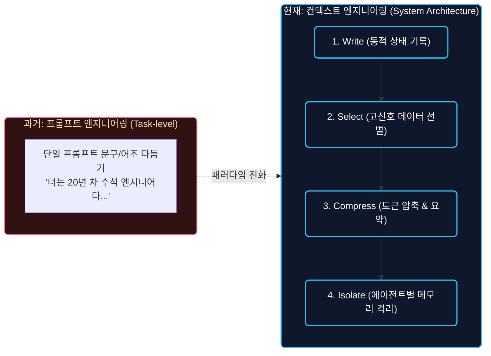
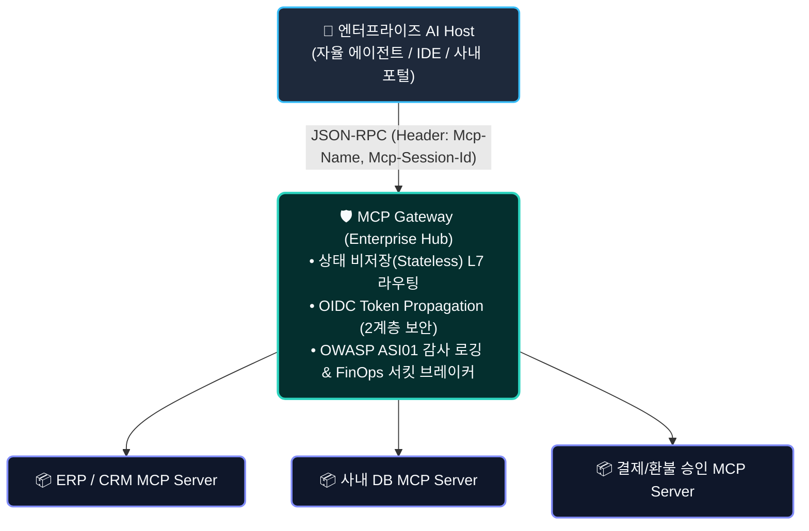
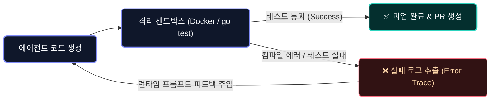

### 프롬프트에서 컨텍스트 아키텍처로의 전환, 에이전트 프로덕션 갭 극복, 그리고 추론 인프라와 TDD 하네스

최근 글로벌 생성형 AI 및 엔터프라이즈 AX(AI Transformation) 시장은 단순 지시어 튜닝에 머물던 '프롬프트 엔지니어링'을 넘어, 모델의 런타임 정보 환경을 정밀하게 제어하는 **컨텍스트 엔지니어링(Context Engineering)** 중심으로 빠르게 전환되고 있습니다.

동시에 기업 현장에서는 파일럿 에이전트의 실서비스 배포 실패 요인인 '프로덕션 갭(Production Gap)'을 극복하기 위해 MCP(Model Context Protocol) 기반 인프라 표준화와 보안 거버넌스 도입이 본격화되었으며, 글로벌 AI 인프라 지출 또한 모델 사전 학습(Training)에서 상시 추론(Inference) 중심으로 재편되었습니다.

---

## '프롬프트 엔지니어링'의 한계와 '컨텍스트 엔지니어링'의 아키텍처적 안착

2025년 중반 안드레이 카파시(Andrej Karpathy) 등이 제기했던 "프롬프트 튜닝을 넘어선 컨텍스트 엔지니어링의 필요성"이라는 화두가, 이제 단순한 개념적 담론을 넘어 엔터프라이즈 에이전트 시스템의 핵심 아키텍처 규격으로 확고히 자리잡았습니다.

단순히 문맥 창(Context Window)을 1M~2M 토큰 단위로 늘리면 모든 문제가 해결될 것이라는 초기 낙관론은, 실제 프로덕션 환경에서 발생한 '컨텍스트 부패(Context Rot)'와 막대한 FinOps 비용 부담을 겪으며 **"어떻게 말할 것인가(Prompt)"에서 "모델이 판단하는 시점에 무엇을 알고 있게 할 것인가(Context)"를 정밀 제어하는 시스템 엔지니어링**으로 발전했습니다.

### "LLM은 CPU, Context Window는 RAM": 시스템 아키텍처 관점의 전환

**비즈니스 임팩트 (Business Impact)**  
긴 문맥을 지원하는 모델이 보급되었음에도 불구하고, 방대한 문서를 무작정 주입했을 때 모델의 추론 정확도가 급격히 떨어지는 **'컨텍스트 부패(Context Rot)'** 현상이 빈번하게 발생했습니다. 이에 따라 기업들은 단순히 큰 문맥을 가진 고비용 모델에 의존하기보다, 런타임에 필수 정보만 엄선·압축하여 주입하는 컨텍스트 엔지니어링 파이프라인을 구축하여 에러율을 40% 이상 낮추고 API 토큰 비용을 대폭 절감하고 있습니다.

**기술적 인사이트 (Technical Insight)**  
소프트웨어 엔지니어링에서 LLM은 '연산 장치(CPU)'이며, Context Window는 '메모리(RAM)'에 비유됩니다. 성공적인 에이전트 시스템은 복잡한 AI 전용 툴이나 시맨틱 레이어에 과도하게 의존하는 대신, **'워크플로우 분할과 아티팩트 전달(Workflow & Artifact-Centric Architecture)'**을 통해 컨텍스트를 결정론적으로 제어합니다:

1. **Write (상태 외부화)**: 대화 로그를 프롬프트에 무작정 누적하지 않고, 세션 상태 머신(FSM)이나 명시적인 작업 상태 파일에 핵심 변수만 기록하여 유지합니다.
2. **Select (워크플로우 기반 단계별 선별)**: 확률적 오분류 위험이 있는 복잡한 시맨틱 라우터 대신, `기획 ➔ 설계 ➔ API Spec ➔ 개발`과 같이 선후 관계가 명확한 결정론적 단계(DAG)에 따라 필요한 도구와 컨텍스트만 주입합니다.
3. **Compress (정제된 아티팩트 전달)**: 인위적인 토큰 압축 알고리즘(LLMLingua 등)에 의존하는 대신, 각 단계의 완료 시점에 도출된 '정제된 핵심 산출물(Artifact)'만 다음 단계로 넘김으로써 컨텍스트를 자연스럽게 압축합니다.
4. **Isolate (디렉토리 및 역할 격리)**: 단일 모놀리식 에이전트에 모든 권한을 주지 않고, 디렉토리 기반 스코프와 전용 가이드(`SKILL.md`, `AGENTS.md`)를 가진 서브에이전트로 분리 실행하여 컨텍스트 오염을 원천 차단합니다.

> 💡 **실무 엔지니어링 제언**: 복잡한 엔진 툴을 추가하여 모델의 비결정론적 결함을 메우려 하기보다, **단계별 책임이 명확한 워크플로우와 파일 기반 아티팩트 중심의 데이터 파이프라인을 구축하는 것**이 디버깅, 안정성, 비용 측면에서 훨씬 성숙하고 신뢰도 높은 접근법입니다.

### 전문가 및 현업 진영별 다각적 평가 (Expert Perspectives)

컨텍스트 엔지니어링의 안착을 두고 글로벌 AI 커뮤니티와 현업 엔지니어들 사이에서는 다음과 같이 다각적인 평가가 교차하고 있습니다.

* **시스템 아키텍트 진영 (OS & Kernel 관점)**: "프롬프트 만능주의에서 시스템 엔지니어링으로의 필연적 진화." LLM을 'CPU', Context Window를 'RAM'으로 보며, 모델의 어조를 다듬는 프롬프트 수준을 넘어 메모리 페이징(Paging)과 상태 격리를 다루는 소프트웨어 아키텍처의 확립으로 평가합니다.
* **실무 백엔드 엔지니어 진영 (Pragmatic Engineering 관점)**: "화려한 신조어(Buzzword)이나, 전통적 소프트웨어 공학으로의 건강한 회귀." 본질은 기존의 상태 머신(FSM), 세션 관리, Bounded Context를 재포장한 것에 불과하다는 비판이 있으나, '바이브 코딩'의 환상을 깨고 결정론적 워크플로우와 하네스라는 엔지니어링 규율을 되찾은 점은 높게 평가합니다.
* **인프라 및 FinOps 진영 (Cost & Reliability 관점)**: "1M 토큰 무제한 낙관론의 붕괴와 프로덕션 생존 전략." 방대한 문서를 통째로 넣었을 때 발생하는 '컨텍스트 부패(Context Rot)'와 막대한 API 비용/TTFT 지연을 경험한 후, 최소한의 고신호 데이터만 엄선·주입하는 컨텍스트 제어가 프로덕션 배포의 절대 조건으로 자리잡았습니다.

| 비교 항목 | 프롬프트 엔지니어링 (Prompt Engineering) | 컨텍스트 엔지니어링 (Context Engineering) |
| :--- | :--- | :--- |
| **핵심 목적** | 모델에 전달할 지시어의 어조 및 문구 최적화 | 모델의 런타임 **정보 환경 및 상태 공간 최적화** |
| **주요 영역** | 프롬프트 템플릿, Few-shot 예시 작성 | **동적 RAG, 작업 메모리, 도구 스키마, 시스템 상태 주입** |
| **시스템 범위** | 단일 턴(Single-turn) 인터랙션 레벨 | **전체 에이전트 시스템 아키텍처 레벨** |
| **핵심 과제** | 명확한 지시 전달 및 할루시네이션 방지 | **Context Rot(컨텍스트 부패) 방지 및 토큰 소비 최적화(Token Optimization)** |

**💡 엔지니어 추천 학습 태스크**
* **Context Engineering 파이프라인 설계**: 긴 컨텍스트 모델 사용 시 비즈니스 상태 머신에 맞춰 불필요한 히스토리를 요약·격리(Compress & Isolate)하고 핵심 도구 스키마만 동적으로 선별(Select) 주입하는 런타임 컨텍스트 매니저 구현 학습.

---

## 엔터프라이즈 에이전트의 '프로덕션 갭(Production Gap)' 극복과 MCP 인프라 표준화

연구실 수준의 데모를 넘어 실제 업무 환경에 AI 에이전트를 도입하려는 시도가 폭증하면서, 파일럿 성공과 실서비스 운영 사이의 거대한 격차인 **'프로덕션 갭(Production Gap)'**이 2026년 하반기 엔터프라이즈 AX의 최대 화두로 떠올랐습니다.

### 신원·권한 거버넌스와 리눅스 재단 산하 MCP 생태계 안착

**비즈니스 임팩트 (Business Impact)**  
기업들이 에이전트 배포를 주저하는 가장 큰 요인은 '모델의 지능 부족'이 아니라 **'신원 관리(Identity), 인가 통제(RBAC), 보안 가드레일의 부재'**였습니다. 이에 따라 사내 마이크로서비스와 에이전트를 표준화된 방식으로 안전하게 연결해 주는 인프라가 기업 경쟁력의 핵심으로 자리잡았습니다.

앤트로픽(Anthropic)이 제안하고 OpenAI, 구글, 마이크로소프트, AWS가 참여한 **MCP(Model Context Protocol)**는 리눅스 재단 산하 오픈 거버넌스로 이관되며 엔터프라이즈 AI 도구 연동의 사실상의 표준(De-facto Standard)으로 자리잡았습니다.

**기술적 인사이트 (Technical Insight)**  
최신 MCP 2026 표준 규격은 대규모 엔터프라이즈 트래픽 처리를 위해 **상태 비저장(Stateless) L7 아키텍처**로 발전했습니다. 
* 게이트웨이 레벨에서 HTTP 헤더(`Mcp-Name`, `Mcp-Session-Id`) 기반의 L7 라우팅을 지원하여 수평 확장(Scale-out)이 용이해졌습니다.
* OIDC JWT 기반의 토큰 전파(Token Propagation)를 통해 게이트웨이는 서명 검증만 전담하고, 세부 인가(Fine-grained RBAC)는 백엔드 MCP Server가 처리하는 2계층 보안 아키텍처가 확립되었습니다.
* OWASP for Agentic Applications 2026의 **ASI01(Tool Misuse)** 위협을 방어하기 위해 세션별 도구 호출 인자 감사 로그 적재가 표준화되었습니다.

**💡 엔지니어 추천 학습 태스크**
* **경량 MCP Gateway 및 토큰 전파(Token Propagation) 구현**: Go 언어 또는 Node.js를 기반으로 단일 엔드포인트에서 다중 백엔드 MCP 서버로의 헤더 기반 L7 라우팅 및 JWT 무결성 검증 미들웨어 구축 실습.

> 📚 **관련 아키텍처 딥다이브**: [MCP Gateway 딥다이브: 엔터프라이즈 AI 에이전트 도구 통합과 가드레일 아키텍처](https://www.joinc.co.kr/posts/detail?id=14)

---

## 추론 중심 인프라 재편(Inference Dominance)과 실증 보상 강화학습(RLVR)

AI 산업의 자본 지출(CapEx/OpEx) 구조가 파운데이션 모델 사전 학습(Pre-training) 중심에서 **실시간 추론(Inference) 및 테스트 타임 연산(Test-time Compute)** 중심으로 완전히 전환되었습니다.

### 상시 추론 지출의 학습 지출 추월과 검증 가능한 보상(RLVR)

**비즈니스 임팩트 (Business Impact)**  
2026년 글로벌 AI 인프라 지출 통계에 따르면, 복잡한 에이전트의 연쇄 추론과 도구 호출이 일상화되면서 추론 인프라 비용이 전체 AI 예산의 60%를 넘어섰습니다. 기업들은 요청당 처리 비용 효율(Unit Economics)을 개선하기 위해 고성능 추론 모델(o3, Claude 3.5 Sonnet 등)과 경량 라우팅 모델을 지능적으로 혼용하는 FinOps 아키텍처를 도입하고 있습니다.

**기술적 인사이트 (Technical Insight)**  
추론 모델의 정밀도를 개선하는 패러다임 또한 인간 선호도 기반의 RLHF(인간 피드백 강화학습)에서 **실증 보상 기반 강화학습(RLVR: Reinforcement Learning from Verifiable Rewards)**으로 전면 재편되었습니다.
* **모델 개발사 관점 (사후 훈련 / Post-training)**: OpenAI, Google 등 모델 연구소는 "코드가 컴파일되는가?", "단위 테스트(Unit Test)를 100% 통과했는가?"와 같은 결정론적 실행 결과(Verifiable Proof)를 보상 함수로 사용하여 추론 모델(o1, o3 등)의 정책 신경망 가중치를 강화학습합니다.
* **일반 엔지니어/서비스 구축 관점 (런타임 하네스 / Runtime Harness)**: 일반 개발자가 모델 가중치를 직접 파인튜닝할 필요는 없으며, **"Docker 샌드박스에서 테스트를 돌려 실패 로그를 에이전트에게 즉시 피드백해 주는 런타임 TDD 검증 하네스"**를 구축하여 모델의 자가 수정(Self-Correction) 능력을 극대화하는 것이 핵심입니다.

**💡 엔지니어 추천 학습 태스크**
* **TDD 기반 런타임 자가 수정(Self-Correction) 하네스 구축**: 에이전트가 작성한 코드를 Docker 샌드박스에서 즉시 실행(`pytest`, `go test`)하고, 컴파일/테스트 실패 로그를 모델에게 피드백으로 반환하여 스스로 버그를 수정하도록 제어하는 런타임 검증 하네스 구축 실습.

---

## 글로벌 기술 커뮤니티(Reddit / HackerNews) 핫이슈

실무 엔지니어 및 아키텍트 커뮤니티에서는 단일 만능 에이전트의 실패와 '특화 멀티 에이전트 오케스트레이션'에 대한 현장 경험 공유가 가장 뜨거운 반응을 얻었습니다.

### 단일 만능 에이전트(Do-Everything Agent)의 실패와 멀티 에이전트 분업화

**커뮤니티 논의 핵심 요약**  
* **단일 거대 에이전트의 한계**: 모든 도구(Tools)와 권한을 하나의 에이전트에 몰아주는 구조는 컨텍스트 오염, 도구 선택 혼선(Tool Selection Degradation), 보안 권한 과잉 부여로 인해 프로덕션에서 100% 실패한다는 현장 증언이 쏟아졌습니다.
* **특화 서브에이전트(Sub-agents) 패턴의 안착**: '기획자-설계자-구현자-검증자' 또는 'DB 전담-CRM 전담' 등 역할을 명확히 쪼개고, 각 에이전트가 격리된 컨텍스트에서 최소 권한(Least Privilege)만 가지고 협업하는 구조가 엔터프라이즈의 표준으로 정립되었습니다.

### "Vibe Coding"의 한계와 엔지니어링 하네스(Harness)의 중요성

**커뮤니티 논의 핵심 요약**  
* 프롬프트에만 의존해 코드를 감(Vibe)으로 찍어내는 방식은 소규모 프로토타입에는 유용하지만, 10만 라인 이상의 대규모 엔터프라이즈 코드베이스에서는 심각한 기술 부채를 양산한다는 비판이 주를 이루었습니다.
* TDD(테스트 주도 개발), 정적 타입 분석, 아키텍처 가이드라인(AGENTS.md)을 갖춘 **'결정론적 엔지니어링 하네스'**가 뒷받침될 때 비로소 에이전트 코딩이 프로덕션 가치를 가진다는 공감대가 확고해졌습니다.

**💡 엔지니어 추천 학습 태스크**
* **역할 기반 서브에이전트 워크플로우 구현**: 단일 프롬프트 에이전트를 벗어나, 코드 작성 전담 서브에이전트와 코드 리뷰/테스트 전담 서브에이전트를 분리하고 상호 검증을 거치는 오케스트레이션 패턴 구현 학습.

---

## ☕ 맺음말 (필드 엔지니어를 위한 제언)

현재 AI 기술의 핵심 경쟁력은 모델 파라미터 크기 경쟁에서 **"인프라, 거버넌스, 컨텍스트 설계"**라는 전통적인 소프트웨어 엔지니어링 영역으로 이동했습니다.

$$\mathbf{Production\ AI = Reasoning\ Model + Context\ Engineering + Governance\ Gateway}$$

1. **프롬프트 문구에 집착하지 말고 컨텍스트 흐름을 설계하십시오**: 모델에게 보여줄 데이터의 라이프사이클(선별, 압축, 격리)을 시스템으로 구축하십시오.
2. **에이전트를 통제할 인프라 게이트웨이를 선제 구축하십시오**: MCP 표준과 2계층 보안(Token Propagation), FinOps 서킷 브레이커를 결합하여 에이전트의 통제 불능 리스크를 원천 차단하십시오.
3. **결정론적 검증 체계(TDD/하네스)를 강화하십시오**: AI가 생성한 결과물을 사람의 눈이 아닌 자동화된 테스트와 린터로 실증 검증하는 파이프라인을 구축할 때 진정한 엔터프라이즈 생산성 혁신이 가능합니다.

