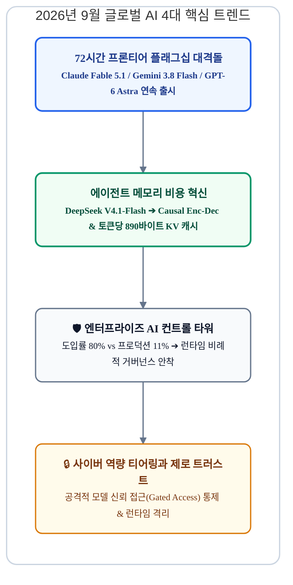
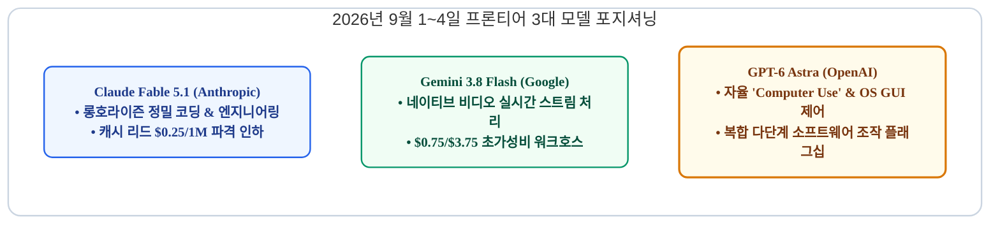
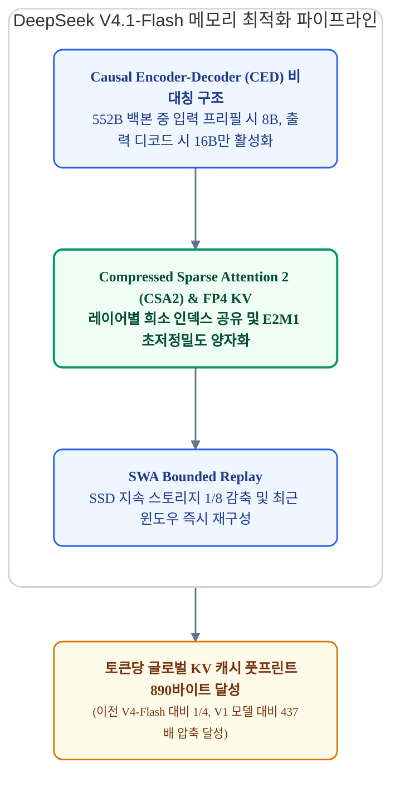
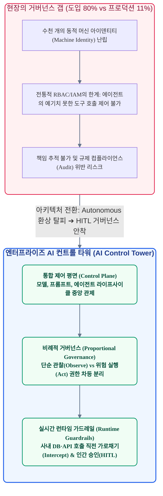
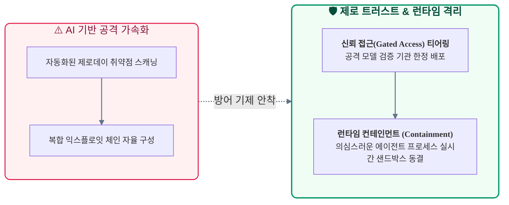

# 2026년 9월 AI 트렌드 딥다이브: 72시간 프론티어 대격돌과 에이전트 메모리 혁신, 그리고 AI 컨트롤 타워 거버넌스

> **"2026년 9월 첫 주, 글로벌 프론티어 3사는 72시간 동안 차세대 플래그십 모델을 쏟아부으며 '자율 워커(Worker)' 경쟁의 방아쇠를 당겼습니다. DeepSeek은 890바이트 KV 캐시로 에이전트 메모리 장벽을 무너뜨렸고, 엔터프라이즈 현장은 도입률 80% 대비 프로덕션 전환율 11%라는 거버넌스 갭을 돌파하기 위해 'AI 컨트롤 타워'와 제로 트러스트 인프라 구축에 사활을 걸고 있습니다."**

2026년 8월 하순부터 9월 중순까지 글로벌 인공지능 시장은 단순 챗봇의 시대를 공식적으로 마감하고, 소프트웨어와 인프라를 자율적으로 제어하는 **'에이전틱 워커(Agentic Worker)'** 중심으로 전격 재편되었습니다. 

본 딥다이브 리포트는 9월 초 72시간 내 잇따라 공개된 프론티어 모델 스펙, 극단적 메모리 압축을 실현한 차세대 추론 아키텍처, 그리고 기업 현장의 프로덕션 거버넌스 실측 데이터를 종합 분석합니다.

---

## 프론티어 3사의 72시간 플래그십 대격돌: 자율 컴퓨터 조작과 롱호라이즌 코딩

2026년 9월 1일부터 9월 4일까지의 72시간은 글로벌 프론티어 AI 연구소들이 차세대 플래그십 모델을 연쇄적으로 공개하며 시장의 판도를 뒤흔든 결정적 시기였습니다.

각 랩은 더 이상 일반 상식 질의응답 점수에 연연하지 않고, **에이전트 자율성(Autonomy), 롱호라이즌(Long-horizon) 워크플로우 완수력, 멀티모달 네이티브 연산 효율성**이라는 명확한 차별화 포지션으로 맞붙었습니다.

### Claude Fable 5.1 & Mythos 5.1: 롱호라이즌 자율 탐색과 현장의 현실 괴리

Anthropic은 수 시간에서 수일에 걸쳐 실행되는 복잡한 지식 작업과 대규모 소프트웨어 아키텍처 리팩토링에 특화된 [Claude Fable 5.1](https://claude.com)을 전격 공개했습니다.

* **롱호라이즌 자율 탐색의 기술적 실체**: 사람이 워크플로우를 사전에 쪼개주지 않아도, 샌드박스 내부에서 모델이 수백 번의 `코드 탐색 ➔ 가설 수립 ➔ 패치 ➔ 테스트 ➔ 에러 로그 분석 ➔ 재수정` 루프를 인간 개입 없이 스스로 끈질기게 수행하여 SWE-bench Pro에서 81.2%라는 최고점을 기록했습니다 ([Evolink 벤치마크 분석](https://evolink.ai)).
* **토큰 폭발을 방어하는 프롬프트 캐싱 ($0.25/1M)**: 수백 턴의 루프가 누적되면 매 턴마다 수백만 토큰이 소모되어 비용이 폭발하지만, 입력의 95% 이상을 차지하는 기존 코드베이스 캐시 리드 단가를 $0.25로 파격 인하하여 장기 자율 세션의 단위 경제성을 방어했습니다.
* **벤더의 약속(Fact) vs 현장 엔지니어의 반박(Reality)**:
  * **어디까지가 사실인가 (Fact)**: 컴파일 에러나 명확한 단위 테스트가 갖춰진 '닫힌 샌드박스' 환경에서는 순수 알고리즘 문제 해결 마력이 비약적으로 도약한 것이 사실입니다.
  * **현장 엔지니어의 반박 (Reality)**: 그러나 실무는 암묵적 비즈니스 규칙과 아키텍처 제약이 지배하는 '오픈엔드' 세계입니다. 모델을 몇 시간 동안 깜깜이 롱호라이즌 루프에 방치하면 수만 원의 토큰 비용만 날리고 프로덕션 장애 코드를 양산하기 십상입니다.
* **실무 엔지니어링의 정답: 인간-AI 협업 설계와 감독**: 결국 현업에서는 AI에게 무제한 자율을 주기보다, **"사람이 AI와 함께 결정적인 워크플로우와 인터페이스를 먼저 설계하고, 단계별 구현을 AI에 맡긴 뒤 사람이 즉각 감독하는 방식"**이 토큰 낭비 99% 차단과 무결점 프로덕션 배포를 보장하는 최선의 표준으로 안착했습니다.
* **신뢰 접근 전용 Mythos 5.1 티어 분리**: 고위험 엔터프라이즈 환경 및 시스템 침투 분석 역량을 지닌 상위 변형 모델인 Claude Mythos 5.1은 사전 검증된(Vetted) 기관에만 선별 제공하는 이원화 정책을 가동했습니다.

### Gemini 3.8 Flash (Google, 9월 2일 출시): 네이티브 비디오 스트림 인제스천과 실시간 에이전트

Google은 실시간 고속 추론과 대규모 멀티모달 처리를 겨냥한 고효율 워크호스 모델 [Gemini 3.8 Flash](https://blog.google)를 발표했습니다.

* **네이티브 비디오 스트림 인제스천의 아키텍처**:
  * **통합 임베딩 공간 (Unified Embedding Space)**: 기존 멀티모달 파이프라인(`ffmpeg`로 초당 수 장씩 이미지를 캡처하고 별도 STT로 자막을 뽑아 텍스트로 합치는 방식)의 치명적 한계인 시공간 움직임 궤적 상실과 3~5초의 지연시간을 완전히 해결했습니다. 영상 프레임과 오디오 음향 파형을 단일 트랜스포머 잠재 공간에서 밀리초(ms) 단위로 직접 동기화하여 처리합니다 ([9to5Google 아키텍처 리뷰](https://9to5google.com)).
  * **WebSocket 기반 양방향 실시간 Live API**: 대용량 비디오 파일을 업로드하는 번거로움 없이, 브라우저 화면 공유나 웹캠의 연속 비디오 스트림(WebM/H.264)을 실시간으로 직접 수용하여 수백 밀리초(sub-second) 단위의 초저지연 반응 속도를 달성했습니다.
* **실무 엔지니어링 임팩트**:
  * **초저지연 실시간 UI 제어 및 모니터링**: 초당 수십 번 스크린샷을 찍어 API를 호출하던 비효율을 없애고, 사용자의 마우스 클릭이나 에러 모달 발생, 로딩 스피너의 멈춤을 0.3초 만에 실시간으로 감지하여 반응하는 차세대 GUI 에이전트 환경을 제공합니다.
  * **산업 관제 및 이상 탐지**: 정지된 사진으로는 포착할 수 없는 '기계의 비정상 진동', '화재 연기의 확산 방향', '작업자의 이상 거동' 등 동적인 시공간 패턴을 실시간 탐지합니다.
* **파괴적인 단위 경제성**: 입력 100만 토큰당 **$0.75**, 출력 100만 토큰당 **$3.75**라는 공격적인 가격 정책을 연말까지 유지하며, 비디오를 이미지 프레임 묶음으로 처리할 때 대비 토큰 소비량과 비용을 80% 이상 절감하여 대규모 백그라운드 상시 관제 에이전트 시장을 빠르게 선점하고 있습니다.

### GPT-6 Astra (OpenAI, 9월 3일 프리뷰 / 9월 4일 출시)

OpenAI의 최상위 플래그십 [GPT-6 Astra](https://openai.com)는 브라우저와 데스크톱 애플리케이션을 직접 제어하는 **'컴퓨터 사용(Computer Use)' 및 에이전틱 자율성**에 올인한 아키텍처를 선보였습니다 ([YottaLabs 분석 리포트](https://yottalabs.ai)).

* **OS 레벨 자율 실행**: 화면 스크린샷 캡처, 좌표 계산, 마우스 클릭, 키보드 입력 및 터미널 셸 명령을 완벽한 단일 폐루프로 결합하여, 인간 작업자가 수행하던 다단계 ERP 조작이나 클라우드 인프라 배포 절차를 엔드투엔드로 완수합니다.
* **프리미엄 단위 단가**: 입력 100만 토큰당 **$10**, 출력 100만 토큰당 **$50**의 최고가 라인업으로 책정되었으며, 단순 질의응답이 아닌 고부가가치 비즈니스 프로세스 자동화 파이프라인에 집중 투입되고 있습니다.

| 비교 항목 | Claude Fable 5.1 | Gemini 3.8 Flash | GPT-6 Astra |
| :--- | :--- | :--- | :--- |
| **주요 특화 영역** | 롱호라이즌 엔지니어링 & 지식 작업 | 네이티브 비디오 분석 & 고속 에이전트 | OS GUI 제어 및 자율 컴퓨터 사용 |
| **입력 단가 (/1M 토큰)** | $3.00 (캐시 리드 $0.25) | **$0.75** (초저가 프로모션) | $10.00 (프리미엄 플래그십) |
| **출력 단가 (/1M 토큰)** | $15.00 | **$3.75** | $50.00 |
| **핵심 기술 혁신** | 반복 캐시 경제성 & 정밀 패칭 | 네이티브 비디오 직접 인제스천 | 통합 Computer Use 폐루프 실행기 |
| **공식 레퍼런스** | [Anthropic](https://claude.com) | [Google Blog](https://blog.google) | [OpenAI](https://openai.com) |

---

## 에이전트 메모리 아키텍처 혁신: DeepSeek V4.1-Flash와 890바이트 KV 캐시

2026년 9월 10일 공개된 [DeepSeek V4.1-Flash](https://deepseek.com)는 장시간 구동되는 에이전트의 최대 병목이었던 **KV 캐시 메모리 풋프린트와 HBM 비용 장벽**을 아키텍처 레벨에서 근본적으로 해체했습니다 ([DeepSeek ArXiv Research](https://arxiv.org)).

기존 트랜스포머 기반 모델들은 에이전트가 수만 줄의 코드베이스나 이전 대화 이력을 다시 읽을 때마다 HBM(고대역폭 메모리) 용량이 기하급수적으로 고갈되어 장기 세션 유지가 불가능했습니다. DeepSeek 연구진은 비대칭 인코더-디코더와 초고압축 어텐션을 결합하여 이 문제를 정면 돌파했습니다.

### 1. Causal Encoder-Decoder (CED) 비대칭 활성화

에이전틱 워크로드는 본질적으로 수천 개의 파일과 도구 호출 로그를 읽어들이는 **'입력 집중형(Input-heavy)'**인 반면, 실제 모델이 뱉어내는 커맨드는 수십 토큰 내외의 **'출력 경량형(Output-light)'**이라는 불균형을 가집니다.

* 552B 전체 백본 중 20계층 인코더와 20계층 디코더를 비대칭 분리했습니다.
* 긴 컨텍스트를 읽는 프리필(Prefill) 단계에서는 오직 **8B 파라미터**만 활성화하고, 짧은 명령을 생성하는 디코드(Decode) 단계에서는 **16B 파라미터**만 활성화하여 불필요한 GPU 연산 낭비를 80% 이상 차단했습니다.

### 2. Compressed Sparse Attention 2 (CSA2)와 FP4 KV 캐싱

* **레이어 간 인덱스 공유**: 어텐션 레이어를 Full, Reindex, Reuse 모드로 계층화하고 Top-K 희소 인덱스를 공유하여 문맥 길이가 1M 토큰으로 늘어나도 인덱서 오버헤드가 일정 범위 내로 엄격히 제한됩니다.
* **FP4(E2M1) 저정밀도 양자화**: 메인 KV 캐시를 16채널 스케일 기반의 4비트 부동소수점 포맷으로 압축하여 정밀도 손실 없이 HBM 점유율을 극적으로 축소했습니다.
* **토큰당 890바이트 실현**: 그 결과 글로벌 KV 캐시 풋프린트를 **토큰당 약 890바이트**까지 압축하는 데 성공했습니다. 이는 직전 세대 모델(V4-Flash) 대비 **4분의 1**, 초기 1세대 아키텍처 대비 **437분의 1**에 달하는 파격적인 수치입니다.

### 3. SWA Bounded Replay와 1M 토큰 캐시 단가 혁명

초장문 세션에서 슬라이딩 윈도우 어텐션(SWA) 상태를 고가의 고속 SSD에 영구 보존하는 대신, 최근 윈도우 토큰만을 즉각 리플레이하여 누락된 상태를 런타임에 재구성하는 방식을 택했습니다.

이로 인해 영구 보존 SSD 스토리지 풋프린트를 이전 세대 대비 8분의 1로 감축했으며, 피크 타임 기준 **100만 캐시 입력 토큰당 $0.003 ~ $0.006**이라는 압도적인 단위 경제성을 구현했습니다. DeepSeek은 이 모델을 MIT 라이선스 기반 오픈 웨이트로 공개하며 글로벌 에이전트 인프라의 표준을 다시 한 번 재정의했습니다.

---

## 'Autonomous'의 환멸에서 'Agentic'으로: 엔터프라이즈 거버넌스 갭과 AI 컨트롤 타워

과거 시장을 지배했던 'Autonomous(완전 무인 자율)'에 대한 장밋빛 환상은 실제 프로덕션 환경에서 발생한 무한 루프, 토큰 탕진, 비가역적인 시스템 파괴 리스크로 인해 급격히 붕괴했습니다. 2026년 9월 엔터프라이즈 AI 시장의 가장 본질적인 변화는 **통제 불능의 'Autonomous'라는 환상을 버리고, 인간의 감독선(HITL) 내에서 목표를 적응적으로 완수하는 'Agentic'으로 아키텍처 눈높이를 현실화**했다는 점입니다.

### 'Autonomous'에서 'Agentic'으로의 패러다임 시프트와 HITL

학술 및 엔터프라이즈 문헌(Gartner, IBM, MIT)은 두 개념의 제어 로직(Control Logic) 차이를 명확히 구분하고 있습니다:

| 비교 항목 | Agentic AI (문헌 정의) | Autonomous AI (과거 정의) |
| :--- | :--- | :--- |
| **제어 로직 (Control Logic)** | **인간의 검토 체크포인트(HITL/HOTL) 기본 내장** | 인간의 승인 없는(Without human approval) 독립 실행 |
| **장애 대응 (Failure Response)** | **인간의 피드백 및 에스컬레이션에 의존** | 자체 알고리즘 자동화에만 의존 |
| **핵심 전제** | 인간의 가드레일 내 능동적 도구 조율 및 협업 | 인간 개입 제로(0%)의 무인 자율화 |

기업과 컨설팅 펌들이 'Autonomous Worker' 대신 'Agentic Worker'라는 조어를 채택한 본질적 배경 역시, 완전 자율의 법적·재무적 리스크를 회피하고 **HITL(Human-in-the-Loop) 통제를 기본 아키텍처로 내장**하기 위함입니다.

### 머신 아이덴티티 폭증과 전통적 IAM의 한계

사내 마이크로서비스 및 외부 SaaS API를 스스로 호출하는 에이전트가 도입되면서, 엔터프라이즈 환경에는 사람이 아닌 수천 개의 **'머신 아이덴티티(Machine Identity)'**가 생성되었습니다.

기존의 정적 역할 기반 접근 제어(RBAC)나 API 키 발급 방식으로는 에이전트가 런타임에 어떤 파라미터로 결제 API나 데이터베이스 삭제 명령을 실행할지 사전에 통제할 수 없다는 보안 취약점이 드러났습니다. 도입 기업의 **80%가 에이전트를 테스트하고 있음에도 실제 프로덕션 환경에 완전 안착시킨 비율은 11%에 불과한 거대한 '거버넌스 갭(Governance Gap)'**이 발생한 원인입니다.

### 비례적 거버넌스(Proportional Governance)와 런타임 가드레일

선도적인 글로벌 엔터프라이즈들은 권한을 전부 주거나 전부 박탈하던 과거의 이진법적(All-or-Nothing) 접근을 폐기하고, 과업의 위험도에 따라 제어 수위를 동적으로 조절하는 **비례적 거버넌스**를 표준으로 수립했습니다:

* **관찰(Observe) 티어**: 사내 위키 조회, 로그 열람, 단순 데이터 요약 등 시스템 상태를 변경하지 않는 읽기 전용 작업은 무제한 자율성을 부여합니다.
* **실행(Act) 티어**: 데이터 쓰기, 결제 승인, 프로덕션 배포 등 리스크가 수반되는 작업은 도구 호출 직전 실시간 정책 엔진이 실행을 가로채며(Intercept), 반드시 명시적인 감사 로그 기록과 작업자 서명(HITL)을 거치도록 강제합니다.

### 엔터프라이즈 'AI 컨트롤 타워(AI Control Tower)' 아키텍처

이를 실현하기 위해 주요 플랫폼 및 클라우드 진영은 **AI 컨트롤 타워**를 차세대 엔터프라이즈 코어 아키텍처로 내세우고 있습니다. 

AI 컨트롤 타워는 사내에서 구동되는 모든 파운데이션 모델, 프롬프트 파이프라인, MCP(Model Context Protocol) 도구 서버, 그리고 에이전트의 트래픽을 단일 통제면(Control Plane)에서 중앙 인가하고 실시간 감사 추적(Traceability)을 보장함으로써 거버넌스 갭을 메우는 핵심 솔루션으로 자리잡았습니다.

---

## 고위험 사이버 역량 티어링과 에이전트 제로 트러스트(Zero-Trust)

에이전트가 소프트웨어 코드를 작성하고 시스템을 직접 조작하는 수준에 도달함에 따라, **사이버 보안에서의 AI 이중성(Dual-use dilemma)**이 2026년 9월 최대 위험 요인으로 급부상했습니다.

* **사이버 공격의 속도와 스케일 폭증**: 공격자 집단이 에이전틱 AI를 활용하여 소프트웨어 취약점 탐색부터 다단계 침투 시나리오 실행까지의 '사이버 킬 체인(Cyber Kill Chain)'을 전면 자동화하기 시작했습니다.
* **프론티어 랩의 신뢰 접근(Gated Access) 통제**: 이에 대응하여 OpenAI, Anthropic, Google 등 선도 랩들은 고도화된 침투 및 공격 역량을 보유한 최상위 모델 변형에 대해 공개 API 서비스를 중단하고, 신원이 철저히 검증된 방어 전담 기관에만 권한을 부여하는 '접근 게이팅(Gated Access)' 체계를 공식 가동했습니다.
* **에이전트 런타임 컨테인먼트(Runtime Containment)**: 기업 보안 인프라는 모든 에이전트가 언제든 탈취되거나 프롬프트 인젝션에 오염될 수 있다는 전제하에 **제로 트러스트(Zero-Trust)** 원칙을 적용하고 있습니다. 비정상적인 권한 상승이나 이상 도구 호출 패턴이 감지되는 즉시 에이전트 세션을 메모리 격리 샌드박스에 동결하는 런타임 컨테인먼트 솔루션이 CISO의 필수 방어 장치로 채택되고 있습니다.

---

## 종합 결론 및 엔지니어를 위한 실무 제언

2026년 9월의 AI 생태계는 **"단일 모델의 지능 테스트에서 복합 에이전트의 실행 효율성과 거버넌스 통제 체계로의 완연한 이동"**을 명확히 보여줍니다.

| 분석 영역 | 2026년 상반기 | 2026년 9월 현재 | 엔지니어링 의미 |
| :--- | :--- | :--- | :--- |
| **프론티어 경쟁** | 텍스트 중심 단일 모델 성능 경쟁 | **롱호라이즌 코딩, 비디오 인제스천, Computer Use로의 분화** | 과업 성격에 따른 복수 특화 모델 스택(Model Stacks) 운용 필수 |
| **추론 메모리** | 막대한 HBM 소비 및 비싼 캐시 세션 | **CED 비대칭 구조 & 토큰당 890바이트 초압축 (DeepSeek V4.1)** | 초장문 컨텍스트 에이전트의 단위 경제성 확보 및 오픈소스 안착 |
| **엔터프라이즈** | 챗봇 중심의 파일럿 PoC 탐색 | **AI 컨트롤 타워 기반의 비례적 거버넌스 및 실 프로덕션 안착** | 머신 아이덴티티 인가 및 런타임 도구 실행 차단 통제면 구축 |
| **사이버 보안** | 정적 프롬프트 인젝션 방어 | **신뢰 접근(Gated Access) 통제 및 런타임 컨테인먼트** | 에이전트 세션의 상시 모니터링과 제로 트러스트 격리 정책 의무화 |

### 실무 아키텍트와 엔지니어를 위한 3대 액션 아이템

1. **'모델 스택(Model Stack)' 하이브리드 라우팅 파이프라인 구축**:
   * 단일 고비용 모델에 전권을 위임하지 마십시오.
   * 백그라운드 상시 모니터링과 대용량 로그 분석에는 Gemini 3.8 Flash와 같은 초저가 모델을 배치하고, 대규모 코드베이스 리팩토링에는 Claude Fable 5.1의 $0.25 캐시 리드를 활용하며, 복잡한 GUI 자율 조작에만 GPT-6 Astra를 선별 호출하는 비용 최적화 계층 구조를 수립하십시오.
2. **DeepSeek V4.1-Flash 기반의 프라이빗 에이전트 메모리 최적화**:
   * 온프레미스 및 프라이빗 클라우드 환경에서 구동되는 에이전트 시스템에 CED 비대칭 아키텍처와 FP4 KV 캐시 설계를 적극 검토하십시오.
   * 890바이트 수준의 캐시 효율성을 통해 제한된 사내 GPU 인프라에서도 수십 개의 고컨텍스트 에이전트를 동시 구동할 수 있는 확장성을 확보하십시오.
3. **런타임 비례적 거버넌스와 실행 전 인터셉트 레이어 구현**:
   * 에이전트에게 데이터베이스 쓰기나 외부 API 호출 권한을 직접 주지 마십시오.
   * 모든 도구 호출 요청이 사내 AI 컨트롤 타워를 통과하도록 프록시를 구성하고, 파라미터 유효성 검증과 실시간 감사 추적이 보장되는 결정론적 런타임 가드레일을 구축하십시오.
