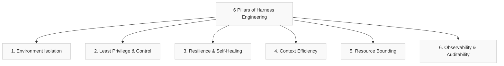
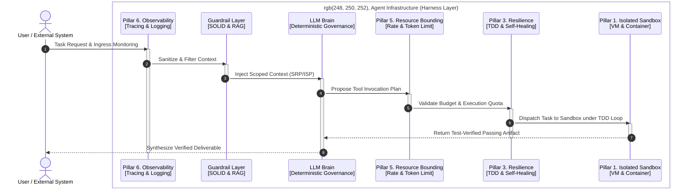

### Engineering Rigor and Human-AI Orchestration Built via 'Harness Engineering'

If there is a single buzzword captivating the technology landscape today, it is undeniably **"Autonomous Agents."** An AI assistant that plans, codes, debugs, and delivers flawless deliverables entirely on its own—promising to deliver working code in a single week for tasks that previously required five engineers working over several months.

Yet speak to practicing engineers who succumbed to this vision and deployed AI agents into actual production environments, and you will invariably encounter exhausted disillusionment:

* *"The agent fell into an infinite API loop overnight; we woke up to find an entire month's cloud budget wiped out."*
* *"It worked flawlessly yesterday, but today it suddenly responded with an altered JSON payload, causing unhandled parsing exceptions that brought our microservices down."*
* *"We asked it to add a simple feature, and it scrambled the surrounding codebase so severely that existing logic stopped working. We were gifted an unmaintainable mountain of technical debt—instant spaghetti code."*

Entering mid-2026, application architects are rapidly stepping down from the marketing hype of all-powerful autonomous agents. Instead, engineering focus is shifting decisively toward **Harness Engineering**—an architectural paradigm to regain absolute governance over system reliability, correctness, and operational cost.

---

## 1. Why Prompt-Driven 'One-Click App Generation' Is Technically Impossible

There are profound, deterministic software engineering reasons why prompt-driven, one-click solutions—promising that "AI will build your app if you simply describe what you want"—inevitably collapse in production environments:

* **Essential Complexity and Ambiguity of Specifications**: In software engineering, the most arduous challenge is not typing code, but rigorously specifying *what to build*. A few lines of natural language prose cannot unambiguously articulate edge cases, domain invariants, idempotency guarantees, and transactional boundaries. Any unspecified behavior is silently filled by AI hallucinations, triggering catastrophic runtime failures.
* **Non-Determinism and Cascading Failures**: By their probabilistic mathematical nature, LLMs produce subtly fluctuating outputs across identical prompt inputs. In a multi-component distributed system, a single non-deterministic API deviation triggers cascading systemic failures. Leaving an agent to debug itself autonomously invites an infinite regression hell where fixing one defect dismantles two others.
* **Accumulation of Unmaintainable AI-Generated Technical Debt**: LLMs do not inherently reason about architectural symmetry, modular refactoring, or testability. Code synthesized purely to satisfy immediate, short-horizon runtime execution degenerates into tangled spaghetti code that human engineers cannot decipher or evolve. What temporarily accelerated initial scaffolding ultimately reduces the codebase to unmaintainable technical waste.
* **Inability to Reconcile Infrastructure and Compliance Constraints**: Real-world software operates coupled to complex external infrastructure (cloud IAM policies, VPC security group topologies) and strict legal mandates (PII compliance, data residency). Unconstrained natural language prompts cannot reliably navigate or govern these multi-dimensional external constraints.
* **Fundamental Linguistic and Real-World Incompleteness**: Transcending immediate engineering hurdles, we confront an ontological boundary: the inherent incompleteness of language when describing reality. Human language, no matter how meticulously drafted, cannot capture 100% of the multi-dimensional complexity of human intent and operational reality. Resolving a complex business problem involving security standards, privacy regulations, infrastructure limits, and unit economics in a single "Prompt" is mathematically impossible. Software development is not a static output generated from a single shot; it is an active, dynamic feedback loop continuously rectifying deviations against reality. In this equation, **Human-in-the-Loop (HITL)** arbitration is not merely a safety net, but an architectural necessity required to reconcile the fundamental incompleteness of language.

Consequently, naive prompt-based reliance on raw model intelligence reaches an impenetrable ceiling of unreliability. This reality necessitates a **Harness**—a physical system of architectural guardrails designed to govern, constrain, and structure the model's non-deterministic behavior.

---

## 2. Conceptual Definition: Transforming Non-Determinism into Determinism via the Harness

The ultimate objective of modern AI engineering is not the adoption of "Harness Engineering" as a dogmatic methodology for its own sake. The true goal is **building human-AI collaborative systems that translate the non-deterministic intelligence of foundation models into the safe, deterministic data contracts and execution flows demanded by software engineering.**

Here, the **Harness**—much like equestrian reins, harnesses, or industrial wiring looms—serves as **an architectural instrument and technical framework to realize this collaborative paradigm.**

$$\text{Agent} = \text{Model (Brain)} + \text{Harness (Architecture and Constraint)}$$

If the LLM serves as the problem-solving "Brain," the harness is the **architectural scaffolding that dictates how that brain safely interacts with physical infrastructure and enterprise data.**

While natural language prompts represent **soft constraints** offering polite suggestions, the harness enforces **hard constraints embedded directly into system architecture and runtime middleware that prevent the agent from overstepping defined boundaries.**

### Prompt Engineering vs. Harness Engineering

| Dimension | Prompt Engineering | Harness Engineering |
| :--- | :--- | :--- |
| **Core Question** | "How should we instruct the model?" | "How should we govern the environment in which the agent executes?" |
| **Operational Scope** | Single-turn optimization, persona tuning, few-shot prompting | State management, sandbox execution, tool-use guardrails, error recovery |
| **Enforcement Layer** | Natural language input (Soft Constraint) | System architecture & middleware (Hard Constraint) |
| **Analogy** | Verbal directions given to a driver | Road signs, highway guardrails, mechanical vehicle governors |

---

## 3. Six Architectural Pillars of Harness Engineering

To attain enterprise-grade reliability in production, an AI agent system must satisfy six foundational architectural pillars:

1. **Environment Isolation**: Every dynamic action executed by an agent—especially generative code synthesis and runtime execution—must occur within ephemeral sandbox environments logically and physically decoupled from host machinery and production infrastructure.
2. **Least Privilege & Control**: External tools (APIs, database connectors) and data sources exposed to the agent must be strictly restricted to an explicit whitelist containing only what is indispensable for the immediate micro-task.
3. **Resilience & Self-Healing**: When exceptions, tool failures, or logical regressions arise, the system must maintain state and execute structured self-healing loops without crashing; once error thresholds are breached, it must fail safely and yield control to human operators (HITL).
4. **Context Efficiency**: To protect the LLM's finite, noise-sensitive context window, the harness must rigorously filter, distill, and inject only essential context.
5. **Resource Bounding & Optimization**: Hard boundaries—such as maximum turn limits, rate limits, token expenditure ceilings, and execution timeouts—must be enforced within the harness control loop to prevent budget overruns.
6. **Observability & Auditability**: Every reasoning step (trajectory), tool invocation, and intermediate state transition must be persistently logged to ensure transparent post-hoc inspection, auditing, and deterministic replays.

### Mapping to the AWS Well-Architected Framework

The six pillars of Harness Engineering align directly with the foundational pillars of the industry-standard **AWS Well-Architected Framework**:

| AWS Well-Architected Pillar | Harness Engineering Pillar | Architectural Equivalence |
| :--- | :--- | :--- |
| **1. Security** | **Environment Isolation** **Least Privilege** | Decoupling agent runtimes into ephemeral sandboxes and whitelisting minimal API tools to prevent system breaches and credential exfiltration. |
| **2. Reliability** | **Resilience & Self-Healing** | Enabling bounded error-recovery loops with automated fail-safes that halt execution and escalate to human operators upon repeated failures. |
| **3. Performance Efficiency** | **Context Efficiency** | Filtering context and utilizing targeted RAG retrieval to maximize reasoning speed and precision within bounded context windows. |
| **4. Cost Optimization** | **Resource Bounding** | Enforcing strict per-session token budgets, execution timeouts, and turn limits to eliminate cost spikes caused by runaway loops. |
| **5. Operational Excellence** | **Observability & Auditability** | Recording granular execution trajectories and state diffs per turn to ensure complete operational visibility. |

---

## 4. Core Prerequisite of the Harness: The Migration of Software Engineering Rigor

Just as the AWS Well-Architected pillars provide a conceptual blueprint while real-world success depends on an engineer's craftsmanship, Harness Engineering succeeds only when supported by **deep organizational software engineering discipline**.

> [!IMPORTANT]
> **Industry Consensus and Field Data**
> * **Stack Overflow Developer Survey**: While over 80% of developers have adopted AI coding tools, **trust in AI-generated code quality hovers at an abysmal 30–40%.** Engineers spend disproportionate time validating, debugging, and refactoring "almost-right" AI code before integration.
> * **ThoughtWorks Technology Radar ("Migration of Rigor")**: As AI absorbs raw mechanical typing, the necessity for engineering rigor does not disappear. Rigor simply **migrates upstream into software engineering disciplines: rigorous specification modeling, comprehensive TDD harness design, and architectural invariant enforcement.**
> * **LinearB / Harness "Velocity Paradox" Study**: Demonstrates that while AI adoption accelerates initial code generation by 40%, organizations lacking mature verification pipelines (QA, static security analysis, CI/CD integration) experience an explosion in **regression bugs and tech debt that ultimately slows end-to-end delivery velocity.**

To make harness engineering operational, engineering organizations must embrace four software engineering disciplines:

### ① Separation of Concerns (SoC) and SOLID Principles
Deconstruct agent task boundaries using the Single Responsibility Principle (SRP) and Interface Segregation Principle (ISP). Scoping execution responsibilities to minimal units shrinks the required context window, mitigating hallucination rates, token bloat, and cognitive drift.

### ② Embedded Test-Driven Development (TDD)
Tightly couple automated unit test execution loops into the agent's code modification pipeline. Pre-authored test suites serve as **deterministic physical guardrails**. They provide a regression safety net, ensuring that incremental modifications expand capabilities without degrading foundational codebase integrity.

### ③ Specification-First Consistent Interface Governance
Establish formal design specifications (OpenAPI/Swagger specs, JSON schemas, relational DDL) as immutable contracts. Anchoring explicit interface boundaries provides a concrete target for probabilistic models, turning non-deterministic reasoning into deterministic outputs.

### ④ Architecturally Embedded Observability
Embed distributed tracing, structured logging, and metric instrumentation into the harness framework from inception. Visualizing internal reasoning chains and tool invocations allows engineers to immediately isolate root causes and audit state transitions whenever failures occur.

---

## 5. Principle Interactions and System Architecture

The sequence diagram below illustrates how the six pillars integrate with software engineering practices to govern execution:

### End-to-End Execution Flow

1. **Ingress and Observability (Pillar 6)**: User task submission initiates distributed tracing, generating a unique correlation ID to monitor the agent's complete lifecycle.
2. **Context Distillation & Separation of Concerns (Pillars 4 & 2)**: Input passes through contextual filters designed around SRP and ISP principles, injecting only localized, domain-relevant knowledge into the prompt.
3. **Contract Alignment & Task Planning (LLM Brain)**: The agent constructs execution plans bounded by formal API specifications (OpenAPI) and data contracts.
4. **Quota Validation & Resource Governance (Pillar 5)**: Before tool execution, the resource limiter evaluates rate limits and cumulative token consumption to authorize or throttle execution.
5. **Sandboxed Verification under TDD (Pillars 3 & 1)**: Authorized code execution is isolated within an ephemeral sandbox. **Pre-defined TDD test suites serve as physical guardrails**; the agent iterates autonomously to resolve test failures, returning output only after all assertions pass.
6. **Audit Finalization and Safe Dispatch**: The final deliverable undergoes schema validation against original contracts, logs complete audit traces, and returns safely to the user.

---

## 6. Conclusion: Market Consensus Emerges from the Hype

Passing through a turbulent era where engineer perfectionism, business speed demands, and cloud vendor marketing collided, the industry in 2026 has reached a pragmatic consensus:

* **Paradigm Shift from Unattended Autonomy to Deterministic Controllability**:
  The industry agrees that expecting AI to independently build software from a blank canvas without guardrails is unrealistic and unviable. Real value stems not from unchecked autonomy, but from **governed autonomy bounded within deterministic harness architectures**.
* **Human-in-the-Loop (HITL) as an Irreducible Architectural Node**:
  Human oversight is not a temporary patch for model immaturity. To bridge the linguistic gap between abstract human intent and concrete reality, the human engineer functions as the essential **system conductor**—balancing business goals, regulatory obligations, security postures, and financial budgets.
* **The Return of Software Engineering Rigor**:
  As AI coding capabilities expand, classical software engineering disciplines become exponentially more critical. Specification-first design, SOLID modularity, and automated TDD pipelines represent the only viable defense against mountains of AI-generated technical debt.
* **Convergence on Pragmatic, Cost-Optimized Micro-Worker Architectures**:
  Recognizing that unconstrained agentic loops can generate API bills exceeding the cost of human software engineers, consensus favors **hybrid architectures**: decomposing workflows into discrete tasks executed by specialized, lightweight language models under deterministic orchestration.

---

## 7. Recommendations for Driving AX (AI Transformation) in Engineering Practices

Harness engineering is not about "letting the AI work autonomously"; it is the **architectural practice of laying structured, transparent tracks so that AI autonomy remains safe, deterministic, and verifiable**.

To successfully institutionalize this paradigm across enterprise engineering teams, technology leaders must address three core realities:

### ① Internalizing Architectural Competency
Relying predominantly on outsourced development and pure project management overhead poses the greatest barrier to meaningful AI transformation. Reviewing thousands of lines of AI-generated code within seconds and verifying its structural integrity (SOLID, SoC) requires **in-house senior architects and engineering discipline**. Without internal technical depth, teams face uncontrolled quality degradation and compounding tech debt.

### ② Reprioritizing Foundational Engineering Education
Superficial training on prompt engineering tricks or basic RAG tutorials offers fleeting utility as foundation models evolve. Organizational investment must focus primarily on **core software engineering fundamentals—SOLID principles, automated TDD, API contract design, and distributed systems architecture**.

### ③ Securing Technical Talent for Sustainable Transformation
A harness is merely an architectural specification; human software engineers must design, calibrate, and evolve it. **Organizations attempting to drive AI transformation without engineers grounded in rigorous software discipline risk stalling at one-off pilot demos.** Building long-term enterprise value requires establishing clear talent acquisition and engineering upskilling roadmaps.

---

## ☕ Closing Thoughts

A true pragmatic AI engineer neither blindly romanticizes AI autonomy nor cynically dismisses AI capabilities. The essence of modern engineering lies in safely bridging probabilistic intelligence into deterministic software ecosystems, identifying the optimal equilibrium where human intent and machine execution harmonize.

Harness Engineering is a vital architectural framework for achieving that equilibrium. What matters most is not the buzzword, but the engineer's unwavering commitment to quality: bringing non-deterministic reasoning into observable, governable boundaries to ensure uncompromising software reliability.
