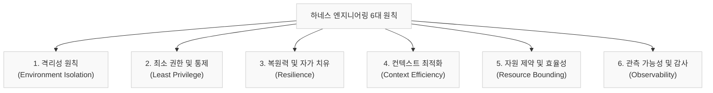
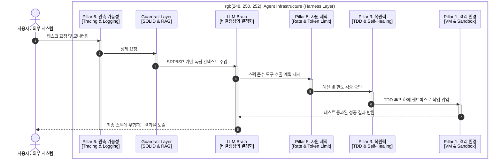

### '하네스 엔지니어링'을 수단 삼아 구축하는 인간과 AI의 조율 방식과 공학적 기율

요즘 테크 씬에서 가장 뜨거운 단어를 하나 꼽으라면 단연 **"자율형 에이전트(Autonomous Agent)"일** 것입니다. 혼자서 계획을 세우고, 코딩을 하고, 디버깅까지 마쳐 완벽한 결과물을 가져다주는 AI 비서. 예전에 5명 이상이 몇 달에 걸쳐 작업해야 했던 것들을 혼자서도 1주일이면 작동하는 코드로 만들어 줄 것 같습니다. 

하지만 이 환상에 이끌려 실제 프로덕션 환경에 AI 에이전트를 가동해 본 동료 엔지니어들을 만나보면 다들 고개를 젓습니다. 

* *"API 호출 무한 루프에 빠져서 자고 일어났더니 하루 만에 한 달 치 예산이 다 날아갔어요."*
* *"분명 어제까지 잘 작동했는데, 오늘 갑자기 엉뚱한 포맷으로 응답이 와서 파싱 에러로 서비스가 뻗었습니다."*
* *"새로운 기능을 추가하라고 맡겼더니, 전체 코드가 뒤섞이면서 기존 코드조차 작동하지 않게 됐습니다. 유지보수가 불가능한 거대한 기술 부채(스파게티 코드)를 선물받았네요."*

2026년 현재, 애플리케이션 개발자들은 만능 자율 에이전트라는 마케팅적 환상에서 빠르게 내려오고 있습니다. 대신 시스템의 신뢰성과 비용을 완전히 통제할 수 있는 **하네스 엔지니어링(Harness Engineering)으로** 눈을 돌리고 있습니다. 

---

## 1. 프롬프트 기반 '원클릭 앱 생성'이 기술적으로 불가능한 이유

"원하는 기능을 말만 하면 AI가 다 알아서 앱을 완성해 준다"는 프롬프트 기반 원클릭 솔루션들이 실무 프로덕션 환경에서 실패할 수밖에 없는 명확한 기술적 이유들이 있습니다.

*   **본질적 복잡성(Essential Complexity)과 명세의 모호성**: 소프트웨어 공학에서 가장 난이도가 높은 작업은 코딩 그 자체가 아니라 '무엇을 만들지 정의하는 명세화'입니다. 모호한 몇 줄의 자연어 프롬프트로는 예외 처리, 비즈니스 규칙, 트랜잭션 범위 등을 완벽히 정의할 수 없으며, 미지정 영역은 AI의 자의적 추정(Hallucination)으로 메워져 실제 구동 시 치명적인 장애를 유발합니다.
*   **비결정성(Non-determinism)과 에러의 연쇄 전파**: LLM의 확률적 모델 특성상 동일한 프롬프트에도 출력 품질과 API 포맷이 미세하게 달라질 수 있습니다. 다중 컴포넌트 환경에서 하나의 비결정론적 API 결함은 연쇄적 시스템 붕괴(Cascading Failure)를 일으키며, 에이전트가 이를 스스로 고치게 두면 한 곳을 고치고 다른 곳을 무너뜨리는 무한 루프 디버깅 지옥에 직면합니다.
*   **유지보수 불가능한 기술 부채(AI-generated Tech Debt)의 누적**: AI는 아키텍처적 일관성이나 리팩토링의 용이성, 테스트 용이성을 고민하지 않습니다. 단기 실행 성공만을 위해 누적되는 AI 코드는 인간 엔지니어가 해독하고 리팩토링하기 극도로 힘든 스파게티 코드가 되어, 최초 구현 속도만 아주 잠깐 단축시킬 뿐 장기적으로는 제품을 유지보수 불가능한 폐기물로 전락시킵니다.
*   **인프라 및 컴플라이언스의 조율 불가능성**: 애플리케이션은 고립된 Sandbox 외부의 인프라(클라우드 권한, VPC 보안 설정 등) 및 법적 준수 의무(개인정보 가드라인 등)와 결합되어 작동합니다. 단순 프롬프트 입력만으로는 이 다차원적인 오프라인/시스템 제약을 온전히 통제할 수 없습니다.
*   **인간 언어와 세계의 근본적 제약(불완전성 정리)**: 공학적 한계를 넘어, 우리는 '언어와 세계가 지닌 불완전성'이라는 본질적 규칙에 직면합니다. 인간의 언어는 아무리 정교하게 가다듬어도 생각과 현실의 다차원적 복잡계를 100% 명세화할 수 없습니다. 작업을 수행하는 주체가 AI이든 인간 엔지니어이든 상관없이 비즈니스 요구사항, 보안 규격, 개인정보보호법, 인프라 제약, 비용 등 수많은 차원의 세계가 얽힌 문제를 단 한 번의 '지시(Prompt)'로 해결하는 것은 수학적으로 불가능합니다. 소프트웨어 개발은 정적인 지시를 통해 한 번에 완성되는 결과물이 아니라, 현실 세계와 상호작용하며 오차를 교정해 나가는 동적 피드백 루프여야 합니다. 이 다차원적 균형을 조율하고 최종적인 방향성을 결정하는 존재로서 **인간(Human-in-the-loop, HITL)**의 개입은 단순한 안전장치가 아닌, 세계의 불완전성을 극복하기 위한 아키텍처적 필연입니다.

따라서 단순히 똑똑한 모델(두뇌)에 의존하는 프롬프트 방식은 태생적으로 신뢰성 한계를 넘지 못하며, 이것이 바로 **모델의 비결정성을 물리적으로 통제하고 제약하는 시스템 가드레일인 '하네스(Harness)'가** 필수적인 이유입니다.

---

## 2. 개념 정의: 본질은 '비결정성의 결정화', 그리고 수단으로서의 하네스(Harness)

우리가 지향해야 할 본질적인 최종 목표는 하네스 엔지니어링이라는 특정 방법론 그 자체가 아닙니다. 진짜 목표는 **AI의 근본 속성인 '비결정론적 지능'을 소프트웨어가 요구하는 안전하고 '결정론적인 데이터와 제어 흐름'으로 변환하고 조율하는 '인간-AI 협업 시스템의 구축'입니다.** 

여기서 소개하는 **하네스(Harness)는** 마구(馬具)의 고삐나 배선 뭉치처럼, 이러한 상위 협업 패러다임을 실현하기 위해 파생된 **여러 기술적 프레임워크이자 아키텍처적 수단 중 하나일** 뿐입니다. 

$$\text{Agent} = \text{Model (Brain)} + \text{Harness (Architecture \& Constraint)}$$

LLM이 문제를 해결하는 '두뇌'라면, 하네스는 **그 두뇌가 현실의 물리적 인프라 및 비즈니스 데이터와 안전하게 상호작용할 수 있도록 규정하는 아키텍처적 안전 기둥입니다.**

자연어로 작성하는 프롬프트(Prompt)는 모델에게 권장 사항을 내리는 **부드러운 제약(Soft Constraint)에** 불과하지만, 하네스는 **두뇌가 마음대로 선을 넘지 못하게 시스템 구조와 미들웨어 단에서 강제하는 단단한 제약(Hard Constraint)입니다.**

### 프롬프트 엔지니어링 vs 하네스 엔지니어링

| 구분         | 프롬프트 엔지니어링 (Prompt Engineering)     | 하네스 엔지니어링 (Harness Engineering)         |
| :--------- | :---------------------------------- | :-------------------------------------- |
| **핵심 질문**  | "모델에게 어떻게 말할 것인가?"                  | "에이전트가 작동하는 환경을 어떻게 제어할 것인가?"           |
| **대상 범위**  | 단일 호출 최적화, 페르소나 설정, 퓨샷(Few-shot) 제공 | 상태 관리, Sandbox 실행 환경, 도구 사용 가드레일, 예외 복구 |
| **동작 레이어** | 자연어 입력 단 (Soft Constraint)          | 시스템 아키텍처 및 미들웨어 단 (Hard Constraint)     |
| **비유**     | 운전자에게 내리는 구두 지시                     | 도로 표지판, 안전 가드레일, 차량의 물리 제어 장치           |

---

## 3. 하네스 엔지니어링 6대 아키텍처 원칙 (6 Pillars)

AI 에이전트 시스템이 프로덕션 환경에서 신뢰성을 갖추기 위해 준수해야 할 6대 개념 설계 원칙입니다.

1.  **격리성 원칙 (Environment Isolation)**: 에이전트가 실행하는 모든 동작, 특히 동적인 코드 생성 및 실행 런타임 환경은 호스트 시스템 및 다른 운영 프로세스로부터 물리적·논리적으로 완전히 격리된 일회성 샌드박스(Sandbox) 환경이어야 합니다.
2.  **최소 권한 및 통제 원칙 (Least Privilege & Control)**: 에이전트가 활용할 수 있는 외부 도구(API, DB 커넥터 등)와 데이터 소스는 특정 태스크를 수행하는 데 필요한 최소한의 범위로 엄격하게 화이트리스트 한정되어야 합니다.
3.  **복원력 및 자가 치유 원칙 (Resilience & Self-Healing)**: 오류, 툴 실패, 혹은 논리적 무한 루프가 발생했을 때 시스템 전체가 다운되지 않고 상태를 보존하며 복구(Self-healing)될 수 있어야 하고, 임계 초과 시 안전하게 가동을 정지하여 인간(HITL)에게 제어권을 돌려야 합니다.
4.  **컨텍스트 최적화 원칙 (Context Efficiency)**: LLM의 한정되고 노이즈에 취약한 맥락 공간(Context Window)을 효율적으로 보존하기 위해, 꼭 필요한 정보만을 정제하고 필터링하여 전달해야 합니다.
5.  **자원 제약 및 효율성 원칙 (Resource Bounding & Optimization)**: 최대 API 호출 횟수(Max Turn Limit), 초당 호출 수(Rate Limit), 토큰 소비 임계치 및 연산 시간(Timeout) 등을 하네스 제어 루프 내에 명시적 상한선(Boundary)으로 구축하여 비용 폭탄을 방지합니다.
6.  **관측 가능성 및 감사 원칙 (Observability & Auditability)**: 자율적으로 판단하는 에이전트의 모든 사고 이력(Trajectory), 도구 호출 내역, 그리고 중간 상태의 변화는 영속적으로 로깅되어 투명하게 검증 및 감사(Audit)될 수 있어야 합니다.

### AWS Well-Architected 6대 기둥과의 매핑

하네스 엔지니어링의 원칙은 클라우드 시스템 설계의 표준인 **AWS Well-Architected Framework와** 긴밀히 대응됩니다.

| AWS Well-Architected 6대 기둥 | 하네스 엔지니어링 6대 원칙 | 아키텍처적 대응 및 직접 이해 |
| :--- | :--- | :--- |
| **1. 보안 (Security)** | **격리성 (Environment Isolation)** **최소 권한 (Least Privilege)** | 에이전트 실행 환경을 일회성 샌드박스로 물리 격리하고 도구(API) 사용 권한을 최소화하여 시스템 탈선 및 데이터 탈취 차단. |
| **2. 신뢰성 (Reliability)** | **복원력 (Resilience & Self-Healing)** | 오류 시 디버깅 피드백 루프를 가동하되, 임계 초과 시 안전하게 가동을 정지하고 인간(Human-in-the-loop)에게 롤백하는 메커니즘. |
| **3. 성능 효율성 (Performance)** | **컨텍스트 최적화 (Context Efficiency)** | 모델의 제한된 Context Window에 필요한 지식과 데이터만 필터링/RAG 처리하여 추론 속도와 품질을 극대화함. |
| **4. 비용 최적화 (Cost)** | **자원 제약 (Resource Bounding)** | 최대 API 호출 횟수, 토큰 사용량에 물리적 한계선(Boundary)을 두어 오작동으로 인한 비용 폭탄을 사전에 방지함. |
| **5. 운영 우수성 (Operational)** | **관측 가능성 (Observability & Audit)** | 에이전트의 매 턴(Turn) 의사결정 경로(Trajectory)와 입출력을 영속적으로 기록하여 작동 로그의 가시성을 확보함. |

---

## 4. 하네스의 핵심 요건: 소프트웨어 공학 기율(Rigor)의 이주

AWS 6대 기둥이 설계의 '틀'을 제공할 뿐 실제 설계는 엔지니어의 경험이 결정하듯, 하네스 엔지니어링 역시 기술적 규칙을 넘어 **조직과 개발자의 소프트웨어 공학 역량이 뒷받침되어야만 성공할 수** 있습니다. 

> [!IMPORTANT]
> **시장 데이터와 전문가 집단의 합의 (Industry Consensus)**
> *   **Stack Overflow 개발자 서베이**: 전 세계 개발자의 80% 이상이 AI 도구를 도입했지만, AI 코드 품질에 대한 **신뢰도는 30~40% 수준으로 매우 낮습니다.** 개발자들은 AI가 짠 "그럴싸하지만 결함이 있는(Almost-Right)" 코드를 검증하고 디버깅하여 통합하는 데 더 많은 공수를 낭비하고 있습니다. 
> *   **ThoughtWorks 기술 전망 (Migration of Rigor)**: AI의 발달로 타이핑의 공수는 완전히 사라져도, 엔지니어링의 정밀함(Rigor)과 품질 기준은 사라지지 않습니다. 품질에 대한 엄격함은 단순히 **"스펙 설계(Specification)", "TDD 테스트 세트 구축", "안전 제약 조건의 설계"**라는 더 상위 소프트웨어 공학의 영역으로 이주(Migration)할 뿐입니다.
> *   **LinearB/Harness "속도 패러독스 (Velocity Paradox)" 조사**: AI 도입으로 단순 코드 작성이 40% 빨라졌으나, 이를 검증하고 배포하는 파이프라인(QA, 보안, 통합)이 부실한 기업은 도리어 **회귀 에러와 기술 부채가 폭발하여 전체 리드 타임이 지연되는** 현상이 입증되었습니다.

따라서 하네스 엔지니어링이 실제 작동하기 위해 아키텍트와 조직이 갖추어야 할 **4대 핵심 소프트웨어 공학 실무 요건**은 다음과 같습니다.

### ① 관심사항 분리(SoC) 및 SOLID 원칙의 적용
에이전트의 작업 지침이나 모듈에 단일 책임 원칙(SRP)과 인터페이스 분리 원칙(ISP)을 엄격히 대입하여 책임을 작고 명확하게 쪼갭니다. 이를 통해 에이전트가 한 번에 다뤄야 하는 맥락(Context Window)을 축소하여 환각 오류를 방지하고, 불필요한 토큰 낭비와 인지 부하를 차단합니다.

### ② 테스트 주도 개발(TDD)의 내장
에이전트가 코드를 수정하는 과정에 단위 테스트(Unit Test) 작성 및 실행 루프를 강결합합니다. 미리 작성된 테스트 케이스 자체가 에이전트 동작의 **물리적 가드레일** 역할을 합니다. 기존 소스코드의 기능을 해치지 않는 안전망을 확보하여, 코드가 점진적(Incremental)으로 수정될 때 품질이 무너지지 않고 누적되도록 강제합니다.

### ③ 기획/설계 스펙(Specification-First) 기반의 일관된 인터페이스 제어
기획서나 API 스펙(OpenAPI/Swagger 명세), DB 스키마 등의 스펙 문서를 최상위 계약(Contract)으로 선언합니다. 에이전트가 생성해야 할 데이터 경계면(Interface Boundary)이 고정되므로, 비결정론적인 성향의 모델이 명확한 규격이라는 타깃을 바라보고 움직이도록 통제(비결정성의 결정화)할 수 있습니다.

### ④ 관측 가능성(Observability)의 아키텍처적 내장
시스템 개발 초기 단계부터 계측(Instrumentation), 로깅, 분산 트레이싱(Tracing)을 하네스 아키텍처에 기본 설계로 이식합니다. 의사결정을 내린 에이전트의 내부 판단 근거(Reasoning)와 데이터의 흐름을 투명하게 시각화하여, 장애나 오작동이 발생했을 때 신속하게 근본 원인을 파악하고 상태를 감사(Audit)할 수 있게 만듭니다.

---

## 5. 원칙 간 상호작용 및 시스템 구조

6대 원칙이 실제 시스템 내에서 소프트웨어 공학적 기법들과 어떻게 결합되어 유기적으로 동작하는지 보여주는 개념적 통합 구조도 및 데이터 흐름입니다.

### 단계별 데이터 플로우 및 소프트웨어 공학 매핑

1.  **입력 및 모니터링 (Pillar 6):** 사용자가 작업을 요청하면 시스템 전체에 계측이 활성화되어, 분산 트레이싱을 시작하고 고유한 Request ID를 발급하여 에이전트의 생명주기를 모니터링합니다.
2.  **컨텍스트 정제 및 관심사 분리 (Pillar 4, 2):** 입력은 가드레일을 통과합니다. 이때 SOLID의 단일 책임(SRP) 및 인터페이스 분리(ISP) 원칙을 컨텍스트 필터 설계에 대입하여, 에이전트가 알아야 할 국소적 범위의 정제된 지식(RAG 결과)만 조립하여 모델에 전달합니다.
3.  **목표 명세 및 계획 수립 (LLM Brain):** 에이전트는 기획서/API 스펙 문서(OpenAPI 등)를 기준으로 작동 계획을 수립합니다. 즉, 비결정론적 성향의 모델이 명확한 규격이라는 타깃을 바라보고 움직이도록 제어합니다.
4.  **자원 검증 및 실행 통제 (Pillar 5):** 에이전트가 도구 호출을 선언하면 자원 제한 모듈이 Rate limit와 토큰 버짓 한계를 계산하여 실행 가부를 승인합니다.
5.  **검증 기반 격리 실행 (Pillar 3, 1):** 승인된 코드나 스크립트는 가상 환경(VM, Docker Sandbox) 내부로 격리 전송됩니다. 이때 미리 정의된 **TDD(테스트 코드)를 가드레일** 삼아 에이전트가 코드를 검증 및 자가 치유(Self-Healing)하며, 테스트 통과 조건이 충족될 때 비로소 성공 결과를 반환합니다.
6.  **감사 및 아웃풋 도출:** 최종 산출물은 처음에 정의한 스펙과 일치하는지 데이터 스키마 유효성 검증을 마친 뒤, 관측성 로그를 남기고 사용자에게 안전하게 반환됩니다.

---

## 6. 결론: 동상이몽 속에서 도달한 시장의 최종 합의(Consensus)

각 주체의 이해관계(엔지니어의 품질 우선주의, 비즈니스의 속도 지향, 빅테크의 매출 극대화)가 격렬히 충돌하는 과도기를 거치며, 2026년 현재 시장이 도달한 최종 합의(Consensus)는 다음과 같습니다.

*   **자율성(Autonomy)에서 통제성(Controllability)으로의 패러다임 전환**:
    AI가 소프트웨어를 백지 상태에서 완전히 자율적으로 완성해 준다는 시나리오는 불가능하며 시도해서도 안 된다는 점에 합의했습니다. 가치 창출의 핵심은 무제한의 자율성이 아니라, 엔지니어가 코드로 설계한 결정론적 경계(Harness) 안에서 격리되어 일하는 **'통제된 자율성'입니다.**
*   **제거 불가능한 아키텍처 노드로서의 HITL(Human-in-the-loop)**:
    인간의 개입(HITL)은 단순히 AI의 미숙함을 때우기 위한 임시방편이 아닙니다. 언어와 현실 세계 사이의 본질적 불완전성 장벽을 넘기 위해 비즈니스 요구사항, 보안 규격, 법률 및 규제, 인프라 비용 등의 다차원적 균형을 최종적으로 조율하고 의사결정을 내리는 **'시스템 지휘자(Conductor)'로서** HITL은 아키텍처에서 배제할 수 없는 필수 설계 요소입니다.
*   **소프트웨어 공학의 기율(Rigor)의 귀환**:
    AI 코딩 기술이 발달할수록, 역설적으로 고전적인 소프트웨어 공학의 중요성은 더욱 강화되었습니다. 스펙 문서화(Specification-First), SOLID 원칙, TDD 테스트 케이스 구축 등 엄격한 설계적 기율만이 비결정론적인 AI 코드가 초래할 기술 부채와 스파게티 코드의 폭발을 막는 유일한 방어선입니다.
*   **TCO(총소유비용) 관점의 실용적 MSA-like 아키텍처 수렴**:
    에이전트의 무제한 자율 구동으로 인한 API 비용 및 무한 루프 디버깅 리스크가 인간 개발자를 고용하는 비용을 초과할 수 있음을 인지하게 되었습니다. 이에 따라 만능 자율 AI 대신, 목적이 한정된 경량 소형 모델들을 파이프라인의 특정 단일 태스크 노드에 부품(Micro-Task Worker)처럼 배치하는 **하이브리드 아키텍처가** 가장 경제적이고 지속 가능한 대안이라는 합의에 도달했습니다.

---

## 7. 개발 관행의 AX화(AI Transformation)를 위한 제언

하네스 엔지니어링은 AI 에이전트가 "스스로 알아서 일하게 두는 것"이 아니라, **"사전에 정비된 안전하고 투명한 궤도 위에서만 자율성을 발휘하도록 시스템 궤도를 부설하는 설계 사상"**입니다. 

이 설계 사상이 기업 현장에서 실제 성공적인 개발 관행의 AX화(AI Transformation)로 발현되기 위해서는, 아키텍트와 기술 리더들이 고려해야 할 3가지 객관적 사실이 있습니다.

### ① 자체 아키텍처 및 엔지니어링 역량 내재화의 필요성
전통적인 SI 및 대기업 그룹사의 PM(관리) 중심 구조와 개발 외주화 관행은 개발 관행의 AX화를 추진할 때 가장 큰 걸림돌입니다. AI 에이전트가 단 몇 초 만에 쏟아내는 수천 줄의 코드를 면밀히 리뷰하고, 그 구조의 정당성(SOLID, SoC 등)을 검증할 **자체 시니어 아키텍트와 핵심 개발 역량이 내부에 부재하다면, 시스템은 **통제 불가능한 품질 리스크 및 기술 부채를 유발할** 수 있습니다. 

### ② 기술 교육의 우선순위 및 실효성 제고
일회성 프롬프트 팁이나 기초적인 RAG 챗봇 구축 등 표면적인 AI 기술 교육은 기술 진화에 따라 빠르게 자동화되거나 범용화되므로 장기적 실효성이 제한됩니다. 정작 우선순위를 두어 투자해야 할 영역은 AI 기술 도입 이전에 **전통적인 소프트웨어 엔지니어링(SOLID 원칙, TDD, API 및 스펙 설계 역량)의 기본 역량을 철저히 교육하고 내재화하는 것**입니다.

### ③ 결언: 지속 가능한 AX를 위한 전문 기술 인재 확보
하네스 엔지니어링은 AI 에이전트라는 또 다른 협력자를 부리기 위한 '인프라 규약 및 지침'일 뿐이며, 이를 설계하고 조율하는 주체는 결국 인간 엔지니어입니다. **소프트웨어 공학의 엄격한 기율을 지닌 내부 엔지니어가 없는 조직의 개발 관행 AX화는 일회성 기술 도입에 그칠 위험**이 큽니다. 중장기적인 기술 인재 채용 및 엔지니어링 역량 내재화 로드맵이 반드시 동반되어야 지속 가능한 비즈니스 가치를 창출할 수 있습니다.

---

## ☕ 맺음말

진정한 실용주의 AI 엔지니어는 AI의 자율성을 맹신하지도, 그렇다고 AI의 지능을 배척하지도 않습니다. 본질은 불완전한 비결정성 모델을 결정론적 소프트웨어 생태계로 안전하게 이식하여 인간과 AI가 공존할 수 있는 최적의 조율점을 찾는 것입니다.

'하네스 엔지니어링'은 그 조율을 달성하기 위한 유용한 아키텍처적 수단 중 하나일 뿐입니다. 중요한 것은 도구의 이름이 아니라, 비결정성을 제어 가능한 영역으로 끌어내려 소프트웨어의 신뢰성을 확보하겠다는 엔지니어의 공학적 기율과 집념입니다. 여러분의 다음 AI 협업 설계도 이러한 본질적 방향성 위에서 견고하게 다듬어지기를 기대합니다.
