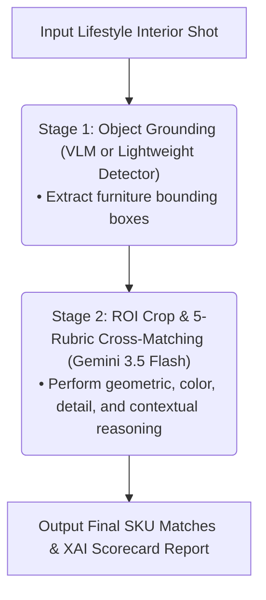

## 1. Introduction: Limitations of Computer Vision and Why We Explored VLMs

Industry has long sought to automate production and logistics pipelines by deploying computer vision technologies. However, adapting conventional deep learning vision models to real-world operational environments frequently exposes insurmountable hurdles. Traditional models mechanically compare pixel distributions or feature vectors; they lack **context-aware reasoning** capable of deducing spatial relationships and surrounding environmental context.

In real-world business scenarios, two structural bottlenecks consistently hinder classical computer vision adoption:

First is the **overhead of repetitive dataset engineering**. Whenever operational settings or target domains shift slightly, engineers must gather new training images, manually label bounding masks (annotation), and retrain models from scratch. This imposes unsustainable maintenance costs.

Second is the **mandatory requirement for strictly controlled environments**. To suppress algorithm false positives, teams are forced to engineer artificial factory conditions: fixing conveyor belt velocities, stabilizing ambient illumination, and locking camera angles. Consequently, facility integration costs soar while operational physical flexibility plummets.

Because traditional vision models are brittle when confronted with changing illumination or viewpoint variations, their utility in uncontrolled ("in-the-wild") environments is severely constrained. In this landscape, recent breakthroughs in Vision-Language Models (VLMs) present a compelling path forward. Combining visual perception with semantic contextual reasoning, VLMs enable the design of dynamic image analysis and inference architectures that thrive in unstandardized, real-world conditions.

This article details our experience constructing a production pipeline using the **Gemini 3.5 Flash** VLM API. The system accurately identifies individual furniture Stock Keeping Units (SKUs) from unconstrained interior lifestyle photographs and outputs verifiable Explainable AI (XAI) evaluation scorecards. We also share our implementation of a Streamlit demo interface built for intuitive operational evaluation by frontline staff.

---

## 2. Why Tag Interior Lifestyle Shots? Business Background and Scenario Design

Furniture retailers and interior design platforms hold tens of thousands of high-resolution **interior lifestyle photographs**. Unlike sterile white-background product shots (silhouette cutouts), lifestyle images capture how furniture integrates harmoniously within real living spaces, making them vital marketing assets for driving purchase conversions.

However, an operational bottleneck persists: most lifestyle photographs lack **product-level SKU metadata identifying which item in the scene corresponds to which catalog SKU**. Consequently, vast repositories of premium visual assets remain buried in enterprise archives, underutilized.

If a VLM can autonomously identify furniture items within lifestyle scenes and bind accurate SKU tags, it unlocks substantial commercial value:

* **Maximizing Cross-Selling and Recommendations**: When a customer views a product detail page, the platform can recommend curated lifestyle scenes featuring that exact item. Furthermore, displaying other tagged items present in the scene (such as a desk lamp or filing cabinet adjacent to a chair) drives organic cross-selling.
* **Slashing Marketing and Content Curation Overhead**: Previously, creative teams spent hours manually combing through thousands of catalog images to locate "lifestyle shots featuring warm-toned wooden desks in Scandinavian studies." Automated tagging reduces this search friction to near zero.
* **Generating Context-Rich Marketing Copy via VLM Semantics**: Because VLMs integrate linguistic intelligence with visual perception, they transcend dry categorical keywords like "chair, desk." They can synthesize evocative, contextual marketing copy—such as *"A cozy Scandinavian study bathed in gentle afternoon sunlight"*—to accelerate content marketing pipelines.
* **Conversational Natural Language Visual Search**: Shoppers can locate specific products through conversational inquiries like *"A minimalist black floor lamp suitable for compact studio apartments."*

To validate this thesis, we structured an **interior lifestyle furniture matching and tagging** benchmark scenario mirroring enterprise production conditions.

### A. Validation Scenario Structure

* **Input Data (Target Lifestyle Shot)**: An unconstrained lifestyle photograph (`lifestyle_multi.jpg`) featuring multiple overlapping furniture items (occlusion) and non-uniform ambient lighting.
  
  

* **Reference Catalog (5 SKU Library)**: Five standalone reference furniture product images (White Office Chair, Black Contrast Chair, Wooden Desk, Matte Black Floor Lamp, 3-Tier Mobile Cabinet).

| SKU 1 (White Chair) | SKU 2 (Black Chair) | SKU 3 (Wooden Desk) | SKU 4 (Black Lamp) | SKU 5 (Mobile Cabinet) |
| :---: | :---: | :---: | :---: | :---: |
|  |  |  |  |  |

### Operational Objectives
1. **Object Grounding**: Identify all furniture entities in the lifestyle image and extract precise normalized bounding box coordinates.
2. **Fine-Grained SKU Matching**: Crop extracted furniture regions and match them against the 5 catalog SKUs to determine the highest-confidence item.
3. **Explainable AI (XAI)**: Rather than silently discarding non-matching candidates, mark them as "Rejected" and generate a structured evaluation report detailing the rationale across four distinct rubrics (Geometry, Color, Details, Context).

---

## 3. Our Iterations: Exploring Traditional Vision Models and Their Limitations

Before adopting a VLM, our team evaluated several conventional computer vision architectures during preliminary proof-of-concept stages. A central takeaway emerged: **the commercial viability of automated furniture tagging hinges entirely on maximizing Recall (detecting existing items without omissions)**.

If a stylish chair or lamp is clearly present in an image but the model fails to detect it (False Negative), cross-selling recommendations and marketing search capabilities fail entirely.

However, when applying **generic ML models that were not fine-tuned on specialized furniture datasets, matching recall degraded sharply**. The specific failure modes observed during testing were as follows:

### 1. Object Detectors (Mask R-CNN, YOLO): Detection Losses from Occlusion
* **Approach**: Detect furniture regions via bounding boxes, mask out background noise, and pass cropped segments to downstream matching algorithms.
* **Limitations**: When items were partially obscured by seated individuals or overlapping decor (**occlusion**), un-finetuned general-purpose detectors suffered steep confidence drops and dropped detections entirely. This triggered severe **recall degradation**, rendering them unacceptable for production. Continuously creating annotated training sets for every seasonal product release was cost-prohibitive.
* **Suitable Applications**: High-speed, highly controlled industrial environments: manufacturing inspection lines with locked lighting and camera rigs (Smart Factories), real-time vehicular/pedestrian detection in autonomous driving, or standardized parcel sorting in logistics hubs.

### 2. Self-Supervised ViT Embeddings (DinoV2): Matching Failures from Indiscriminate Fine Details
* **Approach**: Calculate cosine similarities between cropped furniture embeddings and reference catalog embeddings.
* **Limitations**: `DinoV2` embeddings depend heavily on global color and luminance distributions. Consequently, when two chairs shared similar white molded plastic shells and camera angles, the model frequently misclassified them as identical products, even if their mechanical silhouettes differed entirely. It consistently overlooked subtle hardware variations like height-adjustment levers or leg bracket configurations, **failing to achieve acceptable SKU-level matching recall.**
* **Suitable Applications**: Coarse visual recommendations in fashion e-commerce ("browse visually similar styles"), automated clustering for large image archives, or visual pathology search in medical imaging where global texture and layout similarity take precedence.

### 3. Classical Keypoint Matching (SIFT, ORB): Severe False Rejections Under Perspective Changes
* **Approach**: Match spatial alignments across geometric keypoints along mechanical frame joints and contours.
* **Limitations**: Minor variations in illumination, cast shadows, or perspective warping broke keypoint homographies, causing the algorithm to reject genuinely matching furniture (False Negatives). This **decimated true-positive matching recall** and demanded continuous manual threshold tuning that proved unmanageable at scale.
* **Suitable Applications**: Precision geometric stitching (panoramas), spatial visual SLAM for autonomous robotics, and Structure from Motion (SfM) 3D photogrammetry where static geometric camera constraints are strictly enforced.

### 💡 The VLM Solution

Introducing **Gemini 3.5 Flash** cleanly resolved these limitations across three primary dimensions:

1. **Spatial Context Reasoning**: Even when an individual is seated on a chair—obscuring its base and legs—the VLM leverages surrounding contextual hints and remaining visible contours to correctly associate the entity with the "White Office Chair SKU."
2. **Natural Language Business Rules**: Sophisticated domain policies—such as *"Even if structural silhouettes align, reject the match if injection molding colors differ, as they represent distinct product numbers"*—can be injected directly into the prompt as **declarative natural language rules**.
3. **Zero/Few-Shot Extensibility**: When onboarding new catalog items, there is no need to engineer extensive training datasets; adding reference images and evaluation guidelines directly to the prompt enables instantaneous operational support.

---

## 4. Why Gemini 3.5 Flash? Technical Strengths Analysis

Selecting **Gemini 3.5 Flash** as our primary inference engine was driven by several key technical advantages tailored to unconstrained visual matching:

### Native Multimodal and Variable Resolution Processing
Many lightweight open-source VLMs force input images into fixed square resolutions (e.g., 448x448). This distorts natural furniture aspect ratios and degrades fine-grained resolution, erasing critical mechanical contours. In contrast, Gemini 3.5 Flash is natively multimodal, preserving native aspect ratios and utilizing dynamic patch splitting. This preserves micro-level visual cues like dial controls, seam lines, and frame curves during analysis.

### Long-Context Reasoning Across Multiple Reference Images
A single inference call requires injecting the target crop, five high-resolution reference SKU images, and comprehensive textual rubric guidelines. Supporting a context window well beyond 1 million tokens, Gemini 3.5 Flash ingests all visual assets and evaluation criteria simultaneously, executing precise multi-image cross-referencing without context truncation.

### Reliable Structured JSON Output
Integrating VLM outputs into legacy enterprise databases requires strictly validated data schemas. Gemini 3.5 Flash reliably adheres to developer-specified JSON schemas, ensuring frictionless downstream pipeline ingestion.

### Superior Performance-to-Cost Ratio and Latency (TCO Reduction)
Delivering multimodal reasoning approaching frontier "Pro" tiers while maintaining rapid inference speeds and competitive per-token pricing, the model significantly reduces infrastructure expenditures (TCO) during batch processing runs.

---

## 5. Designing a Two-Stage Hybrid Pipeline for Computational Efficiency

To optimize API consumption and throughput, we structured a two-stage hybrid processing pipeline:



1. **Stage 1 (Object Grounding & Bounding Box Extraction)**: Leverages Gemini 3.5 Flash visual grounding to detect all furniture entities within the scene, extracting normalized coordinates to generate cropped regions of interest (ROIs).
2. **Stage 2 (Fine-Grained Verification & XAI Tagging)**: Feeds individual cropped items alongside the 5 reference catalog SKU images back into the model to execute detailed rubric evaluations and render final match determinations.

---

## 6. Implementing the VLM Matching Client with the google-genai SDK

The project was implemented using Google's official unified SDK, **`google-genai`**. The snippet below highlights the core business logic from the backend client module [vlm_client.py](file:///home/yundream/myjob/cloit/fursys/Target_Image/vlm-furniture-tagging/vlm_client.py):

```python
import os
import json
import logging
from PIL import Image
from google import genai
from google.genai import types

logging.basicConfig(level=logging.INFO)
logger = logging.getLogger("VLMClient")

class VLMClient:
    def __init__(self, use_mock=False):
        self.use_mock = use_mock
        # Load API key from environment variables
        self.api_key = os.environ.get("GEMINI_API_KEY") 
        
        if not self.use_mock and self.api_key:
            self.client = genai.Client(api_key=self.api_key)
            self.model_name = 'gemini-3.5-flash'
        else:
            self.use_mock = True

    def detect_objects(self, image: Image.Image) -> list:
        """Stage 1: Visual Grounding of furniture items within scene"""
        if self.use_mock:
            return self._get_mock_detections()
            
        prompt = """
        Analyze the image and locate all furniture items.
        Return coordinates in normalized [ymin, xmin, ymax, xmax] (0-1000) strictly in JSON format.
        """
        try:
            logger.info(f"Calling Gemini API (Grounding) -> Model: {self.model_name}")
            response = self.client.models.generate_content(
                model=self.model_name,
                contents=[image, prompt],
                config=types.GenerateContentConfig(response_mime_type="application/json")
            )
            data = json.loads(response.text)
            return data.get("detections", [])
        except Exception as e:
            logger.error(f"Gemini API Error (Detection): {e}")
            return self._get_mock_detections()

    def evaluate_matching(self, cropped_image: Image.Image, sku_data: dict) -> dict:
        """Stage 2: Cross-reference cropped candidate against 5 SKU references"""
        if self.use_mock:
            return self._get_mock_matching(sku_data, cropped_image)

        prompt = """
        Compare Target Cropped Image with the 5 reference SKU Images.
        Calculate a match score out of 100 based on structure, color, detail, and context rubrics.
        """
        try:
            input_contents = [cropped_image]
            for sku_id, info in sku_data.items():
                input_contents.append(f"SKU ID: {sku_id}")
                input_contents.append(info['image'])
            input_contents.append(prompt)

            logger.info(f"Calling Gemini API (SKU Matching) -> Model: {self.model_name}")
            response = self.client.models.generate_content(
                model=self.model_name,
                contents=input_contents,
                config=types.GenerateContentConfig(response_mime_type="application/json")
            )
            data = json.loads(response.text)
            return data
        except Exception as e:
            logger.error(f"Gemini API Error (Matching): {e}")
            return self._get_mock_matching(sku_data, cropped_image)
```

This client is encapsulated in [`VLMClient`](file:///home/yundream/myjob/cloit/fursys/Target_Image/vlm-furniture-tagging/vlm_client.py#L115) and includes built-in mock modes to streamline local testing without consuming live API tokens.

The complete backend matching codebase and Streamlit application are available in the [vlm-furniture-tagging GitHub repository](https://github.com/joincdream/vlm-furniture-tagging).

---

## 7. Building a Streamlit Demo for Rapid Hypothesis Testing

During initial proof-of-concept stages, building complex custom web frontends is inefficient. We deployed **Streamlit** to build a lightweight, functional UI allowing domain practitioners to inspect and validate backend inferences directly.


The interface omits superfluous UI ornamentation, focusing entirely on **delivering intuitive visual cross-validation of VLM inferences and XAI scorecards**:

* **Unambiguous Detection Validation**: Renders annotated target scenes with expansive width (`use_container_width=True`) so reviewers can immediately confirm bounding box accuracy.
* **Streamlined Candidate Selection**: Allows users to select individual detected objects via a dropdown (`st.selectbox`) to toggle focus seamlessly.
* **1:N Catalog Comparison Table**: Arranges the cropped candidate image alongside the 5 SKU evaluation scorecards (DataFrames) in a wide horizontal layout for side-by-side verification.
* **Expandable XAI Breakdown**: Encapsulates natural language reasoning logs within `st.expander` containers, keeping the UI uncluttered while enabling instant access to detailed diagnostic justifications.

```python
# Streamlit component arrangement snippet
st.markdown("### 📸 1. Target Lifestyle Shot")
st.image(rendered_image, use_container_width=True)

st.markdown("### 📊 Explainable AI (XAI) Evaluation Scorecard")
col_crop, col_table = st.columns([1, 3])
with col_crop:
    st.image(selected_crop, use_container_width=True)
with col_table:
    st.dataframe(score_dataframe, use_container_width=True, hide_index=True)
```

---

## 8. Conclusion: Extensibility to Open-Source VLMs (Gemma 4)

Driven by cloud-hosted **Gemini 3.5 Flash**, this visual furniture matching architecture demonstrates exceptional accuracy and practical robustness in unconstrained environments.

However, organizations that cannot transmit proprietary product imagery externally or that demand sub-second offline inferencing will require on-premises architectures. For such environments, emerging open-weight vision-language models—specifically **Gemma 4 (12B / 26B)** deployed on local GPU infrastructure—offer a compelling hybrid alternative.

The Gemma 4 architecture's enhanced native visual tokenization and parameter efficiency provide a solid foundation for enterprise teams seeking to gradually transition sensitive visual catalog governance to air-gapped internal environments while managing external API expenditures.
