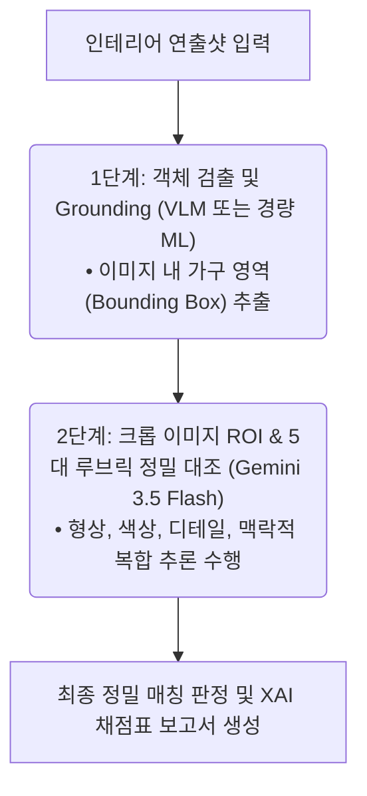

## 1. 들어가며: 컴퓨터 비전의 한계와 VLM을 고민하게 된 이유

컴퓨터 비전 기술을 활용해 생산 및 물류 공정을 자동화하고 업무를 효율화하려는 시도는 산업계에서 끊임없이 이어져 왔습니다. 하지만 기존의 딥러닝 기반 비전 모델을 실무 현장에 적용하다 보면 예상치 못한 난관에 부딪히기 일쑤였습니다. 기존 모델들은 이미지의 픽셀값이나 특징 벡터를 기계적으로 비교할 뿐, 사물 간의 공간적 관계나 주변 정황을 인과적으로 파악하는 **'맥락 기반 추론(Context-Aware Reasoning)'** 영역에서 명확한 한계를 보였기 때문입니다.

실제 비즈니스 현장에서 비전 기술 도입을 가로막는 대표적인 병목 현상은 크게 두 가지였습니다.

첫째는 **반복적인 학습 데이터 구축 오버헤드**입니다. 작업 환경이나 대상 도메인이 조금만 바뀌어도 새로운 학습 데이터를 수집하고, 수작업으로 마스크 영역을 지정(Annotation)하여 모델을 매번 재학습해야 했습니다. 이는 감당하기 어려운 운영 리소스 소모로 이어졌습니다.

둘째는 **엄격하게 통제된 환경(Controlled Environment)의 필요성**입니다. 알고리즘의 오탐을 줄이기 위해 컨베이어 벨트의 속도를 제어하고, 조명과 카메라 앵글을 고정하는 등 인위적인 공정 설계를 강제해야 했습니다. 결과적으로 설비 구축 비용이 치솟고 물리적인 공정 유연성은 떨어질 수밖에 없었습니다.

조명 변화나 카메라 각도에 극도로 취약한 기존 비전 모델은 정돈되지 않은 실제 현장(In-the-wild)에 적용하기에 한계가 명확했습니다. 이러한 상황에서 최근 눈부시게 발전한 시각-언어 통합 모델(VLM, Vision-Language Model)은 매력적인 돌파구로 떠올랐습니다. 뛰어난 시각 및 텍스트 맥락 인지 능력을 바탕으로, 규격화되지 않은 일반 환경에서도 동적으로 이미지를 분석하고 추론하는 시스템을 설계할 수 있게 된 것입니다.

본 포스트에서는 **Gemini 3.5 Flash**의 VLM API를 활용하여, 정돈되지 않은 실제 인테리어 연출샷에서 가구 단품 SKU(Stock Keeping Unit) 카탈로그를 정밀하게 매칭하고, 그 근거를 설명 가능한 AI(XAI) 채점표로 도출하는 파이프라인 구축 기를 소개합니다. 아울러 이를 실무자가 직관적으로 사용할 수 있도록 Streamlit 데모로 구현한 사례까지 함께 공유합니다.

---

## 2. 왜 인테리어 연출샷 태깅이 필요할까? 비즈니스 배경과 시나리오 설정

가구 유통회사나 인테리어 플랫폼은 수만 장에서 수십만 장에 이르는 고품질의 **'인테리어 연출샷'**을 보유하고 있습니다. 이 연출샷들은 단순한 제품 누끼 컷과 달리, 가구가 실제 공간에 배치되었을 때의 조화로운 분위기를 보여주기 때문에 구매 전환율을 높이는 핵심 마케팅 자산입니다. 

하지만 치명적인 문제가 있습니다. 대부분의 연출샷에 **"사진 속의 어떤 가구가 어떤 제품(SKU)인지"**에 대한 정보가 태깅되어 있지 않다는 점입니다. 이로 인해 수많은 고품질 이미지들이 아카이브 속에 묻혀 제대로 활용되지 못하고 있습니다. 

만약 VLM을 통해 연출샷 속 가구들을 자동으로 식별하고 SKU 매칭 태그를 달아줄 수 있다면, 다음과 같은 혁신적인 비즈니스 가치를 만들어낼 수 있습니다.

* **연관 상품 추천 및 크로스셀링(Cross-selling) 극대화**: 특정 제품의 상세 페이지를 보고 있는 사용자에게 그 제품이 예쁘게 배치된 인테리어 연출샷을 추천해 줄 수 있습니다. 나아가 해당 연출샷에 태깅된 다른 제품(예: 의자 옆의 조명이나 서랍장)을 자연스럽게 함께 노출함으로써 강력한 연관 상품 구매를 유도합니다.
* **마케팅 및 콘텐츠 제작 리소스 절감**: 기존에는 마케팅 부서에서 "우드 톤 책상이 들어간 따뜻한 분위기의 서재 연출샷"을 찾기 위해 수천 장의 이미지를 일일이 눈으로 확인해야 했습니다. 자동 태깅 시스템은 이러한 검색 공수를 제로에 가깝게 줄여줍니다.
* **VLM의 언어 능력을 활용한 감성 마케팅 정보 생성**: VLM은 단순한 이미지 인식 모델이 아니라 '언어 모델'이 결합된 형태입니다. 따라서 단순히 "의자, 책상" 같은 건조한 키워드를 넘어, "아늑한 오후 햇살이 비치는 북유럽풍 서재 분위기"와 같은 풍부하고 감성적인 마케팅 문구와 메타데이터를 자동으로 생성하여 마케팅 팀의 기획 업무를 도울 수 있습니다.
* **대화형 자연어 기반 이미지 검색**: 사용자는 "좁은 방에 놓기 좋은 심플한 블랙 스탠드 조명"처럼 일상적인 대화체나 구체적인 맥락을 입력해 원하는 이미지와 제품을 손쉽게 찾아낼 수 있습니다.

이러한 비즈니스 문제를 해결하기 위해, 우리는 다음과 같이 실무 환경을 모사한 **'인테리어 연출샷 기반 가구 매칭 및 태깅'** 검증 시나리오를 설계했습니다.

### A. 검증 시나리오 구조

* **입력 데이터 (타겟 연출샷)**: 여러 가구가 서로 겹쳐서 가려져 있고(Occlusion), 조명이 일정하지 않은 실제 인테리어 연출샷 이미지(`lifestyle_multi.jpg`)를 준비했습니다.
  
  

* **대조 라이브러리 (5종 SKU 카탈로그)**: 비교 대상이 될 실물 가구 단품 이미지 5종을 준비했습니다. (화이트 바디 의자, 블랙 대조군 의자, 원목 데스크, 매트 블랙 스탠드 조명, 3단 이동식 캐비닛)

|                                                           SKU 1 (화이트 의자)                                                            |                                                              SKU 2 (블랙 의자)                                                               |                                                           SKU 3 (원목 책상)                                                           |                                                           SKU 4 (블랙 조명)                                                           |                                                            SKU 5 (이동식 서랍장)                                                             |
| :---------------------------------------------------------------------------------------------------------------------------------: | :--------------------------------------------------------------------------------------------------------------------------------------: | :-------------------------------------------------------------------------------------------------------------------------------: | :-------------------------------------------------------------------------------------------------------------------------------: | :------------------------------------------------------------------------------------------------------------------------------------: |
|  |  |  |  |  |

### 우리의 목표
1. **Object Grounding**: 연출샷 이미지 안에서 가구 객체들을 식별하고, 각각의 영역 좌표(Bounding Box)를 정확히 추출합니다.
2. **Fine-grained SKU Matching**: 추출된 개별 가구 영역을 크롭하여 5종의 SKU 중 가장 매칭률이 높은 제품을 판정합니다.
3. **Explainable AI (XAI)**: 일치율이 낮은 경우 단순히 탈락시키는 것이 아니라 '기각(Rejected)' 처리하고, 판정 결과에 대해 4대 평가 지표(형상, 색상, 디테일, 맥락)별로 구체적인 판정 사유를 리포트 형태로 기술합니다.

---

## 3. 우리가 거쳐온 고민들: 기존 비전 모델들의 시도와 한계

이 시나리오를 해결하기 위해 VLM을 도입하기 전, 저희 팀은 다양한 기존 컴퓨터 비전 모델들을 검토하며 PoC를 진행했습니다. 이 과정에서 깨달은 가장 중요한 사실은, **가구 자동 태깅 비즈니스의 성패는 결국 '재현율(Recall, 실제 존재하는 가구를 놓치지 않고 찾아내는 비율)'을 얼마나 확보하느냐에 달려있다**는 점이었습니다. 

사진 속에 예쁜 의자와 조명이 엄연히 존재하는데도 모델이 이를 포착하지 못해 태깅을 누락한다면(False Negative), 크로스셀링이나 마케팅 아카이브 검색이라는 비즈니스 목적을 달성할 수 없기 때문입니다. 

그러나 대상 가구 도메인에 맞춰 별도로 **파인튜닝(Fine-tuning)하지 않은 기존 ML 모델들을 적용했을 때, 재현율(Recall)이 급격히 떨어지는 명확한 한계**를 마주했습니다. 구체적인 PoC 결과와 배제 사유는 다음과 같았습니다.

### 1. 객체 검출 모델(Mask R-CNN, YOLO)의 한계: 가림 현상으로 인한 검출 유실
* **시도했던 방식**: 연출샷에서 가구 영역을 1차로 검출한 뒤 배경 노이즈를 마스킹하여 비교 알고리즘에 전송하고자 했습니다.
* **한계점**: 사람이 앉아 있거나 다른 소품에 가려지는 **가림(Occlusion) 현상**이 발생하면, 파인튜닝되지 않은 범용 검출 모델은 신뢰도 점수가 급격히 떨어져 객체 자체를 탐지하지 못했습니다. 이는 곧바로 **태깅 누락(Recall 저하)**으로 이어져 실제 서비스에 적용하기 불가능한 수준이었습니다. 매번 신제품이 나올 때마다 어노테이션 데이터를 만들고 재학습하는 공수 또한 감당하기 어려웠습니다.
* **적용 가능한 분야**: 카메라 조명과 촬영 각도가 고정된 제조 공장 검수 라인(Smart Factory), 자율주행에서의 실시간 차량/보행자 탐지, 물류창고의 규격화된 박스 검출 등 **통제된 환경 내에서의 고속 검출 작업**에 매우 적합합니다.

### 2. 자가지도 ViT 임베딩 모델(DinoV2)의 한계: 미세 특징 구분 불가로 인한 매칭 실패
* **시도했던 방식**: 크롭된 가구 영역 이미지와 카탈로그 이미지 간의 코사인 유사도를 계산하여 매칭을 판정하려 했습니다.
* **한계점**: `DinoV2` 임베딩은 이미지 전반의 색상과 명도 분포에 크게 의존합니다. 이로 인해 사출 컬러가 화이트로 유사하고 촬영 각도가 비슷하면, 형태가 완전히 다른 두 의자를 동일 제품군으로 오탐하는 일이 잦았습니다. 높낮이 조절 레버나 프레임의 미세한 디테일을 구분하지 못해 결국 **올바른 SKU 매칭 재현율을 확보할 수 없었습니다.**
* **적용 가능한 분야**: 패션 쇼핑몰의 '유사한 분위기/스타일 상품 추천', 대규모 이미지 아카이브의 자동 카테고리 분류(Clustering), 의료 영상 내 유사 병변 탐색 등 이미지의 **전반적인 텍스처, 색상, 레이아웃 유사도를 대조하는 영역**에서 강력한 성능을 발휘합니다.

### 3. 전통적 특징점 알고리즘(SIFT, ORB)의 한계: 각도 변화에 따른 극심한 오기각
* **시도했던 방식**: 가구의 기하학적 미세 부품 패턴(프레임 교차점 등)의 특징점 매칭 정렬도를 계산했습니다.
* **한계점**: 조명 변화나 그림자, 촬영 각도 변형으로 인해 특징점 정합성이 조금만 무너져도 실제 일치하는 가구를 매칭에서 탈락시키는 현상(False Negative)이 잦았습니다. 이는 **정상 가구의 매칭 재현율을 소멸시키는 결과**를 낳았고, 매번 임계치를 미세 조정해야 하는 비현실적인 관리 비용을 요구했습니다.
* **적용 가능한 분야**: 여러 장의 사진을 합쳐 하나로 만드는 파노라마 이미지 스티칭(Stitching), 자율주행 로봇의 공간 위치 추정 및 지도 작성(SLAM), 3D 스캐닝 및 공간 복원(Structure from Motion) 등 **정적인 객체나 공간의 기하학적 3차원 위치 정합이 정밀하게 필요한 분야**에서 독보적입니다.

### 💡 VLM 기반 접근이 가져다준 해결책

이러한 제약 사항들을 극복하기 위해 **Gemini 3.5 Flash**를 도입하면서 세 가지 관점에서 문제를 깔끔하게 해결할 수 있었습니다.

1. **공간 맥락의 이해**: 인물이 착석하여 다리가 가려진 상태일지라도, 주변 구조와 잔여 외곽 실루엣 정보를 바탕으로 "화이트 사무용 의자 SKU"와 정상 매칭되는 흐름을 보여주었습니다.
2. **자연어 비즈니스 룰 적용**: "외형 구조가 거의 일치하더라도 사출 색상이 다르면 다른 품번이므로 기각할 것"과 같은 정교한 검수 정책을 프롬프트 내에 **자연어 규칙**으로 바로 정의할 수 있었습니다.
3. **뛰어난 확장성 (Zero/Few-Shot)**: 새로운 제품이 추가되어도 대규모 훈련 데이터를 구축할 필요 없이, 프롬프트에 신규 SKU 이미지와 판정 지침을 주입하는 것만으로 즉각 대응이 가능해졌습니다.

---

## 4. 왜 Gemini 3.5 Flash인가? 기술적 강점 분석

이번 프로젝트에서 **Gemini 3.5 Flash**를 메인 엔진으로 선정한 데에는 비통제 환경의 이미지 매칭 작업에 특화된 몇 가지 기술적 이유가 있었습니다.

### 네이티브 멀티모달 및 가변 해상도 처리 (Native Multimodal & Variable Resolution)
대다수 소형 오픈소스 VLM은 입력 이미지를 모델 구조에 맞춰 정사각형(예: 448x448)으로 강제 리사이징합니다. 이 과정에서 가구 고유의 종횡비가 왜곡되거나 해상도가 낮아져 미세 구조 판별 능력이 상실되곤 합니다. 반면, Gemini 3.5 Flash는 네이티브 멀티모달로 설계되어 이미지의 원본 비율을 보존한 채 동적 패치 분할(Dynamic Patch Splitting)을 수행합니다. 덕분에 레버 다이얼이나 프레임 곡률 같은 미세한 힌트들을 온전히 보존하며 분석할 수 있습니다.

### 확장된 컨텍스트 윈도우 기반의 상호 교차 대조 (Long-Context Reasoning)
단일 쿼리를 보낼 때 타겟 크롭 이미지뿐만 아니라 대조군인 5종의 고해상도 SKU 이미지, 그리고 자연어로 작성된 평가 가이드라인을 동시에 입력해야 합니다. Gemini 3.5 Flash는 100만 토큰을 초과하는 대용량 컨텍스트 윈도우를 지원하므로, 정보의 유실 없이 여러 이미지 자산과 평가 정책을 한 번에 컨텍스트에 얹어 정밀한 상호 교차 참조(Cross-referencing) 대조를 수행할 수 있습니다.

### 안정적인 구조화된 출력 (Structured JSON Output)
VLM의 판단 결과를 내부 레거시 시스템이나 데이터베이스와 연동하려면 정형 데이터 포맷이 필수적입니다. Gemini 3.5 Flash는 개발자가 프롬프트에서 정의한 JSON 스키마를 매우 안정적으로 준수하여 결과를 반환하므로, 후처리 파이프라인 구축이 한층 매끄러웠습니다.

### 탁월한 가성비와 속도 (TCO 절감)
Pro급 모델에 버금가는 멀티모달 추론 능력을 보여주면서도 추론 속도가 빠르고 API 단가가 낮아, 대용량 이미지 데이터를 배치(Batch)로 일괄 처리해야 하는 실제 서비스 운영 단계에서 인프라 비용 부담을 크게 덜어줍니다.

---

## 5. 효율적인 연산을 위한 하이브리드 파이프라인 설계

API 비용과 처리 효율을 최적화하기 위해, 실무 환경에 적합한 2단계 하이브리드(Hybrid) 파이프라인을 설계했습니다.



1. **1단계 (객체 검출 및 Bounding Box 추출)**: Gemini 3.5 Flash의 Grounding 능력을 활용해 연출샷 이미지 내 가구들의 위치를 감지하고, 정규화된 좌표를 획득하여 해당 영역을 크롭(Crop)합니다.
2. **2단계 (최종 정밀 검증 및 XAI 태깅)**: 잘라낸 가구 이미지들과 5종의 SKU 카탈로그 이미지를 다시 모델에 전달하여, 사전에 정의된 평가 기준(루브릭)에 따라 정밀 대조 및 최종 판정을 내립니다.

---

## 6. google-genai SDK로 구현하는 VLM 매칭 클라이언트

본 프로젝트에서는 구글의 최신 공식 통합 SDK인 **`google-genai`** 패키지를 기반으로 구현을 진행했습니다. 아래 코드는 실제 연출샷에서 가구를 검출하고 대조하는 핵심 백엔드 모듈인 [vlm_client.py](file:///home/yundream/myjob/cloit/fursys/Target_Image/vlm-furniture-tagging/vlm_client.py)의 주요 비즈니스 로직입니다.

```python
import os
import json
import logging
from PIL import Image
from google import genai
from google.genai import types

logging.basicConfig(level=logging.INFO)
logger = logging.getLogger("VLMClient")

class VLMClient:
    def __init__(self, use_mock=False):
        self.use_mock = use_mock
        # 환경 변수 등으로부터 API Key를 로드합니다.
        self.api_key = os.environ.get("GEMINI_API_KEY") 
        
        if not self.use_mock and self.api_key:
            self.client = genai.Client(api_key=self.api_key)
            self.model_name = 'gemini-3.5-flash'
        else:
            self.use_mock = True

    def detect_objects(self, image: Image.Image) -> list:
        """1단계: 이미지 내 가구 객체 검출(Grounding)"""
        if self.use_mock:
            return self._get_mock_detections()
            
        prompt = """
        Analyze the image and locate all furniture items.
        Return coordinates in normalized [ymin, xmin, ymax, xmax] (0-1000) strictly in JSON format.
        """
        try:
            logger.info(f"Gemini API 호출 (Grounding) -> 모델: {self.model_name}")
            response = self.client.models.generate_content(
                model=self.model_name,
                contents=[image, prompt],
                config=types.GenerateContentConfig(response_mime_type="application/json")
            )
            data = json.loads(response.text)
            return data.get("detections", [])
        except Exception as e:
            logger.error(f"Gemini API 에러 (Detection): {e}")
            return self._get_mock_detections()

    def evaluate_matching(self, cropped_image: Image.Image, sku_data: dict) -> dict:
        """2단계: 검출 영역 크롭 후 5종 SKU 대조"""
        if self.use_mock:
            return self._get_mock_matching(sku_data, cropped_image)

        prompt = """
        Compare Target Cropped Image with the 5 reference SKU Images.
        Calculate a match score out of 100 based on structure, color, detail, and context rubrics.
        """
        try:
            input_contents = [cropped_image]
            for sku_id, info in sku_data.items():
                input_contents.append(f"SKU ID: {sku_id}")
                input_contents.append(info['image'])
            input_contents.append(prompt)

            logger.info(f"Gemini API 호출 (SKU Matching) -> 모델: {self.model_name}")
            response = self.client.models.generate_content(
                model=self.model_name,
                contents=input_contents,
                config=types.GenerateContentConfig(response_mime_type="application/json")
            )
            data = json.loads(response.text)
            return data
        except Exception as e:
            logger.error(f"Gemini API 에러 (Matching): {e}")
            return self._get_mock_matching(sku_data, cropped_image)
```

이 클래스는 [VLMClient](file:///home/yundream/myjob/cloit/fursys/Target_Image/vlm-furniture-tagging/vlm_client.py#L115)로 정의되어 있으며, 개발 과정에서 API 호출 횟수를 조절하거나 테스트 환경을 구축하기 쉽도록 모의 데이터(Mock) 모드를 내장하여 설계했습니다.

본 포스트에서 다룬 전체 백엔드 매칭 클라이언트 코드와 Streamlit 데모 애플리케이션의 소스코드는 [vlm-furniture-tagging GitHub 저장소](https://github.com/joincdream/vlm-furniture-tagging)에 공개되어 있습니다. 저장소를 로컬에 클론하여 간단한 설정(API Key 등록 등)을 거치면 직접 데모를 구동하고 테스트해 보실 수 있습니다.

---

## 7. 빠른 가설 검증을 위한 Streamlit 데모 환경 구축

PoC 단계에서 VLM 파이프라인의 비즈니스 효용성을 검증하기 위해 별도의 복잡한 웹 프론트엔드를 구축하는 것은 비효율적입니다. 우리는 최소한의 개발 공수로 백엔드 알고리즘의 동작을 눈으로 직접 확인하고 빠르게 테스트할 수 있도록 **Streamlit**을 활용해 데모 웹 인터페이스를 구현했습니다.


데모 화면은 화려한 UI 요소를 배제하고, **VLM의 분석 결과와 판정 근거(XAI)를 실무자가 직관적으로 교차 검증할 수 있는 직관적인 레이아웃**에 초점을 맞추었습니다.

* **직관적인 이미지 매칭 확인**: 주석이 덧씌워진 원본 연출샷의 가로 폭을 충분히 확보(`use_container_width=True`)하여 가구 검출 위치가 올바른지 쉽게 확인하도록 했습니다.
* **간편한 대상 선택**: 여러 개의 검출된 가구 중 테스트할 대상을 드롭다운(`st.selectbox`)으로 간편하게 선택해 분석 흐름을 전환할 수 있게 했습니다.
* **일대다(1:N) 매칭 데이터 대조**: 크롭된 이미지와 비교 대상인 5종 SKU의 평가 채점표(DataFrame)를 넓은 일자형 배치로 구성하여, 매칭 점수와 사유를 한눈에 비교 검증하기 편리하게 만들었습니다.
* **상세 XAI 리포트 접기**: VLM이 자연어로 서술한 상세한 판단 근거는 `st.expander`에 접어 두어, 전체적인 테스트 화면의 직관성을 유지하면서도 필요할 때만 상세 보고서를 펼쳐서 확인할 수 있도록 구성했습니다.

```python
# Streamlit 화면 구성 요소 배치 예시
st.markdown("### 📸 1. 분석 대상 연출샷")
st.image(rendered_image, use_container_width=True)

st.markdown("### 📊 설명 가능한 AI (XAI) 사유 리포트")
col_crop, col_table = st.columns([1, 3])
with col_crop:
    st.image(selected_crop, use_container_width=True)
with col_table:
    st.dataframe(score_dataframe, use_container_width=True, hide_index=True)
```

---

## 8. 마치며: 오픈소스 VLM(Gemma 4)으로의 확장성

클라우드 기반의 **Gemini 3.5 Flash**를 주축으로 설계한 이번 가구 매칭 아키텍처는 비통제 환경에서도 뛰어난 분석 정확도와 실용성을 입증해 주었습니다. 

다만 기업의 핵심 자산인 제품 이미지 데이터를 외부로 전송하기 어렵거나, 네트워크 지연 없이 즉각적인 판정이 필요한 온프레미스(On-Premise) 환경에 시스템을 구축해야 하는 상황도 존재할 것입니다. 이럴 때는 최근 보급이 확발한 경량 오픈소스 VLM인 **Gemma 4 12B / 26B** 모델을 로컬 인프라에 탑재하여 활용하는 하이브리드 이원화 전략이 훌륭한 대안이 될 수 있습니다.

Gemma 4 세대는 향상된 이미지 해상도 처리 기술과 효율적인 토큰 관리 기법을 지원하기 때문에, 클라우드 API 비용을 적절히 통제하면서도 보안이 중요한 사내 제품 관리 워크플로우를 점진적으로 대체해 나가는 데 든든한 기반이 되어줄 것입니다.
