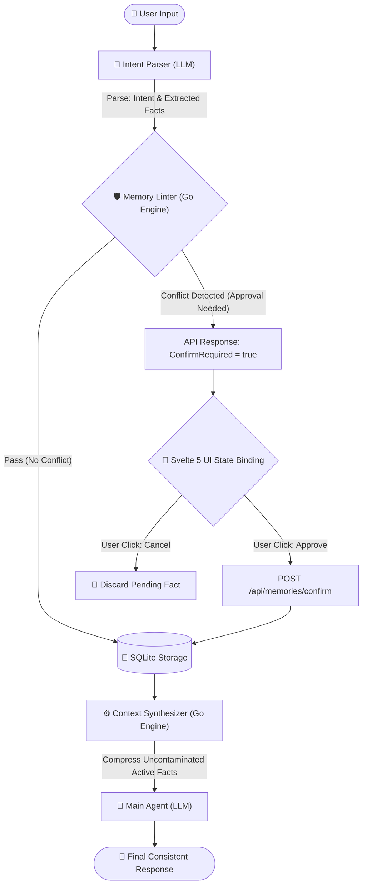
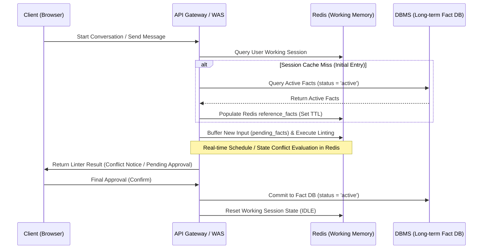

## 1. Introduction: How Agent Memory Becomes Contaminated by Hallucinations

When engineering autonomous AI agents, the very first obstacle developers encounter is: **"How can the agent consistently remember and maintain past instructions and state?"**

The simplest and most pervasive pattern is naively accumulating the entire conversational history (raw user input and assistant output text) into the LLM's context window on every turn. However, in prolonged multi-turn conversations, this approach introduces two fatal bottlenecks:

* **Contradictions in Non-Deterministic Reasoning**: When a user's past instruction contradicts a current directive (e.g., "Schedule my vacation for tomorrow" ➡️ "Schedule a meeting at 10 AM tomorrow"), the LLM cannot deterministically reconcile the conflicting assertions within its context window. It inevitably outputs contradictory hallucinations, such as *"You are on annual leave this Friday, and you have a meeting scheduled for 10:00 AM."*
* **Exponential Increases in Cost and Latency**: As conversation turns accumulate, input token volume expands linearly ($O(N)$), triggering severe API cost inflation and degrading context-processing latency.

To eliminate this fundamental bottleneck, we introduce an architectural paradigm: **MOSS (Memory Oriented Safety System)**. MOSS **isolates memory outside the non-deterministic LLM cognitive space**, governing it deterministically via relational databases and a formalized rule engine (Memory Linter).

This post explores the system design and implementation mechanics of the MOSS architecture—built with Go ADK 2.0, SQLite, and Redis—to guarantee 100% cognitive data integrity for AI agents.

---

## 2. The Solution: MOSS Architecture – Drawing Boundaries Between Non-Determinism and Determinism

The core philosophy of MOSS is: **"Isolate the LLM as a stateless synthesizer that crafts sentences from verified facts, rather than treating it as an unconstrained memory store."**

Critical decision-making and memory consistency verifications are never delegated to probabilistic LLM inference. Instead, they are deterministically governed within the boundaries of a traditional DBMS and a Go-based rule engine.

### MOSS Architecture Data Flow



1. **Intent Parser**: Parses user natural language inputs into explicit control intents (WRITE/QUERY) and parameter triplets (Facts), converting relative temporal expressions into absolute timestamps.
2. **Memory Linter**: Mathematically evaluates whether parsed facts conflict with existing active facts in long-term storage regarding physical time windows and domain rules.
3. **Stateless API & UI State Binding**: When a conflict is detected, the server does not hold open database transactions. It returns structured metadata to the client. The frontend disables freeform text input and renders explicit action buttons (`[Approve]` / `[Cancel]`), closing the loop through direct user authorization.
4. **Context Synthesizer**: Queries only validated, non-conflicting facts (`status = 'active'`) from the database, assembling an uncontaminated prompt context for final synthesis by the LLM.

---

## 3. Practical 3-Step Verification Scenario and Controlled Experiment

Here is a practical scenario demonstrating how MOSS intercepts anomalies and maintains context consistency (Baseline date: Thursday, 2026-07-16).

* **Step 1: Initial Vacation Registration (WRITE)**
  * **User Input**: `"I'm taking all day off tomorrow, Friday (7/17). Add it to my calendar."`
  * **MOSS Execution**: Successfully persists to storage under the state `Calendar - vacation - Vacation (active)`.
* **Step 2: Attempting to Book a Meeting During Vacation (Conflict Condition)**
  * **User Input**: `"Schedule a dev team meeting for Friday at 10 AM."`
  * **MOSS Execution**: The Memory Linter detects an overlapping time window with the active vacation record. It immediately returns `confirm_required: true`. The UI replaces the text input with `[Schedule Meeting During Vacation]` and `[Cancel]` buttons, requiring explicit user arbitration.
* **Step 3: Final Schedule Summary Request and Contrast (QUERY)**
  * **User Input**: `"Summarize my schedule for Friday at 10 AM."`

### Control Group (Conventional Chat-Log RAG) vs. Experimental Group (MOSS Architecture)

* **A. Pre-MOSS Baseline (Naive Conversation Log Accumulation)**
  * **Injected Payload**: Both conflicting statements from Step 1 and Step 2 are accumulated as raw text and fed to the LLM.
  * **Final Output**: ❌ `"You are on annual leave this Friday, and you have a dev team meeting scheduled for 10:00 AM."` (Impossible real-world contradiction; hallucination manifests).
* **B. Post-MOSS Architecture (Governed Memory Control)**
  * **Injected Payload**: Only the linter-verified, active fact context (`"Friday: All-day annual leave"`) and current timestamp are injected into the LLM.
  * **Final Output**: ✅ `"You have no scheduled meetings at that time because you are on annual leave."` (100% data integrity achieved).

---

## 4. Operating Logic of the Semantic Layer and Memory Linter

To achieve deterministic memory control, MOSS implements a **Semantic Layer** that translates natural language utterances into formalized ontology specifications, validated by a **Go Linter Core**.

### ① Semantic Layer Rules (Taxonomy)
The **Semantic Layer** maps unconstrained, unstructured natural language (e.g., "I'm taking off tomorrow") into structured schema definitions intelligible to programs and databases.

Its primary purpose is to establish a **formal interface contract for transforming unstructured user utterances into safe, explicit relational CRUD parameters (INSERT, SELECT, UPDATE)**.

For example, when a user states, `"I'm on annual leave all day tomorrow (7/17),"`` the semantic layer transforms it into a structured triplet and an explicit SQL `INSERT` statement:

| Taxonomy Attribute | Mapped Value | Description (Semantic Meaning) |
| :--- | :--- | :--- |
| **Domain** | `Schedule` | Routes execution to the calendar domain |
| **Subject** | `Calendar` | Designates target entity as the calendar system |
| **Predicate** | `vacation` | Identifies event type as a vacation state |
| **Object Value** | `Vacation` | Concrete payload value to be registered |
| **Time Range** | `2026-07-17 00:00:00 ~ 23:59:59` | Converts relative dates to absolute timestamps |

```sql
INSERT INTO memory (user_name, domain, subject, predicate, object_value, status, start_time, end_time)
VALUES ('yundream', 'Schedule', 'Calendar', 'vacation', 'Vacation', 'active', '2026-07-17 00:00:00', '2026-07-17 23:59:59');
```

To eliminate non-deterministic risks where LLMs manipulate schema column names or inject arbitrary keys, MOSS strictly enforces ontology boundaries:
* **`intent`**: `WRITE` (create/update), `QUERY` (read), `UNKNOWN` (general banter)
* **`domain`**: Fixed to `Schedule`
* **`subject`**: Fixed to `Calendar`
* **`predicate`**: `vacation` (value: "Vacation"), `meeting` (value: Meeting Title)

### ② Core Implementation of the Go-Based Memory Linter
Before facts parsed by the Intent Parser are committed, the database evaluates temporal overlap using the canonical interval formula (`S1 < E2 AND S2 < E1`), branching according to priority policies:

```go
// Core conflict inspection from poc/moss/backend/engine/linter.go
overlaps, err := database.FindOverlappingMemories(db, userName, *fact.StartTime, *fact.EndTime)

if fact.Predicate == "meeting" {
    // 1. If registering a meeting overlaps with an active 'vacation', require user confirmation
    hasVacationConflict := false
    for _, over := range overlaps {
        if over.Predicate == "vacation" && over.Status == "active" {
            hasVacationConflict = true
            break
        }
    }
    if hasVacationConflict {
        return LinterResult{
            Status:       "CONFIRM_REQUIRED",
            ConflictType: "VACATION_OVERLAP",
            PendingFact:  &fact,
        }, nil
    }
}

if fact.Predicate == "vacation" {
    // 2. If registering a new vacation, automatically invalidate overlapping 'meeting' events
    var overlappingIDs []int64
    for _, over := range overlaps {
        if over.Status == "active" {
            overlappingIDs = append(overlappingIDs, over.ID)
        }
    }
    if len(overlappingIDs) > 0 {
        database.InvalidateMemories(db, userName, overlappingIDs) // Invalidate prior events
    }
}
```

---

## 5. Scaling to Production: Synchronizing Redis with a Distributed Fact DB

Beyond single-process SQLite PoCs, production scale-out and low-latency throughput require distributed memory governance combining an **in-memory cache (Redis)** with an **enterprise DBMS (PostgreSQL or Graph DB)**.

### ① Redis-Based Distributed Working Memory
* **Role**: To keep web application servers stateless, conversation state (`dialog_state`), temporary parameter buffers (`pending_facts`), and active reference context (`reference_facts`) are cached in Redis with an enforced TTL (e.g., 30 minutes).
* **Benefits**: When a user initializes a session, the system performs a single read-through from long-term storage to hydrate `reference_facts` in Redis. Subsequent real-time linting evaluations execute purely in-memory, bypassing disk I/O bottlenecks.

### ② Short-Term & Long-Term Memory Synchronization Sequence



---

## 6. Roadmap for Conversation History and Memory Traceability

Just as vital as maintaining memory consistency is **Data Provenance**: tracking **when, why, and through which exact utterance a memory was created, mutated, or invalidated**.

To achieve full auditability, we introduce relational mappings linking long-term memory entities to raw conversation logs:

```text
[Conversation Log Table: chat_history]
  - chat_id (PK)
  - message (Raw Utterance Text)
  - timestamp

[MOSS Memory Table: memory]
  - id (PK)
  - domain / subject / predicate / object_value / status
  - created_by_chat_id (FK -> chat_history.chat_id) : Originating Prompt
  - invalidated_by_chat_id (FK -> chat_history.chat_id) : Invalidation Cause
```

* **Data Provenance**: When a user queries how an appointment was registered, the system traverses `created_by_chat_id` to present explicit natural language rationale: *"Registered because you stated 'I'm off tomorrow' on July 16 at 2:00 PM."*
* **Auditing and Explainability**: Proves system reliability by tracing which conflicting utterance triggered the Memory Linter to transition prior facts into an `inactive` state.

> [!NOTE]
> In this Phase 1 MOSS PoC implementation, we focus strictly on core memory linting and hybrid UI interaction verification using a streamlined `memory` table. **Detailed provenance database schemas and reverse-traceability APIs will be examined comprehensively in Phase 2.**

---

### MOSS Source Code and Hands-on Testing Environment
The complete implementation—including the core Go Memory Linter engine, the real-time Svelte 5 DB monitoring dashboard, and Docker container specifications—is publicly available in the [moss-memory-linter GitHub repository](https://github.com/joincdream/moss-memory-linter).

Clone the repository locally, configure GCP API credentials, and start Docker Compose to test deterministic memory linting and hybrid human-in-the-loop interactions firsthand:

```bash
git clone https://github.com/joincdream/moss-memory-linter.git
```

---

## 7. Conclusion: Toward a Safe and Practical Agent Architecture

As AI agents begin executing irreversible real-world business transactions (reservations, financial transfers, enterprise data mutations), zero tolerance for hallucinations becomes an absolute operational requirement.

Attempting to resolve all cognitive reasoning and state verification purely through prompt chains leads to runaway complexity and catastrophic failures. MOSS offers a pragmatic breakthrough: **isolating non-deterministic language models and governing state transitions via relational databases and deterministic rule engines**.

By pairing a flexible natural language front-end with an uncompromising, mathematically verifiable state validation backend, this hybrid governance pattern charts the most dependable path toward enterprise-grade AI agent reliability.
