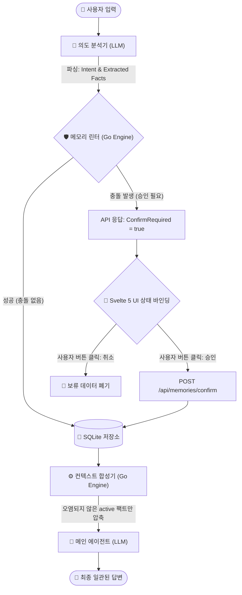
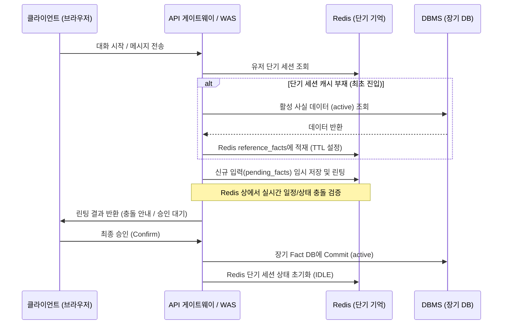

## 1. 들어가며: 에이전트의 기억이 환각(Hallucination)에 오염되는 과정

인공지능 에이전트(AI Agent)를 설계할 때 개발자들이 가장 먼저 부딪히는 벽은 **"과거의 지시나 상태를 어떻게 일관되게 기억하고 유지할 것인가"** 입니다. 

가장 단순하고 널리 쓰이는 방식은 사용자와 나눈 대화 히스토리 전체(날것의 Input/Output 텍스트)를 매번 LLM의 Context Window에 누적하여 전송하는 것입니다. 하지만 대화가 길어지는 멀티턴(Multi-turn) 환경에서 이 방식은 다음과 같은 두 가지 치명적인 병목을 유발합니다.

* **비결정적(Non-deterministic) 추론의 모순**: 사용자가 과거에 내린 지시와 현재 내리는 지시가 상충할 때(예: "내일 휴가 등록해줘" ➡️ "내일 오전 10시에 회의 잡아줘"), LLM은 컨텍스트 안에 들어있는 상반된 정보를 스스로 정렬하지 못합니다. 결국 *"금요일에는 연차 휴가이시며, 오전 10시에 미팅이 예정되어 있습니다"*와 같이 현실적으로 불가능한 모순된 답변(환각)을 내뱉게 됩니다.
* **비용과 레이턴시의 기하급수적 증가**: 대화가 누적될 때마다 입력 토큰 수가 $O(N)$으로 비례하여 증가하므로, API 호출 비용이 폭증하고 문맥을 읽어내는 속도(Latency)가 저하됩니다.

이 문제를 해결하기 위해 제시되는 설계 패러다임이 바로 **MOSS(Memory Oriented Safety System)입니다**. MOSS는 비결정론적인 LLM의 인지 영역에서 **기억(Memory)을 외부로 격리**하고, 이를 결정론적인 데이터베이스와 정형화된 규칙 엔진(Linter)을 통해 통제하는 아키텍처입니다. 

본 포스트에서는 Go ADK 2.0 및 SQLite/Redis를 결합하여 에이전트의 인지 정합성을 100% 보장하는 MOSS 아키텍처의 설계와 핵심 구현 방식을 소개합니다.

---

## 2. 해법: MOSS 아키텍처 - 비결정론과 결정론의 경계 짓기

MOSS의 핵심 철학은 **"LLM을 기억 저장소가 아닌, 주어진 팩트를 바탕으로 문장을 생성하는 단순 합성기(Synthesizer)로 격리하는 것"입니다**.

에이전트가 수행할 의사결정과 기억의 일관성 검증은 LLM의 확률적 추론에 맡기지 않고, 전통적인 DBMS와 룰 엔진(Go Engine) 영역에서 결정론적으로 통제합니다.

### MOSS 아키텍처 데이터 흐름도



1. **의도 분석기 (Intent Parser)**: 사용자의 자연어 입력에서 제어 목적(WRITE/QUERY)과 매개변수(트리플렛 형태의 Fact)를 파싱하고, 상대적 시간 표현을 절대 시간으로 변환합니다.
2. **메모리 린터 (Memory Linter)**: 파싱된 데이터가 장기 DB에 들어있는 기존 활성 데이터들과 물리적 시간대 및 규칙 면에서 상충하는지 수학적으로 검사합니다.
3. **무상태(Stateless) API 및 UI 바인딩**: 충돌 감지 시, 서버는 트랜잭션을 홀딩하지 않고 메타데이터를 클라이언트에 반환합니다. 프론트엔드는 이를 받아 텍스트 입력을 차단하고 버튼(`[승인]`/`[취소]`)을 렌더링하여 안전한 직접 상호작용으로 종결시킵니다.
4. **컨텍스트 합성기 (Context Synthesizer)**: 데이터베이스에서 검증을 마친 유효한 사실(`status = 'active'`) 정보들만 선별하여 프롬프트 컨텍스트로 조립해 LLM에 제공합니다.

---

## 3. 실전 3단계 검증 시나리오와 대조 실험

MOSS가 실제로 어떻게 오작동을 차단하고 일관된 컨텍스트를 유지하는지 보여주는 실무 검증 시나리오입니다. (기준일: 2026-07-16 목요일)

* **1단계: 최초 연차 등록 (WRITE)**
  * **사용자 입력**: `"나 내일 금요일(7/17) 하루 종일 연차 휴가야. 캘린더에 등록해줘."`
  * **MOSS 처리**: 데이터베이스에 `Calendar - vacation - Vacation (active)` 상태로 정상 저장됩니다.
* **2단계: 연차 기간 내 회의 예약 시도 (충돌 상황)**
  * **사용자 입력**: `"금요일 오전 10시에 개발팀 미팅 일정 예약해줘."`
  * **MOSS 처리**: 메모리 린터가 기존 연차 일정과의 시간대 중복을 감지합니다. 즉시 `confirm_required: true` 플래그를 반환하고, 화면에는 텍스트 입력창 대신 `[휴가 중 회의 추가 등록]`과 `[등록 취소]` 버튼이 렌더링되어 사용자의 직접적인 통제를 요구합니다.
* **3단계: 최종 일정 요약 요청 및 결과 대조 (QUERY)**
  * **사용자 입력**: `"금요일 오전 10시에 내 일정 요약해줘."`

### 대조군 (기존 대화 로그 누적 RAG) vs 실험군 (MOSS 아키텍처) 결과 비교

* **A. MOSS 적용 전 (단순 대화 로그 누적)**
  * **전달 페이로드**: 1단계와 2단계의 모순된 대화 내용이 텍스트 형태로 모두 누적되어 LLM에 전달됩니다.
  * **최종 답변**: ❌ `"금요일에는 연차 휴가이시며, 오전 10시에 개발팀 미팅이 잡혀 있습니다."` (현실적으로 불가능한 모순된 일정이 공존하여 환각 발생)
* **B. MOSS 적용 후 (MOSS 기억 제어)**
  * **전달 페이로드**: 린터에 의해 정합성이 보장된 최신의 `active` 상태 사실 컨텍스트(`"금요일 하루종일 연차 휴가"`)와 현재 시각 정보만 LLM에 주입됩니다.
  * **최종 답변**: ✅ `"해당 시간은 연차 휴가 기간이므로 예정된 회의가 없습니다."` (정보 무결성 100% 달성)

---

## 4. 시맨틱 레이어와 메모리 Linter의 작동 논리

결정론적 기억 통제를 위해, MOSS는 사용자 발화를 사전에 정의된 온톨로지 규격으로 변환하는 **시맨틱 레이어(Semantic Layer)**와 이를 검증하는 **Go Linter Core**를 두고 있습니다.

### ① 시맨틱 레이어 규칙 (Taxonomy)
**시맨틱 레이어(Semantic Layer)**는 사용자가 자유롭게 입력하는 비정형 자연어(예: "나 내일 쉴래")를 데이터베이스나 프로그램이 논리적으로 이해할 수 있도록 정형화된 규격으로 매핑해 주는 역할을 합니다.

이것의 궁극적인 목적은 **비정형 자연어 입력을 관계형 데이터베이스(RDB)의 안전하고 명확한 CRUD 쿼리(INSERT, SELECT, UPDATE 등) 매개변수로 변환하기 위한 '정형화된 인터페이스 약속'을** 수립하는 것입니다.

예를 들어 사용자가 `"나 내일(7/17) 하루 종일 연차 휴가야."`라고 발화했을 때, 시맨틱 레이어는 이를 다음과 같은 일관된 트리플렛 데이터와 물리적인 SQL `INSERT` 쿼리로 변환합니다.

| 규격 속성 | 매핑된 실제 값 | 설명 (의미) |
| :--- | :--- | :--- |
| **Domain (대분류)** | `Schedule` | 전체 도메인 중 '일정 관리' 영역으로 분기 |
| **Subject (대상)** | `Calendar` | 변경할 시스템 대상을 '캘린더'로 지정 |
| **Predicate (속성)** | `vacation` | 행위의 성격을 '휴가 상태'로 식별 |
| **Object Value (값)** | `Vacation` | 최종 등록될 상태의 실체값 |
| **Time Range (시간대)** | `2026-07-17 00:00:00 ~ 23:59:59` | 상대적인 날짜를 실제 절대 시각으로 연산 |

```sql
INSERT INTO memory (user_name, domain, subject, predicate, object_value, status, start_time, end_time)
VALUES ('yundream', 'Schedule', 'Calendar', 'vacation', 'Vacation', 'active', '2026-07-17 00:00:00', '2026-07-17 23:59:59');
```

LLM이 마음대로 컬럼명이나 상태 키값을 임의로 조작하여 DB 스키마를 오염시키는 비결정적 리스크를 차단하기 위해, MOSS는 온톨로지 범주를 다음과 같이 엄격히 제한하여 통제합니다.
* **`intent`**: `WRITE` (등록/변경), `QUERY` (조회), `UNKNOWN` (일반 잡담)
* **`domain`**: `Schedule` 고정
* **`subject`**: `Calendar` 고정
* **`predicate`**: `vacation` (휴가 시, value는 "Vacation"), `meeting` (회의 시, value는 회의 이름)

### ② Go 기반 메모리 Linter 구현 핵심
의도 분석기가 파싱한 팩트는 저장되기 전 DB 단의 겹침 공식(`S1 < E2 AND S2 < E1`)을 통해 시간대 중복 여부를 쿼리한 뒤, 우선순위 규칙에 따라 분기 처리됩니다.

```go
// poc/moss/backend/engine/linter.go 의 핵심 충돌 검사 영역
overlaps, err := database.FindOverlappingMemories(db, userName, *fact.StartTime, *fact.EndTime)

if fact.Predicate == "meeting" {
    // 1. 새 회의 등록 시 기존에 겹치는 '연차(vacation)' 일정이 있다면 확인 요구 (CONFIRM_REQUIRED)
    hasVacationConflict := false
    for _, over := range overlaps {
        if over.Predicate == "vacation" && over.Status == "active" {
            hasVacationConflict = true
            break
        }
    }
    if hasVacationConflict {
        return LinterResult{
            Status:       "CONFIRM_REQUIRED",
            ConflictType: "VACATION_OVERLAP",
            PendingFact:  &fact,
        }, nil
    }
}

if fact.Predicate == "vacation" {
    // 2. 새 연차 등록 시 기존에 겹치는 '회의(meeting)' 일정들은 자동으로 만료(inactive) 처리
    var overlappingIDs []int64
    for _, over := range overlaps {
        if over.Status == "active" {
            overlappingIDs = append(overlappingIDs, over.ID)
        }
    }
    if len(overlappingIDs) > 0 {
        database.InvalidateMemories(db, userName, overlappingIDs) // 기존 일정 만료
    }
}
```

---

## 5. 프로덕션 수준으로의 확장: Redis와 분산 Fact DB의 동기화

단일 서버 프로세스 메모리와 단일 SQLite 구조인 PoC 단계를 넘어서, 프로덕션 환경의 스케일아웃(Scale-out)과 고속 트래픽 처리를 감당하기 위해서는 **인메모리 캐시(Redis)와 엔터프라이즈 DBMS(PostgreSQL/Graph DB)가** 결합된 분산 거버넌스가 필수적입니다.

### ① Redis 기반 분산 단기 세션 관리 (Working Memory)
* **역할**: 백엔드 서버(WAS)의 무상태(Stateless)화를 위해 유저의 대화 상태(`dialog_state`), 임시 파라미터 버퍼(`pending_facts`), 참조 컨텍스트(`reference_facts`)를 Redis에 캐싱하고 TTL(예: 30분)을 설정합니다.
* **이점**: 사용자가 로그인하거나 대화를 시작할 때, 장기 DB에서 해당 범위의 사실 데이터만 딱 한 번 조회하여 Redis `reference_facts`로 사전 로드(Read-through)해 둡니다. 이후 발생하는 실시간 린팅 연산은 디스크 I/O가 없는 Redis 캐시 단에서 초고속으로 완료됩니다.

### ② 장·단기 기억 동기화 시퀀스



---

## 6. 대화 이력-기억 추적성(Traceability) 설계 로드맵

기억의 일관성을 관리하는 것만큼 중요한 것은 **"해당 기억이 언제, 어떤 대화를 통해 생성되고 소멸했는가"를** 역추적(Traceback)할 수 있는 **데이터 출처(Provenance) 관리**입니다. 

이를 위해 장기 기억 테이블과 날것의 대화 로그 테이블 간의 유기적 매핑 설계를 도입합니다.

```text
[대화 로그 테이블: chat_history]
  - chat_id (PK)
  - message (날것의 대화 내용)
  - timestamp

[MOSS 기억 테이블: memory]
  - id (PK)
  - domain / subject / predicate / object_value / status
  - created_by_chat_id (FK -> chat_history.chat_id) : 생성 출처
  - invalidated_by_chat_id (FK -> chat_history.chat_id) : 만료 원인
```

* **출처 확인 (Data Provenance)**: 사용자가 특정 일정의 등록 경위를 물어볼 때, `created_by_chat_id`를 추적하여 *"7월 16일 오후 2시에 '내일 휴가야'라고 말씀하셔서 등록되었습니다"*와 같이 정확한 자연어 대화 근거를 역으로 조립해 제시할 수 있습니다.
* **이력 감사 (Auditing) 및 설명 가능성**: 어떤 상충 발화가 메모리 Linter를 트리거하여 기존 데이터를 만료(`inactive`)시켰는지 로그를 추적하여 시스템의 동작 신뢰성을 증명합니다.

> [!NOTE]
> 본 MOSS PoC 1차 구현 단계에서는 핵심 메모리 린터 제어 및 하이브리드 상호작용 검증에 집중하기 위해 대화 로그 연동을 생략한 단일 `memory` 테이블만 사용하며, **상세한 추적성 데이터베이스 설계 및 역추적 API 연동은 2차 고도화(Post) 단계에서 상세히 다룰 예정입니다.**

---

### MOSS 전체 소스코드 및 실무 테스트 환경 제공
본 포스트에서 다룬 메모리 Linter 코어 엔진, Svelte 5 기반의 실시간 DB 모니터링 대시보드, 그리고 컨테이너 빌드 사양을 포함한 전체 구현 코드는 [moss-memory-linter GitHub 저장소](https://github.com/joincdream/moss-memory-linter)에 전체 공개되어 있습니다.

이 저장소를 로컬 환경에 클론하여 간단한 GCP API 인증 설정을 마친 후 도커 컴포즈를 기동하면, 결정론적 메모리 Linter와 하이브리드 상호작용 데모를 직접 로컬에서 실행하고 검증해 볼 수 있습니다.

```bash
git clone https://github.com/joincdream/moss-memory-linter.git
```

---

## 7. 마칩니다: 안전하고 실용적인 에이전트 아키텍처를 향해

인공지능 에이전트가 현실 세계의 비즈니스 트랜잭션(예약, 금융 이체, 사내 데이터 변경 등)을 다루기 시작하면, LLM의 1%의 실수나 환각도 허용할 수 없는 임계점을 맞이하게 됩니다.

많은 엔지니어들이 모든 인지와 판단 흐름을 인공지능 프롬프트 체인으로 해결하려다 복잡성 폭증과 오작동의 벽에 가로막힙니다. MOSS는 이에 대한 현실적인 돌파구로서, **비결정론적인 언어 모델의 결정 경로를 분리하고, 전통적인 관계형 데이터베이스와 코드 기반 룰 엔진을 결합하여 경계를 긋는 것**이 얼마나 강력하고 비용 효율적인지를 보여줍니다.

앞단은 유연하게 언어를 해석하고, 뒷단은 수학적이고 안정적으로 상태를 검증하는 이 하이브리드 통제 모델이야말로 현실적인 비즈니스 수준으로 에이전트의 신뢰도를 끌어올리는 가장 확실한 지름길입니다.
