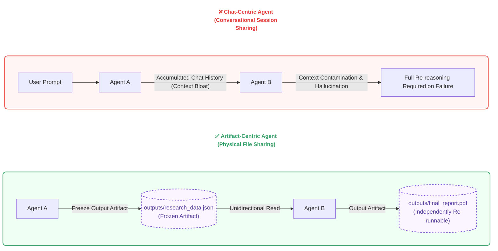
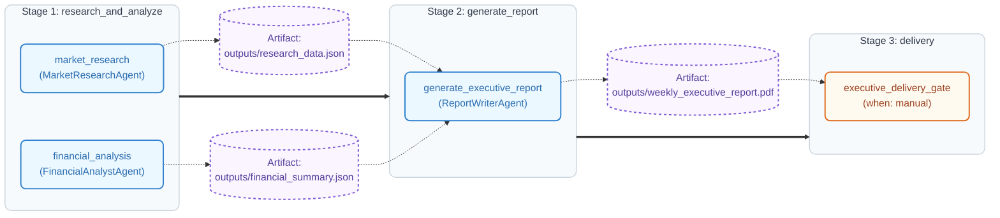
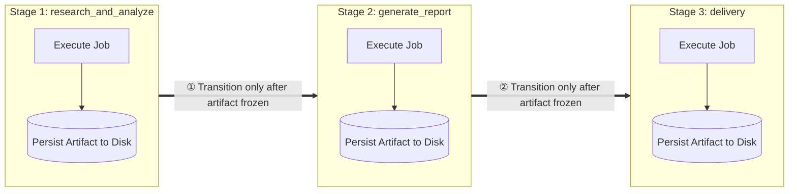
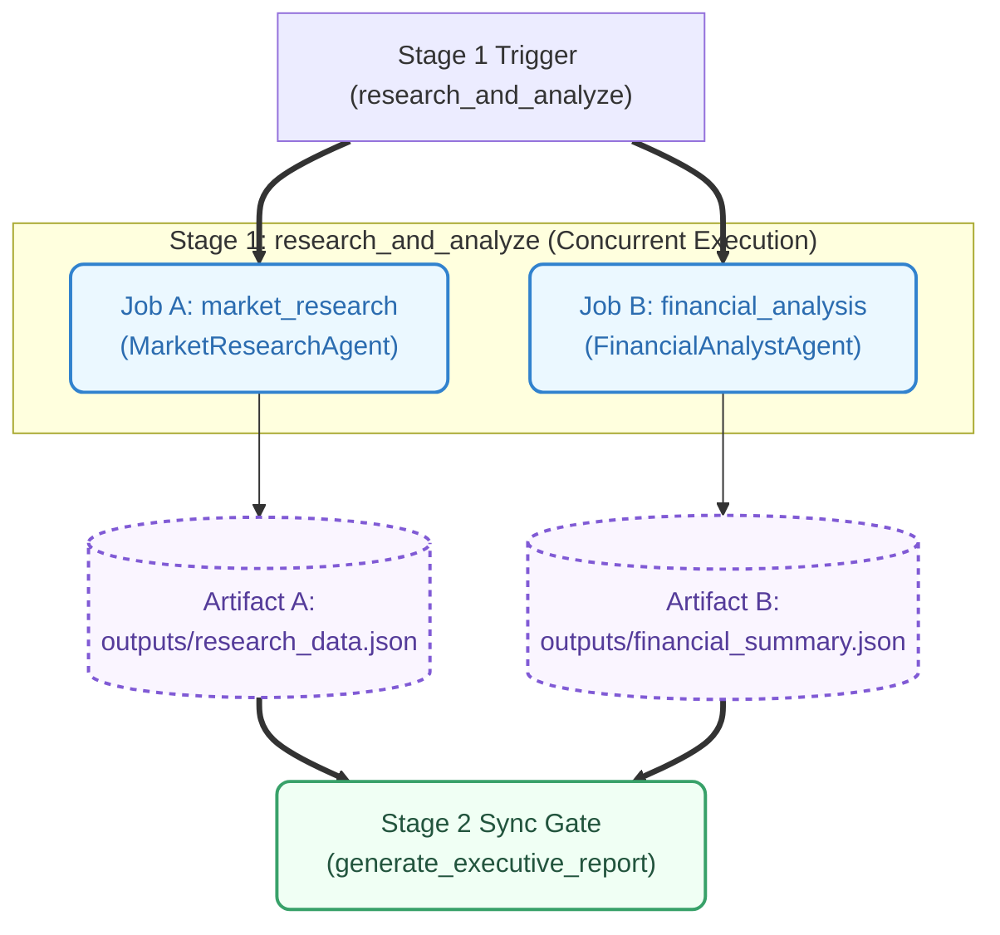
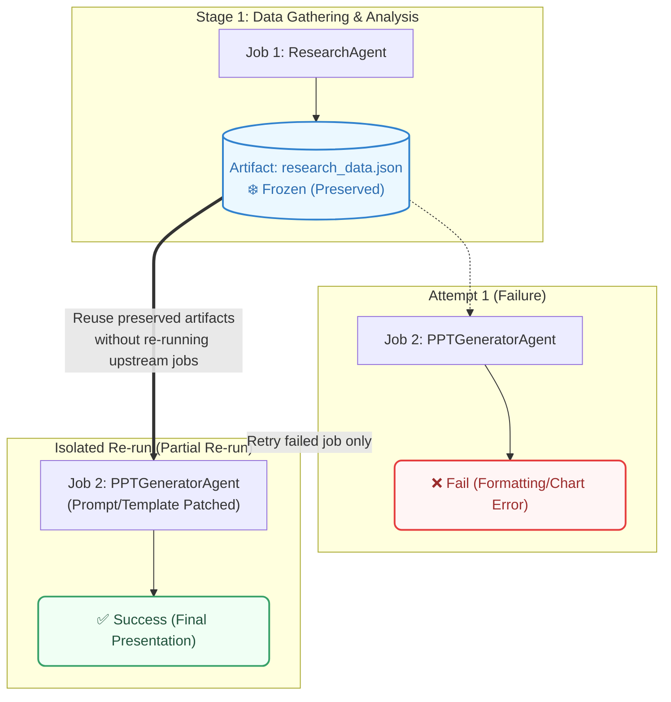
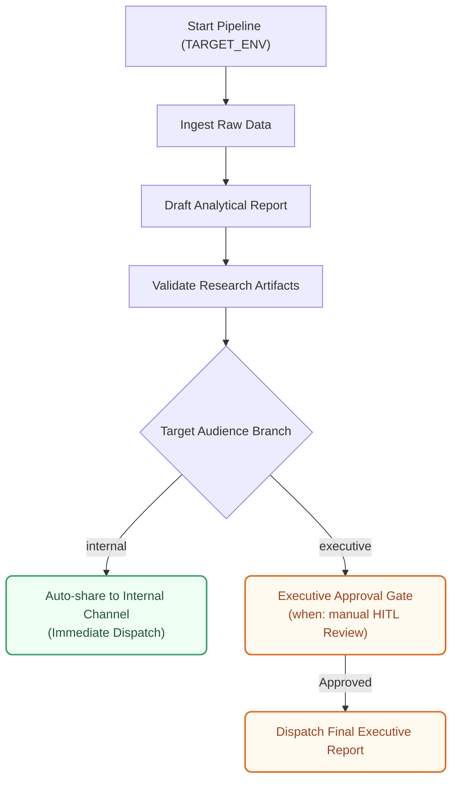

## 1. Introduction: Governing AI Agents Like CI/CD Deployment Pipelines

The initial euphoria surrounding "fully autonomous AI agents"—the dream that AI would magically solve multi-step problems end-to-end without supervision—is rapidly evaporating. Unconstrained conversational agents (chat-centric agents) suffer from compounding context bloat and cascading hallucinations, exposing severe limitations in production enterprise environments.

As highlighted in Anthropic's "Building Effective Agents" report and recent research in Flow Engineering, black-box autonomous agents that delegate all reasoning and control flow to an LLM suffer from compounding errors across multi-step trajectories, causing teams to lose deterministic control. Consequently, frontier engineering communities are pivoting away from blind faith in unguided LLM reasoning, steering instead toward declarative specifications and state machines (DAGs) to govern execution paths explicitly.

Ultimately, engineers are returning to first principles of software engineering. Instead of treating agents as unconstrained conversational actors, the **Artifact-Centric architecture—governed by declarative specifications and inspired by battle-tested GitLab CI/CD pipeline philosophies**—has emerged as the definitive solution.

---

## 1.1 Chat-Centric vs. Artifact-Centric: The Paradigm Shift

How an agentic system persists state and exchanges data between agents fundamentally dictates system resilience, observability, and total cost of ownership.



### ① Limitations of the Chat-Centric Paradigm: Memory Collapse and Context Contamination
Traditional chat-centric agents accumulate intermediate reasoning steps, raw tool outputs, and debugging error traces within a single continuous context window. As the execution pipeline progresses, prompt size swells dramatically, triggering **context bloat** that exponentially inflates token costs and inference latency. Even worse, intermediate errors, tool failures, and transient debugging chatter linger across the conversation session, inducing **context contamination** that degrades the reasoning accuracy of subsequent agents. When an error occurs at a downstream step, developers cannot simply patch that specific node; the entire conversation history must be re-ingested and re-reasoned from scratch, severely impairing production predictability.

### ② Principles of the Artifact-Centric Paradigm: State Externalization and Physical Isolation
In contrast, the Artifact-Centric architecture adopts a state externalization pattern that completely decouples agents from shared conversational histories. Agents never converse directly; instead, they communicate unidirectionally by reading **validated, persistent physical artifacts (JSON, CSV, PDF, Markdown) written to the file system** by upstream jobs. By utilizing the file system or object store as an architectural blackboard, each agent operates with a cleanly scoped, single input-output boundary, executing pure deterministic logic free from context leakage or conversational contamination.

| Comparison Vector | Chat-Centric Agent | Artifact-Centric Agent |
| :--- | :--- | :--- |
| **State Storage** | LLM Context Window (Conversational Text) | External File System (Blackboard Architecture) |
| **Agent Input** | Cumulative chat transcript | Unidirectional read of designated upstream artifacts only |
| **Error Blast Radius** | Transient error logs pollute entire session | Failed job artifact discarded; only that job re-runs |
| **Determinism & Reproducibility** | Non-deterministic (varies with conversation drift) | Deterministic (identical artifact inputs yield reproducible runs) |

---

## 2. Why GitLab CI/CD Philosophy? (Architectural Fit and Mapping)

Over decades, software engineering has perfected **CI/CD (Continuous Integration / Continuous Delivery)** pipelines to govern non-deterministic builds and complex multi-stage deployment lifecycles. GitLab CI/CD in particular is built upon three foundational pillars: **isolated job execution**, **declarative dependency governance**, and **strict state isolation where stages communicate solely through physical artifacts**.

Remarkably, these foundational CI/CD principles provide direct answers to the exact challenges plaguing agentic AI today: hallucinations, context drift, and uncontrollable state. By treating an agent as an **isolated execution node (Job)**, replacing unstructured conversation with **verified physical artifacts**, and locking the workflow into a **declarative specification**, black-box AI agents are transformed into observable, governable engineering systems.

### 2.1 1:1 Mapping System Between GitLab CI/CD and Agentic AI

The six core mechanisms comprising GitLab CI/CD map directly to agentic governance patterns:

| GitLab CI/CD Concept | Agentic AI Mapping Philosophy | Description |
| :--- | :--- | :--- |
| **Pipeline** | **Agentic Workflow** | End-to-end execution flow fulfilling a business objective (research, analysis, report, submission). |
| **YAML Spec** | **Declarative Agent Spec** | Structural definition of workflows via declarative YAML (`.gitlab-ci.yml` style) using `needs` dependency management. |
| **Job** | **Agent Task Node** | An isolated execution unit where a single agent operates with a dedicated prompt, tools, and model. |
| **Artifacts** | **Task State Storage** | Persistent storage capturing inputs, prompts, reports, and generated documents emitted during job execution. |
| **Manual Action** | **Human-in-the-Loop (HITL)** | Gateways (`when: manual`) that halt execution until explicit human validation and authorization are granted. |
| **Rules / Conditions** | **Guardrails / Validators** | Preconditions enforcing that an upstream artifact must clear validation linters before downstream jobs trigger. |

### 2.2 Relationship to Modern Orchestration Tools like n8n

This Artifact-Centric paradigm shares deep philosophical roots with modern node-based workflow orchestration engines like **n8n** and **Temporal**. Platforms like n8n also discard conversational sessions, treating structured JSON payloads emitted by each node as discrete artifacts passed across a directed acyclic graph (DAG).

However, while n8n emphasizes visual, GUI-centric enterprise integration (iPaaS) and low-code workflows, the GitLab CI/CD pipeline approach offers **GitOps-native declarative version control** and **rigorous file-system-level artifact immutability**. For complex production engineering environments, it gives developers total code-level control to manage, test, and audit agentic pipelines through standard CI/CD tooling.

---

## 3. Declarative YAML-Based Agentic Pipeline Definition (Business Workflow Example)

Rather than hardcoding pipeline logic in Python scripts, workflows are codified via declarative specifications that govern job sequencing and parallel execution. Below is a sample pipeline for **market research data analysis and executive report generation**:

```yaml
# .gitlab-agent-ci.yml (Summary)
stages: [ research_and_analyze, generate_report, delivery ]

market_research:
  stage: research_and_analyze
  artifacts: { paths: [ outputs/research_data.json ] }

generate_executive_report:
  stage: generate_report
  needs: [ market_research, financial_analysis ]    # Explicit artifact dependencies (DAG)
  artifacts: { paths: [ outputs/weekly_executive_report.pdf ] }

executive_delivery_gate:
  stage: delivery
  rules:
    - if: '$SUBMIT_TARGET == "executive"'
      when: manual                                   # HITL manual authorization gate
```

Under this architecture, the `needs` declaration guarantees that `generate_executive_report` will only trigger once `research_data.json` and `financial_summary.json` exist as **immutable, verified artifacts** on disk.

---

## 3.1 Pipeline Visualization (GitLab CI/CD Pipeline Diagram)

Mapping the declarative YAML structure above illustrates how parallel jobs execute across stages and how artifact dependencies flow:



---

## 3.2 Five Core Control Mechanisms of Artifact-Centric Workflows

By porting GitLab CI/CD governance principles, we establish five architectural mechanisms that transform AI agents into deterministic orchestration engines:

### ① Sequential Stage Execution
Stages synchronize strictly in accordance with top-level `stages` declarations: `research_and_analyze` ➔ `generate_report` ➔ `delivery`. This ensures that raw research data is finalized before synthesis begins. Because transitions require upstream artifacts to be persistently frozen on disk, raw data gathering is structurally decoupled from report drafting, neutralizing compounding hallucinations caused by conversational bloat.



### ② Parallel Job Execution
Independent jobs within the same stage run concurrently via the pipeline runner. For instance, an input specification can simultaneously undergo legal review, financial impact modeling, and multi-language translation; alternatively, multiple specialized agents can crawl news, academic papers, and market data in parallel. This eliminates sequential LLM latency and dramatically boosts end-to-end throughput.



### ③ DAG-Based Dependency Management (Directed Acyclic Graph & `needs`)
Transcending simple linear stage progression, the `needs` directive defines granular DAG relationships based on exact artifact dependencies. Downstream jobs whose inputs are ready can execute immediately without waiting for sibling jobs in the preceding stage to finish, anchoring agent collaboration in explicit data contracts.

### ④ Isolated Execution and Partial Re-runs (Partial Re-run & Retry)
If a rendering node encounters a formatting or charting failure, verified upstream artifacts (`research_data.json`, `financial_summary.json`) remain safely preserved as read-only (frozen) assets. Engineers can patch the failing node's prompt or template and trigger a **partial re-run** for that isolated job alone. By reusing validated upstream computations, teams conserve expensive LLM tokens and eliminate unnecessary retry latency.



### ⑤ Dynamic Workflow Branching by Environment & Conditions
Pipelines branch dynamically based on runtime environment variables (`SUBMIT_TARGET`) or validation rules (`rules`). Routine internal team reports publish automatically upon completion, whereas executive briefings or high-budget initiatives dynamically activate manual authorization gates (`when: manual`) and legal compliance checks.

```yaml
# Internal environment: auto-published / Executive environment: HITL manual approval required
executive_delivery_gate:
  stage: delivery
  rules:
    - if: '$SUBMIT_TARGET == "executive"'   # Activates manual gate for executive submissions
      when: manual
    - if: '$SUBMIT_TARGET == "internal"'    # Internal shares proceed automatically without approval
      when: always
```



---

## 4. Engineering Utility of Job-Level Isolated Execution and "Partial Re-runs"

In production engineering, the paramount advantage of an Artifact-Centric architecture is **minimizing the blast radius of failures**.

In a conventional chat-centric architecture, if a chart rendering error occurs during final report generation at Stage 3, the entire conversational context is corrupted. The developer must re-inject the raw data from Stage 1 and re-run Stage 2 analysis inside the LLM context window from the very beginning. This not only wastes significant token budgets but also introduces compounding risks of new hallucinations on every retry.

Under the GitLab CI/CD model, however, Stage 3 failures leave successful Stage 1 and Stage 2 outputs (`research_data.json`, `financial_summary.json`) intact on disk as immutable, frozen artifacts. Engineers simply adjust the prompt or template for the failing Stage 3 node and trigger an **isolated partial re-run**. Powered by validated immutable inputs, the job re-runs deterministically with minimal token overhead and zero upstream risk.

---

## 5. Structured Artifacts and Observability

During execution, the pipeline runner captures full runtime context into a **structured JSON metadata artifact** alongside the primary deliverables:

### Sample Execution History JSON Artifact Schema
```json
{
  "pipeline_id": "biz_pipeline_20260725_01",
  "job_name": "market_analysis_and_report",
  "status": "success",
  "started_at": "2026-07-25T08:20:05Z",
  "finished_at": "2026-07-25T08:20:18Z",
  "inputs": {
    "inputs/raw_market_data.csv": {
      "sha256": "8f4e2c91a0b3...",
      "size_bytes": 452000
    }
  },
  "runtime_config": {
    "model": "gemini-3.5-pro",
    "temperature": 0.2
  },
  "execution_context": {
    "resolved_prompt": "Extract primary keywords from raw market data and compile an executive summary report.",
    "tool_calls": [
      {
        "tool_name": "MarketDataAnalyzer",
        "arguments": { "input_file": "inputs/raw_market_data.csv", "top_k": 5 },
        "result": { "analyzed_rows": 1250, "status": "completed" }
      }
    ]
  },
  "outputs": {
    "outputs/weekly_executive_report.pdf": {
      "sha256": "9a3b7c1d4e2f...",
      "size_bytes": 1280000
    }
  }
}
```

Persisting structured execution metadata bestows complete **visibility and observability** upon the agent's internal operations.

Engineers can track per-node token consumption, tool invocation success rates, and execution latencies in real time. Furthermore, if anomalies arise, developers can inspect artifact SHA256 hashes and resolved prompt templates to **replay and fix non-deterministic executions under identical conditions**.

---

## 6. Combining Manual Actions with Guardrails

Just as GitLab CI/CD employs manual approval gates (`when: manual`) prior to production deployment, agentic pipelines incorporate explicit, deterministic human-in-the-loop (HITL) checkpoints between sensitive execution nodes.


Once the analytical report artifact is generated, the pipeline runner runs automated fact-checking linters and transitions the pipeline into a `SUSPENDED` state, temporarily holding downstream transactions.

The designated reviewer inspects the triad of artifacts visible in the console—**[1. Raw Research Input + 2. Data Validation Report + 3. Final PDF Deliverable]**—and clicks "Play" (Approve) to manually trigger the external distribution stage. This eliminates hallucination risks associated with conversational prompt tweaking, ensuring that only verified, immutable artifacts are promoted to production.

---

## 7. Conclusion: Why Artifact-Centric?

The ultimate purpose of an AI agent is to solve real-world problems. In enterprise environments, work is delivered not through open-ended verbal chatter, but through **versioned, milestone-based deliverables (Jira tickets, Confluence specs, formal reports, code repositories)**. Reverting from the illusion of full autonomy back to disciplined workflow orchestration restores the three cardinal virtues of agent architecture: **Simplicity**, **Transparency**, and **Specialization**.

Decomposing complex business challenges into discrete, well-defined jobs, persisting intermediate state into physical artifacts, and equipping each node with purpose-built prompts and tools represents the cleanest, most resilient software engineering pattern for transforming non-deterministic AI reasoning into production-grade systems.
