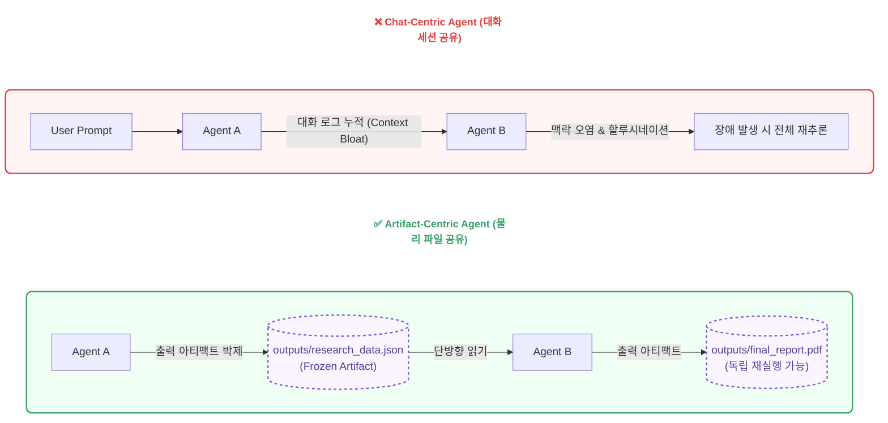
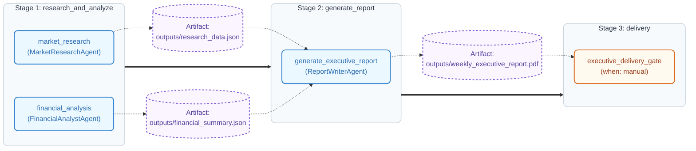
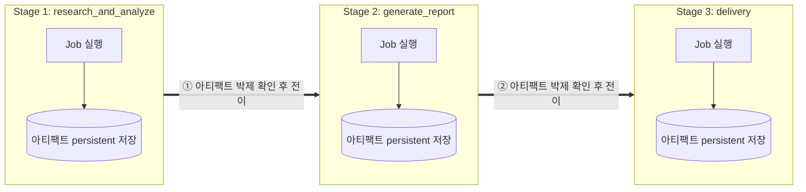
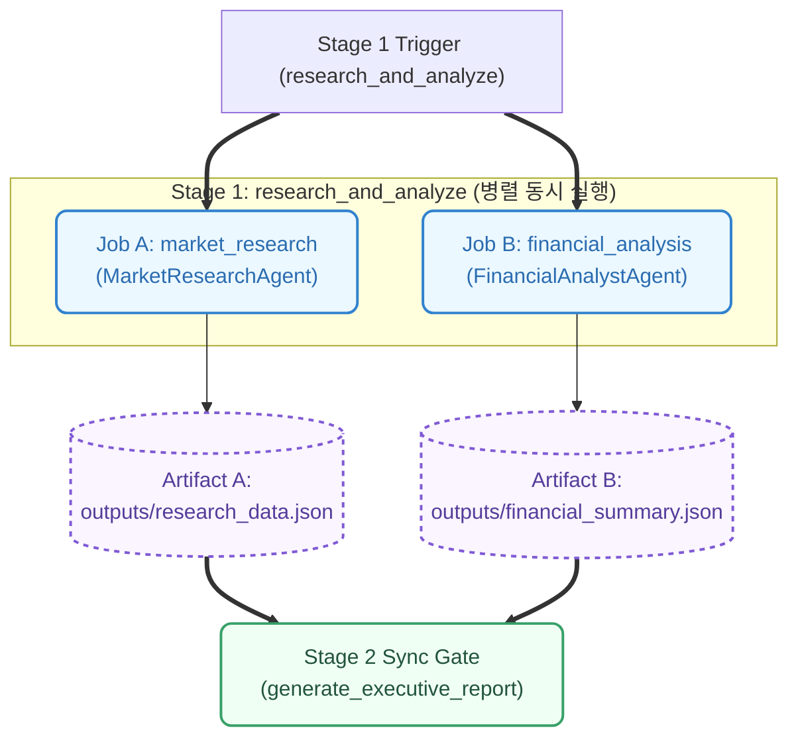
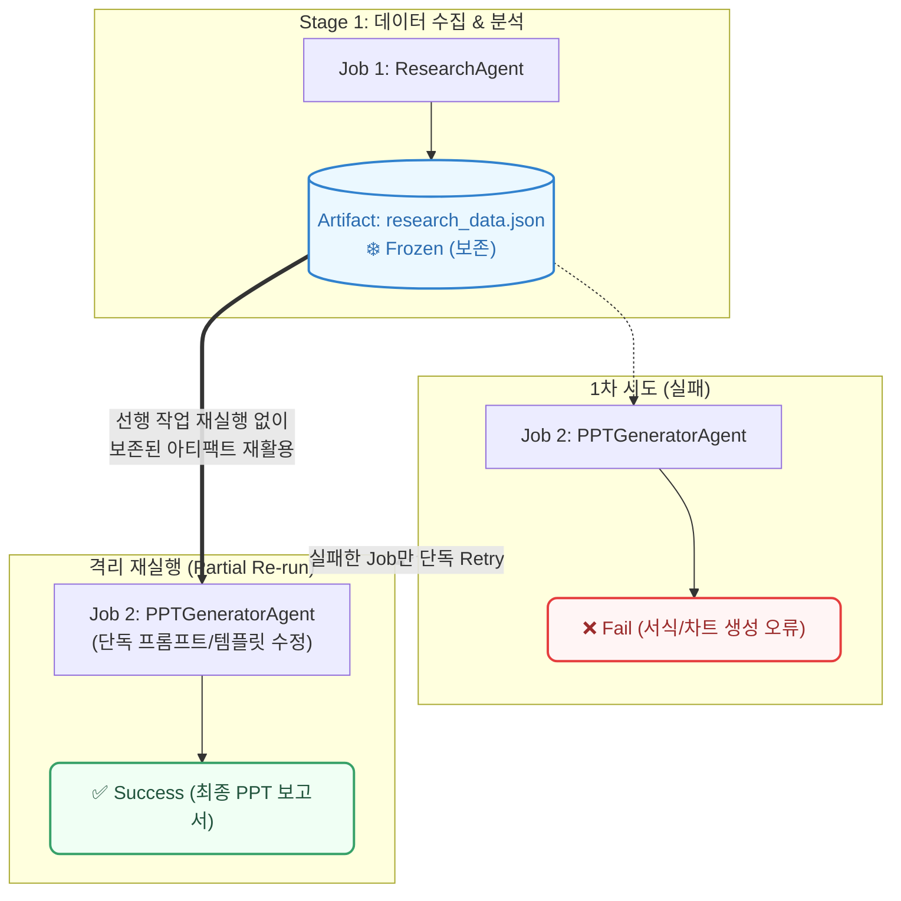
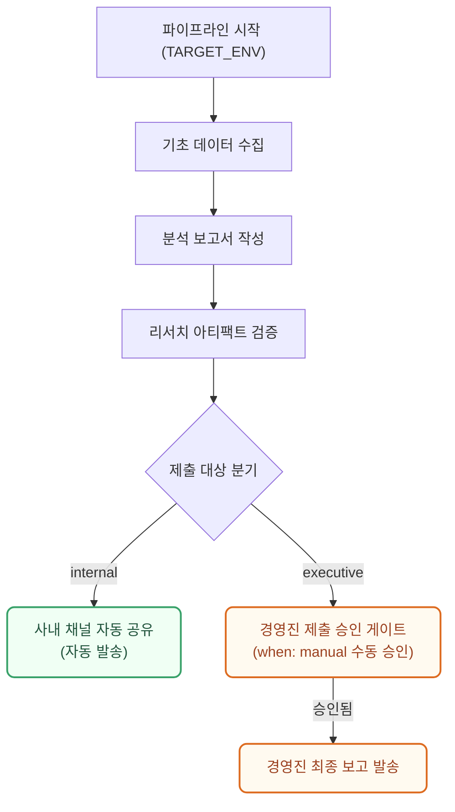

## 1. 들어가며: AI 에이전트를 CI/CD 배포 파이프라인처럼 제어하기

생성형 AI 초기, 모든 문제를 알아서 풀어줄 것 같던 '완전 자율 AI 에이전트'에 대한 거품과 환상이 걷히고 있습니다. 통제되지 않는 대화형 에이전트(Chat-Centric Agent)는 맥락 과부하(Context Bloat)와 환각(Hallucination)을 연쇄 유발하며 프로덕션 상용화의 한계를 드러냈습니다.

Anthropic의 'Building Effective Agents' 보고서와 최신 Flow Engineering 연구에서도 지적하듯, LLM에게 모든 판단을 위임하는 블랙박스형 자율 에이전트는 단계가 누적될수록 복리 에러(Compounding Errors)가 급증하여 시스템 제어력을 상실합니다. 이에 따라 최신 AI 엔지니어링 기술 커뮤니티에서는 LLM의 자율 추론을 맹신하는 대신, 개발자가 명시적인 선언적 명세와 상태 머신(DAG)으로 실행 경로를 통제하는 방향으로 패러다임 전환을 이끌고 있습니다.

결국 엔지니어들은 소프트웨어 본연의 핵심 원칙으로 되돌아가고 있습니다. 에이전트를 자유로운 추론 객체로 방치하는 대신, **선언적(Declarative) 명세로 통제하고 검증된 GitLab CI/CD 파이프라인 사상을 이식하는 Artifact-Centric 아키텍처**가 그 확실한 대안으로 부상하고 있습니다.

---

## 1.1 Chat-Centric vs Artifact-Centric: 패러다임의 전환

AI 에이전트 시스템을 구축할 때 상태(State)를 어디에 보관하고 에이전트 간에 어떻게 전달하느냐에 따라 시스템의 안정성과 운영 비용 구조가 완전히 달라집니다.



### ① Chat-Centric 패러다임의 한계: 대화 메모리 붕괴와 상태 오염
기존의 대화형 에이전트는 이전 수행 과정의 모든 진행 상황과 디버깅 에러 로그를 하나의 연속된 컨텍스트 윈도우(Context Window)에 텍스트로 누적하는 방식을 취합니다. 이러한 구조는 파이프라인의 단계가 거듭될수록 대화 텍스트가 비대해져 추론 비용과 지연 시간을 지수함수적으로 증가시키는 **맥락 과부하(Context Bloat)** 문제를 야기합니다. 더 심각한 점은 중간 과정에서 발생한 시도 실패나 디버깅 잔재가 전체 대화 세션에 남아 이후 에이전트 판단까지 잇따라 오염시키는 **맥락 오염(Context Contamination)** 현상입니다. 결국 특정 단계의 작업만 수정하고 싶어도 대화 맥락 전체를 다시 읽고 처음부터 재추론해야 하므로, 프로덕션 환경에서의 제어력을 크게 저하시킵니다.

### ② Artifact-Centric 패러다임의 원리: 상태의 외부화와 물리적 격리
이에 대한 대안인 Artifact-Centric 아키텍처는 에이전트 상호 간의 대화 히스토리 공유를 완전히 끊어내는 상태 외부화(State Externalization) 패턴을 채택합니다. 에이전트들은 서로 직접 대화하지 않고, 오직 이전 단계에서 **검증을 거쳐 파일 시스템에 persistent하게 저장된 물리적 아티팩트(JSON, CSV, PDF 등)**만을 단방향으로 읽어 들어옵니다. 대화 메모리 대신 파일 시스템이나 객체 저장소를 블랙보드(Blackboard)로 활용함으로써, 개별 에이전트는 자신에게 할당된 명확한 단일 입출력에만 집중하여 상태 오염이나 맥락 누수 없는 순수한 결정을 내릴 수 있게 됩니다.

| 비교 항목 | Chat-Centric Agent | Artifact-Centric Agent |
| :--- | :--- | :--- |
| **상태(State) 저장소** | LLM Context Window (대화 텍스트) | 외부 물리 파일 시스템 (Blackboard Architecture) |
| **에이전트 입력** | 누적된 전체 대화 히스토리 | 이전 Stage의 지정된 Artifact 파일만 단방향 읽기 |
| **에러 격리 범위** | 실패한 에러 로그가 대화 전체를 오염 | 실패한 Job의 아티팩트만 파기 후 해당 Job만 단독 재실행 |
| **결정론 및 재현성** | 비결정론적 (대화 세션 맥락에 따라 응답 변동) | 결정론적 (동일 Artifact 입력 시 언제나 재현 가능) |

---

## 2. 왜 GitLab CI/CD 파이프라인 사상인가? (아키텍처 적합성과 매핑)

소프트웨어 공학은 지난 수십 년간 개발자들의 비결정적인 코드 실행과 복잡한 빌드 환경을 통제하기 위해 **CI/CD(지속적 통합/배포) 파이프라인** 기술을 고도화해 왔습니다. 특히 GitLab CI/CD는 **"독립 격리된 Job 단위 실행"**, **"선언적 명세 기반 의존성 제어"**, 그리고 **"Job 간 상태를 파일 시스템(Artifacts)으로만 전이하는 엄격한 상태 격리"**라는 세 가지 핵심 철학 위에 구축되어 있습니다.

이러한 CI/CD 아키텍처의 정통적 철학은 놀랍게도 현재 AI 에이전트가 겪고 있는 환각, 맥락 오염, 제어 불능의 챌린지를 해결하는 최선의 답안을 제공합니다. 에이전트를 파이프라인 내부의 **독립된 실행 노드(Job)**로 바라보고, 에이전트 간 소통을 불확실한 대화 세션 대신 **검증된 물리 아티팩트**로 교환하며, 워크플로우를 **선언적 명세**로 고정하는 순간, 블랙박스 같던 AI 에이전트는 비로소 모니터링 가능하고 제어 가능한 엔지니어링 시스템으로 재탄생합니다.

### 2.1 GitLab CI/CD와 Agentic AI의 1:1 매핑 체계

GitLab CI/CD 파이프라인을 구성하는 핵심 6가지 메커니즘은 AI 에이전트 통제 아키텍처와 다음과 같이 1:1로 정확히 대응합니다.

| GitLab CI/CD 개념 | Agentic AI 매핑 사상 | 설명 |
| :--- | :--- | :--- |
| **Pipeline** | **Agentic Workflow** | 비즈니스 목적(리서치, 보고서 작성, 검증, 제출)을 완수하는 에이전트 실행 흐름 |
| **YAML Spec** | **Declarative Agent Spec** | 워크플로우를 코드가 아닌 `.gitlab-ci.yml` 스타일의 선언형 명세로 구조 정의 (`needs` 제어) |
| **Job** | **Agent Task Node** | 단일 에이전트가 단일 목적(Prompt, Tool, Model)을 위해 독립 격리 실행되는 단위 |
| **Artifacts** | **Task State Storage** | Job 실행 중 생성된 모든 입력, 프롬프트, 리포트, 생성 문서를 패키징한 저장소 |
| **Manual Action** | **Human-in-the-Loop (HITL)** | `when: manual`과 같이 인간의 수동 승인/검증이 완료되기 전까지 최종 제출을 차단하는 게이트 |
| **Rules / Conditions** | **Guardrails / Validators** | 이전 Job의 결과물이 검증 린터를 통과해야만 다음 Job을 트리거하는 실행 제약 조건 |

### 2.2 n8n 등 현대적 오케스트레이션 도구와의 연관성

이러한 Artifact-Centric 패러다임은 최근 주목받는 **n8n**이나 **Temporal**과 같은 노드 기반 워크플로우 오케스트레이션 플랫폼과도 깊은 사상적 궤를 같이합니다. n8n 역시 대화 세션에 의존하지 않고 각 노드가 생성한 JSON 데이터 페이로드를 아티팩트 삼아 단방향 DAG(Directed Acyclic Graph)로 상태를 전달합니다. 

다만 n8n이 시각적 GUI 중심의 서비스 통합(iPaaS) 및 노코드 오케스트레이션에 특화되어 있다면, 본 포스트에서 다루는 GitLab CI/CD 파이프라인 방식은 버전 제어가 가능한 **코드형 선언(GitOps)**과 **물리 파일 시스템 레벨의 엄격한 아티팩트 보존**을 제공한다는 차이가 있습니다. 즉, 복잡한 프로덕션 엔지니어링 환경에서 에이전트 파이프라인 전체를 코드로서 관리하고 검증(CI/CD)할 수 있는 최적의 개발자 제어권을 부여합니다.

---

## 3. 선언적 YAML 기반 Agentic Pipeline 정의 (비즈니스 워크플로우 사례)

파이프라인의 구조를 하드코딩하지 않고, 선언적(Declarative)인 명세 표준으로 정의하여 에이전트 간의 선후 관계와 직/병렬 실행을 제어합니다. 아래는 **시장 조사 데이터 분석 및 경영진 보고서 생성 파이프라인** 예시입니다.

```yaml
# .gitlab-agent-ci.yml (핵심 요약)
stages: [ research_and_analyze, generate_report, delivery ]

market_research:
  stage: research_and_analyze
  artifacts: { paths: [ outputs/research_data.json ] }

generate_executive_report:
  stage: generate_report
  needs: [ market_research, financial_analysis ]    # 아티팩트 선후 관계(DAG) 명시
  artifacts: { paths: [ outputs/weekly_executive_report.pdf ] }

executive_delivery_gate:
  stage: delivery
  rules:
    - if: '$SUBMIT_TARGET == "executive"'
      when: manual                                   # HITL 수동 승인 게이트
```

이 구조에서는 `needs` 명세를 통해 `generate_executive_report` Job이 실행되기 전에 `research_data.json`과 `financial_summary.json`이라는 **독립된 Artifact**가 안전하게 디스크에 생성 및 확정되어 있을 것임을 보장합니다.

---

## 3.1 파이프라인 시각화 (GitLab CI/CD Pipeline Diagram)

위 선언적 YAML 구조를 기반으로 1단계부터 3단계까지 Stage별 병렬 Job 실행과 Artifact의 의존성 흐름을 시각화하면 다음과 같습니다.



---

## 3.2 Artifact-Centric 워크플로우 5대 제어 메커니즘

GitLab CI/CD 파이프라인 제어 사상을 이식하여 AI 에이전트를 완벽히 통제 가능한 결정론적 오케스트레이션 엔진으로 정립하는 5가지 핵심 제어 구조입니다.

### ① 순차적 단계 진행 (Sequential Stage Execution)
파이프라인 최상위 `stages` 명시에 따라 `research_and_analyze` ➔ `generate_report` ➔ `delivery` 순으로 상태가 정밀하게 동기화(Sync)되어 진행됩니다. 이는 기초 수집 데이터가 분석 보고서로 승계되고 최종 발표 자료로 정제되는 단계별 업무 의존성을 안전하게 보장합니다. 선행 단계의 아티팩트가 파일 시스템에 persistent하게 확정된 후에만 다음 단계로 전이되므로, 원본 리서치와 요약 보고서 작성을 상호 격리하여 대화 히스토리 누적으로 인한 환각(Hallucination) 연쇄 오염을 사전에 차단합니다.



### ② Job의 병렬 실행 (Parallel Job Execution)
동일한 `stage` 내에서 상호 의존성이 없는 노드들은 파이프라인 러너에 의해 동시에 병렬(Concurrent) 실행됩니다. 예컨대 하나의 기획안 원문에 대해 법무 검토, 재무 영향 분석, 다국어 번역을 동시 수행하거나, 동일 주제에 대한 뉴스·논문·시장 동향을 이종 에이전트가 동시 수집하는 방식입니다. 이를 통해 LLM의 순차 대기 시간(Latency)을 획기적으로 줄이고 시스템 전체의 업무 처리 속도를 최적화합니다.



### ③ DAG 기반 선후 관계 제어 (Directed Acyclic Graph & `needs`)
Stage 순서라는 단순 선형 제어를 넘어, `needs` 명세를 통해 특정 Job이 필요로 하는 입력 아티팩트를 기준으로 정밀한 유하향 비순환 그래프(DAG) 관계를 정의합니다. 이를 통해 선행 조건이 충족된 Job은 선행 Stage 전체의 종료를 기다리지 않고 즉시 실행될 수 있으며, 복잡하게 얽힌 이기종 에이전트 간 산출물 의존 관계를 명확한 데이터 계약으로 고정합니다.

### ④ 격리 재실행 및 부분 재실행 (Partial Re-run & Retry)
시각화 차트 생성이나 특정 양식 렌더링 노드에서 오류가 발생하더라도, 이미 성공한 선행 작업의 아티팩트(`research_data.json`, `financial_summary.json`)는 읽기 전용(Frozen)으로 안전하게 보존됩니다. 엔지니어는 실패한 특정 노드의 프롬프트나 템플릿만 수정하여 단독으로 **부분 재실행(Partial Re-run)**할 수 있습니다. 장시간 소요된 데이터 수집과 고비용 LLM 추론 결과물을 재활용함으로써 API 토큰 비용과 재시도 시간을 극적으로 절감합니다.



### ⑤ 환경 및 조건별 워크플로우 동적 분기 (Conditional & Dynamic Workflow)
실행 환경 변수(`SUBMIT_TARGET`)나 검증 규칙(`rules`)에 따라 파이프라인 실행 경로가 동적으로 분기됩니다. 팀 사내 공유용 보고서는 자동 작성 후 즉시 공유되는 반면, 경영진 제출용이나 일정 금액 이상의 기획안은 수동 승인 게이트(`when: manual`)와 법무 검토 노드가 동적으로 추가되어 안전한 가드레일을 제공합니다.

```yaml
# internal 환경: 자동 공유 / executive 환경: HITL 수동 승인 게이트 포함
executive_delivery_gate:
  stage: delivery
  rules:
    - if: '$SUBMIT_TARGET == "executive"'   # 경영진 제출 시 수동 승인 게이트 활성화
      when: manual
    - if: '$SUBMIT_TARGET == "internal"'    # 팀 내부 공유는 승인 없이 자동 통과
      when: always
```



---

## 4. Job 격리 실행과 '부분 재실행(Partial Re-run)'의 엔지니어링 실리

Artifact-Centric 아키텍처가 프로덕션 현장에서 제공하는 가장 강력한 실리적 이점은 바로 **장애 복구 파동(Blast Radius)의 최소화**입니다.

기존 대화형(Chat-Centric) 에이전트 구조에서는 최종 3단계 보고서 서식 작성 중 차트 렌더링 오류가 발생하면, 대화 맥락이 오염되어 1단계의 데이터 수집부터 2단계 분석까지 전체 과정을 LLM 컨텍스트에 다시 로드하여 처음부터 재추론해야 했습니다. 이는 비효율적인 API 토큰 비용 낭비뿐만 아니라 매 재시도마다 새로운 환각 위험을 중첩시키는 악순환을 만듭니다.

반면 GitLab CI/CD 파이프라인 사상에서는 3단계 Job이 실패하더라도, 이미 성공한 1·2단계의 결과물(`research_data.json`, `financial_summary.json`)이 디스크 저장소에 읽기 전용(Frozen) 아티팩트로 persistent하게 보존됩니다. 엔지니어는 선행 단계를 다시 실행할 필요 없이, 실패한 3단계 노드의 프롬프트나 서식 템플릿만 수정한 뒤 해당 **Job만 격리하여 단독 재실행(Partial Re-run)**시킵니다. 이미 검증된 불변 아티팩트를 단방향으로 주입받아 동작하므로, 토큰 비용을 최소화함과 동시에 완전한 재현성과 안정성을 확보할 수 있습니다.

---

## 5. 구조적 Artifact와 관측 가능성(Observability)

각 Job이 실행될 때 파이프라인 러너(Runner)는 단순 결과 파일뿐만 아니라 해당 실행의 전체 맥락을 담은 **통합 JSON Artifact**를 빌드하여 영속화합니다.

### 실행 이력 JSON Artifact 스키마 예시
```json
{
  "pipeline_id": "biz_pipeline_20260725_01",
  "job_name": "market_analysis_and_report",
  "status": "success",
  "started_at": "2026-07-25T08:20:05Z",
  "finished_at": "2026-07-25T08:20:18Z",
  "inputs": {
    "inputs/raw_market_data.csv": {
      "sha256": "8f4e2c91a0b3...",
      "size_bytes": 452000
    }
  },
  "runtime_config": {
    "model": "gemini-3.5-pro",
    "temperature": 0.2
  },
  "execution_context": {
    "resolved_prompt": "수집된 시장 조사 원본 데이터를 기반으로 주요 키워드 추출 및 경영진 요약 리포트 작성",
    "tool_calls": [
      {
        "tool_name": "MarketDataAnalyzer",
        "arguments": { "input_file": "inputs/raw_market_data.csv", "top_k": 5 },
        "result": { "analyzed_rows": 1250, "status": "completed" }
      }
    ]
  },
  "outputs": {
    "outputs/weekly_executive_report.pdf": {
      "sha256": "9a3b7c1d4e2f...",
      "size_bytes": 1280000
    }
  }
}
```

이처럼 입출력 및 도구 호출 이력이 구조화된 메타데이터 아티팩트로 박제되면, 에이전트 내부의 암묵적 추론 과정은 완벽한 **가시성(Visibility)**과 **관측 가능성(Observability)**을 얻게 됩니다.

엔지니어는 파이프라인 모니터링 대시보드를 통해 노드별 토큰 소모량, 도구 호출 성공률, Execution Latency를 실시간 메트릭으로 트래킹할 수 있습니다. 나아가 문제가 발생한 과거 시점의 아티팩트 해시(SHA256)값과 resolved_prompt 템플릿을 복원하여, 언제든 비결정론적 추론 과정을 **동일 조건에서 정확히 재현(Replay)**하고 픽스(Fix)할 수 있는 완벽한 모니터링 통제권을 쥐게 됩니다.

---

## 6. 수동 조치(Manual Action)와 가드레일 결합

GitLab CI/CD 파이프라인에서 프로덕션 배포 전 승인 단계(`when: manual`)를 두는 것처럼, 에이전트 노드 사이에 명시적이고 결정론적인 인간 개입 게이트웨이(Human-in-the-Loop)를 결합합니다.


분석 보고서 아티팩트가 완제되면 파이프라인 러너는 자동 팩트체크 린터를 거친 뒤 실행 상태를 `SUSPENDED` 상태로 전환하며 하위 노드 트랜잭션을 일시 대기시킵니다. 

승인자는 모니터링 콘솔에 노출된 **[1. 수집 리서치 원본 + 2. 데이터 검증 리포트 + 3. 최종 PDF 보고서]** 아티팩트 삼총사를 교차 검증한 후, '승인(Play)' 버튼을 눌러 비로소 외부 발송 단계 노드를 수동 트리거합니다. LLM에게 수정 텍스트를 재입력하며 발생할 수 있는 비결정적 환각 위험을 원천 차단하고, 오직 인간의 검증을 거쳐 확정(Frozen)된 안전한 아티팩트만 최종 프로덕션 단계로 승계시키는 완전한 데이터 가드레일을 완성할 수 있습니다.

---

## 7. 결론: 왜 Artifact-Centric인가?

AI 에이전트의 궁극적인 존재 목적은 실무 문제를 해결하는 것이며, 실제 기업의 업무는 구두 대화가 아닌 **단계별 산출물(Jira, Confluence, 보고서, 코드) 중심**으로 완성됩니다. 자율화라는 환상에서 벗어나 정통적인 워크플로우 기반으로 회귀하는 것은 에이전트 아키텍처의 3대 본질인 **단순성(Simplicity)**, **투명성(Transparency)**, **전문성(Specialization)**을 확립하기 위함입니다.

거대한 문제를 작고 명확한 Job 단위로 분해하고, 단계별 산출물을 물리적 아티팩트로 영속화하며, 분해된 노드마다 최적화된 프롬프트와 툴을 결합하는 패턴이야말로 불확실한 AI 추론을 결정론적이고 견고한 소프트웨어 공학적 시스템으로 구축하는 가장 미려한 솔루션입니다.
