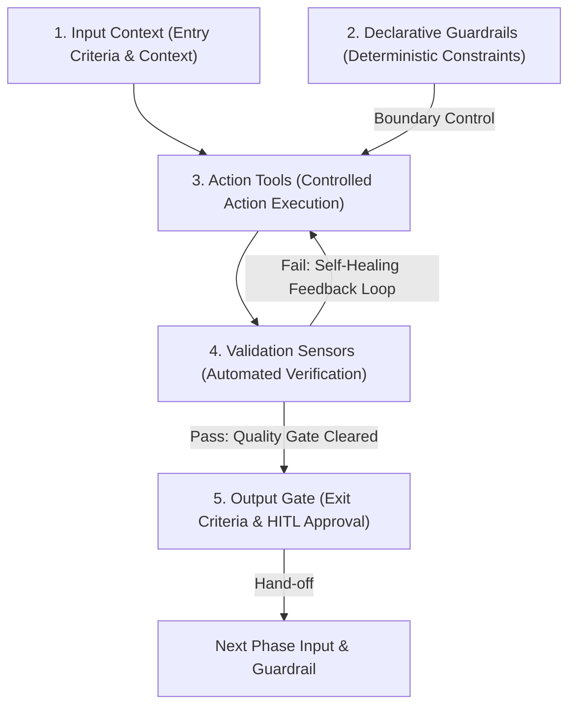
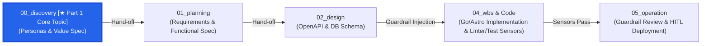
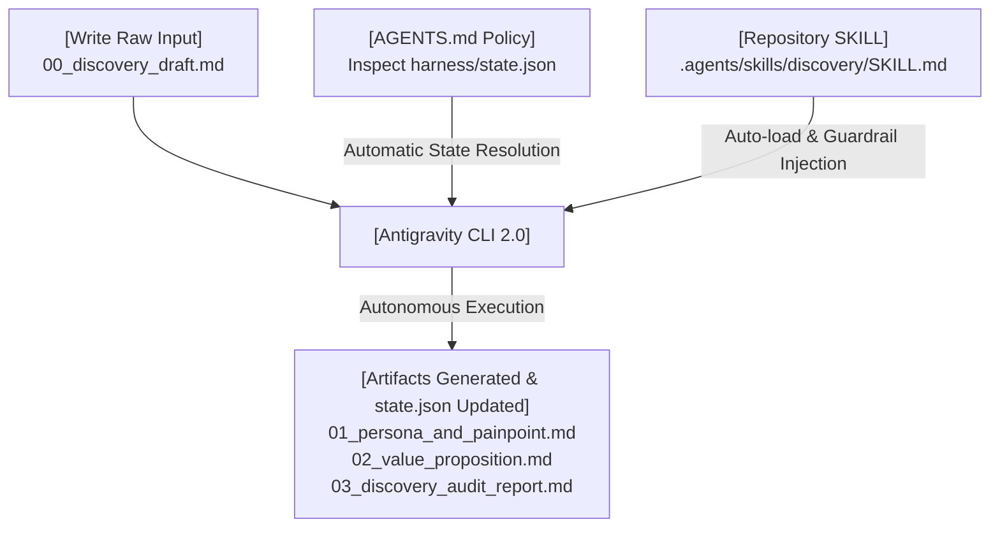

### Introduction: Software Engineering in the Generative AI Era

We have entered an era where generative AI can write code at unprecedented speed. Yet countless engineering teams face new and daunting challenges: context drift in AI-generated code, over-engineering with unnecessary features, and an explosive surge in technical debt.

Simply polishing prompts is not enough to keep AI within production-grade operational guardrails. What is truly required is **Harness Engineering**—a system control architecture that ensures AI agents operate safely, deterministically, and precisely throughout the Software Development Life Cycle (SDLC).

This series uses a real-world production target: the CMS (`app` project, comprising a Go backend and an Astro/React frontend) actively powering the technical platform [joinc.co.kr](https://www.joinc.co.kr). Across this **five-part series on practical Harness Engineering**, we will build and complete an end-to-end operational workflow.

---

## What Is Harness Engineering?

### Definition of a Harness
The word "harness" originally refers to equestrian gear or a safety belt. In software engineering, a **harness** denotes a **control sandbox framework that governs and validates high-degree-of-freedom AI agents, ensuring they do not deviate from established system architecture, business value, or quality standards**.

### Core Formula of Harness Architecture

> 💡 **Core Harness Architecture Equation**  
> **`Harness`** = **`Context`** (Context & Guardrails) + **`Tools`** (Tooling & Execution) + **`Feedback Loop`** (Sensors & Verification)

* **Context (Context / Guardrails)**: Declarative specifications that delineate the AI's input boundaries—business value, functional requirements, `openapi.yaml`, `db_schema.md`, etc.
* **Tools (Execution Tools)**: MCP tools and execution engines (`replace_file_content`, `run_command`, etc.) that allow agents to inspect files, edit code, and produce artifacts.
* **Feedback Loop (Sensors / Verification)**: Verification sensors such as linters, type checkers, and unit test runners that monitor execution outcomes in real time to trigger autonomous self-healing.

### Five Essential Components per Phase



1. **Input Context**: Ingests immutable artifacts from the previous phase to demarcate the exploration scope.
2. **Declarative Guardrails**: Declarative design specifications that suppress AI context drift and hallucinations.
3. **Action Tools**: Execution capabilities that perform coding and transformation tasks strictly within defined guardrails.
4. **Validation Sensors**: Error-detection sensors (linters, type checkers, test suites) that power self-healing feedback loops.
5. **Output Gate**: Validates quality gates, enforces human-in-the-loop (HITL) approval, and produces unidirectional hand-off artifacts for the next phase.

---

## Practical Series Scenario: joinc.co.kr CMS Architecture

Because harness engineering sits in the realm of guiding principles—much like DevOps tenets or AWS Well-Architected Framework pillars—pure theoretical discourse makes it difficult to grasp concrete execution methods. Therefore, this series moves beyond abstract concepts to walk through a **practical, hands-on implementation scenario where we internalize harness engineering by building a real project**.

### Target Application: Backend & Frontend CMS for joinc.co.kr
The `app` project examined in this series is not a toy demo. It targets the **actual backend and frontend coupled CMS (Content Management System) used in production on the technical platform [joinc.co.kr](https://www.joinc.co.kr)**.

* **Backend (`app/backend`)**: Go Gin / GORM / PostgreSQL RESTful API backend (`make test`, `golangci-lint` validation sensors)
* **Frontend (`app/frontend`)**: Astro / React CSR static SPA frontend (`tsc`, `eslint` validation sensors)
* **Design Documentation Pipeline (`app/docs`)**: `00_discovery` → `01_planning` → `02_design` → `04_wbs` → `05_operation`



> **💡 SDLC Harness Pipeline Orientation**  
> This first installment focuses on the manual execution mechanisms and system internalization techniques for **`00_discovery` (Product Discovery)**, the inaugural gateway in the 5-phase harness workflow adhering to the software development life cycle (SDLC).

---

## [Part 1] 00_discovery: Manual Harness Configuration and Operational Principles

### Why the 00_discovery Phase Is Decisive in an SDLC Harness

Many engineering teams succumb to the temptation of jumping straight into code: "Since AI can generate code in 10 seconds, let's start implementing right away." However, delegating implementation to AI without **00_discovery** is like stepping on the accelerator of a four-wheel-drive vehicle with no brakes.

1. **Preventing a 100x Increase in Rework Cost (TCO)**: Discovering that a use case was fundamentally flawed after backend APIs and database schemas have already been implemented costs up to 100 times more to fix than catching it during the discovery phase.
2. **Preemptively Blocking Agent Over-Engineering**: Without explicit personas and out-of-scope boundaries, an AI agent will autonomously invent "nice-to-have" features (premature microservice decompositions, complex role-based access control systems, etc.), immediately polluting the codebase.
3. **Serving as the Single Source of Truth Across the Entire SDLC Pipeline**: As development transitions into Part 2 (`01_planning`), Part 3 (`02_design`), and Part 4 (`04_wbs`), discovery artifacts serve as the supreme guardrail validating the foundational "Why" behind every architectural choice and code review.

#### Core Engineering Outputs from an SDLC Perspective

The artifacts generated upon completing the `00_discovery` phase (`01_persona_and_painpoint.md`, `02_value_proposition.md`) establish a **three-stage deterministic causal mechanism** in software engineering:

1. **Persona Identification and Tech Stack Direction**:
   * Clearly defining target user groups (general readers vs. domain specialists/engineers) directly informs the **functional requirements and technology stack** the software must support.
2. **Business Value Identification and Scope/Depth Clarification**:
   * Identifying personas clarifies the "problems to be solved," the "proposed solutions," and the "delivered business value," strictly establishing the **scope of features and technical implementation depth**.
3. **Comprehensive Guardrails Transitioned to Downstream Phases**:
   * These refined value artifacts map 1:1 into detailed functional specifications during Part 2 (`01_planning`), acting as the **highest-level architectural constraint line preventing AI agents from over-engineering**.

---

## Executing the Manual Harness Pipeline (`Input ──> Action ──> Output`)

From the perspective of a senior engineer, let us trace through three manual stages to understand the operational mechanics of how a harness ingests raw inputs and produces verified outputs.

#### Step 1: Human Engineer Writes Raw Input (`app/docs/00_discovery/00_discovery_draft.md`)
In practice, I manage all my technical documentation using Obsidian. Consequently, being able to immediately publish articles written in Obsidian to a technical blog (joinc.co.kr) without formatting friction would streamline content management dramatically.

Furthermore, decoupling an aging legacy CMS into separate backend and frontend services would enhance operability and maintainability, and I wanted to leverage AI to accelerate this entire overhaul. Grounded in these real-world requirements, I drafted the raw "business requirements" document below:

```markdown
# 00_discovery_draft.md (Raw Business Input)

- Service Name: joinc.co.kr CMS Platform Overhaul
- Core Objectives: 
  1. Technical markdown documents written in local Obsidian (including code blocks and Mermaid diagrams) must be automatically deployed to the blog within 1 second without rendering glitches.
  2. Rather than a superficial news blog, the platform must provide a Q&A forum where C-level executives and senior full-stack developers can deep-dive into Go/React architectures and discuss troubleshooting.
  3. Support API key authentication-based admin publishing and social login reader participation permissions (RBAC).
```

#### Step 2: Harness Prompting and Manual Guardrail Injection
Because the essence of this project is building a personal tech blog CMS, the central persona is the author—myself.

When injecting harness constraints, **the reasons for explicitly establishing personas and out-of-scope boundaries** are as follows:
* **Determining Feature Priority and Implementation Depth**: Establishing unambiguous criteria for what to build, what to exclude, and to what level of detail each capability should be implemented.
* **Distinguishing Technical Debt from Architectural Robustness**: Discerning whether an excluded feature represents future technical debt or, conversely, a vital guardrail that keeps the system resilient.
* **Suppressing AI Over-Engineering**: Preventing AI agents from squandering tokens, time, and engineering effort on extraneous features, keeping them focused on core product value.

Equipped with these baseline constraints, we inject prompts and boundary guardrails to direct the AI agent's discovery process.

#### Step 3: Two 00_discovery Artifacts Produced via Manual Execution

**Generated Artifact 1: `01_persona_and_painpoint.md`**
```markdown
# 01_persona_and_painpoint.md (Product Discovery Level Spec)

## 1. Publisher: joinc.co.kr System Operator & Technical Architect
- **Background & Workflow**: Writes and manages in-depth technical articles embedded with diagrams and code 2-3 times per week using local Obsidian knowledge management tools.
- **Key Pain Points**:
  - Existing web CMS solutions suffer from markdown parsing errors, broken code blocks, and lost image references, requiring frustrating manual lead time before deployment.
  - Inconvenience of having to manually copy-paste raw markdown and reformat content.
- **Product-Level Required Solution**:
  - An automated publishing pipeline that ingests raw Obsidian markdown files directly without modification and synchronizes them to the blog in under 1 second.
  - Streamlined, one-stop post creation and editing management via secure admin authentication.

## 2. Reader A (Jun-woo Park, Age 42 - AX Business Director): B2B Decision Maker
- **Background**: Oversees enterprise AI adoption, security guardrail governance, and ROI realization across internal operations.
- **Key Pain Points**:
  - Fatigued by fragmented, superficial tech news from media outlets and generic blogs; seeks production-proven technical verifications and architecture benchmarking reports.
- **Product-Level Required Solution**:
  - Delivery of deep-dive intelligence content containing architecture diagrams and validated benchmark results rather than superficial summaries.

## 3. Reader B (Jin-ho Choi, Age 29 - AI Full-Stack Engineer): Hands-on Builder
- **Background**: Builds and tunes agentic AI engines and full-stack web applications.
- **Key Pain Points**:
  - Exhausted by troubleshooting context loss and code drift caused by unconstrained AI coding assistants.
  - One-way technical blogs lack forums where practitioners can exchange ideas with domain specialists regarding subtle compile-time or runtime failures.
- **Product-Level Required Solution**:
  - Production of type-safe code reports that can be directly copied, compiled, and verified.
  - A technical Q&A forum where authorized users can debate problem resolutions via code snippets following social authentication.
```

**Generated Artifact 2: `02_value_proposition.md`**
```markdown
# 02_value_proposition.md (Product Discovery Level Spec)

## 1. System Core Value Propositions
- **V-01 (One-Stop Obsidian Publishing)**: Instant, zero-friction automated synchronization of markdown articles from local knowledge tools directly to the blog without manual formatting.
- **V-02 (Validated Deep-Dive Technical Knowledge Serving)**: Publishing in-depth technical reports complete with architectural diagrams and verified code rather than lightweight news.
- **V-03 (B2B Technical Q&A Community)**: Providing an interactive knowledge community where readers and domain experts troubleshoot technical challenges and discuss architectural solutions.

## 2. Product Boundaries & Out of Scope
- **OS-01 (Exclusion of General Social/Chat Features)**: Omit real-time 1:1 chat or general social networking features to concentrate strictly on structured Q&A forum discussions.
- **OS-02 (Exclusion of E-Commerce / Billing Systems)**: Strictly prohibit integrating complex payment gateways or subscription pipelines at this stage.
- **OS-03 (Exclusion of Mainstream Gossip Content)**: Filter out generic news summaries in favor of technical deep-dive formats tailored to senior engineers and technology leaders.
```

---

## [Hands-on] Building a "Team Harness" with GitHub & Antigravity CLI 2.0

### Encapsulating Manual Knowledge into the System
The manual walkthrough demonstrated in Chapter 3 carries an inherent limitation: it can only be successfully driven by a senior engineer who intimately understands the current SDLC phase and the exact prompt construction required.

The true value of harness engineering lies in **encapsulating this senior engineering knowledge directly into the system, leveling organizational capabilities (democratization) so that junior engineers and product managers can produce rigorous artifacts with a single instruction without mastering prompt engineering**.

To achieve this, the team deploys standardized `AGENTS.md` and `SKILL.md` guardrails into the GitHub repository.

> [!NOTE]
> **Role Distinction: `AGENTS.md` vs. `SKILL.md`**
> * **`AGENTS.md` (Project Global Constitution)**: Rules consulted by agents at the initiation of every turn, defining immutable architectural invariants and automated state recognition procedures via `harness/state.json`.
> * **`SKILL.md` (Phase-Specific Operational Manual)**: Selectively loaded when executing a specific SDLC stage (such as `00_discovery`), defining granular artifact specifications and quality gate evaluation standards for that task.

```text
.
├── AGENTS.md                             # Core architecture invariants & state resolution directives
├── harness/
│   └── state.json                       # SDLC pipeline runtime state sensor
├── .agents/
│   └── skills/
│       └── discovery/
│           └── SKILL.md                 # Product Discovery generic harness skill
└── app/
    ├── docs/                            # [Harness Assets] SDLC 5-phase unidirectional spec artifacts
    │   ├── 00_discovery/
    │   ├── 01_planning/
    │   └── 02_design/
    ├── backend/                         # [Executable Code] Go Gin RESTful API
    └── frontend/                        # [Executable Code] Astro + React static SPA
```

#### Project Architecture Guardrail Policy: `AGENTS.md`
Explicitly defines the state resolution policy that agents must inspect before performing any task:

```markdown
# Agent Execution Rules & Policy

## 0. State & Workflow Awareness
- MUST READ STATE FIRST: At the start of every session or task, read harness/state.json first to identify current_phase and active in_progress nodes (tasks).
- AUTOMATIC SKILL RESOLUTION: Automatically reference the matching repository skill (.agents/skills/{phase}/SKILL.md) for the active phase to inject guardrails and execute autonomously.
- QUALITY GATE & DEFINITION OF DONE: After creating designated output artifacts, execute the phase quality audit. Only update the node state to completed when audit.score in state.json is 80 or higher and passes. (If below 80, retain revision_required status and iterate).

## 1. Absolute Behavioral Invariants
- NO GUESSING OR ASSUMPTIONS: Ground all analyses and artifact creations strictly upon designated input artifacts (Input Context) and explicit SKILL guardrails for that phase.
- DETERMINISTIC ARTIFACT CREATION: Write outputs deterministically only to the designated markdown files defined in the phase SKILL.
- STRICT SCOPE BOUNDARY: Strictly maintain the unique resolution of each SDLC stage; prohibit premature technical specifications or over-engineering.
```

#### Product Discovery Generic Harness Skill: `.agents/skills/discovery/SKILL.md`
An encapsulated skill that analyzes arbitrary service input documents and refines them into standardized discovery artifacts without hardcoding project-specific data:

```markdown
---
name: discovery-harness
description: Executes Product Discovery (00_discovery) to derive personas, pain points, core value propositions, and out-of-scope boundaries from arbitrary service input documents.
---

# Product Discovery (00_discovery) Generic Harness Skill

## 1. Objectives & Execution Order
Analyze raw business input documents (e.g., 00_discovery_draft.md) to generate two standardized Product Discovery artifacts.

## 2. Input Requirements
- Ingest raw input documents within the target directory to extract service overviews and core target requirements.

## 3. Artifact 1 Generation Rules: 01_persona_and_painpoint.md
- Stakeholder Identification: Identify provider/operator personas and consumer/reader personas.
- Structured Persona Descriptions: Detail usage background, primary pain points, and product-level required solutions.
- Boundary Constraints: Prohibit premature technical commitments such as specific programming languages or API authentication mechanisms.

## 4. Artifact 2 Generation Rules: 02_value_proposition.md
- Core Value Propositions: Define three primary business value propositions delivered by the product.
- Product Boundaries & Out of Scope: Specify three explicit non-goals to prevent AI over-engineering.

## 5. Execution & Output File Guardrails
- Save analytical findings deterministically into 01_persona_and_painpoint.md and 02_value_proposition.md.

## 6. Validation Sensors (Quality Gate) & Audit Report Generation
- Upon artifact generation, evaluate guardrail compliance (persona fidelity, out-of-scope clarity, etc.).
- Document findings in 03_discovery_audit_report.md and update audit scores and task state in harness/state.json.
```

---

### Autonomous State & Skill Resolution in Antigravity 2.0

When `AGENTS.md` and `SKILL.md` are placed within the GitHub repository, **Antigravity CLI 2.0 inspects `harness/state.json`, detects that the active phase is `00_discovery`, and autonomously loads the corresponding SKILL**.



---

### Autonomous Execution without Prompt Engineering & HITL Review

Once the harness system is established, team members no longer need specialized prompt engineering skills. With a concise single-sentence directive, the harness autonomously generates polished draft artifacts and audit reports. Human engineers (Human-In-The-Loop, HITL) then review, adjust, and approve the output in an efficient collaborative loop.

```bash
> What is your current role?
● Read(/mnt/data/myjob/cloit/poc/harness-test/harness/state.json) (ctrl+o to expand)

  ### 💡 Primary Role and Capabilities                                                                                                                        
                                                                                                                                                             
  1. AI Pair Programmer                                                                                                                                      
      • Build new codebases, modify and debug existing codebases                                                                                              
      • System architecture design, UI/UX development, refactoring, and quality assurance                                                                    
  2. Harness Automation Agent (SDLC Execution)                                                                                                                
      • Automatically detects repository state.json and phase-specific rules (.agents/skills/{phase}/SKILL.md) to advance requirements step-by-step.            
      • Evaluates Quality Gates for each phase, deterministically generating artifacts that satisfy the >=80 pass threshold.                                 
                                                                                                                                                             
  ──────                                                                                                                                                    
  ### 📍 Current Project Status                                                                                                                             
                                                                                                                                                             
  • Active Phase: Phase 0 (00_discovery) in progress                                                                                                          
  • Assigned Task: Persona & pain point analysis, business value proposition specification, and audit report generation based on 00_discovery_draft.md        
                                                                                                                                                             
  Please let me know if you have specific directives or areas to refine!                                                                                     
```

> **💡 Explanation 1 (Autonomous Role and State Awareness)**  
> Even when asked without prior prompting, the agent reads `harness/state.json` according to `AGENTS.md` instructions, identifies itself as the Phase 0 (`00_discovery`) harness agent, and presents its active mission.

```
> Proceed with the task.

● Read(/mnt/data/myjob/cloit/poc/harness-test/.agents/skills/discovery/SKILL.md)
● Read(/mnt/data/myjob/cloit/poc/harness-test/app/docs/00_discovery/00_discovery_draft.md) (ctrl+o to expand)
● Create(/mnt/data/myjob/cloit/poc/harness-test/app/docs/00_discovery/02_value_proposition.md) (ctrl+o to expand)

  Phase 0 (00_discovery) tasks and quality audit evaluations are complete. Harness state has been successfully updated.                                       
  ──────                                                                                                                                                    
  ### 📋 Generated Artifacts & Summary                                                                                                                        
  1. Persona and Pain Point Analysis (01_persona_and_painpoint.md)
      • Publisher/Operator: Frictionless automated sync for markdown, code snippets, and Mermaid diagrams without formatting loss.
      • Consumer/Reader: Technical troubleshooting Q&A forum and social authentication-based RBAC for C-level leaders and senior engineers.
  2. Value Propositions and Product Boundaries (02_value_proposition.md)
      • Core Value Propositions: Zero-friction tech doc sync, deep-dive Q&A ecosystem, trust-based permission control.
      • Out of Scope: Exclude real-time collaborative editing, custom IDP server implementations, and high-volume file hosting (blocks over-engineering).
  3. Quality Gate Audit Report (03_discovery_audit_report.md)
      • Quality Gate Score: 95 / 100 (PASS)
      • State Update: 00_discovery marked as completed in state.json; current_phase updated to 1.
  ──────
  ### 📁 Generated & Updated Files
  • 01_persona_and_painpoint.md
  • 02_value_proposition.md    
  • 03_discovery_audit_report.md
  • state.json
```

> **💡 Explanation 2 (Prompt-Free Autonomous Execution and Self-Audit)**  
> Driven by a single-sentence instruction, the agent ingests the `.agents/skills/discovery/SKILL.md` guardrail and raw input, deterministically produces the two core artifacts (`01_`, `02_`) and the Quality Gate audit report (`03_`), and updates `state.json` to `completed`.

```
> Show current task status.

● Read(/mnt/data/myjob/cloit/poc/harness-test/harness/state.json) (ctrl+o to expand)
  Current task status based on state.json inspection:
  ──────
  ### 📊 Current Harness Workflow Status
  
  • Project Name: joinc-cms-harness-test
  • Active Phase: Awaiting entry into Phase 1 (01_planning)
  ──────
  ### 📌 Progress by Node
  • Phase 0 │ 00_discovery │ completed │ PASS (95 pts) │ Personas, value propositions, and audit report completed
  • Phase 1 │ 01_planning  │  pending  │    Queued     │ Requirements (01_requirements.md) & functional specs (02_functional_spec.md) scheduled
  ──────
  ### 📂 Completed Artifacts (Phase 0)
  • 01_persona_and_painpoint.md
  • 02_value_proposition.md    
  • 03_discovery_audit_report.md
```

> **💡 Explanation 3 (State Tracking and Unidirectional Hand-off Readiness)**  
> Inspecting the system post-execution shows that the agent checks `state.json`, confirms that Phase 0 passed quality verification (PASS, 95 points), and signals readiness for entry into Phase 1 (`01_planning`).

Guided by `AGENTS.md` policies, Antigravity CLI 2.0 inspects `harness/state.json` and loads the `.agents/skills/discovery/SKILL.md` guardrail to autonomously produce `01_persona_and_painpoint.md`, `02_value_proposition.md`, and `03_discovery_audit_report.md` at the same level of resolution as if designed by a senior architect.

#### Human-In-The-Loop (HITL) Review in Obsidian

Artifacts generated by the harness agent are reviewed in Obsidian (or a VS Code markdown viewer) with clean visual rendering. Human engineers inspect the structured personas, value propositions, and audit reports to refine them where needed, leaving behind an immutable, version-controlled markdown asset (Single Source of Truth) documenting the entire planning and architectural trajectory.


*▲ [Figure 1] Inline review of auto-generated persona and pain point specifications (`01_persona_and_painpoint.md`) in Obsidian.*


*▲ [Figure 2] Inspecting Quality Gate audit evaluation and score report (`03_discovery_audit_report.md`, PASS 95 points) in Obsidian.*

---

## 5. Six Core Values of Directory-Based Harness Engineering

The directory-taxonomy-based harness engineering constructed in this article is a field-proven architecture that encapsulates repository structures into deterministic state machines without relying on complex external frameworks.

Unlike conventional harness concepts that merely imply sandboxes or CI/CD test gates, the approach demonstrated here delivers **six unique practical values by governing agent trajectories through directory taxonomy**:

1. **Context Isolation via Directory Taxonomy (Eliminating Context Drift at the Source)**:
   * Physically isolating SDLC stage contexts at the directory level eliminates the need for complex prompt gymnastics and prevents LLM agents from over-engineering or getting lost in the codebase.
2. **Preventing Reverse Contamination of Finalized Specs (Immutability & Single Source of Truth)**:
   * Upstream artifacts (`01_`, `02_`) are ingested by downstream phases as read-only, immutable guardrails, ensuring that downstream implementation choices cannot inadvertently mutate or compromise upstream business intent.
3. **Optimizing Token Expenditure and Lead Time via Fixed Search Horizons**:
   * Restricting agent traversal strictly to `app/docs/{phase}/` and `.agents/skills/{phase}/` boundaries prevents wasteful repository-wide scans, dramatically reducing token consumption and task execution time.
4. **Deterministic Quality Verification (Self-Healing Quality Gate)**:
   * Evaluating sensor gates and compiling audit reports (`03_`) inside each phase sandbox establishes a strict unidirectional boundary: agents cannot advance to the next phase without achieving a PASS score (>= 80).
5. **Prompt-Free Team Capability Leveling via Single-Sentence Directives (Democratization)**:
   * Senior architectural expertise is institutionalized across the repository through `AGENTS.md` and `SKILL.md` conventions, allowing junior engineers and PMs to generate production-grade artifacts using single-sentence prompts like "Proceed with the task."
6. **Co-evolution of AI and SDLC Maturity via Markdown Declarativeness**:
   * Instead of rebuilding complex orchestration pipelines, teams continuously refine declarative markdown rules (`AGENTS.md`, `SKILL.md`). Hard-won operational lessons instantly crystallize into harness guardrails, elevating both the team's AI proficiency and its organizational SDLC maturity.

---

## Summary and Next Episode Preview

### Summary: Building the Part 1 (00_discovery) Harness

Part 1 demonstrated the entire continuum from manual operational principles to building a prompt-free autonomous harness based on repository taxonomy (`AGENTS.md` + `harness/state.json` + `app/docs/00_discovery/`).

The resulting artifacts—`01_persona_and_painpoint.md` and `02_value_proposition.md`—now serve as immutable top-level guardrails preventing AI agents from drifting across subsequent phases.

### Preview of Next Episode: [Part 2] 01_planning

The business value artifacts produced in `00_discovery` will be **handed off unidirectionally as the primary input and context guardrail for [Part 2] `01_planning`**.

In **[Part 2] `01_planning`**, we will explore trajectory-locking techniques that translate high-level natural language requirements into deterministic, declarative functional specifications (`01_requirements.md`, `02_functional_spec.md`) that keep AI agents strictly on course.
