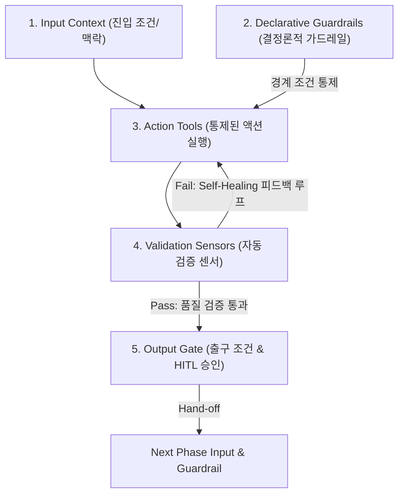
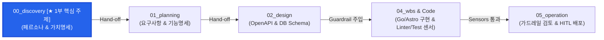
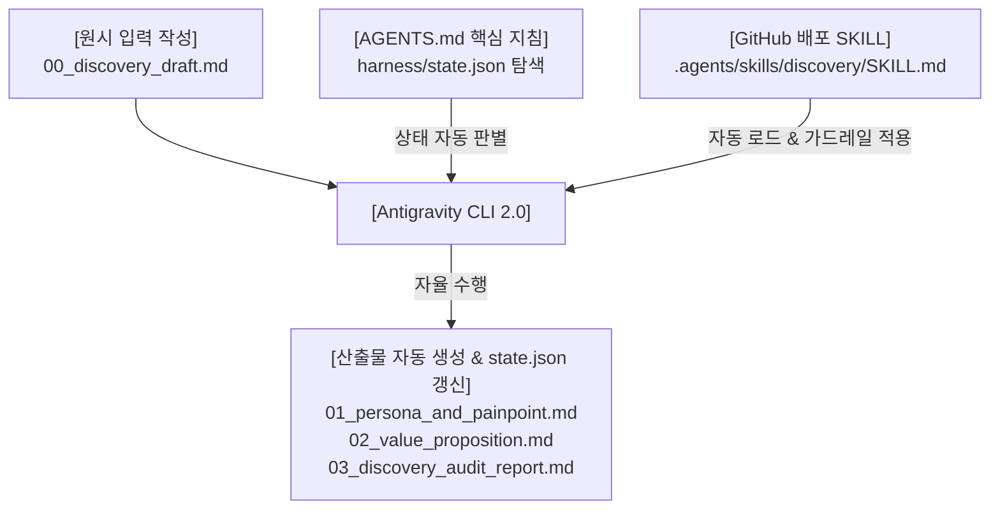

### 들어가며: 생성형 AI 시대의 소프트웨어 공학

생성형 AI가 코드를 빠르게 작성해 주는 시대가 되었지만, 수많은 엔지니어링 팀이 "AI가 만든 코드의 맥락 탈선", "불필요한 과잉 기능(Over-engineering)", "기술 부채 폭증"이라는 새로운 문제에 직면하고 있습니다. 

단순히 프롬프트를 잘 다듬는 것만으로는 AI를 프로덕션 레벨의 통제 궤도에 가둘 수 없습니다. AI 에이전트가 소프트웨어 개발 수명 주기(SDLC) 내에서 안전하고 정밀하게 동작하도록 만드는 시스템 제어 구조, 즉 **하네스 엔지니어링(Harness Engineering)**이 필수적인 이유입니다.

본 연재는 실제 기술 플랫폼 [joinc.co.kr](https://www.joinc.co.kr)에서 운용 중인 CMS(Go 백엔드 + Astro/React 프론트엔드) 프로젝트 `app`을 실전 타겟으로 지정하여, **5부작 하네스 엔지니어링 실전 워크플로우**를 완성해 나갑니다.

---

## 하네스(Harness) 엔지니어링이란 무엇인가?

### 하네스의 정의
하네스(Harness)는 본래 마구(馬具)나 안전벨트를 의미합니다. 소프트웨어 공학에서 **하네스**란 **자유도가 높은 AI 에이전트가 정해진 아키텍처, 비즈니스 가치, 품질 기준을 벗어나지 않도록 통제하고 검증하는 제어 샌드박스 프레임워크**를 뜻합니다.

### 하네스 아키텍처 핵심 방정식

> 💡 **하네스 아키텍처 핵심 방정식**  
> **`Harness`** = **`Context`** (맥락 & 가드레일) + **`Tools`** (도구 & 실행) + **`Feedback Loop`** (센서 & 검증)

* **Context (맥락/가드레일)**: 비즈니스 가치, 요구사항, `openapi.yaml`, `db_schema.md` 등 AI의 입력 맥락을 구획하는 선언적 규격.
* **Tools (실행 도구)**: 에이전트가 코드를 수정하고 아티팩트를 산출하는 MCP Tools 및 execution engine (`replace_file_content`, `run_command` 등).
* **Feedback Loop (센서/검증)**: Linter, TypeChecker, Unit Test 등 실행 결과를 실시간 감지하여 오류를 Self-Healing(자율 정정) 시키는 검증 센서.

### Phase(부)별 5대 필수 구성 요소



1. **진입 조건 & 입력 맥락 (Input Context)**: 이전 Phase의 불변 아티팩트를 수용하여 탐색 범위 구획
2. **결정론적 가드레일 (Declarative Guardrails)**: AI 탈선을 억제하는 선언적 설계 명세
3. **통제된 액션 도구 (Action Tools)**: 가드레일 내에서 코딩/변환 작업을 수행하는 실행 수단
4. **자동 검증 센서 (Validation Sensors)**: Linter, TypeChecker 등 오류 감지 및 Self-Healing 피드백 루프
5. **출구 조건 & 출력 인터페이스 (Output Gate)**: HITL 검증 통과 및 다음 Phase로의 단방향 Hand-off 아티팩트 산출

---

## 실전 연재 시나리오: joinc.co.kr CMS 아키텍처

하네스 엔지니어링은 DevOps 원칙이나 AWS 6대 아키텍처 원칙과 같은 "원칙"의 영역이므로, 개념 서술만으로는 구체적인 실행 방안을 체감하기 어렵습니다. 따라서 본 연재에서는 이론을 넘어 **실제 하네스 엔지니어링으로 프로젝트를 진행하며 직접 체화**해 보는 실전 시나리오를 다룹니다.

### 타겟 애플리케이션: joinc.co.kr 의 백엔드 & 프론트엔드 CMS
본 시리즈에서 다루는 `app` 프로젝트는 가상의 토이 프로젝트가 아닙니다. **실제 기술 플랫폼 [joinc.co.kr](https://www.joinc.co.kr)에서 서비스 운용을 위해 사용 중인 백엔드(Backend) 및 프론트엔드(Frontend) 결합형 CMS(Content Management System)**를 대상으로 합니다.

* **백엔드 (`app/backend`)**: Go Gin / GORM / PostgreSQL 기반 RESTful API 백엔드 (`make test`, `golangci-lint` 센서)
* **프론트엔드 (`app/frontend`)**: Astro / React 기반 CSR 정적 SPA 프론트엔드 (`tsc`, `eslint` 센서)
* **설계 문서 파이프라인 (`app/docs`)**: `00_discovery` $\rightarrow$ `01_planning` $\rightarrow$ `02_design` $\rightarrow$ `04_wbs` $\rightarrow$ `05_operation`



> **💡 SDLC 하네스 파이프라인 위치 안내**  
> 본 1부 포스트는 소프트웨어 개발 수명 주기(SDLC)를 준수하는 총 5단계의 하네스 워크플로우 중 첫 번째 관문인 **`00_discovery` (Product Discovery)** 단계의 매뉴얼 구동 메커니즘과 시스템 내재화 기법을 집중 다룹니다.

---

## [1부] 00_discovery: 매뉴얼 하네스 구성 및 작동 원리 이해

### 왜 00_discovery 단계가 SDLC 하네스에서 가장 결정적인가?

많은 엔지니어링 팀이 "AI가 코드를 10초 만에 써주니 바로 코딩부터 시작하자"는 유혹에 빠집니다. 하지만 **00_discovery**를 생략한 채 AI에게 코딩을 맡기는 것은 브레이크 없는 사륜구동 차를 가속하는 것과 같습니다.

1. **재작업 비용(TCO) 100배 예방**: 백엔드 API와 DB 테이블이 완공된 후 유스케이스가 잘못되었음을 깨달았을 때의 수정 비용은 기획 단계의 100배에 달합니다.
2. **AI 에이전트의 과잉 코딩(Over-engineering) 사전 차단**: 명확한 페르소나와 Out of Scope 제약이 없으면, AI 에이전트는 '있으면 좋을 것 같은 기능'(MSA 분치, 무거운 권한 시스템 등)을 자율적으로 덧붙여 코드베이스를 즉시 오염시킵니다.
3. **SDLC 파이프라인 전체의 단방향 기준점(Single Source of Truth)**: 2부(`01_planning`), 3부(`02_design`), 4부(`04_wbs`)로 내려갈 때 모든 기술적 결정과 코드 리뷰의 'Why'를 검증하는 최상위 가드레일이 됩니다.

#### SDLC 관점에서의 핵심 엔지니어링 아웃풋 (Output Artifacts)

`00_discovery` 단계가 완료되었을 때 산출되는 아웃풋(`01_persona_and_painpoint.md`, `02_value_proposition.md`)은 소프트웨어 공학 관점에서 다음과 같은 **3단계 결정론적 인과 메커니즘**을 형성합니다.

1. **페르소나 식별과 기술 스택 결정**:
   * 타겟 사용자층(일반인 vs 도메인 전문가/엔지니어 등)이 정의됨에 따라 **소프트웨어가 갖춰야 할 기능 요구사항과 세부 기술 스택(Tech Stack)**의 방향성이 결정됩니다.
2. **비즈니스 가치 식별과 기능 범위·깊이 명확화**:
   * 페르소나를 통해 "해결해야 할 문제", "솔루션", "제공될 비즈니스 가치"가 구체화되며, 이는 **구현할 기능의 범위(Scope)와 기술적 구현 깊이(Depth)**를 정확히 고정해 줍니다.
3. **다음 단계로 이행되는 포괄적 가드레일 형성**:
   * 이 정제된 가치 아티팩트는 2부(`01_planning`)에서 세부 기능 요구사항으로 일대일 변환되며, **AI 에이전트의 오버엔지니어링을 차단하는 제품 전체의 최상위 아키텍처 제약선**이 됩니다.

---

### 매뉴얼 하네스 파이프라인 주행 (`Input ──> Action ──> Output`)

시니어 엔지니어 관점에서 하네스가 어떻게 입력을 받아 검증된 출력을 도출하는지 매뉴얼하게 3단계를 주행하며 메커니즘을 이해합니다.

#### Step 1: 인간 엔지니어의 원시 Input 작성 (`app/docs/00_discovery/00_discovery_draft.md`)
저는 실제로 Obsidian을 이용해 모든 기술 문서를 관리합니다. 그래서 Obsidian으로 작성한 문서를 즉시 기술 블로그(joinc.co.kr)에 퍼블리싱할 수 있다면 문서 관리가 매우 편해질 것이라 생각했습니다.

아울러 기존의 낡은 CMS를 백엔드와 프론트엔드로 분리해 운용성과 유지보수성을 높이고, 이 모든 개편 작업을 AI를 활용해 빠르게 진행하고 싶었습니다. 이러한 실제 현장 고민을 바탕으로 아래와 같이 원시 "비즈니스 요구사항" 초안을 작성했습니다.

```markdown
# 00_discovery_draft.md (원시 비즈니스 입력)

- 서비스 명칭: joinc.co.kr CMS 플랫폼 개편
- 핵심 목적: 
  1. 로컬 Obsidian으로 작성한 마크다운 기술 문서(코드 블록, Mermaid 다이어그램 포함)가 1초 만에 블로그로 깨짐 없이 자동 배포되어야 한다.
  2. 단순 뉴스 블로그가 아니라 C-Level 및 시니어 풀스택 개발자가 Go/React 아키텍처 코드를 딥다이브하고 트러블슈팅을 토론할 수 있는 Q&A 포럼을 제공해야 한다.
  3. API Key 인증 기반 어드민 배포와 소셜 로그인 독자 참여 권한(RBAC)을 지원해야 한다.
```

#### Step 2: 하네스 프롬프팅 및 가드레일 매뉴얼 주입
이 프로젝트의 본질은 '개인 Tech Blog CMS'를 만드는 것이므로, 가장 핵심적인 페르소나는 글을 작성하는 '저 자신'이 됩니다.

하네스 주입 시 **페르소나와 Out of Scope를 명확히 설정하는 이유**는 다음과 같습니다.
* **기능 우선순위 및 구현 깊이(Depth) 결정**: 무엇을 개발하고 무엇을 배제할지, 각 기능을 어느 수준까지 구현할지 명확한 기준을 세웁니다.
* **기술 부채 vs 애플리케이션 견고성 판별**: 제외된 기능이 향후 부담이 될 기술 부채인지, 오히려 시스템을 견고하게 만들어줄 가드레일인지 구별합니다.
* **AI의 오버 엔지니어링 차단**: AI 에이전트가 불필요한 기능을 덧붙여 시간과 노력을 낭비하는 것을 방지하고 제품 본질에 집중하게 합니다.

이러한 통제 기준선을 바탕으로 AI 에이전트에게 프롬프트와 가드레일 조건을 주입하고 탐색을 명령합니다.

#### Step 3: 매뉴얼 주행을 통해 산출된 00_discovery 아티팩트 2종

**산출된 아티팩트 1: `01_persona_and_painpoint.md`**
```markdown
# 01_persona_and_painpoint.md (Product Discovery Level Spec)

## 1. Publisher (글을 올리는 자): joinc.co.kr 시스템 운영자 & 기술 아키텍트
- **사용 배경 및 워크플로우**: 로컬 Obsidian 지식 툴을 사용하여 다이어그램과 코드가 매립된 깊이 있는 기술 아티클을 주 2-3회 집필 및 관리함.
- **핵심 페인포인트 (Pain Points)**:
  - 기존 웹 CMS 사용 시 마크다운 파싱 에러, 코드 블록 깨짐, 이미지 파싱 손실로 인해 포스팅 배포에 불필요한 수동 리드타임이 소모됨.
  - 마크다운 원문을 수동으로 복사-붙여넣기하여 포맷팅을 재정리해야 하는 번거로움 존재.
- **제품 차원의 요구 솔루션**:
  - Obsidian 마크다운 원문을 수정 없이 그대로 읽어 1초 이내에 블로그로 자동 동기화하는 배포 파이프라인.
  - 어드민 전용 보안 인증을 통한 간편한 원스톱 게시물 생성/수정 관리.

## 2. Reader A (박준우 42세 - AX 비즈니스 디렉터): B2B 의사결정권자
- **사용 배경**: 사내 업무 AI 도입, 보안 가드레일 구축, ROI 확보를 총괄하는 디렉터.
- **핵심 페인포인트 (Pain Points)**:
  - 언론사나 일반 블로그의 단편적인 뉴스성 소식에 지쳐 있으며, 실제 프로덕션에 적용 가능한 기술 검증 및 아키텍처 벤치마킹 리포트를 원함.
- **제품 차원의 요구 솔루션**:
  - 단순 서술문이 아닌 아키텍처 다이어그램과 검증 결과가 포함된 딥다이브 인텔리전스 콘텐츠 서빙.

## 3. Reader B (최진호 29세 - AI 풀스택 엔지니어): 실무 빌더
- **사용 배경**: 에이전틱 AI 엔진과 풀스택 웹 애플리케이션을 개발하고 튜닝하는 엔지니어.
- **핵심 페인포인트 (Pain Points)**:
  - AI 코딩 조수의 맥락 소실 및 코드 탈선으로 인한 트러블슈팅에 피로감을 느낌.
  - 단방향 블로그에서는 미세한 컴파일/런타임 장애에 대해 기술 전문가들과 의견을 나눌 창구가 부재함.
- **제품 차원의 요구 솔루션**:
  - 바로 복사해서 실행 검증할 수 있는 타입 안전한 기술 코드 매립 리포트 제공.
  - 소셜 인가를 거쳐 전문가 그룹과 기술 문제 해결책을 코드로 토론하는 Q&A 포럼 제공.
```

**산출된 아티팩트 2: `02_value_proposition.md`**
```markdown
# 02_value_proposition.md (Product Discovery Level Spec)

## 1. System Core Value Propositions (비즈니스 가치 제안)
- **V-01 (Obsidian 원스톱 배포)**: 로컬 지식 툴 마크다운 아티클을 수동 편집 없이 블로그로 즉시 자동 동기화 배포.
- **V-02 (검증된 딥다이브 지식 서빙)**: 가벼운 뉴스가 아닌, 다이어그램과 검증된 코드가 수록된 기술 리포트 서빙.
- **V-03 (B2B 기술 Q&A 포럼)**: 독자와 전문가가 기술 트러블슈팅과 해결책을 토론하는 지식 커뮤니티 제공.

## 2. Product Boundaries & Out of Scope (제품 경계 및 비목표)
- **OS-01 (불필요한 일반 SNS/채팅 기능 배제)**: 실시간 1:1 메신저나 일반 SNS 기능을 배제하고 Q&A 포럼 토론에 집중함.
- **OS-02 (이커머스/결제 시스템 배제)**: 현 단계에서 복잡한 결제/구독 파이프라인 도입을 엄격히 금지함.
- **OS-03 (일반 대중 가쉽 콘텐츠 배제)**: 단순 소식성 글을 배제하고 시니어 엔지니어/결정권자 중심 딥다이브 포맷으로 고정함.
```

---

## [Hands-on] 따라하며 완성하는 GitHub & Antigravity CLI 2.0 기반 "팀 하네스" 구축

### 매뉴얼 지식을 시스템으로 캡슐화하기
3장에서 살펴본 매뉴얼 주행 방식은 "SDLC의 현재 단계와 필요한 프롬프트 구조를 파악하고 있는 시니어 엔지니어"만 수행할 수 있다는 한계가 있습니다. 

하네스의 진정한 가치는 **이 시니어 지식을 시스템에 캡슐화하여, 주니어 개발자나 PM도 프롬프팅 기술 없이 버튼 하나로 정밀한 아티팩트를 얻게 만드는 역량 평준화(Democratization)**에 있습니다.

이를 위해 팀 차원에서 GitHub 레포지토리에 표준 `AGENTS.md` 및 `SKILL.md` 가드레일을 배포합니다.

> [!NOTE]
> **`AGENTS.md` vs `SKILL.md` 역할 구분**
> * **`AGENTS.md` (프로젝트 전역 헌법)**: 모든 대화 개시 시 에이전트가 최우선 참조하는 규칙으로, 아키텍처 불변 수칙 및 `harness/state.json` 상태 자동 인식 절차를 정의합니다.
> * **`SKILL.md` (단계별 실무 매뉴얼)**: `00_discovery` 등 특정 SDLC 단계 수행 시 선택 로드되며, 해당 작업의 세부 아티팩트 규격과 품질 검증 수칙을 정의합니다.

```text
.
├── AGENTS.md                             # 프로젝트 핵심 아키텍처 규칙 & 상태 자동 인식 지침
├── harness/
│   └── state.json                       # SDLC 파이프라인 진행 상태 런타임 센서
├── .agents/
│   └── skills/
│       └── discovery/
│           └── SKILL.md                 # Product Discovery 전용 범용 하네스 스킬
└── app/
    ├── docs/                            # [하네스 자산] SDLC 5단계 단방향 명세 아티팩트
    │   ├── 00_discovery/
    │   ├── 01_planning/
    │   └── 02_design/
    ├── backend/                         # [실행 코드] Go Gin RESTful API
    └── frontend/                        # [실행 코드] Astro + React 정적 SPA
```

#### 프로젝트 아키텍처 가드레일 정책: `AGENTS.md`
에이전트가 시작 시 최우선 탐색할 상태 판별 수칙을 명시합니다.

```markdown
# Agent Execution Rules & Policy

## 0. State & Workflow Awareness (상태 및 워크플로우 자동 인식 수칙)
- MUST READ STATE FIRST: 모든 작업 및 대화 개시 시 무조건 harness/state.json 파일의 내용을 읽어 current_phase와 in_progress 상태인 노드(Task)를 최우선 식별하라.
- AUTOMATIC SKILL RESOLUTION: 식별된 진행 노드(Phase)에 부합하는 레포지토리 내 SKILL(.agents/skills/{phase}/SKILL.md)을 자동으로 참조하여 가드레일을 주입받아 자율 수행하라.
- QUALITY GATE & DEFINITION OF DONE: 지정된 Output 아티팩트 생성 후 반드시 해당 Phase의 품질 검증 평가를 수행하고, state.json 내 audit.score가 80점 이상 및 pass일 때만 노드 상태를 completed로 갱신하라. (80점 미만 시 revision_required 상태 유지 및 보완 수행)

## 1. Absolute Behavioral Invariants (불변 수칙)
- NO GUESSING OR ASSUMPTIONS: 모든 분석 및 아티팩트 생성은 해당 Phase의 지정된 입력 아티팩트(Input Context)와 명시적 SKILL 가드레일에만 근거해야 한다.
- DETERMINISTIC ARTIFACT CREATION: 해당 Phase SKILL에 정의된 지정 아웃풋 마크다운 파일에만 결정론적으로 결과를 작성하라.
- STRICT SCOPE BOUNDARY: 각 SDLC 단계별 고유 해상도를 준수하며, 조기 기술 언급이나 오버엔지니어링을 철저히 배제하라.
```

#### Product Discovery 범용 하네스 스킬: `.agents/skills/discovery/SKILL.md`
특정 프로젝트 데이터 하드코딩 없이 어떤 요구사항이든 분석하여 표준 아티팩트로 정제하는 캡슐화 스킬입니다.

```markdown
---
name: discovery-harness
description: Product Discovery (00_discovery) 단계를 수행하여 임의의 서비스 입력 문서로부터 페르소나, 페인포인트, 비즈니스 가치 제안 및 Out of Scope 아티팩트를 산출하는 범용 하네스 스킬
---

# Product Discovery (00_discovery) 범용 하네스 스킬

## 1. 목표 및 작동 순서
원시 비즈니스 입력 문서(예: 00_discovery_draft.md)를 분석하여 Product Discovery 표준 아티팩트 2종을 정제 산출합니다.

## 2. 입력 요구사항
- 대상 디렉토리 내의 원시 입력 문서를 읽어 서비스 개요와 타겟 요구사항을 탐색합니다.

## 3. 아티팩트 1 산출 및 서술 규칙: 01_persona_and_painpoint.md
- 이해관계자 식별: 공급자/운영자와 소비자/독자 페르소나를 식별합니다.
- 페르소나별 구조화 서술: 사용 배경, 핵심 페인포인트, 제품 차원 요구 솔루션을 서술합니다.
- 제약 금지 사항: 특정 프로그래밍 언어, API 인증 방식 등의 조기 기술 언급을 배제합니다.

## 4. 아티팩트 2 산출 및 서술 규칙: 02_value_proposition.md
- Core Value Propositions: 제품의 핵심 비즈니스 가치 제안 3가지를 서술합니다.
- Product Boundaries & Out of Scope: AI 오버엔지니어링을 차단할 제품의 비목표 3가지를 구획합니다.

## 5. 실행 및 파일 산출 가드레일
- 분석 결과를 01_persona_and_painpoint.md 및 02_value_proposition.md 파일로 작성하여 저장합니다.

## 6. 품질 검증 센서 (Quality Gate) 및 감사 리포트 산출
- 아티팩트 작성 완료 후 가드레일 준수 여부(페르소나 충실도, Out of Scope 명확성 등)를 검증 평가합니다.
- 평가 결과를 03_discovery_audit_report.md 리포트로 작성해 저장하고, harness/state.json 내 audit 점수 및 상태를 갱신합니다.
```

---

### Antigravity 2.0의 자율 상태 및 SKILL 인식 메커니즘

GitHub 레포지토리에 `AGENTS.md` 및 `SKILL.md`가 배치되어 있으면, **Antigravity CLI 2.0이 프로젝트 `harness/state.json`을 읽어 현재 Phase가 `00_discovery`임을 판단하고 해당 SKILL을 자율 로드**합니다.



---

### 복잡한 프롬프팅 없는 자율 주행과 인간 검토(HITL) 워크플로우

하네스 시스템이 구축되면 팀원들이 복잡한 프롬프트 엔지니어링 기법을 별도로 익힐 필요가 없습니다. 1문장의 가벼운 지시로 하네스가 정밀한 아티팩트 초안과 감사 보고서를 자율 생성하면, 인간 엔지니어(HITL, Human-In-The-Loop)가 이를 최종 검토·수정하고 승인하는 효율적인 협업 워크플로우가 형성됩니다.

```bash
> 당신의 역할을 알려주세요.
● Read(/mnt/data/myjob/cloit/poc/harness-test/harness/state.json) (ctrl+o to expand)

  ### 💡 주요 역할 및 역량                                                                                                                                  
                                                                                                                                                            
  1. AI 페어 프로그래머 (Pair Programmer)                                                                                                                   
      • 신규 코드베이스 구축, 기존 코드베이스 수정 및 디버깅                                                                                                
      • 시스템 아키텍처 설계, UI/UX 개발, 리팩터링 및 품질 검증                                                                                             
  2. 하네스 기반 SDLC 자율 수행 (Harness Automation Agent)                                                                                                  
      • 프로젝트 내 state.json의 상태 및 Phase별 규칙(.agents/skills/{phase}/SKILL.md)을 감지하여 요구사항을 단계별로 이행합니다.                           
      • 각 단계(Phase)별로 품질 게이트(Quality Gate) 평가를 거쳐 80점 이상의 통과 기준을 충족하는 아티팩트를 결정론적으로 생성합니다.                       
                                                                                                                                                            
  ──────                                                                                                                                                    
  ### 📍 현재 프로젝트 상의 진행 상태                                                                                                                       
                                                                                                                                                            
  • 현재 Phase: Phase 0 (00_discovery) 진행 중                                                                                                              
  • 담당 작업: 서비스 입력 문서(00_discovery_draft.md) 기반 페르소나 & 페인포인트 분석, 비즈니스 가치 제안서 및 품질 검증 보고서 작성                       
                                                                                                                                                            
  지시사항이나 추가 구체화가 필요한 작업이 있다면 알려주세요!                                                                                               

```

> **💡 설명 1 (역할 및 상태 자율 인지)**  
> 사전 프롬프팅 없이 질의해도 에이전트가 `AGENTS.md` 수칙에 따라 `harness/state.json`을 자동 읽어, 자신이 Phase 0(`00_discovery`) 담당 하네스 에이전트임을 자율 식별하고 임무를 제시합니다.

```
> 작업 진행해주세요.

● Read(/mnt/data/myjob/cloit/poc/harness-test/.agents/skills/discovery/SKILL.md)
● Read(/mnt/data/myjob/cloit/poc/harness-test/app/docs/00_discovery/00_discovery_draft.md) (ctrl+o to expand)
● Create(/mnt/data/myjob/cloit/poc/harness-test/app/docs/00_discovery/02_value_proposition.md) (ctrl+o to expand)

  Phase 0 (00_discovery) 작업 및 품질 검증 평가를 완료하고 하네스 상태를 성공적으로 갱신하였습니다.                                                         
  ──────                                                                                                                                                    
  ### 📋 생성된 아티팩트 및 작업 요약                                                                                                                       
  1. 페르소나 및 페인포인트 분석 (01_persona_and_painpoint.md)
      • 공급자/운영자: 마크다운, 코드 시니펫, Mermaid 다이어그램 작성자의 포맷 훼손 없는 자동 동기화 배포 요구사항 도출
      • 소비자/독자: C-Level 및 시니어 엔지니어링 리더를 위한 트러블슈팅 Q&A 포럼 및 소셜 신원 기반 참여 권한(RBAC) 요구사항 도출
  2. 비즈니스 가치 제안 및 제품 경계 (02_value_proposition.md)
      • Core Value Propositions: 무마찰 기술 문서 자동 동기화 배포, 딥다이브 Q&A 생태계, 신뢰 기반 권한 제어
      • Out of Scope: 실시간 동시 편집 에디터 제외, 커스텀 IDP 서버 구축 제외, 대용량 파일 호스팅 제외 (오버엔지니어링 차단)
  3. 품질 검증 평가 보고서 (03_discovery_audit_report.md)
      • Quality Gate Score: 95 / 100 (PASS)
      • 상태 갱신: state.json 내 00_discovery 노드 completed 반영 완료 및 current_phase: 1 변경
  ──────
  ### 📁 생성 및 업데이트된 파일 링크
  • 01_persona_and_painpoint.md
  • 02_value_proposition.md    
  • 03_discovery_audit_report.md
  • state.json
```

> **💡 설명 2 (프롬프트-프리 자율 주행 및 Self-Audit)**  
> 단 1문장의 지시만으로 `.agents/skills/discovery/SKILL.md` 가드레일과 원시 입력을 로드하고, 아티팩트 2종(`01_`, `02_`) 및 Quality Gate 감사 리포트(`03_`)를 결정론적으로 산출한 후 `state.json`을 `completed`로 자동 갱신합니다.


```
> 현재 작업 상태 알려줘

● Read(/mnt/data/myjob/cloit/poc/harness-test/harness/state.json) (ctrl+o to expand)
  state.json 조회 결과 기준 현재 작업 상태입니다.
  ──────
  ### 📊 현재 하네스 워크플로우 상태
  
  • 프로젝트 명칭: joinc-cms-harness-test
  • 현재 진행 Phase: Phase 1 (01_planning) 진입 대기
  ──────
  ### 📌 노드별 진행 상황
  • Phase 0 │ 00_discovery │ completed │ PASS (95점) │ 페르소나, 비즈니스 가치 제안, 감사 리포트 산출 완료
  • Phase 1 │ 01_planning  │  pending  │ 대기 중     │ 요구사항 명세서(01_requirements.md) 및 기능 명세서(02_functional_spec.md) 작성 예정
  ──────
  ### 📂 완료된 산출물 (Phase 0)
  • 01_persona_and_painpoint.md
  • 02_value_proposition.md    
  • 03_discovery_audit_report.md

```

> **💡 설명 3 (상태 추적 및 단방향 Hand-off 준비)**  
> 주행 완료 후 조회를 수행하면 `state.json`을 탐색해 Phase 0 검증 통과(PASS 95점) 및 Phase 1(`01_planning`) 진입 대기 상태를 정확히 추적하여 다음 단계 이행 준비를 가이드합니다.

Antigravity CLI 2.0은 `AGENTS.md` 정책에 따라 `harness/state.json`을 탐색한 후, GitHub에 배포된 `.agents/skills/discovery/SKILL.md` 가드레일을 자동으로 주입받아 시니어 개발자가 직접 설계한 것과 동일한 해상도의 `01_persona_and_painpoint.md`, `02_value_proposition.md` 및 `03_discovery_audit_report.md` 아티팩트를 자율 생성합니다.

#### 인간 엔지니어의 Obsidian 기반 HITL 검토 및 아티팩트 문서화

하네스 에이전트가 자율 생성한 아티팩트는 Obsidian(또는 VS Code 마크다운 뷰어)을 통해 시각적으로 깔끔하게 렌더링된 화면으로 직접 리뷰합니다. 인간 엔지니어는 시각화된 페르소나, 가치 제안 및 Audit 리포트를 확인하여 손쉽게 수정·보완할 수 있으며, 기획 및 개발 전체 과정이 명확한 마크다운 문서 자산(Single Source of Truth)으로 정밀하게 남게 됩니다.


*▲ [그림 1] 하네스 에이전트가 자동 생성한 페르소나 및 페인포인트 명세(`01_persona_and_painpoint.md`)를 Obsidian에서 인라인 검토하는 화면*


*▲ [그림 2] Quality Gate 감사 및 점수(PASS 95점) 평가 보고서(`03_discovery_audit_report.md`)를 Obsidian에서 확인하는 화면*

---

## 5. 디렉토리 기반 하네스 엔지니어링의 6대 핵심 가치

본 1부 연재를 통해 구축한 디렉토리 텍소노미 기반 하네스 엔지니어링은 복잡한 외부 프레임워크 없이 레포지토리 구조 자체를 결정론적 상태 머신으로 캡슐화한 현장 실증형 아키텍처입니다.

일반적인 하네스 엔지니어링 개념이 단순한 샌드박스나 CI/CD 가드레일을 의미하는 것과 달리, 본 연재에서 실증한 방식은 **디렉토리 텍소노미를 통해 에이전트의 궤도를 제어하는 독창적인 6대 실전 가치**를 제공합니다.

1. **디렉토리 텍소노미 기반 컨텍스트 격리 (Context Drift 근본 차단)**:
   * SDLC 단계별 컨텍스트를 디렉토리 단위로 물리적 격리함으로써, 복잡한 프롬프트 엔지니어링 없이도 LLM 에이전트가 오버엔지니어링에 빠지거나 길을 잃는 현상을 차단합니다.
2. **완료된 상위 명세의 역방향 오염 차단 (Immutability & Single Source of Truth)**:
   * 이전 Phase의 산출물(`01_`, `02_`)은 다음 Phase의 '수정 불가능한 불변 가드레일(Read-only Input)'로 수용되므로, 하위 구현 진행 중 상위 비즈니스 가치가 임의 훼손되는 역방향 오염을 완전히 방지합니다.
3. **고정 탐색 범위를 통한 토큰 비용 감축 및 컴퓨팅 리드타임 최적화**:
   * 에이전트가 전체 레포지토리를 무분별하게 오버스캔하지 않고 `app/docs/{phase}/` 및 `.agents/skills/{phase}/` 경계 내에서만 주행하므로 불필요한 토큰 비용과 작업 소요 시간을 극적으로 절약합니다.
4. **결정론적 품질 검증 센서 (Self-Healing Quality Gate)**:
   * 각 Phase 샌드박스 내부에서 센서 평가 및 감사 리포트(`03_`)를 자율 수행하고, PASS 기준(80점 이상)을 통과해야만 다음 Phase로 이동하는 엄격한 단방향 통제선을 형성합니다.
5. **1문장 자연어 기반 프롬프트-프리 팀 역량 평준화 (Prompt-Free Democratization)**:
   * 시니어 아키텍트의 설계 지식이 `AGENTS.md` 및 `SKILL.md` 체계로 레포지토리에 내재화되어, 주니어 개발자나 PM도 "작업 진행해 줘"라는 단 1문장의 자연어 지시만으로 고품질 아티팩트를 자율 산출합니다.
6. **마크다운 선언성을 통한 AI 및 SDLC 개발 성숙도의 동반 진화 (Co-evolution of Maturity)**:
   * 복잡한 파이프라인 코드를 리빌드할 필요 없이 마크다운 문서(`AGENTS.md`, `SKILL.md`) 수칙만 지속 정제하면 되므로, 팀의 현장 시행착오가 즉시 하네스 가드레일로 자산화되어 AI 활용 성숙도와 조직의 SDLC 아키텍처 성숙도가 동반 상승합니다.

---

## 요약 및 다음 회차 예고

### 1부 (00_discovery) 하네스 구축 요약

1부에서는 매뉴얼 주행 원리부터 레포지토리 텍소노미(`AGENTS.md` + `harness/state.json` + `app/docs/00_discovery/`) 기반의 Prompt-Free 자율 주행 하네스 구축까지 실증했습니다.

이 과정을 통해 산출된 `01_persona_and_painpoint.md` 및 `02_value_proposition.md` 아티팩트는 제품 전체의 AI 탈선을 억제하는 최상위 불변 가드레일 역할을 수행합니다.

### 다음 회차 예고: [2부] 01_planning

1부 `00_discovery` 단계에서 산출된 비즈니스 가치 아티팩트는 **다음 단계인 [2부] `01_planning`의 최상위 Input이자 AI의 맥락 가드레일**로 단방향 Hand-off 됩니다.

다음 **[2부] `01_planning`**에서는 이 비즈니스 가치를 바탕으로 자연어 요구사항을 AI가 탈선하지 않는 선언적 기능 명세(`01_requirements.md`, `02_functional_spec.md`)로 전환하는 궤도 형성 기법을 다룹니다.
