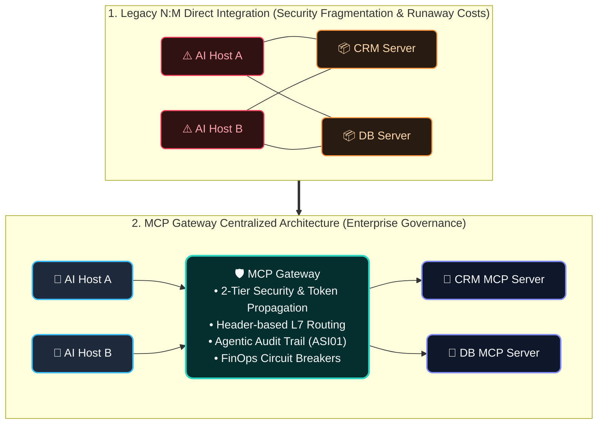
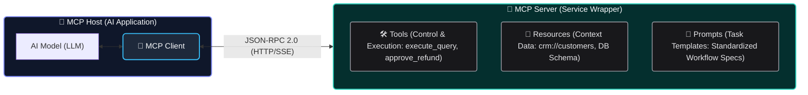
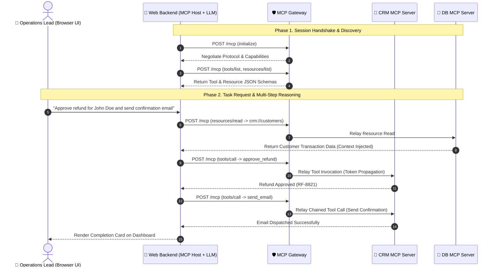
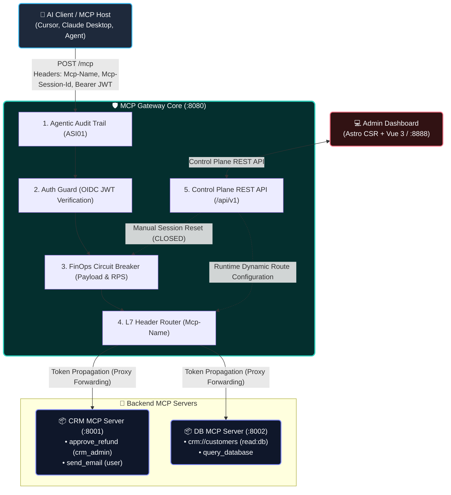
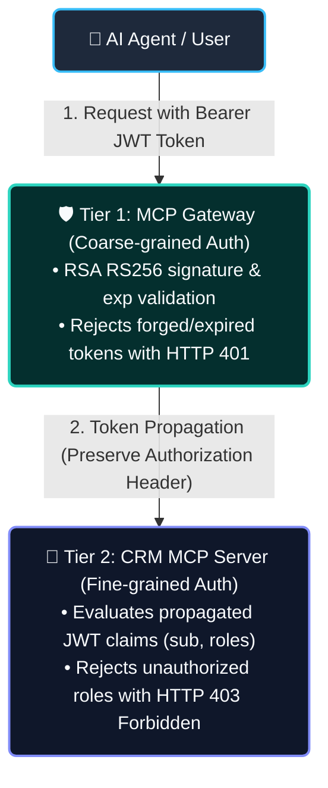

# MCP Gateway Deep Dive: Enterprise AI Agent Tool Integration and Guardrail Architecture

> 📦 **GitHub**: [`joincdream/mcp-gateway`](https://github.com/joincdream/mcp-gateway) &nbsp;|&nbsp; ⚡ **Core**: `Go 1.26` &nbsp;|&nbsp; 💻 **Control Plane**: `Astro CSR` + `Vue 3`  
> 🚀 **Empirical Open-Source Project**: The two-tier security, L7 header-switched routing without JSON-RPC payload parsing, and FinOps circuit breakers covered in this article are validated through production-grade Go code and an independent E2E test suite in [joincdream/mcp-gateway](https://github.com/joincdream/mcp-gateway).

The AI agent ecosystem is evolving rapidly from conversational chatbots answering queries to **Autonomous Agents** orchestrating enterprise business systems. For an agent to independently resolve complex tasks, continuous interaction with external systems is mandatory: querying internal databases, mutating CRM orders, and dispatching customer emails. In this landscape, Anthropic's open **Model Context Protocol (MCP)** has emerged as the leading global standard.

However, moving beyond single-agent laboratory prototypes into production environments where dozens of agents interact with hundreds of enterprise microservices introduces severe engineering hurdles. Unconstrained tool invocations lead to security fragmentation, context window saturation driving explosive token costs, and catastrophic infinite retry loops.

This article examines **why an enterprise requires a dedicated MCP Gateway distinct from traditional API Gateways**. We provide an in-depth analysis of a four-pillar guardrail architecture—Two-Tier Security, Header-based L7 Routing, Agentic Audit Trails, and FinOps Circuit Breakers—alongside our real-world, lightweight **Go-based MCP Gateway implementation**.

---

## Introduction: Chatbots Only Query, but Agents Mutate State

### The Shift from Query-Centric Chatbots to State-Mutating Autonomous Agents

Legacy generative AI applications operated primarily on read-heavy pipelines: generating text in response to user prompts. The primary failure mode was hallucination, which human users could review and filter.

By contrast, 2026 **Agentic AI** systems are fundamentally different. Agents query customer transaction records, invoke refund APIs directly, and sequentially trigger notification emails as **Active Tool Executors**.

The moment a non-deterministic Large Language Model (LLM) is granted **the authority to execute state mutations and invoke tools**, software engineering demands an entirely new dimension of control governance.



### The 4 Architectural Risks of N:M Direct Integration

In early prototypes, connecting an AI agent (MCP Host) directly to an MCP Server seems straightforward. But as adoption scales to dozens of agents connecting directly to hundreds of microservices in an N:M mesh, the architecture collapses into four critical failure modes:

1. **Security & Authorization Fragmentation**: Each backend service implements custom authentication and authorization logic, making enterprise Single Sign-On (SSO) and centralized access governance impossible.
2. **Context Bloat & Runaway Costs**: An agent attempting to query customer details might retrieve an entire table (`crm://customers/all`), bloating the context window and causing token costs to explode.
3. **Agentic Infinite Loops & Retry Storms**: When an agent encounters runtime errors or argument validation exceptions, failed multi-step reasoning can trigger non-deterministic retry loops, bombarding backend services and exhausting compute budgets.
4. **Lack of Traceability**: When mission-critical database state changes, operators cannot determine which agent, under what reasoning context, executed the mutation—a primary threat outlined in OWASP for Agentic Applications 2026 as **ASI01 - Tool Misuse**.

### How MCP Gateways Differ from Traditional API Gateways

The distinction between legacy API Gateways (Kong, Envoy, Spring Cloud Gateway) and an MCP Gateway stems from the fundamental protocol paradigm shift between **RESTful APIs and MCP**:

| Comparison | RESTful API Gateway | MCP Gateway |
| :--- | :--- | :--- |
| **Primary Consumer** | Humans (developers) and deterministic business logic | **AI Models / Autonomous Agents** during runtime dynamic reasoning |
| **Routing Mechanism** | Fixed URL Paths (`/api/v1/orders/{id}`) | **Dynamic L7 Header Switching** within a single session (`POST /mcp`) |
| **Protocol Wire Format** | HTTP Methods (`GET`, `POST`, `PUT`) | **JSON-RPC 2.0** (`initialize`, `tools/call`, etc.) |
| **Interface Definition** | OpenAPI/Swagger (static documents for human developers) | **Self-Describing JSON-Schema** (dynamically interpreted by LLMs) |
| **Core Guardrails** | IP whitelisting, rate limiting per API key | **OWASP ASI01 argument audits, payload size circuit breakers** |

Legacy API Gateways are optimized for static URL path mapping. The MCP standard operates over a single HTTP endpoint (`POST /mcp`) using JSON-RPC bodies for all tool calls and resource reads. Managing MCP with traditional gateways requires unmarshaling multi-kilobyte JSON-RPC payloads on every hop, causing severe CPU spikes, garbage collection pressure, and unacceptable proxy latency.

---

## MCP Core Principles and Enterprise Architecture Redesign

### Self-Describing Interfaces for AI Agents: 3 Roles and 3 Primitives

MCP's core design principle is not simple data transport, but **enabling AI models to autonomously discover the schema, purpose, and constraints of external tools and resources at runtime without prior hardcoded knowledge or code deployments**:



The MCP ecosystem functions through three architectural roles and three core primitives:

* **MCP Host**: The top-level application running the foundation model and driving the agentic loop (e.g., Claude Desktop, Cursor IDE, private enterprise AI portals).
* **MCP Client**: The internal communication module within the host that maintains connections and handles JSON-RPC serialization.
* **MCP Server**: The standalone service wrapping databases, internal microservices, and file systems into three MCP primitives:
  - **Tools (Execution & Control)**: Callable endpoints through which the model effects state mutations (`approve_refund`, `send_email`).
  - **Resources (Contextual Data)**: Passive data sources read into the model's context window (`crm://customers/{id}`).
  - **Prompts (Workflow Templates)**: Reusable, structured instructions that guide the model through standardized business procedures.

### The 6-Step Workflow in an Enterprise AI-Native Web Application

A typical end-to-end execution sequence in an enterprise operations portal unfolds as follows:



1. **Initialization & Handshake (`initialize`)**: When the backend starts, it negotiates supported protocol versions and capabilities with target servers through the gateway.
2. **Self-Discovery (`tools/list`, `resources/list`)**: The backend registers schemas for available tools (`approve_refund`, `send_email`) and resources (`crm://customers`) directly with the model.
3. **Resource Reading for Context (`resources/read`)**: Driven by the user's natural language instruction, the model reads the customer's prior order records to contextualize its decision.
4. **Primary Tool Execution - Approve Refund (`tools/call`)**: Having analyzed the records, the model invokes `approve_refund(order_id: "ORD-99", reason: "Double Billing")`.
5. **Chained Tool Execution - Send Email (`tools/call`)**: Evaluating the output of the first call, the model reasons through the next operational step and calls the notification tool.
6. **Result Rendering**: The web frontend displays the completed transaction status card.

Throughout this entire lifecycle, **the central infrastructure responsible for routing traffic, propagating authorization tokens, and intercepting anomalous or malicious calls is the MCP Gateway.**

---

## Practical PoC: Validating the 4 Enterprise Guardrails with a Go MCP Gateway

To validate this design empirically, we built and tested an open-source, lightweight **Go MCP Gateway featuring an Astro CSR/Vue 3 Control Plane ([`poc/mcp-gateway`](https://github.com/joincdream/mcp-gateway))**:



This architecture cleanly isolates the **Data Plane** from the **Control Plane**:

* **Data Plane (Low-Latency Traffic Relay)**:
  When an MCP Host submits requests to `POST /mcp`, traffic moves sequentially through **`Audit` ➔ `Auth` ➔ `Breaker` ➔ `Router`** middleware, streaming to backend services in under 5ms.
* **Control Plane (Runtime Governance & Policy Control)**:
  Operators access an administrative web dashboard (Astro CSR + Vue 3 at `:8888`) communicating with gateway management APIs (`/api/v1`), dynamically registering routing rules, monitoring tripped circuit breaker sessions, and triggering manual resets.

---

### Two-Tier Security: Avoiding the Monolithic Gateway Anti-Pattern

#### The Engineering Dilemma
Forcing the gateway to evaluate granular business authorization rules (e.g., *"Does this user have crm_admin privileges to approve refunds?"*) creates a **Monolithic Gateway Anti-pattern**, requiring redeploying the core gateway binary whenever business logic or tool schemas change.

#### The Solution: Token Propagation and Separation of Concerns
The MCP Gateway performs **Tier-1 Coarse-Grained Authentication**: validating OIDC JWT signatures issued by corporate IdPs (Keycloak, Entra ID) and verifying expiration timestamps (`exp`). Upon validation, it passes the original `Authorization: Bearer <token>` header downstream (**Token Propagation**). The backend MCP Server extracts claims (`roles`, `scope`) from the propagated token to enforce **Tier-2 Fine-Grained Authorization** at the tool level.



#### Production Go Code

```go
// 1. Gateway Tier-1 Auth Guard Middleware (app/backend/internal/proxy/auth_guard.go)
func AuthGuardMiddleware(next http.Handler) http.Handler {
    return http.HandlerFunc(func(w http.ResponseWriter, r *http.Request) {
        authHeader := r.Header.Get("Authorization")
        if authHeader == "" || !strings.HasPrefix(authHeader, "Bearer ") {
            http.Error(w, `{"error": "Unauthorized", "message": "Missing Bearer token"}`, http.StatusUnauthorized)
            return
        }

        tokenStr := strings.TrimPrefix(authHeader, "Bearer ")
        claims, err := auth.VerifyToken(tokenStr) // RSA RS256 signature and exp check
        if err != nil {
            http.Error(w, `{"error": "Unauthorized", "message": "Invalid token"}`, http.StatusUnauthorized)
            return
        }

        log.Printf("[AuthGuard] Tier-1 validation passed: sub=%s (Starting Token Propagation)", claims.Sub)
        // Pass original Authorization header downstream transparently
        next.ServeHTTP(w, r)
    })
}
```

```go
// 2. Backend CRM MCP Server Tier-2 Fine-Grained Authorization (app/mcp-servers/crm-server/main.go)
func processRPC(req RPCRequest, authHeader string) RPCResponse {
    if req.Method == "tools/call" {
        var params struct { Name string `json:"name"` }
        json.Unmarshal(req.Params, &params)

        // Enforce role check (crm_admin) for high-risk operations like approve_refund
        if params.Name == "approve_refund" && !checkRoleInJWT(authHeader, "crm_admin") {
            log.Printf("[CRM MCP] 403 Forbidden: Insufficient permissions (missing crm_admin)")
            return RPCResponse{
                JSONRPC: "2.0",
                ID:      req.ID,
                Error: map[string]interface{}{
                    "code":    -32003,
                    "message": "Forbidden: Requires crm_admin role for refund approval",
                },
            }
        }
    }
    // ... proceed with tool execution
}
```

* **Gateway Tier-1 (`AuthGuardMiddleware`)**: Verifies signature integrity and expiration using IdP public keys. If valid, passes the header unaltered to `next.ServeHTTP`.
* **Backend Tier-2 (`processRPC`)**: Extracts the `roles` array from the forwarded token. If an agent lacks `crm_admin` when calling `approve_refund`, the server returns **`JSON-RPC -32003 (Forbidden)`**, stopping unauthorized execution.

---

### Header-based L7 Routing

#### The Engineering Dilemma
Because MCP standardizes on `POST /mcp`, unmarshaling the entire JSON-RPC payload on every request to determine the backend destination incurs severe memory allocation overhead and pushes proxy latency beyond 50ms.

#### The Solution: L7 Switching via Custom HTTP Headers
Clients declare the target service in headers: `Mcp-Name: crm-service` and `Mcp-Method: tools/call`. The gateway **inspects headers exclusively, streaming the payload through without unmarshaling the body**, maintaining sub-5ms proxy latency:

```go
// L7 Router: Forward traffic using HTTP headers without parsing the JSON-RPC body
func (h *L7ProxyHandler) ServeHTTP(w http.ResponseWriter, r *http.Request) {
    mcpName := r.Header.Get("Mcp-Name")
    if mcpName == "" {
        http.Error(w, `{"error": "Missing Mcp-Name header"}`, http.StatusBadRequest)
        return
    }

    targetURL, exists := h.cfg.GetRoute(mcpName)
    if !exists {
        http.Error(w, `{"error": "Route not found for Mcp-Name"}`, http.StatusBadGateway)
        return
    }

    // Stream reverse proxy without payload parsing using Go's httputil.SingleHostReverseProxy
    proxy := httputil.NewSingleHostReverseProxy(targetURL)
    originalDirector := proxy.Director
    proxy.Director = func(req *http.Request) {
        originalDirector(req)
        req.Host = targetURL.Host
    }
    proxy.ServeHTTP(w, r)
}
```

Using Go's `httputil.SingleHostReverseProxy`, the gateway routes payloads efficiently in $O(1)$ lookup time.

---

### Agentic Audit Trail (OWASP ASI01 Compliance)

#### The Engineering Dilemma
Traditional web access logs (`POST /mcp 200 OK`) provide zero visibility into agent operations. Operators must be able to reconstruct the reasoning context and explicit arguments associated with every state mutation.

#### The Solution: Structured Reasoning Chain Logging
Using `Mcp-Session-Id`, the gateway records all tool invocations and raw JSON arguments into asynchronous ring buffers and persistent append-only logs, fulfilling **OWASP for Agentic Applications ASI01 (Tool Misuse)** audit requirements:

```json
{
  "id": "20260815214005.120",
  "timestamp": "2026-08-15T12:40:05Z",
  "sessionId": "agent-session-88412",
  "userId": "admin_dev_01",
  "mcpName": "crm-service",
  "mcpMethod": "tools/call",
  "toolName": "approve_refund",
  "arguments": {
    "order_id": "ORD-99",
    "reason": "Customer billing error remediation"
  },
  "responseStatus": 200,
  "executionTimeMs": 14
}
```

---

### FinOps Circuit Breakers: Context Guard & Loop Guard

#### Real-World Validation
If an agent inadvertently requests an oversized dataset or falls into an infinite retry loop, the gateway immediately trips the session state to `OPEN`, protecting backend systems and infrastructure spend:

* **Payload Threshold Guard (Context Guard)**: If a `resources/read` response exceeds a configured ceiling (e.g., 50KB), the gateway trips the session, blocking subsequent requests with **`HTTP 413 Payload Too Large`**.
* **Rate Limit Guard (Loop Guard)**: If tool calls within an active session (`Mcp-Session-Id`) exceed limits (e.g., 10 RPS), the gateway trips the circuit to `OPEN` for 5 seconds, returning **`HTTP 429 Too Many Requests`**.
* **Manual Reset**: Operators can inspect tripped sessions in real time via the Admin Dashboard and reset the circuit to `CLOSED` with a single click.

Empirical output from our standalone E2E validation suite ([`breaker_tester.go`](https://github.com/joincdream/mcp-gateway/blob/main/tools/breaker_tester.go)):

```text
==================================================================
🚀 FinOps Circuit Breaker Independent E2E Test Suite Execution
🎯 Test Execution Mode: [all]
==================================================================

🧪 --- [TEST SCENARIO 1: Rate Limit Guard (Agentic Loop Guard)] ---
1) Normal Request Test (Session: rate-session-175525)...
   Status: 200 | Response: {"jsonrpc":"2.0","result":{...}} -> ✅ 200 OK
2) Burst Request Test: Firing 15 concurrent requests (Limit: 10 RPS)...
   📊 Burst Results -> 200 OK: 10 | 429 Too Many Requests (Tripped): 5
   🎉 SUCCESS: Rate Limit Guard successfully TRIPPED session to OPEN (429 Received!)
3) OPEN State Verification: Sending follow-up request...
   Status: 429 | Response: {"error":"CircuitBreakerTripped","reason":"Rate limit exceeded"}
   ✅ VERIFIED: Gateway immediately BLOCKED request with 429.
4) Admin Reset: Resetting session 'rate-session-175525'...
   ✅ Session reset to CLOSED successfully.
5) Post-Recovery Request: Status 200 OK -> 🎉 FULLY RECOVERED!

------------------------------------------------------------------
🧪 --- [TEST SCENARIO 2: Payload Threshold Guard (Context Guard)] ---
1) Large Payload Request (Session: payload-session-175525, URI: crm://customers/large)...
   Initial Read: 60KB Payload returned -> Gateway marked session as TRIP/OPEN
2) OPEN State Verification: Sending follow-up request...
   Status: 413 | Response: {"error":"CircuitBreakerTripped","reason":"Payload threshold exceeded"}
   🎉 SUCCESS: Gateway immediately BLOCKED follow-up request with 413 Payload Too Large!
3) Admin Reset & Post-Recovery: Status 200 OK -> 🎉 FULLY RECOVERED!
==================================================================
```

---

## Conclusion and Key Takeaways

Enterprise AI agent success is not achieved merely by adopting larger foundation models. It requires governing non-deterministic models using **deterministic software engineering harnesses and infrastructure**:

$$\mathbf{Enterprise\ Agentic\ System = Foundation\ Model + Engineering\ Harness + MCP\ Gateway}$$

Three practical takeaways for architects designing MCP systems:

1. **Enforce Separation of Concerns (SoC)**: Avoid monolithic gateway anti-patterns by implementing Two-Tier Security with Token Propagation.
2. **Eliminate JSON-RPC Body Parsing**: Standardize on L7 HTTP headers (`Mcp-Name`, `Mcp-Session-Id`) to preserve sub-5ms proxy forwarding latencies.
3. **Embed Guardrails Directly into Proxy Middleware**: Relying purely on prompt instructions for safety is fragile. Embed OWASP ASI01 audit trails, payload size guards, and rate-limiting circuit breakers directly into the network proxy layer.

---

## Appendix: MCP JSON-RPC Standard Protocol Specification

This appendix provides a reference specification for the **JSON-RPC 2.0 message wire formats** exchanged between MCP Clients (AI Hosts), the MCP Gateway, and backend MCP Servers.

---

### Session Handshake (`initialize`)

* **Client ➔ Gateway ➔ Server (Request)**:
```json
{
  "jsonrpc": "2.0",
  "id": 1,
  "method": "initialize",
  "params": {
    "protocolVersion": "2024-11-05",
    "capabilities": { "roots": { "listChanged": true }, "sampling": {} },
    "clientInfo": { "name": "Enterprise-Agent-Host", "version": "1.0.0" }
  }
}
```

* **Server ➔ Gateway ➔ Client (Response)**:
```json
{
  "jsonrpc": "2.0",
  "id": 1,
  "result": {
    "protocolVersion": "2024-11-05",
    "capabilities": {
      "tools": { "listChanged": true },
      "resources": { "subscribe": true }
    },
    "serverInfo": { "name": "CRM-MCP-Server", "version": "1.0.0" }
  }
}
```

---

### Tool Discovery (`tools/list`)

* **Client ➔ Server (Request)**:
```json
{
  "jsonrpc": "2.0",
  "id": 2,
  "method": "tools/list",
  "params": {}
}
```

* **Server ➔ Client (Response)**:
```json
{
  "jsonrpc": "2.0",
  "id": 2,
  "result": {
    "tools": [
      {
        "name": "approve_refund",
        "description": "Approves customer refund orders (requires crm_admin permission).",
        "inputSchema": {
          "type": "object",
          "properties": {
            "order_id": { "type": "string", "description": "Order Identifier" },
            "reason": { "type": "string", "description": "Refund justification" }
          },
          "required": ["order_id"]
        }
      }
    ]
  }
}
```

---

### Tool Invocation (`tools/call`)

* **Client ➔ Server (Request - Headers: `Mcp-Name: crm-service`, `Authorization: Bearer <JWT>`)**:
```json
{
  "jsonrpc": "2.0",
  "id": 3,
  "method": "tools/call",
  "params": {
    "name": "approve_refund",
    "arguments": {
      "order_id": "ORD-99",
      "reason": "Billing error remediation"
    }
  }
}
```

* **Server ➔ Client (Response)**:
```json
{
  "jsonrpc": "2.0",
  "id": 3,
  "result": {
    "content": [
      {
        "type": "text",
        "text": "Successfully executed tool 'approve_refund' with args map[order_id:ORD-99 reason:Billing error remediation]"
      }
    ],
    "isError": false
  }
}
```

---

### Resource Reading (`resources/read`)

* **Client ➔ Server (Request - Header: `Mcp-Name: db-service`)**:
```json
{
  "jsonrpc": "2.0",
  "id": 4,
  "method": "resources/read",
  "params": {
    "uri": "crm://customers"
  }
}
```

* **Server ➔ Client (Response)**:
```json
{
  "jsonrpc": "2.0",
  "id": 4,
  "result": {
    "contents": [
      {
        "uri": "crm://customers",
        "mimeType": "application/json",
        "text": "[{\"id\": 101, \"name\": \"John Doe\", \"email\": \"johndoe@enterprise.internal\", \"status\": \"active\", \"recent_order\": \"ORD-99\"}]"
      }
    ]
  }
}
```
