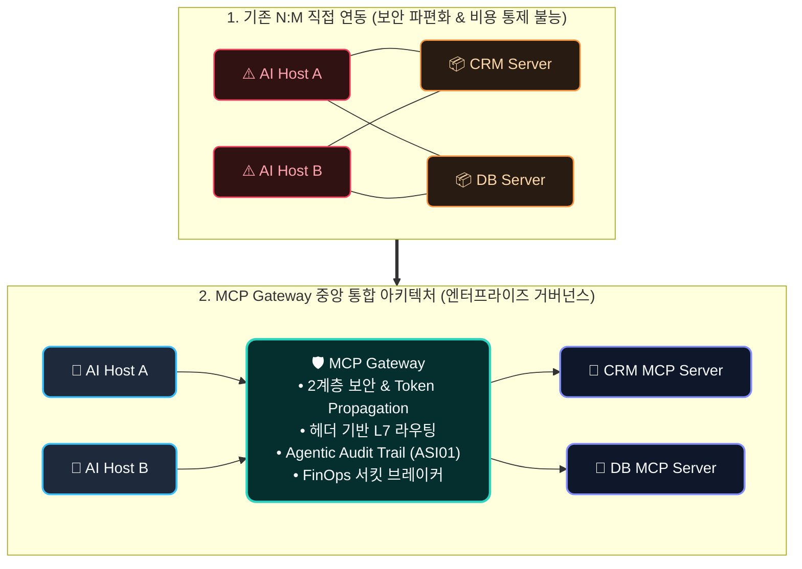
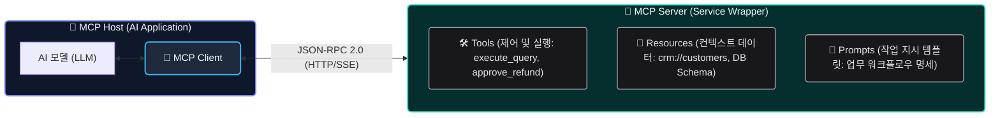
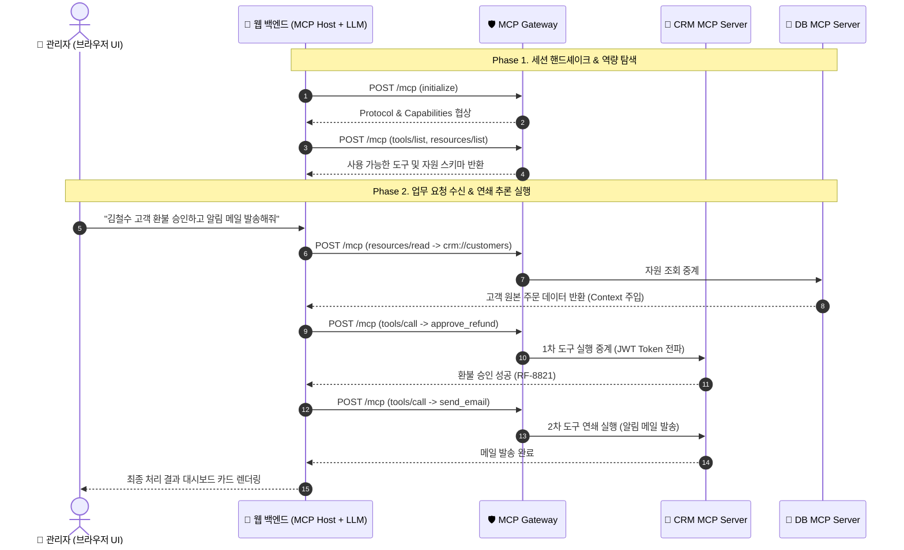
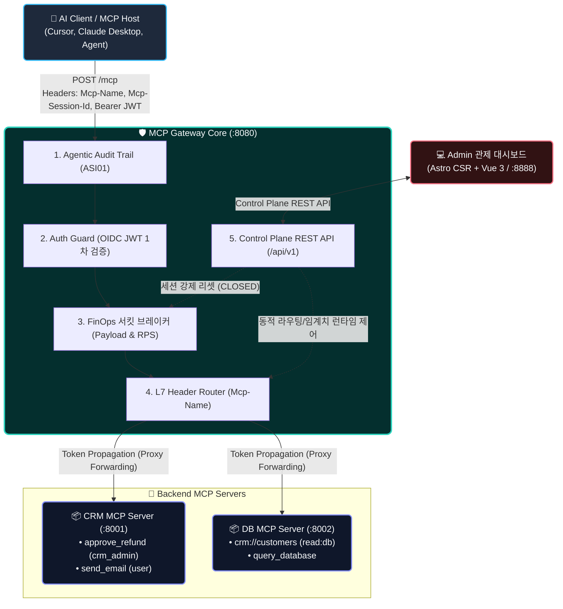
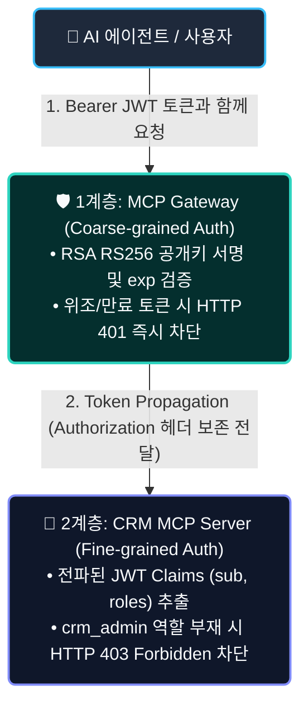

# MCP Gateway 딥다이브: 엔터프라이즈 AI 에이전트 도구 통합과 가드레일 아키텍처

> 📦 **GitHub**: [`joincdream/mcp-gateway`](https://github.com/joincdream/mcp-gateway) &nbsp;|&nbsp; ⚡ **Core**: `Go 1.26` &nbsp;|&nbsp; 💻 **Control Plane**: `Astro CSR` + `Vue 3`  
> 🚀 **실증 오픈소스 프로젝트**: 본 아티클에서 다루는 2계층 보안, L7 무파싱 라우팅, FinOps 서킷 브레이커는 [joincdream/mcp-gateway](https://github.com/joincdream/mcp-gateway)의 실전 Go 코드 및 독립 E2E 테스트 스위트로 검증되었습니다.

AI 에이전트 생태계가 사용자의 질문에 답하는 단순 대화형 챗봇에서, 업무 시스템 전반을 자율적으로 조율하는 **Autonomous Agent**로 빠르게 진화하고 있습니다. 에이전트가 복잡한 업무를 스스로 완수하기 위해서는 사내 데이터베이스를 조회하고, CRM 주문을 변경하며, 이메일을 발송하는 등 외부 시스템과의 끊임없는 상호작용이 필수적입니다. 이러한 흐름 속에서 앤트로픽(Anthropic)이 주도하는 오픈 프로토콜인 **MCP(Model Context Protocol)가** 글로벌 표준 규격으로 급부상하고 있습니다.

하지만 연구실 수준의 단일 에이전트 토이 프로젝트를 넘어, 수십 개의 에이전트와 수백 개의 엔터프라이즈 마이크로서비스가 맞물리는 실제 프로덕션 환경에 MCP를 도입하려고 하면 거대한 엔지니어링 장벽에 부딪히게 됩니다. 통제되지 않은 에이전트의 도구 호출은 보안 파편화, Context Window 과부하로 인한 토큰 비용 폭증, 그리고 무한 루프 장애라는 치명적인 아키텍처 리스크를 야기하기 때문입니다.

본 글에서는 **"왜 엔터프라이즈 환경에서는 기존 API Gateway와 구별되는 독립된 MCP Gateway가 필수적인가?"** 라는 엔지니어링 요구사항을 분석하고, 2계층 보안, 헤더 기반 L7 라우팅, Agentic Audit Trail, FinOps 서킷 브레이커로 구성된 4대 핵심 가드레일 아키텍처와 이를 실제로 검증한 **Go 언어 기반 경량 MCP Gateway PoC 구현 사례**를 심층 분석합니다.

---

## 들어가며: 챗봇은 조회만 하지만, 에이전트는 상태를 변경한다

### 조회(Query) 중심 챗봇에서 상태 변경(State Mutation) 권한을 가진 자율 에이전트로의 전환

과거의 생성형 AI 애플리케이션은 사용자의 프롬프트에 맞춰 텍스트를 생성하는 조회 중심(Read-heavy) 파이프라인이었습니다. 주로 발생할 수 있는 리스크는 사실과 다른 정보를 그럴듯하게 생성하는 환각(Hallucination) 정도였으며, 이는 사용자가 검토하여 충분히 걸러낼 수 있었습니다.

그러나 2026년 현재의 **에이전틱 AI(Agentic AI)는** 근본적으로 다릅니다. 에이전트는 사내 주문 데이터베이스에서 결제 내역을 조회한 뒤, 환불 승인 API를 직접 호출하고 고객에게 완료 메일까지 연쇄적으로 발송하는 **능동적인 도구 실행자(Active Tool Executor)** 입니다.

비결정론적(Non-deterministic)으로 동작하는 거대 언어 모델(LLM)에 **시스템의 상태 변경(State Mutation) 및 실행 제어 권한**이 부여되는 순간, 소프트웨어 엔지니어링 관점에서는 완전히 새로운 차원의 통제 거버넌스가 요구됩니다.



### N:M 직접 연동 방식의 4대 아키텍처 리스크 (Architectural Risks)

개발 초기에는 개별 AI 에이전트(MCP Host)가 필요한 백엔드 MCP Server와 1:1로 직접 연결되어도 큰 문제가 없어 보입니다. 하지만 사내 도입이 가속화되어 수십 개의 에이전트와 수백 개의 마이크로서비스가 N:M 방식으로 직접 연결되는 순간, 시스템은 통제 불능의 상태에 직면합니다.

1. **보안 및 인가의 파편화 (Security Fragmentation)**: 
   개별 백엔드 서비스마다 서로 다른 인증 방식을 요구하거나 자체 인가 검증 로직을 제각각 구현하면서, 전사적인 SSO(Single Sign-On) 및 일관된 권한 통제가 불가능해집니다.
2. **Context Window 과부하와 FinOps 비용 폭증 (Context Bloat & Cost Explosion)**: 
   에이전트가 고객 정보를 조회하려다 대량의 고객 테이블 전체 데이터(`crm://customers/all`)를 한 번에 조회하는 경우, 대규모 컨텍스트 과부하(Context Bloat)가 발생하며 토큰 비용이 급격히 증가합니다.
3. **에이전트 무한 루프 장애 (Agentic Infinite Loop & Retry Storm)**: 
   도구 호출 인자 오류나 일시적 백엔드 장애가 일어났을 때, 에이전트의 연쇄 추론 실패로 인해 동일한 도구를 계속 재시도하며 백엔드에 과부하를 집중시키는 무한 루프에 빠질 수 있습니다.
4. **감사 추적성의 부재 (Lack of Traceability)**: 
   사내 DB의 핵심 데이터가 변경되었을 때, "어떤 에이전트가 어떤 추론 맥락(Reasoning Context)에서 어떤 인자값(Arguments)으로 해당 요청을 실행했는지" 추적할 수 없습니다 (OWASP for Agentic Applications 2026의 **ASI01 - Tool Misuse** 위협).

### 기존 API Gateway와의 차별점: MCP의 프로토콜 패러다임 차이

기존의 API Gateway(Kong, Envoy, Spring Cloud Gateway 등)와 MCP Gateway의 근본적인 차이는 **RESTful API와 MCP 프로토콜의 통신 패러다임 차이**에서 비롯됩니다.

| 비교 항목 | RESTful API Gateway | MCP Gateway |
| :--- | :--- | :--- |
| **주요 소비 주체** | 사람(개발자) 및 정적 비즈니스 코드 | **AI 모델 / 자율 에이전트**의 런타임 동적 추론 |
| **라우팅 메커니즘** | 고정된 URL Path (`/api/v1/orders/{id}`) | 단일 세션(`POST /mcp`) 내 **동적 L7 헤더 스위칭** |
| **프로토콜 규격** | HTTP Methods (`GET`, `POST`, `PUT`) | **JSON-RPC 2.0** (`initialize`, `tools/call` 등) |
| **인터페이스 명세 방식** | OpenAPI/Swagger (개발자 판독용 정적 문서) | **Self-Describing JSON-Schema** (LLM 직접 해석) |
| **핵심 가드레일** | 네트워크 IP 화이트리스트, API Key Rate Limit | **OWASP ASI01 인자 감사, Payload 임계치 서킷 브레이커** |

기존 API Gateway는 URL Path 기반 매핑에 최적화되어 있습니다. 반면 MCP 표준은 단일 HTTP 엔드포인트(`POST /mcp`) 연결 세션 안에서 JSON-RPC 본문으로 모든 도구와 자원을 동적으로 주고받습니다. 기존 API Gateway로 이를 통제하려면 매 요청마다 수십~수백 KB에 달하는 요청/응답 본문을 일일이 역직렬화(Parsing)해야 하므로, 게이트웨이의 CPU 사용량이 급증하고 역직렬화 병목으로 인해 프록시 지연시간(Latency)이 크게 증가합니다.

---

## MCP 핵심 원리와 엔터프라이즈 아키텍처의 재구성

### AI 에이전트를 위한 자가 서술형(Self-Describing) 인터페이스: 3대 역할과 3대 핵심 구성 요소

MCP의 핵심 설계 원칙(Design Principles)은 단순한 데이터 전송이 아니라, **"AI 모델이 사전 지식이나 별도의 코드 수정 없이도 외부 도구와 데이터의 스키마 및 목적을 런타임에 자가 탐색(Self-Discovery)할 수 있도록 인터페이스를 제공하는 것"**입니다.



MCP 생태계는 명확한 3대 주체와 3대 핵심 구성 요소(Core Components)로 동작합니다.

* **MCP Host (호스트)**: AI 모델을 내장하고 전체 에이전트 워크플로우를 주도하는 최상위 애플리케이션입니다 (예: Claude Desktop, Cursor IDE, 사내 AI 업무 백엔드).
* **MCP Client (클라이언트)**: Host 내부에서 MCP Server와의 연결 세션을 수립하고 JSON-RPC 메시지 송수신을 전담하는 통신 모듈입니다.
* **MCP Server (서버)**: 기존 DB, 사내 마이크로서비스, 파일시스템을 MCP 3대 구성 요소로 포장하여 제공하는 독립 서비스입니다.
  - **Tools (도구 - 제어 및 실행)**: AI 모델이 실행을 지시하는 함수형 엔드포인트입니다 (`approve_refund`, `send_email`).
  - **Resources (자원 - 컨텍스트 데이터)**: AI 모델이 읽어서 컨텍스트 윈도우에 주입받는 데이터 소스입니다 (`crm://customers/{id}`).
  - **Prompts (프롬프트 - 작업 지시 템플릿)**: 복잡한 업무 절차를 표준화하여 모델에 안내하는 사전 정의된 템플릿입니다.

### 엔터프라이즈 AI Native 웹 애플리케이션의 6단계 처리 시나리오

엔터프라이즈 지능형 업무 포털에서 MCP가 작동하는 실무 엔드투엔드 시퀀스입니다.



1. **초기화 및 핸드셰이크 (`initialize`)**: 웹 백엔드가 시작될 때 Gateway를 통해 타겟 백엔드 서버들과 프로토콜 버전 및 지원 기능(Capabilities) 범위를 조율합니다.
2. **도구 및 자원 자가 탐색 (`tools/list`, `resources/list`)**: 백엔드 서비스들이 제공하는 도구(`approve_refund`, `send_email`)와 자원(`crm://customers`)의 입력 스키마를 수집하여 LLM에 등록합니다.
3. **컨텍스트 데이터 주입을 위한 자원 조회 (`resources/read`)**: 관리자의 자연어 명령을 받은 LLM이 환불 결정을 내리기 위해 먼저 고객의 과거 주문 로그 데이터를 읽어 컨텍스트에 주입합니다.
4. **1차 도구 실행 - 환불 승인 (`tools/call`)**: LLM이 주문 데이터를 검토한 후 `approve_refund(order_id: "ORD-99", reason: "결제오류")` 도구를 호출합니다.
5. **2차 도구 연쇄 실행 - 메일 발송 (`tools/call`)**: 1차 실행 결과를 확인한 LLM이 후속 동작을 추론(Multi-step Reasoning)하여 고객 안내 메일 발송 도구를 연쇄 호출합니다.
6. **결과 렌더링**: 모든 처리 상태를 종합하여 웹 UI에 성공 카드를 렌더링합니다.

이 모든 과정에서 **트래픽을 중계하고, 토큰을 전파하며, 악의적이거나 비정상적인 호출을 가로막는 중앙 인프라가 바로 MCP Gateway**입니다.

---

## 실전 PoC: Go MCP Gateway로 검증한 4대 엔터프라이즈 가드레일

이론적 설계를 실증하기 위해 직접 구축한 **Go 기반 경량 MCP Gateway 및 Astro CSR/Vue 3 Control Plane 오픈소스 프로젝트([`poc/mcp-gateway`](https://github.com/joincdream/mcp-gateway))의** 구현 아키텍처와 4대 가드레일 검증 결과를 분석합니다.



위 아키텍처는 실시간 트래픽을 처리하는 **데이터 플레인(Data Plane)**과 시스템을 런타임 제어하는 **컨트롤 플레인(Control Plane)**으로 명확히 역할이 분리되어 있습니다.

* **데이터 플레인 (Data Plane - 실시간 트래픽 중계 파이프라인)**:
  클라이언트(MCP Host)가 `POST /mcp` 엔드포인트로 도구 실행을 요청하면, 게이트웨이 내부에서 **`Audit`(감사 로깅) ➔ `Auth`(1차 JWT 서명 검증) ➔ `Breaker`(서킷 브레이커 검사) ➔ `Router`(L7 헤더 스위칭)** 순의 단방향 미들웨어 체인을 거쳐 타겟 백엔드 CRM/DB 마이크로서비스로 5ms 이내에 초저지연 중계됩니다.
* **컨트롤 플레인 (Control Plane - 런타임 관제 및 정책 제어)**:
  관리자는 별도의 관제 웹 대시보드(Astro CSR + Vue 3 / `:8888`)를 통해 게이트웨이 REST API(`/api/v1`)와 통신하며, 백엔드 라우팅 테이블을 동적으로 등록·수정하거나 임계치 초과로 트립(`OPEN`)된 에이전트 세션을 실시간 감시하고 수동 복구(`CLOSED` Reset)합니다.

---

### 2계층 보안(Two-Tier Security)과 모놀리식 게이트웨이 안티패턴(Monolithic Anti-pattern)의 회피

#### 엔지니어링 딜레마
게이트웨이가 개별 도구의 비즈니스 인가 로직(예: *"이 사용자가 환불을 승인할 수 있는 관리자 권한이 있는가?"*)까지 모두 처리하게 되면, 신규 도구가 추가되거나 비즈니스 규칙이 변경될 때마다 게이트웨이 코드를 수정하고 배포해야 하는 **모놀리식 게이트웨이 안티패턴(Monolithic Gateway Anti-pattern)에** 빠지게 됩니다.

#### 해결책: Token Propagation과 관심사의 분리 (SoC)
MCP Gateway는 사내 IdP(Keycloak, Azure AD)가 발급한 OIDC JWT 토큰의 **서명과 만료 여부만 검증하는 1계층 검증(Coarse-grained Auth)을** 전담합니다. 1차 검증을 통과하면 `Authorization` 헤더의 JWT 토큰을 백엔드로 원본 그대로 전달(**Token Propagation**)합니다. 백엔드 MCP Server는 전파받은 토큰의 Claims(`roles`, `scope`)를 추출하여 개별 도구 실행 권한을 최종 판단(**2계층: Fine-grained Auth**)합니다.



#### 실전 Go 구현 코드 및 동작 분석

```go
// 1. Gateway 1계층 Auth Guard 미들웨어 (app/backend/internal/proxy/auth_guard.go)
func AuthGuardMiddleware(next http.Handler) http.Handler {
    return http.HandlerFunc(func(w http.ResponseWriter, r *http.Request) {
        authHeader := r.Header.Get("Authorization")
        if authHeader == "" || !strings.HasPrefix(authHeader, "Bearer ") {
            http.Error(w, `{"error": "Unauthorized", "message": "Missing Bearer token"}`, http.StatusUnauthorized)
            return
        }

        tokenStr := strings.TrimPrefix(authHeader, "Bearer ")
        claims, err := auth.VerifyToken(tokenStr) // RSA RS256 서명 및 exp 검증
        if err != nil {
            http.Error(w, `{"error": "Unauthorized", "message": "Invalid token"}`, http.StatusUnauthorized)
            return
        }

        log.Printf("[AuthGuard] 1차 검증 성공: sub=%s (Token Propagation 시작)", claims.Sub)
        // 1차 검증 성공: Authorization 헤더를 백엔드로 투명 전달 (Token Propagation)
        next.ServeHTTP(w, r)
    })
}
```

* **Gateway 1계층 검증 (`AuthGuardMiddleware`)**:
  - 클라이언트 요청의 `Authorization: Bearer <token>` 헤더를 파싱하여 사내 IdP의 RSA RS256 공개키로 서명 무결성 및 만료 시간(`exp`)을 검증합니다.
  - 서명이 유효하면 `next.ServeHTTP(w, r)`를 호출할 때 **헤더를 변조하지 않고 원본 그대로 유지하여 백엔드 MCP Server로 투명하게 전파(Token Propagation)**합니다.

```go
// 2. 백엔드 CRM MCP Server 2계층 Fine-grained 인가 로직 (app/mcp-servers/crm-server/main.go)
func processRPC(req RPCRequest, authHeader string) RPCResponse {
    if req.Method == "tools/call" {
        var params struct { Name string `json:"name"` }
        json.Unmarshal(req.Params, &params)

        // 중요 권한 도구(approve_refund) 실행 시 전파된 JWT의 crm_admin 역할 체크
        if params.Name == "approve_refund" && !checkRoleInJWT(authHeader, "crm_admin") {
            log.Printf("[CRM MCP] 403 Forbidden: 환불 승인 권한(crm_admin) 부족")
            return RPCResponse{
                JSONRPC: "2.0",
                ID:      req.ID,
                Error: map[string]interface{}{
                    "code":    -32003,
                    "message": "Forbidden: Requires crm_admin role for refund approval",
                },
            }
        }
    }
    // ... 정상 실행 로직
}
```

* **백엔드 2계층 세부 인가 (`processRPC`)**:
  - 게이트웨이가 전파해 준 JWT Claims에서 `roles` 배열을 파싱합니다.
  - 환불 승인(`approve_refund`)과 같은 고위험 비즈니스 도구 호출 시 `crm_admin` 역할이 없으면 즉시 **`JSON-RPC -32003 (Forbidden)` 에러를 반환하여 세부 권한을 차단**합니다.

---

### 헤더 기반 L7 라우팅 (Header-based L7 Routing)

#### 엔지니어링 딜레마
앞서 언급했듯 MCP 프로토콜은 단일 엔드포인트(`POST /mcp`)를 사용합니다. 게이트웨이가 요청을 어떤 백엔드 서버로 보낼지 결정하기 위해 매번 무거운 JSON-RPC Body 전체를 역직렬화(Unmarshal)하면 엄청난 메모리 복사와 CPU 오버헤드가 발생하여 프록시 레이턴시가 50ms 이상 치솟게 됩니다.

#### 해결책: HTTP 커스텀 헤더 기반 L7 스위칭
클라이언트가 요청을 보낼 때 타겟 서비스 식별자를 HTTP 헤더(`Mcp-Name: crm-service`, `Mcp-Method: tools/call`)에 명시하도록 규정합니다. 게이트웨이는 **본문을 전혀 건드리지 않고 헤더만 검사하여 타겟 마이크로서비스로 즉시 스트리밍 프록시 패스를 수행**함으로써 **추가 지연시간 5ms 이하의 초저지연 성능**을 달성했습니다.

```go
// L7 Router: JSON-RPC 본문 파싱 없이 HTTP 헤더로 타겟 백엔드 스위칭
func (h *L7ProxyHandler) ServeHTTP(w http.ResponseWriter, r *http.Request) {
    mcpName := r.Header.Get("Mcp-Name")
    if mcpName == "" {
        http.Error(w, `{"error": "Missing Mcp-Name header"}`, http.StatusBadRequest)
        return
    }

    targetURL, exists := h.cfg.GetRoute(mcpName)
    if !exists {
        http.Error(w, `{"error": "Route not found for Mcp-Name"}`, http.StatusBadGateway)
        return
    }

    // Go 표준 httputil.SingleHostReverseProxy를 통해 본문 파싱 없이 스트리밍 포워딩
    proxy := httputil.NewSingleHostReverseProxy(targetURL)
    originalDirector := proxy.Director
    proxy.Director = func(req *http.Request) {
        originalDirector(req)
        req.Host = targetURL.Host
    }
    proxy.ServeHTTP(w, r)
}
```

* **L7 Router 동작 원리 (`ServeHTTP`)**:
  - 요청 본문(Body)을 역직렬화하지 않고 `Mcp-Name` 헤더만 추출하여 동적 라우팅 테이블(`cfg.GetRoute`)에서 대상 백엔드 URL을 $O(1)$로 조회합니다.
  - Go 표준 `httputil.NewSingleHostReverseProxy`를 활용하여 추가 메모리 복사 없이 **스트리밍 역방향 프록시 패스를 수행함으로써 5ms 이하의 초저지연 중계**를 달성합니다.

---

### Agentic Audit Trail (OWASP ASI01 감사 추적)

#### 엔지니어링 딜레마
기존 웹 프록시의 접속 로그(`GET /api/v1/orders 200 OK`)는 에이전트 환경에서 아무런 의미가 없습니다. 에이전트의 오작동이나 내부자 위협을 방어하려면 **"에이전트가 어떤 추론 맥락(Reasoning Context)에서 어떤 인자값(Arguments)으로 시스템 상태를 변경했는가"를** 세션 단위로 기록해야 합니다.

#### 해결책: 멀티스텝 추론 체인 구조화 로깅
게이트웨이는 `Mcp-Session-Id`를 기준으로 에이전트의 전체 추론 루프를 추적하며, 실행된 도구명과 원본 JSON Arguments를 비동기 링버퍼(Ring Buffer)와 파일 스트림에 적재하여 **OWASP for Agentic Applications ASI01(Tool Misuse)** 감사 체계를 완성했습니다.

```json
{
  "id": "20260815214005.120",
  "timestamp": "2026-08-15T12:40:05Z",
  "sessionId": "agent-session-88412",
  "userId": "admin_dev_01",
  "mcpName": "crm-service",
  "mcpMethod": "tools/call",
  "toolName": "approve_refund",
  "arguments": {
    "order_id": "ORD-99",
    "reason": "결제오류 이중과금 환불 승인"
  },
  "responseStatus": 200,
  "executionTimeMs": 14
}
```

---

### FinOps 서킷 브레이커 (Context Guard & Loop Guard)

#### 서킷 브레이커 동작 원리 및 실증 데이터
에이전트가 예기치 않게 60KB가 넘는 대용량 DB 자원을 읽어 토큰 소비를 급증시키거나, 초당 수십 건의 도구를 반복 호출하는 무한 루프에 빠질 경우, 게이트웨이가 즉시 서킷 상태를 `OPEN`으로 전환하여 사내 시스템과 클라우드 비용을 방어해야 합니다.

* **Payload Threshold Guard (Context Guard)**: `resources/read` 응답 페이로드가 설정된 임계치(기본: 50KB)를 초과하면 즉시 세션을 트립시키고 후속 요청에 **`HTTP 413 Payload Too Large`** 반환.
* **Rate Limit Guard (Agentic Loop Guard)**: 동일 세션(`Mcp-Session-Id`)에서 초당 도구 호출 수가 임계치(기본: 10 RPS)를 초과하면 5초간 서킷을 `OPEN`하고 **`HTTP 429 Too Many Requests`** 반환.
* **런타임 수동 복구(Manual Reset)**: 관리자가 Admin 관제 대시보드([`http://localhost:8888`](http://localhost:8888))에서 트립된 세션을 실시간 확인하고 원클릭으로 `CLOSED` 정상 상태로 즉시 강제 복구 가능.

독립 E2E 테스트 스위트([`breaker_tester.go`](https://github.com/joincdream/mcp-gateway/blob/main/tools/breaker_tester.go))를 구동하여 실측한 결과는 다음과 같습니다.

```text
==================================================================
🚀 FinOps Circuit Breaker Independent E2E Test Suite Execution
🎯 Test Execution Mode: [all]
==================================================================

🧪 --- [TEST SCENARIO 1: Rate Limit Guard (Agentic Loop Guard)] ---
1) Normal Request Test (Session: rate-session-175525)...
   Status: 200 | Response: {"jsonrpc":"2.0","result":{...}} -> ✅ 200 OK
2) Burst Request Test: Firing 15 concurrent requests (Limit: 10 RPS)...
   📊 Burst Results -> 200 OK: 10 | 429 Too Many Requests (Tripped): 5
   🎉 SUCCESS: Rate Limit Guard successfully TRIPPED session to OPEN (429 Received!)
3) OPEN State Verification: Sending follow-up request...
   Status: 429 | Response: {"error":"CircuitBreakerTripped","reason":"Rate limit exceeded"}
   ✅ VERIFIED: Gateway immediately BLOCKED request with 429.
4) Admin Reset: Resetting session 'rate-session-175525'...
   ✅ Session reset to CLOSED successfully.
5) Post-Recovery Request: Status 200 OK -> 🎉 FULLY RECOVERED!

------------------------------------------------------------------
🧪 --- [TEST SCENARIO 2: Payload Threshold Guard (Context Guard)] ---
1) Large Payload Request (Session: payload-session-175525, URI: crm://customers/large)...
   Initial Read: 60KB Payload returned -> Gateway marked session as TRIP/OPEN
2) OPEN State Verification: Sending follow-up request...
   Status: 413 | Response: {"error":"CircuitBreakerTripped","reason":"Payload threshold exceeded"}
   🎉 SUCCESS: Gateway immediately BLOCKED follow-up request with 413 Payload Too Large!
3) Admin Reset & Post-Recovery: Status 200 OK -> 🎉 FULLY RECOVERED!
==================================================================
```

---

## 결론 및 엔지니어링 실무 권고사항 (Key Takeaways)

엔터프라이즈 AI 에이전트 시스템의 성공은 단순히 더 뛰어난 거대 언어 모델을 선택하는 데 있지 않습니다. 비결정론적 모델이 사내 시스템을 훼손하지 않도록 통제하는 **결정론적인 소프트웨어 엔지니어링 하네스(Harness)와 인프라의 결합**에 있습니다.

$$\mathbf{Enterprise\ Agentic\ System = Foundation\ Model + Engineering\ Harness + MCP\ Gateway}$$

엔터프라이즈 환경에서 MCP 기반 에이전트 시스템을 설계할 때 기억해야 할 3대 실무 권고사항입니다.

1. **관심사의 분리(SoC)를 엄격히 준수하십시오**: 게이트웨이가 모든 비즈니스 인가 로직을 직접 검증하여 비대해지는 안티패턴을 피하고, Token Propagation을 통한 2계층 보안 체계를 구축하십시오.
2. **JSON-RPC 본문 파싱을 지양하십시오**: L7 HTTP 헤더(`Mcp-Name`, `Mcp-Session-Id`)를 표준화하여 본문 파싱 없는 초저지연 프록시 라우팅을 구현하십시오.
3. **가드레일을 인프라 프록시 계층에 미들웨어로 내재화하십시오**: 애플리케이션 레벨의 프롬프트 지시어에만 의존하는 안전장치는 비결정론적 특성으로 인해 우회될 수 있습니다. OWASP ASI01 감사 로깅과 대용량 페이로드/RPS 서킷 브레이커를 게이트웨이 프록시 계층에 미들웨어로 내재화하여 예기치 않은 토큰 비용 급증과 무한 루프를 원천 차단하십시오.

---

## Appendix: MCP JSON-RPC 표준 프로토콜 메시지 규격

본 부록(Appendix)은 MCP(Model Context Protocol) 클라이언트(AI 에이전트/호스트)와 MCP Gateway, 그리고 백엔드 MCP Server 간에 실제로 송수신되는 **JSON-RPC 2.0 기반 표준 메시지 규격과 실전 페이로드 구조**를 정리한 참조 명세입니다.

---

### 세션 초기화 핸드셰이크 (`initialize`)

클라이언트와 서버가 최초 연결 시 프로토콜 버전과 지원 가능한 기능 범위(Capabilities)를 상호 협상하는 단계입니다.

* **Client ➔ Gateway ➔ Server (요청)**:
```json
{
  "jsonrpc": "2.0",
  "id": 1,
  "method": "initialize",
  "params": {
    "protocolVersion": "2024-11-05",
    "capabilities": { "roots": { "listChanged": true }, "sampling": {} },
    "clientInfo": { "name": "Enterprise-Agent-Host", "version": "1.0.0" }
  }
}
```
*요청 설명: 클라이언트가 지원하는 프로토콜 규격 버전(`protocolVersion`)과 루트 변경 알림 등의 역량(`capabilities`), 호스트 식별 정보(`clientInfo`)를 서버로 전달합니다.*

* **Server ➔ Gateway ➔ Client (응답)**:
```json
{
  "jsonrpc": "2.0",
  "id": 1,
  "result": {
    "protocolVersion": "2024-11-05",
    "capabilities": {
      "tools": { "listChanged": true },
      "resources": { "subscribe": true }
    },
    "serverInfo": { "name": "CRM-MCP-Server", "version": "1.0.0" }
  }
}
```
*응답 설명: 서버가 지원하는 프로토콜 버전 및 서버 정보(`serverInfo`)와 함께 도구 목록 변경 감지, 자원 구독(`subscribe`) 등의 서버 기능 범위를 클라이언트에 확정 반환합니다.*

---

### 사용 가능한 도구 목록 탐색 (`tools/list`)

AI 모델이 런타임에 호출할 수 있는 백엔드 마이크로서비스의 도구 이름과 파라미터 스키마를 동적으로 조회(Self-Discovery)하는 단계입니다.

* **Client ➔ Server (요청)**:
```json
{
  "jsonrpc": "2.0",
  "id": 2,
  "method": "tools/list",
  "params": {}
}
```

* **Server ➔ Client (응답)**:
```json
{
  "jsonrpc": "2.0",
  "id": 2,
  "result": {
    "tools": [
      {
        "name": "approve_refund",
        "description": "고객 결제 건에 대한 환불 승인을 처리합니다 (crm_admin 권한 필요).",
        "inputSchema": {
          "type": "object",
          "properties": {
            "order_id": { "type": "string", "description": "주문 번호" },
            "reason": { "type": "string", "description": "환불 사유" }
          },
          "required": ["order_id"]
        }
      }
    ]
  }
}
```
 *응답 설명: 서버가 제공하는 각 도구의 이름(`name`), 목적 설명(`description`), 그리고 LLM이 파라미터를 올바르게 구성할 수 있도록 표준 **JSON Schema 규격의 `inputSchema`** 를 배열 형태로 제공합니다.*

---

### 도구 실행 요청 (`tools/call`)

AI 모델이 자연어 지시를 해석하여 특정 도구의 실행을 결정하고 필요한 인자값을 담아 호출하는 단계입니다.

* **Client ➔ Server (요청 - Header: `Mcp-Name: crm-service`, `Authorization: Bearer <JWT>`)**:
```json
{
  "jsonrpc": "2.0",
  "id": 3,
  "method": "tools/call",
  "params": {
    "name": "approve_refund",
    "arguments": {
      "order_id": "ORD-99",
      "reason": "결제오류 이중과금 환불 승인"
    }
  }
}
```
*요청 설명: 호출할 대상 도구명(`name`)과 LLM이 생성한 구체적인 실행 인자(`arguments`)를 전송합니다. L7 라우팅을 위한 `Mcp-Name` 및 보안 검증을 위한 OIDC Bearer 토큰이 HTTP 헤더에 함께 포함됩니다.*

* **Server ➔ Client (응답)**:
```json
{
  "jsonrpc": "2.0",
  "id": 3,
  "result": {
    "content": [
      {
        "type": "text",
        "text": "Successfully executed tool 'approve_refund' with args map[order_id:ORD-99 reason:결제오류 이중과금 환불 승인]"
      }
    ],
    "isError": false
  }
}
```
*응답 설명: 도구의 실제 실행 결과 텍스트(`content[].text`)와 오류 발생 여부(`isError`)를 반환하며, 이 데이터는 다시 LLM의 컨텍스트 윈도우에 주입되어 후속 연쇄 추론(Multi-step Reasoning)에 활용됩니다.*

---

### 자원 데이터 읽기 (`resources/read`)

AI 모델이 작업 수행에 필요한 배경 지식이나 시스템 원본 데이터를 URI 스킴 기반으로 조회하여 컨텍스트에 주입받는 단계입니다.

* **Client ➔ Server (요청 - Header: `Mcp-Name: db-service`)**:
```json
{
  "jsonrpc": "2.0",
  "id": 4,
  "method": "resources/read",
  "params": {
    "uri": "crm://customers"
  }
}
```
*요청 설명: 조회 대상 자원의 고유 식별자(`uri`)를 지정하여 요청합니다. 게이트웨이는 `Mcp-Name` 헤더를 기반으로 대상 DB 서비스로 즉시 프록시 라우팅합니다.*

* **Server ➔ Client (응답)**:
```json
{
  "jsonrpc": "2.0",
  "id": 4,
  "result": {
    "contents": [
      {
        "uri": "crm://customers",
        "mimeType": "application/json",
        "text": "[{\"id\": 101, \"name\": \"김철수\", \"email\": \"chulsoo@cloit.com\", \"status\": \"active\", \"recent_order\": \"ORD-99\"}]"
      }
    ]
  }
}
```
*응답 설명: 해당 URI에 매핑된 원본 데이터의 MIME 타입(`application/json`)과 텍스트 내용(`contents[].text`)을 반환합니다. 게이트웨이는 이 응답 크기를 감시하여 50KB 초과 시 서킷 브레이커를 작동시킵니다.*
