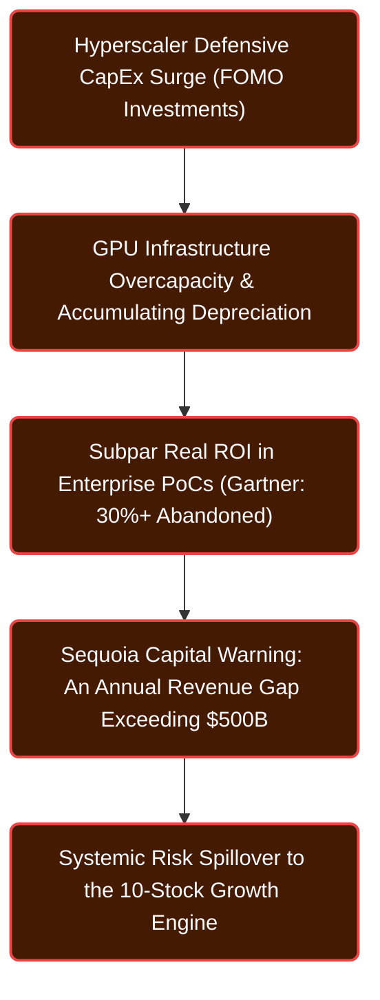
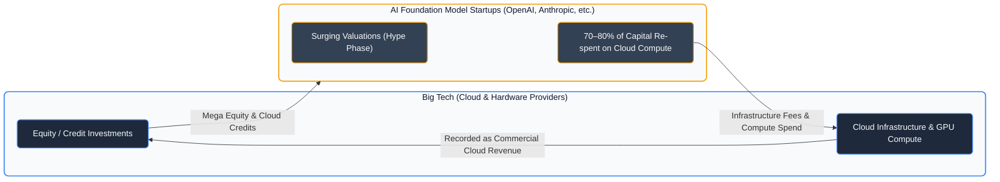
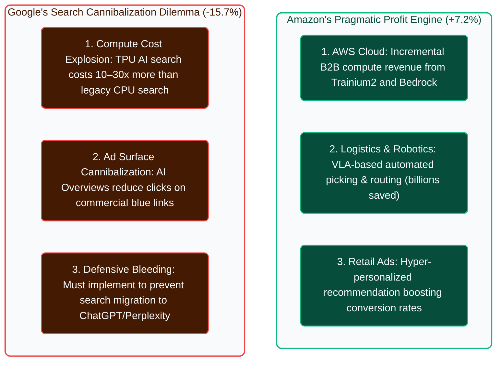
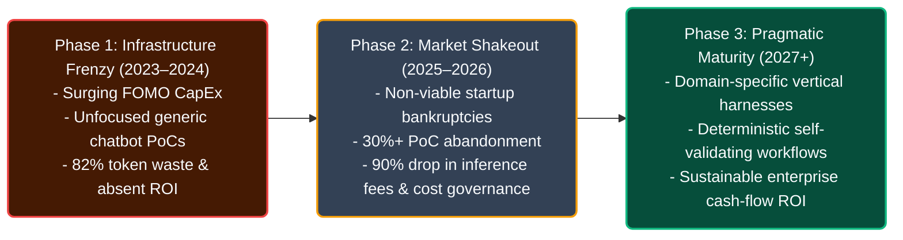
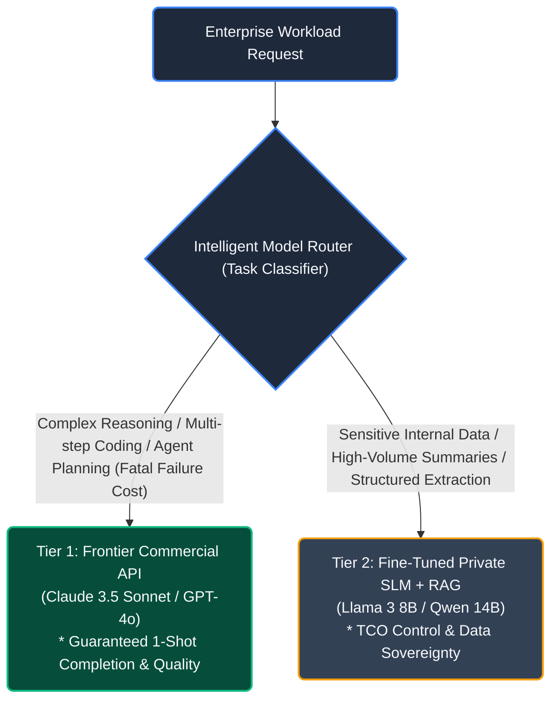
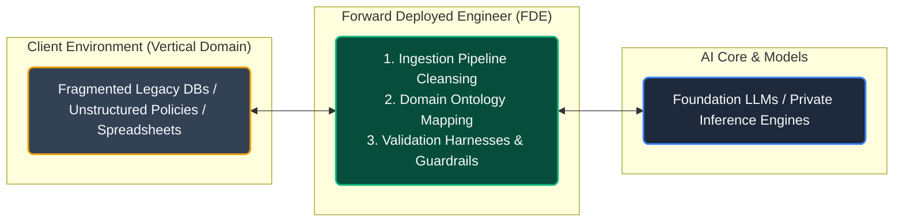
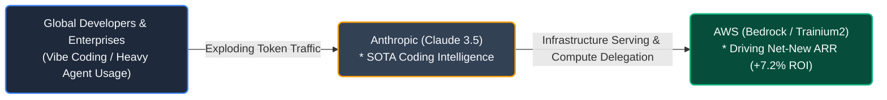

# The Inconvenient Truth of the AI Industry: Part 1 – Astronomical CapEx Bubbles and Pragmatic Survival Strategies for Enterprises

## Surging Capital Expenditures (CapEx) and the Dilemma of the $600B Revenue Gap

Driven by explosive expectations surrounding generative AI, the global technology ecosystem has entered an unprecedented Capital Expenditure (CapEx) supercycle. Hyperscalers—including Microsoft, Alphabet, Amazon, and Meta—pour hundreds of billions of dollars annually into securing frontier GPU clusters and mega-datacenter capacity. This massive inflow of capital has driven equity markets to historical highs, creating a distorted dynamic where a mere ten Big Tech firms account for the vast majority of overall earnings growth in the S&P 500 index.

Beneath this stock rally, however, serious economic alarm bells are ringing. Real earnings growth across the remaining 490 companies in the S&P 500 is stagnating below inflation, while the chasm between Big Tech's physical infrastructure expenditures and actual software revenue continues to widen uncontrollably.

Wall Street and global macroeconomists are most acutely concerned by **'The Profit Problem.'** Goldman Sachs' Jim Covello underscored that while previous internet and PC revolutions replaced high-cost paradigms with low-cost efficiency, generative AI currently exhibits an economic contradiction: replacing relatively cheap human labor with extraordinarily expensive computing infrastructure.

Reinforcing this concern, Sequoia Capital partner David Cahn warned that recovering depreciation and operational costs for hyperscalers' buildout requires **annual AI ecosystem revenues of roughly $600 billion ($600B)**, whereas actual end-user monetization languishes in the tens of billions—leaving a **massive revenue gap exceeding $500 billion**. Compounding these warnings, Gartner forecasts that over 30% of corporate generative AI PoCs will be abandoned due to unproven business value and cost blowouts, while MIT Professor Daron Acemoglu empirically calculated that AI's macroeconomic contribution to total factor productivity could be limited to just 0.07% annually over the next decade.

If non-viable startups are winnowed away through an industry shakeout and only core startups with validated business models survive, can the market realistically digest Big Tech's staggering infrastructure? A realistic trajectory will unfold across three distinct phases:

1. **The Time Lag Between Software Monetization and Infrastructure Depreciation**: Even as surviving vertical startups penetrate validated enterprise domains (coding, legal, healthcare) and generate paying B2B ARR, their computing spend will remain orders of magnitude too small to absorb the hundreds of billions in annual CapEx depreciation carried by hyperscalers. Paralleling the 'Dark Fiber' overhang of the dot-com crash, Big Tech faces an unavoidable near-term margin squeeze from idle 'Dark GPUs.'
2. **Deflationary Infrastructure Supply Rescuing Startup Unit Economics**: When hyperscalers slash cloud compute rates to defend utilization rates across overbuilt datacenters, surviving startups paradoxically reap a windfall: ultra-low compute input costs. This structural margin reset will finally provide the foundation for sustainable software profitability.
3. **Validating Concrete Cost Reduction Beyond Superficial Features**: Startups cannot sustain enterprise ARR with superficial wrappers or basic text summaries. Only specialized systems that interface with proprietary enterprise datastores to verifiably reduce human labor and operational overhead will emerge as enduring winners, forming the true commercial bedrock supporting hyperscaler infrastructure.

---

## The Underside of AI Market Dynamics: Circular Deals and Divergent Hyperscaler ROIs

### Circular Deals and the Shadow of Vendor Financing

A primary mechanism sustaining the appearance of explosive AI industry revenue growth is a financial dynamic known as **'Circular Deals.'** Rather than reflecting organic consumer and enterprise demand, this dynamic represents financial reflexivity: capital invested by Big Tech into AI startups flows straight back to the tech giants as cloud hosting and accelerator procurement spend.

Most prominently, Microsoft invested approximately $13 billion in OpenAI, yet the overwhelming bulk of that capital was returned directly as Azure cloud credits, immediately recorded as quarterly Microsoft commercial cloud revenue. Amazon and Google structured multi-billion-dollar investments in Anthropic paired with mandatory long-term cloud and proprietary accelerator commitments, while Nvidia invested equity in GPU cloud providers (such as CoreWeave) that subsequently purchase Nvidia's latest silicon. In practice, between 70% and 80%+ of capital raised by leading foundation model startups is recycled into cloud infrastructure fees paid back to their strategic investors.

Bearish observers view this structure as a modern reenactment of the **'Vendor Financing' tragedy** of the 1999 telecom bubble, when equipment manufacturers like Lucent and Nortel loaned capital to telecommunication startups to buy their switching gear, triggering cascading corporate defaults. If AI startups fail to establish self-sustaining cash flows, hyperscalers face a 'Double Loss': equity write-downs coupled with plunging cloud revenues.

Conversely, proponents argue that Big Tech's immense Free Cash Flow (FCF) acts as a robust shock absorber, and that OpenAI surpassing $4 billion in annual recurring revenue (ARR) proves real enterprise demand exists, making these deals rational in-kind partnerships. Nevertheless, the consensus conclusion among analysts is clear: while circular deals will not sink cash-rich Big Tech balance sheets, **a brutal shakeout among second- and third-tier AI startups that burn credits without securing paying customers is inevitable**.

| Dimension | Bear Case (The Bubble Thesis) | Bull Case (The Strategic Seed Thesis) |
| :--- | :--- | :--- |
| **Capital Nature** | Manufactured revenue creating reflexive financial bubble loops | In-kind compute provision serving as essential seed capital to bootstrap ecosystem moats |
| **Balance Sheet Risk** | Risk of a **Double Loss**: equity write-downs coupled with collapsing cloud ARR | Big Tech's immense **Free Cash Flow (FCF)** comfortably absorbs startup failures |
| **Organic Demand** | End-user Willingness to Pay (WTP) fails to cover underlying compute costs | Tier-1 leaders (OpenAI, Anthropic) exhibit genuine, growing enterprise B2B ARR |

---

### Severe Divergence in Implied ROI on AI CapEx Across Hyperscalers

Data compiled by the *Financial Times* examining hyperscalers' **Implied ROI on AI CapEx** exposes stark contrasts driven by differing underlying business models:

Among tracked hyperscalers, the only firm generating a positive net return on AI CapEx was **Amazon (+7.2%)**. In contrast, Microsoft (-9.2%), Alphabet/Google (-15.7%), Meta (-28.8%), and Oracle (-35.6%) are absorbing heavy losses on accelerated capital expenditures:

| Hyperscaler | Implied Net ROI | Key Drivers of Profit / Loss | Core Business Characteristics |
| :--- | :--- | :--- | :--- |
| **Amazon** | **+7.2% (Only Profitable Firm)** | Direct internal fulfillment savings in the billions + AWS Trainium2 net-new B2B ARR | No search ad surface to defend; virtuous partner cycle with Anthropic (Claude) |
| **Microsoft** | **-9.2%** | Copilot subscription ARR overwhelmed by massive datacenter depreciation | Equity method losses from OpenAI; heavy upfront Azure cluster investments |
| **Alphabet (Google)** | **-15.7%** | Surging AI Overviews compute costs + cannibalization of core keyword ad clicks | Confronting 'The Innovator's Dilemma' despite a decade of proprietary TPU depth |
| **Meta** | **-28.8%** | Open-source Llama offers zero direct licensing revenue | Ad targeting efficiency gains outpaced by massive GPU cluster CapEx |
| **Oracle** | **-35.6%** | Aggressive discounting on OCI compute to capture market share erodes margins | Latecomer dynamics forcing unprofitable low-margin infrastructure supply |

Amazon's success stems from anchoring AI strictly to **'Bottom-Line Impact.'** Deploying Vision-Language-Action (VLA) robotics for warehouse picking, automated inventory distribution, and last-mile route optimization converted billions in fulfillment overhead directly into operating income. Concurrently, mass-deploying custom Trainium2 silicon to Anthropic locked in net-new B2B cloud revenue.

Conversely, Google is trapped in a textbook **'Innovator's Dilemma.'** Traditional keyword search was an extraordinarily profitable cash cow running on low-cost CPUs with 40–50% operating margins. Generative search (AI Overviews) requires 10 to 30 times more compute per query on TPUs, while comprehensive summary cards reduce clicks on high-margin sponsored links. Yet Google cannot halt deployment: failing to offer generative answers risks users migrating to ChatGPT or Perplexity, threatening its core search monopoly. Google's AI spend is not growth investment, but 'defensive bleeding' essential for corporate survival.

---

### Historical Technological Revolutions and the 3 Phases of Market Maturity

According to techno-economist Carlota Perez's framework of technological revolutions, current AI turbulence reflects the **classic growing pains of the 'Installation Period'** common to all foundational paradigm shifts.

During the 1999 telecom bubble, over-investing in dark fiber caused carrier bankruptcies, but that cheap bandwidth paved the way for Web 2.0, YouTube, Netflix, and cloud computing. Similarly, Britain's 1840s 'Railway Mania' saw speculative rail companies fail, leaving behind an integrated logistics network that fueled industrial manufacturing.

The AI market is transitioning from the 2023–2024 infrastructure frenzy into the 2025–2026 market shakeout, where speculative hype recedes and unviable projects are cleared away. From 2027 onward, stabilized compute costs paired with robust software harnesses will anchor the industry into its 'Pragmatic Maturity' phase.

---

## Enterprise Strategy: Architecture and TCO Governance

### The TCO Illusion Behind Plunging Token Prices and 'Effective Cost'

Open-source breakthroughs (DeepSeek, Llama 3.x) have reduced hosted token pricing by over 90% relative to commercial frontier models. However, enterprises rushing into on-premises deployment based solely on token unit rates encounter a severe **'Total Cost of Ownership (TCO) Illusion.'**

While weights may be free, GPU server depreciation, datacenter rack footprint, liquid cooling power, and high-caliber MLOps engineering salaries run continuously. Factoring in **'Idle Loss'**—enterprise workloads dropping during nights and weekends—on-prem token costs easily exceed commercial API rates unless clusters maintain near-100% saturation around the clock.

More critical is the **'Effective Cost per Completed Task.'** If a cheaper lightweight model hallucinates or fails formatting, triggering 3–4 regeneration loops that waste 82% of tokens and require 30 minutes of developer debugging, the total cost dwarfs that of a single-shot (1-Shot) successful call to a commercial frontier API:

---

### Two-Tier Hybrid Model Routing

Big Tech's depreciation burden may eventually trigger API price hikes or reduced promotional credits. Enterprises must prepare by deploying a **Two-Tier Hybrid Routing Architecture**, optimizing cost according to task criticality:

Assign **Tier 1** tasks (architectural design, multi-agent coding, edge-case remediation) to frontier APIs to maximize 1-Shot success. Assign **Tier 2** workloads (sensitive internal records, high-volume batch summarization, deterministic JSON extraction) to local SLMs coupled with RAG, preserving data privacy and controlling infrastructure TCO.

---

### The Data-First Moat and the Rise of the Forward Deployed Engineer (FDE)

As foundation models commoditize into utility compute, thin chatbot wrappers offer zero defensibility.

The only durable economic moat in enterprise environments is **'Proprietary In-House Data Inaccessible via Web Crawlers.'** Semiconductor fabrication telemetry, clinical patient records, and proprietary underwriting transactions represent irreplaceable domain value.

Corporate data rarely exists in clean API formats; it is buried inside legacy schemas and unstructured documents. Palantir's commercial dominance stems from deploying **Forward Deployed Engineers (FDEs)** on-site to integrate fragmented data, build guardrails, and operationalize working systems in days. Competitive engineering advantage now centers on FDE capabilities: translating messy real-world data into operational AI systems.

---

### Symbiotic Synergy: Anthropic (Claude) and AWS

The clearest enterprise AI ROI today is software engineering automation. Anthropic's Claude 3.5 Sonnet has captured the **developer 'vibe coding' workflow** across Cursor, Claude Code, and GitHub Copilot:

Anthropic's coding intelligence generates massive token consumption processed directly on AWS Bedrock and Trainium2 infrastructure. Anthropic secures guaranteed compute capacity, while Amazon captures enterprise cloud ARR, creating a **virtuous, cash-flow-positive B2B symbiotic partnership**.

---

## Conclusion: 4 Core Insights for Engineering Leaders Navigating the Bubble

Astronomical CapEx races, circular deals, and the $600 billion revenue gap do not mean generative AI is an illusion. Historically, general-purpose technology revolutions (railroads, telecommunications, the internet) have always passed through extreme infrastructure overinvestment and market shakeouts, paving the way for software golden ages built atop low-cost infrastructure.

Engineering leaders and business decision-makers should navigate this transition using four strategic insights:

### 1. Decouple from Hyperscaler Hardware Wars
Do not replicate Big Tech's defensive CapEx buildout. Infrastructure oversupply will drive inference and training costs lower over time. An enterprise's winning move is not owning physical chips, but **leveraging cheap compute to achieve verified business unit economics**.

### 2. Pivot from Model-First to Data-First and Harness Architectures
Foundation model intelligence is rapidly commoditizing. Thin wrappers will be eliminated. Sustainable competitive advantage belongs to enterprises that secure **proprietary offline datasets** and field **Forward Deployed Engineers (FDEs)** to embed intelligence into operational workflows.

### 3. Defend TCO with Two-Tier Hybrid Routing
Do not fall for the 'free weights' illusion of open-source models without evaluating developer debugging labor. Design architectures around 'Effective Cost per Completed Task,' pairing frontier models for complex single-shot execution with local SLMs for routine pipelines.

### Enterprise AI Strategy Execution Matrix

| Domain | Immediate Risk & Dilemma | Enterprise Operational Guideline |
| :--- | :--- | :--- |
| **Capital & Market** | Circular deal unwind and AI startup shakeouts | Deploy multi-model gateways and multi-vendor failover to eliminate vendor lock-in |
| **Cost & TCO** | Idle compute losses and spiraling task retry costs | Measure Effective Cost per completed task; implement Two-Tier Hybrid Routing |
| **Business Value** | 30%+ PoC project abandonment rates | Avoid vanity feature additions; emulate Amazon by targeting verified operational savings |
| **Organization** | Chasing benchmark scores without production adoption | Invest in FDE capabilities to clean private data and build deterministic guardrails |

---

## Appendix: References and Reports

- Goldman Sachs Global Economics: *"Gen AI: Too Much Spend, Too Little Benefit?"* (Jim Covello)
- Sequoia Capital: *"AI's $600B Question"* (David Cahn)
- Financial Times (FT): *"The Impossible Math of the AI Boom – Implied ROI on Hyperscalers CapEx"*
- MIT Department of Economics: *"The Simple Macroeconomics of AI"* (Daron Acemoglu)
- Gartner Research: *"Emerging Tech: Mitigate Failure Risks of Generative AI Implementations"*
- Carlota Perez: *"Technological Revolutions and Financial Capital: The Dynamics of Bubbles and Golden Ages"*
