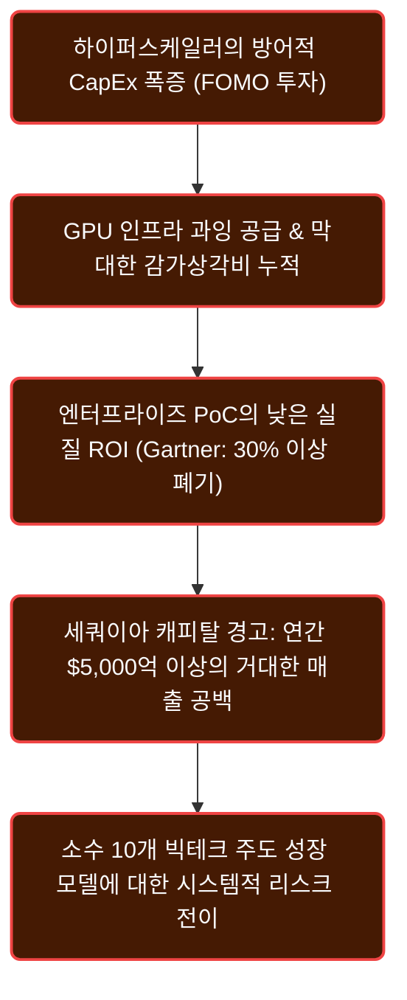
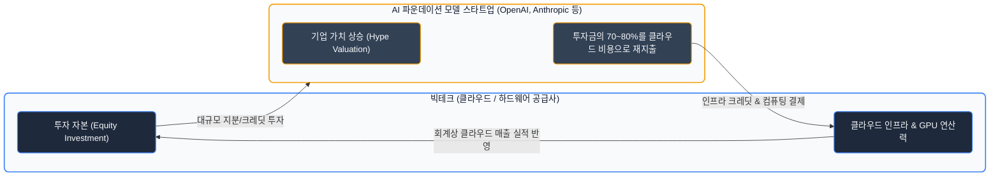
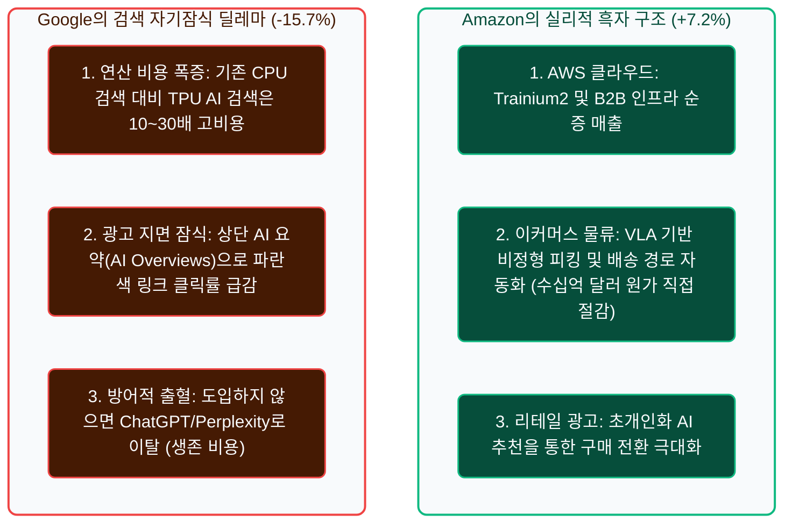
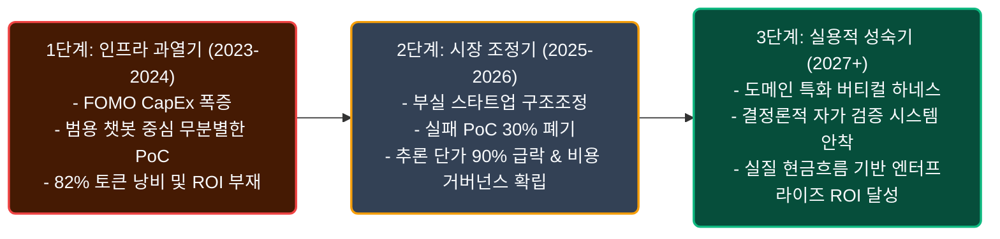
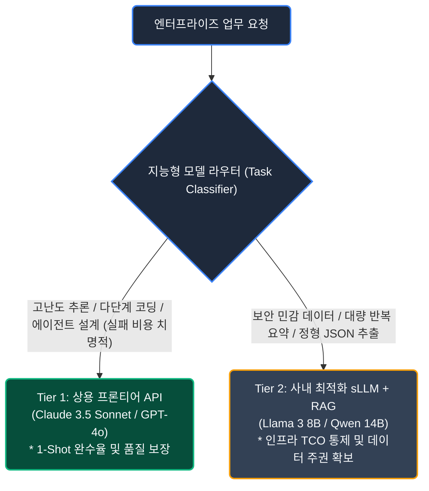
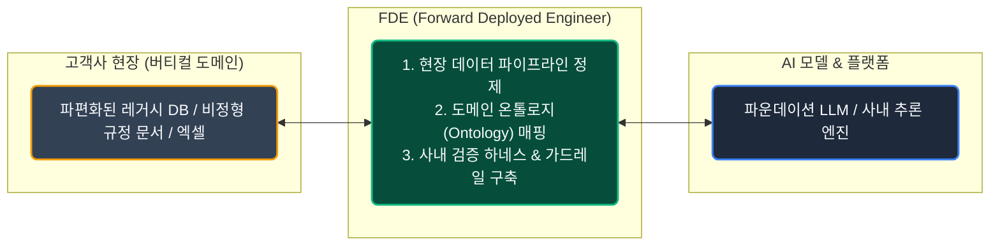
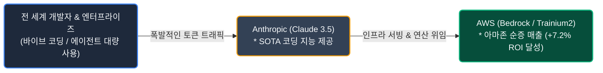

# AI 산업의 불편한 진실: Part 1 - 천문학적 CapEx 거품과 엔터프라이즈의 실리적 생존 전략

## 자본 지출(CapEx) 폭증과 $6,000억 매출 갭의 딜레마

현재 글로벌 기술 생태계는 생성형 AI의 폭발적인 기대를 등에 업고 역사상 유례없는 규모의 자본 지출(CapEx, Capital Expenditures) 슈퍼사이클에 진입해 있습니다. 마이크로소프트, 알파벳, 아마존, 메타 등 빅테크 하이퍼스케일러들은 최첨단 GPU 클러스터와 초대형 데이터센터 인프라를 선점하기 위해 매년 수천억 달러를 쏟아붓고 있습니다. 이러한 천문학적인 자금 유입은 증시를 강타하여 미국 S&P 500 지수 전체 이익 성장의 대부분을 소수 10개 빅테크 기업이 독식하는 기형적인 구조를 낳았습니다.

하지만 화려한 주가 상승의 이면을 들여다보면 심각한 경제적 경고음이 울리고 있습니다. 상위 10개 기업을 제외한 나머지 490개 전통 기업들의 실질 이익 성장률은 물가상승률을 밑돌며 정체되어 있으며, 빅테크가 쏟아부은 인프라 투자액과 실제 소프트웨어 시장의 수익 간극은 걷잡을 수 없이 벌어지고 있습니다.

월가와 글로벌 경제학계가 가장 우려하는 대목은 **'수익성 결여(The Profit Problem)'** 입니다. 골드만삭스의 짐 코벨로(Jim Covello)는 과거 인터넷이나 PC 혁신이 '고비용 구조를 저비용으로 혁신'했던 것과 달리, 현재의 AI는 '극도로 비싼 인프라로 비교적 저렴한 인간의 노동을 대체'하려는 경제적 모순을 안고 있다고 꼬집었습니다.

이를 뒷받침하듯 세쿼이아 캐피탈의 데이비드 칸(David Cahn)은 하이퍼스케일러들이 증설한 인프라의 감가상각과 운영비를 회수하려면 **AI 생태계 전체에서 연간 약 6,000억 달러($600B)의 매출** 이 발생해야 하지만, 실제 최종 사용자의 지출은 수백억 달러에 불과해 **5,000억 달러 이상의 거대한 매출 공백(Revenue Gap)** 이 존재한다고 경고했습니다. 여기에 가트너(Gartner)의 전망처럼 기업 생성형 AI PoC 프로젝트의 30% 이상이 명확한 비즈니스 가치 부재와 비용 폭증으로 폐기 수순을 밟고 있으며, MIT 다론 아세모글루(Daron Acemoglu) 교수가 증명했듯 AI의 거시경제 생산성 기여가 10년간 연평균 0.07% 수준에 그칠 수 있다는 실증 분석은 기술 리더들에게 냉철한 현실 인식을 요구하고 있습니다.

그렇다면 향후 부실 스타트업들이 정리되고 옥석 가리기(Shakeout)를 통해 실질적인 비즈니스 모델을 갖춘 '핵심 스타트업'들만 살아남는다면 시장은 과연 빅테크의 천문학적인 인프라를 소화해낼 수 있을까요? 현실적인 시나리오는 다음의 3단계를 거치게 됩니다:

1. **소프트웨어 수익화와 인프라 감가상각 간의 시간적 불일치(Time Lag)**: 살아남은 핵심 스타트업들이 코딩, 법률, 헬스케어 등 명확한 ROI가 검증된 버티컬 영역에 침투하여 B2B 유료 매출을 올리기 시작하더라도, 이들이 지출하는 연산 비용은 빅테크가 과잉 증설해 둔 수천억 달러 규모의 CapEx 감가상각비를 단기간에 소화하기에는 턱없이 부족합니다. 닷컴 시절의 '다크 파이버(Dark Fiber)'처럼, 단기적으로 유휴 GPU 인프라(Dark GPU)에 따른 빅테크의 자산 상각 충격과 마진 악화는 불가피합니다.
2. **인프라 헐값 공급을 통한 스타트업의 단위 경제성(Unit Economics) 개선**: 빅테크가 과잉 공급된 데이터센터의 가동률을 방어하기 위해 클라우드 연산 단가를 대폭 인하하게 되면, 역설적으로 살아남은 스타트업들은 '극도로 저렴해진 인프라'라는 반사이익을 얻게 됩니다. 이를 통해 원가 구조가 혁신되면서 비로소 실질적인 흑자 궤도에 안착하는 선순환의 발판이 마련됩니다.
3. **피상적 기능을 넘어선 '실질 원가 절감'의 검증**: 스타트업이 버티컬 도메인에 진입하더라도 텍스트 요약이나 단순 챗봇 수준의 피상적 기능으로는 기업의 지속적인 지출을 이끌어낼 수 없습니다. 현장의 폐쇄망 데이터와 결합하여 실제 인건비나 공정 원가를 수치로 깎아주는 '결정론적 업무 완수 시스템'을 완성한 스타트업만이 산업계의 최종 승자로 안착하여 하이퍼스케일러의 인프라를 지탱하는 진정한 수요층이 될 것입니다.

---

## AI 시장 구조의 이면: 순환 거래와 하이퍼스케일러별 손익 격차

### 순환 거래(Circular Deals)와 벤더 파이낸싱의 그림자

AI 산업의 겉보기 매출이 폭발적으로 늘어나는 것처럼 보이는 핵심 배경에는 **'자금 순환 거래(Circular Deals)'** 라는 독특한 금융 구조가 자리 잡고 있습니다. 이는 외부 엔드유저의 자발적 지불(Organic Demand)이 아닌, 빅테크가 AI 스타트업에 투자한 돈이 다시 자사의 클라우드 서버와 칩셋 결제 대금으로 되돌아오는 금융 재귀성(Financial Reflexivity) 현상입니다.

대표적으로 마이크로소프트는 오픈AI에 약 130억 달러를 투자했지만 이 자금의 대부분은 애저(Azure) 클라우드 크레딧 형태로 즉시 환류되어 MS의 분기 클라우드 매출 실적으로 잡혔습니다. 아마존과 구글이 앤트로픽에 수십억 달러를 투자하며 자체 AI 가속기 및 클라우드 장기 사용 계약을 묶은 것이나, 엔비디아가 GPU 클라우드 스타트업(CoreWeave 등)에 지분을 투자하고 이들이 다시 엔비디아의 최신 칩을 구매하는 구조 역시 동일한 궤를 그립니다. 실제로 주요 파운데이션 모델 스타트업들이 유치한 자금의 70~80% 이상이 투자 주체인 클라우드 벤더의 연산 비용으로 재지출되고 있습니다.

시장의 비관론자들은 이러한 구조를 1999년 닷컴 버블 당시 통신 장비 제조사였던 루슨트와 노텔이 통신 스타트업에 자금을 대출해주고 자사 장비를 사게 만들었다가 연쇄 파산으로 이어졌던 **'벤더 파이낸싱(Vendor Financing)' 의 비극** 과 정확히 겹쳐 봅니다. 스타트업이 자생적 수익 모델을 만들지 못하면 빅테크는 투자 지분 가치 상각과 클라우드 매출 급감이라는 '이중 타격(Double Loss)'을 입게 됩니다. 

반면 옹호론자들은 빅테크의 막대한 잉여현금흐름(FCF)이 완충 장치가 되어줄 뿐만 아니라, 오픈AI의 연간 환산 매출(ARR)이 40억 달러를 넘어서며 실질 유료 시장을 형성하고 있는 만큼 생태계 조성을 위한 '합리적인 현물 제휴'로 평가합니다. 그러나 전문가들의 공통된 결론은 분명합니다. 순환 거래 자체가 빅테크 본체를 무너뜨리지는 않더라도, **자생적 유료 고객을 확보하지 못하고 크레딧만 태우는 2·3위권 AI 스타트업들의 대규모 도태와 구조조정(Shakeout)** 은 피할 수 없다는 점입니다.

| 분석 차원 | 붕괴론자들의 시각 (Bear Case) | 반론 및 옹호론자들의 시각 (Bull Case) |
| :--- | :--- | :--- |
| **자금 성격** | 가공 매출(Manufactured Revenue) 착시이며 재귀적 버블 루프 형성 | 희소한 연산 인프라 현물 출자를 통한 초기 생태계 마중물 및 핵심 기술 선점 |
| **재무 건전성** | 스타트업 자생력 부재 시 지분 상각과 매출 급감의 **더블 로스(Double Loss)** 직면 | 빅테크의 압도적 **잉여현금흐름(FCF)** 으로 스타트업 실패 충격 흡수 가능 |
| **유기적 수요** | 외부 엔드유저의 지불 의사(WTP)가 인프라 비용을 감당하지 못함 | 오픈AI, 앤트로픽 등 선두권의 실질적 B2B 유료 엔터프라이즈 매출 실존 |

---

### 하이퍼스케일러별 AI CapEx 투자수익률(ROI)의 극단적 양극화

파이낸셜 타임스(Financial Times)가 집계한 주요 빅테크들의 **AI 설비투자 대비 추정 순투자수익률(Implied ROI on AI CapEx)** 은 어떤 비즈니스 모델을 선택했느냐에 따라 극단적인 명암을 드러내고 있습니다.

조사 대상 하이퍼스케일러 중 유일하게 플러스 수익률을 기록한 기업은 **아마존(+7.2%)** 뿐이었습니다. 반면 마이크로소프트(-9.2%), 알파벳 구글(-15.7%), 메타(-28.8%), 오라클(-35.6%)은 막대한 적자성 CapEx를 기록하며 투자 회수에 큰 어려움을 겪고 있습니다.

| 하이퍼스케일러 | 추정 순투자수익률 | 핵심 수익 및 손실 원인 | 비즈니스 구조적 특징 |
| :--- | :--- | :--- | :--- |
| **Amazon** | **+7.2% (유일한 흑자)** | 물류센터 원가 수십억 달러 직접 절감 + AWS Trainium2 B2B 순증 매출 | 방어할 검색 광고 지면 부재, 앤트로픽 협력(Claude) 생태계 선순환 |
| **Microsoft** | **-9.2%** | Copilot 구독 매출 대비 인프라 감가상각비 폭증 | 오픈AI 지분법 손익 및 막대한 Azure 데이터센터 선행 투자 부담 |
| **Alphabet (Google)** | **-15.7%** | AI Overviews 연산비 폭증 + 기존 키워드 광고 수익 잠식 | 10년 TPU 노하우에도 불구하고 '이노베이터의 딜레마' 봉착 |
| **Meta** | **-28.8%** | Llama 오픈소스 무료 공개로 직접 라이선스 매출 부재 | 광고 추천 타겟팅 효율 개선 효과 대비 GPU CapEx 과잉 지출 |
| **Oracle** | **-35.6%** | OCI 데이터센터/GPU 공격적 할인 증설로 마진 악화 | 후발주자 점유율 확보를 위한 무리한 저가 인프라 공급 구조 |

아마존의 성공 비결은 AI를 허상에 투자하지 않고 철저히 **'내부 원가 절감(Bottom-line Impact)'** 에 집중한 데 있습니다. 전 세계 물류센터의 로봇 자동화(VLA 기반 비정형 상품 피킹), 재고 배치, 라스트마일 배송 최적화에 AI를 즉각 투입하여 매년 수십억 달러의 물류비를 순수 영업이익으로 전환시켰습니다. 동시에 자체 개발 AI 가속기인 Trainium2를 앤트로픽에 대량 공급하며 실질적인 B2B 클라우드 순증 매출을 확보했습니다.

반면 구글은 전형적인 **'이노베이터의 딜레마(Innovator's Dilemma)'** 에 빠져 있습니다. 기존의 키워드 검색은 값싼 CPU로 처리되어 40~50%의 높은 영업이익률을 안겨주던 캐시카우였습니다. 하지만 생성형 AI 검색(AI Overviews)은 TPU를 사용하더라도 기존 대비 10~30배 비싼 연산 비용이 들고, 사용자가 상단 요약만 읽고 검색 결과를 이탈하면서 광고 클릭 수익을 스스로 파괴(Cannibalization)하고 있습니다. 그럼에도 구글이 이를 멈출 수 없는 이유는, AI 검색을 도입하지 않을 경우 사용자들이 ChatGPT나 Perplexity로 넘어가 검색 독점권 전체를 잃게 되기 때문입니다. 즉, 구글의 AI 투자는 성장을 위한 투자가 아니라 생존을 위해 지출해야만 하는 '방어적 출혈'의 성격을 띠고 있습니다.

---

### 역사적 기술 혁명 주기와 시장 성숙의 3단계

기술 경제학자 칼로타 페레즈(Carlota Perez)의 기술 혁명 프레임워크에 따르면, 현재 AI 산업이 겪고 있는 혼란과 과잉 투자는 새로운 패러다임이 태동할 때 필연적으로 나타나는 **'설치기(Installation Period)의 전형적인 진통'** 입니다.

1999년 닷컴 버블 당시 통신사들이 쏟아부었던 천문학적인 광케이블(Dark Fiber) 과잉 투자는 통신사들의 줄도산을 불렀지만, 이때 헐값에 공급된 초고속 인터넷망이 2000년대 중반 웹 2.0, 유튜브, 넷플릭스, 클라우드 혁명을 꽃피운 결정적 토대가 되었습니다. 1840년대 영국의 철도 광풍(Railway Mania) 역시 버블 붕괴 후 남겨진 철도 인프라가 국가 물류망을 완성하며 제조업 번영을 견인했습니다.

AI 산업 역시 2023~2024년의 무분별한 인프라 과열기를 지나, 2025~2026년에는 거품이 걷히고 실질적인 가치를 증명하지 못한 프로젝트들이 정리되는 '시장 조정기'로 진입하고 있습니다. 이후 2027년부터는 인프라 비용이 안정화되고 정교한 엔터프라이즈 하네스와 도메인 워크플로우가 결합된 '실용적 성숙기'에 안착할 것입니다.

---

## 엔터프라이즈의 실리적 대응: 아키텍처와 TCO 거버넌스

### 추론 비용 급락 이면의 'TCO 착시'와 실질 완수 비용(Effective Cost)

오픈소스 모델(DeepSeek, Llama 3.x)의 발전으로 호스팅 API 기준 토큰 단가는 상용 프론티어 모델 대비 90% 이상 저렴해졌습니다. 그러나 기업이 이 표면적 단가만 보고 성급히 사내 직접 구축(On-Premise)으로 방향을 틀 경우 심각한 **'TCO(총소유비용) 착시'** 를 겪게 됩니다.

모델 가중치 자체는 무료일지라도 전용 GPU 서버의 감가상각비와 데이터센터 상면(Rack/Space) 비용, 쿨링 전력비, 그리고 24시간 무중단 시스템을 유지하기 위한 고연봉 MLOps 엔지니어의 인건비가 지속적으로 발생합니다. 특히 기업 업무 특성상 야간이나 주말에 발생하는 **'유휴 연산 손실(Idle Loss)'** 을 고려하면, 24시간 내내 수억 토큰의 트래픽을 일정하게 소화하지 않는 한 사내 구축의 실질 토큰 단가는 상용 API 호출보다 훨씬 비싸집니다.

더욱 중요한 것은 오류 수정 비용을 반영한 **'태스크 완수당 실질 비용(Effective Cost)'** 입니다. 저렴한 경량 모델을 썼다가 복잡한 업무에서 환각이나 포맷 오류가 발생해 3~4번의 재생성 루프를 돌며 토큰의 82%를 낭비하고, 개발자가 이를 디버깅하느라 30분의 인건비를 소모한다면, 단 한 번의 호출(1-Shot)로 고품질 결과를 산출하는 상용 프론티어 API를 쓰는 것보다 전체 비용은 수십 배로 불어납니다.

---

### 2계층 하이브리드 모델 라우팅 (Two-Tier Model Routing)

빅테크의 천문학적인 CapEx 감가상각 부담은 조만간 클라우드 API 가격 인상이나 무료 크레딧 축소라는 청구서로 기업에 전가될 가능성이 높습니다. 이에 대비하기 위해 엔터프라이즈는 모든 업무를 하나의 모델로 처리하지 않고 작업의 성격에 따라 비용을 최적화하는 **2계층 하이브리드 라우팅 아키텍처** 를 구축해야 합니다.

아키텍처 설계, 다단계 에이전트 코딩, 까다로운 예외 처리가 요구되는 **Tier 1 영역** 에는 검증된 상용 프론티어 API를 배치하여 1-Shot 완수율을 극대화합니다. 반면 사내 보안 민감 문서 처리, 대량 배치 요약, 정형 데이터 추출과 같은 **Tier 2 영역** 에는 사내 sLLM과 RAG 파이프라인을 결합하여 인프라 비용을 최소화하고 데이터 주권을 지켜내는 방식입니다.

---

### 버티컬 산업의 Data-First 해자와 FDE(Forward Deployed Engineer)의 부상

파운데이션 모델의 지능이 수도나 전기처럼 누구나 요금만 내면 틀어 쓸 수 있는 '범용 원자재'로 상품화(Commoditization)되면서, 단순 챗봇 래퍼(Thin Wrapper) 서비스는 설 자리를 잃고 있습니다.

엔터프라이즈 환경에서 무너지지 않는 유일한 경제적 해자(Moat)는 **'외부 웹 크롤링으로는 절대 수집할 수 없는 사내 폐쇄망 고유 데이터'** 입니다. 반도체 생산 라인의 센서 로그, 병원의 환자 임상 기록, 금융사의 여신 트랜잭션 등 도메인 특화 데이터만이 독점적 가치를 만듭니다.

그러나 기업의 데이터는 결코 정돈된 API 형태로 존재하지 않고 레거시 DB와 파편화된 문서 속에 잠들어 있습니다. 팔란티어(Palantir)가 시장에서 압도적인 엔터프라이즈 수주를 기록하는 비결은, **FDE(Forward Deployed Engineer, 전방 배치 엔지니어)** 조직이 고객 현장에 직접 파견되어 며칠 만에 파편화된 데이터를 연결하고 안전한 가드레일을 결합해 작동하는 AI 시스템을 완성해내기 때문입니다. 앞으로의 엔지니어링 경쟁력은 단순 코딩이 아니라 데이터를 꿰뚫어 보고 AI를 실제 비즈니스 현장에 안착시키는 FDE 역량에 달려 있습니다.

---

### Anthropic(Claude)과 AWS의 공생 시너지: 바이브 코딩과 실물 B2B 현금흐름

시장에서 실질적인 ROI가 가장 명확하게 입증된 분야는 소프트웨어 엔지니어링 자동화입니다. 앤트로픽의 Claude 3.5 Sonnet은 커서(Cursor), 클로드 코드(Claude Code), 깃허브 코파일럿 등 현업 개발자들의 **'바이브 코딩' 시장을 사실상 독점** 하고 있습니다.

앤트로픽의 압도적인 코딩 지능은 폭발적인 토큰 소비를 일으키고, 이 트래픽은 고스란히 AWS Bedrock과 Trainium2 인프라 위에서 연산됩니다. 앤트로픽은 희소한 연산 자원을 안정적으로 공급받고, 아마존은 Claude를 앞세워 막대한 기업용 클라우드 순증 매출을 거두어들이는 **가장 이상적인 실물 B2B 공생 모델** 을 완성한 것입니다.

---

## 정리하며: 거품의 시대를 건너는 엔지니어링 리더의 4대 핵심 인사이트

AI 산업을 둘러싼 천문학적인 CapEx 거품과 순환 거래, 그리고 $6,000억의 매출 공백은 기술의 가치 자체가 허상임을 의미하지 않습니다. 역사적으로 모든 범용 기술 혁명(광통신, 철도, 인터넷)은 인프라의 극단적인 과잉 투자와 거품 붕괴, 그리고 헐값에 공급된 인프라 위에서 꽃피운 소프트웨어 전성기를 거쳤습니다.

이 거대한 전환기에서 엔지니어링 리더와 비즈니스 의사결정권자가 반드시 견지해야 할 핵심 인사이트는 다음과 같이 요약할 수 있습니다:

### 인프라 치킨 게임과 소프트웨어 실리의 명확한 분리
빅테크의 과점 경쟁과 방어적 CapEx 지출에 휘둘려 무리하게 자체 대규모 인프라를 구축하는 우를 범해서는 안 됩니다. 인프라 과잉 공급으로 인해 장기적으로 추론 및 학습 단가는 더욱 저렴해질 것이며, 엔터프라이즈의 승부처는 하드웨어 소유가 아니라 **'저렴해진 연산력을 활용해 어떤 실질적인 비즈니스 단위 경제성(ROI)을 달성할 것인가'** 에 있습니다.

### 모델 중심(Model-First)에서 하네스 & 데이터(Data-First)로의 전환
파운데이션 모델의 지능은 이미 전기나 수도처럼 누구나 사용할 수 있는 범용 원자재로 빠르게 상품화되고 있습니다. 단순 챗봇이나 씬 래퍼(Thin Wrapper) 수준의 서비스는 즉시 도태될 것이며, 외부 웹 크롤링으로는 결코 얻을 수 없는 **'사내 폐쇄망 고유 데이터'** 와 이를 현장 비즈니스 로직에 안착시키는 **FDE(Forward Deployed Engineer)** 조직 역량만이 무너지지 않는 유일한 경제적 해자(Moat)를 제공합니다.

### 2계층 하이브리드 라우팅을 통한 실질 TCO 방어
표면적인 API 토큰 단가나 오픈소스 모델의 '무료 가중치(Free Weights)'라는 착시에 빠지지 마십시오. 실패율과 디버깅 인건비를 감안한 '태스크 완수당 실질 비용(Effective Cost)'을 기준으로 시스템을 설계해야 합니다. 고난도 핵심 업무는 단 한 번의 호출(1-Shot)로 고품질 결과를 산출하는 프론티어 모델에 맡겨 인건비를 절감하고, 단순 반복 업무는 사내 경량 sLLM+RAG로 처리하는 2계층 라우팅을 구축하여 향후 발생할 수 있는 클라우드 API 가격 인상 및 감가상각 전가 리스크를 선제적으로 방어해야 합니다.

### 엔터프라이즈 AI 전략 실행 종합 매트릭스

| 분석 영역 | 당면 리스크 및 구조적 딜레마 | 엔터프라이즈 실무 대응 가이드라인 |
| :--- | :--- | :--- |
| **자본 및 시장** | 빅테크 순환 거래 및 AI 스타트업 구조조정 리스크 | 특정 벤더 종속을 탈피하기 위한 모델 게이트웨이 및 멀티 벤더 페일오버 체계 구축 |
| **비용 및 TCO** | 사내 직접 구축 시 유휴 손실 및 태스크 재시도 비용 폭증 | 단위 업무 완료 기준 실질 비용(Effective Cost) 측정 및 2계층 하이브리드 라우팅 적용 |
| **비즈니스 가치** | 30% 이상의 생성형 AI PoC 프로젝트 폐기율 | 구글식 단순 기능 추가를 지양하고, 아마존처럼 직접적 운영 원가 절감이 검증된 영역에 집중 |
| **조직 및 역량** | 모델 성능 경쟁 매몰 및 현장 적용 실패 | 모델 파인튜닝보다 사내 폐쇄망 데이터를 정제하고 가드레일을 결합하는 FDE 역량 확보 |

---

## Appendix: 참고 문헌 및 리포트

- Goldman Sachs Global Economics: *"Gen AI: Too Much Spend, Too Little Benefit?"* (Jim Covello)
- Sequoia Capital: *"AI's $600B Question"* (David Cahn)
- Financial Times (FT): *"The Impossible Math of the AI Boom - Implied ROI on Hyperscalers CapEx"*
- MIT Department of Economics: *"The Simple Macroeconomics of AI"* (Daron Acemoglu)
- Gartner Research: *"Emerging Tech: Mitigate Failure Risks of Generative AI Implementations"*
- Carlota Perez: *"Technological Revolutions and Financial Capital: The Dynamics of Bubbles and Golden Ages"*
