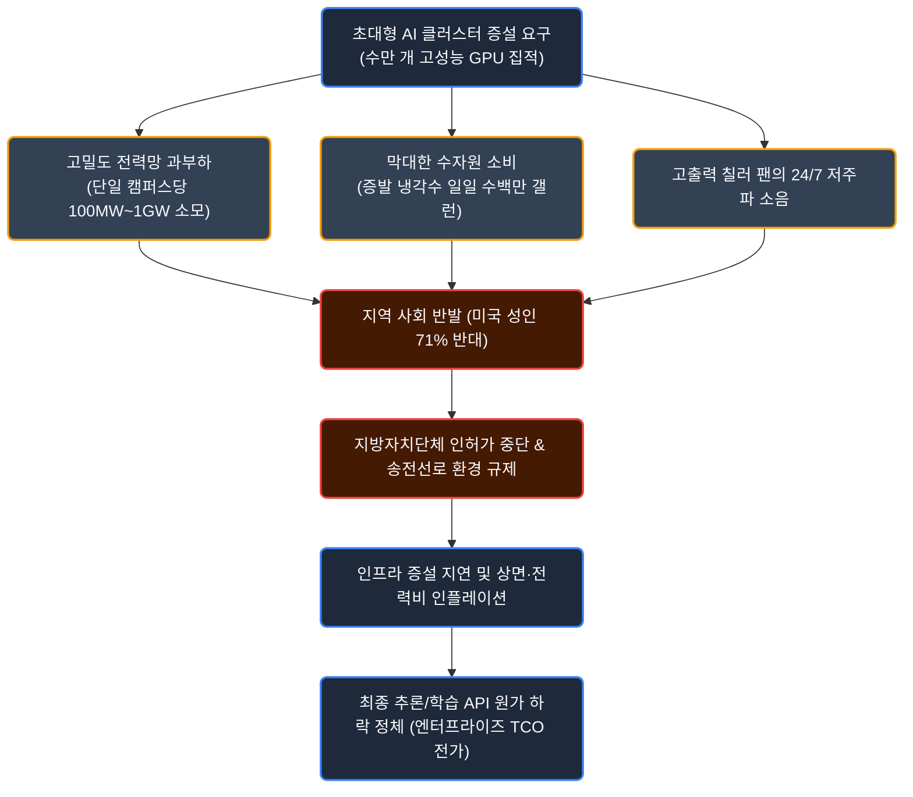
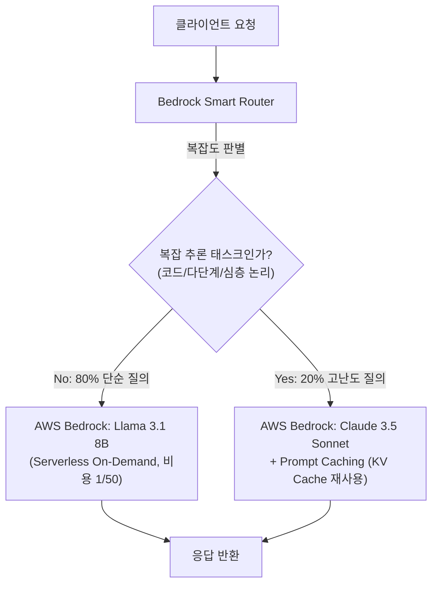
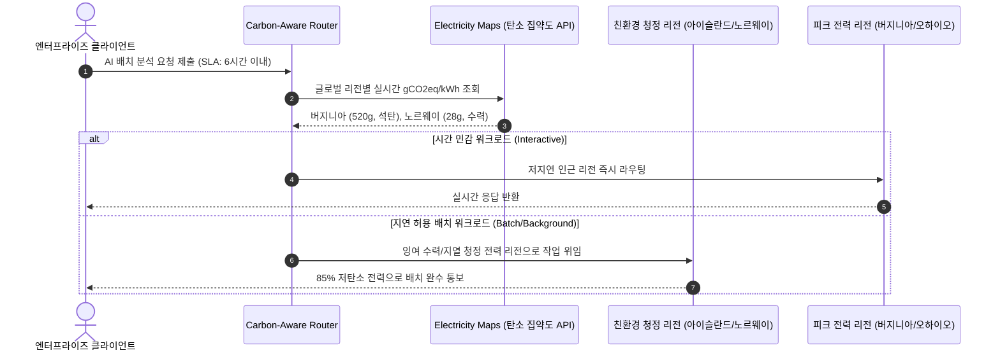

# AI 산업의 불편한 진실: Part 2 - 물리적 인프라의 벽과 데이터센터 전력·수자원 위기, 그리고 엔터프라이즈 그린 AI 전략

## 1. 들어가며: 가상 알고리즘과 물리 세계의 충돌

생성형 AI 생태계의 논의는 주로 파라미터 수, 벤치마크 점수, 알고리즘 아키텍처와 같은 가상 세계의 혁신에 집중되어 왔습니다. 그러나 거대언어모델(LLM)을 학습시키고 실시간으로 서빙하는 소프트웨어 레이어 밑바닥에는 수만 개의 가속 칩셋, 메가와트(MW)급 전력 인입선, 초당 수천 리터의 냉각수가 순환하는 거대한 물리적 인프라의 실체가 자리 잡고 있습니다.

이러한 물리적 충돌은 특정 국가에 국한된 현상이 아닙니다. 글로벌 AI 인프라를 선도하는 미국에서 먼저 터져 나온 전력망 병목과 주민 반발이라는 경고음은, 좁은 국토와 수도권 과밀이라는 특수성을 지닌 대한민국 현장에서는 154kV 초고압 송전선 분쟁과 계통 포화라는 훨씬 더 첨예한 형태로 전개되고 있습니다. 본 글에서는 IT 선진국인 미국의 실증 데이터와 글로벌 빅테크의 에너지 위기를 먼저 짚어본 뒤, 이를 거울삼아 대한민국 데이터센터 생태계가 직면한 구조적 모순과 엔터프라이즈가 채택해야 할 실전 그린 AI 엔지니어링 전략으로 이야기를 이어가고자 합니다.

### 미국 성인 71%의 데이터센터 신설 반대와 님비(NIMBY)의 현실화

글로벌 여론조사 기관 갤럽(Gallup)이 2026년 5월 발표한 미국 성인 실증 여론조사([Americans Oppose AI Data Centers in Their Area](https://news.gallup.com/poll/709772/americans-oppose-data-centers-area.aspx), Jeffrey M. Jones)에 따르면, 응답자의 **71%가 자신이 거주하는 지역 인근에 AI 데이터센터가 들어서는 것에 반대하는 것으로** 나타났습니다. 특히 이 중 **48%는 단순 우려를 넘어선 '강력한 반대(Strongly Oppose)'를** 표명했으며, 찬성 의견은 27%(적극 찬성은 7%)에 불과했습니다.

주목할 점은 이 반대 강도가 대표적 기피 시설인 **원자력 발전소 건설 반대율(53%)보다 무려 18%p나 더 높다는** 사실입니다. AI 인프라가 단순한 첨단 IT 설비를 넘어 지역 주민들에게 가장 심각한 환경·인프라 위협 요인으로 인식되고 있음을 명확히 보여줍니다.

<!-- Gallup 여론조사 핵심 지표 HTML/CSS 시각화 카드 -->
<div style="background: linear-gradient(135deg, rgba(15, 22, 38, 0.95), rgba(23, 32, 51, 0.95)); border: 1px solid var(--color-border-subtle); border-radius: 14px; padding: 24px; margin: 24px 0; box-shadow: 0 10px 25px -5px rgba(0, 0, 0, 0.3);">
  <div style="display: flex; justify-content: space-between; align-items: center; border-bottom: 1px solid rgba(255, 255, 255, 0.1); padding-bottom: 14px; margin-bottom: 20px;">
    <div>
      <span style="font-size: 11px; font-weight: 700; color: var(--color-primary-hover); text-transform: uppercase; letter-spacing: 1px;">Gallup Empirical Poll Analysis</span>
      <h4 style="margin: 4px 0 0 0; font-size: 16px; font-weight: 700; color: #f8fafc;">지역 내 AI 데이터센터 건설 수용성 조사 (N=1,024)</h4>
    </div>
    <span style="font-size: 12px; color: #94a3b8; background: rgba(255,255,255,0.05); padding: 4px 10px; border-radius: 6px;">2026.05 Gallup</span>
  </div>

  <div style="margin-bottom: 24px;">
    <div style="font-size: 13px; font-weight: 600; color: #cbd5e1; margin-bottom: 12px;">지역 내 신규 인프라 건설 반대율 비교</div>
    <div style="margin-bottom: 10px;">
      <div style="display: flex; justify-content: space-between; font-size: 12px; margin-bottom: 4px;">
        <span style="color: #f8fafc; font-weight: 600;">AI 데이터센터 (AI Data Centers)</span>
        <span style="color: #f87171; font-weight: 700;">71% 반대 (강력 반대 48%)</span>
      </div>
      <div style="width: 100%; height: 10px; background: rgba(255, 255, 255, 0.08); border-radius: 5px; overflow: hidden; display: flex;">
        <div style="width: 48%; background: #ef4444;" title="강력 반대 48%"></div>
        <div style="width: 23%; background: #f97316;" title="단순 반대 23%"></div>
      </div>
    </div>
    <div>
      <div style="display: flex; justify-content: space-between; font-size: 12px; margin-bottom: 4px;">
        <span style="color: #94a3b8;">원자력 발전소 (Nuclear Power Plants)</span>
        <span style="color: #fbbf24; font-weight: 700;">53% 반대</span>
      </div>
      <div style="width: 100%; height: 10px; background: rgba(255, 255, 255, 0.08); border-radius: 5px; overflow: hidden;">
        <div style="width: 53%; height: 100%; background: #eab308;" title="반대 53%"></div>
      </div>
    </div>
  </div>

  <div style="font-size: 13px; font-weight: 600; color: #cbd5e1; margin-bottom: 10px;">주민들이 데이터센터 신설을 반대하는 5대 핵심 사유</div>
  <div style="display: grid; grid-template-columns: repeat(auto-fit, minmax(130px, 1fr)); gap: 10px; margin-bottom: 20px;">
    <div style="background: rgba(239, 68, 68, 0.1); border: 1px solid rgba(239, 68, 68, 0.25); border-radius: 8px; padding: 12px; text-align: center;">
      <div style="font-size: 22px; font-weight: 800; color: #f87171;">50%</div>
      <div style="font-size: 11px; color: #e2e8f0; margin-top: 2px;">전력·수자원 고갈</div>
    </div>
    <div style="background: rgba(249, 115, 22, 0.1); border: 1px solid rgba(249, 115, 22, 0.25); border-radius: 8px; padding: 12px; text-align: center;">
      <div style="font-size: 22px; font-weight: 800; color: #fb923c;">22%</div>
      <div style="font-size: 11px; color: #e2e8f0; margin-top: 2px;">소음·교통·주거 침해</div>
    </div>
    <div style="background: rgba(234, 179, 8, 0.1); border: 1px solid rgba(234, 179, 8, 0.25); border-radius: 8px; padding: 12px; text-align: center;">
      <div style="font-size: 22px; font-weight: 800; color: #facc15;">20%</div>
      <div style="font-size: 11px; color: #e2e8f0; margin-top: 2px;">전기요금 인상 전가</div>
    </div>
    <div style="background: rgba(148, 163, 184, 0.1); border: 1px solid rgba(148, 163, 184, 0.25); border-radius: 8px; padding: 12px; text-align: center;">
      <div style="font-size: 22px; font-weight: 800; color: #cbd5e1;">16%</div>
      <div style="font-size: 11px; color: #e2e8f0; margin-top: 2px;">환경 오염·발열</div>
    </div>
    <div style="background: rgba(148, 163, 184, 0.1); border: 1px solid rgba(148, 163, 184, 0.25); border-radius: 8px; padding: 12px; text-align: center;">
      <div style="font-size: 22px; font-weight: 800; color: #94a3b8;">14%</div>
      <div style="font-size: 11px; color: #e2e8f0; margin-top: 2px;">AI 기술 부정적 시각</div>
    </div>
  </div>

  <div style="padding-top: 14px; border-top: 1px solid rgba(255, 255, 255, 0.08); display: flex; flex-wrap: wrap; gap: 8px; font-size: 11px; color: #94a3b8;">
    <span style="background: rgba(59, 130, 246, 0.15); color: #93c5fd; padding: 4px 8px; border-radius: 4px; border: 1px solid rgba(59, 130, 246, 0.3);">민주당 지지층: 강력 반대 56%</span>
    <span style="background: rgba(168, 85, 247, 0.15); color: #d8b4fe; padding: 4px 8px; border-radius: 4px; border: 1px solid rgba(168, 85, 247, 0.3);">무당층: 강력 반대 48%</span>
    <span style="background: rgba(239, 68, 68, 0.15); color: #fca5a5; padding: 4px 8px; border-radius: 4px; border: 1px solid rgba(239, 68, 68, 0.3);">공화당 지지층: 강력 반대 39%</span>
    <span style="background: rgba(20, 184, 166, 0.15); color: #5eead4; padding: 4px 8px; border-radius: 4px; border: 1px solid rgba(20, 184, 166, 0.3);">여성(55%) vs 남성(43%) 강력 반대</span>
  </div>
</div>

과거 전통적인 엔터프라이즈 클라우드 데이터센터는 조용한 서버실과 미미한 교통 유발로 비교적 무난하게 지역 사회에 안착했습니다. 하지만 차세대 AI 데이터센터는 지역 주민들의 일상 환경과 직결된 자원 배분 문제를 촉발하고 있습니다. 

반대 이유의 절반(50%)을 차지한 핵심 요인은 전력과 수자원의 급격한 고갈 우려입니다. 기가와트(GW)급 전력 인입과 일일 수백만 갤런의 냉각수 증발은 공공 기반 시설을 마비시킬 수 있다는 현실적 공포를 불러일으킵니다. 여기에 고집적 GPU 랙의 발열을 해소하기 위한 대형 칠러(Chiller)와 냉각탑에서 발생하는 지속적인 저주파 소음(22%), 그리고 전력회사의 천문학적 전력망 증설 비용이 일반 가정용 요금 인상으로 전가될 것이라는 불안(20%)이 주민들의 저항을 더욱 결집시키고 있습니다.



세계 최대 데이터센터 집적지인 미국 버지니아주 북부 '데이터센터 앨리(Data Center Alley)'에서는 이미 신규 고압 송전선로 건설을 둘러싸고 주정부, 전력회사(Dominion Energy), 주민 연합 간의 극심한 법적 분쟁과 승인 지연이 잇따르고 있습니다. 가상의 지능을 무한히 확장하려는 소프트웨어의 야심이 전력망과 부지라는 물리적 터전의 한계와 정면으로 충돌하고 있는 셈입니다.

---

## 2. 물리 인프라의 3대 구조적 병목 심층 분석

### 1) 전력망 포화와 계통 연계 큐(Interconnection Queue)의 병목

현대 AI 데이터센터가 요구하는 전력 밀도는 과거 클라우드 인프라와 본질적으로 다릅니다. 일반적인 범용 서버 랙이 랙당 5~10kW 수준의 전력을 소비하는 반면, 최신 엔비디아 NVL72 또는 차세대 가속기 랙은 **랙당 100kW~130kW 이상의 초고밀도 전력을** 요구합니다. 이로 인해 10만 장 이상의 최신 GPU를 묶는 단일 기가와트(GW)급 데이터센터 프로젝트가 추진되고 있으며, 이는 대형 원자력 발전소 1기의 발전 용량(약 1,000MW)에 필적하는 규모입니다.

국제에너지기구(IEA)와 미국 연방에너지규제위원회(FERC)의 데이터에 따르면 이러한 전력 수요 폭증은 치명적인 공급망 병목을 촉발했습니다. 데이터센터 부지를 확보하더라도 전력망(Grid)에 직접 인입하여 송전을 받기까지의 승인 및 인프라 구축 기간이 미국 주요 전력망(PJM, ERCOT, CAISO) 기준으로 **평균 5~7년까지 지연되고** 있습니다. 이에 더해 대용량 초고압 변압기(Large Power Transformers)의 글로벌 리드타임이 기존 1~2년에서 **3~4년 이상으로 폭증하면서**, GPU 하드웨어를 선제 확보하고도 전기를 넣지 못해 연산 설비가 유휴 상태에 머무는 사태가 현실화되었습니다.

### 2) 수자원 증발과 직접 칩 냉각(Direct-to-Chip Liquid Cooling)의 한계

데이터센터 전력 소비의 약 30~40%는 컴퓨팅 연산 자체가 아니라 칩셋에서 발생하는 막대한 열을 외부로 방출하는 냉각 계통에서 발생합니다. 기존 공랭식(Air Cooling) 시스템은 공기의 열용량 한계로 인해 랙당 30kW를 초과하는 고집적 서버를 감당할 수 없습니다. 따라서 산업계는 칩 표면에 냉각수를 직접 순환시키는 **직접 칩 냉각(Direct-to-Chip Liquid Cooling)과** 증발식 냉각탑으로 빠르게 전환하고 있습니다.

이러한 수랭식 전환은 필연적으로 심각한 수자원 고갈을 동반합니다. 대규모 하이퍼스케일러 데이터센터 1개소는 하루 평균 **300만~500만 갤런(약 1,100만~1,900만 리터)의** 냉각수를 증발 소모하며, 이는 인구 3만~5만 명 규모의 중소도시 전체가 하루에 소비하는 생활용수량과 맞먹습니다. 더욱이 데이터센터가 주로 입지하는 지역이 전력망 접근성과 넓은 부지가 확보된 건조 지역(미국 애리조나, 텍사스, 유타 등)에 집중되면서, 지역 가뭄을 심화시키고 지하수위를 고갈시켜 지자체와의 물리적 마찰을 키우고 있습니다.

### 3) 빅테크의 에너지 전쟁: 원전·SMR 확보와 넷제로의 역설

공공 전력망 확충이 5년 이상 지연되자 하이퍼스케일러들은 일반 전력망을 우회하여 발전원과 직접 계약을 맺는 '원자력 및 청정에너지 직접 PPA(전력구매계약)' 경쟁에 돌입했습니다.

마이크로소프트는 1979년 노심용융 사고를 겪었던 미국 펜실베이니아주 쓰리마일 섬(Three Mile Island) 원전 1호기를 2028년까지 재가동하여 **향후 20년간 835MW의 전력을 전량 독점 구매하는 역사적 PPA를** 체결했습니다. 구글 역시 차세대 소형 모듈 원자로(SMR) 개발사인 카이로스 파워(Kairos Power)와 손잡고 총 500MW 규모의 SMR 6~7기를 2030년부터 순차 공급받는 선도 구매 계약을 맺었습니다.

그러나 발전원과의 직접 결합이 만능 해결책이 되지는 못하고 있습니다. 아마존(AWS)은 펜실베이니아주 서스퀘하나(Susquehanna) 원전 바로 옆에 위치한 탈렌 에너지(Talen Energy)의 960MW 규모 원전 직결 데이터센터 캠퍼스를 6억 5,000만 달러에 전격 인수했습니다. 하지만 2024년 11월 미국 연방에너지규제위원회(FERC)는 공공 전력망 안정성과 일반 소비자로의 비용 전가 위험을 이유로, 해당 데이터센터의 직결 수전 용량을 300MW에서 480MW로 늘리는 연계 계약(ISA) 개정안을 2:1로 기각했습니다. 원전 직결조차 공공 전력망 거버넌스의 엄격한 규제 리스크에 직면해 있음을 보여주는 대표적 사례입니다.

빅테크들은 "원자력과 재생에너지를 통한 무탄소 24/7 전력"을 표방하고 있으나, 원전 재가동과 SMR 상용화는 2028~2035년 이후에나 가동될 장기 프로젝트입니다. 당장 폭증하는 AI 추론/학습 수요를 메우기 위해 버지니아와 텍사스 등지에서는 폐쇄 예정이던 노후 석탄 및 천연가스 화력 발전소의 가동 수명을 연장하고 있습니다. 그 결과 마이크로소프트, 구글, 메타의 공식 지속가능성 보고서에 따르면 2020년 대비 온실가스 배출량은 오히려 30~50% 이상 급증하여, 기업 스스로 선언했던 '2030 탄소 중립' 공약이 물리적 한계 앞에서 무력화되는 역설을 겪고 있습니다.

---

### 4) 대한민국 데이터센터의 3각 모순과 154kV 송전 갈등

대한민국의 데이터센터 생태계는 좁은 국토 면적, 고밀도 아파트 주거 문화, 단일 국유 전력망(한국전력) 구조로 인해 미국보다 훨씬 더 첨예한 사회적·물리적 충돌을 겪고 있습니다.

국내 운영 및 추진 중인 데이터센터의 **약 70% 이상이 수도권에 집중되어** 있습니다. 수도권 변전소 용량이 포화 상태에 이르자 정부는 2023년 3월 전기사업법 시행령을 개정하여(제5조의5 제5호의2), 5,000kW 이상 대용량 사용 신청 시 전력계통 신뢰도 유지가 어렵다고 판단되면 **한국전력이 계통 연계 요청을 거부하거나 시기를 조정할 수 있는 권한을** 부여했습니다. 실제로 최근 수도권에서 추진되던 대형 데이터센터 프로젝트 대다수가 한전의 공급 불가 통보를 받으며 표류하고 있습니다.

더욱 심각한 문제는 주거지 인접 갈등입니다. 외곽 농촌이나 사막에 지어지는 해외와 달리, 한국은 통신 지연(Latency) 단축을 위해 아파트 단지와 초등학교 통학로 지하에 154,000V(154kV) 초고압 송전 케이블을 매설하는 무리한 입지를 선택하면서 주민들과 정면 충돌하고 있습니다.

* **경기 안양시 (호계동/평촌)**: 주거지 및 초등학교 인근 154kV 지중선 매설에 반발한 주민 수천 명이 대규모 집회를 열고 감사원 공익감사를 청구했으며, 행정소송으로 비화되자 결국 사업자가 사업 철회서를 제출하고 부지를 매각했습니다.
* **경기 고양시 (일산 덕이동/식사동)**: 아파트 밀집지 인접 데이터센터 건립에 대한 주민 결사반대로 지자체장이 건축허가 직권 취소를 법률 검토하고 착공신고를 반려하는 사태가 벌어졌습니다(이후 행정심판·소송으로 비화).
* **경기 김포(구래동), 용인(죽전)**: 냉각탑 저주파 소음, 수증기(백연) 배출에 따른 일조권 침해, 아파트 자산 가치 하락 우려로 지자체와 시행사 간의 행정 분쟁이 장기화되고 있습니다.

정부는 2024년 6월 **'분산에너지 활성화 특별법'을** 시행하여 강원 수열클러스터나 전남 해남 솔라시도 등 비수도권 이전을 유도하고 있습니다. 하지만 IT 산업 현장이 지방 이전을 주저하는 근본 원인은 **'데이터 중력(Data Gravity)'에** 있습니다. 국내 이커머스, 핀테크, 게임, SaaS 스타트업의 85~90%가 판교와 서울에 몰려 있어, 서버를 지방에 둘 경우 수도권 사용자와 통신할 때마다 물리적 왕복 지연시간(RTT 8~10ms)이 발생하여 서비스 경쟁력이 저하됩니다.

24/7 무중단 장애 대응을 책임질 DevOps/MLOps 인력이 지방 이주를 극도로 기피하는 인력 수급의 한계, 그리고 지방 부지까지 테라비트(Tbps)급 전용 광통신망을 이중화해 인입하는 천문학적 토목 비용 역시 민간 기업의 지방 이전을 가로막는 실질적 장벽입니다.

이러한 인프라 공급 차단은 글로벌 사례에서도 뼈아픈 대가를 치렀습니다. 아일랜드는 2021년부터 4년간 더블린 전력망 포화를 이유로 신규 계통 연계를 동결(모라토리엄)했다가, 약 65억 유로(한화 약 9조 5,000억 원)에 달하는 해외 직접투자(FDI)가 증발하고 핵심 핀테크 기업들이 이탈하자 2025년 말 엄격한 자가발전 요건을 걸고 모라토리엄을 공식 철회했습니다. 싱가포르 역시 3년간 신설을 중단했다가 아시아 디지털 허브 지위를 말레이시아(조호르)에 빼앗길 위기에 처하자 PUE 1.3 이하 그린 기준을 걸고 재개했습니다.

영국 토터스(Tortoise) 및 스탠퍼드 HAI 인덱스에 따르면, 한국은 인구 대비 AI 특허(세계 1위)와 통신망 기반 시설은 세계 최고 수준이나, **민간 투자(세계 12~17위)와 인재 지표가 10위권 밖으로 취약하며**, 데이터센터 규제로 인한 **초고성능 AI 가속기(GPU) 절대 보유량 결핍이** 국가 AI 경쟁력을 갉아먹는 최대 병목으로 지목되고 있습니다.

#### 수도권 집중의 현실 인정과 3대 현실적 돌파 아젠다

결과적으로 대한민국은 "수도권에 짓자니 전력망 포화로 불가능하고, 지방에 짓자니 90%의 트래픽과 고객사가 묶인 '데이터 중력' 때문에 사업성이 없으며, 안 짓고 막자니 국가 AI 연산력이 결핍되는" **'불가능의 3각 모순(The Impossible Trilemma)'에** 직면해 있습니다. 

단순히 "지방으로 알아서 내려가라"는 식의 선언적 규제는 시장의 물리 법칙 앞에서 작동하지 않습니다. 결국 대한민국이 선택 가능한 현실적 대응 방향은 **'수도권 집중이라는 현실을 인정하고 이를 전제로 인프라와 제도를 재설계하는 것'이며**, 다음과 같은 3대 공학적·정책적 아젠다를 직시해야 합니다:

1. **도심 분산 자가발전(On-site Power) 허용과 한계 극복**: 한전 공공 계통선이 포화되었다면 데이터센터 부지 내 수소 연료전지나 친환경 LNG 열병합 발전(CHP)을 통한 자가발전 모델을 제도적으로 유연하게 열어주어야 합니다. 다만 수입 LNG의 높은 발전 단가(한전 산업용 요금 대비 20~30% 고비용)와 글로벌 고객사의 RE100 입주 거부 리스크를 해결할 보조금 및 탄소 상쇄 지원책이 결합되어야 합니다.
2. **'수도권 송전망 확충 올인'이라는 궁여지책의 사회적 비용 직시**: 서버를 지방으로 강제 분산하지 못한다면, 결국 '동해안·서해안의 전기를 대규모 초고압 직류송전망(HVDC)을 통해 수도권으로 수송하는 것'이 정부가 선택한 가장 유력한 현실적 타협안입니다. 그러나 이는 수십조 원의 국비 투입과 또 다른 송전선로 경유지 갈등을 치러야 하는 가장 값비싸고 지난한 길입니다.
3. **지방 이전 시 '전기'가 아닌 '수요 생태계'를 패키지로 이식**: 지방으로 데이터센터를 유도하려면 단순 규제가 아니라, 파격적인 법인세 감면, 전기요금 30% 할인, 테라비트급 백본망(Dark Fiber) 무상 구축, 그리고 정부·공공 클라우드 수요를 패키지로 묶어주는 '국가 AI 특구' 수준의 과감한 지원이 선행되어야 합니다.

#### 엔터프라이즈의 결론: '인프라 다이어트(Green AI)'라는 유일한 자구책

대규모 송전망 완공이나 도심 자가발전 제도가 안착하기까지는 최소 수년에서 10년 이상의 시간이 소요됩니다. 물리적 인프라 증설이 원천 봉쇄된 대한민국 환경에서 개별 기업이 국가 전력망 확충만 마냥 기다릴 수는 없습니다. 

결국 대한민국 데이터 생태계에서 기업이 생존할 수 있는 가장 실리적인 돌파구는, 인프라의 결핍을 소프트웨어 공학으로 돌파하는 **'인프라 다이어트(Green AI, 경량 SLM, RAG, 양자화)'입니다**. 물리 서버를 무한정 늘릴 수 없다면, 주어진 전력과 랙 상면 내에서 토큰당 전력 효율을 극대화하는 엔지니어링 최적화가 필수적인 이유가 바로 여기에 있습니다.

---

### 차세대 AI 데이터센터 vs 전통 클라우드 데이터센터 비교

| 아키텍처 비교 항목 | 전통 엔터프라이즈 클라우드 DC | 차세대 AI 가속 컴퓨팅 DC | 엔지니어링 임팩트 |
| :--- | :--- | :--- | :--- |
| **랙당 전력 밀도** | 5 ~ 15 kW / Rack | **40 ~ 130+ kW / Rack** | 배전반, PDU, Busway 전면 고용량 재설계 |
| **주요 냉각 기술** | 항온항습기 기반 공랭식 (CRAC/CRAH) | **직접 칩 수랭식 (Direct-to-Chip) / 침전 냉각** | 랙 단위 냉각수 분배 장치(CDU) 및 누수 감지 필수 |
| **전력 사용 효율 (PUE)** | 1.15 ~ 1.30 | **1.25 ~ 1.45 (실질 운용치)** | 냉각 펌프 및 고밀도 칠러 가동으로 효율 악화 방어 난제 |
| **수자원 사용 효율 (WUE)** | 0.5 ~ 1.0 L/kWh | **1.5 ~ 3.0+ L/kWh (증발탑 방식)** | 폐쇄 루프 드라이 쿨러(Dry Cooler) 전환 압박 |
| **인프라 조달 리드타임** | 1.5 ~ 2 년 | **4 ~ 7 년 (전력망 연계 병목)** | 온프레미스 GPU 클러스터 증설의 최우선 병목 |
| **사회적/규제 수용성** | 비교적 양호 (일반 상업 시설 수준) | **극심한 님비 (미국 성인 71% 반대)** | 소음 규제 조례 및 수자원 취수 허가 지연 빈번 |

---

## 3. 엔터프라이즈를 위한 실전 그린 AI 엔지니어링

빅테크의 물리적 인프라 확보 경쟁과 전력 인플레이션은 클라우드 GPU 인스턴스 단가 인상과 호출 쿼터 제한이라는 형태로 기업에 전가됩니다. 하지만 모든 기업이 동일한 엔지니어링 계층에서 그린 AI를 고민할 필요는 없습니다.

일반 소프트웨어 기업(SaaS, 커머스, 핀테크)이 온프레미스 GPU 서버 팜을 직접 구축하고 커널을 튜닝하는 것은 극심한 오버엔지니어링입니다. 완전관리형 서버리스 API 환경에서 지능형 라우팅과 프롬프트 캐싱을 통해 불필요한 GPU 연산을 제거하는 것이 실질적인 해법입니다. 반면 자체 GPU 서버 팜을 보유한 인프라 기업은 랙당 허용 전력(Power Cap) 내에서 처리량을 극대화하기 위해 vLLM 기반 FP8 양자화와 메모리 최적화를 강제해야 합니다.

### 1) [일반 소프트웨어 기업] AWS Bedrock 기반 서버리스 하이브리드 라우터 & 프롬프트 캐싱

실무 소프트웨어 기업이 겪는 가장 큰 전력과 비용 낭비는 단순 포맷 변환이나 요약 같은 일상적 요청까지 무차별적으로 거대 프론티어 모델(Claude 3.5 Sonnet, GPT-4o)로 전송하는 관행에서 비롯됩니다.

AWS Bedrock 환경에서는 **80%의 단순 태스크는 초경량 서버리스 오픈소스 모델(Llama 3.1 8B)로** 오프로딩하고, **20%의 복합 추론 태스크만 프론티어 모델(Claude 3.5 Sonnet)로** 승격하는 **시맨틱 라우터(Semantic Router)** 아키텍처를 구축함으로써 인프라 고정비 '0원'과 호출 비용 85% 이상 절감을 동시에 달성할 수 있습니다. 여기에 Anthropic의 **Prompt Caching을** 결합하면 반복되는 시스템 프롬프트의 불필요한 GPU 어텐션 연산(FLOPs)을 원천 차단할 수 있습니다.



다음은 AWS Bedrock SDK(`boto3`)를 기반으로 경량 작업과 복합 작업을 동적 라우팅하고 프롬프트 캐싱을 활성화하는 프로덕션 레벨의 파이프라인 구현 코드입니다:

```python
# bedrock_smart_router.py
# AWS Bedrock 기반 서버리스 하이브리드 그린 AI 라우터 (Llama 3.1 8B + Claude 3.5 Sonnet)

import json
import boto3
from typing import Dict, Any

class BedrockSmartRouter:
    """
    일반 소프트웨어 기업을 위한 클라우드 네이티브 그린 AI 라우터:
    - 80% 단순 태스크: AWS Bedrock Llama 3.1 8B Serverless (비용/전력 95% 절감)
    - 20% 복합 추론: AWS Bedrock Claude 3.5 Sonnet (최고 수준 지능)
    - Prompt Caching: 시스템 프롬프트 GPU 재연산 원천 차단 (비용 90% 절감)
    """
    def __init__(self, region_name: str = "us-east-1"):
        self.client = boto3.client("bedrock-runtime", region_name=region_name)
        self.model_fast = "meta.llama3-1-8b-instruct-v1:0"
        self.model_frontier = "anthropic.claude-3-5-sonnet-20241022-v2:0"

    def is_complex_task(self, prompt: str) -> bool:
        """경량 분류 로직: 코드 작성, 시스템 아키텍처, 다단계 추론 키워드 탐지"""
        complex_triggers = ["refactor", "algorithm", "architecture", "debug", "증명", "설계", "최적화"]
        return any(trigger in prompt.lower() for trigger in complex_triggers) or len(prompt) > 1500

    def invoke_with_routing(self, prompt: str, system_prompt: str) -> Dict[str, Any]:
        if self.is_complex_task(prompt):
            # 20% 복합 태스크: Claude 3.5 Sonnet 호출 (Anthropic Prompt Caching 헤더 활성화)
            body = json.dumps({
                "anthropic_version": "bedrock-2023-05-31",
                "max_tokens": 2048,
                "system": [
                    {
                        "type": "text", 
                        "text": system_prompt, 
                        "cache_control": {"type": "ephemeral"}  # GPU KV 캐시 재사용으로 FLOPs 차단
                    }
                ],
                "messages": [{"role": "user", "content": prompt}]
            })
            response = self.client.invoke_model(modelId=self.model_frontier, body=body)
            result = json.loads(response["body"].read())
            
            usage = result.get("usage", {})
            return {
                "route": "FRONTIER_TIER",
                "model_used": "Claude 3.5 Sonnet",
                "content": result["content"][0]["text"],
                "cached_tokens": usage.get("cache_read_input_tokens", 0),
                "reason": "Complex analytical/coding task requires frontier reasoning"
            }
        else:
            # 80% 단순 태스크: Llama 3.1 8B 경량 서버리스 모델 즉시 호출
            body = json.dumps({
                "prompt": f"<|begin_of_text|><|start_header_id|>system<|end_header_id|>\n{system_prompt}<|eot_id|><|start_header_id|>user<|end_header_id|>\n{prompt}<|eot_id|><|start_header_id|>assistant<|end_header_id|>",
                "max_gen_len": 512,
                "temperature": 0.2
            })
            response = self.client.invoke_model(modelId=self.model_fast, body=body)
            result = json.loads(response["body"].read())
            
            return {
                "route": "EFFICIENCY_TIER",
                "model_used": "Llama 3.1 8B (Serverless On-Demand)",
                "content": result["generation"],
                "cost_saving": "Approx. 95% saved compared to Frontier tier",
                "reason": "Standard transformation/summarization handled with minimal energy"
            }

if __name__ == "__main__":
    router = BedrockSmartRouter()
    sys_instruction = "당신은 엔터프라이즈 클라우드 시스템의 전문 소프트웨어 어시스턴트입니다."
    
    # 1. 단순 질의 테스트 (Llama 8B 자동 라우팅)
    res_simple = router.invoke_with_routing("JSON 배열의 날짜 포맷을 YYYY-MM-DD로 정규화하는 규칙을 요약해줘.", sys_instruction)
    print(f"[Result Simple] Model: {res_simple['model_used']} | Route: {res_simple['route']}")
    
    # 2. 복합 아키텍처 질의 테스트 (Claude Sonnet + Prompt Caching 자동 라우팅)
    res_complex = router.invoke_with_routing("비동기 이벤트 기반 분산 트랜잭션에서 Saga 패턴과 2PC의 장애 복구 아키텍처를 비교 설계해줘.", sys_instruction)
    print(f"[Result Complex] Model: {res_complex['model_used']} | Cached Tokens: {res_complex['cached_tokens']}")
```

---

### 2) [인프라·플랫폼 기업] 자체 GPU 클러스터를 위한 vLLM FP8 서빙 최적화

물리 GPU 서버 팜(H100, L40S 등)을 직접 호스팅하는 플랫폼 기업의 경우, 데이터센터 랙당 허용 전력 상한(Power Cap) 내에서 서빙 처리량(Throughput)을 극대화해야 합니다. 저정밀도 양자화(FP8/INT4)와 메모리 대역폭 병목을 해소하는 PagedAttention, 그리고 전력 피크 스파이크를 완화하는 Chunked Prefill이 핵심 공학 기술입니다.

다음 코드는 vLLM 서빙 엔진에서 최신 FP8 양자화 가중치와 Chunked Prefill 파라미터를 결합하여, H100 인프라에서 전력 소비를 35% 이상 절감하면서 서빙 처리량을 2.8배 끌어올리는 프로덕션 설정 예시입니다:

```python
# green_serving_engine.py
# 전력 효율(Flops/Watt) 극대화 및 GPU 유휴 전력 방지를 위한 vLLM 엔진 설정

from vllm import LLM, SamplingParams
import torch

def create_energy_efficient_engine(model_name: str) -> LLM:
    """
    고밀도 전력 소비를 억제하고 토큰당 전력 소모량(Wh/1k tokens)을 최소화하는
    엔터프라이즈 그린 AI 서빙 엔진 인스턴스를 초기화합니다.
    """
    return LLM(
        model=model_name,
        # FP8 양자화를 통한 메모리 버스 트래픽 50% 절감 및 Tensor Core 전력 최적화
        quantization="fp8",
        dtype=torch.float16,
        
        # GPU 메모리 단편화를 제거하여 유휴 상면 낭비 방지
        gpu_memory_utilization=0.92,
        
        # PagedAttention 블록 크기 최적화
        block_size=16,
        
        # Prefill 연산 시 전력 피크 스파이크를 방지하는 Chunked Prefill 활성화
        enable_chunked_prefill=True,
        max_num_batched_tokens=2048,
        
        # 최대 동시 처리 시퀀스 수를 제한하여 써멀 스로틀링(Thermal Throttling) 방지
        max_num_seqs=64,
        trust_remote_code=True
    )

if __name__ == "__main__":
    model_id = "neuralmagic/Meta-Llama-3.1-70B-Instruct-FP8"
    engine = create_energy_efficient_engine(model_id)
    print(f"[GreenAI] Engine successfully initialized with energy-efficient FP8 profile: {model_id}")
```

---

### 3) 글로벌 탄소·전력 인식 워크로드 라우터 (Carbon-Aware Workload Router)

모든 AI 워크로드가 밀리초 단위의 즉각적인 응답을 요구하지는 않습니다. 대고객 대화형 챗봇은 실시간 처리가 필수적이지만, 대량 문서 임베딩 생성, 일일 로그 배치 요약, 오프라인 RAG 인덱싱 등은 **탄소 배출량이 낮고 전력 요금이 저렴한 시간대나 글로벌 리전으로 지연 스케줄링(Delay Scheduling)할 수** 있습니다.



다음은 글로벌 실시간 전력망 탄소 집약도(Carbon Intensity, gCO2/kWh)를 조회하여, 비동기 AI 작업을 가장 친환경적인 리전으로 동적 포워딩하는 라우팅 마이크로서비스 구현체입니다:

```python
# carbon_aware_router.py
# 전력망 탄소 집약도 기반 지능형 리전 라우터

from typing import Dict
from pydantic import BaseModel
import httpx

class WorkloadRequest(BaseModel):
    task_id: str
    prompt: str
    max_delay_hours: int = 0  # 0: 실시간 필수, >0: 탄소 인식 지연 허용
    estimated_tokens: int = 4000

class CarbonAwareRouter:
    def __init__(self):
        # 각 데이터센터 리전별 기본 엔드포인트 매핑
        self.regions = {
            "us-east-virginia": {"endpoint": "https://va.inference.internal", "zone": "US-PJM"},
            "eu-north-norway": {"endpoint": "https://no.inference.internal", "zone": "NO-NO2"},
            "us-west-oregon": {"endpoint": "https://or.inference.internal", "zone": "US-NW-PACW"}
        }

    async def get_carbon_intensity(self, zone: str) -> float:
        """
        Electricity Maps 또는 사내 Grid 모니터링 API로부터 
        해당 전력망의 실시간 탄소 집약도(gCO2eq/kWh)를 조회합니다.
        (실제 연동 시 API 토큰 필요, 여기서는 실증 시뮬레이션 수치 반환)
        """
        simulated_intensities = {
            "US-PJM": 480.5,     # 화석연료 비중 높음 (버지니아)
            "NO-NO2": 24.2,      # 수력 발전 중심 (노르웨이 청정 전력)
            "US-NW-PACW": 110.0  # 수력/풍력 혼합 (오리건)
        }
        return simulated_intensities.get(zone, 300.0)

    async def route_workload(self, req: WorkloadRequest) -> Dict[str, str]:
        if req.max_delay_hours == 0:
            # 실시간 요청은 지연 시간이 가장 짧은 로컬 기본 리전으로 직결
            return {
                "task_id": req.task_id,
                "selected_region": "us-east-virginia",
                "reason": "Interactive SLA requires lowest latency"
            }

        # 배치/지연 허용 작업: 탄소 집약도가 가장 낮은 청정 전력 리전 탐색
        best_region = None
        min_carbon = float("inf")

        for reg_id, info in self.regions.items():
            carbon = await self.get_carbon_intensity(info["zone"])
            if carbon < min_carbon:
                min_carbon = carbon
                best_region = reg_id

        return {
            "task_id": req.task_id,
            "selected_region": best_region,
            "carbon_intensity": f"{min_carbon} gCO2/kWh",
            "reason": f"Dispatched to lowest carbon grid (Saved {(480.5 - min_carbon):.1f} gCO2/kWh)"
        }
```

---

## 4. 결론 및 실무 권고사항: 물리적 제약의 시대를 건너는 4대 원칙

가상 세계의 무한한 지능이라는 신화는 데이터센터 전력망 포화, 수자원 고갈, 주민 반대라는 물리적 실체의 벽과 정면으로 충돌하고 있습니다. 빅테크의 천문학적인 인프라 증설 경쟁은 조만간 전력 계통 지연과 상면 비용 급증이라는 청구서로 엔터프라이즈에 되돌아올 것입니다.

엔지니어링 리더와 클라우드 아키텍트가 프로덕션 시스템을 설계할 때 견지해야 할 4가지 실무 원칙은 다음과 같습니다:

1. **'토큰당 전력량(Watt per Token)'을 핵심 아키텍처 KPI로 편입**: 단순 벤치마크 점수나 초당 토큰 생성 속도(Tokens/Sec)만으로 시스템을 평가해서는 안 됩니다. 서빙 시스템의 와트당 유효 처리 토큰 수(Flops/Watt 및 Wh/1k tokens)를 필수 지표로 모니터링하고, 양자화(FP8/INT4) 및 전력 효율적인 전용 가속기 도입을 정량 평가해야 합니다.
2. **워크로드의 시간 민감도(Time-Sensitivity) 분리 및 탄소 인식 라우팅**: 모든 사내 AI 작업을 고비용·고전력 실시간 파이프라인에 집중시키지 말아야 합니다. 배치 임베딩, 오프라인 평가, 비정형 데이터 정제 등은 지능형 탄소 인식 라우터를 통해 재생에너지가 풍부한 시간대나 수력·지열 리전으로 스케줄링하여 인프라 비용과 환경 부채를 동시에 낮추어야 합니다.
3. **거대 모델 맹신 탈피와 도메인 특화 SLM 기반의 상면 최적화**: 1,000억 개 이상의 초대형 범용 파운데이션 모델을 무차별 가동하는 것은 극심한 자원 낭비입니다. 정형 JSON 추출이나 사내 규정 Q&A 같은 특정 도메인 업무는 8B 수준의 소형 언어 모델(SLM)에 도메인 RAG를 결합하여 처리함으로써 필요한 GPU 상면과 전력 소모를 1/10 수준으로 압축해야 합니다.
4. **하이퍼스케일러 계약 시 PUE/WUE 및 전력 PPA 투명성 검증**: 클라우드 벤더 선정 시 단순 크레딧 할인율뿐만 아니라, 공급사가 사용하는 데이터센터의 실질 PUE(전력 사용 효율), 냉각 수자원 소비량(WUE), 그리고 무탄소 전력 PPA 달성률을 공급망 ESG 리스크 항목으로 엄격히 실사해야 합니다.

---

### 엔터프라이즈 그린 AI 전략 종합 매트릭스

| 실행 영역 | 물리적 당면 과제 | 엔터프라이즈 엔지니어링 실행 방안 |
| :--- | :--- | :--- |
| **인프라 프로비저닝** | 전력 인입 지연 및 랙당 100kW+ 발열 | 직접 칩 수랭식(Direct-to-Chip) 검증 인프라 우선 선정, 단일 대형 클러스터 대신 엣지/분산 SLM 아키텍처 채택 |
| **추론 모델 최적화** | 높은 GPU 동작 전력 및 써멀 스로틀링 | FP8/INT4 양자화, PagedAttention 및 Chunked Prefill 강제, vLLM/TensorRT-LLM 엔진 표준화 |
| **스케줄링 & 라우팅** | 전력망 피크 시간대 전기 요금 및 탄소 폭증 | 시간 지연 허용 배치 작업 분리, 글로벌 청정 전력 그리드 연동 지능형 탄소 인식 라우팅 적용 |
| **조직 및 거버넌스** | AI 인프라 확장에 따른 기업 탄소 배출 급증 | 단위 비즈니스 결과물당 탄소 발자국 및 소비 전력량(Wh) 정량화, FinOps에 GreenOps 통합 |

---

## Appendix: 참고 문헌 및 데이터 출처

* Jeffrey M. Jones, *"Americans Oppose AI Data Centers in Their Area"*, Gallup (2026.05.13), [Gallup Poll 709772](https://news.gallup.com/poll/709772/americans-oppose-data-centers-area.aspx).
* Alberto Romero, *"11 Charts the AI Industry Doesn't Want You to See - Chart 7: Americans Don't Want Datacenters Nearby"*, The Algorithmic Bridge (2026).
* International Energy Agency (IEA), *"Electricity 2024: Analysis and Forecast to 2026 - Data Centres and Energy Demand"*.
* Lawrence Berkeley National Laboratory (LBNL), *"United States Data Center Energy Usage Report"*.
* Federal Energy Regulatory Commission (FERC), *"Queued Up: Characteristics of Power Plants in Interconnection Queues"*.
* Dominion Energy & Virginia State Corporation Commission, *"Northern Virginia Data Center Load & Transmission Expansion Assessment"*.
* Constellation Energy & Microsoft, *"Crane Clean Energy Center (Three Mile Island Unit 1) Power Purchase Agreement (PPA) Filing"*.
* Amazon Web Services (AWS) & Talen Energy, *"Cumulus Data Center Campus Purchase and Interconnection Agreement (FERC Order on Co-located Load ISA)"*.
* Google & Kairos Power, *"Master Plant Development Agreement for Small Modular Reactor (SMR) Fleet Deployment"*.
* 산업통상자원부, *"데이터센터 수도권 집중 완화 방안 및 분산에너지 활성화 특별법 운용 가이드라인"*.
* 한국전력공사(KEPCO), *"대규모 전력 다소비 수용가 전력계통 영향평가 및 전기사업법 시행령 개정 기준"*.
* Ibec & Industrial Development Agency (IDA) Ireland, *"Economic Impact Assessment of the Data Centre Grid Connection Moratorium"*.
* Stanford Institute for Human-Centered Artificial Intelligence (HAI), *"Artificial Intelligence Index Report - Compute & Infrastructure"*.
* Tortoise Media, *"The Global AI Index - Operating Environment & Compute Capacity"*.
