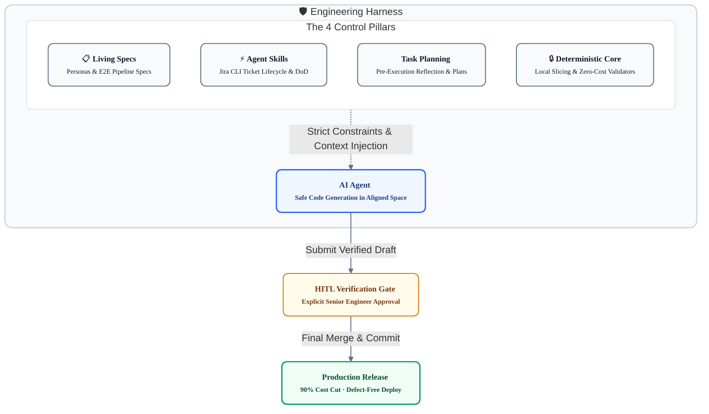
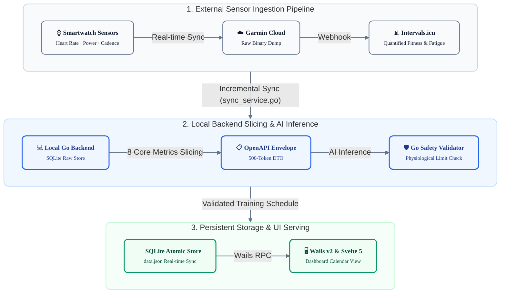
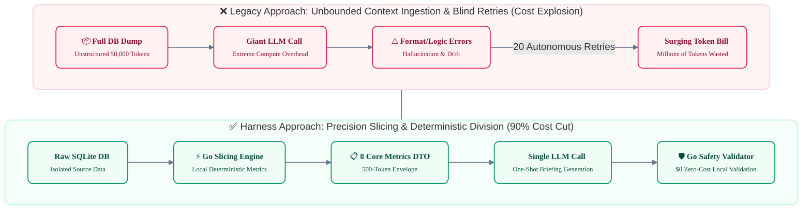
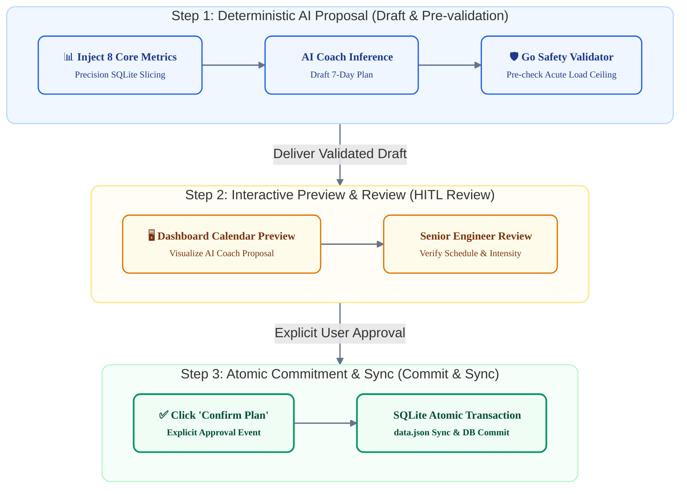

# How to Turn AI into a True Teammate: Spec-Driven Harness Engineering and Google OKF

> **"Give AI unbounded freedom, and you will receive endless debugging ping-pong and wasted tokens in return. But equip AI with a meticulously engineered harness and a Google OKF master index, and it finally transforms into a dependable teammate sharing accountability for production-grade code."**

After extensive trial and error integrating generative AI and autonomous agents into real-world software development, we share the production architecture and concrete engineering assets of **Spec-Driven Harness Engineering**—a disciplined framework built to eradicate context pollution, eliminate hallucinations, and deliver rock-solid production software.

---

### 📺 Production Workflow Preview

Before diving into the architecture, here is a walkthrough demonstrating how **Harness Engineering and the Google OKF master index** operate in practice. This demo showcases RunPulse AI—a smartwatch healthcare data analytics application—orchestrating terminal agents, Jira CLI tooling, and an Obsidian-based spec index into a cohesive, uninterrupted development pipeline:

<div align="center">
  <iframe width="100%" height="450" src="https://www.youtube.com/embed/28xzXMUCPdE" title="RunPulse AI & agy Agent Workflow Demo" frameborder="0" allow="accelerometer; autoplay; clipboard-write; encrypted-media; gyroscope; picture-in-picture; web-share" allowfullscreen></iframe>
</div>

> 🔗 **Video Link**: [https://youtu.be/28xzXMUCPdE](https://youtu.be/28xzXMUCPdE)

---

## The Thrill of Vibe Coding and the Bitter Reality of Production

Recently, 'vibe coding'—conjuring functional code from a few lines of natural language prompts—has generated immense buzz across the developer community. For spinning up quick web frontend prototypes or standard CRUD APIs, its raw speed is undeniably impressive.

However, when engineering teams deploy unconstrained AI into complex production environments entangled with legacy data pipelines and nuanced business invariants, they inevitably hit four painful barriers:

1. **Endless Debugging Ping-Pong**: Prompting the AI to fix one defect alters unrelated legacy code, triggering secondary bugs and trapping developers in an exhausting cycle of alternating fixes.
2. **Context Degradation and Hallucinations**: As codebases expand, the model loses holistic context, hallucinating non-existent functions, outdated signatures, or imaginary libraries.
3. **Exploding Token Invoices**: Granting autonomous authority allows agents to scan dozens of files unassisted, entering retry loops that incinerate hundreds of dollars in API fees within hours.
4. **Mounting Review Fatigue**: The time required to scrutinize, verify, and sanity-check AI-generated code often doubles or triples the time it would have taken to write it manually.

Ultimately, teams succumb to engineering cynicism: *"It would have been faster if I just wrote it myself."* The root cause is not a deficit in LLM intelligence; it is **granting unbounded autonomy without engineering guardrails to constrain it.**

---

## Why Coding Will Not Disappear Despite Ever-Larger Models

With every new flagship model announcement, marketing campaigns proclaim that *"humans will never need to code again."* This illusion fundamentally overlooks the essence of software engineering. Regardless of parameter scaling, two foundational realities remain insurmountable:

### Gödel's Incompleteness Theorems and Closed Systems

Mathematician Kurt Gödel proved that **"in any consistent formal system, there are propositions that cannot be proven true or false using only the rules within that system."**

Large language models are inherently **'closed statistical systems'** trained on historical data. Conversely, the real-world software requirements engineers solve exist **strictly outside that system**. Anomalous sensor noise on smartwatches, fluctuating user physiological conditions, and shifting enterprise business policies cannot be derived from a model's static weights alone. Unless an engineer continuously injects domain context as external axioms, an AI confined to its closed statistical system cannot avoid hallucinations and specious reasoning.

### Essential Complexity Cannot Be Bypassed

In the software engineering classic *The Mythical Man-Month*, Fred Brooks divided complexity into two distinct categories:

* **Accidental Complexity**: Tool-oriented labor, such as syntax memorization, boilerplate scaffolding, and library configuration.
* **Essential Complexity**: Modeling domain business challenges into logical data structures, evaluating architectural trade-offs, and ensuring system invariants.

Generative AI dramatically mitigates accidental complexity. However, resolving essential complexity—*"How do we isolate data conflicts atomically?"* or *"What is the precise physiological ceiling for user strain?"*—remains beyond the autonomous reach of foundation models.

---

## Harness Engineering: How Do We Actually Rein in AI?

A harness is originally equipment designed to steer and channel the formidable pulling power of horses or sled dogs into a controlled direction.

In software development, **Harness Engineering** refers to a comprehensive control architecture that encloses the raw generative propulsion of AI within a verified trajectory of specifications and deterministic constraints, reliably extracting predictable, testable, and production-ready deliverables.



### The Senior Developer's Shift: From Typist to Systems Architect

In harness engineering, the senior developer's role transforms completely. They are no longer keyboard operators manually typing every line of boilerplate.

Instead, they become **systems architects and gatekeepers who eliminate problem-space ambiguity in advance, define the boundaries of the playing field (specs), and construct deterministic safety nets (validators)** to keep the closed-system AI on track.

### Real-World Harness Directory Layout

How is this "harness" materialized within a physical repository? Examining the root structure of the RunPulse project illustrates strict physical isolation across architectural layers:

```
runpulse-ai/
├── AGENTS.md                 # [1. System Rules] Agent behavioral constraints (Persona, Git guardrails, OKF precedence)
├── docs/                     # [2. Living Specs & Master Index]
│   ├── okf.yaml              # Master Harness Index (1:1 mapping: Feature <-> Spec <-> Target Code)
│   ├── openapi.yaml          # OpenAPI 3.0.3 DTO contracts and REST interfaces
│   ├── requirements/         # Persona & functional requirements specifications
│   ├── architecture/         # E2E data pipelines & architectural diagrams
│   └── agents/               # Domain-specific AI agent prompts & I/O constraint specs
├── .agents/skills/           # [3. Agent Skills]
│   └── jira/                 # Jira CLI integration & Definition of Done (DoD) protocols
├── task/                     # [4. Execution Plans]
│   ├── 01_running_coach_agent_implementation_plan.md
│   ├── 07_weekly_plan_generation_uiux_and_pipeline_plan.md
│   └── ...                   # Step-by-step plans preventing unapproved code edits
└── tool/runpulse-app/        # [5. Isolated Production Codebase]
    ├── app.go                # Wails v2 Go RPC binding controller
    ├── internal/agent/       # Go 8-metric precision slicer & Safety Validator ($0 compute)
    ├── internal/db/          # SQLite transactions & atomic persistent datastores
    └── frontend/src/         # Svelte 5 components & reactive state stores
```

| Layer | Path | Role and Physical Control Mechanism |
| :--- | :--- | :--- |
| **System Rules** | `AGENTS.md` | Constrains agent behavioral boundaries (Persona lock, no unauthorized git commands, mandatory pre-execution explanations) |
| **Master Index** | `docs/okf.yaml` | Pinpoints the 1–2 target files per task, preventing wide scans and context pollution |
| **Spec Artifacts** | `docs/` | Supplies data pipelines and API contracts, eradicating schema hallucinations |
| **Collaboration Skills** | `.agents/skills/` | Enforces Jira ticket creation, state transitions, and DoD verification protocols |
| **Execution Plans** | `task/` | Mandates upfront planning and explicit declaration of modification scope (self-reflection) |
| **Production Code** | `tool/runpulse-app/` | Physically isolates the production codebase, permitting edits only to specified target files |

The AI is prevented from traversing the codebase arbitrarily. Bound by system rules (`AGENTS.md`), it can access production source code only after navigating living specs and an approved execution plan.

---

## Living Specs: How Documentation Becomes Executable Agent Guardrails

The first practical pillar of harness engineering is **formalizing product requirements, personas, and data pipelines into executable specifications**. These documents are not passive reading material; they function as active guardrails that drastically narrow the AI's search space.

### Decoupling Official Personas from Runtime State

Prompting an AI with *"Build a running coach app"* produces erratic logic cobbled together from generic internet tutorials. Conversely, hardcoding an individual's weight or age directly into documentation degenerates the software into a brittle, single-user toy.

Harness engineering rigorously decouples the **'Official Customer Persona'** from **'Runtime State Data'**:

* **Official Customer Persona (Spec)**: Establishes a concrete target profile—*"A 50-something amateur runner using a Garmin smartwatch to manage long-term health"*—along with domain problem statements (overcoming Garmin's rigid 220-age formula, escaping the moderate-intensity trap, enforcing 80/20 polarized training to prevent injury).
* **Runtime State Data (Dynamic Profile)**: Individual user metrics—actual body weight, age, and lactate threshold heart rate (LTHR) reverse-engineered from Garmin sensors—are retrieved dynamically from SQLite at runtime and injected as lightweight DTOs.

By anchoring persona philosophy and constraints (injury prevention rules, weekly load ramp limits) within living specs, the AI cannot generate reckless high-intensity sessions. It operates strictly within a biologically safe trajectory.

### E2E Data Pipeline Specifications

When writing backend logic, agents frequently invent field names or guess data origins. To eliminate this vulnerability, the end-to-end data lifecycle—from smartwatch sensors to frontend rendering—must be rigorously standardized in advance:



With explicit sensor ingestion contracts, DTO envelopes (`docs/openapi.yaml`), and DB schemas declared upfront, the AI cannot hallucinate field names. It writes safe, compliant code exclusively within defined pipeline boundaries.

---

## Agent Collaboration Governed by Protocols: Jira CLI and Pre-Execution Reflection

Just as human engineers coordinate via tickets and pull requests, AI agents must adhere to structured engineering collaboration protocols.

### Packaging Jira CLI as an Agent Skill

To prevent agents from drifting or dropping context mid-task, we packaged [joincdream/jira-cli](https://github.com/joincdream/jira-cli)—a lightweight terminal CLI—directly into an agent skill (`.agents/skills/jira/`):

```
.agents/skills/jira/
├── SKILL.md          # Jira CLI commands and state transition protocol
└── jira              # Lightweight binary
```

The agent operates under a deterministic protocol:
1. Deconstructs an overarching epic (`KAN-29`) into backend (`KAN-37`) and frontend (`KAN-36`) sub-tickets.
2. Transitions the active ticket to `In Progress` immediately upon starting.
3. Transitions to `In Review` and logs execution logs as comments **only after** passing all Definition of Done (DoD) criteria: unit tests (`go test ./...`) and the static build (`make build`).


*▲ Production project view: An agent managing Jira ticket lifecycles and enforcing Definition of Done (DoD) criteria*

Crucially, ticket management integrates seamlessly with the Jira timeline roadmap. As the agent updates epics, task dates, and dependencies on the timeline, human teammates track AI progress at a glance, maintaining synchronized collaboration across the entire team:


*▲ Jira timeline view coordinated by AI: Visualizing epics and schedules to synchronize team roadmaps*

### Pre-Execution Self-Reflection

A cornerstone principle of harness engineering is: **"Explain what you will do before touching any code."** Prior to modifying files or running commands, the AI must output an explicit structured declaration:

> **[Example of Pre-Execution Self-Reflection]**  
> * **Target File**: `internal/db/action_plan.go`  
> * **Objective**: Implement `SaveWeeklySchedulePlans` to batch-persist a 7-day schedule into SQLite  
> * **Implementation Details**: Map the `CalendarDaySchedule` DTO to DB columns, ensuring atomic updates via `tx.Begin` transactions and `ON CONFLICT` clauses  

Forcing the agent to declare its target files and rationale in text triggers internal self-reflection. This completely precludes accidents where the model edits files outside the scope of work or introduces unintended architectural side effects.

---

## Practical FinOps: Slicing Token Consumption by 90%

The most daunting economic hurdle in enterprise AI adoption is spiraling API costs. This stems less from baseline model pricing than from grossly inefficient context management:



### Eliminating Indiscriminate Context Ingestion
Dumping entire database snapshots or raw multi-megabyte JSON blobs into prompts squanders budget and dilutes model attention. The RunPulse backend (`schedule_planner.go`) uses local Go code to slice raw metrics down to only the 8 physiological indicators essential for decision-making (acute load, wellness score, HR zone distribution, weekly mileage), packaging them into a **compact 500-token DTO**.

### Zero-Cost Deterministic Local Validation
Rule-based verification—evaluating date arithmetic, boundary comparisons, and JSON schema compliance—is performed millions of times faster, cheaper, and more accurately by compiled code than by an LLM:
* **Local Go Validator**: Evaluates acute load boundaries and date validity instantaneously at $0 marginal cost.
* **The AI's Role**: Focuses solely on natural language synthesis—crafting an intuitive, personalized coaching summary from clean, verified data.

Offloading calculations and schema checks to local code eliminated autonomous retry loops entirely, yielding reliable deliverables on a single API call.

---

## Google OKF: A Master Index to Navigate Large Codebases

An agent's most vulnerable moment in a large codebase is when it does not know where to look. Resorting to wide keyword searches pollutes its context window and leads to edits on the wrong files.

Google introduced the **Open Knowledge Fabric (OKF)** as an enterprise graph linking codebase symbols, call relationships, and specifications.

| Comparison Vector | Bottom-Up Code Reverse-Engineering (Google Original) | Top-Down Harness Index (Spec-First Approach) |
| :--- | :--- | :--- |
| **Extraction Source** | Massive existing source repositories | **PRDs, OpenAPI specs, Jira tickets, domain invariants** |
| **Infrastructure Overhead** | Heavy AST parsers and persistent LSP daemons | **Lightweight Markdown / YAML metadata; zero compute overhead** |
| **Intent Preservation** | Structural function-call graphs | **1:1 preservation of business goals and domain intent** |
| **Task Isolation** | Complex subgraph calculations | **Isolates the 1–2 target files and validators directly from the index** |

### Real-World `docs/okf.yaml` Master Index

Adapting Google's concept to practical engineering, we mapped design and architecture deliverables into a unified `docs/okf.yaml` manifest:

```yaml
# docs/okf.yaml Real Mapping Structure (RunPulse AI Production Case Study)
version: "1.0.0"
project_name: "RunPulse AI"
description: "Garmin Data-driven Health & Masters Running Coaching System"

# 1. Official Persona & Global Invariants (Target Persona & Global Constraints)
persona:
  target_segment: "50-something amateur runner using Garmin for sustainable running and health"
  pain_points:
    - "Distorted HR zones from rigid 220-age formulas and unhelpful raw log dumps"
    - "Falling into the 'moderate intensity trap,' resulting in chronic fatigue and joint strain"
    - "Overwhelmed by metric graphs without actionable guidance on how to train today"
  core_needs:
    - "Zone 2-centric 80/20 polarized training prescriptions for sustainable health"
    - "Personalized LTHR modeling automatically reverse-engineered from sensor logs"
    - "Strict weekly load ceilings and ramp rate controls to prevent overtraining"
  global_guardrails:
    max_weekly_mileage_increase_pct: 10.0  # Never exceed +10% weekly mileage increase
    polarized_training_ratio: "80:20"     # 80% low intensity, 20% mid/high intensity
    mandatory_recovery_rule: "Rest or Zone 2 recovery run required within 48h of high-intensity sessions"

# 2. Domain Harness Artifacts and Target Codebase Mapping
features:
  - id: "weekly_schedule_planner"
    name: "Weekly Periodization Training Planner"
    description: "Slices 8 core physiological metrics (HRV, RHR, acute load) to generate a 7-day schedule with atomic DB commits"
    harness_artifacts:
      planning: "docs/planning/01_product_and_persona.md"
      requirements:
        - "docs/requirements/01_software_requirements.md"
        - "docs/requirements/02_ui_ux_display_policy.md"
      architecture: "docs/architecture/06_multi_agent_system.md"
      agent_spec: "docs/agents/02_schedule_planner.md"
      api_spec: "docs/api/openapi.yaml#/paths/~1api~1schedule~1weekly"
      task_plan:
        - "task/07_weekly_plan_generation_uiux_and_pipeline_plan.md"
    target_codebase:
      backend_slicer_and_runner: "tool/runpulse-app/internal/agent/schedule_planner.go"
      data_access: "tool/runpulse-app/internal/db/action_plan.go"
      rpc_binding: "tool/runpulse-app/app.go"
      frontend_view: "tool/runpulse-app/frontend/src/lib/views/CockpitView.svelte"
      frontend_modal: "tool/runpulse-app/frontend/src/lib/components/WeeklyPlanModal.svelte"
    guardrails:
      deterministic_validator: "tool/runpulse-app/internal/agent/validator.go"
      unit_tests:
        - "tool/runpulse-app/internal/agent/schedule_planner_test.go"
      business_rules:
        - "Weekly load ramp must not exceed +10% over previous week"
        - "Weekly load ceiling capped at 351pt"
        - "High-intensity sessions must be followed by active recovery (Zone 2)"
        - "Mandate 1-2 full rest days per week for 50+ masters runner joint protection"
```



```mermaid
flowchart LR
    classDef default font-family:Pretendard,sans-serif,font-size:13px;
    classDef s1 fill:#f8fafc,stroke:#64748b,stroke-width:1.5px,color:#0f172a,rx:8px;
    classDef s2 fill:#eff6ff,stroke:#2563eb,stroke-width:2px,color:#1e3a8a,font-weight:bold,rx:8px;
    classDef s3 fill:#fffbeb,stroke:#d97706,stroke-width:1.5px,color:#78350f,rx:8px;
    classDef s4 fill:#f0fdf4,stroke:#059669,stroke-width:2px,color:#064e3b,font-weight:bold,rx:8px;

    Step1["📁 <b>1. Structured Specs</b><br/><small>docs/ Hierarchy Isolation</small>"]:::s1
    Step2["📑 <b>2. Master Index</b><br/><small>docs/okf.yaml Mapping</small>"]:::s2
    Step3["🛡️ <b>3. Enforce Rules</b><br/><small>AGENTS.md Strict Precedence</small>"]:::s3
    Step4["🎯 <b>4. Isolated Execution</b><br/><small>Zero Wide Scans · 100% Target Isolation</small>"]:::s4

    Step1 -->|"Extract Metadata"| Step2
    Step2 -->|"Inject via System Prompt"| Step3
    Step3 -->|"Execute Targeted Work"| Step4

    linkStyle default stroke:#64748b,stroke-width:1.5px
```

Notice that individual metrics (actual user age or weight) are omitted from `okf.yaml`. Such variables are retrieved dynamically from SQLite at runtime. The `okf.yaml` file codifies strictly the **official persona philosophy and domain business guardrails**, securing software generality and rigor simultaneously.

Upon receiving an instruction, the agent inspects `docs/okf.yaml` first. It immediately pinpoints that only `schedule_planner.go` requires backend modifications—achieving **zero wide searches and 100% target file isolation.**

---

## HITL: The 3-Step Verification Loop for Defect-Free Deployments

Writing AI-generated code directly into production databases is unacceptable in mission-critical domains like healthcare, finance, or billing. Human oversight remains mandatory.

The terminal milestone of harness engineering is the **Human-in-the-Loop (HITL)** verification loop:



* **Step 1**: When the AI drafts a schedule, a local Go validator evaluates acute load boundaries and date integrity before any persistence occurs.
* **Step 2**: The validated draft is rendered on the UI dashboard as an interactive preview card, presenting the proposed training schedule directly to the engineer.
* **Step 3**: Only when the human engineer reviews and explicitly clicks 'Confirm Plan' is the schedule committed atomically to SQLite via an active transaction (`tx.Begin`).

Through this three-stage verification process, even the most eccentric hallucinations are caught and quarantined before reaching production systems.

---

## Conclusion: The Software Engineering Paradox and the Era of the Harness Architect

The RunPulse project—spanning product planning, OpenAPI modeling, Go backend slicing, a Svelte 5 frontend dashboard, and automated unit test suites—was completed in just two days.

This speed and quality did not come from asking an AI to *"build everything automatically."*

* It recognized the closed-system limitations of generative AI,
* Narrowed the problem space via Living Specs and OKF master indices, and
* Firmly anchored the AI's execution path using deterministic local validators and Jira-backed Definitions of Done.

### The Paradox Foreseen by Software Masters

Many claim that *"because AI writes code now, there is no need to study software engineering deeply."* In production environments, the truth is precisely the opposite.

Kent Beck reflected on how generative AI recalibrated the value of his skills:

> **"90% of my programming skills—memorizing syntax, searching APIs, and typing boilerplate—instantly lost their monetary value. But the remaining 10%—problem decomposition, systems thinking, and risk management—saw their value multiply a thousandfold overnight."**

Grady Booch, a pioneer of object-oriented design and UML, issued a prescient warning:

> **"A fool with a tool is just a more powerful fool. LLMs emit code probabilistically without understanding architecture. The essence of software engineering is not outputting text, but designing resilient, sustainable systems within evolving contexts."**

### The End of the Coder, The Return of the True Engineer

The era of the rote coder—mechanically typing syntax and copy-pasting snippets—is over. In the hands of an undisciplined developer, AI merely becomes a high-velocity bug generator, compounding technical debt and security holes at lightspeed.

Conversely, for engineers who understand modular boundaries, physical isolation of concerns, and the clean decoupling of state from specifications, AI represents an extraordinary engine of propulsion.

The history of software engineering has always been one of ascending levels of abstraction: from assembly language to C, to structured programming, to high-level frameworks. Generative AI is simply the next leap in abstraction.

An engineer's true competitive edge no longer lies in typing speed, but in **the architectural mastery to construct the arena and design the safety guardrails within which AI can race at full velocity.** Paradoxically, only those who understand software engineering at its deepest level will harness the wild horse of AI and thrive. This is why harness engineering demands our full attention.
