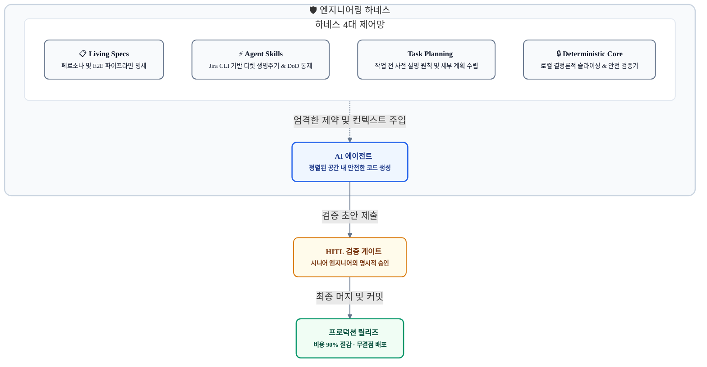
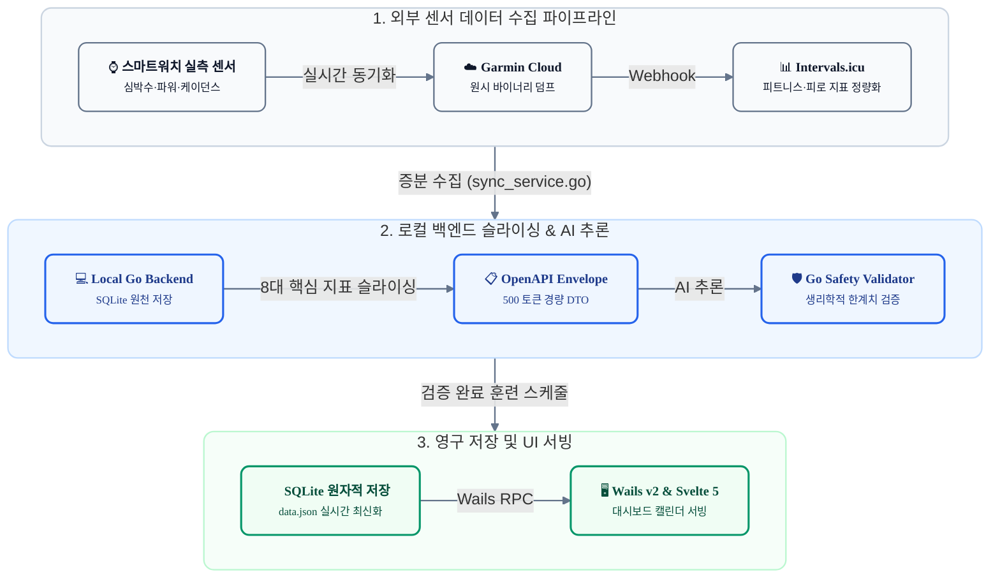
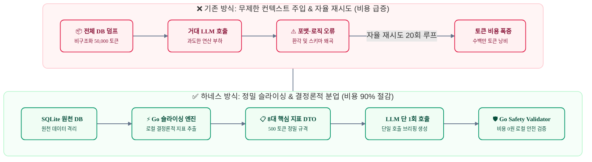
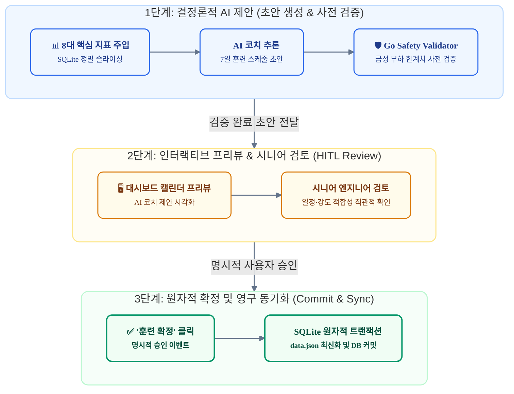

# AI를 진짜 동료로 만드는 법: 스펙 드리븐 하네스 엔지니어링과 Google OKF

> **"AI에게 무한한 자유를 주면 끝없는 디버깅 핑퐁과 토큰 낭비가 돌아옵니다. 하지만 정교하게 설계된 하네스와 Google OKF 마스터 인덱스를 쥐여주면, AI는 비로소 프로덕션 코드를 함께 책임지는 든든한 동료가 됩니다."**

최근 생성형 AI와 자율 에이전트를 실무 개발에 도입하면서 겪었던 수많은 시행착오 끝에, 컨텍스트 낭비와 환각을 차단하고 안정적인 프로덕션 코드를 완성해 낸 **스펙 드리븐 하네스 엔지니어링**의 실전 아키텍처와 구체적인 엔지니어링 자산들을 공유합니다.

---

### 📺 실전 워크플로우 미리보기

글을 시작하기에 앞서, 본 포스트에서 설명할 **하네스 엔지니어링과 Google OKF 마스터 인덱스**가 실제로 어떻게 동작하는지 담은 시연 영상입니다. 스마트워치 헬스케어 데이터 분석 앱인 RunPulse AI를 개발하며 터미널 에이전트, Jira CLI 도구, Obsidian 기반 스펙 인덱스를 하나로 엮어낸 개발 흐름을 확인하실 수 있습니다.

<div align="center">
  <iframe width="100%" height="450" src="https://www.youtube.com/embed/28xzXMUCPdE" title="RunPulse AI & agy 에이전트 워크플로우 데모" frameborder="0" allow="accelerometer; autoplay; clipboard-write; encrypted-media; gyroscope; picture-in-picture; web-share" allowfullscreen></iframe>
</div>

> 🔗 **영상 링크**: [https://youtu.be/28xzXMUCPdE](https://youtu.be/28xzXMUCPdE)

---

## 바이브 코딩의 짜릿함, 그리고 프로덕션의 쓴맛

최근 개발자들 사이에서 자연어 프롬프트 몇 줄로 코드를 뚝딱 만들어내는 '바이브 코딩'이 큰 화제를 모았습니다. 실제로 간단한 웹 프론트엔드 목업을 띄우거나, 정형화된 CRUD API를 만들 때는 놀라운 생산성을 보여줍니다.

하지만 복잡한 비즈니스 규칙과 레거시 데이터 파이프라인이 얽혀 있는 프로덕션 환경에 AI를 투입해 본 엔지니어링 팀이라면 누구나 다음과 같은 뼈아픈 장벽을 마주하게 됩니다.

1. **끝없는 디버깅 핑퐁**: 버그를 고쳐달라고 지시하면 엉뚱한 레거시 코드를 건드려 또 다른 버그를 만들고, AI와 사람이 번갈아 가며 코드를 고치는 악순환에 빠집니다.
2. **컨텍스트 오염과 환각**: 코드베이스가 커질수록 AI가 전체 맥락을 잃어버리고, 존재하지도 않는 함수나 라이브러리를 제멋대로 상상해서 작성합니다.
3. **치솟는 토큰 비용**: 에이전트에게 자율 권한을 줬더니 파일 수십 개를 혼자 읽고 재시도 루프를 돌면서 단 몇 시간 만에 수십만 원의 API 요금을 날려버립니다.
4. **늘어나는 리뷰 피로도**: 코드를 짜는 시간보다 AI가 쏟아낸 코드가 안전한지 의심하고 검증하는 데 두세 배의 리소스가 소모됩니다.

결국 "이럴 바엔 내가 직접 손으로 짜는 게 훨씬 빠르겠다"는 엔지니어링 회의론으로 귀결되곤 합니다. 이러한 문제의 원인은 LLM의 지능이 부족해서가 아니라, **AI를 제어할 엔지니어링 가드레일 없이 무제한의 자율성을 주었기 때문**입니다.

---

## 최신 모델이 나와도 코딩이 사라지지 않는 이유

새로운 플래그십 모델이 발표될 때마다 "이제 사람이 코딩할 필요가 없다"는 마케팅이 쏟아집니다. 하지만 이는 소프트웨어 공학의 본질을 간과한 착시입니다. 모델의 파라미터가 아무리 커져도 넘을 수 없는 두 가지 본질적인 이유가 있습니다.

### 괴델의 불완전성 정리와 닫힌 계

수학자 쿠르트 괴델은 **"모순이 없는 체계 안에는, 그 체계 내부의 규칙만으로는 참인지 거짓인지 증명할 수 없는 명제가 반드시 존재한다"**는 불완전성 정리를 증명했습니다.

대형 언어 모델은 과거의 데이터로 학습된 일종의 **'닫힌 통계 체계'**입니다. 반면 우리가 풀어야 할 현실 세계의 소프트웨어 요구사항은 항상 **체계 바깥**에 존재합니다. 스마트워치 센서의 이상 노이즈, 사용자의 컨디션 변화, 시시각각 바뀌는 비즈니스 정책 같은 현실의 맥락은 모델 내부의 가중치만으로 도출해 낼 수 없습니다. 외부에서 엔지니어가 도메인 맥락을 외부 공리로 끊임없이 주입해 주지 않는 한, 닫힌 계 안에 갇힌 AI는 환각과 궤변을 피할 수 없습니다.

### 본질적 복잡성은 생략할 수 없다

소프트웨어 공학의 고전 *맨먼스 미신*을 쓴 프레드 브룩스는 복잡성을 두 가지로 나누었습니다.

* **우발적 복잡성**: 문법 타이핑, 보일러플레이트 작성, 라이브러리 연동 같은 도구적 노동
* **본질적 복잡성**: 비즈니스 문제를 논리적 데이터 구조로 모델링하고, 트레이드오프를 판단하며 아키텍처를 설계하는 작업

생성형 AI는 우발적 복잡성을 드라마틱하게 줄여주었습니다. 하지만 "데이터 충돌을 어떻게 원자적으로 격리할 것인가?", "사용자의 부하 한계치를 어디까지 허용할 것인가?"와 같은 본질적 복잡성은 모델 스스로 해결할 수 없습니다.

---

## 하네스 엔지니어링: AI의 고삐는 실제로 어떻게 채우는가?

하네스는 본래 썰매견이나 말의 추진력을 제어하기 위해 착용시키는 마구를 뜻합니다. 

소프트웨어 개발에서 **하네스 엔지니어링**이란, 자유분방하게 날뛰는 AI의 추진력을 명세와 제약 조건이라는 안전 궤도 안에 가두어, 예측 가능하고 검증 가능한 결과물을 뽑아내는 종합 제어 아키텍처를 의미합니다.



### 시니어 개발자의 역할: 사공에서 시스템 아키텍트로

하네스 엔지니어링에서 시니어 개발자의 역할은 완전히 바뀝니다. 더 이상 키보드를 잡고 한 줄 한 줄 코드를 타이핑하는 사공이 아닙니다. 

닫힌 체계인 AI가 길을 잃지 않도록 **문제 공간의 불확실성을 사전에 덜어내고, 경기장 규격(스펙)을 세우며, 결정론적 안전망(검증기)을 설계하는 시스템 아키텍트**이자 최종 승인권자가 되는 것입니다.

### 실제 하네스 프로젝트 디렉토리 구조

그렇다면 "고삐를 채운다"는 것은 구체적으로 파일 시스템 상에서 어떻게 구현될까요? RunPulse 프로젝트의 실제 루트 디렉토리 구조를 보면, 철저하게 관심사별로 물리적 격리가 이루어져 있음을 알 수 있습니다.

```
runpulse-ai/
├── AGENTS.md                 # [1. 시스템 규칙] 에이전트 행동 제약 (페르소나, Git 임의 실행 금지, OKF 우선 조회)
├── docs/                     # [2. Living Specs 및 마스터 인덱스]
│   ├── okf.yaml              # 하네스 마스터 인덱스 (기능 ↔ 스펙 ↔ 타깃 소스코드 1:1 매핑)
│   ├── openapi.yaml          # OpenAPI 3.0.3 DTO 규격 및 REST 인터페이스
│   ├── requirements/         # 페르소나 및 세부 기능 요구사항 명세서
│   ├── architecture/         # E2E 데이터 파이프라인 및 시스템 설계도
│   └── agents/               # 도메인별 AI 에이전트 프롬프트 및 입출력 제약 스펙
├── .agents/skills/           # [3. 에이전트 Skill]
│   └── jira/                 # Jira CLI 연동 및 완료 기준(DoD) 통제
├── task/                     # [4. 실행 계획서]
│   ├── 01_running_coach_agent_implementation_plan.md
│   ├── 07_weekly_plan_generation_uiux_and_pipeline_plan.md
│   └── ...                   # 사전 승인 없는 코드 수정 방지를 위한 작업 계획서
└── tool/runpulse-app/        # [5. 격리된 프로덕션 코드베이스]
    ├── app.go                # Wails v2 Go RPC 바인딩 컨트롤러
    ├── internal/agent/       # Go 8대 지표 정밀 슬라이싱 및 Safety Validator (0원 연산)
    ├── internal/db/          # SQLite 트랜잭션 및 원자적 영구 저장소
    └── frontend/src/         # Svelte 5 컴포넌트 및 반응형 상태 스토어
```

| 계층 | 대상 경로 | 역할 및 물리적 통제 기능 |
| :--- | :--- | :--- |
| **시스템 규칙** | `AGENTS.md` | 에이전트 행동 반경 제어 (페르소나 고정, Git 자의적 실행 금지, 작업 전 사전 설명 강제) |
| **마스터 인덱스** | `docs/okf.yaml` | 작업 시 수정할 파일 1~2개만 즉시 특정하여 광역 검색과 컨텍스트 오염 차단 |
| **스펙 아티팩트** | `docs/` | 데이터 파이프라인 및 API 규격 등 명세 제공 (환각 차단) |
| **협업 도구** | `.agents/skills/` | Jira 티켓 생성, 상태 전이, DoD 검증 프로토콜 정의 |
| **실행 계획** | `task/` | 개발 착수 전 세부 계획 수립 및 변경 목적 사전 선언 (자가 점검 유도) |
| **프로덕션 격리** | `tool/runpulse-app/` | 지정된 소스 파일만 수정하도록 물리적 작업 범위 격리 |

AI는 프로젝트 전체를 자기 마음대로 휘젓고 다닐 수 없습니다. 시스템 규칙(`AGENTS.md`)에 묶인 채, 지정된 스펙 문서와 실행 계획서를 거쳐야만 프로덕션 코드에 접근할 수 있습니다.

---

## Living Spec: 문서가 AI의 실행 코드가 되는 원리

하네스 엔지니어링의 첫 번째 실천 축은 **기획, 페르소나, 데이터 파이프라인의 명세화**입니다. 이 문서들은 단순한 읽을거리가 아니라, AI의 탐색 공간을 극적으로 좁히는 실행형 가드레일로 작동합니다.

### 공식 고객 페르소나와 런타임 상태 데이터의 분리

"러닝 코칭 앱을 만들어줘"라고 지시하면 AI는 인터넷에 돌아다니는 흔한 예제들을 뒤섞어 엉뚱한 로직을 내놓습니다. 그렇다고 스펙 문서에 특정 개인의 몸무게나 나이를 하드코딩해 두면, 범용 제품이 아닌 1인용 토이 프로젝트로 전락하고 맙니다.

하네스 엔지니어링에서는 **'공식 고객 페르소나'**와 **'런타임 상태 데이터'**의 책임을 명확히 분리합니다.

* **공식 고객 페르소나 (스펙)**: "가민 스마트워치를 착용하고 지속 가능한 건강 관리를 위해 달리는 50대 생활 체육인"이라는 명확한 타깃과 문제의식(가민 커넥트의 획일적 공식 한계, 중강도의 함정 탈출, 부상 방지 80/20 양극화 훈련)을 스펙으로 규정합니다.
* **런타임 상태 데이터 (동적 프로필)**: 사용자의 실제 체중, 나이, 가민 센서에서 역추적된 젖산역치심박 같은 개별 수치는 SQLite DB와 프로필 설정에서 런타임에 읽어와 경량 DTO로 주입합니다.

이처럼 스펙에서 페르소나의 철학과 제약(부상 방지 원칙, 주간 부하 점증률 한계)을 못 박아두면, AI는 엉뚱한 고강도 세션을 제멋대로 생성하지 못하고 안전한 궤도 안에서만 훈련 로직을 작성합니다.

### E2E 데이터 수집 및 서빙 파이프라인 명세

AI가 백엔드 코드를 작성할 때 가장 빈번하게 발생하는 사고는 데이터 출처와 스키마를 임의로 추측하는 것입니다. 이를 방지하기 위해 스마트워치 센서부터 프론트엔드 렌더링까지 이어지는 전체 데이터 흐름을 사전에 규격화했습니다.



이처럼 센서 수집 경로와 DTO 규격(`docs/openapi.yaml`), DB 스키마가 선언되어 있으면, AI는 필드명을 상상해서 지어내지 못하고 오직 정의된 파이프라인 규격 안에서만 코드를 안전하게 작성합니다.

---

## 프로토콜로 통제하는 에이전트 협업: Jira CLI와 사전 설명

사람 개발자와 일할 때 티켓을 발급하고 PR을 올리는 것처럼, AI 에이전트에게도 동일한 엔지니어링 협업 절차를 강제해야 합니다.

### Jira CLI 도구를 에이전트 스킬로 패키징

에이전트가 작업을 진행하다가 맥락을 잃어버리는 현상을 막기 위해, 터미널 환경에서 가볍게 동작하는 [joincdream/jira-cli](https://github.com/joincdream/jira-cli) 오픈소스 도구를 에이전트 스킬(`.agents/skills/jira/`)로 패키징했습니다.

```
.agents/skills/jira/
├── SKILL.md          # Jira CLI 명령어 및 상태 전이 규칙
└── jira              # 경량 바이너리
```

에이전트는 정해진 프로토콜에 따라 작업을 수행합니다.
1. 상위 에픽(`KAN-29`) 아래에 백엔드 개발(`KAN-37`)과 프론트엔드 개발(`KAN-36`) 티켓을 체계적으로 분할합니다.
2. 작업 시작과 동시에 티켓을 `In Progress`로 전이합니다.
3. 티켓의 완료 기준(DoD)에 정의된 단위 테스트(`go test ./...`)와 빌드(`make build`)를 통과해야만 실행 로그를 코멘트로 기록하고 `In Review`로 넘길 수 있습니다.


*▲ 실제 프로젝트에서 에이전트가 Jira 티켓 생명주기와 완료 기준(DoD)을 통제하며 작업하는 화면*

특히 이러한 티켓 관리는 단순 체크리스트에 그치지 않고 Jira 타임라인 로드맵과 긴밀히 연결됩니다. 에이전트가 상위 에픽과 하위 세부 과업의 일정 및 선후 의존 관계를 타임라인에 체계적으로 기록하므로, 다른 동료 개발자들도 AI의 개발 진행률을 한눈에 파악하고 동일한 프로젝트 궤도 위에서 유기적으로 협업할 수 있습니다.


*▲ AI가 조율하는 Jira 타임라인 화면: 에픽과 작업 일정이 시각화되어 팀 전체의 로드맵 동기화 지원*

### 작업 전 사전 설명 원칙

하네스 엔지니어링의 핵심 원칙 중 하나는 **"코드를 건드리기 전에 무엇을 할지 먼저 설명하라"**는 것입니다. AI는 코드를 수정하거나 명령을 실행하기 직전, 반드시 다음과 같은 텍스트를 먼저 선언해야 합니다.

> **[실제 작업 전 사전 설명 예시]**  
> * **대상 파일**: `internal/db/action_plan.go`  
> * **작업 목적**: 7일 계획을 SQLite에 일괄 저장하는 `SaveWeeklySchedulePlans` 함수 추가  
> * **주요 구현 내용**: `CalendarDaySchedule` DTO를 DB 컬럼에 매핑하고, 트랜잭션(`tx.Begin`) 및 `ON CONFLICT` 구문을 통해 안전한 원자적 갱신 보장  

작업할 대상 파일과 목적을 텍스트로 먼저 서술하게 만들면, 모델 내부에서 자체 점검(Self-reflection)이 일어납니다. 계획 범위에 벗어난 파일을 건드리거나 예상치 못한 사이드 이펙트를 일으키는 참사를 사전에 완벽하게 차단할 수 있습니다.

---

## 토큰 90%를 깎아내는 실전 FinOps 아키텍처

AI를 도입할 때 마주하는 가장 큰 경제적 장벽은 치솟는 API 비용입니다. 이는 모델 단가 문제라기보다, 컨텍스트를 비효율적으로 다루기 때문입니다.



### 무지성 컨텍스트 주입 차단
과거 데이터베이스 전체나 원시 JSON을 프롬프트에 통째로 쏟아붓는 것은 돈 낭비일 뿐만 아니라 모델의 집중도를 떨어뜨립니다. RunPulse 백엔드(`schedule_planner.go`)는 의사결정에 꼭 필요한 8대 핵심 지표(급성 부하, 웰니스 점수, 심박존 비율, 주간 마일리지 등)만 로컬 Go 코드로 슬라이싱하여 **단 500 토큰짜리 DTO**로 만들어 주입했습니다.

### 비용 0원의 로컬 결정론적 검증
날짜 계산, 한계치 초과 여부 비교, JSON 파싱과 같은 규칙 기반 작업은 LLM보다 일반 프로그래밍 언어가 수만 배 빠르고 정확합니다.
* **로컬 Go 검증기**: 급성 부하 한계치 초과 여부, 날짜 유효성 체크를 비용 0원으로 즉시 연산
* **AI의 역할**: 정제된 수치를 바탕으로 사용자가 읽기 편한 맞춤형 코칭 브리핑을 작성하는 자연어 생성에만 집중

수학적 계산과 검증을 로컬 코드로 분리하자 에이전트의 재시도 루프가 완전히 사라졌고, 단 한 번의 호출만으로 안전한 결과물을 얻을 수 있었습니다.

---

## Google OKF: 수만 줄의 코드를 헤매지 않는 마스터 인덱스

대규모 프로젝트에서 AI가 가장 취약한 순간은 "어떤 파일을 수정해야 할지 모를 때"입니다. 전체 프로젝트를 키워드로 뒤지다 보면 컨텍스트가 오염되고 엉뚱한 파일에 손을 댑니다.

Google이 발표한 **OKF(Open Knowledge Fabric)**는 코드베이스의 심볼, 호출 관계, 스펙을 엮어낸 지식 색인망입니다.

| 비교 항목 | 상향식 코드 역공학 (Google 본래 방식) | 하향식 하네스 색인 (스펙 우선 방식) |
| :--- | :--- | :--- |
| **추출 원천** | 대규모 기존 소스 코드 | **기획 문서, OpenAPI 규격, Jira 티켓, 도메인 규칙** |
| **인프라 비용** | 무거운 AST 파서, LSP 서버 구축 필요 | **Markdown / YAML 메타데이터 활용으로 연산 비용 최소화** |
| **의도 보존** | 단순 함수 호출 구조 중심 | **비즈니스 목적 및 도메인 의도 1:1 보존** |
| **작업 격리성** | 코드 그래프 기반 서브그래프 연산 | **수정할 대상 파일(1~2개)과 검증기가 색인에서 즉시 특정** |

### 실제 `docs/okf.yaml` 마스터 인덱스 예제

우리는 Google의 아이디어를 실무에 맞게 재해석하여, 기획과 설계 단계에서 도출된 산출물들을 `docs/okf.yaml` 파일 하나에 매핑했습니다.

```yaml
# docs/okf.yaml 실제 매핑 구조 (RunPulse AI 실제 적용 사례)
version: "1.0.0"
project_name: "RunPulse AI"
description: "Garmin Data-driven Health & Masters Running Coaching System"

# 1. 공식 고객 페르소나 및 도메인 전역 가드레일 (Target Persona & Global Constraints)
persona:
  target_segment: "가민 스마트워치를 착용하고 지속 가능한 러닝과 건강을 관리하는 50대 생활 체육인"
  pain_points:
    - "가민 커넥트의 획일적 공식(220-나이)으로 인한 심박존 왜곡과 단순 사후 기록 나열의 한계"
    - "매 세션 몸을 쥐어짜는 '중강도의 함정'에 빠져 만성 피로와 관절 부상 위험 노출"
    - "수많은 지표 그래프만 있고 오늘 당장 어떻게 뛰어야 할지 실행 가능한 가이드 부재"
  core_needs:
    - "부상 없는 장기적 건강 유지를 위한 Zone 2 중심의 80/20 양극화 훈련 처방"
    - "실측 센서 데이터 기반의 개인화된 젖산역치심박(LTHR) 자동 모델링"
    - "과훈련 방지를 위한 주간 훈련 부하 상한선 및 점증률 엄격 통제"
  global_guardrails:
    max_weekly_mileage_increase_pct: 10.0  # 주간 거리 점증률 +10% 초과 금지
    polarized_training_ratio: "80:20"     # 저강도 80%, 중/고강도 20% 원칙
    mandatory_recovery_rule: "고강도 세션 직후 48시간 이내에는 완전 휴식 또는 Zone 2 조깅만 허용"

# 2. 기능 도메인별 하네스 아티팩트 및 타깃 코드베이스 맵핑
features:
  - id: "weekly_schedule_planner"
    name: "주간 주기화 훈련 계획 수립 (Weekly Periodization Planner)"
    description: "8대 실측 생체 데이터(HRV, RHR, 급성부하 등)를 정밀 슬라이싱하여 7일 훈련 스케줄 생성 및 DB 원자적 커밋"
    harness_artifacts:
      planning: "docs/planning/01_product_and_persona.md"
      requirements:
        - "docs/requirements/01_software_requirements.md"
        - "docs/requirements/02_ui_ux_display_policy.md"
      architecture: "docs/architecture/06_multi_agent_system.md"
      agent_spec: "docs/agents/02_schedule_planner.md"
      api_spec: "docs/api/openapi.yaml#/paths/~1api~1schedule~1weekly"
      task_plan:
        - "task/07_weekly_plan_generation_uiux_and_pipeline_plan.md"
    target_codebase:
      backend_slicer_and_runner: "tool/runpulse-app/internal/agent/schedule_planner.go"
      data_access: "tool/runpulse-app/internal/db/action_plan.go"
      rpc_binding: "tool/runpulse-app/app.go"
      frontend_view: "tool/runpulse-app/frontend/src/lib/views/CockpitView.svelte"
      frontend_modal: "tool/runpulse-app/frontend/src/lib/components/WeeklyPlanModal.svelte"
    guardrails:
      deterministic_validator: "tool/runpulse-app/internal/agent/validator.go"
      unit_tests:
        - "tool/runpulse-app/internal/agent/schedule_planner_test.go"
      business_rules:
        - "주간 부하 점증률 전주 대비 +10% 초과 금지"
        - "주간 부하 한계 351pt 상한선 준수"
        - "고강도 인터벌 세션 직후에는 반드시 적극적 휴식(Zone 2 조깅) 배치"
        - "50대 마스터스 러너 관절 보호를 위한 주 1~2일 완전 휴식 권장"
```


여기서 주목할 점은, 개인의 실제 체중이나 나이 같은 상태 데이터는 `okf.yaml`에 하드코딩하지 않는다는 것입니다. 이러한 개별 지표는 SQLite DB와 사용자 프로필에서 런타임에 동적으로 읽어와 DTO로 주입하고, `okf.yaml`에는 시스템이 준수해야 할 **공식 고객 페르소나의 철학과 비즈니스 가드레일 규칙**만을 명문화하여 소프트웨어의 범용성과 엄격함을 동시에 확보합니다.

에이전트는 작업 요청을 받으면 전체 코드베이스를 뒤지는 대신 `docs/okf.yaml`을 가장 먼저 확인합니다. 자신이 수정해야 할 백엔드 파일이 오직 `schedule_planner.go` 하나뿐이라는 사실을 즉각 인지하므로, 광역 검색 0회, 타깃 파일 100% 격리를 달성할 수 있습니다.

---

## HITL: 안전하고 무결점 배포를 만드는 3단계 검증 루프

AI가 작성한 코드를 곧바로 데이터베이스나 프로덕션에 밀어 넣는 것은 매우 위험합니다. 특히 건강, 금융, 결제 등 무결성이 생명인 도메인에서는 인간의 개입이 필수적입니다.

하네스 엔지니어링의 마지막 관문은 **HITL(Human-in-the-Loop)** 검증 루프입니다.



* **1단계**: AI가 초안을 생성하면, 로컬 Go 검증기가 급성 부하 한계치 초과 여부를 먼저 검증합니다.
* **2단계**: 통과된 초안은 즉시 저장되지 않고, UI 대시보드에 점선 프리뷰 카드로 시각화되어 엔지니어의 눈앞에 놓입니다.
* **3단계**: 사람이 최종 검토 후 '확정' 버튼을 명시적으로 클릭할 때 비로소 SQLite의 트랜잭션(`tx.Begin`)을 통해 영구 커밋됩니다.

이 3단계 검증을 거치면 AI가 아무리 기상천외한 환각을 일으키더라도 프로덕션 환경에 결코 침투할 수 없습니다.

---

## 마치며: 소프트웨어 공학의 역설과 하네스 아키텍트의 시대

RunPulse 프로젝트는 기획부터 OpenAPI 설계, Go 백엔드 슬라이싱, Svelte 5 프론트엔드 대시보드, 그리고 최종 단위 테스트 통과까지 단 이틀 만에 완성되었습니다.

이 놀라운 속도와 품질은 결코 AI에게 무작정 "알아서 만들어줘"라고 부탁해서 나온 결과가 아닙니다. 

* 닫힌 계인 AI의 한계를 인정하고,
* Living Spec과 OKF 마스터 인덱스로 문제 공간을 좁혀주었으며,
* 결정론적 로컬 검증기와 Jira 기반의 완료 기준으로 AI의 손발을 단단히 묶어두었기 때문입니다.

### 거장들이 예견한 소프트웨어 공학의 역설

세간에서는 "이제 AI가 코드를 다 짜주니 소프트웨어 공학을 깊이 배울 필요가 없다"고 말합니다. 하지만 프로덕션 현장의 진실은 완벽한 역설에 가깝습니다.

켄트 벡은 생성형 AI 시대를 맞이하며 자신의 가치관이 어떻게 바뀌었는지를 이렇게 고백했습니다.

> **"내 프로그래밍 기술의 90%—문법 외우기, API 검색, 보일러플레이트 타이핑—는 순식간에 가치가 0원이 되었습니다. 하지만 나머지 10%—문제를 분해하는 능력, 시스템적 사고, 리스크 관리—의 가치는 하룻밤 사이에 1,000배로 뛰었습니다."**

객체지향 설계와 UML의 거두인 그레이디 부치 역시 일찍이 다음과 같은 묵직한 경고를 남겼습니다.

> **"도구를 쥔 바보는 그저 더 강력해진 바보일 뿐입니다. LLM은 확률적으로 코드를 뱉어낼 뿐 아키텍처를 이해하지 못합니다. 소프트웨어 엔지니어링의 본질은 텍스트를 출력하는 것이 아니라, 변화하는 맥락 속에서 견고하고 지속 가능한 시스템을 설계하는 일입니다."**

### 코더의 종말, 그리고 진짜 엔지니어의 귀환

기계적으로 문법을 타이핑하고 남의 코드를 복사해 붙여넣던 단순 코더의 시대는 끝났습니다. 기본기가 없는 개발자에게 AI는 기술 부채와 보안 구멍을 빛의 속도로 양산하는 초고속 버그 생성기일 뿐입니다.

반면 모듈의 경계를 짓고, 관심사를 물리적으로 격리하며, 상태 데이터와 스펙을 명확히 분리할 줄 아는 엔지니어에게 AI는 거대한 추진력을 지닌 최고의 엔진이 됩니다.

소프트웨어 엔지니어링의 역사는 항상 추상화 수준을 높여온 역사였습니다. 어셈블리어에서 C언어로, 고수준 프레임워크로 진화해 왔듯, 생성형 AI는 개발 추상화의 또 다른 거대한 도약입니다.

이제 엔지니어의 진짜 경쟁력은 단순 타이핑 속도가 아니라, **AI가 안심하고 전속력으로 달릴 수 있는 경기장 규격을 세우고 안전 가드레일을 설계하는 아키텍처 역량**에 달려 있습니다. 역설적이게도, 소프트웨어 공학을 가장 깊이 이해하는 사람만이 AI라는 야생마의 고삐를 쥐고 살아남는 시대가 되었습니다. 바로 이것이 우리가 하네스 엔지니어링에 주목해야 하는 이유입니다.
