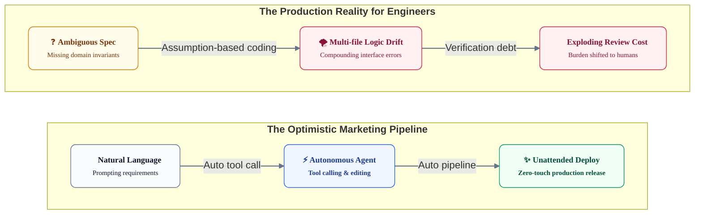
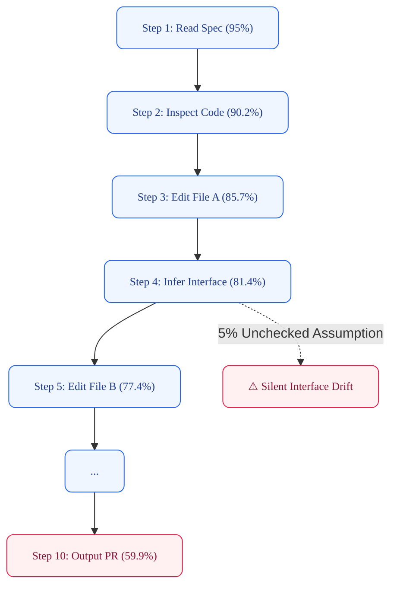
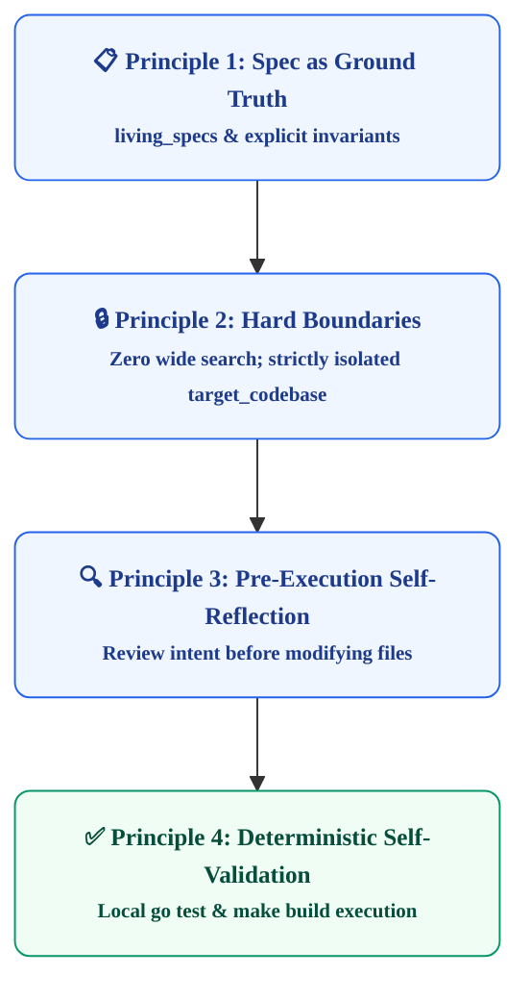

# Redefining Coding Agent Autonomy: Compounding Errors (0.95¹⁰) and Control Harness Architecture

Whenever a new foundation model is announced, the tech industry repeats the familiar slogan: *"A single prompt will take you from idea to production deployment"* or *"The era of autonomous, unattended software engineering has arrived."* From the earliest LLM coding tools to state-of-the-art reasoning models like GPT-6 Astra, Claude 4.5 Sonnet, and Gemini 3 Developer, these rosy promises continue unabated.

Yet for practicing engineers maintaining production systems, daily reality has grown more exhausting. While code generation speed has accelerated exponentially, the cost of verifying correctness, validating edge cases, and ensuring architectural invariants has surged just as drastically. In this article, we analyze the gap between marketing rhetoric and software engineering reality using an empirical compounding error model (0.95¹⁰), and propose harness design principles to transform AI coding agents into reliable, production-grade engineering assets.

---

## 1. Introduction: The Productivity Paradox and Illusion of Autonomy

As coding agents become standard in software development pipelines, a peculiar **productivity paradox** has taken root. An agent can draft hundreds of lines of code in seconds, yet verifying that this code preserves legacy business invariants often takes twice as long as writing it manually from scratch.



### Flashy Demos vs. Enterprise Reality: Closed Simplicity vs. Open Complexity

Social media feeds are flooded with dazzling demo videos: *"Building a 3D game in an afternoon"* or *"Building a CAD tool in two days."* Seeing shader pipelines, physics engines, and complex rendering loops emerge from prompts gives the illusion that AI has already conquered the hardest problems in software engineering.

However, the essence of these demo applications is that they are **self-contained closed systems**. Collision detection or projectile trajectories are governed by explicit mathematical formulas and standard graphics APIs. There are no external stakeholders, no shifting regulatory frameworks, and no decades-old distributed legacy databases.

Here, we must recognize the **Cognitive Inversion** between problems AI solves best and problems human engineers solve best:

* **What AI excels at: Deterministic, Rule-Governed Problems**
  * 3D graphics (shaders, quaternions, linear algebra), physics simulation, compiler AST parsing, and structured data transformation.
  * Inputs, outputs, and state transitions are mathematically bounded. Because correct answers can be verified mechanically without subjective business context, AI can synthesize pre-trained patterns with near-zero error.
* **What Human Engineers excel at: Context-Dependent, Ambiguous Problems**
  * Unwritten organizational tacit knowledge, balancing trade-offs between competing team requirements, and exception handling for tax or compliance changes.
  * There is no single closed formula. Engineers weigh operational cost, team velocity, and business risk to choose the best compromise.
* **The Cognitive Inversion**:
  * Human developers perceive 3D matrix math as "advanced and difficult", while treating "VIP discount tiered pricing" as "trivial common sense."
  * For AI, the exact opposite holds true. Mathematical problems are trivial to compute, while implicit business rules invite unwarranted assumptions, guessing, and silent logical degradation.

| Dimension | Self-contained Demo / 3D App | Enterprise Production System |
| :--- | :--- | :--- |
| **System Architecture** | **Closed System**<br/>Minimal or zero external integrations | **Open Ecosystem**<br/>Dozens of microservices, legacy DBs, external APIs |
| **Requirement Nature** | **Mathematical Invariants**<br/>Linear algebra, rendering loops, frame delta | **Business Rules & Tacit Context**<br/>Settlement policies, tax codes, audit logs |
| **Failure Blast Radius** | **Visual Glitch**<br/>Frame drop or clipping (simple restart) | **Financial & Data Corruption**<br/>Ledger mismatch, transaction deadlock |
| **AI Agent Behavior** | **Pattern Recombination**<br/>High-fidelity recall of algorithmic templates | **Silent Logical Drift**<br/>Unwarranted assumptions corrupting data flow |

---

## 2. Mathematical Reality: The Compounding Error Model (0.95¹⁰)

Why do autonomous agents fail when tasked with multi-step workflows? The root cause is the mathematical law of **compounding probability in sequential execution**.

Suppose an agent possesses an impressive **95% single-step accuracy (p = 0.95)** across file discovery, dependency analysis, code editing, and tool calling. If a task requires an end-to-end chain of 10 sequential sub-actions:

$$P(\text{Success}) = p^{10} = 0.95^{10} \approx 0.5987 \quad (59.87\\%)$$

Across 10 autonomous steps, the cumulative probability of success plunges to **less than 60%**. With 20 steps, it collapses below **35%**:

```text
Step 1:  0.9500  (95.0%)
Step 3:  0.8574  (85.7%)
Step 5:  0.7738  (77.4%)
Step 10: 0.5987  (59.9%)  <-- 40% probability of silent error
Step 20: 0.3585  (35.9%)  <-- Failure is practically guaranteed
```



In an unconstrained autonomous loop, an error at Step 4 is treated as truth in Step 5. By Step 10, the agent has authored hallucinated abstractions that pass superficial lint checks but break production invariants.

---

## 3. The Benchmark Chasm: SWE-bench Verified vs. Pro

Leading model benchmarks reflect this exact drop-off between isolated bug fixing and realistic multi-file development:

| Benchmark | GPT-6 Astra | Claude 4.5 Sonnet | Gemini 3 Developer | Target Scope & Significance |
| :--- | :---: | :---: | :---: | :--- |
| **SWE-bench Verified** | **94.5%** | **93.2%** | **91.8%** | **Localized Bug Fixes**<br/>Single file, 5-10 structured steps |
| **SWE-bench Pro** | **52.4%** | **49.8%** | **46.5%** | **Multi-file Refactoring**<br/>10+ files, long-horizon context retention |
| **Terminal-Bench** | **82.0%** | **80.5%** | **77.8%** | Package builds, CLI execution, tool navigation |
| **LiveCodeBench (v4)** | **78.4%** | **75.2%** | **71.6%** | Novel unseen algorithmic challenges |

Models scoring 94% on SWE-bench Verified fall to ~50% on SWE-bench Pro. Unattended multi-step autonomy is not an engineering reality today; **disciplined harness engineering is required**.

---

## 4. Control Harness Architecture: 4 Principles for Taming Autonomy

To transform coding agents from unpredictable generators into reliable contributors, software organizations must replace "unconstrained autonomy" with **Spec-Driven Harness Architecture**.



### Principle 1: Specification as the Single Source of Truth
Never allow agents to infer business logic from raw source code alone. Code expresses *how* something is implemented, not *why* it was designed that way or *what invariants* must never be violated. Agents must read machine-verifiable specifications (such as OKF indexes or TRDs) before writing code.

### Principle 2: Hard Boundaries (Zero Wide Search)
Broad, recursive scans (`find .`, `grep -r`, `ls -R`) pollute the agent's context window with unrelated files, accelerating cognitive drift. Harness configurations must restrict file access exclusively to the target subsystem.

### Principle 3: Pre-Execution Self-Reflection
Before touching source code or invoking mutation commands, the agent must declare in text:
1. Target files
2. Concrete objective
3. Side-effect mitigation strategy

This forces the model to perform structured chain-of-thought verification before mutating the workspace.

### Principle 4: Deterministic Local Self-Validation
Do not rely on AI self-assessment. Every change must be validated against deterministic local commands:
```bash
cd tools/site-cli && go test -v ./...
make build
git status
```
If tests fail, the harness halts the pipeline immediately (Fail-Fast), preventing errors from compounding into downstream branches.

---

## 5. Conclusion: From Uncontrolled Autonomy to Precision Engineering

The value of AI coding agents does not stem from granting them unchecked freedom to roam production codebases. It comes from **tightening the harness**—giving them unambiguous specifications, precise file boundaries, and deterministic validation gates.

When agents operate inside a well-structured control harness, the compounding error curve flattens. Developers spend less time untangling hallucinations and more time designing scalable architectures. Autonomy is not the absence of constraints; **it is the mastery of automated guardrails**.
