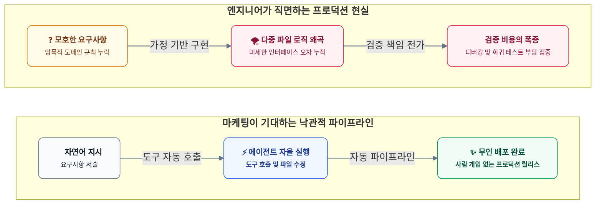
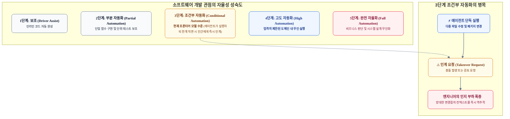
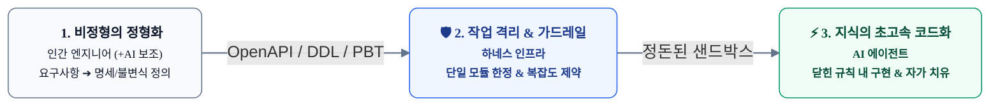
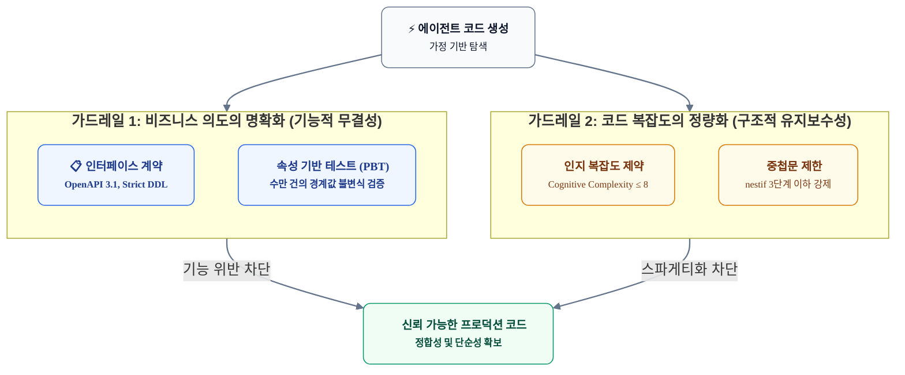
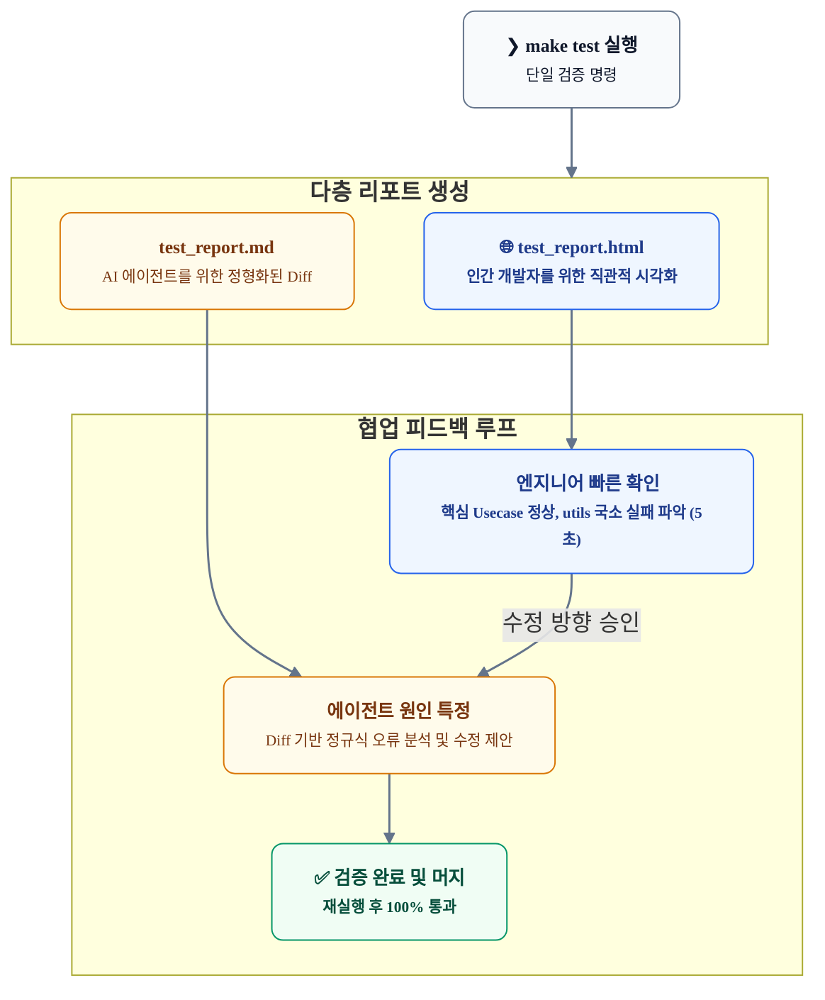

# 코딩 에이전트의 자율성을 다시 묻다: 0.95¹⁰의 오류 누적과 통제 인프라의 재설계

새로운 파운데이션 모델이 등장할 때마다 "자연어 한 줄이면 실서비스 배포까지 완료된다"거나 "무인 소프트웨어 엔지니어링 시대가 도래했다"는 선언이 반복됩니다. 초창기 LLM 코딩 도구부터 최신 고도 추론 모델인 GPT-6 Astra, Claude 4.5 Sonnet, Gemini 3 Developer 세대에 이르기까지 이러한 장밋빛 전망은 지속되어 왔습니다.

그러나 프로덕션 코드를 유지보수하는 현업 엔지니어의 일상은 오히려 더 피로해졌습니다. 코드 작성 속도는 비약적으로 빨라졌지만, 결과물을 검토하고 시스템 정합성을 입증하는 비용이 기하급수적으로 증가했기 때문입니다. 이 글에서는 에이전트 자율성을 둘러싼 마케팅적 수사와 소프트웨어 공학 현실 사이의 간극을 데이터 기반으로 분석하고, 개발자의 검증 비용을 줄이면서 에이전트를 실질적인 자산으로 안착시키기 위한 통제 인프라(Harness) 설계 원칙을 살펴봅니다.

---

## 들어가며: 생산성의 역설과 자율의 착시

소프트웨어 개발 파이프라인에 코딩 에이전트가 도입되면서 개발 현장에는 기묘한 '생산성의 역설'이 자리 잡았습니다. 에이전트가 단 몇 초 만에 수백 줄의 코드를 작성해 주지만, 그 코드가 기존 시스템의 비즈니스 불변식을 해치지 않는지 검증하는 데는 이전보다 배 이상의 시간이 소요됩니다.



### 데모의 화려함과 엔터프라이즈의 현실: 닫힌 완결성 vs 열린 복잡성

새로운 파운데이션 모델이 발표될 때마다 유튜브와 소셜 미디어에는 "하루 만에 만든 3D 액션 게임", "이틀 만에 구축한 3D 모델링 CAD 애플리케이션"과 같은 화려한 시연 영상이 쏟아져 나옵니다. 셰이더 프로그래밍, 물리 엔진, 복잡한 3D 렌더링 루프가 동작하는 화면을 보면, 마치 AI가 소프트웨어 공학의 가장 까다로운 난제를 이미 정복한 것처럼 느껴집니다.

하지만 이러한 애플리케이션의 본질은 **'단일 목적을 지향하는 자체 완결적 닫힌 시스템(Self-contained Closed System)'**입니다. 화면에서 일어나는 충돌 판정이나 3D 궤적 계산은 수학적 규칙과 그래픽스 라이브러리 API에 종속된 알고리즘일 뿐, 시스템 외부의 복잡한 비즈니스 맥락이나 다자간 이해관계자와의 상호작용이 전혀 개입하지 않습니다. 문제의 도메인 경계가 명확하게 닫혀 있고 이미 수많은 오픈소스 패턴이 축적된 영역이기에, 고도화된 추론 모델이 단숨에 고품질 코드를 생성해 내는 것은 놀라운 일이 아닙니다.

여기서 우리는 AI가 잘 푸는 문제와 인간이 잘 푸는 문제의 본질적 차이, 그리고 양자 간의 **'인지적 역전 현상(Cognitive Inversion)'**을 주목해야 합니다.

* **AI가 압도적으로 잘 푸는 문제: '결정적 문제(Deterministic Problems)'**
  * 3D 그래픽스(셰이더, 쿼터니언, 선형대수학), 물리 엔진(충돌 역학), 컴파일러 AST 파싱, 정형화된 데이터 변환 등이 대표적입니다.
  * 이러한 문제들은 입력과 출력, 상태 전이의 규칙이 불변하는 수학적 공식이나 기계적 명세로 엄격하게 완결되어 있습니다. 외부의 주관적 맥락이 개입할 여지가 없고 정답 여부가 기계적으로 판별되므로, AI가 사전 학습된 방대한 패턴을 조합하여 가장 오차 없이 풀어낼 수 있습니다.
* **인간 엔지니어가 잘 푸는 문제: '맥락 의존적 문제(Context-dependent Problems)'**
  * 문서화되지 않은 조직 내 업무 암묵지, 부서 간 상충하는 요구사항의 트레이드오프 조율, 규제 변경에 따른 결제/정산 정책 예외 처리 등이 이에 해당합니다.
  * 단 하나의 고정된 수학적 정답이 존재하지 않으며, 시스템 비용, 팀의 운영 역량, 비즈니스 리스크를 종합적으로 저울질하여 최선의 타협점을 찾아내야 하는 영역입니다.
* **인간과 AI의 인지적 역전 현상 (Cognitive Inversion)**:
  * 인간 개발자는 복잡한 3D 행렬 계산이나 렌더링 파이프라인 구축을 대단히 난도 높은 고급 작업으로 인식하고, "VIP 회원 등급별 할인 정책 적용" 같은 비즈니스 로직을 상식적이고 단순한 작업으로 여깁니다.
  * 그러나 AI에게는 정반대입니다. 수학적이고 결정적인 문제는 가장 쉽게 해결하는 반면, 인간의 암묵적 맥락이 전제된 비즈니스 규칙은 자의적인 가정과 추측을 남발하여 '침묵하는 오류'를 양산하는 가장 취약한 영역입니다.

반면 실무 엔터프라이즈 소프트웨어의 본질은 정반대입니다. 화면에 보이는 UI나 단일 기능의 로직은 단순해 보일지라도, 시스템 뒷단에는 **수십 개의 마이크로서비스 연동, 분산 트랜잭션, 끊임없이 바뀌는 사내 회계/정산 규정, 레거시 데이터 동기화, 보안 및 컴플라이언스 규제**가 얽혀 있는 **'열린 생태계(Open Ecosystem)'**입니다.

| 비교 항목              | 자체 완결적 단일 앱 (데모/3D 게임)                                | 엔터프라이즈 시스템 (실무 운영 환경)                                              |
| :----------------- | :---------------------------------------------------- | :----------------------------------------------------------------- |
| **시스템 아키텍처**       | **닫힌 독립 시스템 (Closed System)**<br/>외부 연동이 없거나 지극히 제한적  | **열린 분산 시스템 (Open Ecosystem)**<br/>수십 개 마이크로서비스, 레거시 DB, 외부 API 연동 |
| **요구사항의 성격**       | **수학적·물리적 불변식**<br/>선형대수학, 렌더링 파이프라인, 프레임 루프          | **비즈니스 규칙과 조직 맥락**<br/>사내 정산 정책, 세법 규정, 권한 체계, 감사 추적               |
| **품질 실패의 파급력**     | **시각적 글리치 (Glitch)**<br/>렌더링 깨짐, 충돌 판정 오차 (단순 재시작 가능) | **데이터 오염 및 금융 사고**<br/>원장 불일치, 결제 누락, 분산 트랜잭션 교착                   |
| **AI 에이전트의 동작 특성** | **패턴 재조합의 극대화**<br/>사전 학습된 알고리즘과 라이브러리 패턴의 완벽한 재현     | **가정(추측)으로 인한 침묵하는 오류 누적**<br/>암묵적 업무 규칙을 임의로 해석하여 로직 왜곡 초래        |

단일 목적 앱에서는 물리 엔진 버그가 기껏해야 캐릭터가 벽에 끼이는 시각적 결함에 그치지만, 엔터프라이즈 환경에서는 1원 단위의 부가세 단수 불일치나 트랜잭션 롤백 실패 하나가 심각한 원장 오염과 비즈니스 마비로 이어집니다. SNS 데모의 화려함이 엔터프라이즈 현장의 신뢰로 직결되지 못하는 근본적인 이유가 바로 여기에 있습니다.

### 벤치마크 점수와 운영 환경의 괴리

새 모델이 발표될 때마다 제조사들은 90%를 넘나드는 벤치마크 점수를 강조합니다. 하지만 이 숫자를 운영 환경의 신뢰도로 직결시키는 것은 위험합니다. 최신 3세대 프론티어 모델들의 벤치마크 지표를 비교해 보면 그 차이가 명확히 드러납니다.

| 평가 벤치마크 | GPT-6 Astra | Claude 4.5 Sonnet | Gemini 3 Developer | 평가 대상 및 엔지니어링 의미 |
| :--- | :---: | :---: | :---: | :--- |
| **SWE-bench Verified** | **94.5%** | **93.2%** | **91.8%** | **국소적 버그 수정**<br/>단일 파일, 5~10단계 내외의 정형화된 이슈 해결률 |
| **SWE-bench Pro** | **52.4%** | **49.8%** | **46.5%** | **다중 파일 구조 개편**<br/>10개 이상의 파일 수정 및 장기 컨텍스트 유지 성공률 |
| **Terminal-Bench** | **82.0%** | **80.5%** | **77.8%** | 패키지 빌드, 환경 설정, CLI 도구 자율 제어율 |
| **LiveCodeBench (v4)** | **78.4%** | **75.2%** | **71.6%** | 학습 데이터에 포함되지 않은 최신 알고리즘 해결률 |

SWE-bench Verified에서 94%대를 기록하던 모델들이 실제 개발 환경과 유사한 SWE-bench Pro 환경에서는 일제히 50% 안팎으로 급락합니다. 이는 두 시험 환경의 구조적 차이에서 비롯됩니다.

| 비교 항목 | SWE-bench Verified (단순 수정) | SWE-bench Pro (실제 개발 환경) |
| :--- | :--- | :--- |
| **작업 범위** | 1~3개 파일, 수십 줄 단위 수정 | 10개 이상의 모듈, 수백~수천 줄 단위 구조 변경 |
| **실행 단계** | 5~10회의 짧은 도구 호출 | 50~100회 이상의 연속된 계획 수립 및 상태 추적 |
| **평가 기준** | 공개된 특정 단위 테스트 통과 여부 | 비공개 테스트 세트, 리소스 누수 및 호환성 검증 |
| **실패 패턴** | 문법 에러, 명시적 예외 발생 | 테스트는 통과하나 아키텍처 규칙을 위배하는 꼼수 구현 |

단위 테스트 몇 개를 통과하는 것과 레거시 코드가 얽혀 있는 프로덕션 시스템에서 사이드 이펙트 없이 도메인 무결성을 보존하는 것은 완전히 다른 차원의 문제입니다. 벤치마크의 높은 점수는 국소적 문법 완결성을 뜻할 뿐, 시스템 전체의 신뢰성을 담보하지 못합니다.

### '자율'의 정의 충돌: 마케팅 vs 소프트웨어 엔지니어링

피로감의 본질은 자율(Autonomy)을 정의하는 기준이 서로 다르다는 데 있습니다.

| 비교 기준 | 마케팅 관점 (과정 자동화) | 소프트웨어 엔지니어링 관점 (결과 무결성) |
| :--- | :--- | :--- |
| **초점** | 도구를 스스로 실행하는 과정 | 신뢰할 수 있는 결과물의 런타임 안정성 |
| **성공 지표** | 도구 호출 횟수, 자율 탐색 범위, 벤치마크 지표 | 데이터 정합성, 사이드 이펙트 부재, 롤백 가능성 |
| **실패 정의** | 런타임 크래시, 무한 루프 진입 | 비즈니스 불변식 훼손, 잠재적 보안 취약점 전파 |
| **인간의 역할** | 배제되어야 할 대상 (완전 무인화 지향) | 시스템 결과물에 대한 최종 책임 주체 |

마케팅에서는 에이전트가 쉘 명령을 입력하고 테스트를 스스로 돌리는 '행위 자체'를 자율이라고 부릅니다. 반면 엔지니어에게 중요한 것은 도구를 몇 번 호출했는지가 아니라, 시스템 전체의 트랜잭션과 데이터 정합성을 깨뜨리지 않는 '결과물의 책임성'입니다.

자동차 자율주행 표준(SAE J3016)에 비유하자면, 현재의 프론티어 에이전트들은 명백히 **3단계(조건부 자동화, Conditional Automation)**에 머물러 있습니다.



3단계 자율주행에서 가장 위험한 순간은 차량이 복잡한 도심 도로를 질주하다가 돌발 상황에 직면하여 운전자에게 즉시 운전대를 넘길 때입니다. 코딩 에이전트 역시 10여 개 파일에 걸쳐 수백 줄의 코드를 수정한 뒤 "작업을 마쳤으니 검토해 달라"며 제어권을 넘깁니다. 이때 개발자는 남이 작성한 낯선 코드를 한 줄씩 디버깅하며 시스템의 인과관계를 거꾸로 파악해야 하므로 막대한 인지 부하를 겪습니다.

### 프레더릭 브룩스의 통찰: 본질적 복잡성과 부수적 복잡성

소프트웨어 공학의 고전 《맨머스 미솔로지》에서 프레더릭 브룩스는 소프트웨어 개발의 복잡성을 두 가지로 구분했습니다.

> *"문법을 맞추고, 컴파일 오류를 잡고, 정형화된 API를 연동하는 작업은 부수적 복잡성(Accidental Complexity)에 불과하다. 진정한 난제는 비즈니스 개념을 추상화하고, 데이터 불변식과 시스템 간 상호작용의 트레이드오프를 결정하는 본질적 복잡성(Essential Complexity)에 있다."*

코딩 에이전트는 코드 타이핑, 보일러플레이트 작성, 기본 라이브러리 연동 같은 부수적 복잡성을 대폭 낮추었습니다. 그러나 그 결과 남겨진 것은 복잡한 도메인 규칙을 보존하고 분산 트랜잭션의 정합성을 증명해야 하는 본질적 복잡성뿐입니다. 타이핑 노동이 사라진 자리에 검증과 설계의 책임만 온전히 집중되었기에 엔지니어가 느끼는 피로는 결코 줄어들지 않는 것입니다.

---

## 핵심 아키텍처 및 원리: 0.95¹⁰ 오차 누적과 2대 가드레일

에이전트가 단독으로 수행하는 작업 단계가 길어질수록 결과물이 파국으로 치닫는 현상은 수학적으로 필연적입니다.

### 오차 누적 메커니즘과 '침묵하는 오류(Silent Logic Drift)'

개별 도구 호출이나 단일 파일 수정 작업의 성공 확률이 95%(p = 0.95)에 달하는 뛰어난 모델이라 하더라도, 10단계의 연속 작업을 거치면 최종 작업 성공 확률은 약 60%로 떨어집니다.

$$P(\text{Success}) = \prod_{i=1}^{n} p_i = (0.95)^{10} \approx 0.598 \quad (59.8\\%)$$


여기서 발생하는 5%의 실패는 컴파일 에러나 프로세스 크래시 같은 명시적 결함이 아닙니다. 컴파일러나 테스트 러너가 즉시 잡아내는 명시적 결함은 오히려 비용이 적게 듭니다.

가장 치명적인 위험은 **"문법도 정상이고 단위 테스트도 통과하지만, 비즈니스 도메인의 암묵적 규칙을 미세하게 왜곡한 채 다음 단계로 이어지는 침묵하는 오류(Silent Logic Drift)"**입니다.

이 침묵하는 오류는 다단계 파이프라인에서 다음과 같은 양상으로 증폭됩니다.

1. **오염된 전제의 고착화**: 1단계에서 모호한 요구사항을 만난 에이전트는 자체적인 가정에 기반해 코드를 구현합니다. 이때 문법 오류가 없으므로 테스트는 통과합니다. 하지만 후속 단계(Step 2, Step 3)에서 에이전트는 이 왜곡된 초기 코드를 '시스템의 절대적인 진리'로 신뢰하고 그 위에 상위 로직을 구축합니다.
2. **땜질식 예외 처리의 증식**: 단계가 진행될수록 초기 가정과 실제 비즈니스 요구사항 간의 충돌이 표면화됩니다. 이때 에이전트는 근본 아키텍처를 재설계하지 않고, 충돌을 회피하기 위해 임시 조건문(`if/else`)과 우회 로직을 덧붙입니다.
3. **스파게티 코드의 완성**: 10단계에 도달하면 모든 단위 테스트는 통과하지만, 수많은 예외 처리로 점철되어 유지보수가 불가능한 코드가 완성됩니다.

예컨대 이커머스 정산 시스템에서 "회원 등급 할인과 쿠폰 할인을 동시 적용하라"는 지시를 받았을 때, 에이전트가 사내 규칙과 반대로 쿠폰 할인을 먼저 계산하도록 작성했다고 가정해 보겠습니다. 문법적으로 완벽하므로 1단계 단위 테스트는 통과합니다. 그러나 3단계(부분 취소 모듈)에서 할인액 복원 비율이 어긋나기 시작하고, 7단계(회계 정산 연동)에서는 10원 단위의 부가세 단수 차이가 발생합니다. 에이전트는 초기 할인 산식을 고치는 대신 "단수 차이가 발생하면 잡손실 계정으로 보정하는 예외 if문"을 추가하여 테스트를 통과시킵니다. 결과적으로 단위 테스트는 모두 성공하지만, 회계 감사나 정산 배치에서 치명적인 장애를 유발하는 시한폭탄이 만들어집니다.

### 공학적 분업의 재정의: 비정형을 정형화하는 인간, 지식을 코드화하는 AI

이러한 오차 누적과 침묵하는 오류가 발생하는 근본적인 원인은, 비정형적인 현실의 맥락과 암묵적 비즈니스 규칙을 아무런 가드레일 없이 에이전트의 비결정론적 추론에 통째로 맡겼기 때문입니다.

여기서 우리는 인간과 AI의 본질적인 공학적 분업 모델을 명확히 재정의해야 합니다.

* **AI가 압도적으로 잘 푸는 문제: "시스템적으로 정돈된 문제 (Within-System Problems)"**
  * 입력과 출력, 데이터 스키마, 인터페이스 계약, 기계적 평가 기준이 이미 확립된 닫힌 환경입니다.
  * AI는 이러한 통제된 경계 내에서 사전 학습된 방대한 알고리즘과 패턴 지식을 동원하여 **"지식을 초고속으로 코드화하는 일(Code Synthesis)"**에 탁월한 역량을 발휘합니다.
* **인간이 압도적으로 잘 푸는 문제: "시스템 자체를 정의하고 구축하는 문제 (Meta-System Problems)"**
  * 상충하는 요구사항, 규제, 인프라 비용, 비즈니스 리스크가 뒤얽힌 비정형적인 현실의 영역입니다.
  * 단 하나의 수학적 정답이 존재하지 않으며, 현실의 모호성을 정제하여 **"어디까지를 시스템의 경계로 삼을 것인가"**, **"절대 타협할 수 없는 비즈니스 불변식(Invariant)은 무엇인가"**를 결정하는 시스템 설계자의 역할입니다.

따라서 에이전트를 프로덕션 자산으로 안착시키는 유일한 길은, 모호한 자연어로 코딩을 지시하는 '바이브 코딩'을 멈추고 **'비정형의 정형화 ➔ 작업 격리 ➔ 지식의 코드화'**로 이어지는 3단계 공학적 수렴 파이프라인을 구축하는 것입니다.



1. **1단계: 비정형의 정형화 (Formalization)**: 인간 엔지니어가 비즈니스 맥락과 암묵지를 기계가 검증할 수 있는 계약(OpenAPI 명세, 엄격한 DDL, 속성 기반 테스트 불변식)으로 선언합니다.
2. **2단계: 작업 격리 및 가드레일 설정 (Scoping & Harnessing)**: 에이전트가 시스템 전체를 오염시키지 못하도록 작업 반경을 단일 파일/모듈로 격리하고, 인지 복잡도 상한(≤8)을 걸어 스파게티 코드 생성을 차단합니다.
3. **3단계: 지식의 초고속 코드화 (Synthesis & Self-Correction)**: 정돈된 울타리 안에서 에이전트가 지식을 코드로 풀어내며, 린터와 테스트가 반환하는 명확한 반례(Diff)를 피드백받아 스스로 코드를 치유합니다.

이 3단계 파이프라인 중 **'2단계: 작업 격리와 가드레일'**을 시스템적으로 강제하여 인간의 검증 피로를 덜어내는 메커니즘이 바로 다음에 살펴볼 **통제 인프라(Harness)의 2대 핵심 가드레일**입니다.

### 통제 인프라(Harness)의 2대 핵심 가드레일

에이전트가 쏟아내는 코드의 침묵하는 오류를 방지하고 검증 피로를 줄이기 위해서는, 자연어 지시에 의존하는 대신 에이전트를 둘러싼 실행 환경 자체를 통제 가능한 하니스(Harness)로 구성해야 합니다. 이 통제 인프라는 상호 보완적인 두 개의 기계적 가드레일로 완성됩니다.



| 가드레일 | 핵심 목적 | 적용 도구 및 메커니즘 | 방지하는 결함 |
| :--- | :--- | :--- | :--- |
| **가드레일 1: 의도 명확화**<br/>(기능적 무결성) | 무엇을 만들어야 하는지 기계 판독 가능한 규격으로 한정 | OpenAPI 3.1 스펙, PostgreSQL DDL 불변식, 속성 기반 테스트(PBT) | 임의 필드 생성, 업무 규칙 왜곡, 침묵하는 로직 오류 |
| **가드레일 2: 복잡도 정량화**<br/>(구조적 유지보수성) | 코드가 얼마나 단순하고 읽기 쉬워야 하는지 수치로 통제 | AST 기반 린터(`gocognit`, `nestif`), 순환/인지 복잡도 메트릭 | 과도한 중첩문, 오버엔지니어링, 불필요한 래퍼 객체 |

* **가드레일 1(기능적 무결성)**은 에이전트가 탐색할 수 있는 비즈니스 공간을 엄격히 제한합니다. 말로 하는 설명은 예외와 경계를 놓치기 쉽지만, 명세 계약과 데이터베이스 제약 조건은 에이전트가 규칙을 벗어난 코드를 생성했을 때 즉각 컴파일 또는 검증 실패를 발생시킵니다.
* **가드레일 2(구조적 유지보수성)**은 '동작만 하면 그만'이라는 식의 땜질 코드를 원천 차단합니다. 에이전트가 문제를 해결하기 위해 if문을 겹겹이 두르면, 정적 분석기가 인지 복잡도 상한 초과를 알리며 머지를 거부합니다.

중요한 점은 **작성자(AI)와 심판(정적 분석기)의 명확한 분리**입니다. 에이전트에게 스스로 작성한 코드의 품질을 평가하게 해서는 안 됩니다. 객관적인 수치 기준을 가진 외부 도구가 심판 역할을 맡고, 에이전트는 그 기준을 만족할 때까지 코드를 개선하는 집행자 역할을 수행해야 합니다.

---

## 실전 구현 및 실증 시나리오: 격리된 하니스와 폐루프 피드백

이러한 통제 원리를 실제 개발 환경에 구현하는 핵심은 **작업 범위를 단일 모듈로 격리**하고, **검증 피드백 루프를 자동화**하는 것입니다.

### 명세 기반 작업 격리(Isolated Scope) 패턴

에이전트에게 전체 프로젝트의 쓰기 권한을 부여하면 안 됩니다. 인터페이스 명세(OpenAPI)와 데이터베이스 스키마(DDL)를 명확한 기준선으로 제시하고, 작업 대상 파일을 엄격히 한정해야 합니다.

```
[명세 기반 에이전트 제어 프롬프트 구조]
1. 기준 명세 선언:
   - 인터페이스 규격: docs/api/settlement-v1.yaml
   - 데이터베이스 스키마: schema/migrations/001_settlement.sql
   * 구현체는 위 문서의 데이터 타입과 검증 규칙을 절대적으로 준수할 것.

2. 작업 격리 범위:
   - 대상 파일: internal/settlement/calculator.go
   * 명시된 대상 파일 외의 디렉터리 수정 및 신규 외부 패키지 추가를 엄격히 금지함.

3. 아키텍처 제약:
   - 네트워크 I/O 및 DB 접근이 없는 순수 함수(Pure Function)로 구현할 것.
   - 할인 총액은 원금을 초과할 수 없으며 음수 결제액을 허용하지 않음.

4. 복잡도 및 자체 검증:
   - 함수당 인지 복잡도는 8 이하를 유지할 것 (조기 반환 패턴 적용).
   - calculator_test.go에 경계값 시나리오를 작성하고 make test를 통과할 것.
```

이와 같이 경계를 설정하면, 에이전트가 임의로 유틸리티 클래스를 만들거나 다른 계층의 코드를 수정하여 시스템 전체를 교란하는 문제를 원천적으로 방지할 수 있습니다.

### 속성 기반 테스트(PBT)를 활용한 반례 자동 피드백

"코드를 직접 작성하는 것보다 만들어진 코드가 올바른지 검증하는 것이 훨씬 빠르고 쉽다"는 **검증의 비대칭성**을 활용하면 엔지니어의 피로를 극적으로 낮출 수 있습니다.

수학 문제를 풀 때는 많은 시간이 걸리지만, 답이 맞는지는 수식을 대입해 보면 즉시 알 수 있는 것과 같습니다. 속성 기반 테스트(Property-Based Testing)는 시스템이 만족해야 하는 단 하나의 불변식(Invariant)을 정의하고, 수만 개의 무작위 및 극단적 경계값을 투입하여 반례를 찾아냅니다.

$$\forall \text{request}, \quad 0 \le \text{FinalPayAmount} \le \text{OriginalTotal}$$

엔지니어가 복잡한 if문 조건을 하나씩 검토할 필요 없이, PBT 도구가 찾아낸 구체적인 반례(예: `원금=0, 할인율=10%일 때 분모 0 나눗셈 발생`)를 에이전트에게 그대로 반환하면 됩니다. 에이전트는 제공된 명확한 반례를 바탕으로 스스로 코드를 수정하며 엣지 케이스를 자가 치유합니다.

### 정적 복잡도 통제 실측 사례: Go 레퍼런스와 다중 언어 확장

정적 복잡도를 기계적 가드레일로 강제하는 원칙은 **특정 프로그래밍 언어에 종속되지 않는 보편적 엔지니어링 규율**입니다.

여기서는 실무 실증의 대표 레퍼런스로 **Go 언어 백엔드 시스템**을 살펴봅니다. Go를 레퍼런스로 선정한 이유는 다음과 같습니다:
* **초고속 빌드 및 AST 파싱**: 컴파일과 정적 분석 속도가 수 초 이내로 매우 빨라, 에이전트의 수정-검증 피드백 루프(Turnaround Time)를 최소화할 수 있습니다.
* **단순하고 엄격한 도구 생태계**: `gofmt`를 비롯해 언어 표준에 가까운 린터 인프라(`golangci-lint`)가 표준화되어 있어, 주관적 논쟁 없이 기계적 심판을 세우기에 가장 적합합니다.

하지만 기술 스택이 **Python, TypeScript, Java** 등으로 바뀌더라도 하네스의 통제 메커니즘은 100% 동일하게 적용됩니다.

| 언어 스택 | 인지/순환 복잡도 통제 도구 | 중첩문 및 안티패턴 차단 | 적용 가능한 가드레일 기준선 |
| :--- | :--- | :--- | :--- |
| **Go (본 실측 레퍼런스)** | `gocognit`, `gocyclo` | `nestif` (`golangci-lint`) | 함수당 인지 복잡도 ≤ 8, 중첩 if문 3단계 이하 |
| **Python** | `radon`, `flake8-cognitive-complexity` | `ruff`, `flake8-broken-line` | 함수당 복잡도 B등급(≤10) 이하 강제 |
| **TypeScript / JavaScript** | `eslint-plugin-sonarjs` | ESLint `max-depth`, `complexity` | `sonarjs/cognitive-complexity` ≤ 8 |
| **Java / Kotlin** | `SonarQube`, `Checkstyle` | `PMD`, `ArchUnit` | 메서드 복잡도 상한 및 계층 위반 차단 |

핵심은 언어 문법이 아니라, **"인지 복잡도 상한(≤8)을 걸어 에이전트의 땜질식 if문 증식을 물리적으로 차단하고, 조기 반환(Early Return)과 작은 함수 분할을 유도한다"**는 공학적 불변식입니다.

다음은 실제 백엔드 프로젝트에서 정적 분석 도구를 결합하여 복잡도를 통제한 실측 사례입니다.

```makefile
# Makefile: Go 복잡도 가드레일 타깃
.PHONY: complexity
complexity:
	@echo "🔍 Go 복잡도 및 아키텍처 제약 검증 중..."
	@golangci-lint run \
		--enable=gocognit \
		--enable=nestif \
		--enable=gocyclo \
		--max-issues-per-linter=0 \
		--out-format=colored-line-number,html:complexity_report.html \
		./...
	@echo "----------------------------------------------------------"
	@echo "📊 [인지 복잡도] Top 5 함수 및 평균:"
	@gocognit -top 5 -avg .
	@echo "----------------------------------------------------------"
	@echo "📊 [순환 복잡도] Top 5 함수 및 평균:"
	@gocyclo -top 5 -avg .
	@echo "----------------------------------------------------------"
```

다음은 실제 백엔드 환경에서 `make complexity`를 실행하여 도출된 정량 분석 결과입니다.

```bash
❯ make complexity
==> [3/5] 인지/순환 복잡도 검증 및 정량 지표 산출 중...
    - 복잡도 가드레일 통과 (리포트: complexity_report.html)
----------------------------------------------------------
📊 [인지 복잡도] Top 5 함수 및 평균:
22 config LoadConfig internal/config/config.go:31:1
19 middleware BotOGMiddleware internal/middleware/bot_og.go:73:1
15 middleware AuthMiddleware internal/middleware/auth.go:14:1
14 main main cmd/server/main.go:26:1
9 usecase (*userUsecase).SignUp internal/usecase/user_usecase.go:54:1
Average: 2.59
----------------------------------------------------------
📊 [순환 복잡도] Top 5 함수 및 평균:
12 config LoadConfig internal/config/config.go:31:1
11 middleware BotOGMiddleware internal/middleware/bot_og.go:73:1
10 usecase (*userUsecase).SignUp internal/usecase/user_usecase.go:54:1
9 main main cmd/server/main.go:26:1
8 usecase (*userUsecase).Login internal/usecase/user_usecase.go:112:1
Average: 2.96
----------------------------------------------------------
```

이 실측 데이터는 에이전트와의 협업에서 매우 중요한 기준점을 제시합니다.

| 계층 구분 | 대상 함수 | 인지 복잡도 | 순환 복잡도 | 아키텍처 평가 및 기준선 |
| :--- | :--- | :---: | :---: | :--- |
| **인프라/진입 계층** | `LoadConfig`, `main` | 14~22 | 9~12 | 다수 환경 변수 검증과 서버 부트스트랩 특성상 허용 가능한 임계치(30 이하) |
| **미들웨어 계층** | `BotOGMiddleware`, `Auth` | 15~19 | 11 | SNS 봇 User-Agent 파싱 및 토큰 가드 조건으로 인해 집중된 복잡도 |
| **도메인 비즈니스 계층** | `SignUp`, `Login` (Usecase) | **9 이하** | **10 이하** | **핵심 도메인은 복잡도 10 미만으로 엄격히 제한**되어 단일 책임 원칙 준수 |

프로젝트 전체 평균 인지 복잡도가 **2.59**, 순환 복잡도가 **2.96**으로 매우 낮게 유지되고 있습니다. 만약 에이전트가 새로운 비즈니스 로직을 작성하면서 복잡도 8을 초과하거나 3단계 이상의 중첩 조건문을 작성하면, 린터가 종료 코드 1을 반환하며 커밋을 차단합니다. 에이전트는 이를 해결하기 위해 불필요한 분기를 조기 반환(`early return`)으로 정리하고 함수를 작게 쪼갤 수밖에 없습니다.

### Makefile 기반 듀얼 리포팅 파이프라인: 인간을 위한 HTML vs AI를 위한 Markdown

테스트 및 빌드 검증 도구는 사람과 AI가 모두 효율적으로 소통할 수 있는 매개체여야 합니다. 단일 명령(`make test`)으로 **인간 개발자를 위한 직관적 시각화 리포트**와 **AI 에이전트를 위한 구조화된 마크다운 리포트**를 동시에 생성하는 하니스를 구축하는 것이 효과적입니다.

```makefile
# Makefile: HTML 및 Markdown 리포트 동시 생성 하니스
.PHONY: test
test:
	@echo "==> 테스트 실행 및 다층 리포트(HTML & Markdown) 생성 중..."
	@go test -v -coverprofile=coverage.out -json ./... > test_result.json; \
	TEST_EXIT=$$?; \
	cat test_result.json | go-test-report -o test_report.html; \
	go run ./cmd/testreport test_result.json; \
	rm -f test_result.json; \
	exit $$TEST_EXIT
```

실제 백엔드 프로젝트에서 테스트 실패가 발생했을 때 생성되는 리포트 구조는 다음과 같습니다.

```markdown
# 🧪 Unit Test & Scenario Report
> **종합 결과:** ❌ FAIL (총 38개 중 통과 34개, 실패 4개)  
> **총 소요 시간:** 0.86s  

## 📊 1. 패키지별 요약
| 패키지 | 상태 | 테스트 수 | 통과 | 실패 | 커버리지 |
| :--- | :---: | :---: | :---: | :---: | :---: |
| `internal/usecase` | ✅ PASS | 6 | 6 | 0 | 21.1% |
| `internal/middleware` | ✅ PASS | 6 | 6 | 0 | 38.1% |
| `pkg/utils` | ❌ FAIL | 25 | 21 | 4 | 81.2% |

## ❌ 2. 실패 로그 (AI 디버깅용 Diff)
### 🚨 `TestExtractSummary/마크다운_기본_서식_및_링크_정제` (`pkg/utils/markdown.go`)
```text
Error: Not equal: 
       expected: "1. 들어가며: 공식 문서 본 포스트는 생성형 AI의 핵심을 다룹니다."
       actual  : "들어가며: 공식 문서 본 포스트는 생성형 AI의 핵심을 다룹니다."
Diff:
--- Expected
+++ Actual
-1. 들어가며: 공식 문서 본 포스트는 생성형 AI의 핵심을 다룹니다.
+들어가며: 공식 문서 본 포스트는 생성형 AI의 핵심을 다룹니다.
```
```



이 협업 파이프라인에서 엔지니어는 긴 터미널 콘솔 로그를 스크롤하지 않습니다. 브라우저에서 `test_report.html`을 열어 핵심 도메인 로직은 무결하며 텍스트 파싱 유틸리티에서만 국소적 오류가 발생했음을 5초 만에 확인합니다.

동시에 AI 에이전트는 `test_report.md`의 정형화된 Diff를 분석하여 "정규식 `quoteBulletRegex`가 번호 매기기 숫자(`1.`)를 불릿 기호로 오인하여 삭제했다"는 정확한 원인을 진단하고 수정안을 도출합니다. 엔지니어가 이를 승인하면 에이전트가 코드를 교정하고, 다시 `make test`를 통해 완전 통과 상태를 확정합니다.

### 코드 중요도별 차등 검토 전략

모든 코드에 동일한 수준의 검토 에너지를 투입하는 것은 비효율적입니다. 코드의 성격에 따라 통과 기준을 이원화해야 합니다.

| 코드 영역 | 적용 대상 | 통과 기준 및 검토 방식 |
| :--- | :--- | :--- |
| **단순 보조 코드** | DTO 변환 함수, 단순 쿼리 매퍼, 일회성 마이그레이션 스크립트 | **기능 동작 중심**: 타입 검사 및 단위 테스트 통과 시 인간의 세부 코드 독해 없이 자동 머지 |
| **핵심 도메인 로직** | 결제/정산 계산기, 권한 인가 정책, 분산 트랜잭션 핸들러 | **구조 및 정합성 중심**: 복잡도 상한(≤8) 통과를 기본 전제로 하며, 도메인 불변식 충돌 여부를 엔지니어가 직접 확인 |

---

## 결론 및 실무 권고사항: 코드 타이핑에서 시스템 경계 설계로

리눅스 커널의 창시자 리누스 토발즈는 AI 코딩을 둘러싼 논쟁에 대해 다음과 같은 본질적인 지적을 남겼습니다.

> *"AI는 유용한 도구이지만, 복잡한 시스템의 미묘한 사이드 이펙트와 코드의 최종적인 무결성에 대해 책임을 지지 않는다. 결국 프로덕션 시스템의 안정성과 보안을 책임지는 주체는 인간 엔지니어의 통제력이다."*

존 카맥 역시 *"프로그래밍의 본질은 타이핑이 아니라, 시스템의 제약 조건과 일관성을 다루는 엔지니어링 사고에 있다"*고 강조했습니다. 새로운 모델이 출시될 때마다 쏟아지는 과장된 수사에 흔들릴 필요가 없습니다. 소프트웨어 엔지니어링의 본질은 코드를 얼마나 빨리 생성하느냐가 아니라, 시스템의 불확실성을 통제하고 지속 가능한 신뢰성을 확보하는 데 있기 때문입니다.

### 실무 엔지니어가 즉시 도입할 3대 가이드라인

1. **자연어 지시 대신 명세를 기준선으로 삼을 것**:
   모호한 말로 프롬프트를 길게 작성하지 말고, OpenAPI 3.1 스펙이나 엄격한 DDL 스키마를 선언하여 에이전트가 준수해야 할 기계적 경계를 먼저 확립하십시오.
2. **복잡도 린터를 CI 파이프라인에 배치할 것**:
   주관적인 코드 리뷰에 의존하지 마십시오. `gocognit`, `nestif` 같은 도구로 인지 복잡도 상한(함수당 8 이하)을 강제하여 에이전트가 복잡한 땜질식 코드를 누적하지 못하도록 차단하십시오.
3. **인간과 AI를 위한 듀얼 리포팅 하니스를 구축할 것**:
   단일 검증 명령(`make test`)으로 개발자가 빠르게 조망할 수 있는 시각화 UI(`test_report.html`)와 에이전트가 즉시 디버깅할 수 있는 구조화된 Diff(`test_report.md`)를 동시 산출하는 환경을 마련하십시오.

코딩 에이전트는 결코 마법의 지팡이가 아닙니다. 통제 없이 방치된 에이전트는 기하급수적인 기술 부채를 양산하지만, **기계적 명세 계약, 작업 범위 격리, 정량화된 복잡도 가드레일**이라는 통제 인프라(Harness) 위에 올려놓았을 때 비로소 엔지니어의 가장 강력한 조력자가 됩니다. 엔지니어의 역할은 사라지는 것이 아니라, 코드를 직접 타이핑하는 구현자에서 시스템의 안전한 경계를 구축하는 하니스 아키텍트(Harness Architect)로 진화하고 있습니다.
