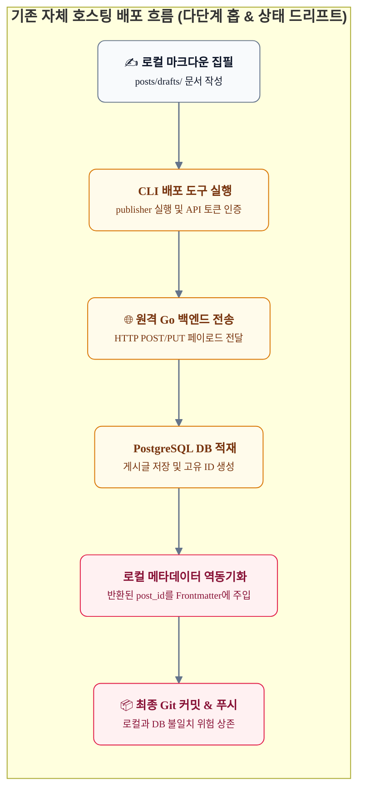
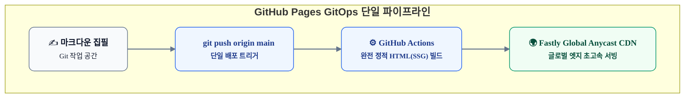
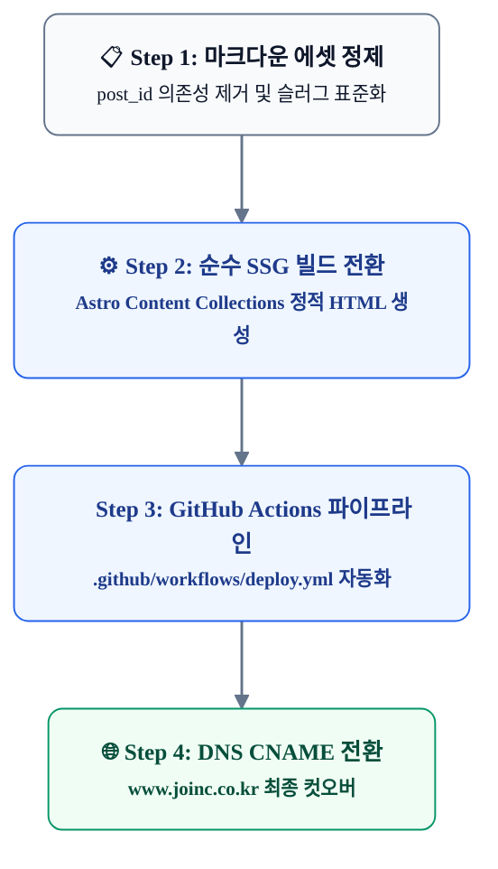

# 부수적 복잡성을 걷어내다: 자체 호스팅 Headless 백엔드에서 GitHub Pages GitOps로의 전환 검토

기술 블로그를 직접 구축하는 엔지니어들은 종종 기묘한 엔지니어링 함정에 빠집니다. "자체 제작한 백엔드 API와 데이터베이스, 정교한 인증 체계를 갖추어야만 진정한 기술 블로그다운 시스템"이라는 기술적 자부심이 그것입니다.

그러나 사이트의 목적이 회원제 서비스나 사내 시스템 연동이 아닌 **'순수 지식 공유와 개인 기술 아티클 발행'**에 있다면, 이러한 자체 인프라는 가치 창출보다는 피로를 낳는 거대한 부수적 복잡성(Accidental Complexity)으로 전락하기 쉽습니다.

본 문서에서는 "웹 상에서의 기술적 렌더링 품질(마크다운, 수식, Mermaid 다이어그램, 코드 하이라이팅)은 양쪽 모두 완벽하게 충족한다"는 기본 전제하에, 기존의 자체 호스팅 Headless 백엔드(Go API + PostgreSQL DB)를 완전히 해체하고 **GitHub Pages 기반의 완전 정적 GitOps 아키텍처**로 전환할 때의 엔지니어링 득실과 마이그레이션 전략을 다각도로 검토합니다.

---

## 들어가며: 개인 테크 블로그의 본질과 저작의 마찰(Friction)

개인 기술 블로그의 궁극적인 존재 이유는 **'양질의 기술적 통찰을 빠르게 집필하고, 방해 요소 없이 전 세계 독자에게 안정적으로 전달하는 것'**입니다.

그러나 자체 백엔드 인프라를 동반한 블로그 운영 환경에서는 글을 한 편 배포할 때마다 다음과 같은 다단계 저작 마찰이 발생합니다.

글 작성자가 신경 써야 할 것은 아티클의 논리적 완결성과 코드의 무결성이어야 합니다. 하지만 자체 백엔드 환경에서는 다음과 같은 운영 부담이 집필 과정을 끊임없이 가로막습니다:

* **이중 관리와 상태 드리프트(State Drift)**: Git 리포지토리의 마크다운 파일과 원격 PostgreSQL DB의 데이터가 서로 다른 생명주기를 가지므로, 배포 CLI 실패 시 양자 간의 데이터 불일치가 발생합니다.
* **불필요한 관리 지점**: Go 백엔드 서버 프로세스의 헬스체크, DB 스토리지 잔여량 점검, 백업 데몬 동작 확인, SSL 인증서 갱신 등 글쓰기와 무관한 시스템 관리가 강제됩니다.
* **상시 인프라 비용**: 트래픽이 전혀 없는 시간대에도 VM 인스턴스와 데이터베이스 스토리지는 상시 가동되어 매월 고정 지출을 유발합니다.

회원 가입이나 비공개 유료 구독 모델이 없는 개인 기술 블로그에서 이러한 시스템은 전형적인 **오버엔지니어링(Architecture Astronauts)**의 산물입니다.

---

## 아키텍처 비교: 자체 호스팅 vs GitHub Pages GitOps

인프라를 GitHub Pages로 이전할 때 아키텍처는 극단적으로 단순화됩니다. 모든 중간 미들웨어와 데이터베이스가 사라지고, Git 리포지토리 자체가 시스템의 유일한 진실 공급원(Single Source of Truth)으로 자리 잡습니다.

| 평가 항목 | 기존 자체 호스팅 (Go + PostgreSQL + CSR) | GitHub Pages GitOps (Pure Static / SSG) | 엔지니어링 시사점 |
| :--- | :--- | :--- | :--- |
| **단일 진실 공급원** | **이원화 (Git + PostgreSQL DB)** 배포 시점 동기화 실패 시 불일치 발생 | **단일화 (Git Repository)** 마크다운 파일 자체가 완벽한 최종 원본 | 데이터 정합성 관리 비용 제로화 |
| **배포 워크플로우** | **다단계 (Git ➔ CLI ➔ API ➔ DB ➔ Git)** 배포 토큰, CLI 도구 의존 | **단일화 (`git push` 단 1회)** 자동화된 GitHub Actions 빌드 | 배포 자동화 및 휴먼 에러 원천 차단 |
| **인프라 유지보수** | **상시 모니터링 필요** OS 패치, 프로세스 크래시, DB 백업 | **관리 공수 0 (Zero-Ops)** 서버리스 글로벌 완전 관리형 | 운영 피로 및 인프라 장애 리스크 소멸 |
| **운영 비용** | **매월 고정 서버/스토리지 비용 발생** | **완전 무료 (0원)** | 영구적인 TCO(총소유비용) 절감 |
| **서비스 가용성** | **단일 VM/서버 가용성에 종속** 서버 재시작 시 일시적 다운타임 | **99.99% 글로벌 고가용성** Fastly 기반 멀티 엣지 CDN 캐싱 | 트래픽 폭증에도 무중단 서빙 보장 |
| **SEO 및 OGP 렌더링** | **CSR 구조로 인한 복잡한 미들웨어 대응** 봇 판별용 OG 미들웨어 별도 가동 | **포스트별 정적 HTML 사전 렌더링** 모든 검색 봇과 SNS 봇에 즉각 노출 | 검색 엔진 노출 및 소셜 공유 극대화 |
| **버전 관리 및 롤백** | DB 롤백과 Git 커밋 롤백을 개별 수행 | `git revert` 후 푸시 시 즉각 롤백 | 시스템 복원력의 극대화 |

---

## 개인 블로그 최적화 전략: 정적 환경의 한계 극복

자체 백엔드를 걷어내면 동적 기능(댓글, 검색, 브랜딩)이 취약해질 것이라는 우려가 있을 수 있습니다. 그러나 최신 정적 웹 생태계는 서버 없이도 개인 블로그에 필요한 모든 기능을 완벽하게 지원합니다.

### 1. 기존 브랜딩 및 도메인 영속성 (Custom Domain & DNS)

* **CNAME 매핑**: GitHub Pages는 커스텀 도메인을 공식 지원합니다.
* 기존 도메인(`www.joinc.co.kr`)의 DNS CNAME 레코드를 `<username>.github.io`로 지정하기만 하면, 기존에 축적된 도메인 신뢰도와 외부 백링크를 100% 온전히 보존할 수 있습니다.
* Let's Encrypt 기반의 무료 SSL/TLS 인증서 자동 발급 및 갱신이 지원되므로 인증서 관리 공수도 사라집니다.

### 2. 가볍고 투명한 댓글 시스템 (Giscus)

* **GitHub Discussions 기반 연동**: 자체 댓글 DB를 운영하면 스팸 봇 방어와 개인정보 보관 책임을 져야 합니다.
* 오픈소스 도구인 **Giscus**를 적용하면 블로그 방문자가 자신의 GitHub 계정으로 댓글을 남길 수 있으며, 모든 댓글 데이터는 리포지토리의 Discussions에 안전하게 누적됩니다.
* 마크다운 렌더링, 코드 블록, 리액션 이모지가 지원되어 개발자 대상 테크 블로그에 가장 이상적인 댓글 환경을 제공합니다.

### 3. 초고속 클라이언트 검색 엔진 (Pagefind)

* **서버리스 정적 색인**: ElasticSearch 같은 무거운 검색 엔진이나 백엔드 LIKE 쿼리 없이도 완벽한 본문 검색이 가능합니다.
* **Pagefind**는 빌드 시점에 마크다운 본문을 파싱하여 수백 KB 단위의 정적 검색 청크(WASM/JS)를 생성합니다.
* 방문자가 검색어를 입력하면 브라우저가 해당 키워드 청크만 네트워크로 가볍게 로드하여 수십 밀리초 이내에 타이핑과 동시에 인라인 검색 결과를 도출합니다.

---

## 실전 마이그레이션 로드맵

현재의 자체 호스팅 구조에서 GitHub Pages로 무중단 전환하기 위한 4단계 실행 계획입니다.

### [Step 1] 마크다운 Frontmatter 및 에셋 경로 정제
* `posts/**` 하위 마크다운의 Frontmatter에서 레거시 DB 의존 필드인 `post_id`를 제거하거나 선택 필드로 변경합니다.
* 파일명 기반의 영문 슬러그(예: `redefining-ai-coding-agent-autonomy`)를 공식 URL 경로로 채택합니다.
* 이미지 에셋이 상대 경로(`assets/**`)로 정적 번들러에 정확히 포함되도록 링크를 검증합니다.

### [Step 2] 프론트엔드 엔진의 순수 정적(SSG) 모드 활성화
* Astro의 인위적인 CSR 제약(`posts/detail?id=x` 런타임 Fetch)을 해제하고, Astro의 네이티브 **Content Collections (`getStaticPaths`)**를 활성화합니다.
* 기존에 검증된 Astro UI 컴포넌트, CSS 스타일, 다크모드, Mermaid 렌더링 스크립트를 그대로 유지한 채 빌드 결과물이 `dist/` 디렉터리에 순수 HTML 파일로 구워지도록 구성합니다.

### [Step 3] GitHub Actions 자동 배포 파이프라인 구축
* `.github/workflows/deploy.yml`을 작성하여 `main` 브랜치에 푸시가 발생할 때마다 자동으로 Node 환경 세팅 ➔ `npm run build` ➔ `actions/deploy-pages`를 통해 배포가 완결되도록 선언합니다.

### [Step 4] DNS CNAME 전환 및 컷오버(Cut-over)
* 리포지토리 설정(Settings ➔ Pages)에서 Custom domain에 `www.joinc.co.kr`을 등록합니다.
* 도메인 네임서버의 DNS CNAME 레코드를 GitHub Pages 주소로 교체하고 HTTPS 인증서가 정상 발급되는지 확인한 후 기존 백엔드 VM을 안전하게 폐기합니다.

---

## 결론: 단순함이야말로 최상의 아키텍처

소프트웨어 엔지니어링의 진정한 우아함은 시스템의 덩치를 불리는 것이 아니라, **목적 달성에 불필요한 레이어를 과감히 도려내어 시스템을 가장 단순한 상태로 만드는 것**에 있습니다.

회원 관리나 사내 서비스 연계가 필요 없는 개인 기술 블로그에서 자체 백엔드 서버와 데이터베이스는 관리해야 할 장애 요인이자 부채일 뿐입니다. 

GitHub Pages로의 전환은 기술적 타협이나 후퇴가 아닙니다. **Git이라는 가장 견고한 버전 관리 시스템을 단일 진실 공급원으로 삼아 저작의 마찰을 없애고, 글로벌 엣지 인프라 위에서 무중단·무비용으로 지식을 퍼뜨리는 가장 현대적이고 실리적인 아키텍처 다이어트**입니다.
